# WWDC 21 - 探索Swift结构化并发

本文基于 [Session 10134](https://developer.apple.com/videos/play/wwdc2021/10134/) 梳理

Swift 5.5 引入了一种编写并发程序的新方法，使用了结构化并发的概念。 结构化并发背后的思想是基于结构化编程的，那什么是结构化编程？

## 结构化编程

在计算机编程的早期，程序很难阅读，因为它们是按照指令序列编写的，其中允许使用 goto 让控制流到处跳转。我们今天看不到这一点，因为现在的编程语言使用结构化编程使得控制流更加统一。 例如，if-then 控制流，它指定 CPU 仅在满足条件时执行嵌套的代码块。 在 Swift 中，代码块也遵守静态作用域，这意味着变量名只有在其定义的封闭代码块中才可见，这也意味着块中定义的任何变量的生命周期都将在离开块时结束， 因此，静态作用域使变量生命周期易于理解。结构化控制流可以自然地将代码块按顺序排列、嵌套、组合在一起，对比早期使用的 goto，它可以使我们从上到下阅读整个程序的过程非常顺畅。 但是现在的程序需要异步和并发，这些却并没有使用结构化编程的思想来简化代码。

> 注：结构化编程的定义可以参考 [Wikipedia](https://en.wikipedia.org/wiki/Structured_programming)，它是一种编程范式，旨在通过使用选择（if/then/else）、重复（while 和 for）、块结构（block）和子程序（subroutine）的结构化控制流来提高计算机程序的清晰度、质量和开发时间 。
>
> 结构化编程重要的意义是提高了代码的可维护性和开发效率。Swift 在引入 async/await 关键字前，异步编程经常会出现深层嵌套的回调函数（callback hell），这使得代码很难维护，违背了结构化编程的思想

举一个例子， 以下代码从互联网上获取一堆图像并将它们按顺序调整为缩略图。fetchThumbnails 函数在调用时没有返回值，只能将其结果或错误传递给 completion handler。 此函数不能使用结构化控制流进行错误处理。 此外，它还必须使用递归无法使用循环。

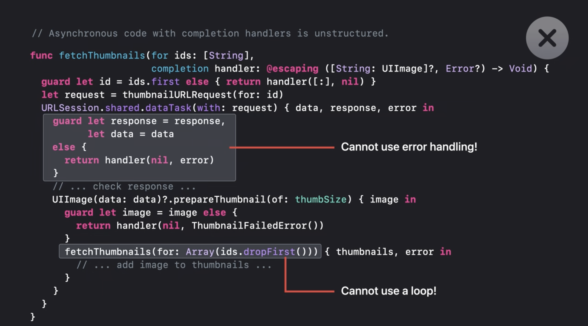

以下是使用新的 async/await 语法进行了重写的代码。fetchThumnails 函数中完成了如下变化使得代码结构更加清晰简化

- fetchThumbnails函数有了返回值。

- 删除了 Completion handler 参数并且在类型签名中使用“async”和“throws”。

- 在函数体中，我们使用“await”表示异步操作发生，并且之后运行 的代码不需要嵌套在回调函数体中。

- 现在可以使用 for 循环遍历缩略图从而按顺序处理它们。

- 我们也可以抛出和捕获错误，编译器会进行检查。

  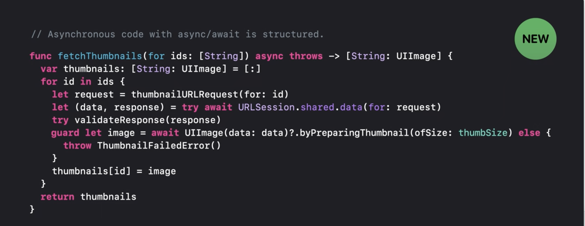

要深入了解 async/await，请查看 [Session 10132 “在 Swift 中认识 async/await”](https://developer.apple.com/videos/play/wwdc2021/10132/)。

## 任务

如果您要为数千张图像生成缩略图呢？一个一个按顺序处理太慢。另外，如果每个缩略图的尺寸必须从另一个 URL 下载，而不是固定大小怎么办？我们可以创建多个任务，可以并行进行下载。任务是 Swift 中的一项新功能，可与异步函数协同工作。任务提供了一个新的执行上下文来运行异步代码。每个任务相对于其他执行上下文并发运行。在安全且高效的前提下，任务会并行运行。由于任务已深度集成到 Swift 中，因此编译器可以帮助检测并防止一些并发错误。另外，调用异步函数不会创建新任务，必须显式创建任务。 

> 注：并发（concurrency）和并行（parallelism）是两个不同的概念。并发注重多任务的处理能力，可以分时执行。并行强调多任务同时运行的能力。所以单核 CPU 可以并发但却不能并行。

Swift 中有几种不同风格的任务，下面会一一介绍。

### Async-let 任务

它是用 async-let 的新语法创建的。普通 let 绑定执行过程，有两部分：运行等号右边的初始化表达式和绑定左边的变量名。在 let 之前或之后可能还有其他语句。一旦 Swift 执行到 let 绑定，初始化表达式会被执行并且产生一个值。这里产生的值是从 URL 下载数据，下载完成后，Swift 会将下载的数据绑定到变量名，然后继续执行后面的语句。这里只有一个执行流程，由于下载可能需要一段时间，我们希望程序下载数据的同时可以异步执行其他工作，直到实际需要数据时，才等待数据下载完成。为此，Swift 引入了 async-let 并发绑定。并发绑定的执行有很大不同，为了执行并发绑定，Swift 将首先创建一个新的子任务。因为每个任务都代表一个程序执行的上下文，所以程序控制流会出现两个分支，第一个分支用于子任务，它将立即开始下载数据。第二个分支用于父任务，它将立即将 result 变量名绑定到一个占位符，然后执行后续的程序语句。 在到达需要实际结果的表达式时，父任务将等待子任务的完成。由于下载过程可能会抛出错误，我们需要用 “try await” 来等待下载完成，result 变量一旦绑定下载的数据，再次读取它的值不会重新下载数据。

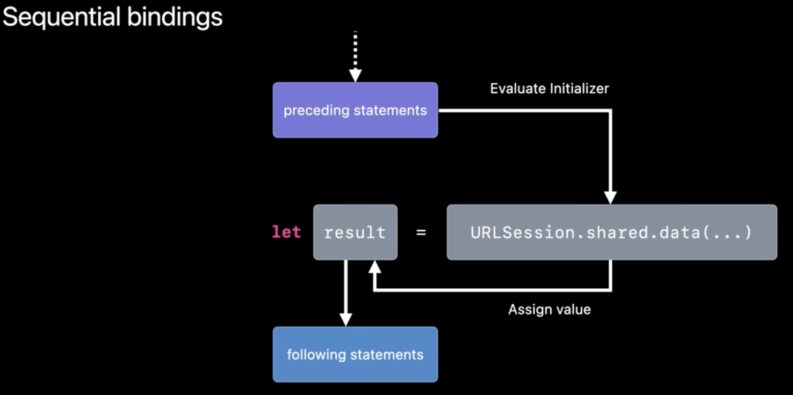

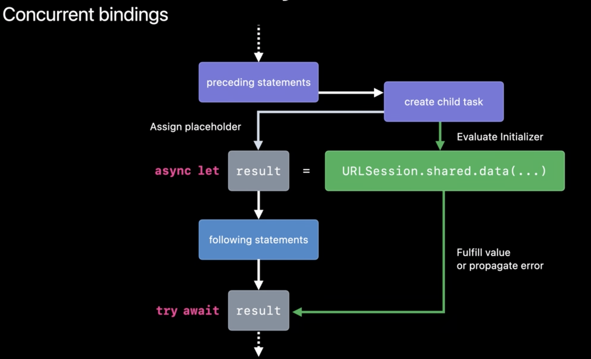

接下来看看代码实现，我们从两个不同的 URL 同时下载数据：一个用于全尺寸图像本身，另一个用于元数据。为了让这两个下载同时发生，在这两个 let 前面写上 “async” 。由于下载现在发生在子任务中，只有在使用并发绑定的变量时，父任务才会观察到下载的结果或者发生的错误，因此，在表达式读取元数据和图像数据之前用了 “try await”。

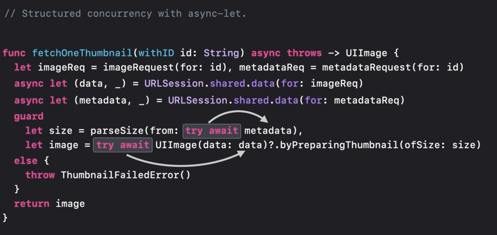

> 注：通过 async-let 的语法设计，我们可以发现，Swift 在设计时不仅仅考虑并发的需求，同时也考虑了并行的需求，这样使得代码的表达更加简单灵活。对比 Javascript，async/await 和 web worker 采用是两套不同的设计来应对并发和并行的需求。当然编程语言会受到其运行环境的制约，Javascript 通常运行在单线程模型上，而 Swift 却没有这种约束。

### 任务树

我一直在谈论的这些子任务实际上是任务树的一部分，任务树会影响任务的属性，例如任务取消、任务优先级和任务局部变量。调用一个同步或者异步的函数，不会改变当前运行的任务，只有显式创建任务时，比如使用 async-let，才会改变当前任务。在上面的例子中，函数 fetchOneThumbnail 继承了调用方任务的所有属性。当使用 async-let 时，它会在当前任务下创建一个子任务。任务树由每个父任务与其子任务之间的链接组成。父任务只有在其所有子任务都已完成后才能结束工作，即使进入异常处理，该规则也适用。还是看上面的例子，如果第一个下载任务抛出错误，fetchOneThumbnail 函数也必须抛出该错误并退出，但是第二个下载的任务会发生什么？在非正常退出时，Swift 会自动将取消正在执行的子任务，也就是第二个下载任务会被标记为已取消，然后等待它完成再退出函数。将任务标记为已取消不会停止该任务，它只是通知任务我们不再需要它的执行结果。当一个任务被取消时，该任务的所有子任务也将被自动取消。因此，如果 URLSession 创建了自己的任务来下载图像，那么这些子任务也会被标记为取消。一旦直接或间接创建的所有结构化任务完成，函数 fetchOneThumbnail 就会抛出错误最终退出。这种保证是结构化并发的基础。它通过帮助我们管理任务的生命周期来防止意外泄漏任务，就像 ARC 自动管理内存的生命周期一样。

> 注：任务取消的设计延续了 Apple 在 NSOperation 上的设计思路，NSOperation 的缺点是 NSOperation 之间的依赖关系是一张图，而不是一棵树，已取消的状态无法传播，也没有办法防止依赖循环的出现，这在任务树的设计上被很好的解决了。

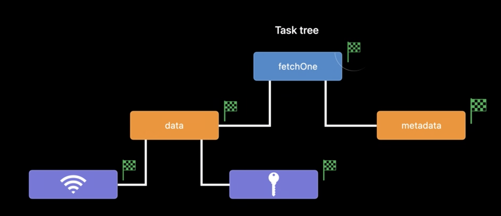

如果任务处于重要事务的执行中或持有未关闭的网络连接，立即停止任务是不正确的（会产生资源泄露和数据一致性的问题）。这就是为什么 Swift 中的任务取消是协作式的（不像操作系统那样可以强制中断任务）。代码必须明确检查取消状态然后自行结束执行。我们可以在任何函数内检查当前任务的取消状态，无论它是否是异步的。尤其是当任务涉及长时间运行的计算时，我们应该在实现中考虑任务取消的情况。下面我们来看看如何检查任务取消状态。

> 注：Swift 并发是协作式并发，而不是抢断式的，这样会把任务的调度控制权部分转移到程序员手里，而不是完全由操作系统控制。因此，在写程序的时候，尤其是长时间运行的计算，需要格外小心。

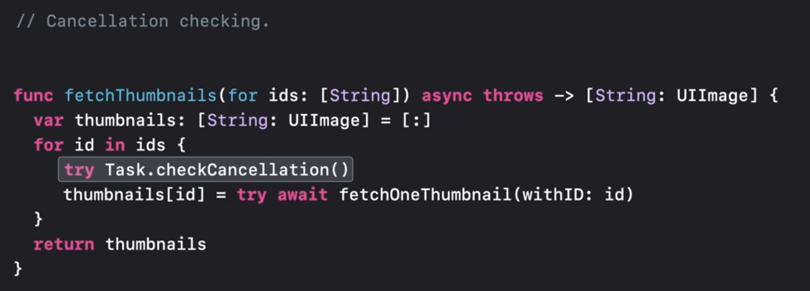

如果已经创建的 fetchOneThumbnail 任务取消，我们不想创建更多无用的下载任务。所以我可以在每次循环迭代开始时调用 checkCancellation，如果当前任务已被取消，那么 checkCancellation 就会抛出错误。当然我们也可以返回部分结果，代码如下。当然必须确保 API 明确说明可能会返回部分结果，否则，任务取消可能会触发致命错误。

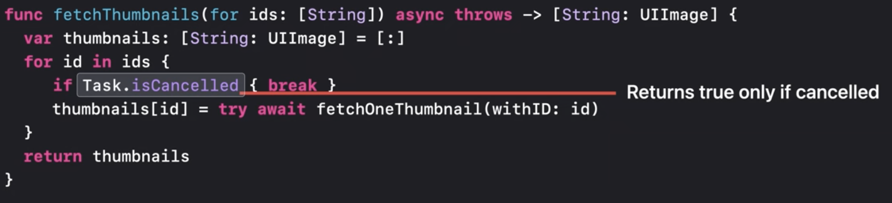

### 组任务 Group Task

async-let 适合发起固定数量的并发任务。当并发任务数量不确定时，就需要用到组任务了。还是之前的例子，如果我们希望在循环中可以同时获取所有缩略图，此时并发量不是静态已知的，因为它取决于数组中的 ID 数量。任务组正适合这种情况，因为它可以提供动态并发量。我们可以调用 withThrowingTaskGroup 创建任务组，添加到组中的任务不能脱离 withThrowingTaskGroup 闭包的范围，在闭包中可以通过传入的 group 变量创建动态数量的任务。一旦创建，子任务将立即开始并行执行。当 group 超出使用范围时，组任务将隐式等待其中的所有任务完成并退出，因为组任务也是结构化的。

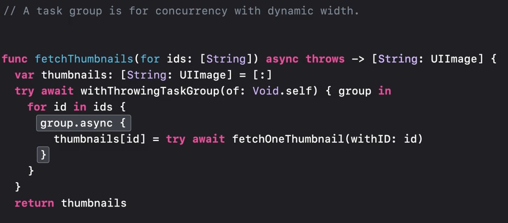

每次循环我们会通过 group.async 创建一个子任务并调用 fetchOneThumbnail，fetchOneThumbnail本身将使用 async-let 创建另外两个子任务。我们可以在组任务中使用 async-let 或在 async-let 任务中创建任务组，任务树中的并发层级结构将自然形成，这是结构化并发的另一个很好的特性。现在，这段代码编译还是有问题的，编译器会提醒我们注意数据竞争问题。问题是每个子任务都会将缩略图插入到字典中，这个字典一次不能处理多个访问，如果两个子任务尝试同时插入缩略图，可能会导致崩溃或数据损坏。（注：这里看似不会有数据竞争的问题，因为每个子任务添加到字典中的数据 ID 不同。但如果写入字典时发生 rehash 或者不同的 ID 出现哈希冲突的情况，不同的任务就可能对同一块内存地址进行写入）以前，我们必须自己调查这些错误，但 Swift 提供了静态检查来首先防止这些错误发生。每创建一个新任务时，该任务执行的工作都在称为 @Sendable 闭包的中运行。 @Sendable 闭包是被禁止捕获可变变量的，因为这些变量可以在任务启动后进行修改。这意味着在任务中捕获的值必须可以安全共享。例如，值类型，如 Int 和 String，或者设计为可从多个线程访问的对象，如 Actor 和实现自己同步机制的类。详情参见（ [Session 10133 用 Swift Actor 保护可变状态](https://developer.apple.com/videos/play/wwdc2021/10133/) ）。为了避免示例中的数据竞争，可以让每个子任务返回一个值。父任务可以使用新的 for-await 循环遍历每个子任务的结果。 for-await 循环按完成顺序从子任务中获取结果。由于此循环按顺序运行，因此父任务可以安全地将每个键值对添加到字典中。任何类型只要实现了 AsyncSequence 协议，就可以使用 for-await 来遍历它们。详情参见 （[Session 10058 Meet AsyncSequence](https://developer.apple.com/videos/play/wwdc2021/10058)）。

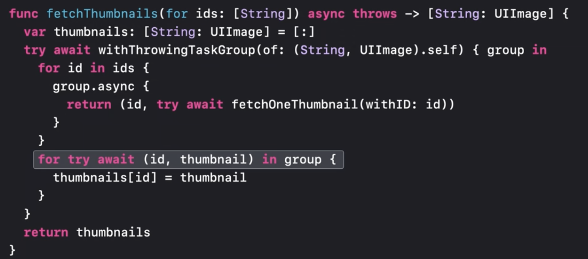

组任务和 async-let 任务实现任务树规则方面存在细微差别。假设在遍历该组的结果时，我遇到了一个子任务出错。因为错误会抛出到 group 变量作用域之外，所以组中的所有任务都将被隐式取消，然后程序会等待他们完成，这点和 async-let 一样。差别在于当 group 变量正常退出作用域时，这时候取消不是隐式的。退出代码块之前，还可以使用 group 变量的 cancelAll 方法手动取消所有任务。

> 注：这里可能有点难理解，假设这个例子里没有 for-await，当所有的子任务启动后，group 变量就离开作用域了，如果是 async-let 任务，因为离开了作用域，任务会被取消，但在这里任务组不会因为 group 变量离开作用域而取消。试想一下，我们可能会开启一些后台下载的任务，这些任务数量不固定，下载后会用不同的文件名写入磁盘，这里不会产生数据竞争，我们也不需要等待所有任务完成，如果 group 离开作用域后任务就取消了，那就没办法适应这种需求了。

### 非结构化任务

在向程序中添加任务时，并不总是需要层次结构。 Swift 还提供了非结构化的任务，但需要更多的手动管理。在很多情况下，任务可能不属于清晰的层次结构。最明显的例子是，当我们尝试从同步运行代码中启动一个任务执行异步计算时，我们可能根本没有父任务，或者，任务的生命周期不适合单个作用域甚至单个函数的范围。在 AppKit 和 UIKit 中实现 delegate 对象时经常出现这种情况。 UI 工作必须在主线程上进行，Swift 通过声明属于 @MainActor 的 UI 类来确保这一点。假设我们有一个 CollectionView，但我们还不能使用 CollectionView 的 datasource API。我们想使用我们刚刚编写的 fetchThumbnails 函数从网络中获取缩略图提供给 CollectionViewCell。然而，delegate 方法是同步的，我们不能直接使用 await 等待 fetchThumbnails结束。我们需要为此启动一个任务，但该任务实际上是我们为响应 delegate 操作而启动的扩展任务。我们希望这个新任务仍然以 UI 优先级在 MainActor 上运行。我们只是不想将任务的生命周期绑定到这个单一 delegate 方法的范围内。对于这种情况，Swift 允许我们构建一个非结构化的任务。让我们将代码的异步部分移动到一个闭包中来构造一个异步任务。在运行时，当我们到达创建任务的点，Swift 将安排这个闭包在与原始作用域相同的 actor 上运行，在这种情况下是 MainActor。同时，控制权立即返回给调用者。缩略图任务将在主线程上稍后运行，而不会在 delegate 方法上阻塞主线程。（注：类似调用DispatchQueue.main.async）以这种方式构建任务使我们介于结构化和非结构化代码之间。直接构造的任务仍然继承其启动上下文的actor，并且还继承源任务的优先级和其他特征，就像组任务或 async-let 一样。但是，新任务是没有作用域的。它的生命周期不受其启动时所在的范围限制。我们可以在任何地方创建一个无作用域的任务，这样很灵活，但我们必须做更多手动管理，因为任务取消状态和错误不会自动传播。如果要等待非结构化任务的结果，我们必须显示声明。

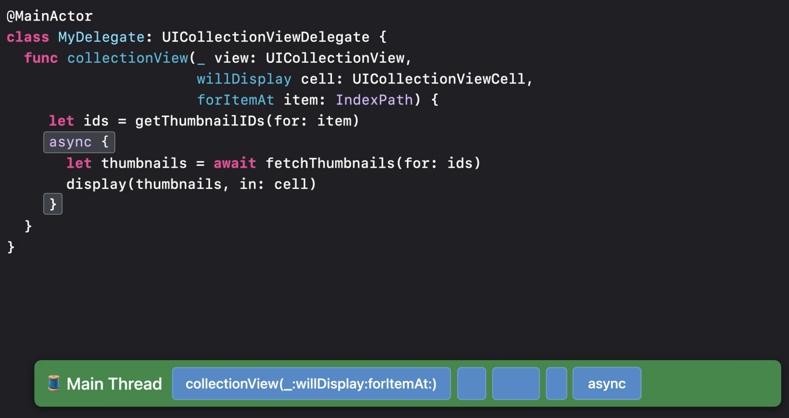

当显示一个 CollectionView Cell 时，我们启动了一个获取缩略图的任务，如果在缩略图准备好之前，此 Cell 滚动到视图之外，我们也应该取消该任务。由于我们要处理一个无作用域的任务，因此必须手动取消。任务构造好之后，我们把 Task Handle 保存到字典中，以便我们稍后可以使用它来取消该任务。我们还应该在任务完成后将其从字典中删除，这样如果任务已经完成，我们就不会尝试取消它。注意，这里不会有数据竞争，MyDelegate 类绑定到 MainActor，而新任务继承了这一点，因此它们永远不会并行运行，也不会出现数据竞争。我们可以安全地访问此任务中 MainActor 绑定类的存储属性，而不必担心数据竞争。同时，如果我们的 Delegate 稍后被告知CollectionView Cell 不再显示时，那么我们可以调用 Task Handle 的 cancel 方法来取消任务。

> 注：因为非结构化任务没有任务树管理，我们需要自己创建数据结构来管理任务，这个例子演示了怎么去管理 Task Handle

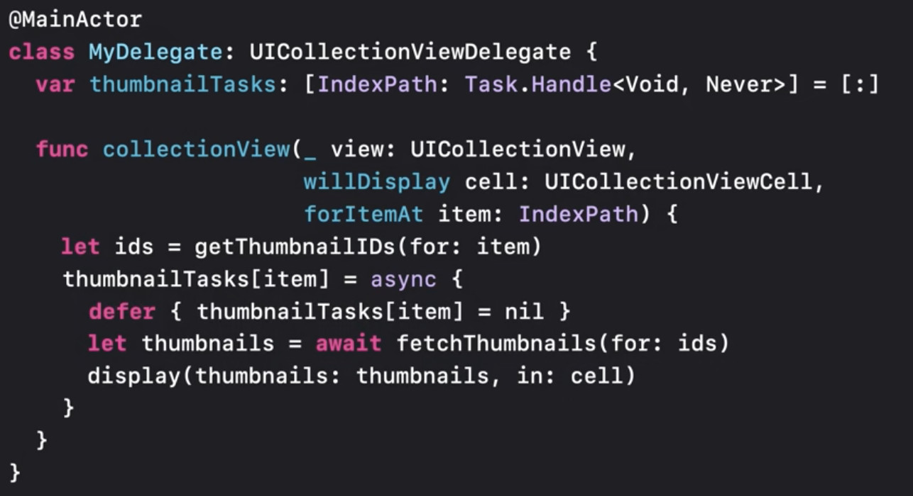

### 分离任务 Detached tasks

有时我们不想从原始上下文中继承任何内容，为了获得最大的灵活性，Swift 提供了分离任务。顾名思义，分离任务独立于它们的初始化时的上下文。它们仍然是非结构化的任务。它们的生命周期不受其原始代码范围的约束。但是分离任务也不会从其原始范围中继承任何东西，比如 MainActor，默认情况下，它们不受同一 actor 的约束，也不必以启动时相同的优先级运行。分离任务可以通过启动时的可选参数，来控制任务的执行方式。

假设我们从服务器获取缩略图后，我们想将它们写入本地磁盘缓存。缓存写入的操作不需要在 MainActor 上执行。因此，我们可以使用分离任务来启动缓存操作。缓存应该在较低优先级下运行，我们可以在启动这个新任务时指定为后台优先级。如果我们要在缩略图上执行多个后台任务，我们可以使用更多的后台任务，但我们也可以在分离任务中利用结构化并发，将所有不同类型的任务结合在一起。我们可以设置一个任务组并将每个后台作业作为子任务在该任务组中启动，而不是为每个后台作业分离一个独立的任务。这样做有很多好处。如果我们需要取消后台任务，使用任务组意味着我们可以通过取消该分离任务来取消所有子任务，不需要记录 Task Handle 数组。此外，子任务会自动继承其父任务的优先级，所有这些工作都在后台进行，这利用了结构化任务的自动传播，因此我们不必担心忘记设置后台优先级和意外争抢主线程资源。

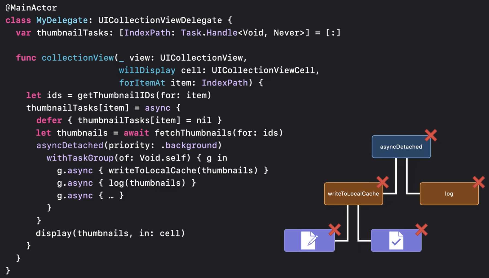

## 总结

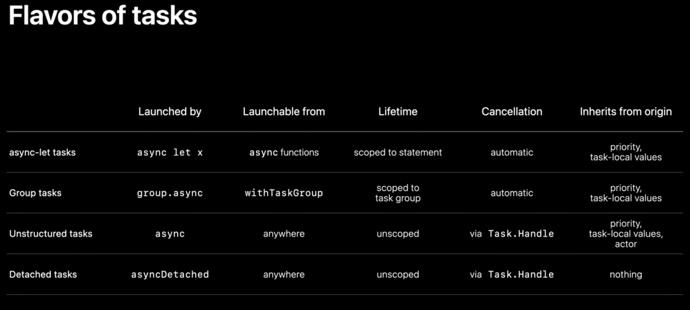

至此，我们已经看到了 Swift 中所有主要的任务形式。 Async-let 允许产生固定数量的子任务作为变量绑定，如果绑定超出范围，可以自动管理取消和错误传播。当我们需要动态数量但运行范围有限的子任务时，我们可以使用任务组。如果我们需要中断一些范围不明确但仍与其原始任务相关的工作，我们可以使用非结构化任务，但我们需要手动管理它们。为了获得最大的灵活性，我们还有分离任务，它们不会从它们初始化的地方继承任何东西。所有这些功能结合在一起，使在 Swift 中编写并发代码变得简单而安全，让我们编写的代码充分利用设备的能力，同时仍然专注于应用程序的有趣部分，更少考虑管理并发任务的机制或担心由多线程引起的潜在错误。

> 注：现代编程语言越来越注重横向扩展（horizontal scaling）和并发。我们可以依赖操作系统，通过线程来管理并发任务，但这种做法会将任务数据记录在内核空间，在用户空间和内核空间切换会有一定的性能损耗，这种做法也越来越无法适应大并发量的需求。Swift 并发任务的设计把任务数据从内核空间转移到了用户空间，不仅使编写异步程序更清晰简单，也能增强运行效率，符合语言发展的大趋势。类似的，C++20 和 Kotlin 也都引入了 coroutine 来改善编写异步程序，相比较而且，Swift 的并发 API 非常简单易用，任务树的结构也简化了任务管理。（C++因为没有运行时，所以coroutine API 异常复杂，Kotlin 和 C++ 都没有任务树）

