# WWDC21 - 在 iOS 中给 Safari 开发插件

>  本文基于 [session 10104](https://developer.apple.com/videos/play/wwdc2021/10104/) 整理。作者：素燕(Lefex)，毒舌程序员，擅长 iOS 与前端开发，正在写 [前端小课](https://lefex.gitee.io/)，[GitHub](https://github.com/lefex)

对于 iOS 工程师来说，你可能没开发过浏览器插件，但是一定用过浏览器插件，比如我的 Chrome 浏览器中安装了一个 [json-viewer](https://github.com/tulios/json-viewer) 插件，它可以把 json 数据进行格式化并高亮显示。在 Mac 中，  Safari 虽然也有它自己的插件，不过它生态相比 Chrome 逊色很多，几乎很少有人会用 Safari 插件，值得注意的是，2020 年苹果宣布 Chrome 插件也可以安装到 Safari 中，也就是说你为 Chrome 开发的插件也可以安装到 Safari，这一举措为 Safari 插件的生态发展迈出了重要的一步。

浏览器插件如同一把利剑插入到网页中，可以对网页进行一些操作，比如可以给某个网站添加一个菜单，用来操作网页中的数据，也可以写一个抢票插件，总之一些自动化的操作都可以通过插件来实现。以前浏览器插件只能运行在 PC 端，本文介绍如何为手机中的 Safari 开发插件。如果，你使用的是 iOS15 ，可以在手机中体验浏览器插件。

### 创建浏览器插件

以前我开发了一个插件 Sea Creator，它可以把网页中海洋里的动物名字替换为 emoji 表情，它以前只能运行在 iPad 和 Mac 上，今天我把它移植到 iOS 上。

我们先在 ipad 体验一下，主要操作流程如下：

1、先安装 Sea Creator，如同安装 app 一样，需要在 AppStore 中安装；

2、打开 Safari 浏览器，点击更多按钮，选择扩展菜单，此时会弹出所有安装的插件；

3、点击开启按钮；

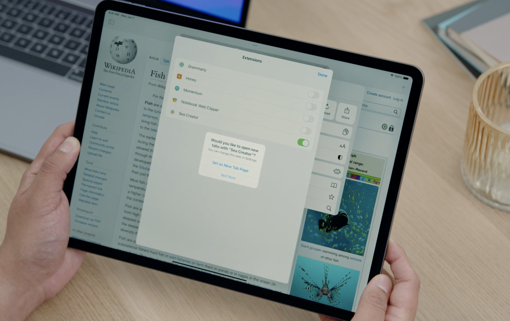

完成上面的操作后，可以看到网页中鱼的名字被替换成了 emoji 表情，并且有个气泡提示总共有多少单词被替换了，这个气泡称为 pop-page ，后面会用到。当你点击链接，跳转到新的页面时，插件会一直工作，无需重新开启。是不是很 cool！

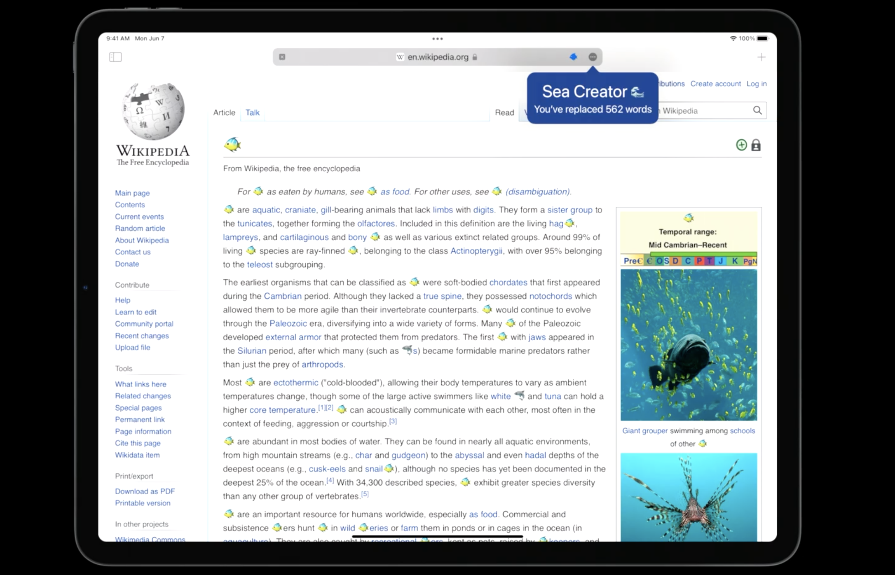

当打开一个新的空白页面时，会显示到目前为止总共发生了多少次替换，这个页面被称为 tab-page：

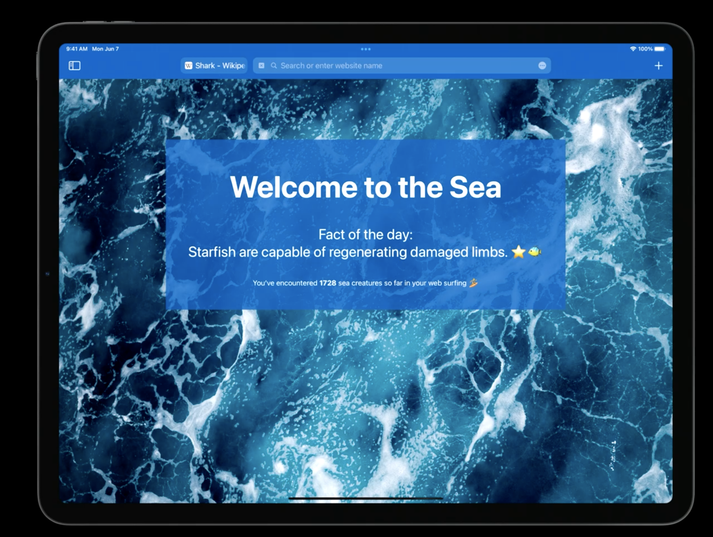


上面为大家演示了这个插件的主要功能，接下来我们看下如何把这个插件移植到 iOS 上。

即使你以前没有开发过浏览器插件也没关系，这节内容我会详细讲解浏览器插件的运行原理、开发流程、最佳佳实践和调试技巧，最后还会介绍一下浏览器插件中的用户隐私问题。有一点需要注意， 浏览器插件也是应用程序的一种，如果想使用浏览器插件，需要到 AppStore 上下载，对于开发者来说，需要把你的浏览器插件上传到 AppStore 中。

开发一个 iOS 上的插件可以通过下面三种方式开始：

**第一、创建一个新的扩展**

可以通过 Xcode 新建一个项目，选择提供的模板即可，模板中包含了创建浏览器插件所需要的全部资源，你可以根据实际情况对代码、资源进行删减。

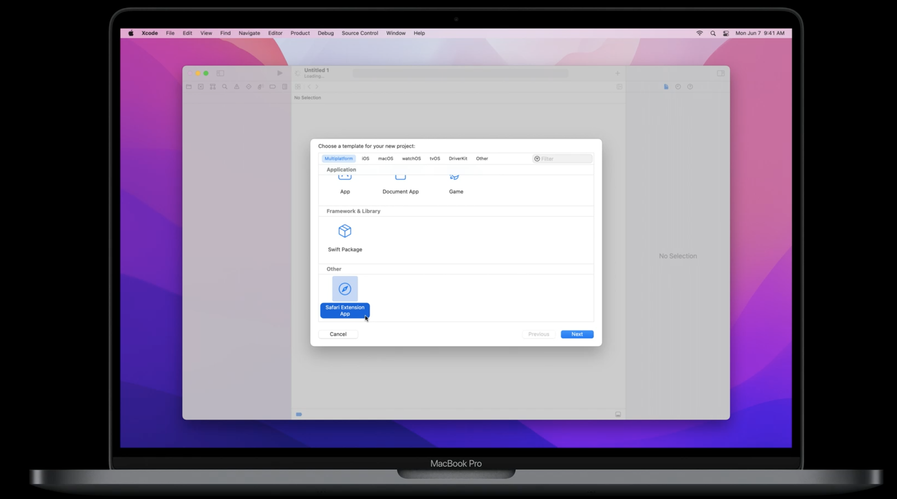

下图是创建完后所有的资源文件：

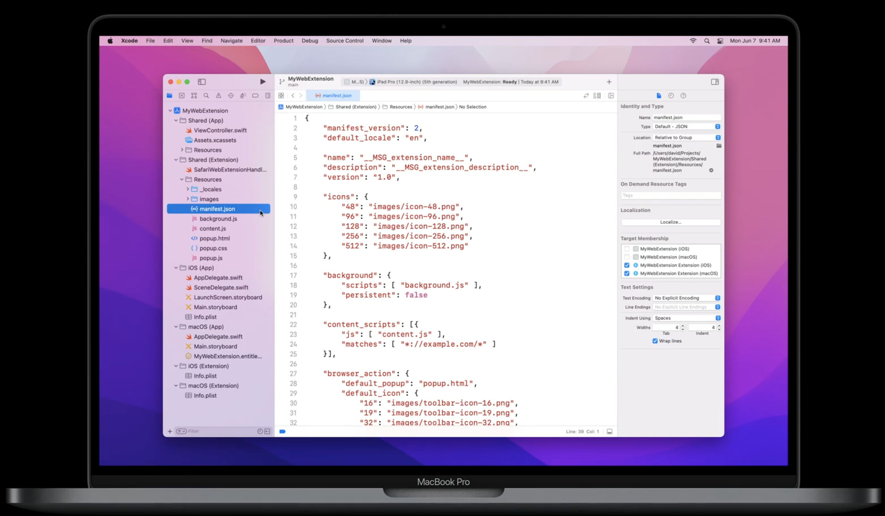


**第二：从其它浏览器的插件中转化**

如果你给其它浏览器开发过插件，比如可以把 Chrome 中的插件转化成 Safari 插件，可以使用命令行转化：

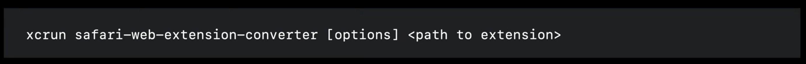

**第三：把 Mac 中的 Safari 插件兼容 iOS**

如果你已经创建过 Mac 版的 Safari 插件，可以使用命令工具来兼容 iOS 版本：

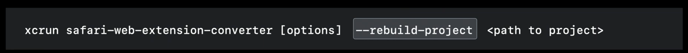

我们一起把 Sea Creator 兼容 iOS，先执行命令：

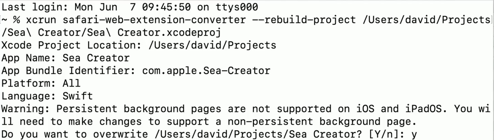

当执行完命令后，会自动打开 Xcode，可以看到兼容 iOS 版本的插件代码：

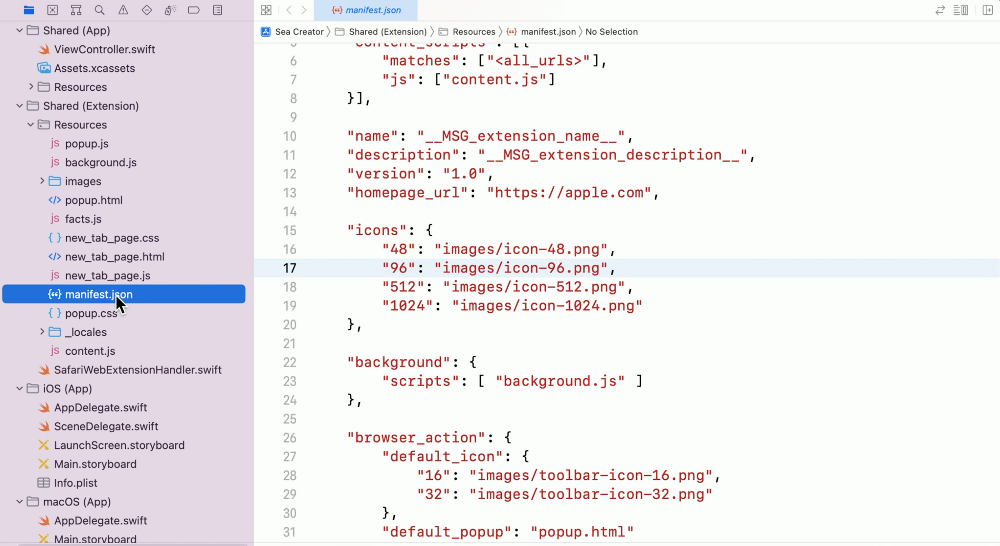

我来解释下各个文件的作用：

- manifest.json 描述插件的一些基本信息，可以看做是插件的配置文件；
- background.js 在后台运行的任务，可以监听浏览器的一些事件，sea creator 插件用来记录总共有多少个单词进行了转化；
- content.js 当用户访问某个网站时，这里面的脚本将会自动执行，主要用来实现插件的核心逻辑，比如 sea creator 实现了把动物名替换为 emoji 的逻辑；
- 其它文件，比如气泡、tab 页，还有一些其它的图标；

### 调试插件

执行完命令行后，使用 Xcode 运行项目，然后在模拟器上开启插件，依次点击模拟器中的【Settings】- 【Safari】-【Extensions】- 【Sea Creator】，这里有个报错，开关按钮点不了。

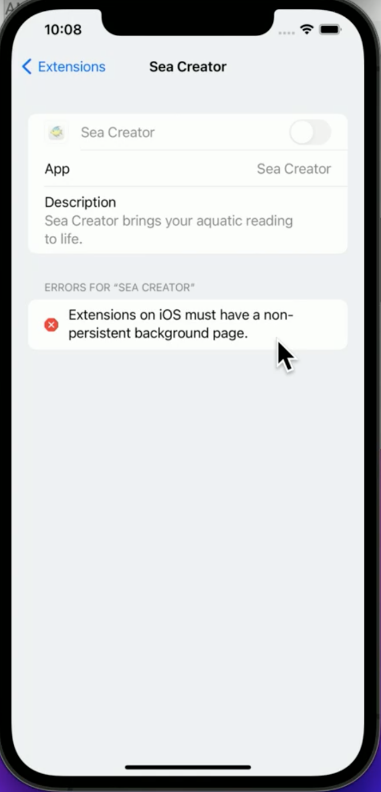


错误提示 iOS 中不能有 persistent background page，需要在 manifest.json 中添加 persistent 值为 false：

```json
"background": {
    "scripts": [ "background.js" ],
    "persistent": false
},
```

再次运行 App，开启插件，这次插件可以正常工作，在 Extensions 中可以看到所有安装的插件：

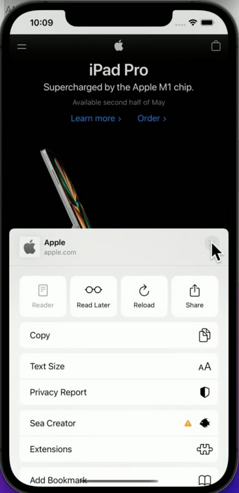


我们看一看插件中所有的页面是否可以在 iOS 上正常显示，首先看下 tab-page 这个页面，发现字体有点小，这是因为这个页面以前只在 Mac 上运行，需要让这个页面兼容手机端。下面通过 Safari 调试这个页面。

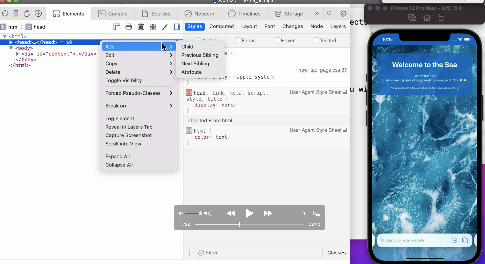

Safari 调试模拟器中的 HTML 页面时，需要在 Safari 中把开发菜单显示出来，操作步骤依次点击【Safari 浏览器】- 【偏好设置】- 【高级】-勾选【在菜单栏中显示"开发"菜单】，这样就可以使用 Web Inspector 来调试 HTML 页面。

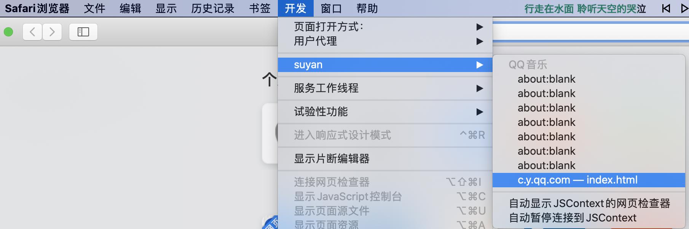

下面直接通过 web inspector 调试 HTML 来兼容 iOS，需要做两件事：

1、在 HTML 的 head 标签中添加 meta 内容，修改 viewport 为设备的尺寸；

2、以前 HTML 页面中的选择器 content 设置了固定宽度 850，需要调整为 max-width；

修改上面两处即可适配完移动端，效果如图所示：

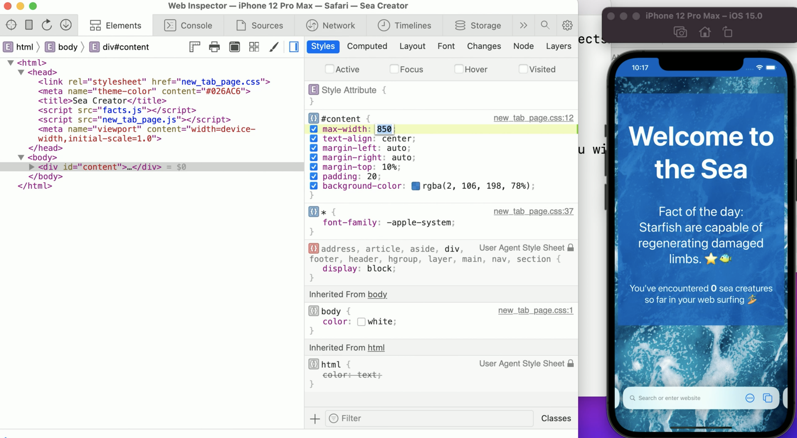

到此，一个能够在 iOS上 运行的插件就开发完了，那么在开发 iOS 浏览器插件时需要注意哪些问题呢？我们一起看下最佳实践。

### 最佳实践

开发浏览器插件在 iOS 和 Mac 中还是有一些差别的，主要有下面 5 点需要大家注意：

**1、no-persistent background**

浏览器插件可以支持开启一个常驻的后台页面，当插件运行后，就会自动启动一个常驻任务，这个任务可以监听各个页面中发出的事件。由于它一直在后台默默运行，会消耗一些系统资源，比如内存、电量，但在手机端资源有限，不适合使用常驻的后台任务，需要使用非常驻的任务，这样只有插件需要的时候，后台任务才会进行工作，可有效避免内存和电量的消耗，只需在 manifest  配置文件中加入  "persistent": false 即可。**iOS 的后台页面只能是非常驻的**。

给大家看下 background.js 的代码，可以监听其它 js 发出的事件，比如：

```js
// popup.js
browser.runtime.sendMessage({type: "Word count request"});
// new_tab_page
browser.runtime.sendMessage({type: "Word count request"});
```

background.js 接收事件：

```js
browser.runtime.onMessage.addListener((request) => {
    browser.storage.local.get((item) => {
        let wordReplacementCount = 0;
        if (Object.keys(item).length !== 0)
            wordReplacementCount = item.wordCountObj.wordCount;

        if (request.type == "Words replaced") {
            let wordCountObj = {
                wordCount: wordReplacementCount + request.count
            };

            browser.storage.local.set({wordCountObj});
        }

        if (request.type == "Word count request") {
            browser.runtime.sendMessage({type: "Word count response", count: wordReplacementCount});
        }
    });
});
```


**2、响应式设计**

由于插件要运行在不同的设备上，不同设备之间 UI 会存在差异，表现也不一致，需要兼容所有设备上的 UI，主要需要考虑下面这四点：

- UI 可以兼容不同设备

浏览器插件需要提供一些页面，比如 pop-page、tab-page，这些页面需要兼容不同设备，比如同时兼容 Mac、iPad 和 iphone，需要在不同设备上测试 UI 是否正常显示；

- 注意安全区域

在手机端上需要注意安全区域，比如你的页面是全屏的，如果在底部有一个按钮，这个按钮很可能不在安全区域中，在布局中可以通过 CSS 变量来控制元素显示到安全区域内，还需要考虑设备旋转后，确保页面也能够正常显示；

- pop-page

pop-page 在 Mac 与手机上表现不一致，这一点也需要注意，手机上 pop-page 是一个 sheet，而在 Mac 上是一个气泡；

- 兼容用户动态修改字体大小

用户也可以手动调整字体大小，可以通过系统提供的动态字体进行兼容，这样用户调整字体大小后，你的文本内容会自动进行调整；

**3、事件处理**

如果插件果用到了鼠标的一些点击、拖拽事件，这些事件在 iOS 上并不适用，需要兼容 point event；

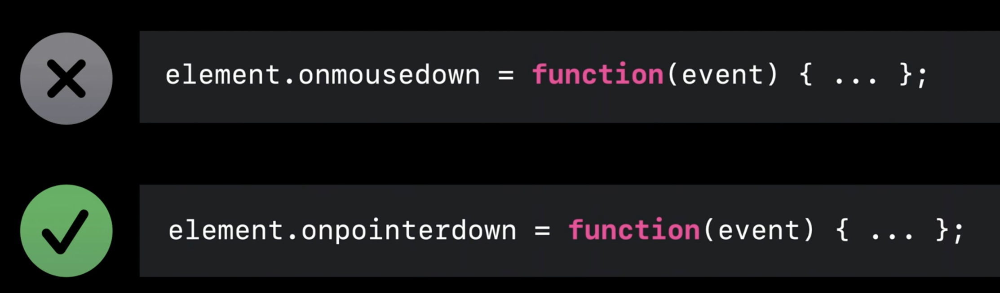

**4、window api**

浏览器插件开发中，提供了一些与 window 相关的 api，这些 api 在不同设备上表现不一致，可能会存在多个 window，在操作 window 之前需要判断其是否为要操作的 window。在电脑端，用户可能会打开多个 window，比如：

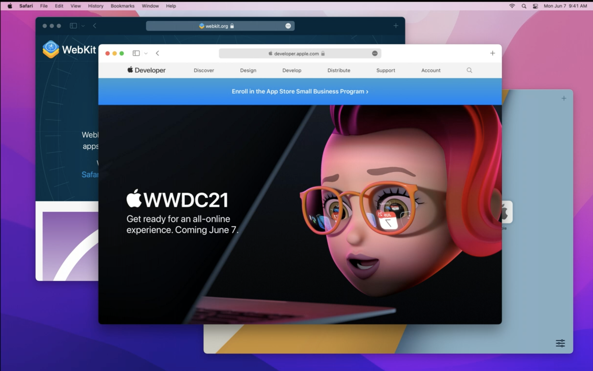

在 ipad 上也可以打开多个 window：

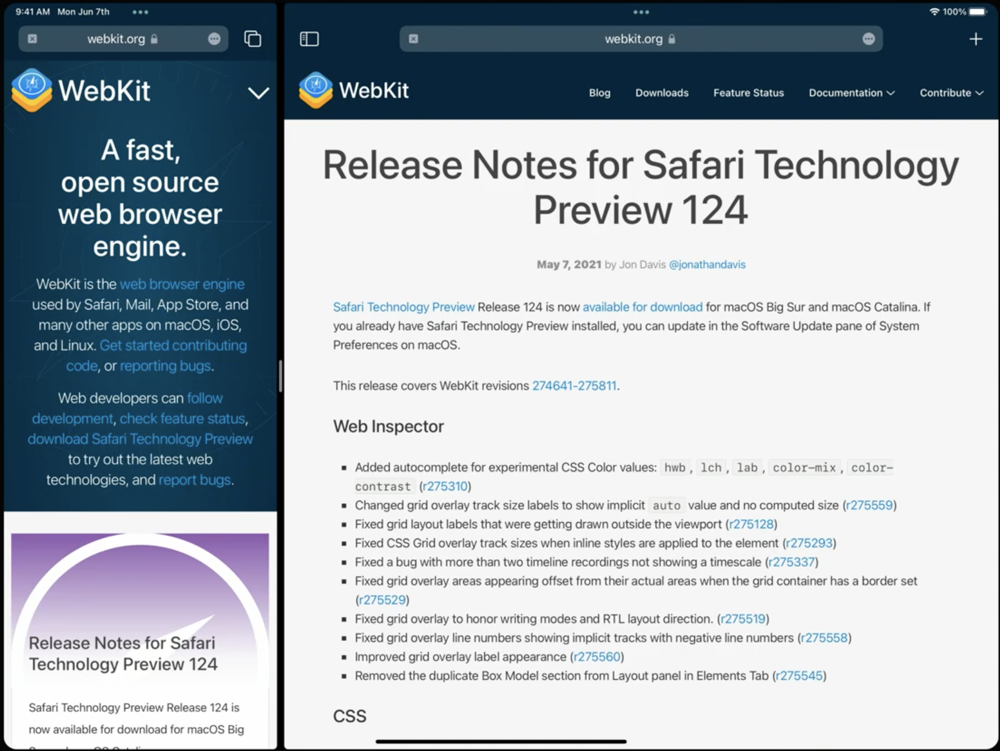


在手机上，通过 `broswser.windows.getAll()` 获取到两个 windows，一个是用来显示的 window，图中可以看到内容的 window；另一个是隐私 window，当你开启隐私模式浏览网页时这个 window 将正常工作。可以通过属性 focused 来判断是否为正在工作的 window：

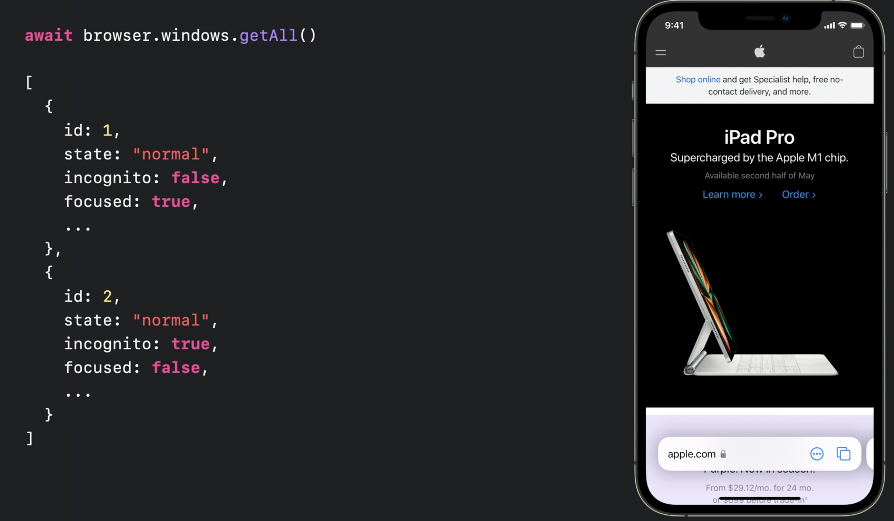

下面这张图，调用  `broswser.windows.getAll()` 或获取到 4 各 window 对象：

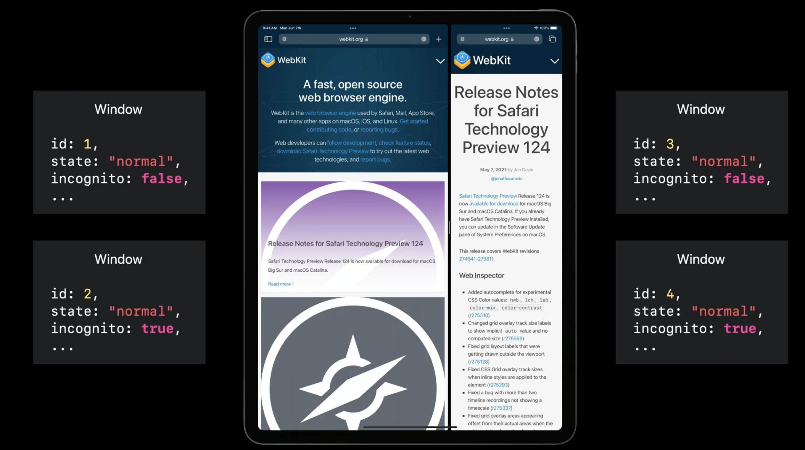

在使用 window 上的一些 api 时，需要留意， 在 iOS 和 Mac 中有很大区别，iOS 表现如下：

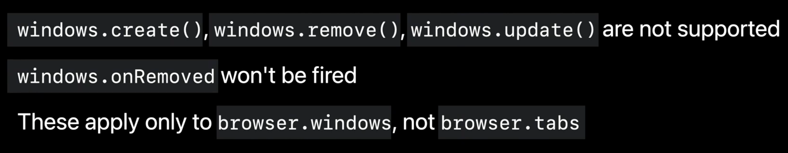


**5、fetature detection**

有些 api 在 iOS 上并不支持，使用之前需要判断该 API 是否存在：

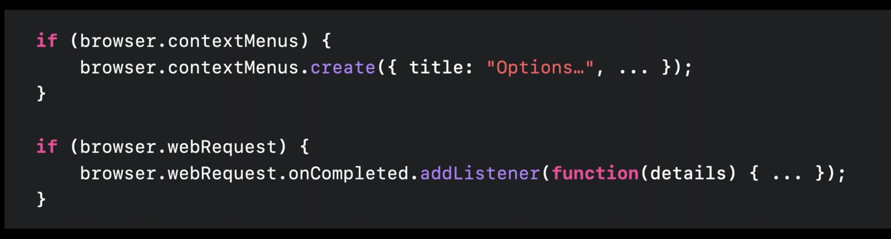


### 需要考虑的用户隐私问题

浏览器插件可以访问网页中的数据，会涉及到用户数据安全，苹果一向比较注重用户隐私，在浏览器插件中提供了一些隐私相关的措施。总的来说，当用户浏览某个网站时，如果有插件需要访问用户的数据，需要提示用户，并且需要获得用户授权。比如 Sea Creator 插件需要修改网页中的内容，需要给用户一个提示：

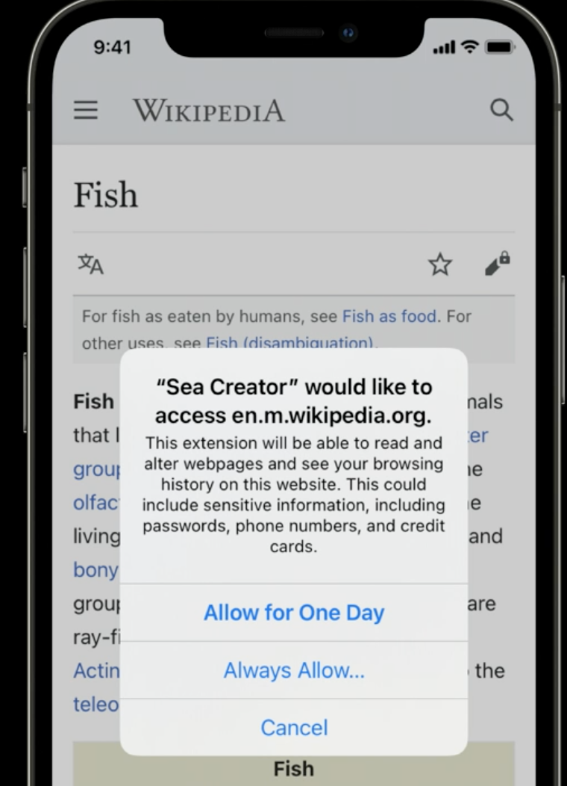

开发者应该尽可能不让用户开启与插件无关的权限，权限可以在 manifest 配置文件中配置，下面的代码表示需要获取 activeTab 和 storage 权限。开发中如果想使用某些 api，需要经过用户授权，比如 storage 用来获取用户的缓存数据，cookie 用来获取用户的 cookie，这些 api 都需要获得用户的授权才能够访问。下面的 activeTab 表示该权限只在当前网站、当前 tab 下生效，适合插件某个时刻只做一件事：

```json
"permissions": [
  "activeTab",
  "storage"
]
```

### 结语

以上就是关于在 iOS 中开发 Safari 插件的全部内容，本节内容对前端同学理解起来比较简单，但对于 iOS 同学理解起来有点吃力，需要要一些前端背景知识。如果你对浏览器插件开发感兴趣，可以通过 [mdn browser extension](https://developer.mozilla.org/en-US/docs/Mozilla/Add-ons/WebExtensions) 学习。大家加油！

### 参考

https://developer.apple.com/documentation/safariservices/safari_web_extensions/adopting_new_safari_web_extension_apis

https://developer.apple.com/videos/play/wwdc2021/10104/

https://developer.mozilla.org/en-US/docs/Mozilla/Add-ons/WebExtensions