# WWDC21 10012 - App Clip 新特性
#####warning to do标题感觉不太好
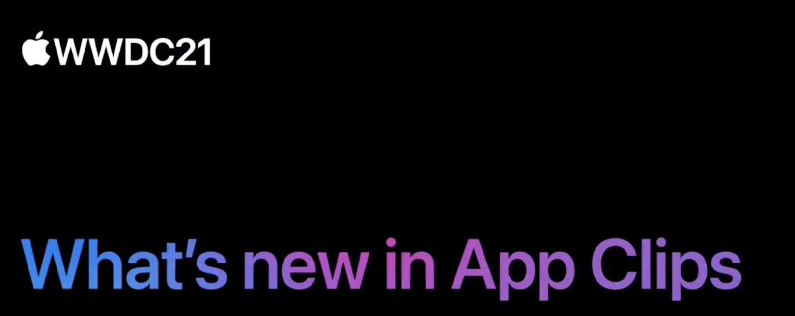

本文基于 [Session 10012](https://developer.apple.com/videos/play/wwdc2021/10012/) 梳理

## 引言
在去年 WWDC20 发布会的的亮点之一就是轻应用 - App Clip。在过去的一年里，世界各地的开发者开发出了很多精美的App Clip。
#####warning to do引言这里要调整

## 分享优秀的 App Clip
在去年的 Session [Configure and link your App Clips](https://developer.apple.com/videos/play/wwdc2020/10146/)，App Clip的各种唤醒方式是极其惊艳的。包括但不限于 Safari、iMessage、Map、Spotlight search、Siri suggestion widget、NFC、QR Code、App Clip code。
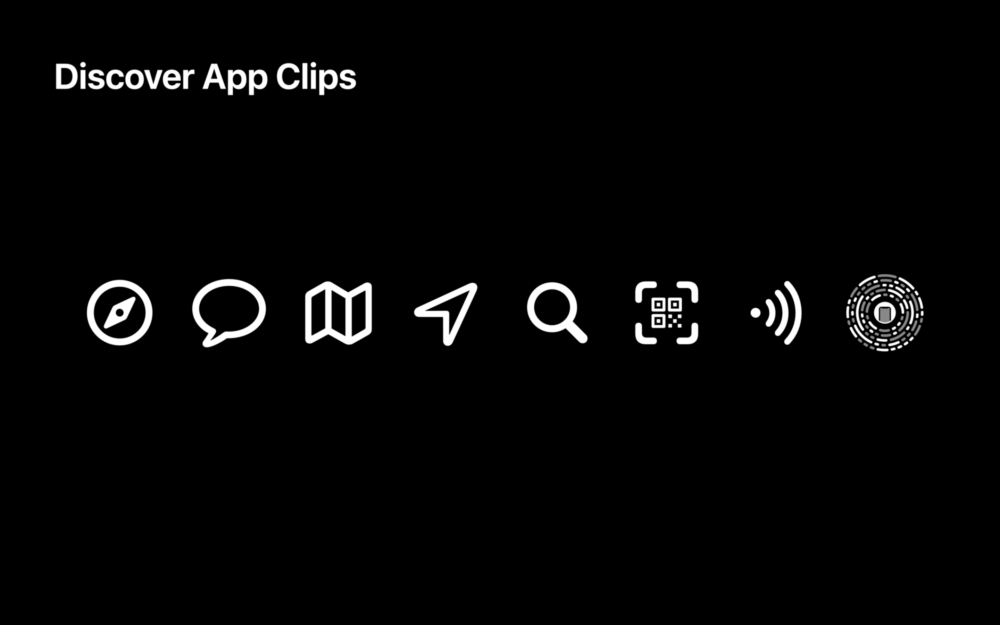
自发布以来，我们看到了来自世界各地开发人员的App Clip，接下来让我为你展示这些例子。

### Phoenix 2
Phoenix 2是来自 Firi Games 的一款流行游戏，并配备了App Clip。当使用 iOS 设备打开 [Phoenix 2 游戏介绍页](https://firigames.com/phoenix2)，会在 Safari 顶部展示App Clip Banner。点击 Play 按钮，会调起 App Clip card，在这里就可以启动游戏。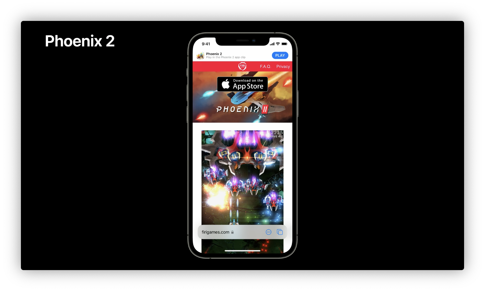
当完成游戏的第一关之后，底部会弹起引流到主 App 的卡片。
 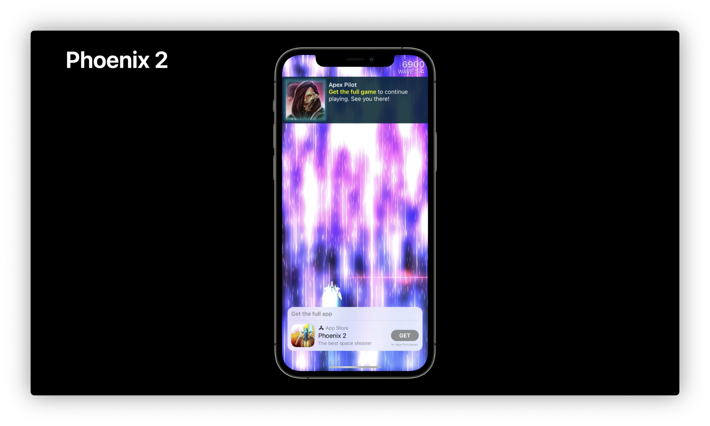

 #### Tips
 当我测试 Phoenix 2 的 App Clip时，发现了一些有趣的点。
*  Phoenix 2 不支持中国大陆的应用商店，当我的设备的应用商店账号归属于中国大陆时，Safari 顶部并不会展示 App Clip Banner，而是会展示出一个灰底占位底图。底图上只有关闭按钮，并无其他信息。
*  当我将设备的应用商店的 Apple ID 切换成美区账号，再次打开游戏介绍页。此时顶部就会展示出相应的 App Clip Banner。
*  注销应用商店账号，处于无账号状态下打开游戏介绍页，仍然不会展示 App Clip Banner。
*  以上每次切换账号前，都会重启设备来规避 Safari 缓存造成的影响。
*  如果 Safari 处于无痕浏览模式，那么顶部的 App Clip Banner 就不会展示。

在去年和今年相关的 Session 中，并未提及对非发售区域账号不展示 App Clip Banner 的叙述。但基于测试结果，笔者做出了一个解释。
> 在 Safari 展示 banner 前会验证 网站和 App Clip 之间的 domain association。**同时也会判断设备上的应用商店账号是否在 App Clip 发售区域内。**

### TikTok
TikTok 的 App Clip 让视频分享变得简单又有趣。当我在 iMessage 中收到朋友分享给我的视频， iMessage 会展示 App Clip 的预览。
 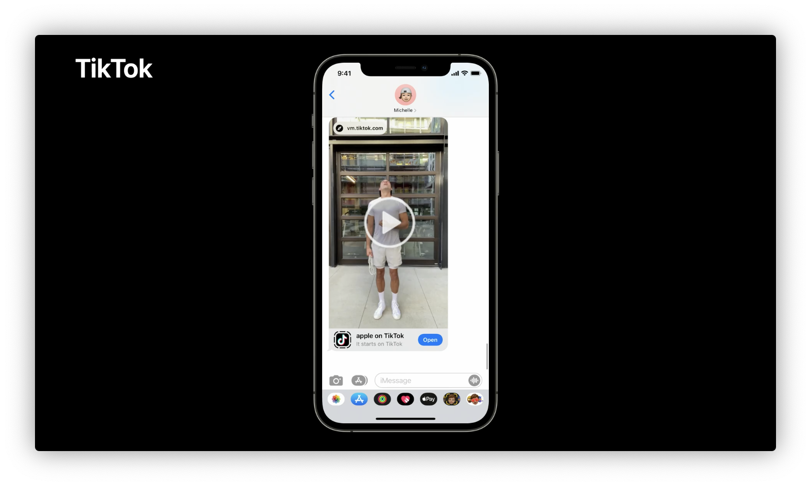
点击预览即可展示卡片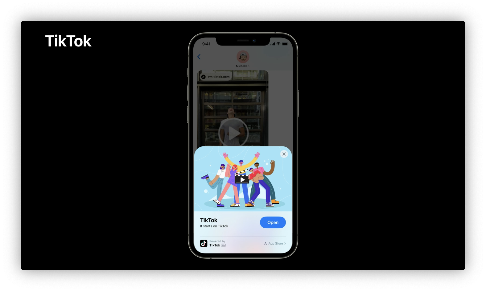
点击 Open 按钮，就可以立刻享受视频了。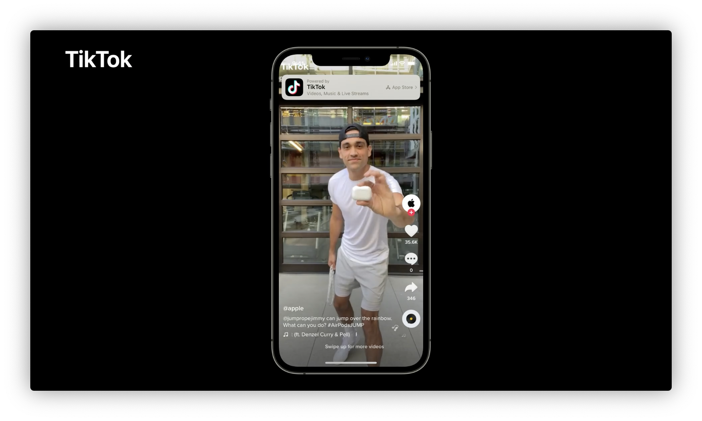

### Panera bread
Panera bread 是一家有着上千家连锁店的面包店。当我在地图中查找其中一家商店，位置卡片将会展示 order food 按钮。可以在这里打开 App Clip。
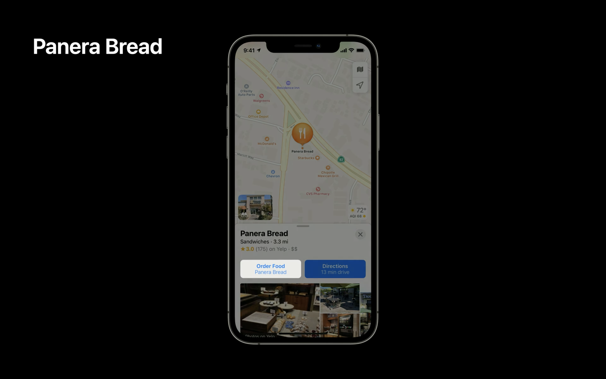

几秒内，App Clip 就会启动并展示这家商店的菜单。
我可以点单并使用 Apple Pay 支付。 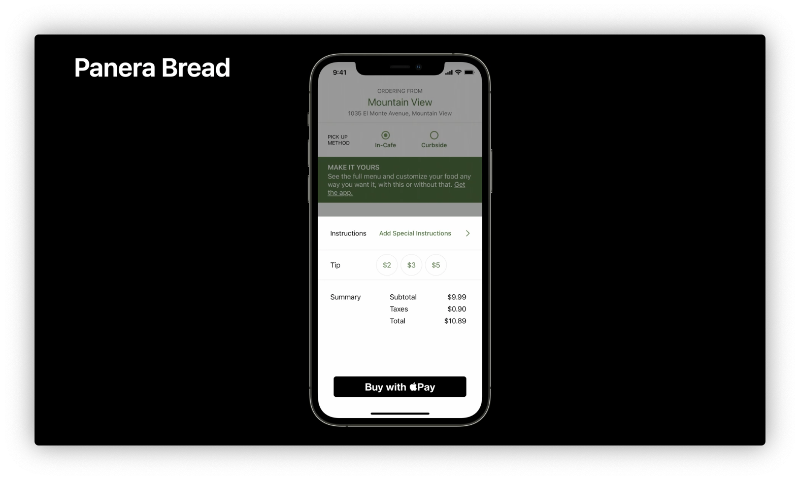

在 iOS 15 当用户在 Spotlight 搜索商业，例如 Panera 。App Clip 会在搜索结果中展示。
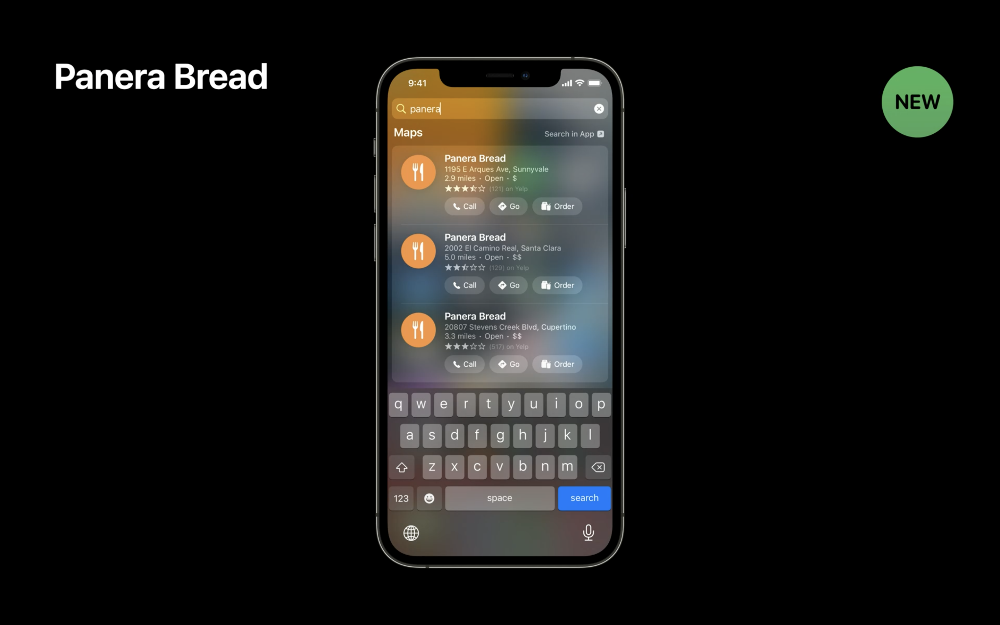

借助设备智能化，当用户在 Panera 商店附近。设备会在 Siri suggest 小组件中向用户推荐 App Clip 。
 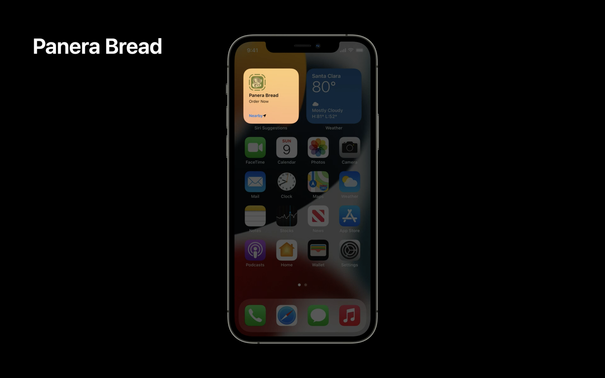

### Honk
Honk 将 App Clip 用于非接触式支付车费。当我出停车场支付车费的时候，我只需要在车上使用 iPhone 扫描贴在停车场