# WWDC21 10012 - App Clip 新特性


本文基于 [Session 10012 - What's new in App Clips](https://developer.apple.com/videos/play/wwdc2021/10012/) 梳理

## 引子


App Clip 是 WWCD20 的一大亮点，它提供了一种“即时使用”的方式，基于苹果提供的各种唤醒方式，让用户在特定场景下很方便地体验 App 内的核心功能。

现在一年过去了，世界各地的开发者开发出了各种优秀的 App Clip。同时 Apple 提供了一种全新的 App Clip Card 的展示方式，也一并完善和优化了本地体验，并提供了命令行工具来帮助开发者们生成轻应用码。
让我们一起来看看吧。

## 分享优秀的 App Clip
在去年的 Session [Configure and link your App Clips](https://developer.apple.com/videos/play/wwdc2020/10146/)，App Clip 的各种唤醒方式是极其惊艳的。包括但不限于 Safari、iMessage、Map、Spotlight search、Siri suggestion widget、NFC、QR Code、App Clip code。接下来让我们看看这些例子。


### Phoenix 2
Phoenix 2 是来自 Firi Games 的一款流行游戏，同时配置了 App Clip。当使用 iOS 设备打开 [Phoenix 2 游戏介绍页](https://firigames.com/phoenix2)，会在 Safari 顶部展示 App Clip Banner。点击 Play 按钮，会调起 App Clip card，在这里就可以启动游戏。
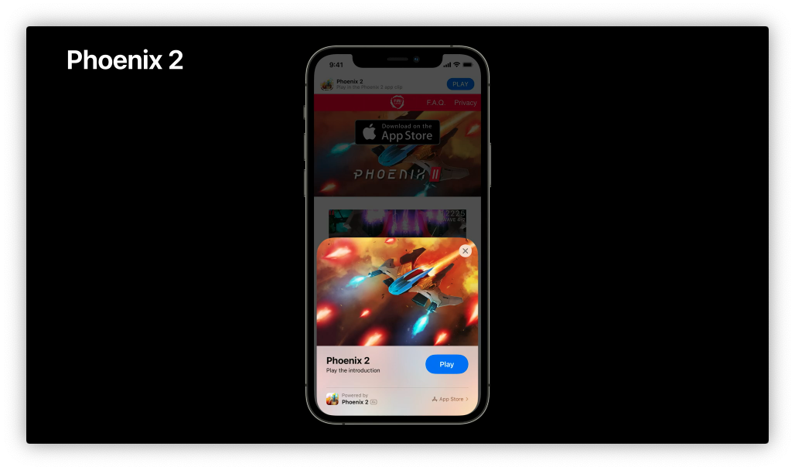

当完成游戏的第一关之后，底部会弹起引流到主 App 的卡片。
 

> #### Tips
 当我测试 Phoenix 2 的 App Clip 时，发现了一些有趣的点。
*  Phoenix 2 不支持中国大陆的应用商店，当我的设备的应用商店账号归属于中国大陆时，Safari 顶部并不会展示 App Clip Banner，或者仅展示出一个灰底占位底图。灰底占位底图上只有关闭按钮，并无其他信息。推测是苹果的适配问题导致的。
*  注销应用商店账号，处于无账号状态下打开游戏介绍页，仍然不会展示 App Clip Banner。
*  当我将设备的应用商店的 Apple ID 切换成美区账号，再次打开游戏介绍页。此时顶部就会展示出相应的 App Clip Banner。
*  以上每次切换账号前，都会重启设备来规避 Safari 缓存造成的影响。
*  如果 Safari 处于无痕浏览模式，那么顶部的 App Clip Banner 就不会展示。
*  以上测试机型为 iPhone XR (iOS 14.0) / iPhone X (iOS 14.7)

在去年和今年相关的 Session 中，并未提及对非发售区域账号不展示 App Clip Banner 的叙述。但基于测试结果，笔者做出了一个解释。
> 在 Safari 展示 banner 前会验证 网站和 App Clip 之间的 domain association。**同时也会判断设备上的应用商店账号是否在 App Clip 发售区域内。**

### TikTok
TikTok 的 App Clip 让视频分享变得简单又有趣。当我在 iMessage 中收到朋友分享给我的视频，iMessage 会展示 App Clip 的预览。
 
点击预览即可展示卡片
接着就可以立刻享受视频了。


### Panera bread
Panera bread 是一家有着上千家连锁店的面包店。当我在地图中查找其中一家商店，位置卡片将会展示 order food 按钮。可以在这里打开 App Clip。


几秒内，App Clip 就会启动并展示这家商店的菜单。
我可以在这里点单并使用 Apple Pay 支付。 

在 iOS 15 当用户在 Spotlight 搜索商店，例如 Panera。App Clip 会在搜索结果中展示。


借助设备智能化，当用户在 Panera 商店附近。设备会在 Siri suggest 小组件中向用户推荐 App Clip。
 

 > #### Tips:
 配置 App Clip 关联的地理位置，只能在 iTunes Connect 上的 Advanced App Clip Experiences 中进行配置。基于笔者去年的配置经验，苹果并没有开放中国大陆的地理位置关联且地理位置只能从苹果提供的位置中进行选择，精确度不高。因此使用地理位置关联会有一些局限性。
 Advanced App Clip Experiences 应对较复杂的唤醒情况，可以根据URL的不同、关联地点的不同来提供不一样的 App Clip card。
 想了解更多关于 Advanced App Clip Experiences 的内容请参考 [Configuring Your App Clip’s Launch Experience](https://developer.apple.com/documentation/app_clips/configuring_your_app_clip_s_launch_experience?language=objc)

### Honk
Honk 将 App Clip 用于非接触式支付车费。试想这样一种场景，当我出停车场支付车费的时候，我只需要在车上使用 iPhone 扫描贴在停车场上的二维码，即可唤起 App Clip 并支付停车费。是不是很酷？


### Primer AR Home Design
Primer AR Home 将 AR 与 App Clip 进行了结合。Primer AR Home 提供了一个帮助用户在 AR 环境中体验墙纸和瓷砖的 App Clip。
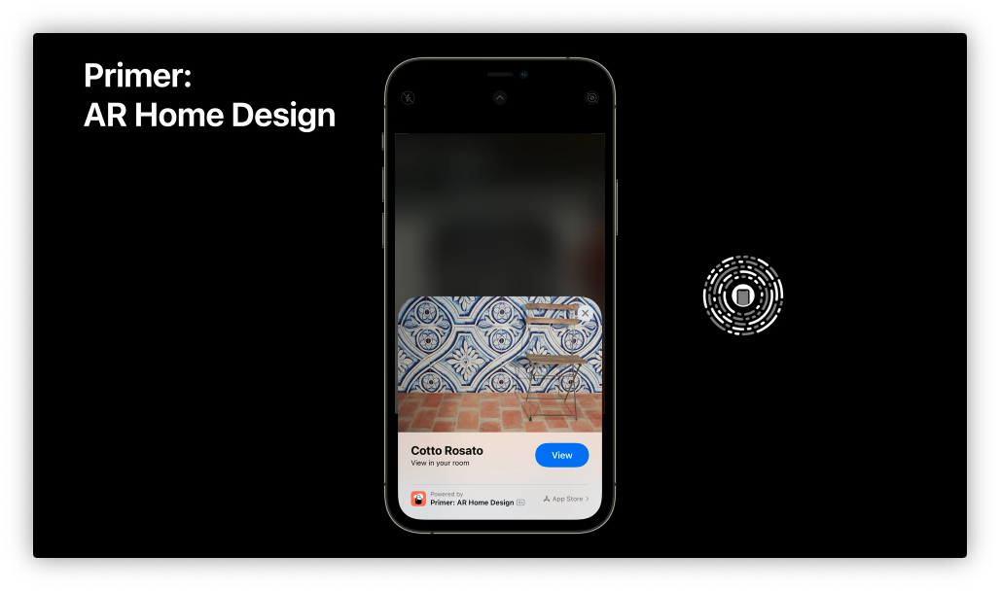
当用户使用 iOS 设备轻点瓷砖上的 App Clip code，就可以在AR环境下体验这种瓷砖在房间中排列的样子。是的，这张 App Clip code 集成了 NFC 功能。
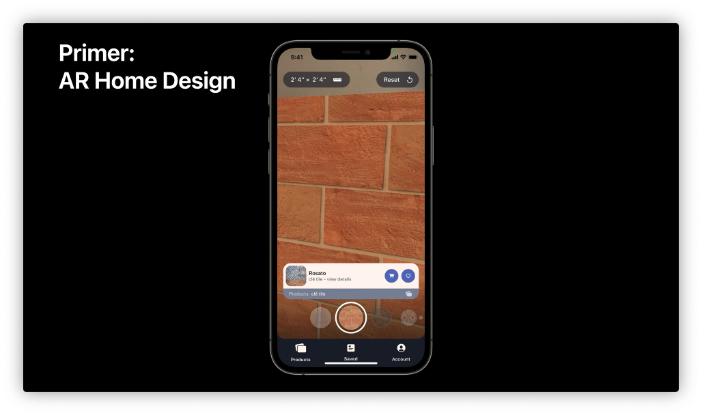

### 小结
自此我们已经看见了各种优秀的 App Clip。它们都有着独特的使用场景和唤醒方式，为我们开发者在以后创建自己的 App Clip 时，提供了优秀的思路。
根据笔者的理解，我将 App Clip 大致分为两类
- 一种是功能上是主 App 的子集，将 App 的亮眼功能使用 App Clip 的方式让用户先行进行体验。最终目的是将用户引流到主 App 中，例如上面分享的 Tiktok。
- 另一种是功能上已经可以成为一个闭环，更像一个轻量级的 App。用户可以在 App Clip 内就可以完成自身的需求。例如上面分享的 Honk，用户可以在 App Clip 内就完成支付车费这一操作。
得益于 Apple 提供的登录和支付功能，开发者可以更好地给用户提供“总线”式服务。

接下来让我们看看经过一年的发展，App Clip 有什么新玩意儿？本篇内参会涵盖三个主题：
- App Clip Card 在 Safari 和 SafariViewController 中的全新展示效果。
- 使用 local experiences 来更方便的在本地测试 App Clip。
- 使用命令行工具生成自定义的 App Clip code。

接下来让我们一起探索吧！


## App Clip Card 在 Safari 和 SafariViewController 的全新展示效果
在去年的 [Session](https://developer.apple.com/videos/play/wwdc2020/10146/) 中，我们可以在网页中配置 `meta tag` 从而在 Safari 和 Safari View Controller 展示 smart banner。
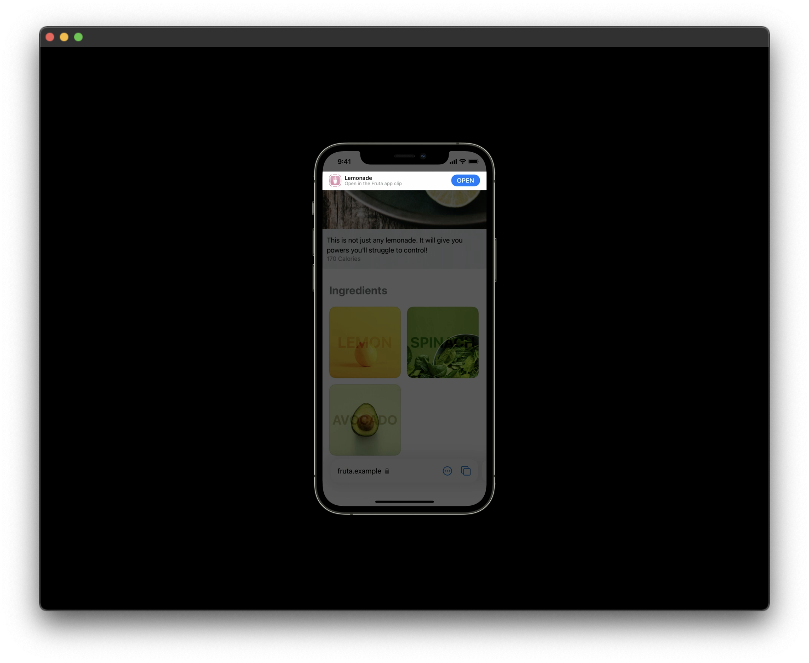
在 iOS 15 我们可以在 `meta tag` 添加一些代码，从而可以展示全尺寸的 App Clip card。卡片会在网页的中部弹出。用户可以直接在这里开启我们的 App Clip。但是如果用户点击 "View in Safari"，Safari 会记录他们的选择。下次打开次网页就不会展示该卡片，而是会展示原来的 banner 样式。
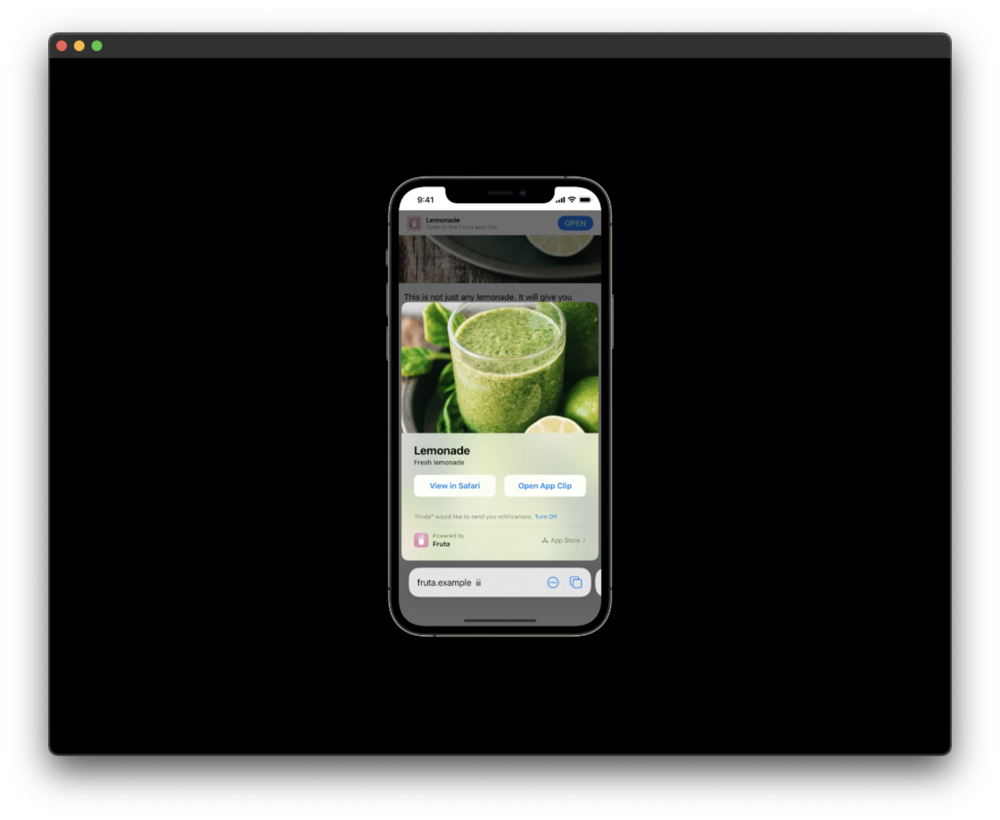

### 集成方式
如果网页已经适配过 App Clip，那么使用卡片模式会很简单。在官网的源代码的 `meta tag` 中查找 `apple-itunes-app` 标签，并在其中添加 `app-clip-display` key，并将其值设为 `card`。
以下为完整参考代码，在开发过程中需要将 `app-clip-bundle-id` 和 `app-id` 替换成自己项目对应的信息。

```
<head>
<meta name="apple-itunes-app" 
content="app-clip-bundle-id=com.example.fruta.Clip, app-id=123456789, app-clip-display=card">
</head>
```

### 全新的生态模式
卡片模式并不只是展示样式的不同，而是一种**全新的生态模式**，可以在一个综合类应用内部去唤起另一个应用的 App Clip。苹果给出了这样一个例子。
FoodGrid 是一个综合类应用来帮助用户发现附近的餐厅和饮品店，同国内的大众点评这类应用很相似。Fruta 冰沙是饮品中的一个品牌，并在 FoodGrid 中进行推广。


当用户点击这个品牌的时候，会唤起 SafariViewController 来展示该冰沙品牌的官网。因为 Fruta 官网 在 iOS 14 就已经配置了 Smart App Banner，因此顾客在顶部的 banner 就可以唤起 App Clip 进行下单等一系列操作。但是这一操作需要以下几个步骤
- 首先需要用户发现 Banner
- 点击 Banner 上的 Open 按钮唤起 App Clip card
- 点击 App Clip card 的确认按键

以上是在 iOS 14 只集成了 Smart App Banner 的流程，可以看出步骤较为繁琐。


因此在 iOS 15，全尺寸 App Clip Card 是一种促进和提升用户发现特定 App Clip 的方式。更大的卡片让用户更容易地发现集成在第三方应用中的 App Clip。当在 Fruta 官网源代码的元标签添加 `app-clip-display=card` 后，从新在 FoodGrid 打开 Fruta 冰沙的官网，就会注意到 Fruta 的 App Clip Card 立刻在网页中展示出来了。
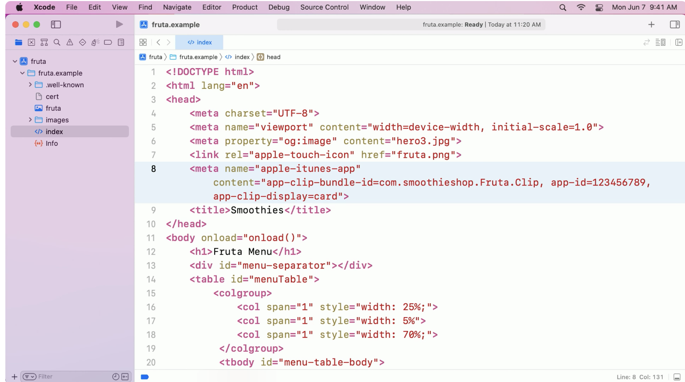


用户就可以直接在第三方应用内打开 Fruta 的 App Clip，并享受美味的冰沙了。

我想现在各位应该知道如何配置全尺寸卡片模式了，并且也理解了这种样式所带来的好处。


## 更方便的本地体验
对于普通用户，他们的 App Clip 体验源于 App Clip Card。卡片会展示 App Clip 的标题、副标题、介绍 App Clip 的品牌和风格的图像和操作按钮。


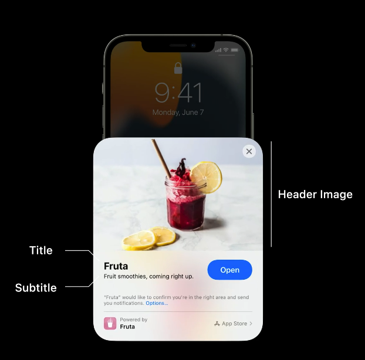

开发者可以在 App Store Connect 上创建 App Clip Card，还可以指定 App Clip 关联的位置。有了关联位置，就可以让 App Clip 展示在地图位置卡片、Siri 建议小组件、Spotlight 搜索中。
<div align=center>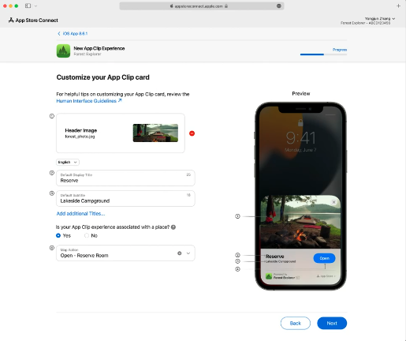</div>


想了解更多关于如何自定义 App Clip Card，请参阅 WWDC20 相关 session 和去年小专栏相关的内参。

[Session - 10146 What's new in App Store Connect](https://developer.apple.com/videos/play/wwdc2020/10651/)
[Session - 10146 Configure and link your App Clips](https://developer.apple.com/videos/play/wwdc2020/10146/)
[WWDC20 10174 - App Clips 探索之旅](https://xiaozhuanlan.com/topic/4063519872)

### 本地体验配置
作为开发者，只是想体验下新技术，又不想真正的去上架一款应用。这个时候本地体验（local experience）就来了。
本地体验可以帮助开发者使用自己的测试设备对 App Clip 进行一个先行的体验。有可能部分同学是第一次接触到 App Clip，我会从配置 App Clip 开始讲述。老司机可以直接略过这部分。

#### - 创建一个本地 App Clip
在 Xcode 中打开要添加 App Clip extension 的主工程，并创建一个新的 target，可以在右上侧的输入框输入 App Clip 来查找到我们需要的 target。
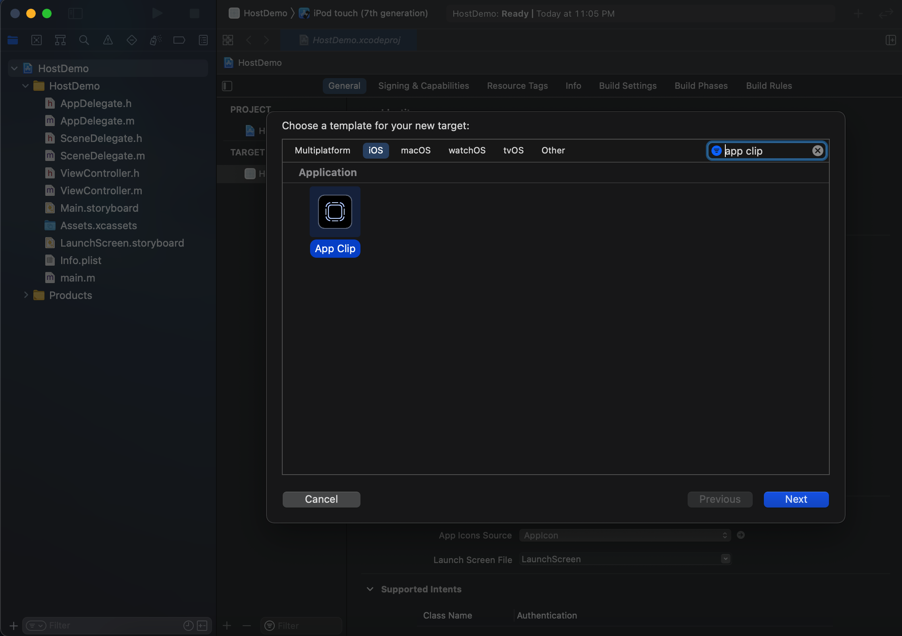

在主工程和 App Clip extension 的 Associated Domain 内添加要映射的链接，格式如下
```
appclips:yourDomain.com
```
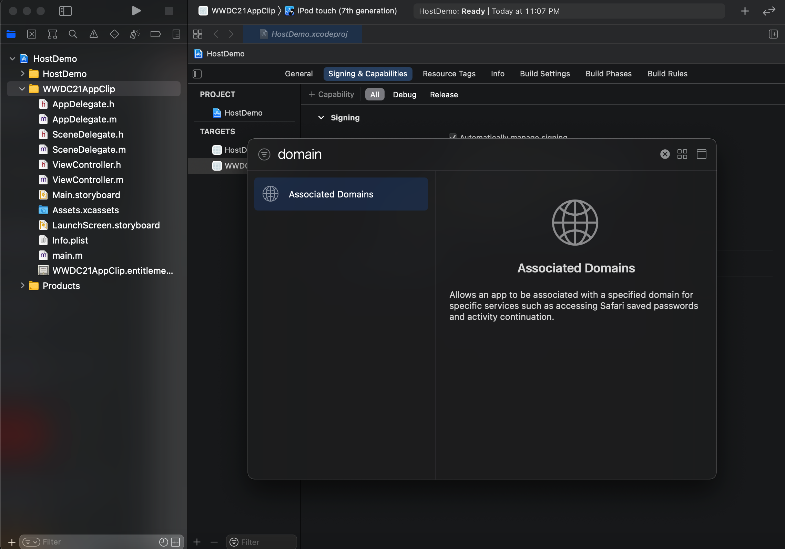
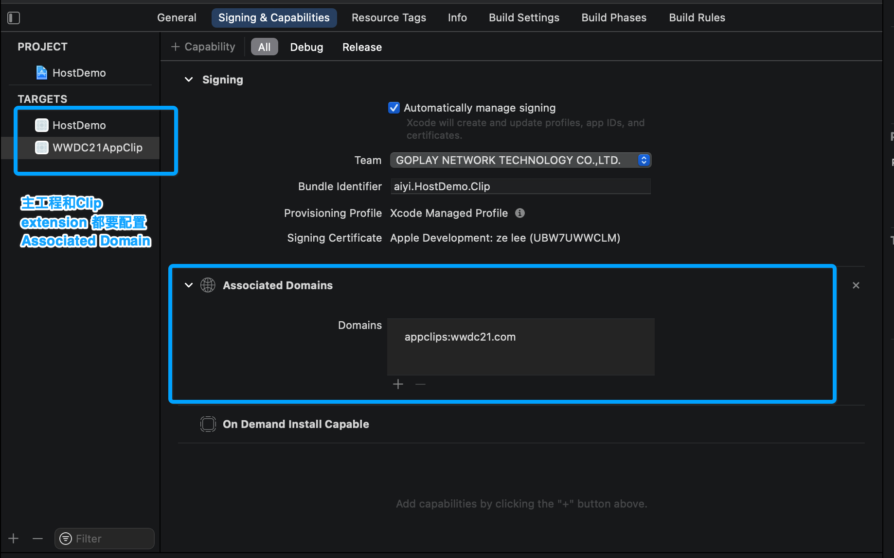

在 App Clip extension 的 schema 中添加环境变量 `_XCAppClipURL`，value 就是上面映射的链接。
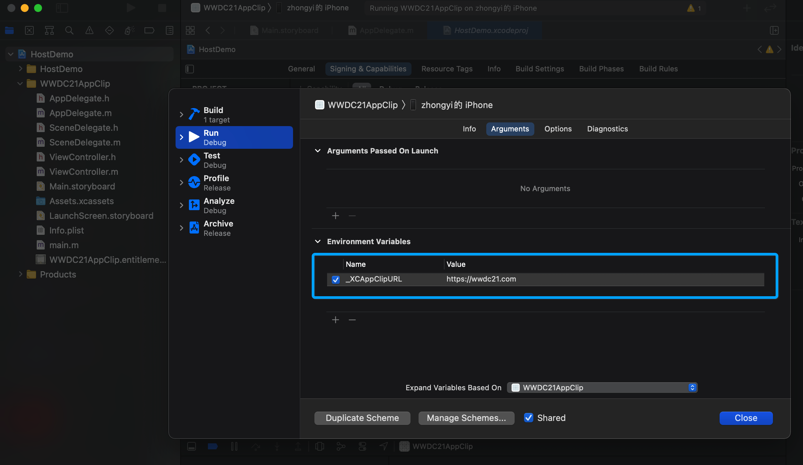

到这为止，本地配置就已经完成。将 App Clip Extension 运行在测试机上。接下来使用 [在线二维码生成器](https://cli.im) 生成本地测试用的二维码，内容为上面配置的 `https://wwdc21.com`。使用控制中心的扫描器进行扫描，即可唤起 App Clip Card，点击打开即可进入 App Clip extension。
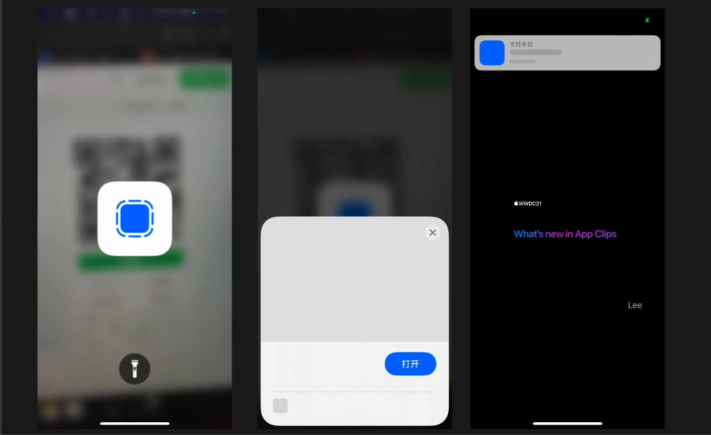

我们发现，唤起了 App Clip Card 是空白一片的，如果想在本地测试 Clip Card 相关的配置展示，那么就需要使用本地配置了。

#### 本地体验配置
打开设置 >> 开发者 >> Local Experiences >> Register Local Experience，即可开始配置你的专属本地体验。
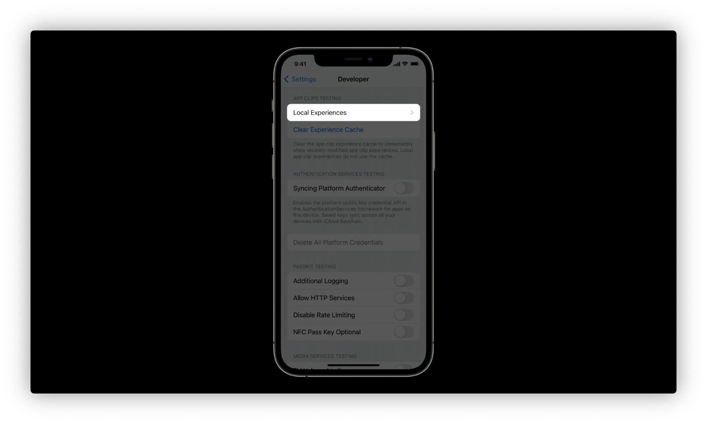
本地配置的 `URL PREFIX` 要与 App Clip Extension 的 `associated domain` 对应，`BUNDLE ID` 要与 App Clip Extension 的 `bundle ID` 对应。
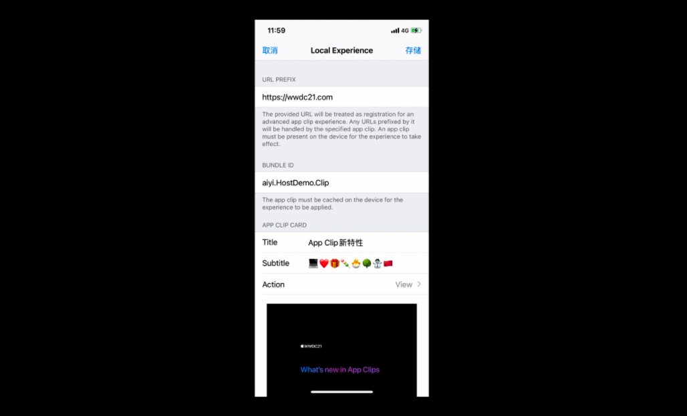

再次使用设备扫描刚才生成的二维码，就会发现弹出的 App Clip Card 同配置一致了。
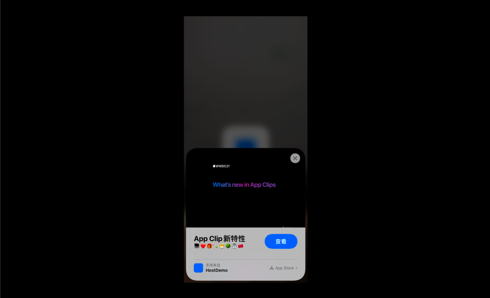


本地体验也是有局限性的，仅支持以下几种唤醒方式。可以看出这几种唤醒方式都是同链接有关。
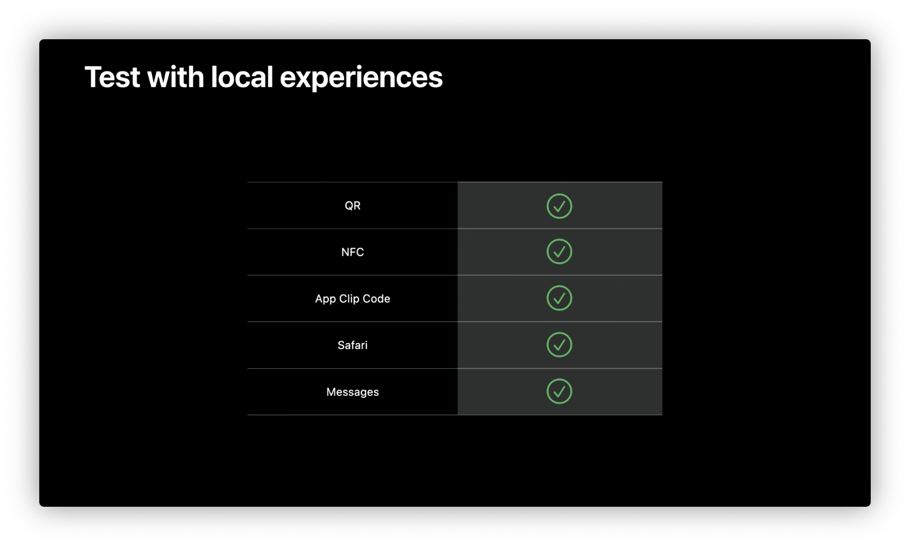
至于 Map、Spotlight search、Siri suggestion widget，这三种唤醒方式要对 Connect 上的 Advanced App Clip Experiences 进行配置后才可使用。

## 五彩缤纷的 App Clip Code
App Clip Code 是专属于 App Clip 的二维码。App Clip Code 提供了让用户发现 App Clip 的最佳方式。独特的设计可以让用户立刻识别出这是一个专属于 App Clip 的二维码，同时也提供了一种快速、安全的方式来开启 App Clip。

每一个 App Clip Code 都会对与之绑定的唯一 URL 进行编码，iOS 在使用 App Clip Code 唤醒 App Clip 时，会对其绑定的 URL 进行解码。所以开发者无需对与 App Clip Code 绑定的链接做额外的编解码处理。
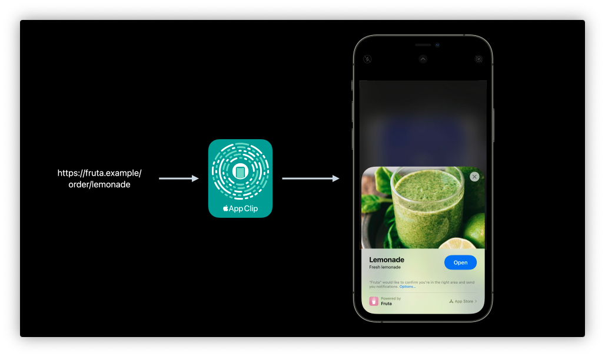

### App Clip Code 的样式
苹果支持两种功能样式的轻应用码，内置 NFC 功能的和仅支持扫描的轻应用码。
内置 NFC 功能的 Code，中心使用了 iPhone 的 icon，引导用户将手机贴近 Code 来读取它的内容，或者是通过相机或控制中心的的二维码扫描器来扫描这类内置 NFC 的二维码。仅用于扫描的 Code，中心使用了相机的 icon，让用户知道可以使用相机和控制中心的二维码扫描器来扫描。
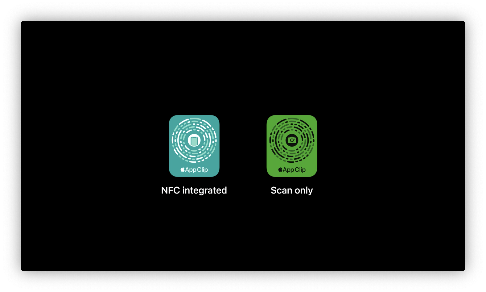

我们可以看出来 App Clip Code 的特征是很鲜明的，与传统的二维码样式差别较大。如同微信小程序码一样，一眼就可以让用户知道这个二维码包含的内容源于哪里。

### 如何创建一个 App Clip Code
在去年的 session 中，苹果就说会推出命令行工具来帮助开发者生成 App Clip Code。现在它来了。Apple 提供了两种方式来获取 App Clip code。
- 如果 App Clip 已经在 App Store Connect 配置完成，那么可以直接在 App Store Connect 上进行下载。
- 也可以使用 App Clip Code 生成器来生成 App Clip code。Apple 建议开发者在测试和开发 App Clip 过程中使用这一方式来生成 App Clip code。
接下来让我们看看，如果使用这个 App Clip code 生成器。

#### 使用 App Clip Code Generator tool
Mac 的终端工具默认是没有集成 App Clip Code 生成器的。首先要去 [Apple Developer website](https://developer.apple.com/download/all/?q=App%20Clip) 进行下载。
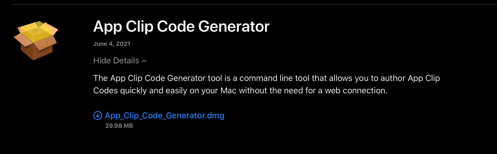

安装成功后，打开我们的终端，输入 `AppClipCodeGenerator templates`，就可以浏览所有可用的模板。
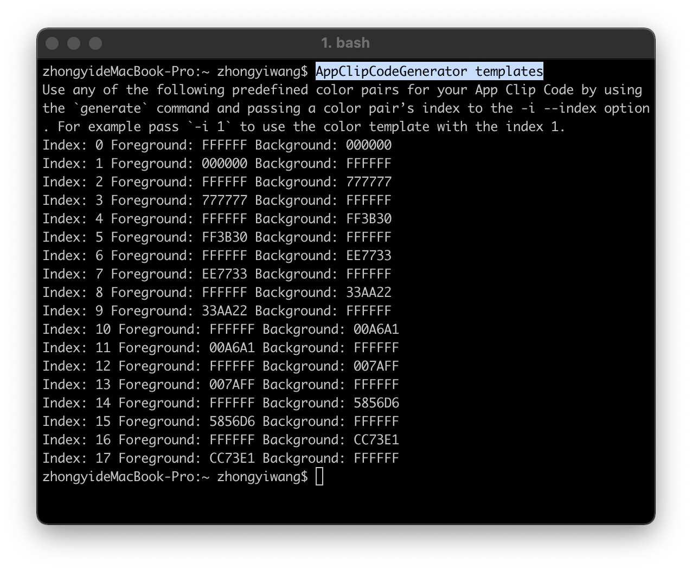

那么这些模板都长什么样子呢？我们可以使用该路径 `/Library/Developer/AppClipCodeGenerator/SampleTemplates` 预览所有模板的样式。
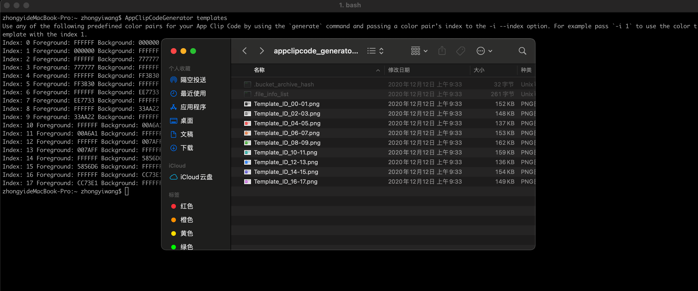

Template_ID_16 看起来不错，所以我准备使用这个模板来生成 WWDC20 内参小专栏的 App Clip Code。
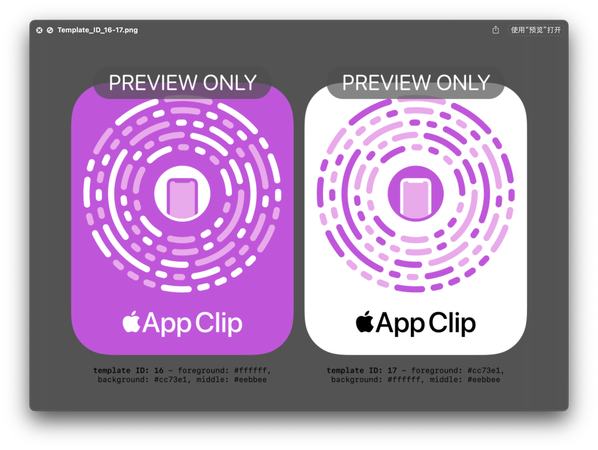
在终端输入
```
AppClipCodeGenerator generate --type nfc --url https://xiaozhuanlan.com/wwdc20 --index 16 --output wwdc20.svg
```
- --type 后的参数可以填写 cam 或者 nfc，来选择生成只支持扫描或内置 NFC 的 Code。区别是生成的 Code 中间的 Logo 是相机或 iPhone。默认为 cam。
- --url 后的参数填写绑定到 Code 的链接。
- --index 后的参数可填写 0 - 17 的数字，来选择 Apple 已有的模板生成 Code。我这里选择的是 16 号的紫色模板。
- --output 后的参数表明轻应用码的名字和格式。Apple 建议我们使用 SVG 格式，SVG 是矢量图形，在放大后仍会保持清晰。

只需一行命令，我们的轻应用码就生成成功了，是不是非常简单？让我们看看我们生成的轻应用码吧。现在可以用 iPhone 扫描器来感受下这个轻应用码了。
<div align=center>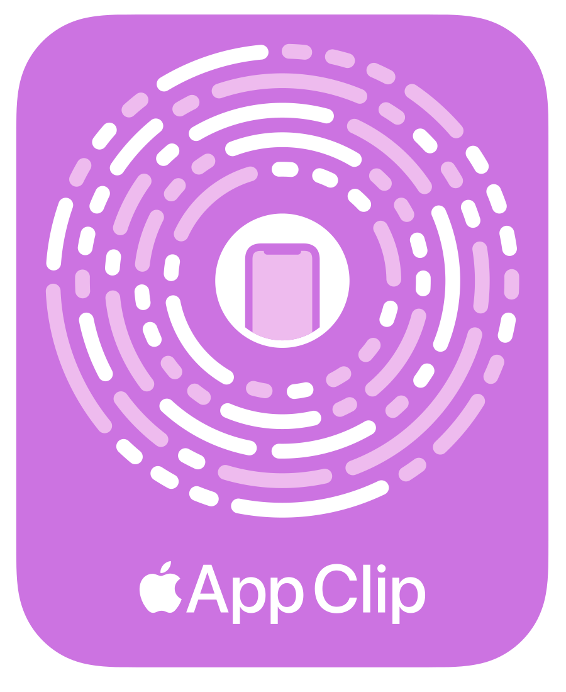</div>

更多轻应用码的自定义配置，请查阅苹果文档 [Creating App Clip Codes with the App Clip Code Generator](https://developer.apple.com/documentation/app_clips/creating_app_clip_codes/creating_app_clip_codes_with_the_app_clip_code_generator?language=objc)
> #### Tips：
> - 使用控制中心的二维码扫描器对这个轻应用码进行扫描，会展示相关的动画。但是因为该 Code 没有关联上架的 App Clip，所以并不会触发完整的体验流程。
> - 轻应用码唤醒 App Clip 仅支持 iOS 14.3 及以上设备。

### App Clip Code 设计规范
除去基于 Apple 提供的模板生成 App Clip Code。设计师可以自定义 App Clip Code 的样式来满足特定的使用场景。
- 可以选择专属的前景色和背景色。
- 可以隐藏 App Clip logo。但是苹果建议如果有足够的空间的话，尽量显示 App Clip logo。这会给用户一个明确的信息，表明这个 Code 是属于 App Clip。
- 添加简单清晰的指导文案。确保信息简明扼要。

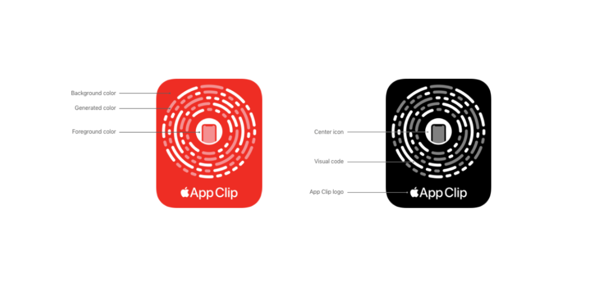

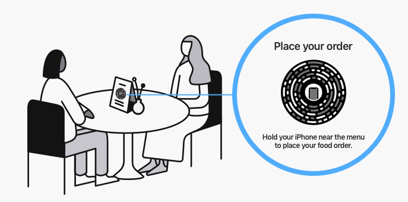

为了轻应用码的最佳浏览体验，要遵守以下的设计规范
- **轻应用码应放置在平坦的表面上。** 避免将 App Clip Code 印在曲面上或者可变形的材料上，比如衣服表面。
- **轻应用码应该垂直放置。** 确保不要旋转 App Clip Code 和中间的 logo。
- **确保良好的可见度。** 用户很难去发现太小的 App Clip Code，请确保 Code 至少一英寸宽。确保 App Clip Code 没有被遮挡、损坏或与其它的 Code 靠的太近。
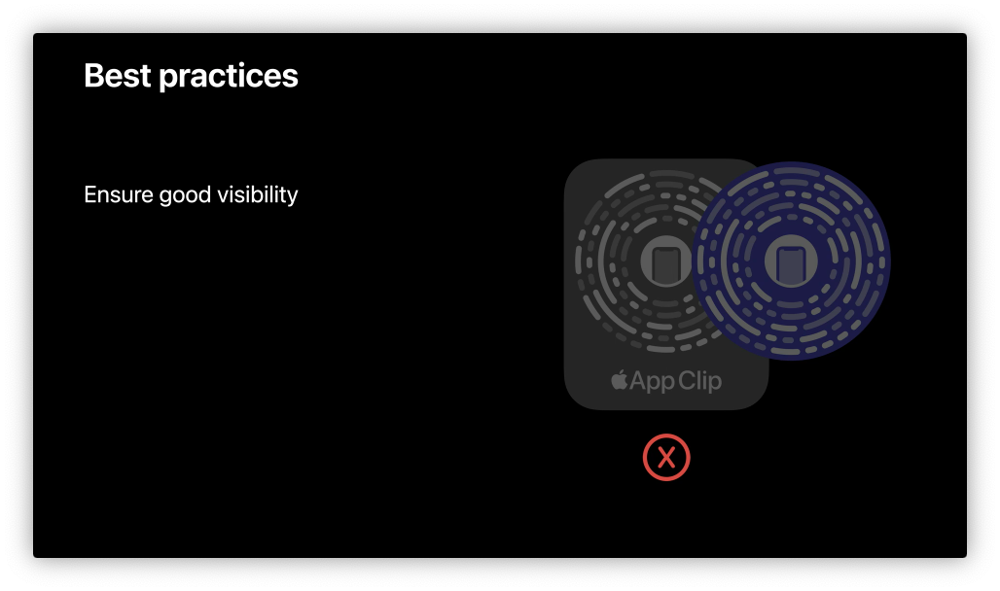
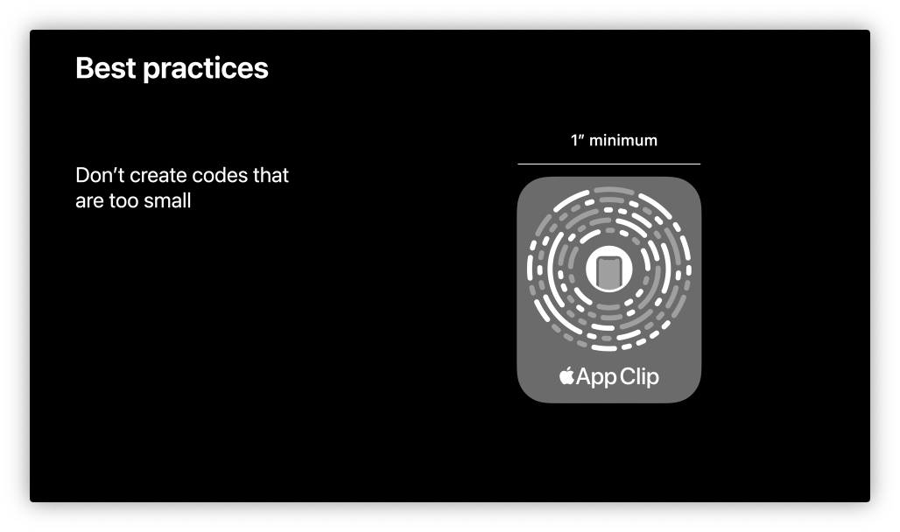
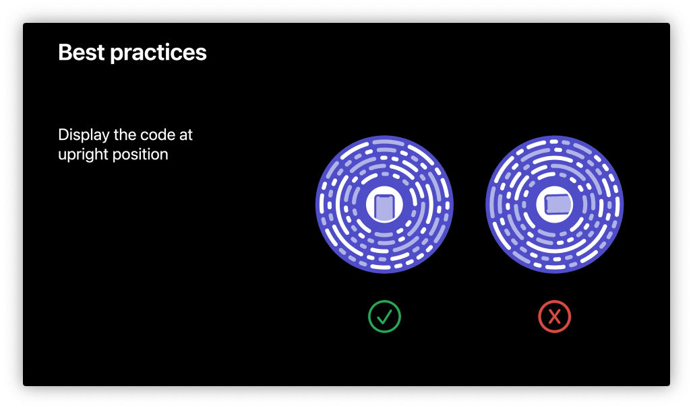
获取更多设计规范的信息，请参阅 [Human Interface Guidelines](https://developer.apple.com/design/human-interface-guidelines/app-clips/overview/app-clip-codes/)。


## 总结
在今年的 session 中，我们看见了来自世界各地优秀的 App Clip。
我们探讨了 App Clip card 在 Safari 和 SafariViewController 的全新展示效果。同时也演示了如何使用本地体验来测试 App Clip card。
最后，介绍了 App Clip Code 和如何使用终端工具进行生成。

今年 session 的标题虽然是 `What's new in App Clips`，但是大多的篇幅都是基于去年 session 的延伸和补充。经过一年的发展，App Clip 的各项配置和环境都愈加的完善和成熟。
希望国内可以有有更多优秀的 App Clip 的出现。

**Have a great WWDC！**


