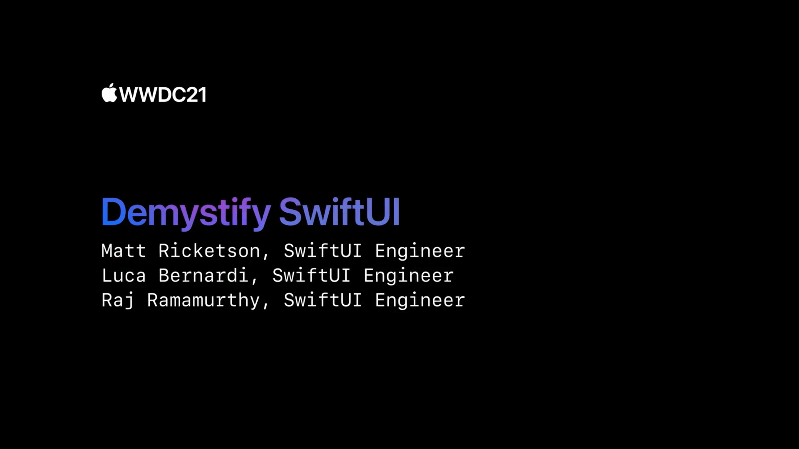

# SwiftUI 技术内幕

**文章大纲** 

- [前言](#%E5%89%8D%E8%A8%80)
- [回顾](#%E5%9B%9E%E9%A1%BE)
    - [语法糖](#%E8%AF%AD%E6%B3%95%E7%B3%96)
    - [控件使用](#%E6%8E%A7%E4%BB%B6%E4%BD%BF%E7%94%A8)
    - [状态管理](#%E7%8A%B6%E6%80%81%E7%AE%A1%E7%90%86)
    - [渲染流程](#%E6%B8%B2%E6%9F%93%E6%B5%81%E7%A8%8B)
    - [概念区分](#%E6%A6%82%E5%BF%B5%E5%8C%BA%E5%88%86)
- [介绍](#%E4%BB%8B%E7%BB%8D)
- [视图标识 (View Identity)](#%E8%A7%86%E5%9B%BE%E6%A0%87%E8%AF%86-view-identity)
    - [定义 Identity](#%E5%AE%9A%E4%B9%89-identity)
    - [声明式 Identity](#%E5%A3%B0%E6%98%8E%E5%BC%8F-identity)
    - [结构性 Identity](#%E7%BB%93%E6%9E%84%E6%80%A7-identity)
    - [危险的 AnyView](#%E5%8D%B1%E9%99%A9%E7%9A%84-anyview)
- [生命周期 (LifeTime)](#%E7%94%9F%E5%91%BD%E5%91%A8%E6%9C%9F-lifetime)
    - [Lifetime 与 Identity 的关系](#lifetime-%E4%B8%8E-identity-%E7%9A%84%E5%85%B3%E7%B3%BB)
    - [Lifetime 与 State 的关系](#lifetime-%E4%B8%8E-state-%E7%9A%84%E5%85%B3%E7%B3%BB)
    - [稳定的 Identity](#%E7%A8%B3%E5%AE%9A%E7%9A%84-identity)
- [依赖关系处理 (Dependencies)](#%E4%BE%9D%E8%B5%96%E5%85%B3%E7%B3%BB%E5%A4%84%E7%90%86-dependencies)
    - [依赖关系图](#%E4%BE%9D%E8%B5%96%E5%85%B3%E7%B3%BB%E5%9B%BE)
    - [改进 Identity](#%E6%94%B9%E8%BF%9B-identity)
      - [稳定性](#%E7%A8%B3%E5%AE%9A%E6%80%A7)
      - [唯一性](#%E5%94%AF%E4%B8%80%E6%80%A7)
      - [去分支](#%E5%8E%BB%E5%88%86%E6%94%AF)
- [总结](#%E6%80%BB%E7%BB%93)

## 前言

嗨，朋友，还记得 2019 年 WWDC，苹果推出 SwiftUI 的瞬间吗？回想起来，就像在昨天，那是一个多么令人兴奋的时刻啊。两年过去了，去用 SwiftUI 实现你的创意吧，对，就是现在。为什么这么肯定呢？让我们从以下四个方面来分析。

- 历时三年，SwiftUI 的基本语法、控件、生态已经成熟，知名开源库基本都已适配 SwiftUI；能够在 UIKit 上自定义的控件，在 SwiftUI 上能够以更简单的方式实现
- 苹果官方自己大力推广使用，现在苹果自家的天气、地图、相册、Apple Pay、快捷指令等很多应用中，都可以看到 SwiftUI 的身影
- 在 WWDC 2021 Session 里很多非 SwiftUI 方面的技术，都会以 SwiftUI 为示例来讲解 API 的使用方式，也就是说 SwiftUI 成为了展示其他技术的基础
- iOS15 推出后，项目可以最低支持到 iOS 13 以上，结合 HostingController 和 HostingView 在现有的代码中使用 SwiftUI，岂不快哉

所有这些迹象都表明 SwiftUI 已经不是一个玩具，它完全可以做出各种漂亮的界面和交互，无论是在性能还是易用性上都没的说。 

SwiftUI 能有今天的成果，说明苹果工程师在它上面下了大力气，背后肯定经历了无数次的改进和优化，这也足以体现出 SwiftUI 在整个苹果技术生态中的重要性。

本篇文章是基于 [Session 10022 - Demystify SwiftUI](https://developer.apple.com/videos/play/wwdc2021/10022/) 撰写，Session 的演讲者是 [Matt](https://twitter.com/ricketson_)、[Luca](https://github.com/lukabernardi)、Raj  三位大神。

## 回顾

今年同样是我带着大家一起来探索 SwiftUI 内部的奥秘，为了让文章通俗易懂，让我们先从语法糖、控件使用、状态管理、渲染流程四个方面来对 SwiftUI 有个整体的把控，如果想更连贯的理解 SwiftUI 基础知识和内部原理。推荐阅读之前由我操刀撰写的另外两篇文章 [SwiftUI 数据流](https://xiaozhuanlan.com/topic/0528764139)、[SwiftUI 编程指南](https://xiaozhuanlan.com/topic/9014753268) 。

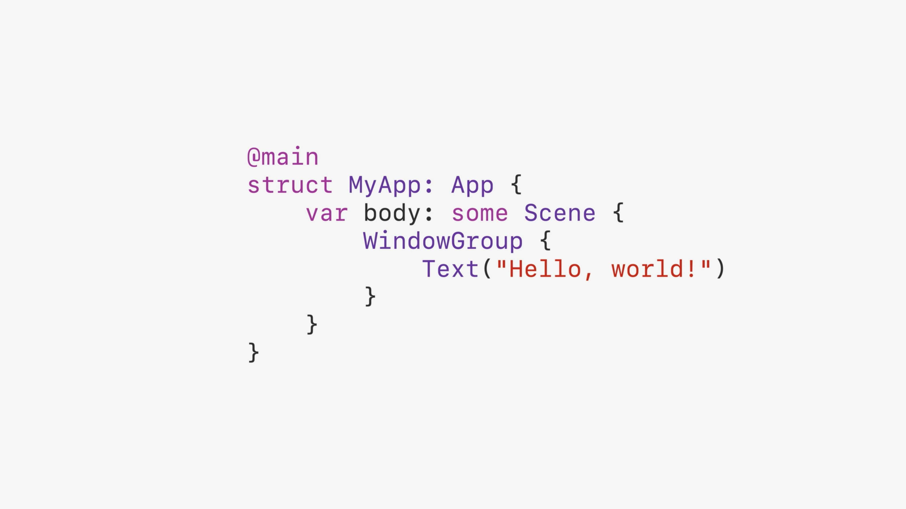

### 语法糖

简单的语法是一个声明式 UI 框架的基石，让 SwiftUI 能够像写 HTML 一样简单的关键就是以下这些 Swift 新语法特性

**SwiftUI Syntax**

- ResultBuilder 
- ViewBuilder
- Trailing Closure
- Opaque Type
- Inline

**State Syntax**

- PropertyWrapper
- KeyPath
- DynamicMemberLookup

### 控件使用

SwiftUI 为我们提供了各种控件，多到看起来可能会有点蒙，下面这个分类希望能帮到你，基本上能够把所有的控件都囊括在这些分类中，如果你有 SwiftUI 经验，不妨可以看着这些分类去想想那些对应的控件是怎么使用的

- 基础控件
- 列表控件
- 布局容器
- 动画和图形
- 修饰器
- 事件和手势
- 集成现有框架

### 状态管理

所有声明式的 UI  框架，都是用数据来驱动，那么这些数据声明方式，就是在开发者和框架之间搭建桥梁，非常重要。SwiftUI 官方给出了以下数据声明方式，它们全都是通过 PropertyWrapper 来包装使用。看到它们，大家的第一反应是不知道如何选择它们，这里有个口诀：`状态自己管 绑定要双向 管理靠对象 变化才监听` 来帮助你战胜它们。

- @State
- @Binding
- @Environment
- @StateObject
- @ObservableObject
- @EnvironmentObject
- @Published

### 渲染流程

讲了这么多概念，那 SwiftUI 内部到底是怎么运作的呢？下面这张图能帮助你更好的理解它内部的原理。

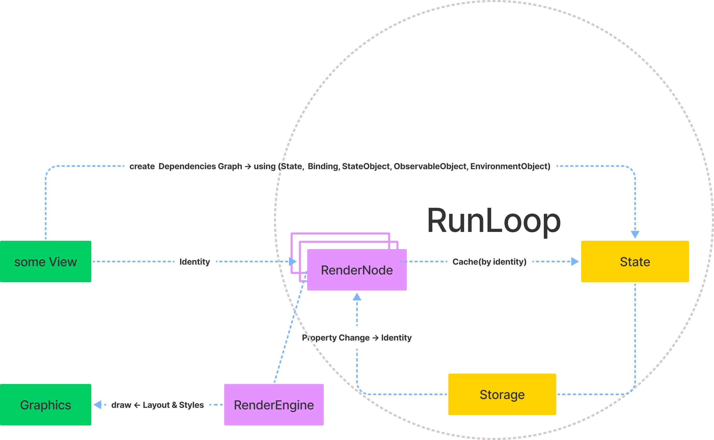

首先所有的 SwiftUI 控件都是一个结构体，实例是值类型，它们会遵循 View 协议，实现  body 计算属性；这个 body 计算属性内部所描述的就是你想要的视图结构的样子。所以每个 body 得到的 some View 都会映射到 SwiftUI 内部的一个 RenderNode，RenderNode 也会持有在自定义 View 上定义的各种状态，为这些状态分配内存空间存储数据，同时给这些状态的添加属性监听，一旦状态属性发生变化，就重新建立 some View 到 RednerNode 的映射关系。后台的渲染引擎 (CoreGraphics, Metal) 会通过 RenderNode 对比 some View 的变化，在 RunLoop 的加持下，将变化的部分绘制出来，最终呈现给用户。

虽然上面的流程是这样子的，但在之前 SwiftUI 官方只是告诉你怎么把数据声明为 SwiftUI 可感知的状态，触发界面绘制。并没有明确的说明以下四个问题：

1. SwiftUI View 和 RenderNode 之间是按照什么关系来映射的？
2. SwiftUI View 和 RenderNode 生命周期是否一致，存在什么关系？
3. SwiftUI View 重新实例化后，State 是如何被保持住的？
4. 状态发生变化后，SwiftUI 是怎么找到相应的 View 和 RenderNode 来进行操作的？

这篇文章通过通俗易懂的例子，来解答上面四个问题，并帮助你养成良好的 SwiftUI 编程习惯。

### 概念区分

在下面的文章中请注意区分如下两个概念：

- `SwiftUI 控件`、`View` 都是结构体，是值类型，代表的是开发者用 DSL 描述的界面布局和层级
- `视图`、`界面元素`都是类，是引用类型，指的是渲染节点或真实显示的 UI 界面

## 介绍

众所周知，SwiftUI 是一个声明式的 UI 框架，也就是说开发者可以用 Swift 编程语言来描述应用界面的样子，SwiftUI 内部来处理视图渲染，最终将界面展现给用户。

大多数情况下，SwiftUI 开发确实简单、省事、Bug 少，开发者用起来爽的不要不要的。但一旦出现不可预期的行为，就抓瞎了，这时候需要理解 SwiftUI 的技术内幕，才能更好的处理这些异常情况。

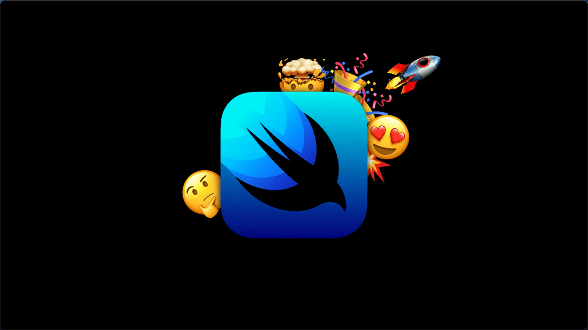

那么 SwiftUI 内部是如何处理开发者编写的描述性代码的呢？其内部有三个核心概念来支撑：

- 视图标识 (Identity) - 标识在应用程序的多次更新过程中视图元素，决定是否重新生成视图元素
- 生命周期 (Lifetime) - 跟踪视图和数据状态随时间变化的过程，根据开发者描述来处理视图如何更新
- 依赖关系 (Dependencies) - 对数据状态进行监听，决定视图何时需要更新

这三个核心概念帮助 SwiftUI 解决什么需要改变，如何改变，以及何时改变的问题，最终渲染出相应的用户界面。

接下来，让我们更深入地讨论这三个概念。

## 视图标识 (View Identity)

### 定义 Identity

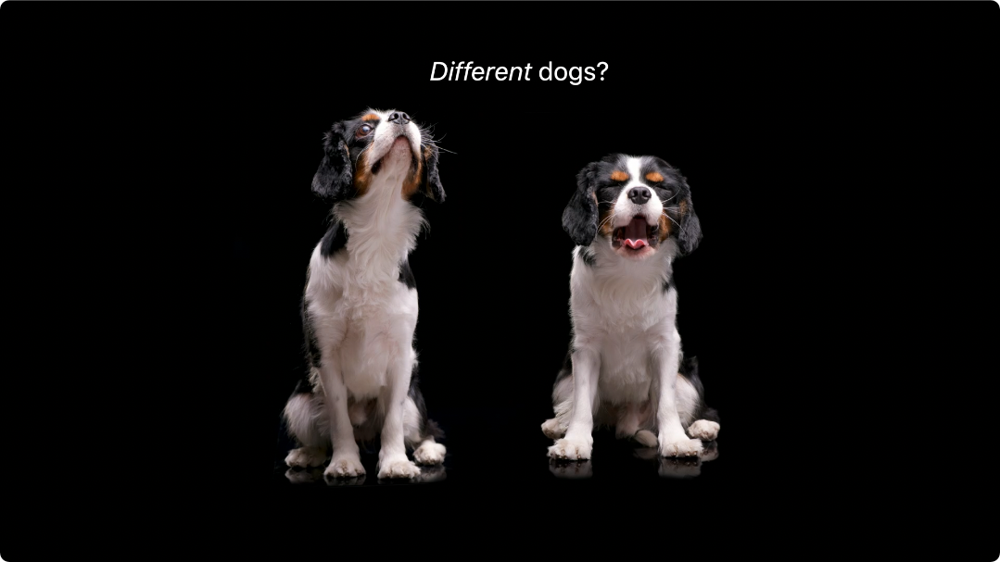

上图中这两只狗狗，到底是不是同一个呢？我们似乎无法准确地给出答案。为什么呢？因为我们缺乏一些关键信息，那就是 Identity。

所以当 SwiftUI 处理你的界面描述时，它也需要  Identity 这个关键信息区分视图是否是同一个。

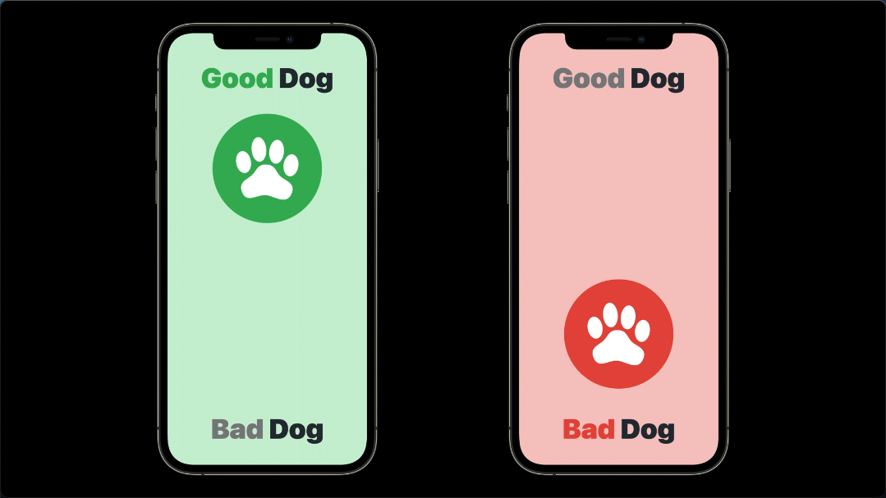

让我们来看下上面这个 Good Dog, Bad Dog 的小应用，你可以点击屏幕上的任何位置来切换狗狗的状态。但是我们从技术层面分析，上面的界面可以有两种 SwiftUI 的描述方式：

1. 自定义两个完全不同的 SwiftUI View，根据当前狗狗的状态去做逻辑判断描述
2. 把上面的界面描述成一个 SwiftUI 自定义 View，在区别展示的地方，用不同的颜色来区分

这两种 SwiftUI 的描述方式，会让视图从一种状态过渡到另一种状态的方式截然不同：

- 按照第一种方式，由于是完全不同的视图，就意味着上面狗爪子的图标应该独立执行过渡动画，最终看起来只有淡入和淡出的效果
- 按照第二种方式，SwiftUI 内部认为它是同一个视图，这就意味着在过渡期间，狗爪子图标会执行在屏幕上滑动的动画效果

可以看出 SwiftUI 在处理过渡动画的时候，会根据不同状态下的 View 是如何连接的来进行处理，而决定 View 连接方式的关键就是 **View Identity**:

- 共享 Identity 的 View 代表的是同一个 UI 界面元素，只是处在不同状态下而已 (Same identity = Same element)
- 代表不同 UI 界面元素的 View，它的 Identity 也总是不同 (Different identities = Distinct elements)

Identity 既然这么重要，那么开发者是如何用代码来定义的呢？在 SwiftUI 中分两种方式来定义 Identity：

- 声明式 Identity，一般是在 View 上添加一个 id(_:) 修饰器或者在数据驱动列表控件中显示声明 Identifier，如 ForEach、List
- 结构性 Identity，是 SwiftUI 根据 View 的类型和层级结构来动态识别，虽然这种 Identity 不需要开发者指定，但也需要开发者清晰的将 View 的层级结构描述出来，方便 SwiftUI 内部识别。

### 声明式 Identity


就像上面这两只狗狗，仅通过图片，很难判断这是不是同一只狗狗，但如果我们能用名字来标识它们。就很容易得出结论。像这样给狗狗起名字来标识它们的方式，就是在显式声明 Identity。

需要注意的是，声明式 Identity 是非常强大且灵活的。我们在之前 AppKit 或 UIKit 中编写界面的方式，其实就是采用的显式声明 Identity 的方式。

由于 UIView 和 NSView 都是类，引用类型，所以它们的实例其实是一个指针，这个指针指向了一块内存空间。其中指针所代表的内存地址就是一种显式声明的 Identity。

我们可以通过视图的指针来标识每个视图，如果多个视图指针，都共享同一块内存空间，那么它们其实是同一个视图，如下图所示：

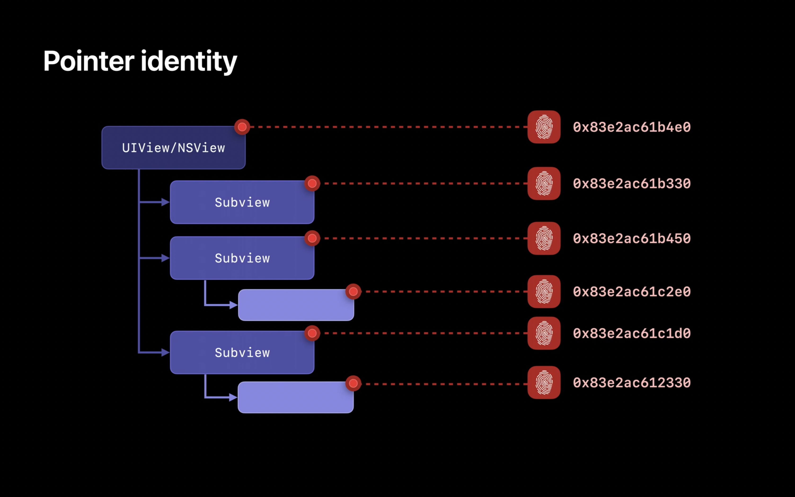

但是，SwiftUI 中的 View 都是结构体， 值类型，没有指针的概念，如下图，那 SwiftUI 怎么来唯一标识一个 View 的呢？

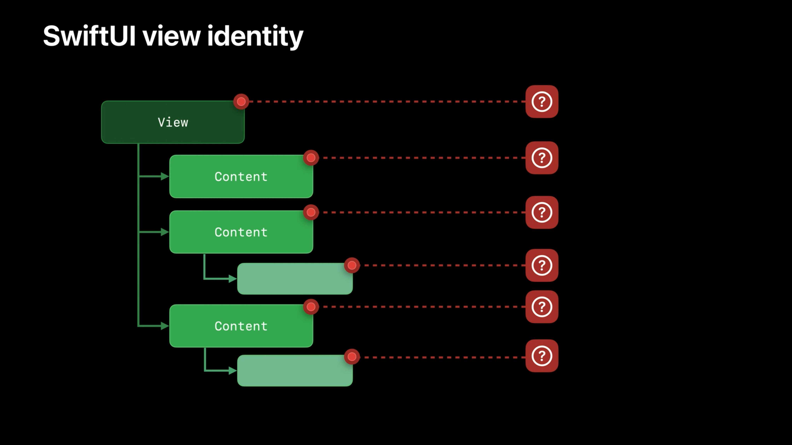

其实，SwiftUI 是用另外一种形式来显式标识 View。通过下面的例子能更好的理解，例如在这个救援犬列表里，用 dogTagID KeyPath 获取相应属性，在参数里指定到 id 上，就是在显式声明 View 的 Identity。这样就能标识出每条数据对应的展示视图。一旦列表数据发生变化， SwiftUI  可以根据这些 ID 来判断，哪些视图需要新生成，哪些视图重复使用，只需要执行动画。

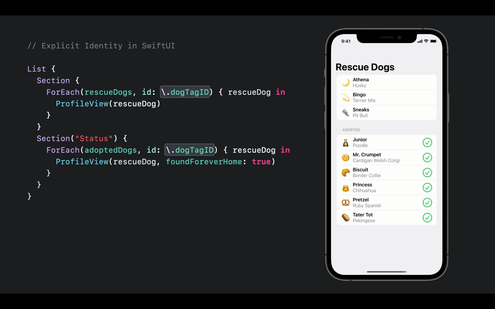

来看一个更高级的列子，如下图。在这里，我们使用一个  ScrollViewReader，点击底部的一个按钮能够跳到视图的顶部，这里就是用 `id(_:)` 修饰器来显式声明顶部 HeaderView 的 Identity。然后我们可以将该 Identity 传递给 ScrollViewProxy 的 `scrollTo(_:)` 方法，从而实现相应的滚动效果。

从代码中可以看出，ScrollViewReader、ScrollView 和 Button 都没有显式指定 Identity。所以 SwiftUI 期望的是在需要的地方显式声明 Identity 就可以，并不需要为所有的 View 显式声明。

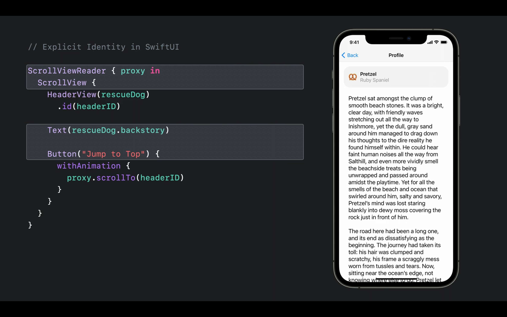

### 结构性 Identity

如上所述，不显式声明 Identity，这并不意味着这些 View 根本没有 Identity，也就是说每个 View 都有一个 Identity，即使它不是显式声明出来的。在这种情况下 SwiftUI 内部会对没有显式 Identity 的 View 根据它的描述层级结构生成一种隐式的 Identity，就叫做结构性 Identity。

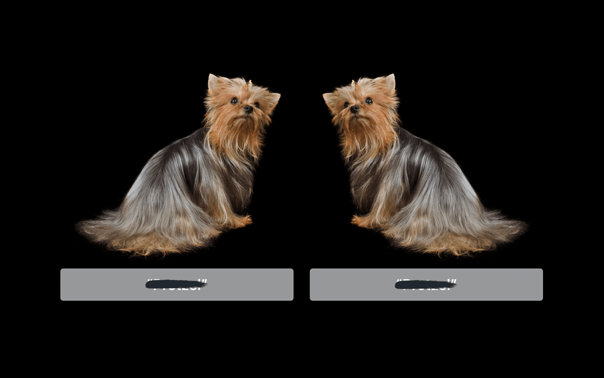

如上图，假设我们有两只相似的狗狗，但我们不知道它们的名字，我们仍然还要标识出它们。这时候可以通过它们坐的位置来标识，如 `左边的狗` 或 `右边的狗`。

像这种利用排列位置的不同，来区分它们的方式就是所谓的 **结构性 Identity**。

SwiftUI 几乎在所有地方都采用了这种结构化 Identity 的方式来标识  View。一个典型的例子就是在 SwiftUI 中 使用 if else 条件判断的时候，条件语句的结构使得 SwiftUI 能够明确的识别每个 View，如下图，第一个 AdoptionDirectory 只在条件为 True 的时候显示，第二个 DogList 只在条件为 False 的显示。

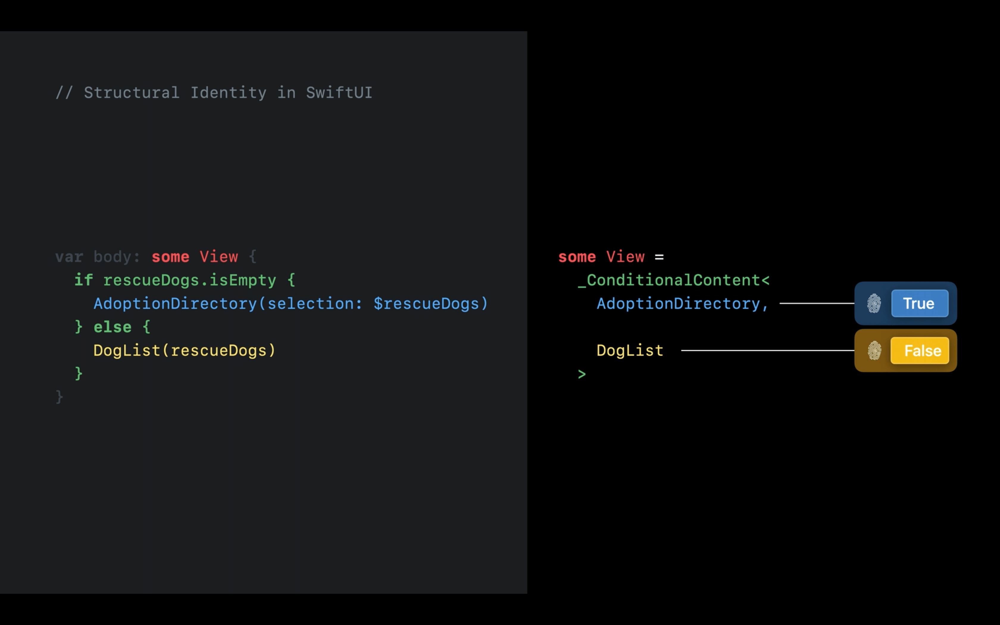

但是 SwiftUI body 计算属性需要一个明确一致的返回类型，但 if else 条件判断使得返回类型不一致了，会引起编译失败。这时候 SwiftUI 引入了一个的黑魔法 - **ViewBuilder (默认是附加在 body 计算属性上的，不需要开发者单独指定)**。ViewBuilder 帮助 SwiftUI 把各种条件判断，封装成 _ConditionalContent 的数据结构。但为了区分在不同分支下的类型不同，用泛型来进行了区分，这样即保证了返回数据的一致性，又保证了 SwiftUI 内部可以通过泛型识别出不同分支下结构性 Identity。

如下图，我们再回到 Good Dog, Bad Dog 的小应用，如果利用分支语句来描述 SwiftUI 的 View，就会在不同的条件下生成不同的结构性 Identity。在 SwiftUI 内部会生成不同的视图元素实例，它们是不连续的，这也就解释了在不同状态下界面切换的时候，为什么只会有淡入淡出的过渡效果。

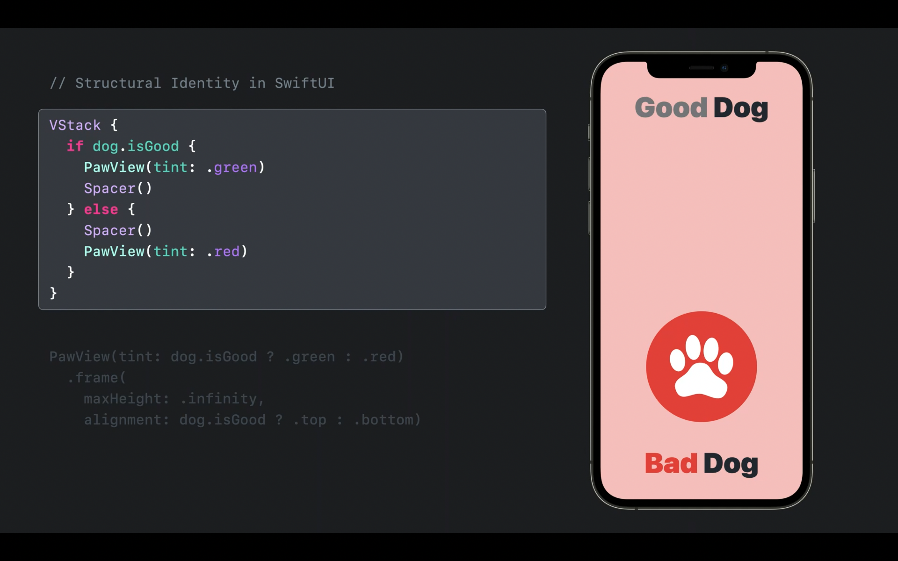

而用另外一种方式来描述，如下图，我们只用一个 PawView 自定义View，在这个自定义的 View 的 Modifier 上利用三目运算的方式来动态改变需要变化部分的数值，当在不同状态之间发生界面切换的时候，由于始终是一个视图元素，所以就会执行平滑的滑动动画。

其实，如果你回到 UIKit 中理解，也是一样的，我们在 UIView 上执行动画的时候，一般也是在同一个 UIView 的实例里去动态改变它的属性去修改样式， 才会有那种平滑过渡的效果；相反，如果虽然是同一个类型的 UIView，但是对应的是不同的实例，去做那种平滑的过渡效果，也是很难实现的。

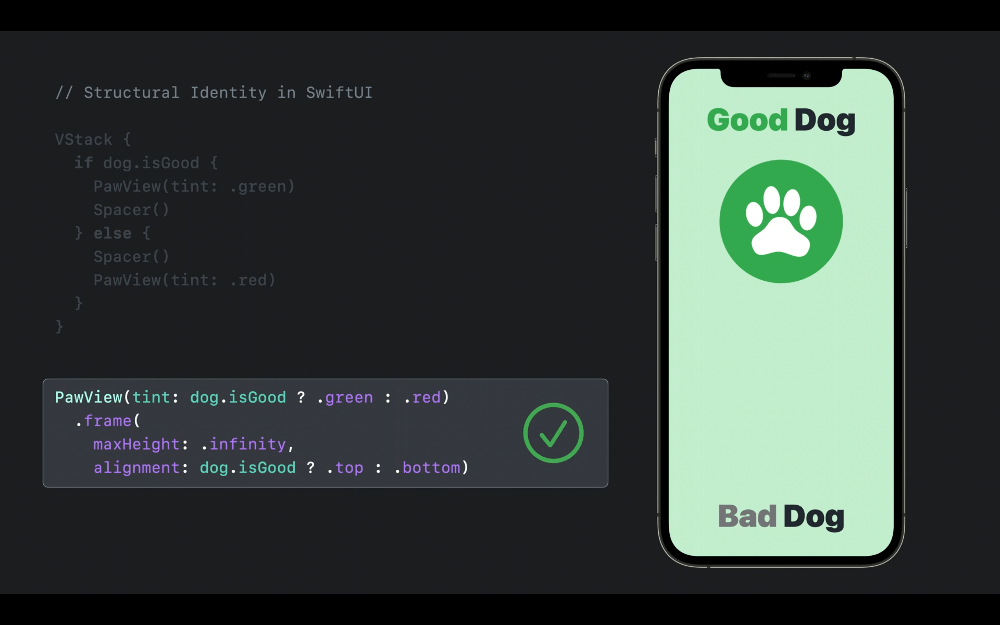

综上所述，在使用结构性 Identity 的时候，第二种描述 View 的方式是更好的选择。应该尽量避免切换 Identity，这样做会给动画和性能都带来良好的效果，也有利于维持视图的生命周期和数据状态。

### 危险的 AnyView

说起 AnyView ，这家伙绝对是 Identity 的克星。

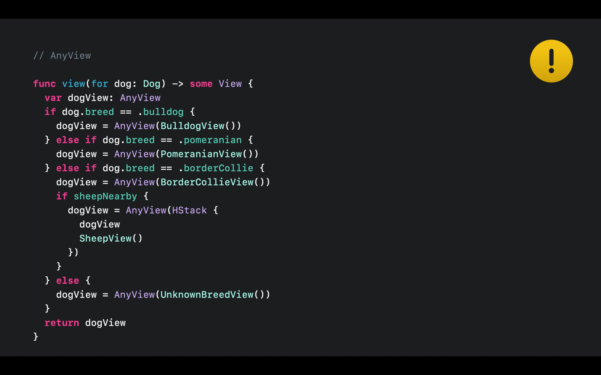

上图是一个使用 AnyView 的示例代码。在这个自定义 View  中，为了保证最终返回一个明确一致的数据类型，每个分支都用一个 AnyView 包裹起来。由于 AnyView 隐藏了所包装视图的类型，让 SwiftUI 无法在条件判断中识别出结构性 Identity，在 SwiftUI 眼里，它看到的都是一些擦除类型的 AnyView，更要命的是，这段代码阅读起来特别困难。

那么，接下来让我们用正确的方式来重构这段代码：

- 第一步：消除 AnyView 包裹，把内部具体的 View 类型暴露出来
- 第二步：去掉 所有的 return 关键字
- 第三步：在方法上添加 @ViewBuilder 标识，保证最终返回的是一个明确的类型，编译通过
- 第四步：由于我们只是在 dog 的 breed 状态之间来回判断，那么把 if else 改为 switch case 会更合适

重构后，最终代码和 View 层级结构如下图：

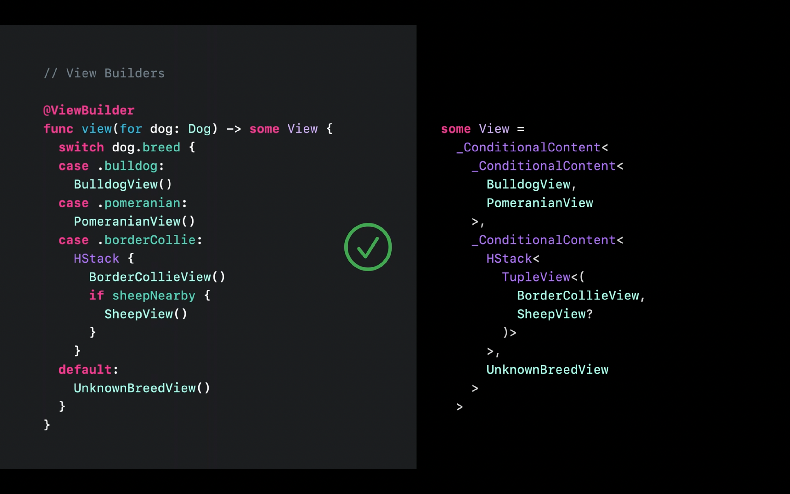

一般情况下，还是尽量避免使用 AnyView，因为 AnyView 有如下缺陷：

- 代码难于阅读
- 由于擦除了所有的 View 类型，无法在编译的过程中给出相应的提示
- 可能会导致不必要的性能损失

## 生命周期 (Lifetime)

### Lifetime 与 Identity 的关系

上面我们理解了 SwiftUI 如何给 View 添加 Identity 。下面我们来看下 Identity 与视图的生命周期的关系。

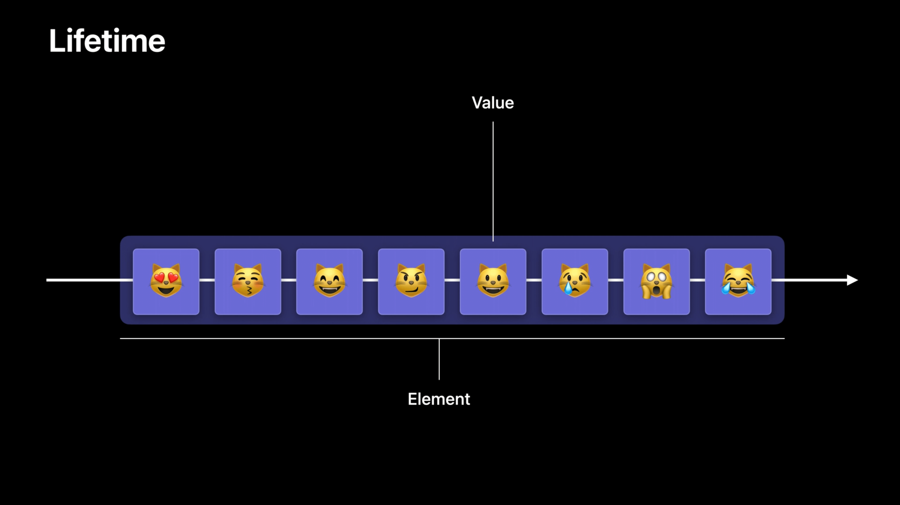

如上图，这里有个叫 Theseus 的小猫。他在一天中可能有各种不同的状态，一会装可爱，一会睡觉，一会发火，但是无论处于何种状态，他都是那只叫 Theseus 的小猫。

视图在整个生命周期内有各种不同的状态，每个状态在 SwiftUI 中由不同的 View 实例(值类型)来描述，而 Identity 将这些不同状态下的 View 值随着时间的推移关联起来，它们都对应着同一个视图元素。这就是 Identity 与视图生命周期建立联系的本质。

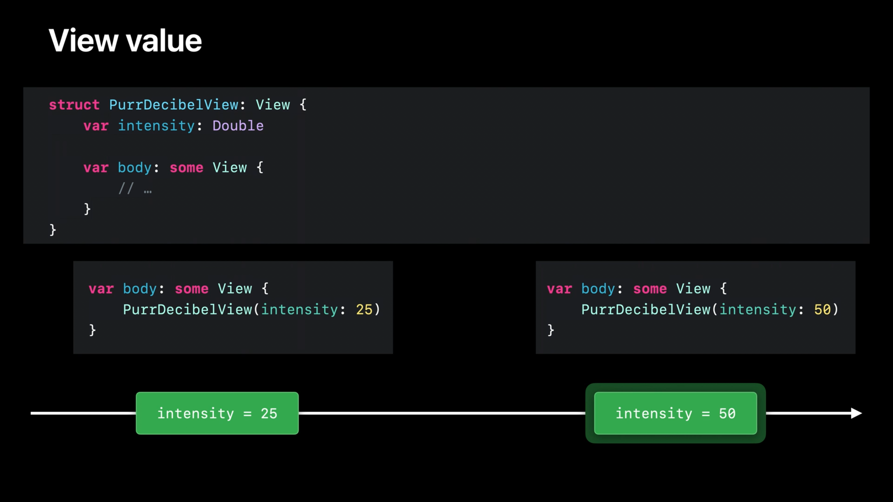

让我们用上面的代码来更清晰的理解这一点，这里我们有一个简单的自定义 View - PurrDecibelView，用来显示猫叫声的强度。一开始的时候 SwiftUI 调用 body 计算属性，获取到叫声为 25 的 View，但是突然小猫饿了，希望获得更多的关注，叫声变大为50，这时候 SwiftUI 监听到叫声这个状态的变化，重新调用 body 计算属性，获取到一个全新的 View，这两个 View 是完全截然不同的两个值。SwiftUI 会在后台对这两个值进行对比并对比出哪些部分发生了变化。得出对比结果后，告诉渲染视图执行变化部分的渲染操作，同时，用完的 View 值也会被销毁。

这里非常重要的一点就是 View 的值跟 Identity 生命周期是不同的。值类型的 View 生命周期是非常短暂的。开发者要控制好的其实是它们的 Identity。也就是说，随着时间的推移， SwiftUI 创建很多新的 View 用来描述视图当前状态下的显示方式，但是 SwiftUI 内部只是拿这些 View 来进行样式和布局的对比，用完了这些 View 值就会销毁，其内部用 Identity 唯一标识的那个视图(RenderNode)会一直在内存中，并且一直都是同一个。但是一旦 Identity 发生变化，内部的视图元素生命周期也会结束。

所以，如下图，我们经常用到的生命周期方法 onAppear 和 onDisappear，其实是在视图显示和消失的时候触发，而不是 View 创建和销毁的时候触发。

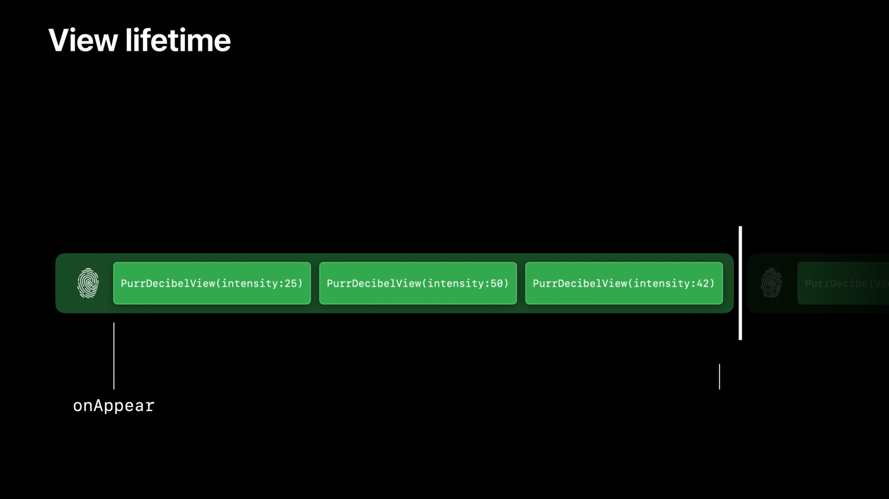

所以最终我们得出如下公式来阐述 View，LifeTime，Identity 三者之间的关系：

```swift
1. View Value ≠ View Identity
2. View(视图)'s LifeTime = duration of the Identity
```

### Lifetime 与 State 的关系

理解了 Identity 与视图生命周期之间的联系，也能够帮助你更好地理解 SwiftUI 如何维持数据状态。

提到维持数据状态，那肯定要用到 State 和 StateObject。这两个状态管理工具可以保证在不同的 View 实例被创建的时候，封装的数据能够一直维持在内存中，相当于一种内存记忆。但是你去看它们的定义会发现它们都是结构体。按理说，在每次创建新的 View 实例后，应该就销毁重新生成了，那咋维持数据的呀？其实它们内部都会有一个 Storage 类，用来存储它们所修饰的数据。当一个视图根据 Identity 第一次创建的时候，SwiftUI 在内部为 State  和 StateObject 的 Storage 分配相应的内存空间，用来保存状态的初始值。**注意这里的 Storage 跟 Identity 是对应的，生命周期也是一致的**。

如下图的 CatRecorder 自定义 View，每次的 title 发生变化，由于他被 @State 修饰，SwiftUI 内部会在内存中保存这个数据，并且监听他的变化，一旦发生变化，就调用 body，重新计算。

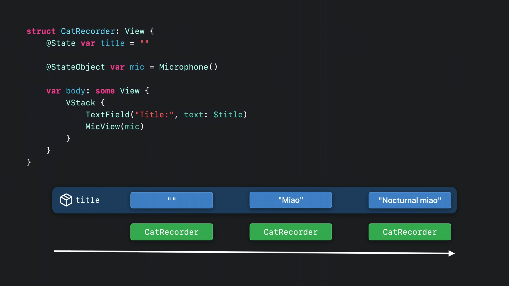

下面，让我们来看一下在有分支的情况下，视图生命周期和数据状态之间的关系。

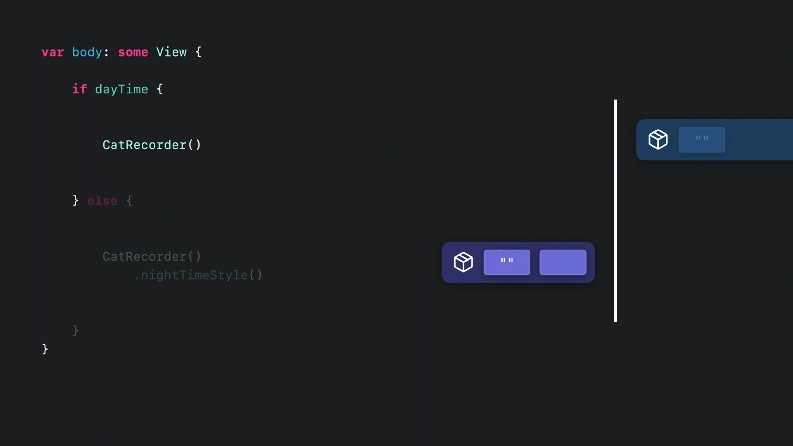

如上图代码，分支里的两个 CatRecorder 由于结构性 Identity 不同，所以它们被 SwiftUI 视为是两个不同的视图。之前说过这样会影响动画效果，其实也会影响它们内部数据状态的维持。

比方说，第一次进入的是 True 分支，SwiftUI 会为 CatRecorder 生成一个新的视图，并为数据分配内存空间，以存储状态的初始值。当 CatRecorder 内部状态发生变化时，只要都是在 True 分支下，由于 Identity 没变，所以还是同一个视图，所以状态也会连续性的变化，不会有数据丢失的情况。但是一旦 dayTime 发生变化，进入了 False  分支，SwiftUI 发现 Identity 发生了变化，会生成新的视图和与之对应状态的内存空间，这时候新的 CatRecorder 内部的所有状态都是初始值。True 分支下的视图和对应的状态接下来也会被释放。如果我们再切回到 True 分支，之前 True 分支的状态也回不来了，因为相较于上次的 View 类型，这又是一个全新的 Identity，会重新创建视图和数据状态存储空间。所以，最终分支切换后，在界面上有时候会发现记录的小猫状态突然丢失了。

所以可以得出的结论是：View Identity 一旦变化，视图内部对应的数据状态也会被重新替换。也就是说：

```swift
State's Lifetime = 视图's Lifetime != View's Lifetime
```

### 稳定的 Identity

保证 Identity 稳定，这一点非常重要，尤其是在使用数据驱动型的列表控件时，在下面这些控件中，往往都需要用数据的 id 来给 View 显式声明 Identity。

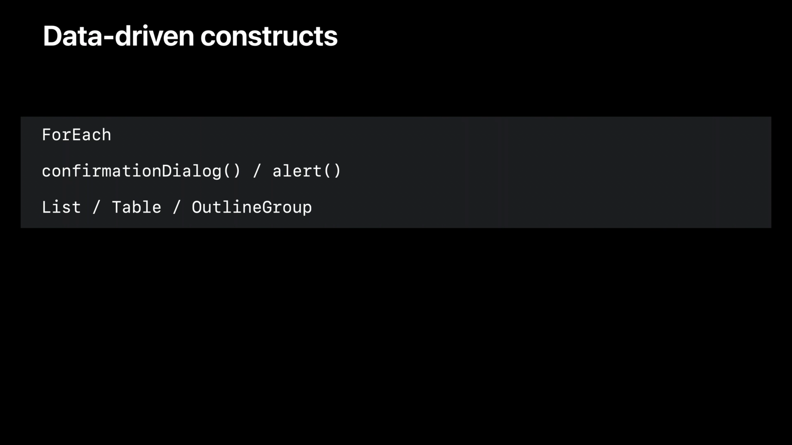

下面两张图是两种不同的 ForEach 的用法。其中第一种用法是一个常数的 Range，SwiftUI 可以直接用 Range 的值来为视图生成 Identity，以确保在视图的整个生命周期内 Identity 是稳定的。但当使用一个动态的 Range 时，会导致声明式的 Identity 数值是不可预期的，Identity 一旦切换，视图都会重新生成，这样就会出现性能问题。 所以在 Xcode 12 的时候，检查到这种使用方式会编译报错，而在新版本的 Xcode 13 这将变为一个警告 (beta 版本似乎不生效)。

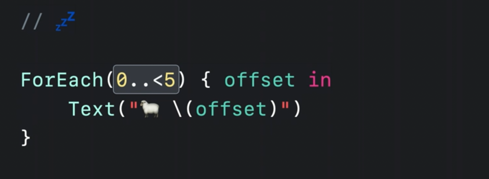

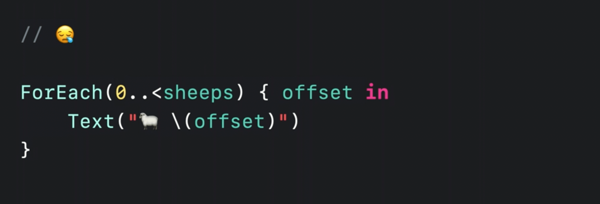

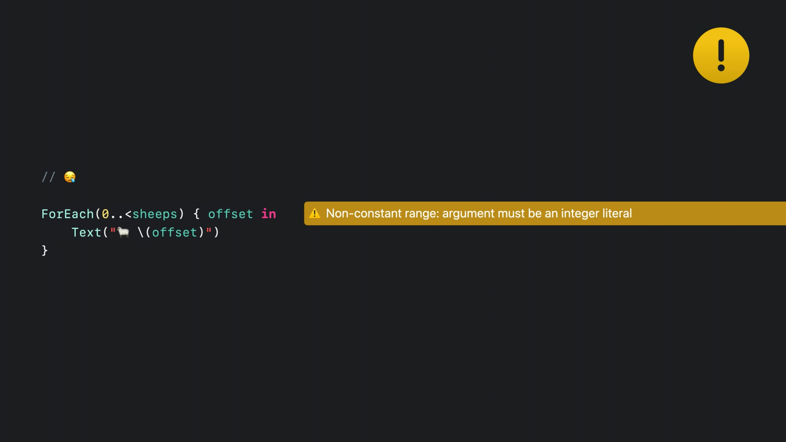

下图中，我们用一个动态的集合作为 ForEach 的初始化参数。这样用就需要同时配上对应数据结构的 KeyPath，方便获取到数据的相应属性来显式声明为 Identity。注意这个属性必须遵循 Hashable 协议，来保证 Identity 的唯一稳定性。

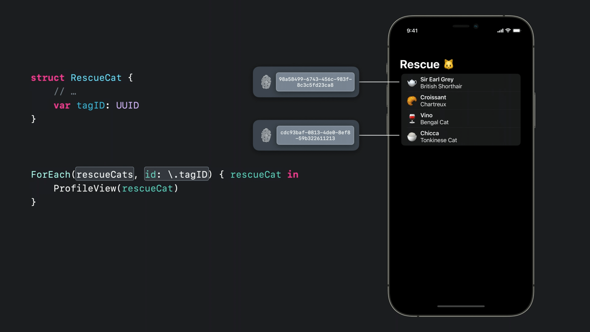

在 Swift 标准库有个 Identifiable 协议来帮助开发者保证 Identity 稳定。SwiftUI 也充分利用了这个协议，使得开发者只需要提供 KeyPath，它内部通过 Identifiable 协议可以动态的访问到相应的属性，从而生成稳定的 View Identity。

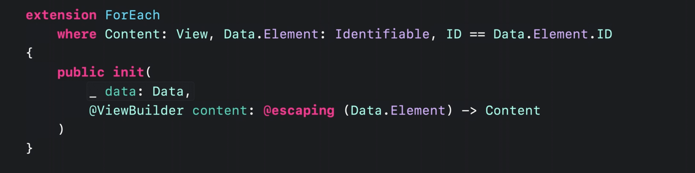

如上图，如果仔细看下 ForEach 控件初始化函数的定义，可以看出 SwiftUI 充分利用了 Swift 类型系统的特性来约束 API 使用体验：

- 通过这个定义，能一眼看出 ForEach 声明了一个数据集合和一个视图集合之间的关系
- 将集合中的元素限制为必须遵循 Identifiable 协议，目的是为了保证集合元素能够提供一个稳定的 Identity，以便 SwiftUI 可以在视图的整个生命周期内跟踪数据。

所以，确保 Identity 的稳定性，对于开发者来说是非常重要的。因为他会影响到视图和与之对应数据的生命周期。

## 依赖关系处理 (Dependencies)

### 依赖关系图

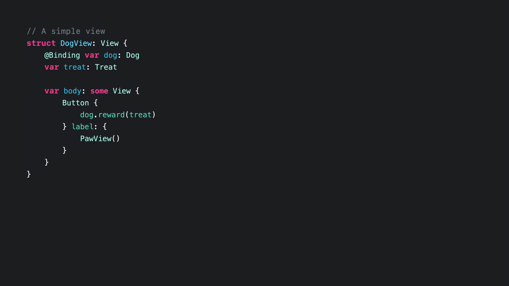

接下来，让我们看下上面的代码，这个自定义的 View 有两个属性 dog 和 treat，它们都可以理解为视图的依赖关系。依赖关系就是视图更新的入口。当依赖关系发生变化时，会重新调用 View 的 body，获取整个 View 的层级描述信息。在这个例子中，描述的就是一个有触发行为的按钮。他对应的视图层级结构如下：

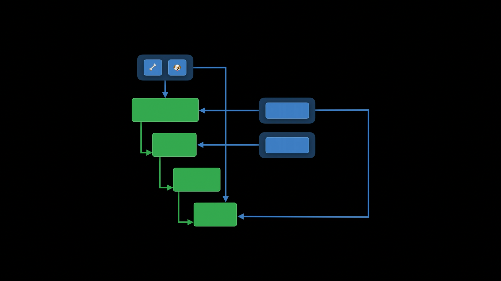

看上面这张图的话，是一个树结构，但是有可能多个视图都依赖同一个状态。有可能某个子视图也依赖顶级视图中的状态。情况越来越复杂后，这就不再是一个树结构。重新整理，避免让连接线之间交叉，如下图，可以看出它们之间的关系实际上是一个图结构。我们可以称之为**依赖关系图**。

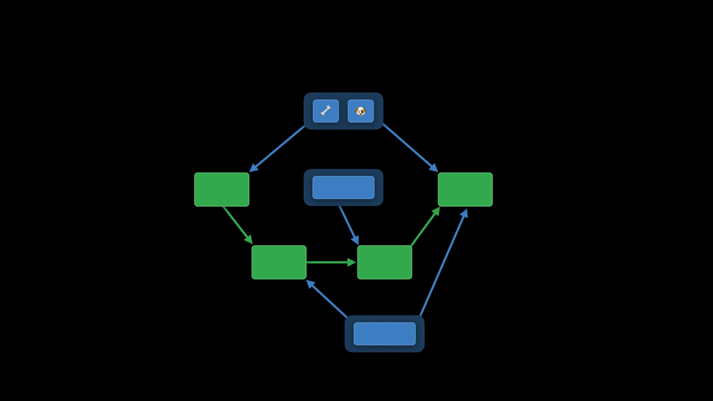

深入的理解这个依赖关系图很重要，因为它保证了 SwiftUI 只更新那些需要重新调用 body 的 View。以最底部的依赖关系为例。如果我们检查这个依赖关系，会发现有两个 View 依赖它，当依赖的数据状态发生变化，只有这两个 View 会被标记为无效。同时 SwiftUI 开始调用每个视图的 body 计算属性，只为标记为无效的视图产生一个新的  body 值。

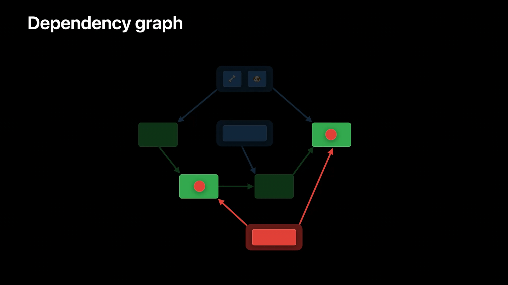

正如在文章开头介绍的状态管理工具，在 SwiftUI 依赖关系的建立就是通过它们来实现的：

- @Binding
- @Environment
- @State
- @StateObject
- @ObservableObject
- @EnvironmentObject

### 改进 Identity

Identity 就是依赖关系图的灵魂。正如之前所说，Identity 用来标识一个视图，所以 SwiftUI 会根据 Identity 来高效的判断哪些视图需要更新，哪些视图需要新建，哪些视图需要销毁。

#### 稳定性

对于开发者来说，首先要确保的就是 Identity 的稳定性。

稳定的 Identity 会给 SwiftUI 带来如下好处：

- 确保视图生命周期的准确性，一个视图的生命周期是由 Identity 来决定的，一个不稳定的 Identity 会导致视图生命周期意外缩短
- 提高应用程序的性能，SwiftUI 无需在依赖关系图更新的过程中为不必要的视图和状态重新分配内存空间
- 缩小影响依赖关系影响的范围
- 保证数据状态不会无故丢失

在下图的例子中，每次都生成一个 UUID 和 直接用 Indices 来显式声明 Identity 都是不稳定的方式，因为它们都会随着时间推移发生变化，不能准确地标识一个视图，最终导致的结果就是，当我们在列表头部新插入数据时，整个列表都会重新刷新。相反，我们如果用一个 databaseID 就是可以的，因为这个 ID 只对应一个数据，能够清晰的标识一个与该数据对应的视图。这时候我们在头部新插入数据，所有的动画效果都非常自然了。

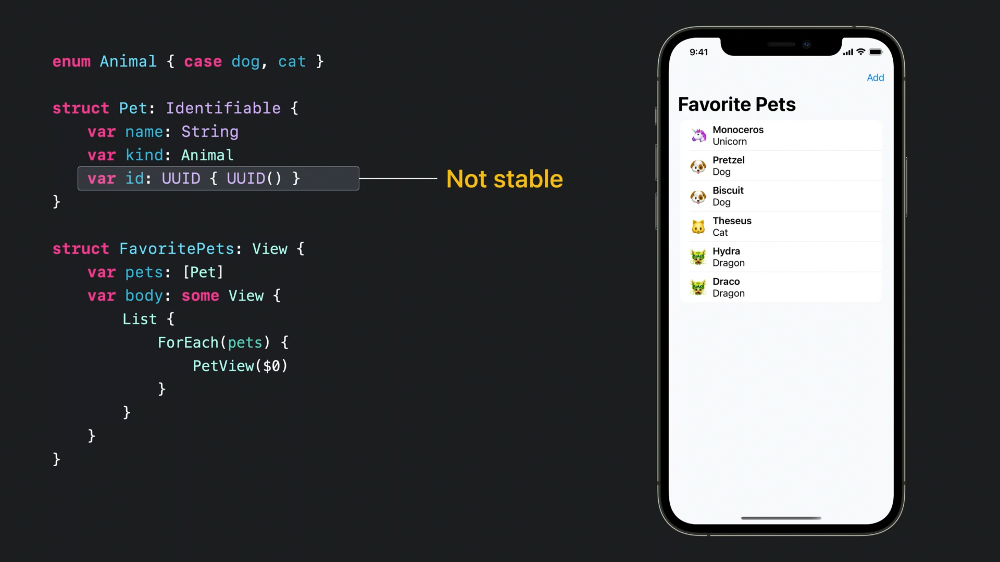

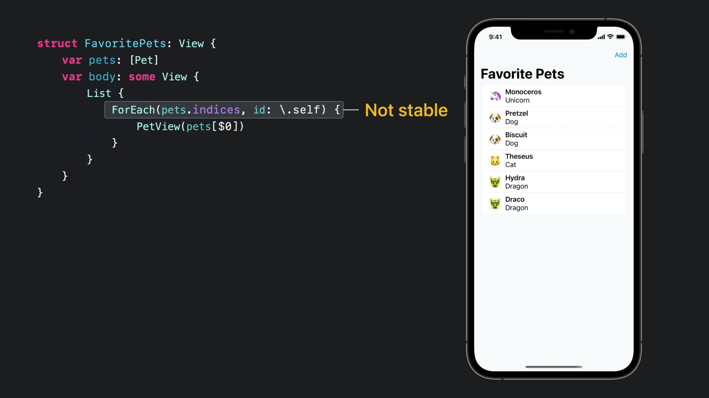

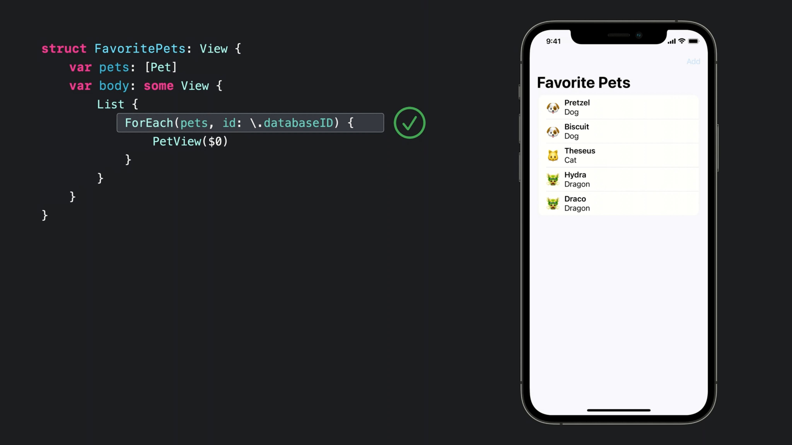

#### 唯一性

但是只保证 Identity 的稳定性还是不够的。好的 Identity 还要确保唯一性。每个 Identity 都应该准确映射到一个单一的视图。

唯一的 Identity 会给 SwiftUI 带来如下好处：

- 平滑的动画效果
- 同样可以提高性能
- 准确地的反应视图和状态之间的依赖关系

像下面的代码中使用 name 的 KeyPath 来给 View  显式声明 Identity，是不合理的，因为我们无法保证 name 的唯一性，一旦出现重名的情况，新的视图很有可能不会展示出来。但当把 name 换成 serialNumber，一切都正常了。

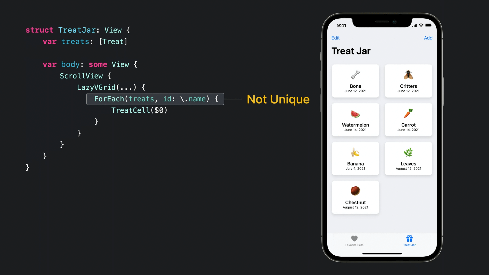

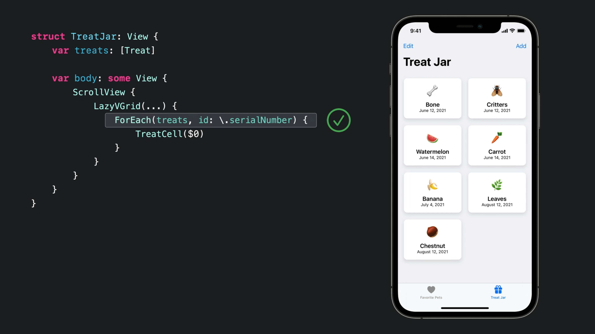

#### 去分支

上面，我们都是用声明式 Identity 来说明如何改进 Identity，接下来看看如何改进结构性 Identity。

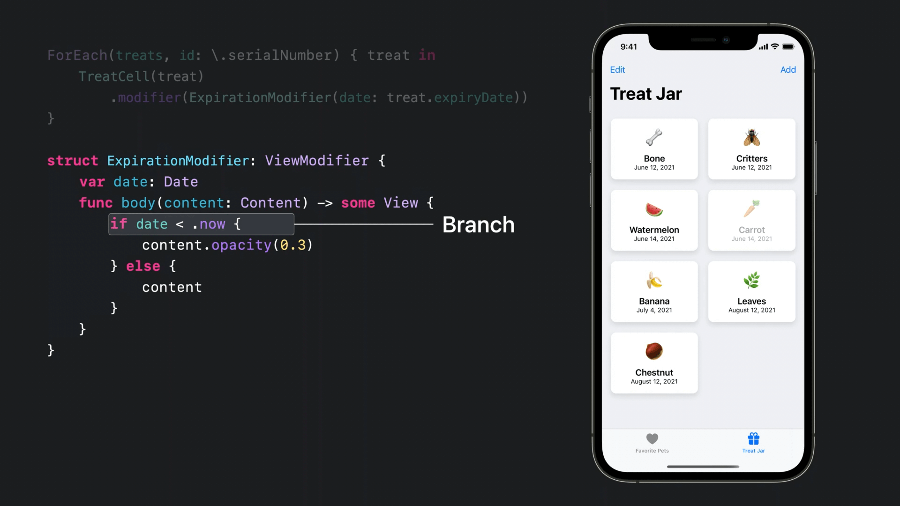

上面的代码，乍一看似乎没什么问题。但是仔细分析会发现，这里有个性能问题。content 在不同的分支条件下，会产生不同的结构性 Identity，这就导致了分支切换后针对同一个 View 会生成两个不同的视图元素，也就是在内存中分配两份内存空间。这点其实是可以避免的。虽然这里我们很轻易的发现了这个问题，但当项目大了之后，有可能这些 ViewModifier 的代码都不在一起，所以这种问题很容易被忽视。

下面的代码，我们把分支结构去掉，改为在 opacity 修饰器上添加三目运算的方式来动态修改透明度。由于去掉了分支结构，所以 content 只会生成单一的结构性 Identity，也就避免了不必要的内存开销，提高了性能。

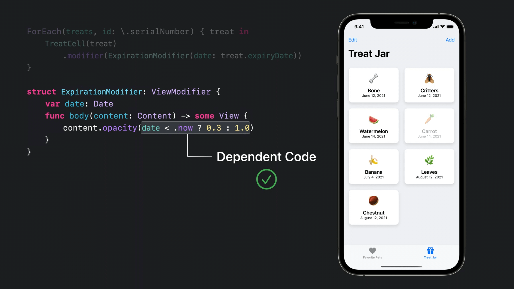

像上面代码直接把透明度设置为 1，也就是跟初始状态一致，其实 SwiftUI 发现这种情况是不执行任何渲染操作的。我们把这样的修饰器称为 "惰性修饰器"，因为它们不影响渲染的结果。

读到这里，你是不是跟我一样都不敢在 SwiftUI 中使用条件分支了。大家尽量还是不要担心，我建议想用分支的时候还是得用，只是用完之后，要多考虑下这个地方用分支来描述 View 结构的必要性，也就是要考虑当前代码的 View 到底是用来代表多个视图还是代表同一个视图的不同状态。

如果是代表同一个视图的不同状态，那么使用一个惰性修饰器来标识一个单一的视图，往往是更好的选择。

在下图中还给出了一些其他的惰性修饰器作为参考：

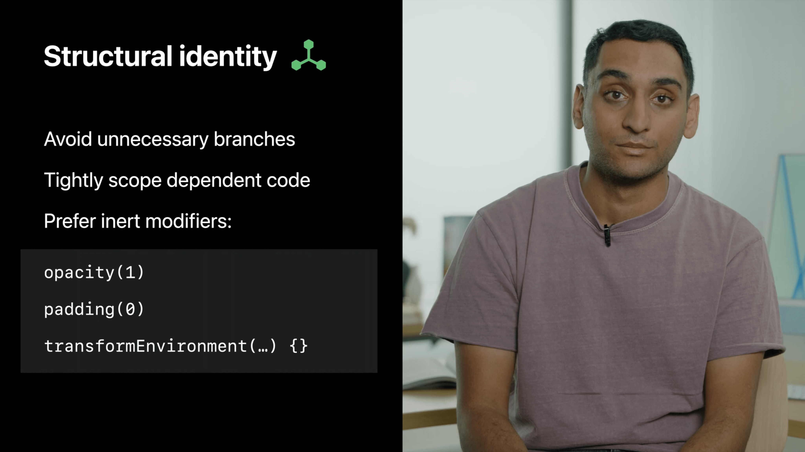

## 总结

整篇文章的主角就是 **Identity**。我们介绍了 Identity 在 SwiftUI 中如何影响动画、生命周期以及相对应的状态。同时阐述了在视图更新的过程中，也需要 Identity 来帮助 SwiftUI 做决定。我们给出了很多正确使用 Identity 的范例，这将对提高 SwiftUI 应用程序的性能很有帮助。

下面我们来回答文章开头的问题：SwiftUI View 和 视图元素之间采用 Identity 关联起来，它们之间并非一一对应。在 SwiftUI 中每当状态发生变化，都会调用对应的 body 生成新的 View 值，但是否生成新的视图则完全由 Identity 来决定。如果 Identity 一致，就会根据 Identity 去内存中查找之前创建的视图，换言之，相当于保持之前视图的生命周期，并且在内存中用类维持住之前的数据状态，只对更改数据后，视图变化的部分进行渲染操作。如果 Identity 不一致，则会新建视图元素，同时视图所依赖的状态也会被重新分配，回到初始值。

总而言之，View Identity 对 SwiftUI 来说是至关重要的。我们一定要时刻注意 View 的 **显式 Identity** 和 **结构性 Identity**，并提高 Identity 的稳定性，确保 Identity 的唯一性。