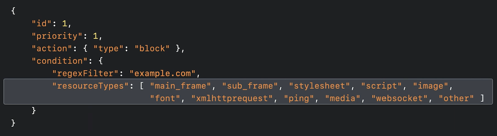

# 【WWDC21 10027】iOS Safari Web Extensions 实践小记

> 作者：Joyce iOS 开发，就职于 YY 欢聚时代
> 
> 审核：折腾范儿_唯敬，iOS/前端 开发者，就职于阿里巴巴，喜欢研究跨平台动态化混合前端相关的内容，目前从事移动应用客户端/前端相关开发工作。

本文基于 Session [10027](https://developer.apple.com/videos/play/wwdc2021/10027) 梳理

iOS15 苹果在 iOS 上支持了 Safari Web Extensions，在了解了如何在 iOS 上使用 Safari Web Extensions，以及如何使用 Xcode 编写拓展代码的基础上，本文将就最新的 WebExtension API展开说明。

* 前言
* 基础
* Safari Web Extensions 新增 API
    * 非持久性后台页
    * 阻止 Web 上的内容
    * 自定义选项卡
* 总结

## 前言        
在 WWDC20 上，苹果宣布在 Safari 中支持 Chrome 风格的浏览器扩展, 开发者开发一个 Web 扩展，需要将拓展功能封装在一个 Mac 应用中。用户从应用商店安装应用即可安装网络扩展。我们可以理解为 Safari App Extensions 可在 macOS 应用程序和 Safari 之间共享代码，但拓展程序依然基于 JavaScript、HTML 和 CSS 开发。

那么在今年的 WWDC21 上，苹果将 Mac 中支持 Safari 拓展的支持带到了 iOS 上。换汤不能换药，开发流程和分发方式几乎一致，所以自然实现了开发者们可以轻易的使用一份拓展代码，分别分发到 Mac 或 iOS 设备上。

## 写在前面
1. 由于拓展插件主要基于 JavaScript、HTML 和 CSS 开发，需要我们掌握一些 Web 开发知识，可以移步 [w3school](https://www.w3school.com.cn) 学习对应内容。

2. 如何在 Xcode 设置 Web Extensions 的开发配置，在 Session [10104](https://developer.apple.com/videos/play/wwdc2021/10104) 中可看到详细介绍。

3. 后台页是指，在浏览器后台运行的脚本，称为后台页，它没有任何可见的 UI，但它可以对诸如打开选项卡或来自扩展另一部分的消息之类的事件做出反应。

## Safari Web Extensions 新增 API
### 非持久性后台页
* 非持久性后台页面支持的必要性
在 Safari 15 之前拥有后台页的拓展应用为持久性后台页。这些后台页会一直运行在浏览器后台，那么当我们打开 N 个拥有后台页的拓展程序，就意味着同时拥有 N 个一直在运行的后台页，就像一个用户永远无法关闭的不可见选项卡，它们会消耗内存并增加 CPU 使用率。尤其在 iOS 设备上，由于资源限制，我们更加需要注意后台页对性能的影响。因此苹果认为 iOS 设备“必须”使用非持久性后台页。

* 非持久性后台页面机制：
非持久性后台页的生存期是围绕事件构建的。后台页注册事件监听器，以便对浏览器中发生的事件做出反应，如关闭选项卡或来自扩展另一部分的消息。这些事件有助于浏览器确定是否应该加载或卸载背景页。

* API 应用实践：
 
    1. 在权限列表 manifest.json 文件中将 persistent 设置为 false

        ```
        "background": {
        "scripts": [ "background.js" ],
        "persistent": false
        }
        ```
        
    2. 添加后台页监听器，注意此处是在脚本顶层注册监听器，才可以生效。

        ```
    browser.runtime.onMessage.addListener((request) => {
        <!--业务代码-->
        });
        ```
        
    1. 程序开发中需要注意以下几点：
        * 因为后台页面可以被卸载，所以需要使用存储API根据需要将信息写入磁盘，在后台页的整个生命周期中维护信息的存储.
        * 不要在另一个事件侦听器的完成处理程序中注册侦听器
        * 使用 Alarms API 代替 Timer，因为如果后台页面已卸载，则不会调用计时器
        * 删除对浏览器的调用
        * webRequest 是一个允许分析 Web 流量的 API，而 webRequest 事件的触发频率使该 API 与非持久性背景页不兼容
    2. 让我们看看苹果工程师的demo实现，demo实现了一个很简单的小功能，当我们点击按钮时，替换所有的文本 “fish” 为 🐟，而我们的后台页实现替换文本个数的计数监听。

    后台页逻辑代码，实现后台页监听替换单词计数逻辑

权限配置


### 阻止 Web 上的内容
* 自 2015 年以来，Safari 一直支持使用 WebKit 内容规则列表构建的内容阻止程序扩展。今年有一些改进，然而，到目前为止，Web 扩展还没有那种快速、隐私保护、内容阻止的能力。而 Chrome 最近引入的声明性请求已经拥有了以上能力。

* 内容阻止规则是以 JSON 格式编写的。这些 JSON 规则在逻辑上被分组到称为规则集的文件中，JavaScript API 允许单独打开或关闭这些规则集。而且因为 Chrome 也支持这个 API，所以可以编写一个内容拦截器，它可以在多个平台的多个浏览器中运行。

* 应用
    * 要在的 Safari 网络扩展中使用声明性网络请求 API，首先请求许可。在 Xcode 项目中，将声明性网络请求权限添加到文件中的权限列表中（manifest.json）:
    ```
    "permissions": [ "declarativeNetRequest" ]
    ```
    
    * 并将规则集添加到扩展清单
    
        ```
        "declarative_net_request": {
        "rule_resources": [
                {
                "id": "ruleset_1",
                "enabled": true,
                "path": "ruleset_1.json"
                }
            ]
        },
        ```
    
    * 构建描述您希望如何阻止内容的规则，并将它们添加到您的规则集文件中。在 ruleset_1.json 文件中加入以下代码
    * 参数：
        * id 和 priority (优先级)，它决定了规则的应用顺序
        * regexFilter 是匹配的 URL 资源匹配
        * resourceTypes 是个数组，指定将被阻止的资源类型, resourceTypes 数组内支持的类型如下图
         
        * excludedResourceTypes 指定不想与之匹配的类型
        * url 与文档具有相同安全源的加载为 firstParty ，其余都是 thirdParty 
        * isUrlFilterCaseSensitive 设置 regexFilter 是否区分大小写
        
     ```
        {
            "id": 1,
            "priority": 1,
            "action": { "type": "block" },
            "condition": 
                { 
                "regexFilter": "apple.com",
                "resourceTypes": [ "image" ],
                "excludedResourceTypes": [ "main_frame", "sub_frame" ],
                "domainType" : [ "thirdParty"]
                 "isUrlFilterCaseSensitive" : false
                }
        },
    ```
* 苹果的官方小 demo，主要实现了一个阻止图片的小功能。我们来看一下实现过程

可以看到这里设置了拦截类型为图片类型

原网页

应用拦截扩展

可以看见图片都被拦截成功

###自定义选项卡 
扩展是一个很好的方式性化浏览器，new tab override API 允许扩展接管 Safari 中的新 tab 页并对其进行完全定制。
此 API 已在 Safari 14 中公开提供，使用起来也非常简单，只需要两步就可以轻松拥有一个高度自定义的选项卡界面。

应用：
* 在声明向中指定我需要加载的新选项卡的 html 文件

    ```
    "browser_url_overrides": {
        "newtab": "new_tab_page.html"
    }
    ```    
* 添加自定义选项卡的资源文件到工程中 

* 运行后可以看到一个自定义的选项卡界面


## 总结
以上就是这次在 iOS Safari 15 上提供的三个新的 Web Extension API。以及其用法，可以看到苹果在 Safari 拓展方面的越来越完善，虽然分发方式和发布流程还是非常"苹果做派"，但是可以通用在多平台的业务代码还是可以让我们可以快速的去在原有拓展代码上做简单修改和快速迁移。有兴趣的小伙伴赶快试试吧!

## 关注我们

我们是「老司机技术周报」，一个持续追求精品 iOS 内容的技术公众号。欢迎关注。


**关注有礼，关注【老司机技术周报】，回复「WWDC」，领取 《WWDC20 内参》**
