# WWDC21 - 相机拍摄新变化

[TOC]

> WWDC21 Session 10047 - [What's new in camera capture](https://developer.apple.com/videos/play/wwdc2021/10047/) 

去年 Apple 对 iPhone 的相机升级是非常明显的，比如增加了 10-bit HDR 视频的拍摄，Apple ProRaw 的支持等。同时得益于 M 系列/A 系列芯片强大的算力，Apple 目前对于拍摄上的思考和提升更多走的是 [计算摄影](https://zh.wikipedia.org/zh-hans/%E8%AE%A1%E7%AE%97%E6%91%84%E5%BD%B1) 路线，而非在光学硬件上做大幅度提升。所以今年的 WWDC，Apple 将相机的更多能力开放给开发者使用。

本文将会介绍几个 Apple 拍摄的新能力：

* 最近对焦距离
* 10-bit HDR 视频
* 控制中心的视频特效
* 相机性能相关的最佳实践
* `IOSurface` 压缩

> 本文不会花大量篇幅介绍拍摄开发的基础知识，建议还没接触的朋友先参考 Apple 文档 [Cameras and Media Capture](https://developer.apple.com/documentation/avfoundation/cameras_and_media_capture)，对 AVFoundation 中拍摄相关的 API 使用有个初步了解。

## AVCapture 简介

Apple 拍摄相关的 API 都位于 AVFoundation 中，以 AVCapture 为前缀。

`AVCaptureDevice`：用于标识相机/麦克风等硬件设备

`AVCaptureDeviceInput`：用于包装 `AVCaptureDevice` 并添加到 `AVCaptureSession` 中

`AVCaptureSession`：对于 AVCapture 图形的集中控制

`AVCaptureOutputs`：将输入以各种方式（例如视频，图片等）渲染数据

`AVCaptureVideoPreviewLayer`：`CALayer` 的子类，作为实时相机预览的输出

如下图箭头所示，这些类通过 AVCapture 的 API 组成完整的数据流。

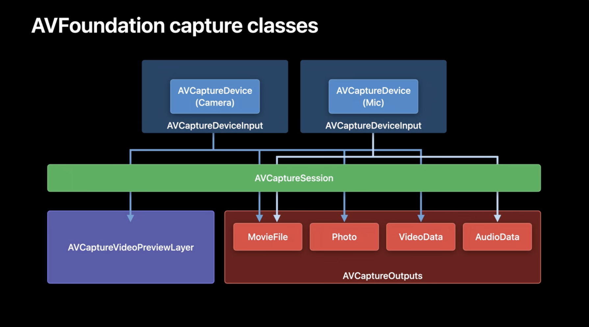

简单了解 AVCapture 处理流程后，下面开始介绍 Apple 今年在拍摄上开放给开发者的新能力。

## 最近对焦距离

最近对焦距离是指靠近被摄物体的情况下，镜头能够合焦的最近拍摄距离。是所有镜头（包括单反镜头）的一项参数。iPhone 的相机镜头也一样有这个参数，但以前官方没有公布过这个数据。iOS 15 后，Apple 开放了这个参数。一般来说，焦段越短的镜头最近对焦距离越短，比如 iPhone 上的广角镜头的最近对焦距离就比长焦镜头更短。

> 小知识：人眼的最近对焦距离约 5-10cm。

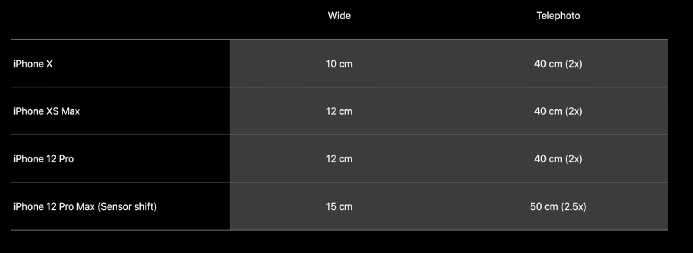

最近对焦距离有什么作用呢？比如有 App 中有一个功能用于扫描二维码，而现实中的二维码可能很小，用户会移动镜头到离二维码很近的距离，而这时候可能已经小于镜头的最近对焦距离，导致镜头对不上焦，画面就会变模糊难以识别。

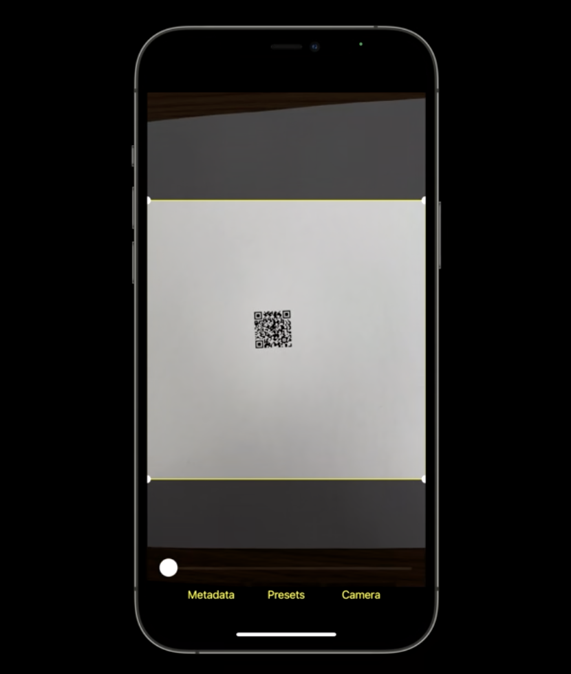

这时候可以通过自动调节相机的放大倍数来提示用户将镜头离远一点。iOS 15 上，`AVCaptureDevice` 上有一个新的 `minimumFocusDistance` 属性来获取镜头的最近对焦距离。

下面的例子是如何通过最近对焦距离来优化最小大小是 20mm x 20mm 二维码的扫描体验：

```swift
// 可以通过 1.镜头的视角 2.需要支持的最小物体尺寸宽度 3.期望物体显示相机预览区域的百分比
// 来计算出需要距离物体的最小拍摄距离
private func minSubjectDistance(
  fieldOfView: Float,
  minimumCodeSize: Float,
  previewFillPercentage: Float) -> Float {
  	// 角度转换为弧度
  	let radians = degressToRadians(fieldOfView / 2)
  	// 计算最小尺寸占该百分比时的实际宽度
  	let filledCodeSize = minimumCodeSize / previewFillPercentage
  	// tan 值即为实际宽度 / 拍摄距离
  	return filledCodeSize / tan(radians)
}

// 输入设备的水平视角（单位度）
let deviceFieldOfView = self.videoDeviceInput.device.activeFormat.videoFieldOfView

// 计算最小拍摄距离
let minSubjectDistanceForCode = miniSubjectDistance(
	fieldOfView: deviceFieldOfView,
  minimumCodeSize: 20
  previewFillPercentage: Float(rectOfInterestWidth))
)

// 获取输入设备的最近对焦距离
let deviceMinimumFocusDistance = Float(self.videoDeviceInput.device.minimumFocusDistance)

// 如果最近的对接距离不够，那么做适当的放大
if minimumSubjectDistanceForCode < deviceMinimumFocusDistance {
  // 计算放大系数
  let zoomFactor = deviceMinimumFocusDistance / minimumSubjectDistanceForCode
  do {
    try videoDeviceInput.device.lockForConfiguration()
    videoDeviceInput.device.videoZoomFactor = CGFloat(zoomFactor)
    videoDeviceInput.device.unlockForConfiguration()
  } catch {
    // ...
  }
}

```

> 更详细的示例和最佳实践可以参考 Apple 官方示例代码 [AVCamBarcode](https://developer.apple.com/documentation/avfoundation/cameras_and_media_capture/avcambarcode_detecting_barcodes_and_faces)。

## 10-bit HDR 视频

HDR（高动态范围）技术对于照片来说可以追溯到 iOS 4.1 的时代，通常使用多次曝光将场景中的高光部分和阴影部分融合到一起。但是对于视频来说，由于每秒需要处理 30 或 60 帧，这个技术的实现难度更大。

### EDR

Apple 在 2018 的 iPhoneXS 相机首次引入了类似 HDR 的 EDR（拓展动态范围）视频处理技术。

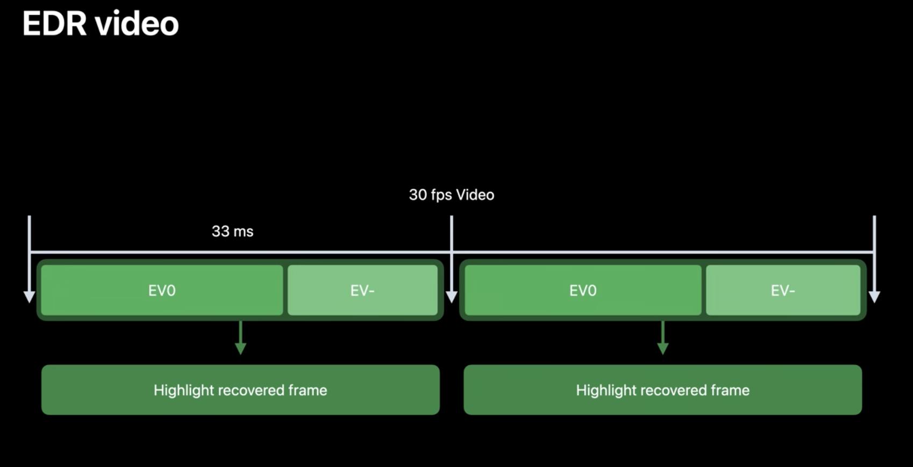

EDR 的核心思想是将拍摄的帧率翻倍，交替采集标准曝光的帧和短曝光的帧。由于是采集时长固定的，所以几乎没有 [垂直空白间隙](https://zh.wikipedia.org/wiki/%E5%9E%82%E7%9B%B4%E7%A9%BA%E7%99%BD%E9%96%93%E9%9A%99)。当使用标准 30 fps 模式拍摄时，EDR 实际上以 60 fps 的帧率进行拍摄。如果场景需要，会动态使用 EV- 的信息通过 [色调映射](https://zh.wikipedia.org/wiki/%E8%89%B2%E8%B0%83%E6%98%A0%E5%B0%84) 应用到 EV0 图像中，恢复被裁剪的高光细节，同时又不会牺牲阴影细节。虽然这不是一个完整的 HDR 解决方案，因为在暗光下效果就不明显了（没有曝光更长的帧来恢复阴影细节），但高光下效果很明显的。

EDR 在 AVCapture 相关 API 中被称为 videoHDR，当看到相关字眼时说明指的就是 EDR 技术。

`AVCaptureDevice` 中有 `videoHDRSupported`、`videoHDREnabled`、`automaticallyAdjustsVideoHDREnabled` 等属性来控制 EDR 的开关。

### 10-bit HDR

10-bit HDR 是真正的 HDR，因为它可以记录 10 bit 的色彩深度信息。

* 10 bit 的色彩深度（一共可以表示 1024 的 3 次方，10 亿颜色）
* 总是使用 EDR 来恢复高光细节
* 使用 [BT.2020](https://www.itu.int/dms_pubrec/itu-r/rec/bt/R-REC-BT.2020-2-201510-I!!PDF-C.pdf) 的色彩空间（比 [BT.709](https://www.itu.int/dms_pubrec/itu-r/rec/bt/R-REC-BT.709-6-201506-I!!PDF-C.pdf) 使用的 sRGB 更多，能表示更亮的颜色）

* 包含杜比视界的元数据（HDR 10 的元数据是静态的，包含创建时的显示器信息，如色域、白点、亮度范围，内容信息，用于目标显示器做色调映射的峰值亮度和平均亮度等。杜比视界元数据是动态的，可以更细粒度控制，以场景或者帧为单位应用）

* iPhone12 及更新的设备才支持

> ITU-R Recommendation BT.xxx
>
> - ITU：国际电信联盟 （International Telecommunication Union）
> - R：无线电通信部门（Radiocommunication）
> - BT：广播电视类别业务（Broadcasting/Television）
>
> 是电联发布的 [国际通用电视节目的参数建议书](https://www.itu.int/pub/R-REC/zh)，简称 Rec.xxx or BT.xxx。里面定义了视频作品的参数的参考值，比如像素，比例，帧率，色域等等。

10-bit HDR 的视频格式可以通过唯一的像素帧格式类型标识。

老设备的像素帧格式在不同像素和帧率下，都是成对出现的，都有 420v 和 420f。

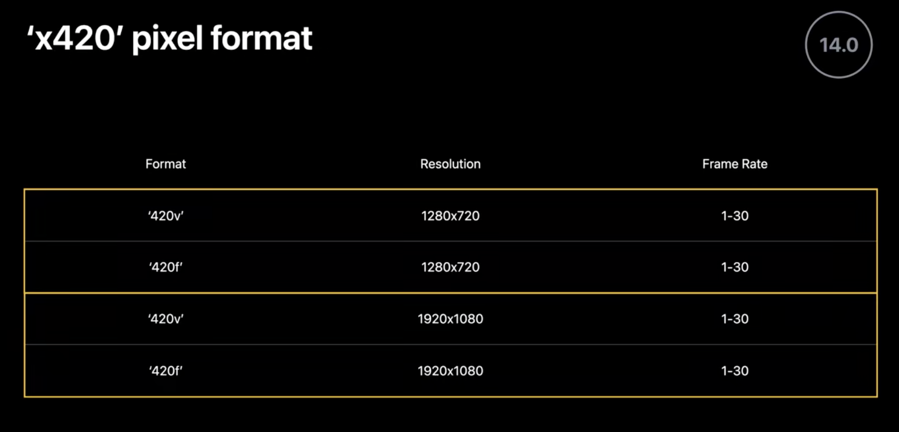

```swift
kCVPixelFormatType_420YpCbCr8BiPlanarVideoRange = '420v' 
/* Bi-Planar Component Y'CbCr 8-bit 4:2:0, video-range (luma=[16,235] chroma=[16,240]).  baseAddr points to a big-endian CVPlanarPixelBufferInfo_YCbCrBiPlanar struct */
kCVPixelFormatType_420YpCbCr8BiPlanarFullRange  = '420f'
/* Bi-Planar Component Y'CbCr 8-bit 4:2:0, full-range (luma=[0,255] chroma=[1,255]).  baseAddr points to a big-endian CVPlanarPixelBufferInfo_YCbCrBiPlanar struct */
```

>`420f` 和 `420v` 都是 8-bit 的 [YUV](https://zh.wikipedia.org/wiki/YUV) 4:2:0 的格式。
>
>唯一区别是 f 代表 full-range， Y(亮度) 范围是 0-255，v 代表 video-range，Y 范围是 16-235。

在 iPhone 12 后，增加了 x420 的格式 `kCVPixelFormatType_420YpCbCr10BiPlanarVideoRange`，是 10-bit 的 YUV 420 格式。

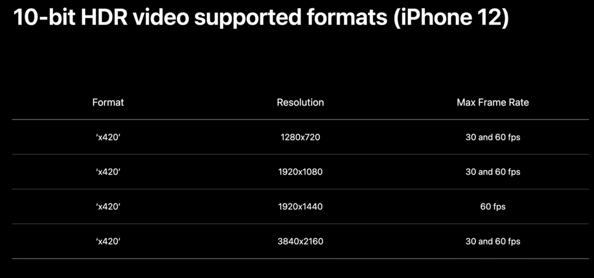

```swift
// 可以通过下列方法来查询支持的 10-bit 格式
func firstTenBitFormatOfDevice(device: AVCaptureDevice) -> AVCaptureDevice.Format? {
  for format in device.formats {
    let pixelFormat = CMFormatDescriptionGetMediaSubType(format.foramtDescription)
    if pixelForamt == kCVPixelFormatType_420YpCbCr10BiPlanarVideoRange {
      return format
    }
  }
  return nil
}
```

> 更多细节可以参考 Apple 示例代码 [AVCam](https://developer.apple.com/documentation/avfoundation/cameras_and_media_capture/avcam_building_a_camera_app) 中 `tenBitVariantOfFormat` 部分
>
> 关于编辑 10-bit HDR 视频的部分，可以参考 WWDC2020 - [Edit and play back HDR video with AVFoundation](https://developer.apple.com/videos/play/wwdc2020/10009/)
>
> 关于 HDR 的介绍，可以参考 Apple 技术演讲 [An Introduction to HDR Video](https://developer.apple.com/videos/play/tech-talks/502/)

## 控制中心的视频特效

这是个系统级别的相机功能，开发者不需要专门做适配。

以往 Apple 在 iOS 或 macOS 上引入相机新功能时：

1. 系统相机上就直接适配好了
2. Apple 在 AVCapture 中添加新的 API
3. 开发者通过 WWDC 学习
4. 开发者排期适配

这种做法很保险，但由于开发者的适配节奏，用户可能会很长一段时间（在开发者的 App 中）错过喜爱的一些功能。

而 iOS 15 在控制中心里新增的几种视频特效：

* 系统级别相机功能
* 在 App 中开箱即用，无需开发者适配
* 由用户控制
* 同时也提供新的 API 让开发者做一些调整，优化用户体验

### Center Stage（中央舞台）

这个功能在 M1 芯片的 iPad Pro 设备上才可用，而且所有前置镜头都可以开启，其背后利用了 1200w 像素的超广角前置摄像头。这个功能大大提高 FaceTime 视频通话的生产力。在其他视频通话类软件中，这个功能也一样时开箱即用的。

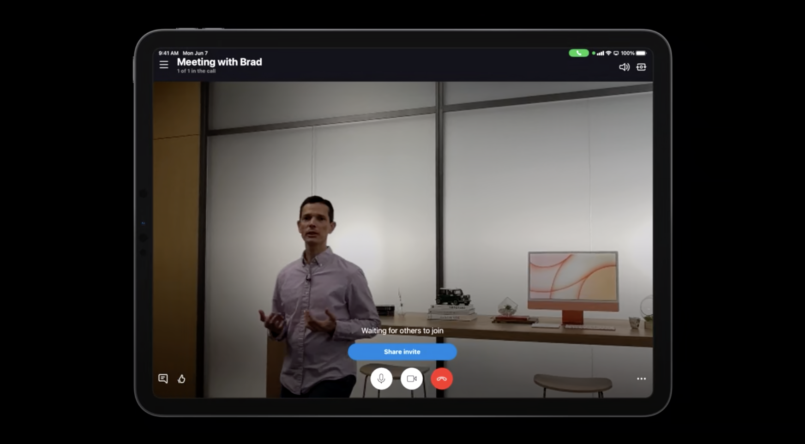

如 Skype 的视频通话界面展示，Center Stage 功能会自动打开。它就像你的摄影师一样，会在你移动时候自动调整构图，确保你的身体处在场景的正中央。而作为用户，可以通过下滑控制中心来，点击来控制这个效果是否打开。

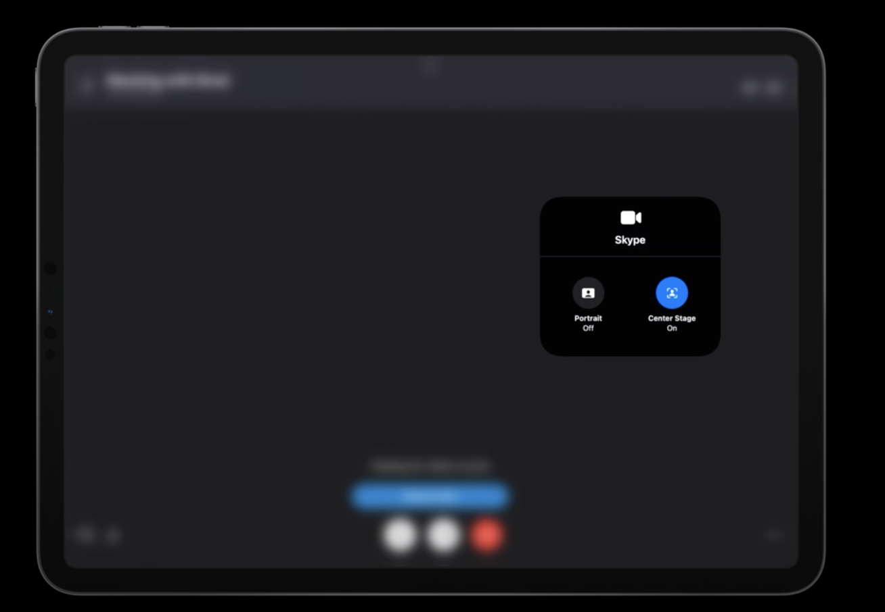

Center Stage 功能是对 App 级别生效（且记忆的）的，而不是对于某个镜头。

所以它的 API 是 `AVCaptureDevice` 上一组类属性，可以被写入和读取。并不是相机所有的格式都支持 Center Stage。

```swift
AVCaptureDevice.isCenterStageEnabled // 当前是否打开
AVCaptureDevice.centerStageControlMode // 当前处于什么模式

captureDevice.activeForamt.isCenterStageSupported // 判断格式是否支持
captureDevice.isCenterStageActive // 判断设备当前是否处在工作中
```

而这个功能有着一些局限性：

* 最高 30 fps 的帧率（因为受到使用的超广角镜头的限制）
* 最高 1920x1440 的分辨率（保证图像质量）
* 放大系数只能被锁定在 1（缩放和平移的控制权在 Center Stage 中）
* GDC（Geometric distortion correction，几何失真校正） 需要打开
* 深度信息传递需要关闭

Center Stage 有几种模式（`AVCaptureDevice.CenterStageControlMode`）：

* `.user`：默认模式，由用户来控制功能是否打开（这种情况下调用代码控制将会抛出异常）
* `.app`：由 App 来控制功能是否打开（这种情况下控制中心中的按钮将会置灰，不鼓励使用此模式，除非 App 无法兼容这个功能）
* `.cooperative`：用户和 App 都能控制功能是否打开（这种情况下需要监听 `AVCaptureDevice.isCenterStageEnabled` 的变化来更新 App 中的 UI 状态）

> Apple 的 FaceTime 使用的就是 `.cooperative` 的很好的范例。FaceTime 既有 UI 按钮开关又能支持控制中心开关。而且在使用需要深度信息的 Animoji 时，会自动将 Center Stage 关闭，而这时再手动打开 Center Stage 打开的话，则会自动关闭 Animoji。

### Portrait（人像模式）

所有会议类 App 都能用上的一个新功能 - Portrait。Portrait 提供浅景深效果，但不是简单的背景模糊，而是利用 Apple 神经网络来模拟真实的相机。所有配备 Apple Neural Engine（神经网络引擎）的设备（2018 年及更新的 iPhone 的 iPad 和所有 M1 的 Mac）都支持 Portrait（前置镜头）。

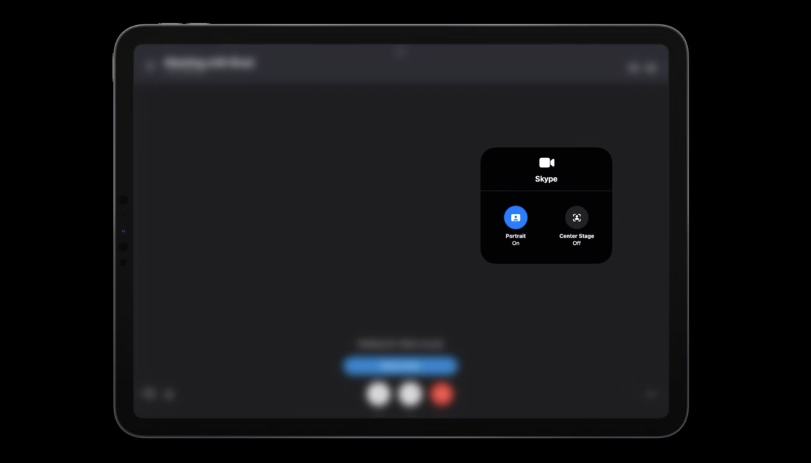

而这个功能也有着一些局限性：

* 最高 30 fps 的帧率
* 最高分辨率 1920x1440 分辨率

Portrait 功能也是对 App 级别生效（且记忆的）的，但不同的是，只能由用户控制。对于 VOIP 的 iOS App，这个功能是自动打开的，如果是其他则需要通过增加 Info.plist 的值来提供。macOS 则是所有 App 都是自动打开的。

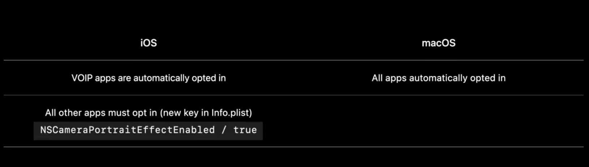

所以 Portrait 的 API 都是只读的。

```swift
captureDevice.activeForamt.isPortraitEffectSupported // 判断格式是否支持
captureDevice.isPortraitEffectActive // 判断设备当前是否处在工作中
```

### Mic Modes（麦克风模式）

麦克风模式可增强视频聊天中的音频质量。所有使用 AUVoiceIO（使用 Audio Unit 的 VoiceProcessingIO 接口）的 App（在 2018 及更新的 iOS 和 macOS 设备上）都支持麦克风模式。 

Mic Modes 功能也是对 App 级别生效（且记忆的）的，且只能由用户控制的。

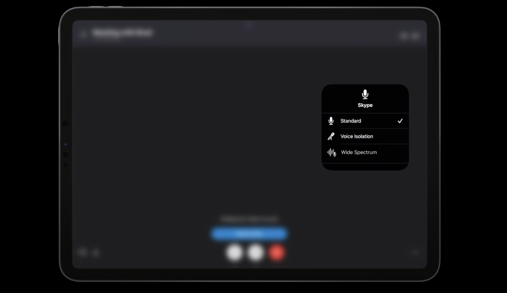

所以 Mic Modes 的 API 也都是只读的。

```swift
AVCaptureDevice.perferredMicrophoneMode // 用户选择的模式
AVCaptureDevice.activeMicrophoneMode // 实际使用的模式
```

有如下几种麦克风模式（`AVCaptureDevice.MicrophoneMode`）：

* `.standrad`：标准模式
* `.wideSpectrum`：宽频谱，尽量保留原始声音，最大限度地减少了对周围声音的处理，除了回声消除
* `.voiceIsolation`：语音隔离，将语言部分加强，并减少周围不必要的噪音

------

对于以上这些视频特效，可以通过调用系统 API 来给用户提示进行操作（调用后会打开控制面板跳到对应的操作区域）。

```swift
AVCaptureDevice.showSystemUserInterface(.videoEffects)
AVCaptureDevice.showSystemUserInterface(.microphoneModes)
```

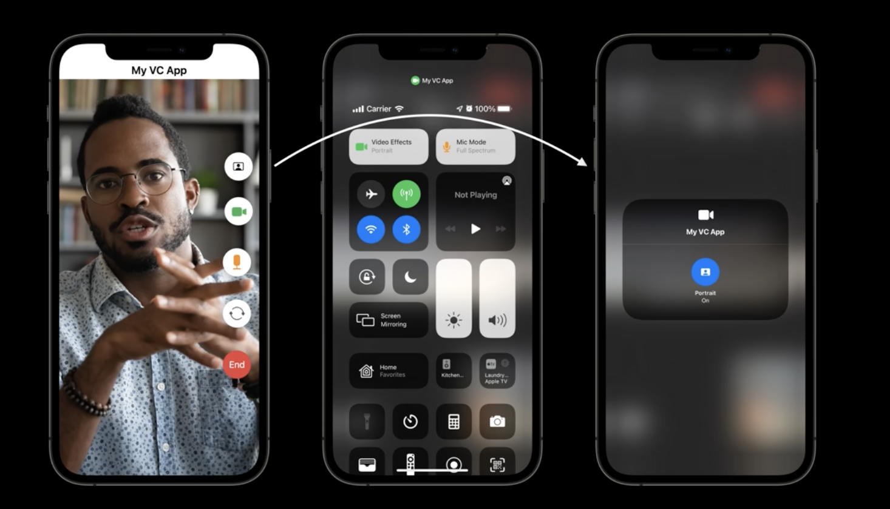

## 性能的最佳实践

上面的视频特效虽然带来了更好的用户体验，但在性能上也会有更大的损耗。

### 丢帧

大部分 App 使用 `AVCaptureVideoDataOutput` 将视频帧直接传到处理流程中，以进行操作、显示、编码、录制等。

使用时，要注意确保 App 处理的及时性来避免丢帧。

`AVCaptureVideoDataOutput ` 的属性 `alwaysDiscardsLateVideoFrames` 默认值为 `true`。表示在视频数据输出处理流程后强制将帧数据的缓冲区队列设置为 1，这样队列里永远都是最新的数据，丢弃来不及处理的数据来避免延迟。

但如果你准备使用类似 `AVAssetWriter` 来记录你的帧数据，不追求及时性，可以关掉该属性并关注延迟是否能接受。

`AVCaptureVideoDataOutput` 通过 `AVCaptureVideoDataOutputSampleBufferDelegate` 里的如下方法来告诉开发者丢帧的发生。

```swift
func captureOutput(
  _ output: AVCaptureOutput,
  didDrop sampleBuffer: CMSampleBuffer,
  from connection: AVCaptureConnection) {
  	// 通过附加信息取出丢帧原因
		guard let attachment = sampleBuffer.attachments[.droppedFrameReason],
  				let reason = attachment.value as? String else { return }
  	switch reason as CFString {
    case kCMSampleBufferDroppedFrameReason_FrameWasLate:
      // 帧迟到的情况，处理时间过长
    case kCMSampleBufferDroppedFrameReason_OutOfBuffer:
      // 帧缓冲区过多
    case kCMSampleBufferDroppedFrameReason_Discontinuity:
      // 帧不连续，系统或硬件问题导致
    default:break
    }
}
```

处理丢帧常见有下面两种方式

1. 动态调整设备的帧率，通过实时设置以下属性来调整。

```swift
captureDevice.activeMinVideoFrameDuration = CMTime(value: 1, timeScale: frameRate)
```

2. 简化处理的工作量

### 系统压力

系统压力是另一种性能指标。`AVCaptureDevice` 上有一个 `systemPressureState` 属性，来获取当前设备的系统压力。里面有两个属性 `factors`（因子） 和 `level`（整体等级）。

Factors：

*  `systemTemperature`：系统温度
* `peakPower`：电池老化
*  `depthModuleTemperature`：深度测算的红外模块的温度

Level：

* `.nominal`：毫无压力，一切运行良好
* `.fair`：略有压力（在环境温度高的时候，即使处理很轻量也可能出现）
* `.serious`：压力较大，性能可能受到影响，建议调节帧率
* `.critical`：压力接近临界值，性能受到较大影响，强烈建议调节帧率
* `.shutdown`：压力超过临界值，`AVCaptureSession` 会自动停止避免设备过热受到影响

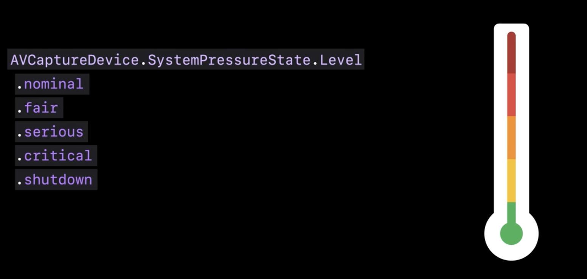

处理系统压力有以下几种方法：

1. 降低帧率
2. 降低 CPU/GPU 的处理任务（关闭某些功能）
3. 降低质量（使用更低的分辨率或减少处理频率）

## `IOSurface` 压缩

很少提到内存带宽，因为对于从 ISP 到最终传输到照片、电影、预览或缓冲区的视频整个过程，开发者都无法控制内存带宽。但是，内存带宽又很重要，是决定哪些相机功能可以同时运行的关键限制因素。

在 iOS 和 macOS 中处理未压缩的视频数据会经过多层封装，有点像是俄罗斯套娃。

最上层是 `CMSampleBuffer`，它可以包装各种媒体数据、时序和元数据。

中间层是 `CVPixelBuffer`，它专门将像素缓冲区数据与元数据附件包装在一起。

最底层是 `IOSurface`，它允许将内存连接到内核，并提供接口用于进程间共享同一个视频大型缓冲区。

`IOSurface` 的数据是巨大的，所以这就是为啥内存带宽对未压缩视频很重要。

在 iOS 15 上，提供了 `IOSurface` 内存压缩能力，支持了无损内存视频压缩格式，这给内存带宽提供了一种解决方案。

* 降低实时视频的内存带宽
* 大部分 Apple 设备能支持的格式
  * iPhone 12 系列
  * 2020 iPad Airs
  * 2021 M1 iPad Pro
* 大部分系统库都支持读取和写入（Meta、Vision、AVAssetReader/AVAssetWrite、VideoToolbox、Core Image、`CALayer` 等）

如果使用的是 `AVCaptureSession` 的默认处理流程且没有加入额外的缓冲区，那么整个流程就会自动尽可能采用 `IOSurface` 压缩来节省内存带宽（在支持的设备上）。

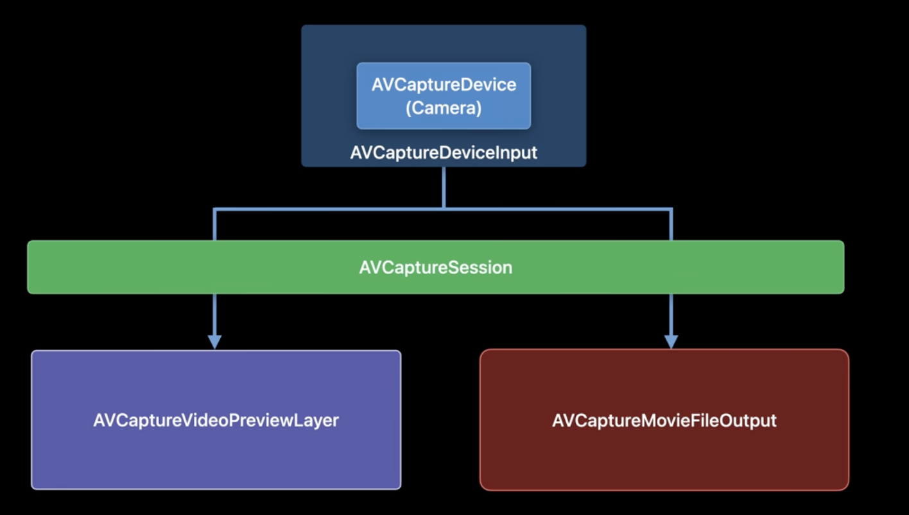

如果希望手动将压缩后的 `IOSurface` 传递到 `AVCaptureVideoDataOutput` 中。由于 `IOSurface` 的物理内存布局是不透明而且可能会变的，所以：

* 不要写入磁盘中
* 不要假设不同的平台的内存布局是一致的
* 不要使用 CPU 进行读写

`AVCaptureVideoDataOutput` 支持多种 `IOSurface` 压缩格式，分别对应未压缩的像素帧格式。

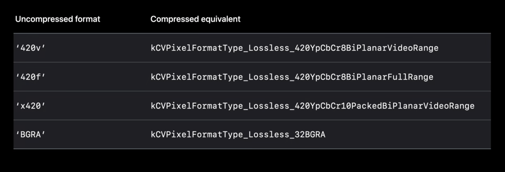

在 Apple 的官方示例 [AVMultiCamPiP](https://developer.apple.com/documentation/avfoundation/cameras_and_media_capture/avmulticampip_capturing_from_multiple_cameras) 中，就有可以用这个技术优化的例子。

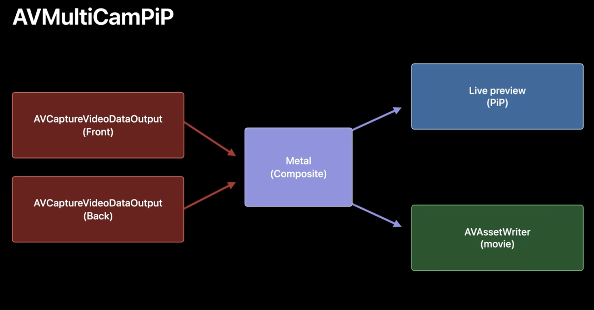

```swift
// 优化前
cameraVideoDataOuput.videoSettings = [kCVPixelBufferPixelFormatTypeKey as String: Int(kCVPixelFormatType_32BGRA)]

// 优化后
if cameraVideoDataOuput.availableVideoPixelFormatTypes.contains(kCVPixelFormatType_Lossless_32BGRA) {
    cameraVideoDataOuput.videoSettings = [kCVPixelBufferPixelFormatTypeKey as String: Int(kCVPixelFormatType_Lossless_32BGRA)]
} else {
    cameraVideoDataOuput.videoSettings = [kCVPixelBufferPixelFormatTypeKey as String: Int(kCVPixelFormatType_32BGRA)]
}

```

## 总结

今年 WWDC 上公布的拍摄新能力，既有着对现有能力的完善（最近对焦距离，10-bit HDR 支持），也有着无需开发者适配的全局的能力（视频特效），还有着随着越来越多吃性能新功能后，Apple 对于拍摄性能上的一些思考和最佳实践。相信随着算力的进一步提升，实时拍摄的能力会越来越变得不可思议而令人期待！


