# 在 Spotlight 中呈现 app 的数据

> 本文基于 [WWDC21 Session 10098 -Showcase app data in Spotlight](https://developer.apple.com/videos/play/wwdc2021/10098/) 梳理

## 目录

* NSCoreDataCoreSpotlightDelegate 介绍
* 一个简单的实现
    * [Sample Code](https://developer.apple.com/documentation/coredata/nspersistentstorecoordinator/showcase_app_data_in_spotlight)
    * 自定义实现
    * 实现全文搜索

## 前言

app 在使用过程中会生成许多的内容.

随着数据规模的增加, 我们希望能够快速找到这些数据, 比如在 app 中进行搜索, 或者在 app 外的 Spotlight 搜索.

Core Data 就可以很好地帮助你把 app 中的数据显示在 Spotlight 中.

本文主要介绍如何使用`NSCoreDataCoreSpotlightDelegate`.

## NSCoreDataCoreSpotlightDelegate

`NSCoreDataCoreSpotlightDelegate` 提供的能力: 

* 在 app 之外呈现用户数据
* 自动更新 Spotlight 索引
* 强大的索引管理
* 定制索引结果

`NSCoreDataCoreSpotlightDelegate`的优势:

1. 功能与Core Spotlight 保持一致
2. 更少的代码
3. 额外的 Feature

`NSCoreDataCoreSpotlightDelegate` 完成了所有繁重的工作,并提供了一套API,可以快速有效地对你 app 所提供的内容进行索引.

---

下面是 Core Spotlight APIs 与 `NSCoreDataCoreSpotlightDelegate`两种方式的比较:

```swift
// 使用 Core Spotlight 实现索引的例子
func indexItemsInStore(){
  let taskContext = persistentContainer.newBackgroundContext()
  taskContext.perform{
    // 查出数据
    let fetchRequest = NSFetchRequest<Photo>(entityName:"Photo")
    guard let results = try? taskContext.fetch(fetchRequest) else {return}
    // 生成 CSSearchableItems
    let items = results.compactMap{ photo in CSSearchableItem? in
      guard let data = photo.photoData?.data,
            let name = photo.uniqueName else {return nil}
      let attributeSet = CSSearchableItemAttributeSet(contentType: .item)
      attributeSet.displayName = name
      attributeSet.thumbnailData = data
      attributeSet.keywords = [name]
    }
    // 把 items 加入索引
    CSSearchableIndex.default().indexSearchableItems(items){ error in
       ...
    }
  }
}
```

而改用 `NSCoreDataCoreSpotlightDelegate`后

```swift
// 两行代码实现 Spotlight 索引 
let spotlightDelegate = NSCoreDataCoreSpotlightDelegate(forStoreWith: description,
                                                        coordinator: coordinator)
spotlightDelegate.startSpotlightIndexing()

// ps: 除了两行代码,还需要配置 Core Data Model, 设置 index 和 display name, 否则不能在 Spotlight 搜到结果
```

和 Core Spotlight 提供的 API 相比, 少了非常多的代码, 更易于阅读和维护.


## 一个简单的实现

以一个名为Tags的简单的照片标签应用为例. 这个 app 可以存储照片,并对照片打上多个不同的标签.

在添加Spotlight支持之前,你可以看到所有的标签和照片数据都被困在Tags App里面,在 Spotlight 中没有任何 Tags app 的搜索结果.

让我们来改变这种情况吧! 


### 1. 设置索引内容

使用`NSCoreDataCoreSpotlightDelegate`的第一步是决定你要在Spotlight中索引什么.

事实上, 所有可以持久化存储的内容都可以被索引, 在Spotlight中被索引的内容完全取决于你. 

在Tags中,我决定对实体Photo的userSpecifiedName属性和实体Tag的name属性进行索引.

为了准备索引的模型,在Xcode中打开了项目的Core Data Model,选择 Photo 实体的`userSpecifiedName` 属性,在属性检查器中勾选`Index in Spotlight`的复选框.

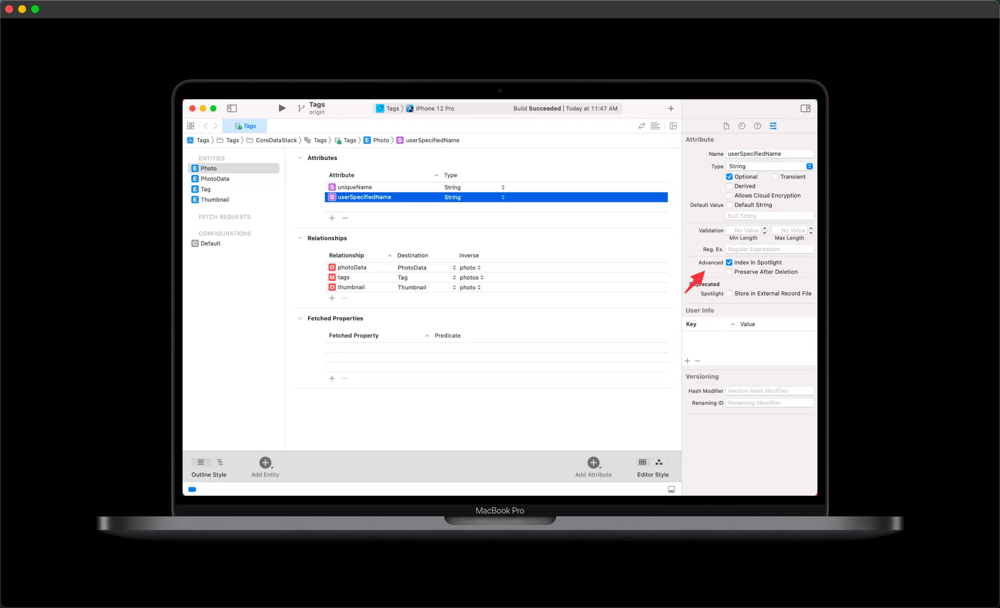


### 2. 设置 displayname

当进入 Spotlight 搜索用户界面时, 搜索结果需要展示出来, 即展示 `display name`.

因此, 我们需要在Core Data模型编辑器中继续进行,给每个 Entity 设置Core Data Spotlight 的 `display name`.

在设置索引的时候,这个表达式与每个设有Spotlight索引的properties(属性)的`managed object`一起被评估, 评估的结果被保存下来.

Core Data Spotlight的`display name`是一个`NSExpression`.

之后,当进入Spotlight搜索用户界面时,这些结果被用作搜索结果的 `display name`.

在 Tags app 中,Spotlight `Display Name`在实体 Photo 上被设置为`userSpecifiedName`,而在实体Tag上被设置为`name`.

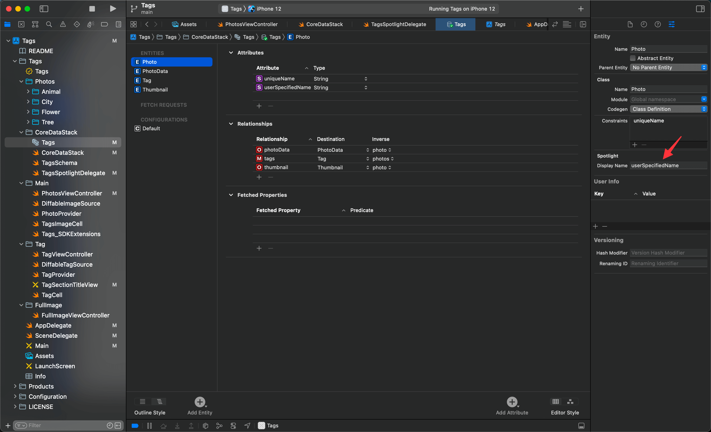

> 什么是 NSExpression?
>
> 可以是一个 keyPath 
>
> ```swift
> let exp = NSExpression(forKeyPath: \Tag.name)
> ```
>
> 可以做一些数学运算
>
> ```swift 
> let exp = NSExpression(format: "4 + 5 - 2 ** 3")
> let val = exp.expressionValueWithObject(nil, context: nil) as? Int
> ```
>
>  可以再复杂一点,计算一组数的标准差
>
> ```swift
> let vals = [1,2,3,4,4,5,9,11]
> let exp = NSExpression(forFunction: "stddev:",
>                        arguments: [NSExpression(forConstantValue: vals)])
> let stddev = exp.expressionValueWithObject(nil, context: nil) as? Double
> ```
>
> [NSExpression | Apple Developer Documentation](https://developer.apple.com/documentation/foundation/nsexpression/)


### 3. 创建 `NSCoreDataCoreSpotlightDelegate`

现在,模型已经为索引做好了准备,让我们来创建`NSCoreDataCoreSpotlightDelegate`.
`NSCoreDataCoreSpotlightDelegate`新的初始化方法是使用`forStoreWith: coordinator:`.

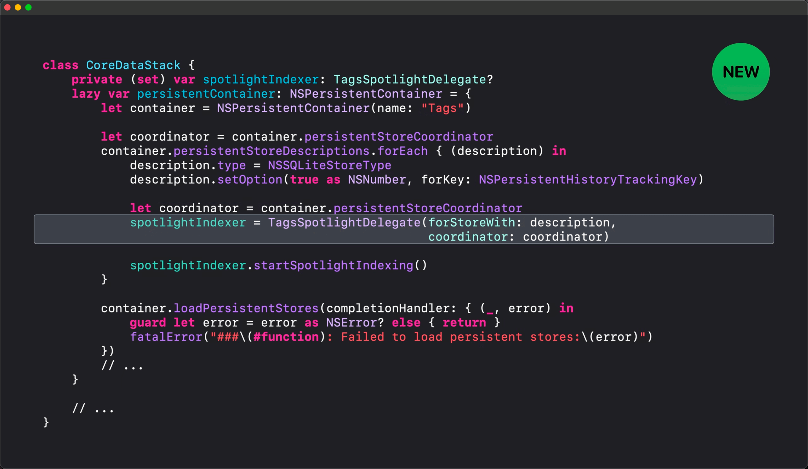

必须调用`startSpotlightIndexing`来使`SpotlightDelegate`开始工作.

---

使用`NSCoreDataCoreSpotlightDelegate`的几个要求:

* 被索引的存储类型必须是 SQLite
* 必须启用 `PersistentHistoryTracking`

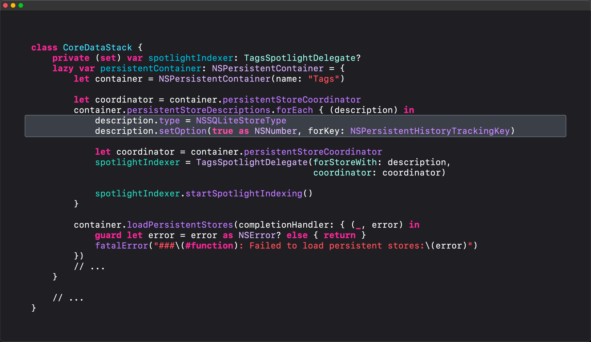

就这样,你就完成了! 就这样了! 你不需要做任何其他事情,你的数据将在Spotlight中被索引.

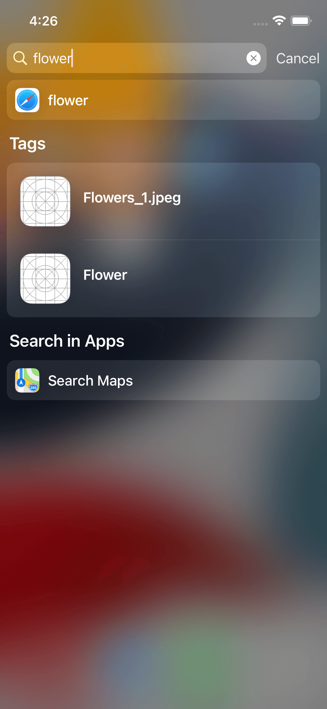

## 增加定制的实现

已经描述了基础知识,现在让我们对这个实现进行一些定制.

### 1. 自定义 domain 和 indexName

首先,我将定义一个类`TagsSpotlightDelegate`,它继承自`NSCoreDataCoreSpotlightDelegate`.
现在,我将用重写`domainName`和`indexName`.

重写这些方法可以告诉 Spotlight 在哪里存储索引数据,并允许你以后更好地识别它,特别是当你有多个索引时.

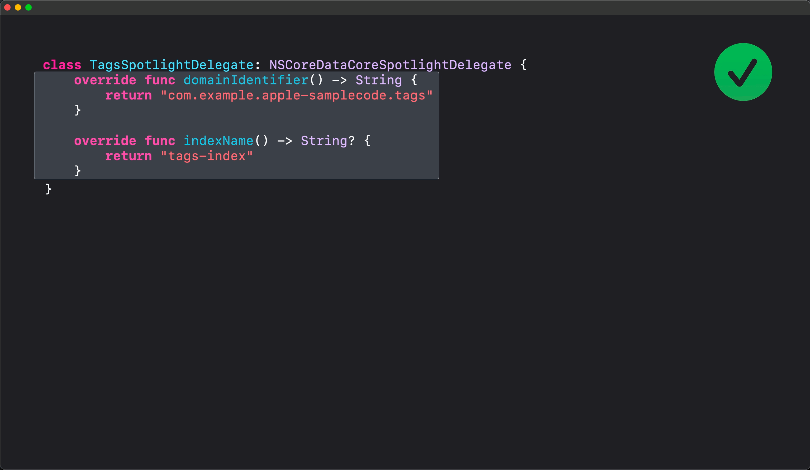

如果不重写,`domainIdentifier`默认是`store 的 identifier`.`indexName`默认值是`nil`.

### 2. 定义 attribute set

定制Spotlight Delegate 的下一步是定义一个属性集.

在前文中,  我们通过为 Entity 的属性勾选`index in Spotlight` ,并且为 Entity 设置了`display name`, `NSCoreDataCoreSpotlightDelegate`为我们定义了返回给Spotlight的属性集. 这时只能通过 `display name`搜索.

现在,我们将演示如何指定用于索引的属性.  指定哪些属性应该被索引,可以更明确地控制被索引的内容和搜索的方式.

要做到这一点,可以使用`CSSearchableItemAttributeSet`: 

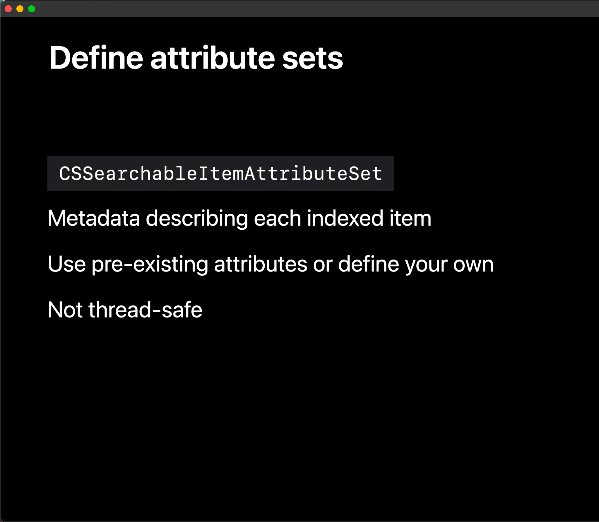

* 作为`managed object`被搜索出现时要显示的元数据.

* 可以使用`CSSearchableItemAttributeSet`中的预定义属性,或者定义自己的属性.
* 线程不安全, 对数据集的属性并发访问的行为是未定义的.

在 Tags app 中, 我们对 Photo 使用预定义的属性: `keywords`、`displayName`和`thumbnailData`.

通过重写`NSCoreDataCoreSpotlightDelegate`的`attributeSet(for object:)`实现.

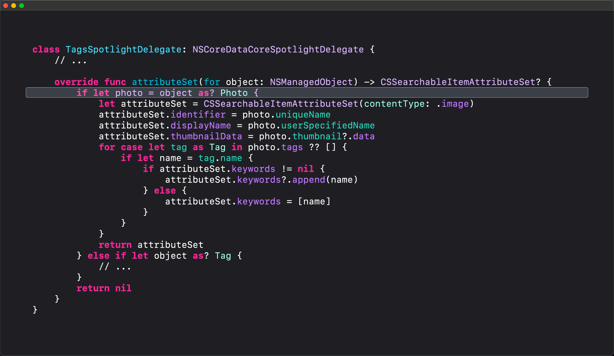

1. 首先确定`object`是否为 `Photo`

2. 初始化一个内容类型为 `.image` 的 `attributeSet`

3. 将`Photo`的适当的属性赋值给`attributeSet`的`identifier`, `displayName`, `thumbnailData `

4. 将`Photo`的 `tags`加到`attributeSet`的`keywords`数组中

    > 如果你的 model 要通过一个关系 (relationship) 进行索引,  attributeSet (for object:)  必须被重写, 这样就定义了该关系的具体内容可以被索引.

5. 返回 attributeSet 

     

因为我们也在索引 Tag 对象, 所以代码需要处理 `object`为`Tag` 的情况.

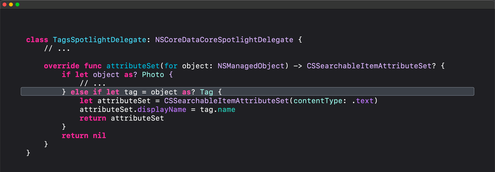


最后, 我们需要删除前一步在 Model Editor 中, 给 Entity 设置的 `Display Name`

### 3. 定义索引事件循环 Define an indexing event Loop

进一步, 定义一个用于开始和停止索引的事件循环.

上文中,当我们设置`SpotlightDelegate`时,`startSpotlightIndexing`在创建`SpotlightDelegate`后立即被调用.

为了更精准地控制`NSCoreDataCoreSpotlightDelegate` 何时执行索引工作,`stopSpotlightIndexing`方法也被添加到框架中. 协同使用这两个方法可以让你在必要时开始和停止索引工作. 比如说,在你的应用程序正在执行密集的CPU或磁盘活动操作的情况下, 可以先停止索引.

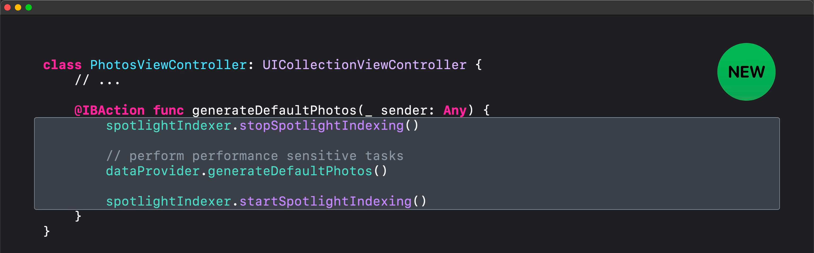

### 4. 索引更新的通知

当在Spotlight中被索引的一个或多个实体发生变化时,该索引会被异步更新.

在iOS 15和macOS Monterey中,`Core Data`框架已经添加了索引更新通知`NSCoreDataCoreSpotlightDelegate.indexDidUpdateNotification`. 

此通知是由 `SpotlightDelegate`发布的.

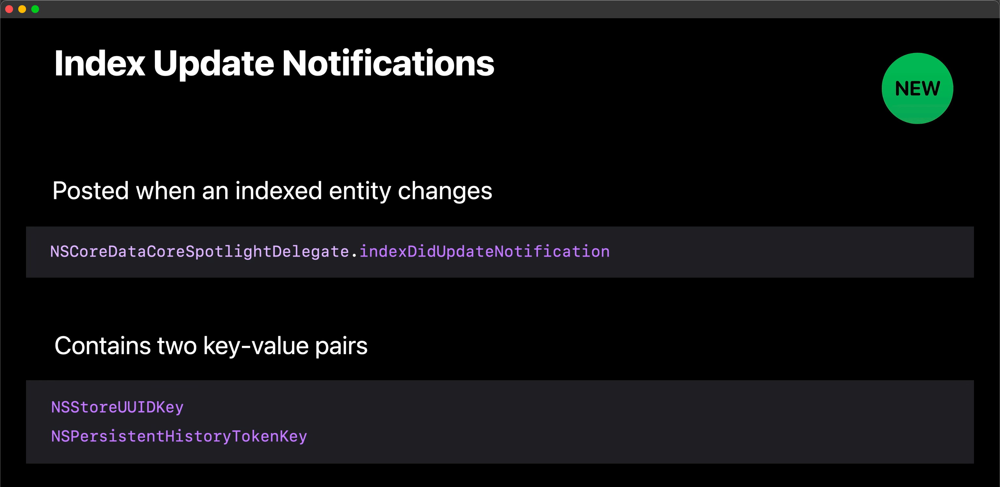

通知的发布时机: 

* `NSManagedObjectContext`处理保存后
* 完成批处理操作后

来看一下 Tags 中对通知的观察:

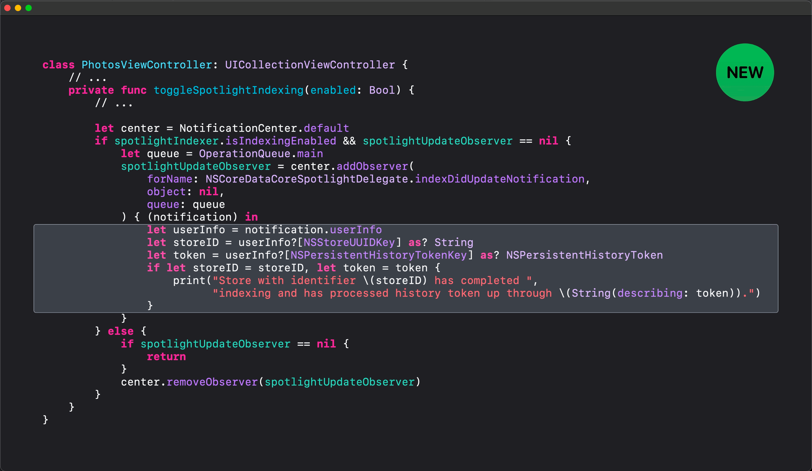

在处理通知的流程中,通知的 userInfo 中包含两个键值对:

* NSStoreUUID , `Spotlight`为这个`Store`更新索引
* NSPersistentHistoryTokenKey, 

使用这两个键值来确定特定的`Store`是否被索引到最新的`Token`

### 5. 支持删减

在今年之前, 删除索引的唯一方法是通过Core Spotlight APIs来删除, 或者在 Core Data删除整个client graph.

在iOS 15和macOS Monterey的新版本中,Core Data为开发者提供了一种新的方式来管理Spotlight索引,而无需删图.

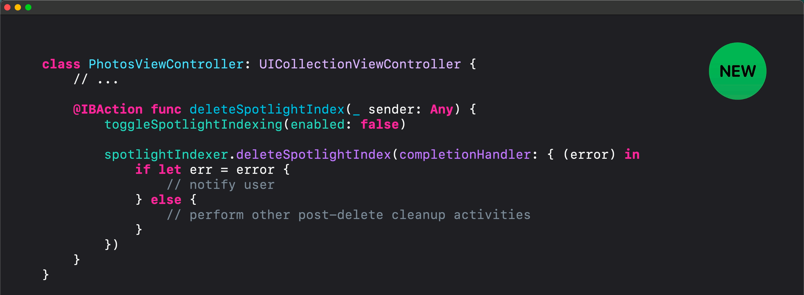

* 首先,停止索引, `stopSpotlightIndexing`
* 然后调用`deleteSpotlightIndex`
* 处理错误 
    * 这里可能会返回来自底层的错误, 比如 `Core Data` 和`Core Spotlight`

## 实现全文搜索

我们已经了解了如何定制 `SpotlightDelegate`, 接下来让我们使用 Core Spotlight APIs 向 Tags app 配置全文搜索. 搜索结果将是之前索引的内容.

首先,为PhotosViewController定义一个扩展,采用UISearchResultsUpdating协议来处理搜索栏中用户的输入.

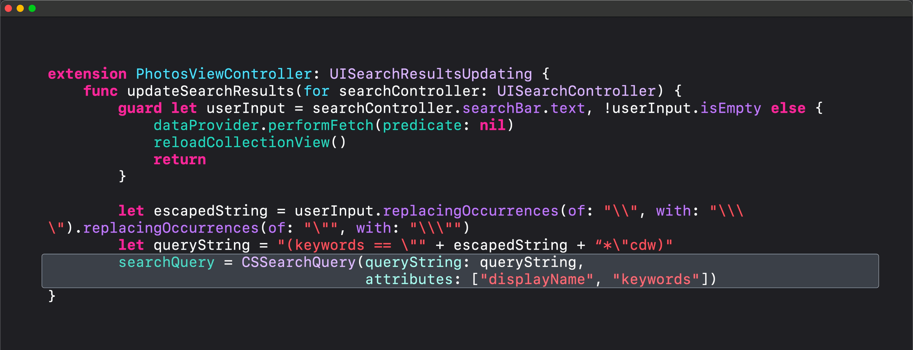

1. 如果用户输入是空的,从我们的数据提供者那里获取所有的图片,然后重新加载集合视图,因为没有搜索查询.

2. 处理有搜索查询的情况.
    1. 首先,对用户输入的字符串进行转义.
    2. 接下来,使用转义后的字符串定义一个查询字符串. 
        * 这里是对`CSSearchableItemAttributeSet`的` keywords` 进行查询.
        * 使用了修饰符 c,d,w
            * c 大小写不敏感
            * d 对变音符号不敏感
            * 基于单词的搜索
    3. 通过格式化查询字符串和对应`CSSearchableItemAttributeSet`属性名称的数组创建出一个一个`CSSearchQuery`对象

> [CSSearchQuery](https://developer.apple.com/documentation/corespotlight/cssearchquery/) 了解更多操作	

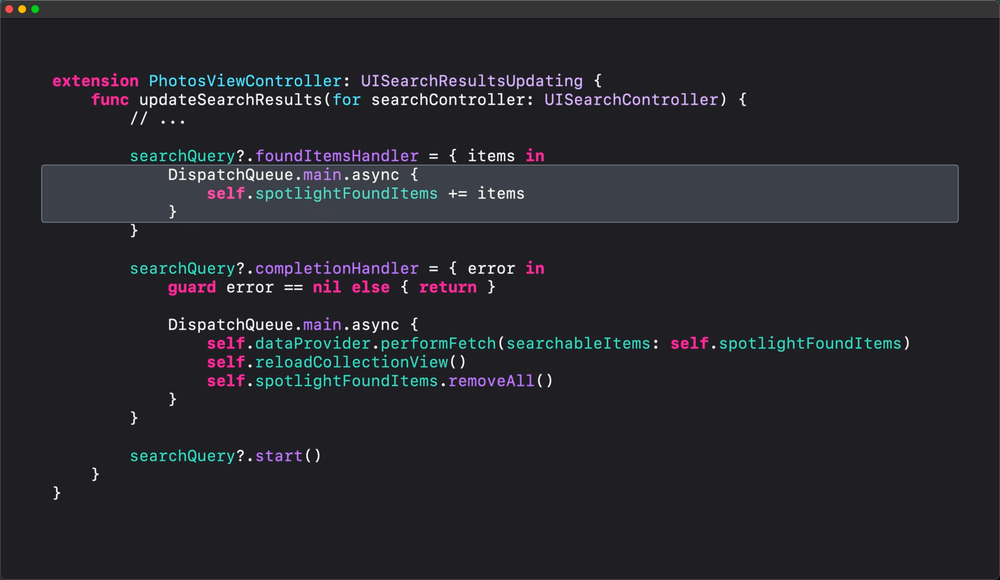

* 设置 `foundItemsHandler`
    * 重复调用( 0次或多次)
    * 拿到与查询相匹配的 items
* `completionHandler`
    * 只调用一次
    * 用来检查是否出错, 以及错误处理

* 别忘了开始查询
    * `searchQuery?.start()`

## 总结

总结一下,我们已经了解了`NSCoreDataCoreSpotlightDelegate`,它如何帮助你的用户在app 的内外通过Spotlight搜索中找到 app 的内容,快速轻松地定制`SpotlightDelegate`,使用更少的代码开始索引,并使用这个版本提供给你的一些新的API定制我们的`SpotlightDelegate`.

