# 初见Screen Time API

基于 [Session 10123](https://developer.apple.com/videos/play/wwdc2021/10123/) 梳理。

## 导读
距离苹果第一次向大家介绍 iOS Screen Time 已经过去三年了，`Screen Time` 对用苹果用户来说是一个很“透明的”功能，它可以为用户提供清晰透明的应用使用时间、访问网页时间记录，用户以及他的家庭成员能够直观的了解到过去一段时间使用手机的情况。在了解到相关信息之后，可以针对性管理使用手机的习惯，从而让用户能够合理、健康地使用手机。不仅如此，家长还可以通过 `Screen Time` 增加限制条件来管理孩子们的手机。

 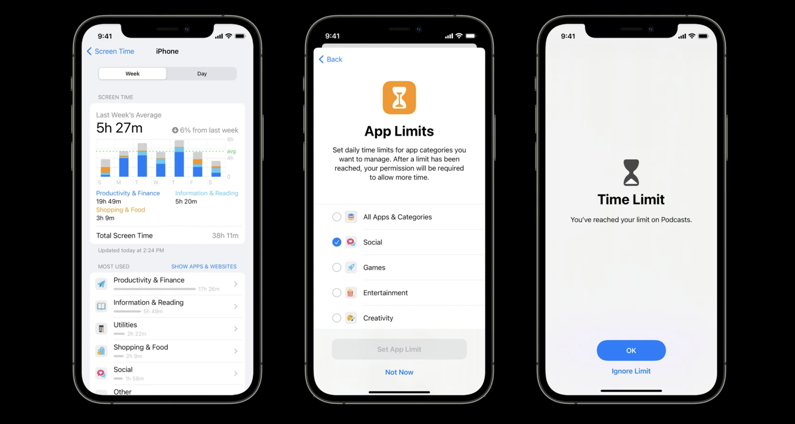

既然苹果有这样出色屏幕监控与限制使用的管理功能，那其他应用是否也可以拥有呢？当然可以！基于 `Screen Time API` 就可以在自己的**家长控制应用**中使用它们。

## Screen Time API 构造
`Screen Time API` 提供了核心的 `Screen Time` 功能，在iOS 和 iPadOS 15 之后的系统版本就可以使用 `Screen Time API`。`Screen Time API` 是100% Swift 和 SwiftUI 代码，它的设计和构建遵守了3个指导原则，基于这3个指导原则，苹果设计了与之对应的3个新的框架 — `Managed Setting` 、`Family Controls` 、`Device Activity` — 共同组成了 `Screen Time API`。

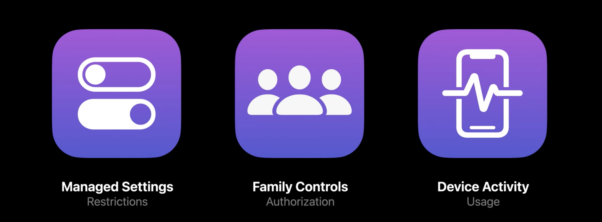

### 1. Managed Setting framework
基于**“为直接使用现有限制提供一个现代的、设备级的框架”**的指导思想，`Managed Setting` 框架能够直接使用与 `Screen Time` 相同的限制能力。

**家长控制应用**不仅应该限制儿童在设备上能够做什么，还应当让这些限制持续生效直到家长或者监护人解除限制。`Managed Setting` 提供了若干与 `Screen Time` 近似的实现方法：

- 适时的锁定账户或者锁定密码修改
- 过滤网络传输
- 屏蔽应用或网站

基于这些方法，可以根据应用自身的品牌调性以及功能，相应地进行定制化开发，设置多种类型的限制。

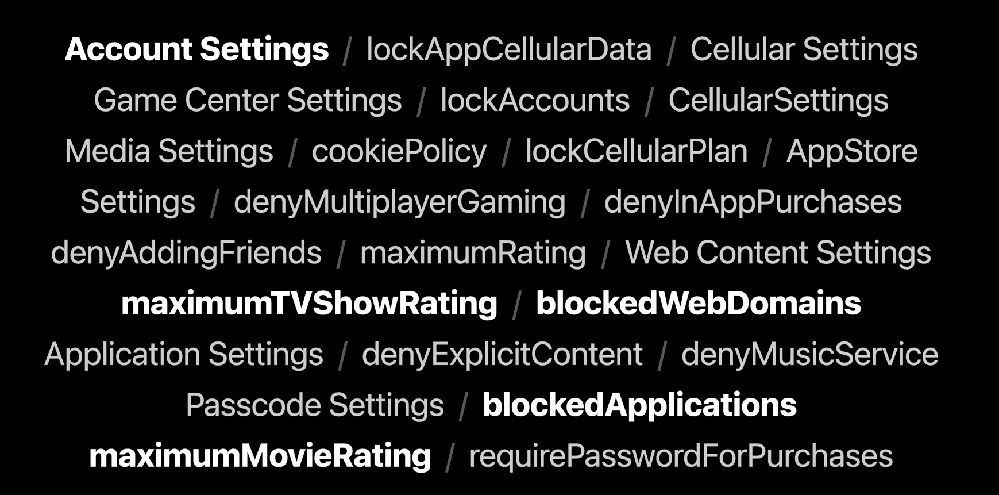

针对媒体内容，Managed Setting 提供了相关 API 且无需 Family Controls 授权。对于媒体类型的应用，这些方法会帮助它们针对不同用户做内容分级限制。

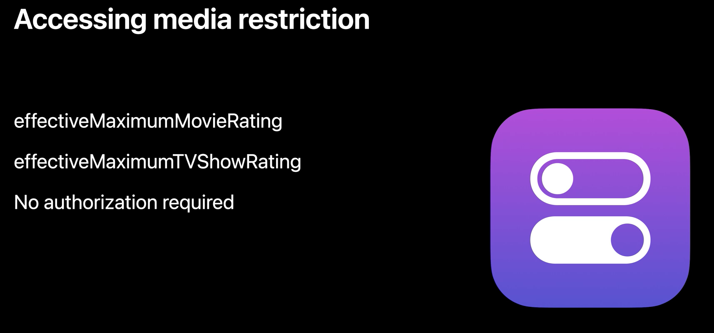

### 2. Family Controls framework

`Screen Time`会处理一些很敏感的用户信息（例如：用户使用应用时长或者访问网页时长），`Screen Time` 一直都很重视用户隐私，除了家庭成员，其他任何人（甚至苹果）都不能够获取用户敏感信息。`Screen Time API` 将延续这一特性：用户的使用数据在设备之外是不能被看到的。

正是基于这一指导思想 `Family Controls` 应运而生。`Family Controls` 能够校验 `Screen Time API` 的使用授权，防止 `Screen Time API` 被移除或规避。与此同时，`Family Controls` 为家庭正在使用的应用或访问的网站提供**隐私不透明令牌**。应用使用 `Screen Time API` 来进行监控或者限制功能使用的整个过程中，这个令牌都会用到。通过它还可以确保只有 `Family Share` 团体中的成员可以知道什么应用或网站正在被使用，任何其他人都无法得知。

### 3. Device Activity framework
`Device Activity` 框架提供了一种新的方式来监控网站和应用的使用状况，开发者可以在适当的地方执行代码来实现监控。考虑一种情况，小时候偷偷看电视，“聪明”的孩子就会用湿毛巾来给电视降温，这样在家长回到家摸电视机时就不会发现孩子偷看电视的行为。同样的，作为一个**家长控制应用**，孩子会想尽办法不让它“存活”在自己的手机中。那么如何才能运行代码来给孩子设置限制呢？答案便是`Device Activity` 框架中的 `schedules` 和 `events`。
`Device Activity Schedule` 会在时窗的开始和结束时，在程序中运行一个拓展。
`Device Activity Events` 是当设备上的用户达到 `Device Activity Schedule` 中的使用阈值时调用扩展的使用监视器。
**家长控制应用**只需要简单声明它所关心的**使用类型**和**使用时间**。

## Screen Time API 实践

下面是一个**家长应用控制**工作的流程：

1. 当**家长控制应用**被安装在监护人和孩子的设备中，家长在孩子的设备上打开应用，应用会请求 `Family Controls` 的权限。
2.  在监护人设备的应用中进行设置、限制和规则，应用会发送这些信息到孩子的设备。
3. 在孩子的设备中，应用使用 `Device Activity` 来创建计划和事件，当计划或事件发生，应用中 `Device Activity` 拓展会收到调用。在拓展中可以使用 `Managed Setting` 设置限制。

如何使用 `Screen Time API` 来完成这些操作是接下来要介绍。

### 1. 初始化并获取 Family Controls 权限

在 Xcode Project editor 中，选择应用 target ，在 Signing and Capabilities 栏目下点击添加按钮添加 Family Controls。
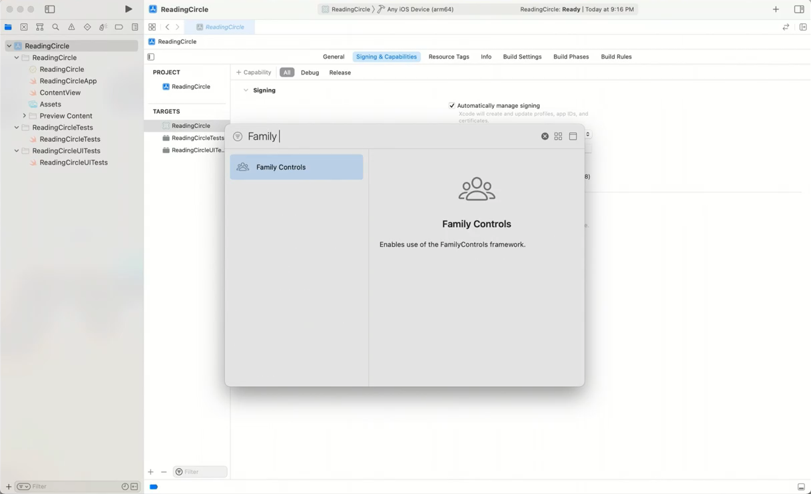

添加成功后，使用 ` AuthorizationCenter` 在应用启动时获取 Family Controls 权限，页面会弹出一个提示框，这时需要家庭成员中的监护人来同意授权并输入 Apple
 ID 和 密码。这里有几点需要注意：
 
 - 提示框仅在第一次获取授权会弹出展示，已经授权完成后，当再次请求 Family Controls 授权时，会默认执行成功回调。
 - 为了避免误用，当登录的用户没有使用 Family Sharing，请求授权方法会返回失败。
 - 一旦设备请求授权成功，用户不能退出 iCloud，使用 `Network Extensions framework` 构建的网页内容过滤也能够在家长控制应用中使用并将自动安装且不能被移除。
 
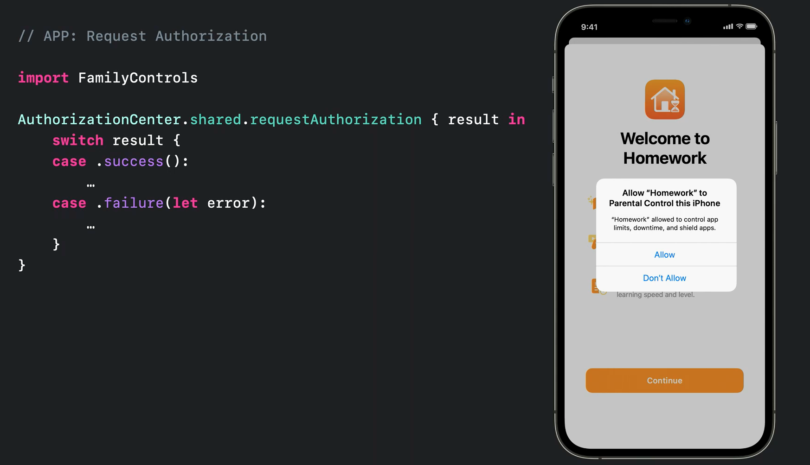

执行后台代码实施

### 2. 设置限制

#### 2.1 设置限制内容

在家长端，需要监护人来选择哪些应用、网站、分类是需要被禁止的。在 Family Controls framework 中提供了 `The family activity picker` 的 SwiftUI 组件来实现应用选择交互。当监护人做出选择后，通过返回的不透明的 token 指代的应用、网站或分类做出限制。当获取到监护人选择的限制之后，在 Device Activity 监听拓展中，进行下一步操作。

即使家长控制应用没有开启，也可以使用 Device Activity Schedule 来设置应用屏蔽限制。当 Device Activity Schedule 开启，Device Activity 将会调用一个新的拓展点，项目中会有针对拓展点的拓展。为了实现拓展，需要定义 `DeviceActivityMonitor` 的子类作为原理类。子类中需要重写两个方法 `intervalDidStart` 和 `intervalDidEnd` ，在自己的 schedule 开始和结束之后，当设备被使用时这两个方法将首次分别被调用。

引入 `ManagedSettings` 模块来配置应用屏蔽限制内容，在代码中，`intervalDidstart`方法内获取 `MyModel` 模型内家长端设置的限制内容，将限制内容配置到 `ManagedSettingsStore`。相应的，`intervalDidEnd ` 方法内清空限制配置，在时间范围外移除限制。

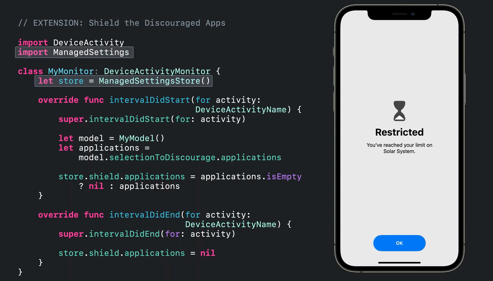

#### 2.2 设置限制监听
在家长控制应用的家长端，创建 Device Activity 监听拓展，设置名称，创建 schedule。在拓展中可以通过 `DeviceActivityName `来引用活动， `DeviceActivitySchedule` 描述了拓展监听活动的时间范围，`repeats` 参数表明是否重复运行。通过创建 `DeviceActivityCenter` 对象，调用 `startMonitoring` 方法来开启监听。

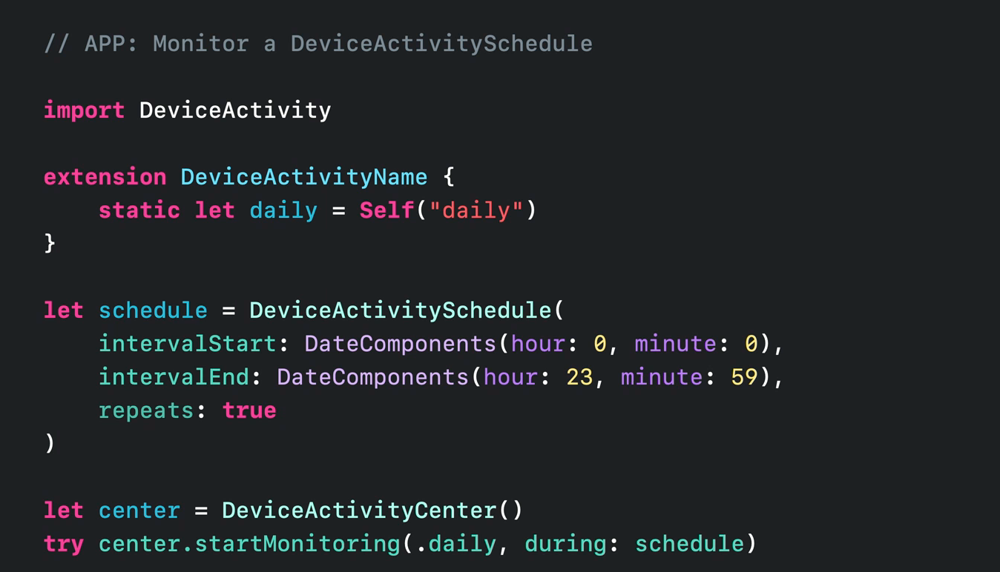

### 3. 完成任务后移除限制

#### 3.1 设置推荐使用内容和完成目标
在 Device Activity 监听拓展中， 设置 `DeviceActivityEvent` , 根据设置的名称可以引用这个事件。

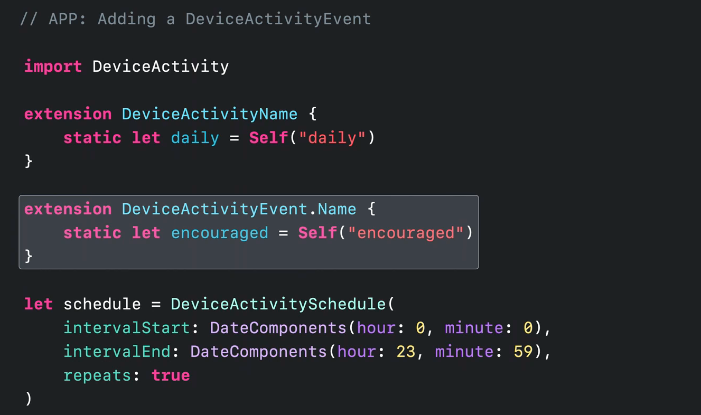

将用户选择的推荐使用的内容和期望完成目标配置到事件当中，然后将这个事件也配置到 `startMonitoring` 方法中。

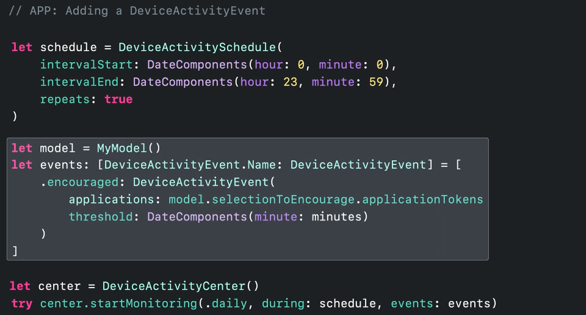

#### 3.2 监听鼓励事件完成情况

在家长控制应用家长端，当鼓励事件达标时，`eventDidReachTHreshold` 方法将被调用，方法中有两个参数：`Device Activity Event Name` 和 `Device Activity Name`。 这两个参数表明了是哪个事件完成了哪个活动计划。

### 4.定制操作

#### 4.1 定制屏蔽界面

基于 `ShieldConfigurationProvider` 创建子类， `coinfiguration` 是唯一需要重写的方法，方法中的参数是当前被屏蔽的 application 的引用，方法将返回一个 `ShieldConfiguration` 结构体。方法中可以设置背景、标题、副标题、图标、按钮样式。
 
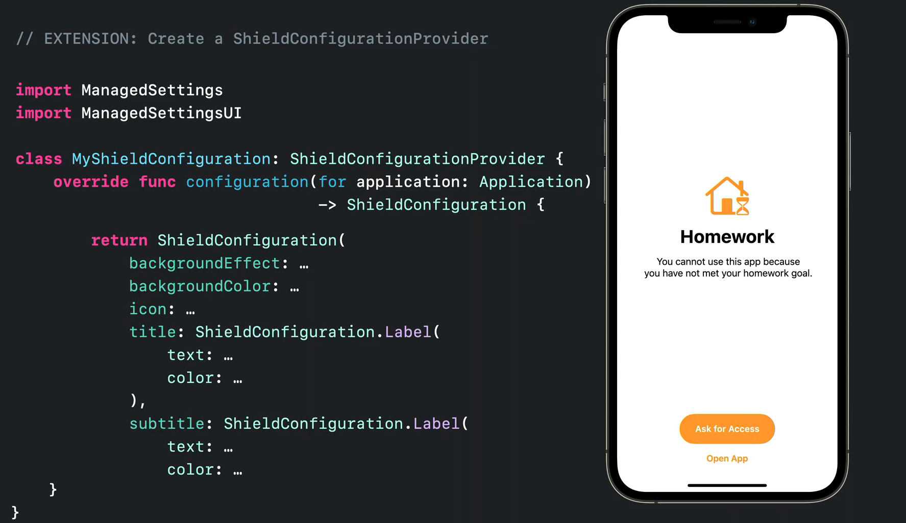

#### 4.1 定制按钮处理

基于 `ShieldActionHandler` 创建子类重写 `handle` 来实现自定义按钮事件。方法种的参数 `action` 表示是哪个按钮被点击， `application` 表示当前被屏蔽的 application。该方法需要实现 completionHandler 回调，有两种响应：关闭和延迟。其中延迟是一个很强大的操作，它能够在等待信号的过程中重绘页面展示加载状态。例如，当孩子向家长请求访问权限等待时，可以展示加载状态。

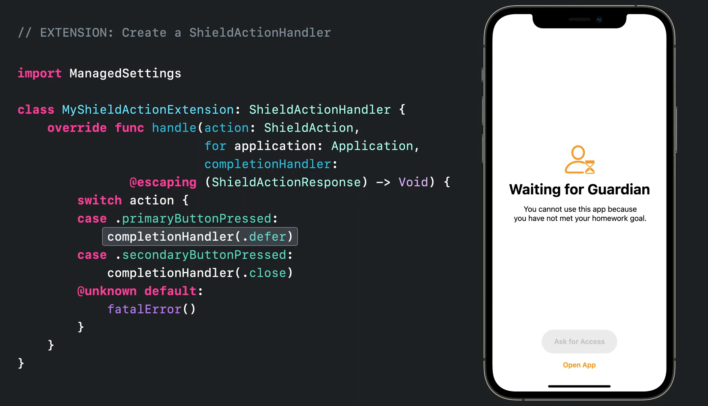

## 后记

Screen Time API 让我想到了目前国内 APP 中的青少年模式，两者都是对于儿童使用应用过程中的限制。不同的是，应用中的青少年模式只能从应用层级来做限制，例如抖音的青少年模式会限制展示内容分类、使用时间限制，应用内操作限制。而 Screen Time API 是从系统层面对应用使用做出限制，其隐私性更加有保障，可以通过配置来设置激励措施。两者可以相互结合，在系统层面和应用层级全面的设置限制来引导用户使用手机的习惯。

## 相关内容
- [Family Share](https://www.apple.com/family-sharing/)