# WWDC21 10153 - 基于苹果芯片的图像处理

> 本文来源于 [WWDC 2021 - 10153 「Create image processing apps powered by Apple Silicon」](https://developer.apple.com/videos/play/wwdc2021/10153/)。

## 简介

这篇 WWDC 的分享主要介绍了如何针对苹果芯片对图像处理应用进行优化，探索了如何充分发挥 Metal 渲染命令编码器、切片渲染、统一内存架构，以及 memoryless attachments 的优势。在文中的示例里，工程师为我们展示了如何针对苹果 GPU 的 TBDR 架构来降低应用的内存占用，减少能耗。通过本篇分享，你还可以了解到将应用中的运算从独立显卡迁移到苹果芯片的最佳实践。

本文主要由两部分组成。前半部分，工程师根据过去一年开发者的一些反馈，分享了针对 M1 芯片优化图像处理的最佳实践和经验教训。后半部分是具体的示例，苹果工程师手把手指导我们怎么设计图像处理管线，才能在 M1 芯片上的最大性能。

## 苹果 GPU 的优化之道

想要针对 M1 芯片进行优化，就先要了解苹果芯片的系统架构，以及它的优势所在。市面上许多图像处理和视频编辑的应用在设计时都针对独立显卡进行了优化，我们重点强调一下苹果 GPU 的不同之处。

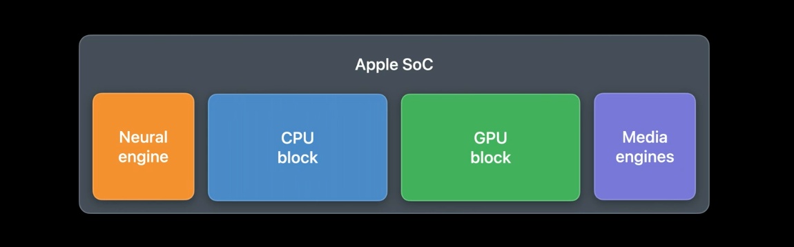

首先，所有的苹果芯片都使用统一内存架构（Unified Memory Architecture，简称 UMA）。也就是说，包括 CPU、GPU、神经网络和多媒体引擎在内的所有单元，都可以使用统一的内存接口，访问同一个系统内存。说白了就是没有独立的显存，CPU、GPU 等处理器都是直接访问系统内存。

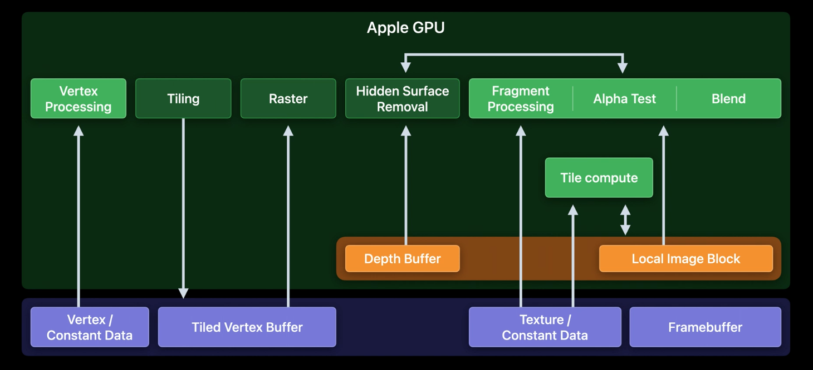

其次，苹果的 GPU 采用基于切片的延迟渲染（Tile Based Deferred Renderers，简称 TBDR）。TBDR 有两个主要阶段：切片和渲染。切片是指将完整的渲染画面拆分为一个个的小图块，然后分别进行几何处理。渲染是指对每个图块上的所有像素进行处理。

因此，我们的应用想要获得最高的效率，应该充分利用这两个特点。因为没有独立的显存，我们应该避免以前的各种拷贝操作。因为 TBDR 架构，我们要充分利用切片内存和 Local Image Block。

 想了解苹果 TBDR 底层的工作原理，以及苹果着色器核心的更多信息，可以观看 2020 年的相关议题：

* [Bring your Metal app to Apple silicon Macs](https://developer.apple.com/videos/play/wwdc2020/10631/)
* [Optimize Metal Performance for Apple silicon Macs](https://developer.apple.com/videos/play/wwdc2020/10632/)

下面，我们具体地介绍一下，针对苹果芯片优化图像处理运算的六个最有价值的技巧。

### 1、避免不必要的内存拷贝（ blits）。

首先我们要避免进行不必要的内存拷贝，也就是 blits。鉴于我们现在处理的图像的分辨率可能高达 8K，这一点非常重要。

市面上大多数图像处理应用都是围绕独立显卡设计的。在使用独立显卡的时候，系统内存和显卡的内存是相互独立的。为了让 GPU 能够访问每帧图像，必须对图像进行显式的拷贝。而且通常需要两次拷贝，一次传入 GPU 处理，一次从 GPU 取回结果。

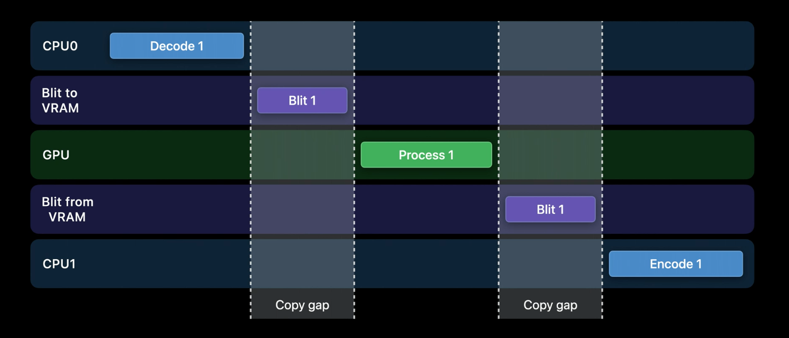

比如，以往我们如果想解码一个 8K 视频，对它进行一些图像处理，然后保存到磁盘。

如上图所示，首先我们会在一个 CPU 线程上进行解码。然后将解码的帧拷贝到 GPU VRAM 中。接着在 GPU 中应用各种效果和滤镜。最后我们还要将处理后的图像拷贝回系统内存，在 CPU 上进行编码操作。

在高级图像处理应用中，往往需要进行深入的并发优化，或者用一些巧妙的方法来填满这些处理器的空闲间隙。值得庆幸的是，在苹果的 GPU 上，我们不再需要为了传递图像而进行内存拷贝。因为内存是共享的，CPU 和 GPU 都可以直接访问它。

```swift
let hasUMA = device.hasUnifiedMemory()
```

在 UMA 架构的系统上，内存拷贝往往是多余的。我们可以通过上面这个简单的检查来判断系统是否支持 UMA，如果系统支持，那我们就尽量避免不必要的内存拷贝。

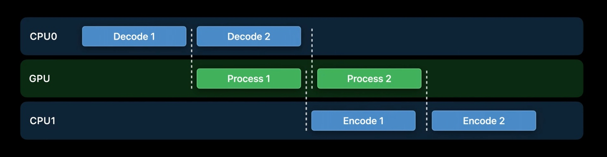

这将大大节约内存，同时我们也完全避免了内存拷贝的耗时，我们的运算就可以无缝衔接。这样也使得 CPU 和 GPU 的运算流水线更加的合理。如下图所示，消除了内存拷贝的耗时后，CPU 和 GPU 可以无缝衔接，不仅提高效率，也大大简化了任务调度的复杂度。

此外，Xcode 里的 GPU Frame Capture 工具可以帮我们检查是否有内存拷贝的存在。

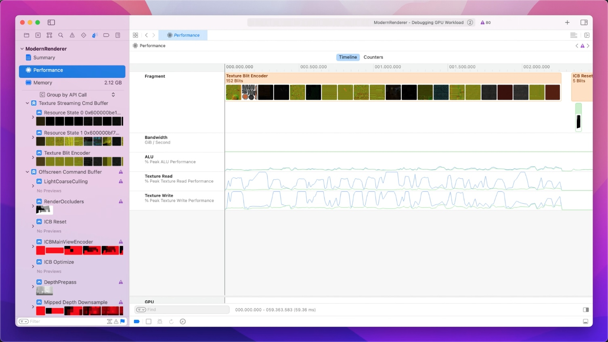

### 2、多用渲染而非计算

下面，我们来谈谈如何充分利用苹果 GPU 的 TBDR 架构进行图像处理。

在以往，大多数图像处理应用是通过派发一系列计算内核（compute kernel）对图像缓冲区进行操作。当我们用默认的串行模式去派发计算内核时，Metal 会保证所有后续派发都能看到上一次的所有内存写入，如下图所示。

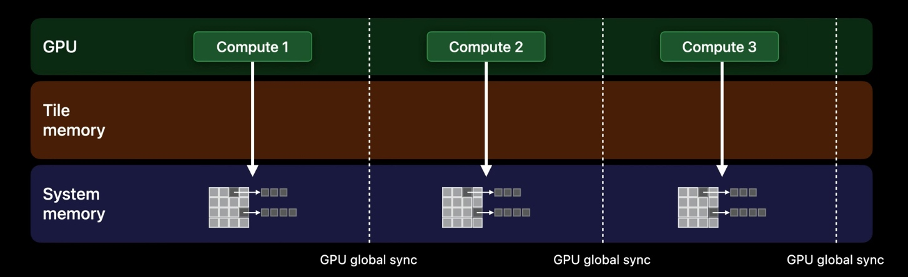

这确保了所有着色器的内存一致性，因此在下一次派发开始时，所有其他着色器都可以看到每次内存写入。但这也意味着内存读写的流量会非常高，因为每次都必须读取和写入整幅图像。

有了 M1 之后，苹果的 GPU 可以在 MacOS 上启用切片派发（Tile Dispatches）。和之前的运算不同的是，切片派发调度的是切片内存，也只有切片同步点（Tile sync point）。卷积之类的滤镜，没法映射到切片模式，所以不能从中受益，但是其他的大部分滤镜都可以。

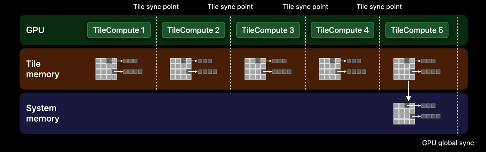

我们将系统内存的刷新时机推迟到整个编码器（encoder）结束的时候，可以大大提高效率。这样一来，没有了系统内存带宽的瓶颈，我们就可以执行更多的 GPU 运算。

更进一步，我们可以发现很多滤镜其实是逐像素运算的，并不需要访问相邻像素，因此连切片同步点都不需要。这种情况就可以用到片元函数（fragment functions）。片元函数可以在没有隐式的切片同步的情况下执行，只需要在编码器的边界进行同步，或者在片元着色器之后串行派发切片着色器时才需要同步。

上面说了苹果 GPU 支持片元函数和切片着色器，可以实现更高效的图像处理。那下面就让我们看看具体怎么使用。

简单来说，就是把缓冲区上进行的常规计算派发，转换为纹理上进行的 `MTLRenderCommandEncoder`。根据上面所说的，规则如下：

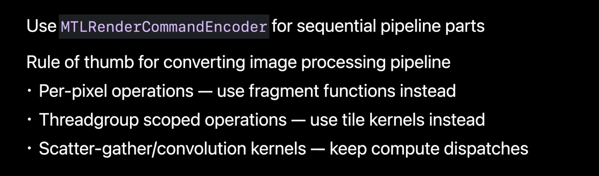

* 没有像素间依赖的逐像素运算改用片元函数来实现。
* 涉及线程组内操作的滤镜都改用切片着色器实现，因为需要访问切片内的相邻像素。
* Scatter-gather 和卷积滤镜需要随机访问，因此它们仍保留计算派发。

`MTLRenderCommandEncoder` 还使用了苹果一项独特的 GPU 功能：纹理和渲染目标的无损带宽压缩。这可以非常好地节省带宽，特别是图像渲染管线。

但需要注意的是，以下几种情况无法开启无损压缩

1、已经压缩的纹理格式无法从无损压缩中受益。
2、使用了三个纹理标志之一 `MTLTextureUsagePixelFormatView | MTLTextureUsageShaderWrite | MTLTextureUsageUnknown`
3、线性纹理，或者由 MTLBuffer 回写缓存了。

非私有纹理也需要一些特殊处理，例如 `MTLStorageModeShared` 或者 `MTLStorageModeManaged`。我们需要调用 `optimizeContentsForGPUAccess()` 来确保可以快速访问。

GPU Frame Capture 调试界面可以显示无损压缩警告，并显示纹理不支持的原因。

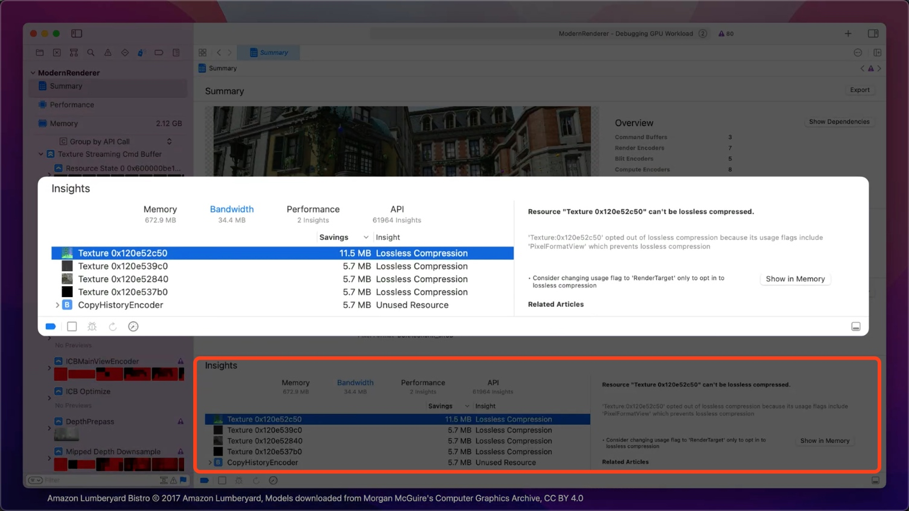

### 3、正确的 `load`/`store` 操作

接下来，我们看看怎么样正确使用切片内存。

切片内存 TBDR 的一些概念对于桌面世界来说是全新的，例如 `load`/`store` 操作，以及无内存附件（Memoryless Attachments）。所以我们需要特别注意使用它们的正确方式。

我们先看看 `load`/`store` 操作。正如我们上面说到的，整个渲染目标被分割成一个个的切片。 `load`/`store` 操作是批量对每个切片进行的，它会保证在内存层次结构中采用最佳的路径。它在一次 render pass 开始时执行，我们会告诉 GPU 如何初始化切片内存，并在 render pass 结束时通知 GPU 哪些附件需要写回。

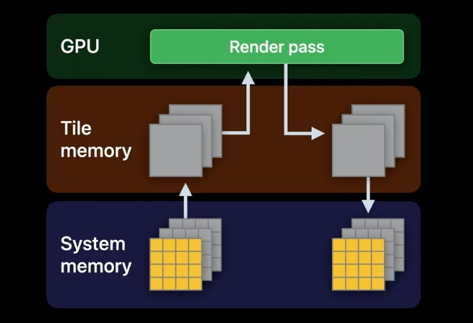

这里的关键是避免加载我们不需要的切片。

如果我们要直接覆写整个图像，或者资源是临时的，可以将 `load` 操作设置为 `MTLLoadActionDontCare`。使用渲染编码器的时候，不需要清除输出的内容或临时数据，只需要设置 `MTLLoadActionClear`，就可以有效地清除指定值。`store` 操作也是一样，确保只存储需要的数据，并且不要临时存储任何东西。

除了显式的 `load`/`store` 操作外，苹果 GPU 还可通过无内存附件节省内存占用。

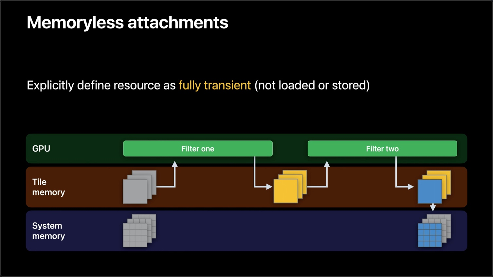

我们可以显式地将附件（Attachment）定义为具有无内存存储模式。这会启用“仅切片内存分配”，这意味着我们的资源只会在编码器的生命周期内，为每个切片保留。这可以大大减少内存占用，尤其是 6K/8K 图像，每帧的占用就可以达到几百 MB。具体使用方法如下所示：

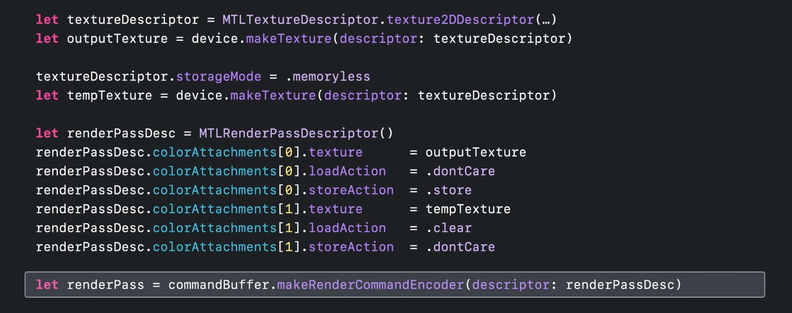

### 4、Uber-shaders 和函数常量

现在，让我们谈谈 Uber-shaders（超级着色器）。
Uber-shaders 或 Uber-kernels 是一种非常流行的方式，可以让开发人员的工作更轻松。主体代码就是大量的控制结构，着色器只是循环地执行一系列 if/else 语句，比如说，是否启用色调映射，或者输入格式为 HDR 或 SDR。这种方法也称为 “Ubers-shader“，这么做可以有效地减少管线状态对象的数量。

然而，它也有缺点。它最主要的一个问题，就是增加了寄存器的压力，因为它带来了更复杂的控制流。使用大量寄存器会在着色器运行时，限制 GPU 的最大使用率。

以下面的着色器为例。

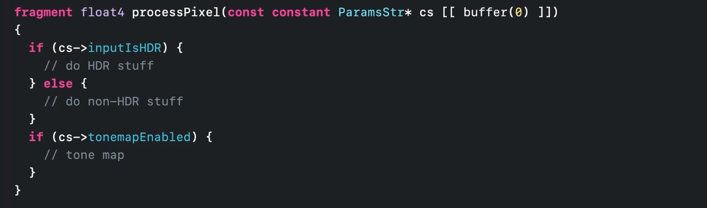

我们在上面的着色器中使用两个变量，来控制对应的功能。一切看起来都很正常，然而，由于我们无法在编译时推断出任何内容，因此，对于每个条件判断，我们都必须假设两条路径都可能走到，比如 HDR 和非 HDR。然后进行组合，根据输入标志，屏蔽或启用某个路径。

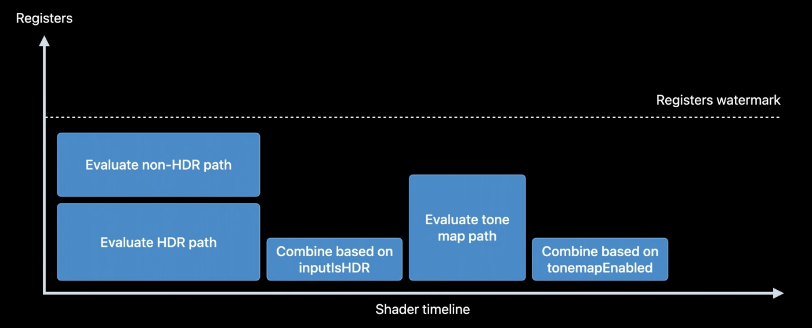

这里的最大的问题是寄存器。每个控制流路径都需要实时寄存器。这就是超级着色器不太好的地方。因为在并发对各个像素执行着色器的时候，寄存器是共用的，如果一路着色器就占用了很多寄存器，那 GPU 的并发量也就会降低，使用率也就降低。如果我们只能运行只需要的逻辑，那将实现更高的 simdgroup 并发性和 GPU 利用率，如下图所示。

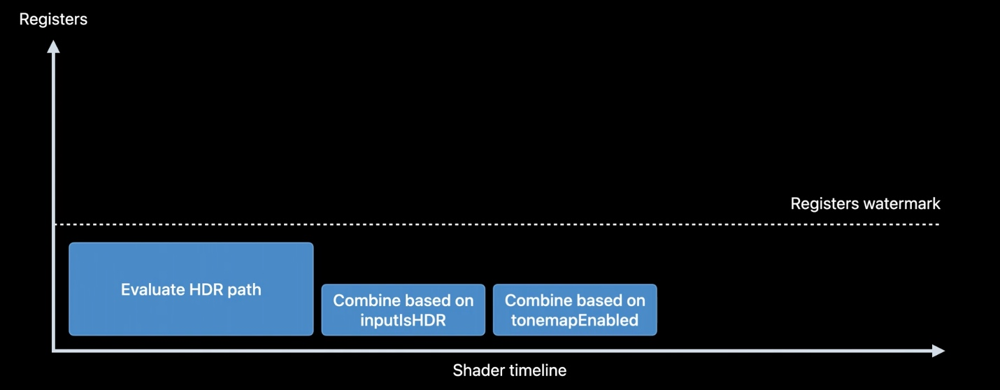

下面就谈谈如何解决这个问题。

在 Metal 的 API 里有能够解决这个问题的工具，它被称为 **函数常量（function_constants）**。

我们将两个控制参数定义为函数常量，并修改代码，如下所示。这样就可以解决上面的问题。

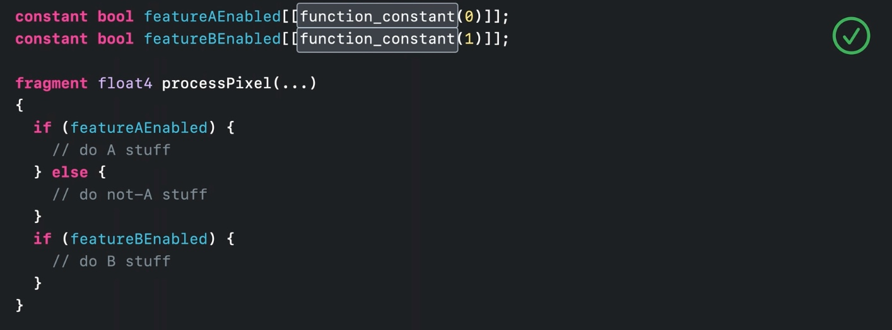

### 5、充分利用低精度数据类型

另一个减少寄存器压力的好方法是在着色器中使用 16 位的数据类型。Apple GPU 原生支持 16 位数据类型。因此，使用更小的数据类型时，着色器也只需要更少的寄存器，从而提高 GPU 使用率。使用 half 和 short 类型的能耗也更低，并且可能实现更高的峰值速率。因此，我们应该尽可能使用 half 和 short 类型而不是 float 和 int，因为类型转换通常是没有性能损耗的。

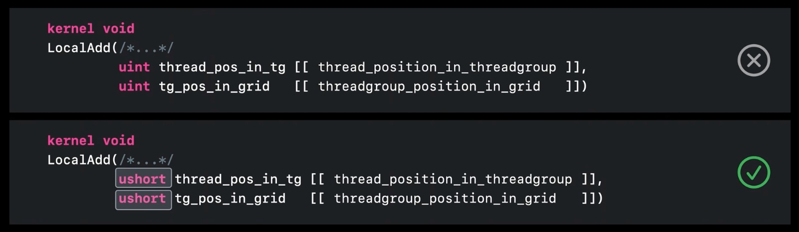

例如上面的示例中，着色器的线程组参数 `thread_position_in_threadgroup` 我们使用的是 unsigned int，但 Metal 支持的最大线程组并不会超过 unsigned short 的数据范围。另一个参数 `threadgroup_position_in_grid` 数值可能会比较大。但是即使是 8K 或 16K 图像 unsigned short 也足够了。如果我们都改用 16 位类型，则生成的代码就只会使用较少数量的寄存器，这样一来，GPU 使用率很可能就会有所提升。

Xcode 13 中的 GPU Frame Capture 可以获得寄存器相关的所有信息，如下所示。

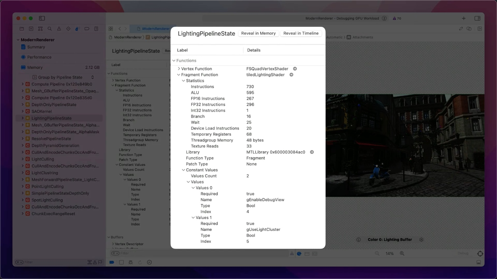

### 6、MTLPixelFormat 最佳实践

讨论了寄存器问题后，我们来谈谈纹理格式。

首先，我们要知道不同的像素格式可能有不同的采样率。根据硬件和通道数量，更大的浮点类型可能会降低点采样率。特别是 RGBA32F 等浮点格式在采样时会比 FP16 之类的慢。比较小的数据类型也减少了内存、带宽和缓存的空间占用。所以我们要尽可能使用最小的类型。

但还有一个原因，那就是纹理存储的消耗。这实际上是我们开发图像处理的 3D LUT 时很常遇到一种情况。我们使用的大多数的 3D LUT 都启用了双线性滤波，使用的往往是浮点 RGBA。我们可以考虑是否可以改为 half 精度就足够了。如果是的话，那就赶紧切换到 FP16 来获得最高的采样率。

如果半精度不够，我们发现 fixed-point unsigned short 提供了非常均匀的值范围。因此以 unit scale 来编码 LUT，并向着色器传入 LUT 范围，是获得最高采样率和准确性的好办法。

## 实践

现在，让我们根据上面的最佳实践，为 Apple 芯片重新设计图像处理管道。实时图像处理非常占用GPU 计算和内存带宽，所以我们首先了解它一般是如何设计的，然后我们看看如何针对 Apple 芯片对它进行优化。

我们以 ProRes 编码的输入文件为例。

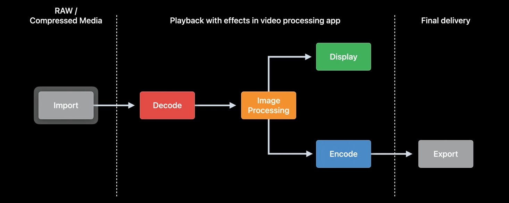

首先我们从磁盘或外部存储中读取 ProRes 编码的帧，然后我们在 CPU 上解码帧。然后，在图像处理阶段在 GPU 上对解码的帧执行渲染，最终输出帧。

### 渲染管线

接下来，让我们看一下示例中图像处理管线的组成。

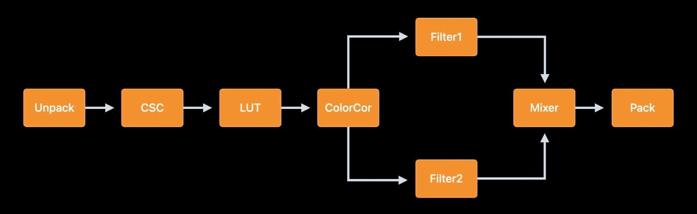

如上图所示，我们首先将源图像 RGB 的不同通道解包到单独的缓冲区中。后续可以在图像处理管线中对这些通道一起或单独处理。接下来，进行色彩空间转换。然后我们应用 3D LUT；执行色彩校正；然后应用降噪、卷积、模糊和其他效果。最后，我们将单独处理的通道打包在一起进行最终输出。

这些步骤有什么共同点呢？它们都是点像素滤镜，仅在单个像素上运行，没有像素间依赖性。这很适合用片段着色器来实现。空间和卷积操作需要访问大半径的像素，我们也有离散的读写访问模式，这些非常适合计算内核。我们稍后会用到这些知识。

由于内存有限，我们常通过拓扑排序来线性化滤镜链。这样做是为了尽可能减少中间资源的总数，同时避免竞争条件。示例中的这个简单的滤镜链需要两个缓冲区才能在没有竞争条件的情况下运行并输出结果。下面线性化的图也粗略地表示了 GPU 命令缓冲区发生的事情。

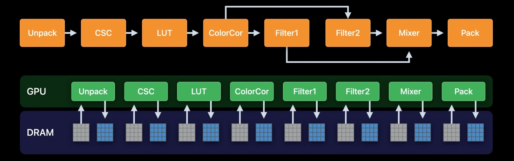

我们更深入地看看为什么这个滤镜链非常占用设备内存带宽。每个过滤操作都必须将整个图像从设备内存加载到寄存器中，并将结果写回设备内存，这是相当多的内存流量。

拿 4K 图像来举例。一帧 4K 图像解码，如果采用 FP16 精度就需要 67 MB 的内存，如果采用 FP32 精度就需要 135 MB 的内存。对于专业的图像处理应用来说，必然需要 32 位的精度。这样一来，用 32 位精度来过这个滤镜链，去处理一个 4K 的图像帧，就会产生超过 2GB 的设备内存读写流量。同时还会影响其它的渲染管线，产生缓存波动。

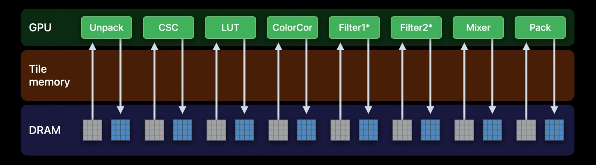

常规的计算内核无法地从片上的切片内存（Tile Memory）中受益。内核可以显式分配线程组范围的内存，这就是在片上的切片内存分配的，但是该内存在计算编码器内的一次派发中不是持续存在的。相比之下，切片内存在一个 `MTLRenderCommandEncoder` 内的绘制过程中是持续存在的。

下面让我们看看如何重新设计这个具有代表性的图像处理管线以利用切片内存。我们将通过以下三个步骤来解决这个问题。

**第一步**，我们将计算管线更改为渲染管线，并将所有中间缓冲区更改为纹理。

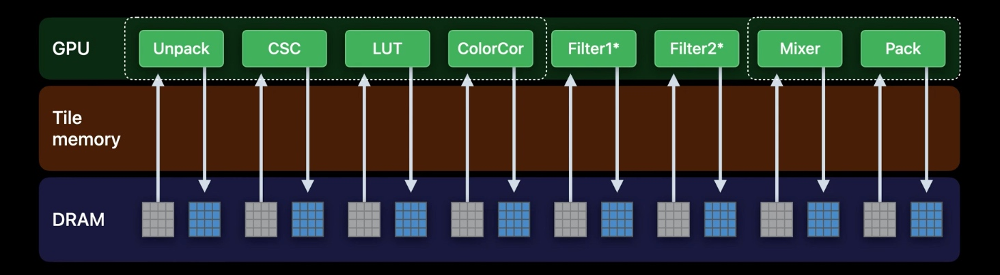

**第二步**，我们将没有像素间依赖的操作，编码为一个 `MTLRenderCommandEncoder` 中的片元着色器调用，这步骤要确保所有中间结果正确并设置适当的 `load`/`store` 操作。

然后我们讨论下更复杂的问题。刚刚我们的第一步是使用单独的 `MTLRenderCommandEncoder` 来编码所需的着色器。在这个滤镜链中，Unpack、颜色空间转换、LUT 和颜色校正滤镜都是单像素点的滤镜，所以我们可以将它们转换为片元着色器，并合并起来使用一个`MTLRenderCommandEncoder` 对其进行编码。类似的，渲染链末尾的 Mixer 和 Pack 着色器也可以转换为片段着色器，并使用另一个 `MTLRenderCommandEncoder` 进行编码。

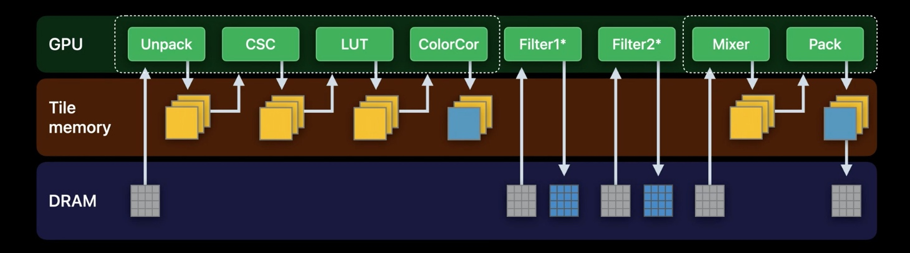

然后我们可以在它们各自的 render pass 中调用这些着色器。创建 render pass 时，附加到该 render pass 中 color attachment 的所有资源都会被隐式切片。一个片元着色器只能写入该片元所在切片的图像数据块。同一 render pass 中的下一个着色器可以直接从切片内存中获取前一个着色器的输出。我们看看具体的代码实现。

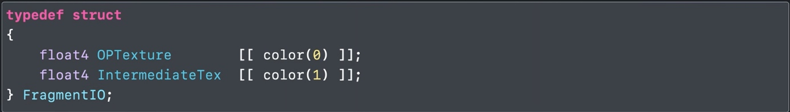

在这里，我将输出图像作为纹理附加到 render pass descriptor 的 color attachment 0；将保存中间结果的纹理附加到 color attachment 1。这两个都会被隐式切片。我们需要按照前面说的，正确设置 `load`/`store` 属性。

接下来我们看看如何在片元着色器中使用这个结构。我们只需使用我们之前定义的结构访问片元着色器中的输出和中间纹理。这些纹理会写入到与片元对应的切片内存中。

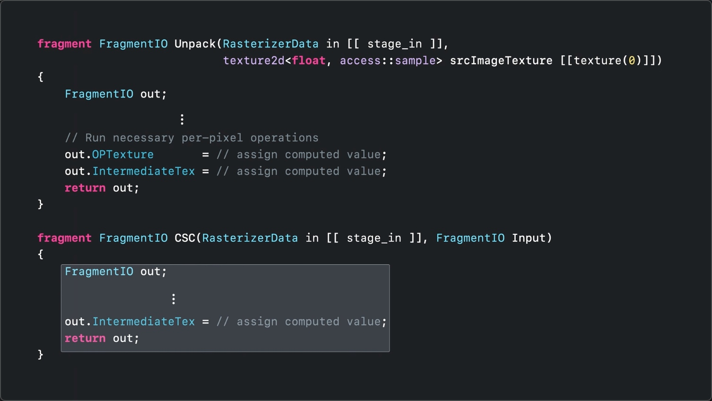

Unpack 着色器产生的输出被颜色空间转换（CSC）着色器用作输入，输入的格式就是我们之前定义的结构。这个片元着色器可以进行自己的处理，并更新输出和中间纹理，更新相应的切片内存的数据。后续就是对同一 render encoder pass 中的所有其他片元着色器继续执行相同的步骤。

**第三步**，让我们看看离散随机访问模式的滤镜。

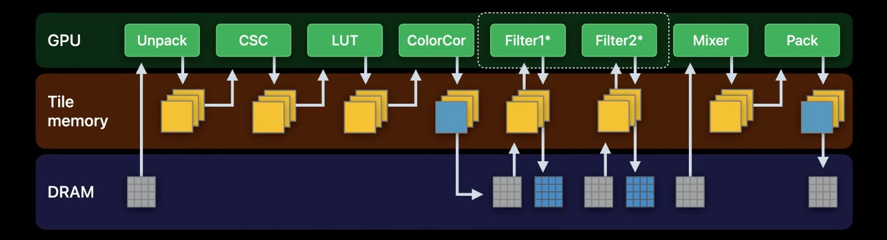

此类滤镜的着色器可以直接对设备内存中的数据进行操作。卷积过滤器非常适合计算内核中基于图块的操作。我们可以通过声明一个线程组内的内存来表达使用切片内存的意图。然后将像素块与所有必要的卷积算子的像素一起放入切片内存中，具体取决于卷积的半径，并直接在切片内存上执行卷积运算。要记住的是，切片内存在计算内核的派发中不是持续存活的。因此，在执行 Filter1 之后，必须显式地将切片内存的内容刷新到设备内存。这样，Filter2 就可以消费到 Filter1 的输出啦。

通过上述的修改，整个内存读写的带宽从 2.16 GB 下降到仅 810 MB，这意味着到设备内存的内存流量减少了 62%。我们也不再需要两个中间缓冲区，每帧可节省 270 MB 的内存。最后，同时我们减少了缓存波动，这是因为该 render pass 中的所有片元着色器都直接在切片内存上运行。

### UMA

Apple 芯片的主要特性之一是其 UMA（统一内存架构）。在接下来的部分中，我们将通过一个示例，介绍 GPU 输出结果帧进行 HEVC 编码时，如何用最有效的方式来设置管线。

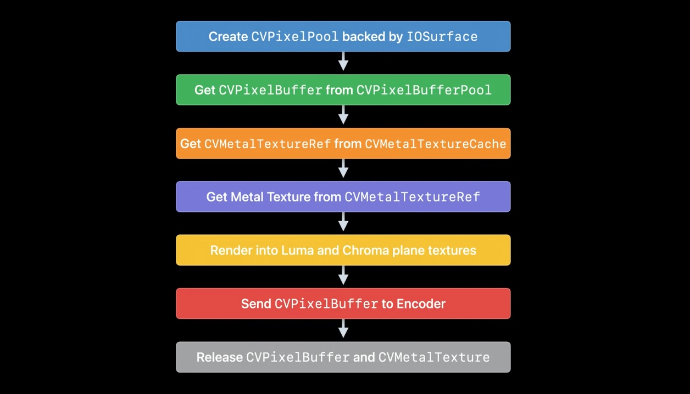

首先我们将利用 CoreVideo API 创建一个由 `IOSurfaces` 的像素缓冲池。然后，使用 Metal API，我们将帧画面渲染为由我们刚刚创建的缓存池中 `IOSurfaces` 的 Metal 纹理。最后，我们将这些像素缓冲区直接派发到媒体引擎进行编码。由于 UMA 统一内存架构的存在，我们可以在 GPU 和媒体引擎单元之间无缝移动数据，无需进行任何内存复制。

最后，记得在每一帧结束之后释放 `CVPixelBuffer` 和 `CVMetalTexture` 的引用。释放 `CVPixelBuffer` 可以回收此缓冲区，以便后续的帧可以使用。

## 总结

最后，我们总结一下以上本文介绍的几个最重要的实践。

* 首先利用统一内存架构
* 在适用时使用 `MTLRenderCommandEncoder` 而不是计算管线
* 在单个 `MTLRenderCommandEncoder` 中合并所有符合条件的 render pass
* 设置合适的 `load`/`store` 属性
* 对临时资源使用 memoryless
* 尽量利用切片着色
* 使用缓冲池等 API 实现零内存拷贝
