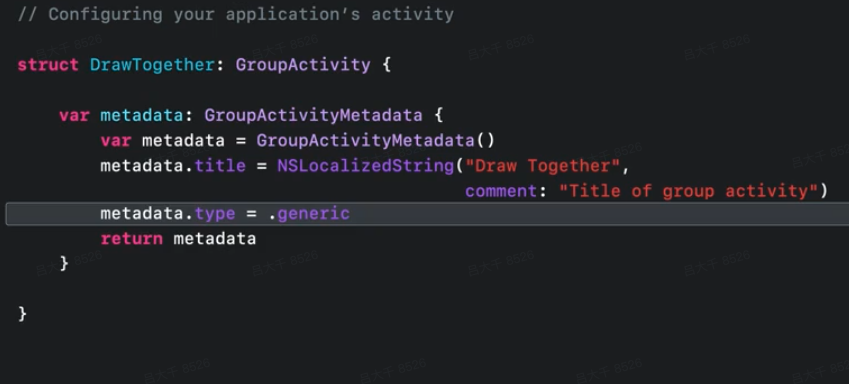

# WWDC21 10187 - 使用Group Activity共享定制化内容

## 导读
刚刚结束的WWDC 2021 ，苹果给Facetime 带来了新功能SharePlay。使用苹果设备的用户，无论是iOS、iPadOS还是MacOS，都可以通过FaceTime开启SharePlay，和其他苹果用户，无论他使用什么类型的苹果设备，都可以实时的共享电影、音乐等媒体。 

当然不仅仅是共享媒体， SharePlay的底层通信框架Group Activities Framework 还支持通过GroupSessionMessenger API 发送和接收结构化的数据。GroupSessionMessenger 会自动进行序列化和反序列化，并且进行端到端的加密。

本文通过一个简单的白板应用为例， 讲解了开发共享定制化内容的相关技术， 包括：

- 开发共享定制化内容和共享媒体的区别
- 通过GroupSessionMessenger API 进行数据通信
- 一个优秀的共享应用还需要注意的细节

> 在阅读本文前建议首先阅读 [WWDC21 10183/10184 - 初探 Group Activities]()   和[WWDC21 10225 - 使用Group Activity共享媒体]() 了解Group Activities API的基本概念
> 本文主要信息来源于[WWDC21 session 10187：Build custom experiences with Group Activities](https://developer.apple.com/videos/play/wwdc2021/10187/)

## 共享定制化内容
### 基本概念

- GroupActivity： 应用用来定义共享内容的实体
- GroupSession：用来一个SharePlay会话的对象

详细描述参见 [WWDC21 10183/10184 - 初探 Group Activities]()，这里不再详述。

### 基本流程

先简单回顾一下SharePlay共享媒体的基本流程，详细描述参见WWDC21 10225 - 使用Group Activity共享媒体 

1. 应用声明支持GroupActivity， 并创建实现GroupActivity协议的对象
2. 发送方通过GroupActivity对象的`prepareForActivation`、`activate`等方法发起共享
3. 会话中的设备通过GroupActivity对象的异步方法`sessions`来获得GroupSession
4. 会话中各方将GroupSession 配置到`AVPlaybackCoordinater`或者`AVDelegatingPlaybackCoordinator`来同步状态
5. 会话中各方调用GroupSession的`join`方法，开始同步数据
6. 会话中各方调用GroupSession的 `end` 或者 `leave`方法来结束会话，停止同步数据

相比于共享媒体，共享定制化内容主要有两个地方不同。 一个是GroupActivity定义metadata需要更改类型。另一个是获得GroupSession 后不再配置到`AVPlaybackCoordinater`， 而是用GroupSession构造一个`GroupSessionMessenger`对象来管理数据传输。

#### GroupActivity定义

在实现 GroupActivity 协议的时候， 设置metadata的type 为`generic`，这样系统就知道这个GroupActivity是一个定制化的内容，而不是多媒体内容。


### GroupSessionMessenger
`GroupSessionMessenger`类 和`AVPlaybackCoordinater `类类似， 提供了一组简单的API，帮助开发者通过GroupSession利用现有的 FaceTime 通信通道来发送与接收特定的数据。例如，电影观看应用程序可能会在电影播放时共享用户评论或标签。
`GroupSessionMessenger`对象的创建和简单，只需要一个GroupSession作为参数。

```swift
let messenger = GroupSessionMessenger(session: groupSession)
```

不过需要注意的是，要想通过`GroupSessionMessenger`发送和接收数据，需要在会话的生命周期内存储对 `GroupSessionMessenger `对象的强引用。

#### 数据结构
`GroupSessionMessenger`支持传递Data类型的数据，或者Codable类型的数据。`GroupSessionMessenger` 会自动进行序列化和反序列化Codable类型的数据，并且进行端到端的加密。

```swift
struct UpsertStrokeMessage: Codable {
    let id: UUID
    let color: Color
    let point: CGPoint
}
```

#### 接收数据
接收数据API 也支持Data和codable的数据结构。 API定义如下：

```swift
final func messages(of type: Data.Type) -> GroupSessionMessenger.Messages<Data>
final func messages<Message>(of type: Message.Type) -> GroupSessionMessenger.Messages<Message> where Message : Decodable, Message : Encodable
```

返回一个支持AsyncSequence协议的数据结构，可以通过Swift的新特性 await来读取数据。 在本例中， 接收对方所画线条的消息代码如下：

```swift
for await （message, context) in  messenger.messages(of: UpsertStrokeMessage.self) { [weak self] in
    self?.handle(message)
}
```
#### 发送数据
发送数据的API 支持 async 和回调函数两种方式。默认会发送给所有的参与者，并保证数据可靠传输。API定义如下：

```swift
final func send<Message>(_ value: Message, to participants: Participants = .all, reliability: GroupSessionMessenger.MessageReliability = .reliable) async throws where Message : Decodable, Message : Encodable
final func send(_ value: Data, to participants: Participants = .all, reliability: GroupSessionMessenger.MessageReliability = .reliable) async throws
final func send(_ value: Data, to participants: Participants = .all, reliability: GroupSessionMessenger.MessageReliability = .reliable, completion: @escaping (Error?) -> Void)
final func send<Message>(_ value: Message, to participants: Participants = .all, reliability: GroupSessionMessenger.MessageReliability = .reliable, completion: @escaping (Error?) -> Void) where Message : Decodable, Message : Encodable
```
在本例中，简单的发送所画线条，采用默认的参数即可。

```swfit
do {
    try await messenger.send(UpsertStrokeMessage(...))
} catch {
    // Handle error
}
```
在某些情况下， 只想发送特定消息给特定的参与者， 此时需要提供participants参数， 在本文同步全量数据章节中有具体的示例。

默认情况下GroupSessionMessenger会在发送失败的情况下尝试重试。 对于一些实时性很强，很快会被更新，可以丢弃的数据，可以将reliablility参数设置为unreliable，来表示失败时不重试。

### 限制
并非任何类型的消息都适合通过GroupSessionMessenger发送，也有一些限制需要考虑。
#### 发送消息的大小
GroupSessionMessenger适用于较小的有效负载，不应用于流式传输文件图像或视频等大型资源。如果发送的数据太大，会引发发送API报错。
#### 发送消息的频率
快速连续的发送消息，超出GroupSessionMessenger所承受的阈值，可能导致从发送API抛出错误。
#### 消息定义的版本
需要考虑到参与者使用的应用版本可能不同， 因此互通消息的时候，要考虑到不同版本之间的差异，避免数据解析错误导致的异常。

## 需要注意的细节
### 同步全量数据
当发起SharePlay的时候，并不是所有的参与者都是同一时刻加入的。 有些参与者可能由于网络延迟，安装应用等原因，在较晚的时刻才加入到共享会话中。

为了确保适当的用户体验，后来加入的用户也需要得到最新的信息。所以需要让所有的设备都在使用相同的数据。考虑这种情况对于确保一致的用户体验至关重要。

为了解决这个问题， 通过监听与会者变化，给新加入的参与者发送全量的数据。本例中定义了一种新的数据类型用来传递全量数据。

```swift
struct CanvasMessage: Codable {
    let strokes: [Stroke]
    let pointCount: Int
}
```

和前面接收笔画数据的方法一样，我们可以接收到CanvasMessage。 GroupSessionMessenger会根据类型区分，两种消息不会混淆。

```swift
for await （message, context) in  messenger.messages(of: CanvasMessage.self) { [weak self] in
    self?.handle(message)
}
```

本例中，我们监听GroupSession的ActiveParticipants属性来获取新增的参会者。然后将消息仅发送给新增的参会者。

```swift
groupSession.$activeParticipants
    .sink { activeParticipants in
        let newParticipants = activeParticipants.subtracting(groupSession.activeParticipants)
        
        async {
            do {
                try await messenger.send(CanvasMessage(...), to: .only(newParticipants))
            } catch {
                // Handle error
            }
        }
    }
    .store(in: &subscriptions)
```
 
 > 这个示例主要是为了展示Group Activities Framework的能力，真实场景中不要忘记了通过GroupSessionMessenger发送数据是有数量和频率的限制的。 因此将大规模的数据存储到自建服务器， 而通过该通道同步类似id和版本这样的简单数据可能是更好的方案。
 
### 更换共享内容
真实世界中，SharePlay共享的内容不会是一成不变的。 人们会很正常的期望更换电影、歌曲或者一个新的白板。
有两种办法可以更换共享的内容。创建新的GroupSession 或者更新GroupSession的GroupActivity
#### 创建新的GroupSession
创建新的GroupSession 是更换共享内容的首选方法。 只需要按照启动共享的步骤重新调用对应的API即可。因为清晰的加入会话、退出会话流程，这种方法更容易将参与者之间的状态同步一致，因此不需要担心从旧的会话中得到不需要的滞留状态或消息。
在本文白板的例子中，通过创建新的GroupSession来创建一个新的画板显然更合适。

```swift
func reset() {
    // clear local data
    strokes = []
    
    // Teardown existing groupSession
    messenger = nil
    tasks.forEach { $0.cancel() }
    tasks = []
    subscriptions = []
    if groupSession != nil {
        groupSession?.leave()
        groupSession = nil 
        DrawTogether().activate()
    }
}
```

#### 更新GroupActivity
GroupSession 提供了一个简单的方法来更新GroupActivity。

```swift
GroupSession.activity = newActivity
```
框架会保证所有加入的会话保持activity属性的同步。 开发者需要做的只是监听这个属性的变化。

```swift
groupSession.$activity
    .sink { activity in
        // 更新用户界面
    }
    .store(in: &subscriptions)
```

> 需要确保groupsession已经调用过join()函数， 并且状态是 `GroupSession.State.joined`，否则读取和写入activity属性的行为是未定义的。另外activity属性的[官方文档](https://developer.apple.com/documentation/groupactivities/groupsession/activity)被标记为Beta， 代表该属性的的行为未来可能会改变，需要以最终版本为准。

### 根据系统状态调整用户界面

有时候我们期望能够在可以发起共享的时候调整应用程序的用户界面，让用户可以快速意识到，他们可以在Facetime通话中共享这个应用。在本文白板的例子中，我们期望只有在可以共享的场景下显示共享按钮。
GroupStateObserver 对象可以完成这个工作。要获取当前系统状态，可以创建一个 GroupStateObserver 对象并检查其 isEligibleForGroupSession 属性的值。

```swift
var groupStateObserver = GroupStateObserver()

if groupSession == nil && groupStateObserver.isEligibleForGroupSession {
    // 显示共享按钮
}
```

## 总结
使用Group Activity共享定制化内容和共享媒体的基本流程是一致的。 最主要的区别是共享定制化内容需要通过GroupSessionMessenger 收发自定义的数据结构。这样的设计给了开发者很大自由空间。

虽然GroupSessionMessenger提供的数据通道有一定的能力限制，但是目前大多数应用本身就具备了联网协同的能力，并不缺乏实时通讯能力。而通过这个数据通道完成创建房间，加好友，交换名片等信息，相当于借助苹果自身的Facetime社交连接为自己的应用增加更多的社交能力。

### 参考文档
Group Activity相关的WWDC Session：

-  [Meet Group Activities](https://developer.apple.com/videos/play/wwdc2021/10183/) 
-  [Coordinate media experiences with Group Activities ](https://developer.apple.com/videos/play/wwdc2021/10225/)
-  [Coordinate media playback in Safari with Group Activities](https://developer.apple.com/videos/play/wwdc2021/10189/) 
-  [Build custom experiences with Group Activities](https://developer.apple.com/videos/play/wwdc2021/10187/) 
-  [Design for Group Activities ](https://developer.apple.com/videos/play/wwdc2021/10184/)

开发手册

- [Inviting Participants to Share an Activity](https://developer.apple.com/documentation/groupactivities/inviting-participants-to-share-an-activity)
- [Joining and Managing a Shared Activity](https://developer.apple.com/documentation/groupactivities/joining-your-app-to-a-shared-activity)
