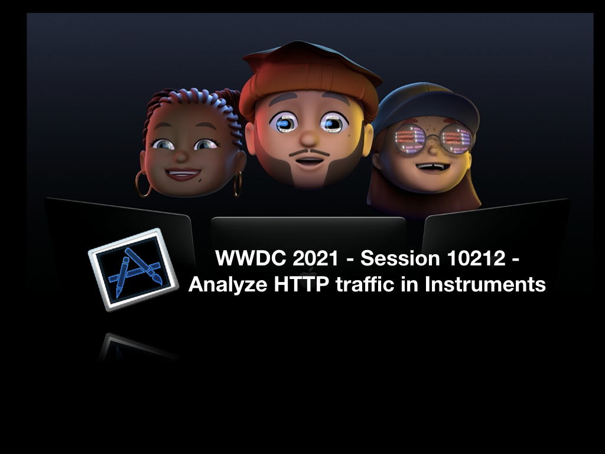

> WWDC21 - Session10212 - [Analyze HTTP traffic in Instruments](https://developer.apple.com/videos/play/wwdc2021/10212/)

### About Me
Hi 大家好，我是来自台湾的黄韦程，可以叫我 Frank，目前在上海抖音担任 iOS 开发，更多[关于我](https://blog.wchuang.cc/about/zh)可以到我的个人博客看看，欢迎互相关注加个好友。

### 标题
强大的 Network Instruments - 诊断你的 APP 网络请求及流量控管

### 文章简介
今年 WWDC21 苹果对内置的性能检测工具 Instruments 针对网络检测做了非常强大的升级，想了解如何使用 Instruments 检测并且分析你的 APP 网络流量及 HTTP 请求行为，十分推荐阅读这个 session！
