# Shortcuts in WWDC21

> 相关 Session：
>
> - 10232 - [Meet Shortcuts for macOS](https://developer.apple.com/videos/play/wwdc2021/10232/)
> - 10283 - [Design great actions for Shortcuts, Siri, and Suggestions](https://developer.apple.com/videos/play/wwdc2021/10283)

## 概述

在 Shortcuts iOS App 加入 Apple 大家庭几年后，今年的 WWDC 将 Shortcuts 搬上了 Mac。相比于 iOS，Mac 的自动化生态已经有了大家熟知的 Automator 和 Alfred。那么 Shortcuts 的加入，是互补？还是替代呢？在没有 Shortcuts 的年代，Mac 跨 app 交互基本靠 URL Scheme，Shortcuts 能带领我们到下一个时代吗？

> 校对注（@Mario1in）：
>
> 在这之前，其实 Shortcuts 一直都是一个不温不火的 topic，然而管中窥豹，我们还是能看出苹果可能默默在下的一盘大棋。
>
> 在《未来简史》这本书中，有提到过未来的一大趋势：高度自动化。我们回头来看 Shortcuts 干的事情，一是将解决用户痛点的 task 由原来的界面操作，变成了输入 input，到输出 output 的单线工作流；二是解决了不需要在多个 app 之间来回切换的情况下，实现了利用多个 app 来完成一系列需求的操作。
>
> 这两件事情的意义在于什么呢？可能现在看来，用 Shortcuts 干一件事，还不如我直接打开 app 操作来的快。这是因为目前人机交互的输入，主要还是靠人类最灵活的双手。然而这双手承载了我们生活中太多的职责，下一时代的智能设备，必然是可以解放双手的（例如万众期待的 Apple Glass），用户与设备的交互，必然也会发生巨大的转变，在那个时候，受限于输入方式，Shortcuts 或许就能发挥出巨大的作用了。

在 WWDC21 中，从以下几方面介绍了 Shortcuts：

1. Shortcuts for Mac 与相关更新
   1. Shortcuts app
   2. 在 action 方面的更新
   3. 如何发布与分享 shortcuts
   4. 对 Automator 与 Script 的兼容
   5. App 支持 shortcuts 的好处
2. Mac app 如何提供 Shortcuts action
   1. 如何创建 Shortcuts action
   2. 对于 Shortcuts action 运行平台需要注意哪些问题
3. 作为 App 开发者（iOS/macOS），应该如何设计 Shortcuts action
   1. 什么样的 action 才是好的 action，需要注意哪些方面

## Shortcuts for Mac 与相关更新

### Shortcuts App

在 macOS 上，整体的 Shortcuts UI 风格和 iOS 基本一致，并且可直接通过 iCloud 同步 iOS 上已有的 shortcuts。除了可以浏览以外，Shortcuts Editor 还可以创建自己的 shortcuts。相信无论是 iOS Shortcuts 用户，还是 Automator 用户，对这个界面都非常熟悉。并且，整个 Shortcuts app 基于 SwiftUI，降低了多端代码的维护成本。

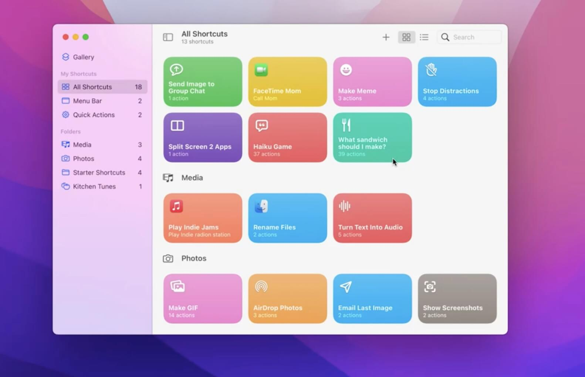

Shortcuts Editor 页面：

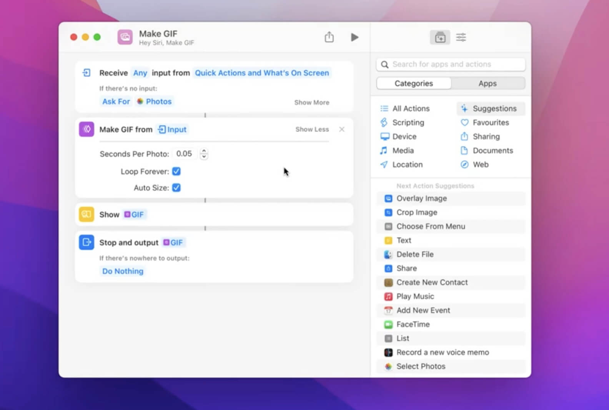

### 在 action 方面的更新

在 action 方面，今年加入了 Focus 和 Sound Recognition，也更新了文件相关的操作。除此之外，如果你的 app 以前适配了 SiriKit message intent，那么用户通过自定义 Send Message action 就可以直接使用 app 的这个能力。

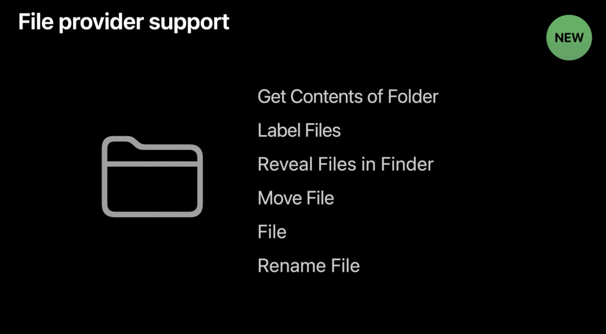

### 发布与分享

Shortcuts 可以通过 iCloud link 或者以文件的形式进行分享，私下共享可以采用 iMessage 分享给联系人，也可以存为个人备份。如果涉及用户数据（如照片浏览与编辑），Apple 会自动处理授权相关逻辑。

如下图所示，通过 iCloud 分享 shortcuts 会生成一个 iCloud link，这个 link 可以放在 app 官网或者其他地方方便用户下载。每个 shortcuts 以分享者 id 作为签名信息，如果需要重签可以使用 Shortcuts 命令行工具。

> 译者注（saitjr）：
>
> 每个公司内，都有不少平台和工具，但要打通这些平台的交互，成本可能比较高。在此之前，更多是通过 Alfred.workflow 共享一些常用的快捷方式。这不仅使用成本高（每个人都需要安装），而且维护成本也高（不便于升级和分享）。一个想法：在有了 Shortcuts 之后，是不是可以直接预装通用的 shortcuts？

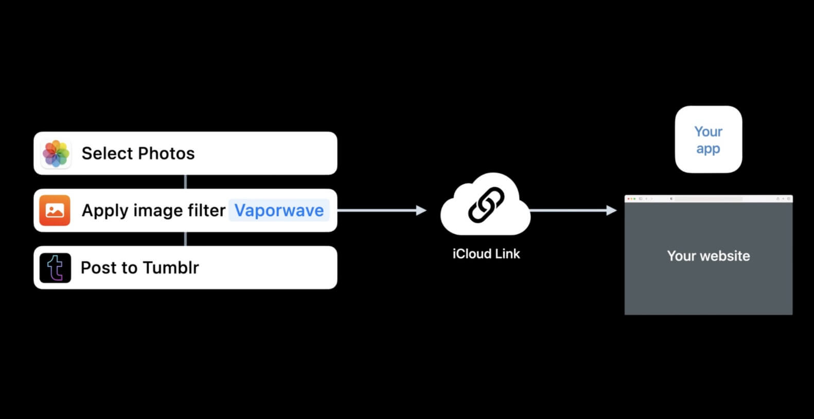

### 对 Automator 与 Script 的兼容

Shortcuts Editor 内置了 Script 编辑器，可以直接调试和运行脚本。

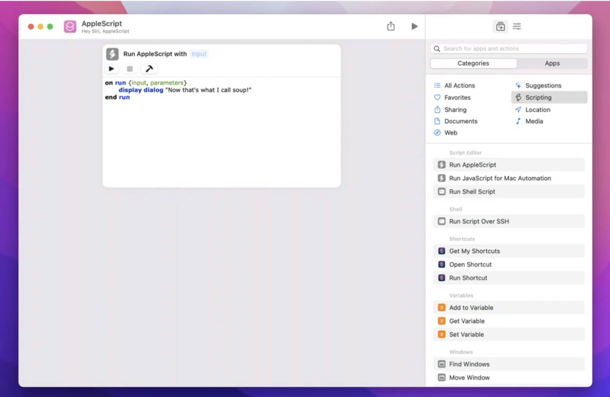

而对于老牌的 Automator，Session 中提到：虽然 Shortcuts 是未来，但 Apple 团队也将继续维护 Automator。所以 Automator 用户也不必担心。

在 Automator 到 Shortcuts 迁移方面，不得不说 Apple 团队的用心。整个迁移对用户来说几乎 0 成本：**直接用 Shortcuts 打开 Automator workflow 就可以完成迁移**。对于 Automator 所支持的 action，Shortcuts 也都做了适配，比如运行 AppleScript、文件管理等。

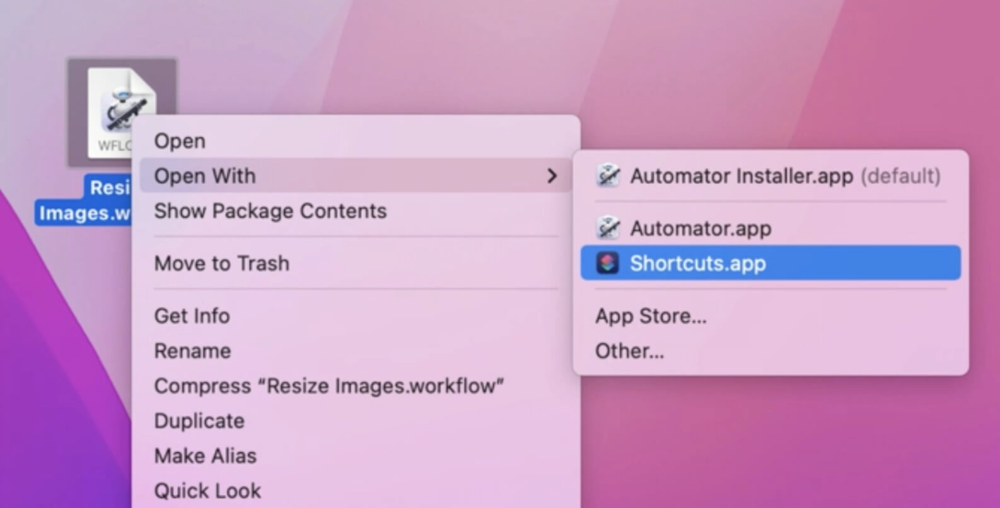

迁移过后的 UI 风格也基本一致，非常友好：

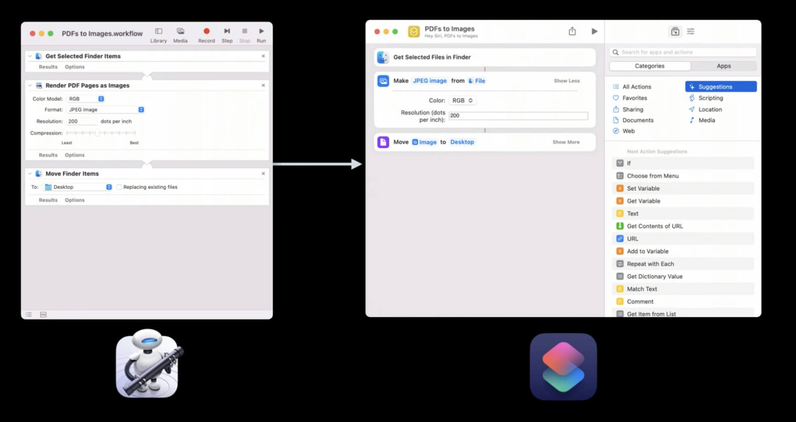

### App 支持 shortcuts 的好处

支持 shortcuts 以后，用户能使用这个 app 的场景明显变多了。以前用户只能打开 app 然后使用，现在可以菜单栏里面触发，通过键盘快捷键或者 Spotlight 触发，再或者通过 Finder 和 Siri 触发。这些都将是用户使用入口。

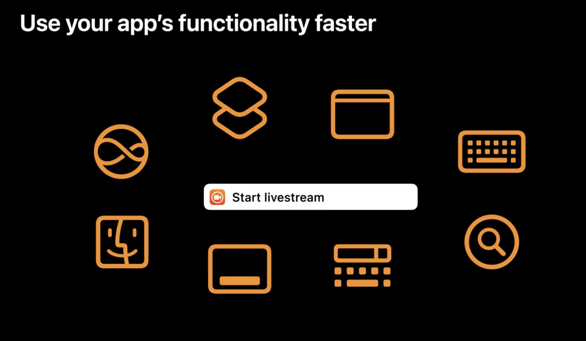

## Mac app 如何提供 Shortcuts action

### 创建 Shortcuts action

Session 用了 SuperTask app 作为案例，可以用来新增一些任务。每个任务由标题（title）、时间（due date）和链接（share link）组成。

Action 的设计就是名词和动词之间的组合（如下图）。作为开发者，我们可以将 action 看作一个一个函数，在设计时应当遵循相应的设计模式。比如 action 应该做到接口隔离，功能单一，这样用户的自定义程度才更高。**在提供 action 时，我们的目的不单是用户能用，更应该激发创造，让用户能融入自己的设计思路**。

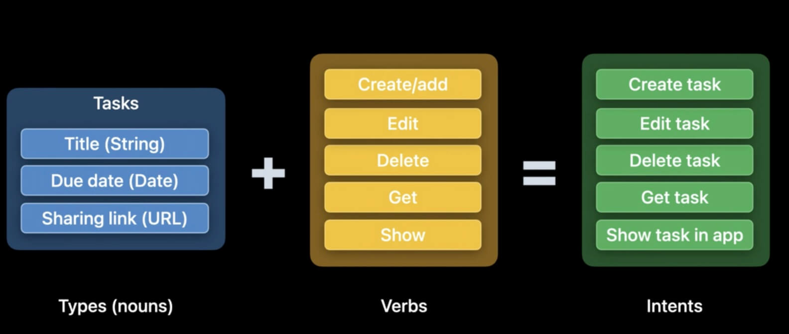

Intents 至少由三部分组成，1/2 可以通过可视化的配置文件生成（Intent Definition File），3 需要通过代码实现：

1. Types：即上图蓝色这部分。类似一个 Model，需要定义一个 action 都有哪些属性；
2. Intent：action 的定义，以及相关的输入和输出；
3. Handler：在用户触发 action 以后，应该如何处理。

#### 创建 Intent Definition File（Create intent definition file）

在 Xcode macOS Tab 下，搜索 intent definition 可以找到文件创建入口：

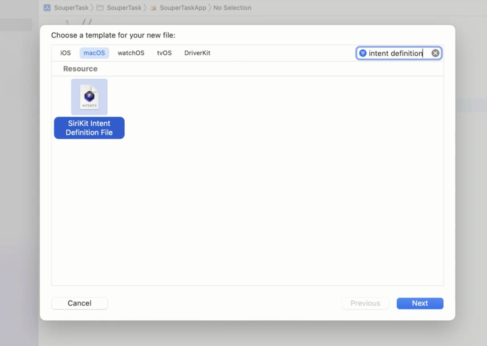

#### 定义 Intent（Define each intent）

首先创建 Types，并指定属性与对应的类型。其中，`identifier` 和 `displayString` 是默认属性，`displayString` 即 `title`，所以我们不用再创建 `title` 属性。只用新增 `dueDate` 和 `url` 即可。

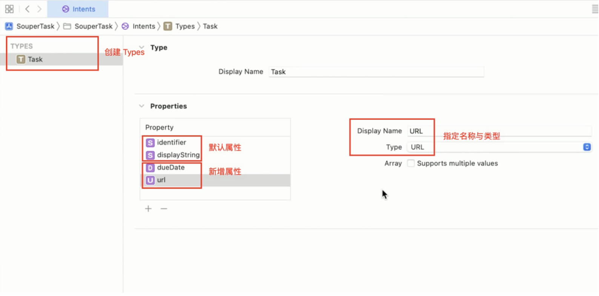

Types 定义完成后，接着需要创建可以提供的能力。比如，新增任务、删除任务、查看任务等。以下以新增任务为例，Intent 就像一个函数定义，包含名称和参数列表：

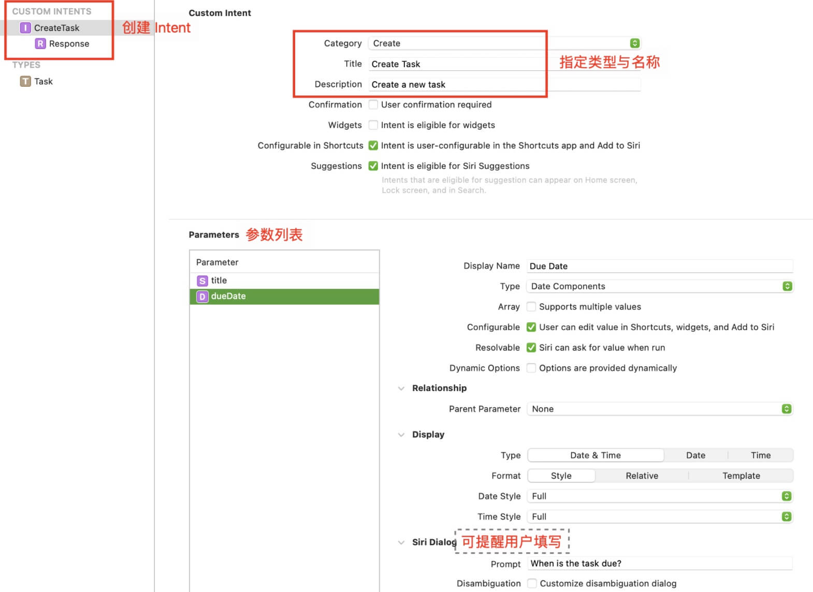

最后，指定入参和描述，就可以完成 Intent 创建了。上下游 action 通常会通过入参来进行连接，比如 Task 的标题可能是从剪切板复制过来的，又或是其他 action 处理完以后得到的。在指定 `title` 为入参以后，如果有输入，会自动赋值给 `title`。

在指定 Summary 时，可以将需要的参数作为占位，这样用户能更直观的看到需要的参数。

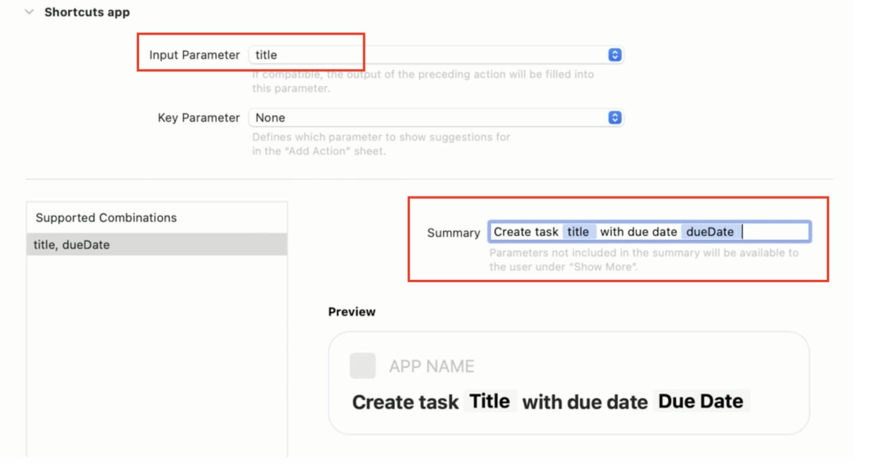

#### Xcode 生成对应的 Intent 类（Xcode generates intent classes）

执行编译，可以关注两部分信息：

1. 在编译日志中，Xcode 创建了 _Task.swift_ 和 _CreateTaskIntent.swift_ 文件；
2. 在 Shortcuts app 中，已经可以搜索到你的 Intent 了。

> 译者注（saitjr）：
>
> _Task.swift_ 和 _CreateTaskIntent.swift_ 这两个文件是根据可视化的 Intent Definition File 生成的。比如 Task.swift 就是对应的 Task Types 的类和相关的方法。在之后的代码编写中，Xcode 还能有代码提示，想必就和这个有关系。

Xcode 编译日志：

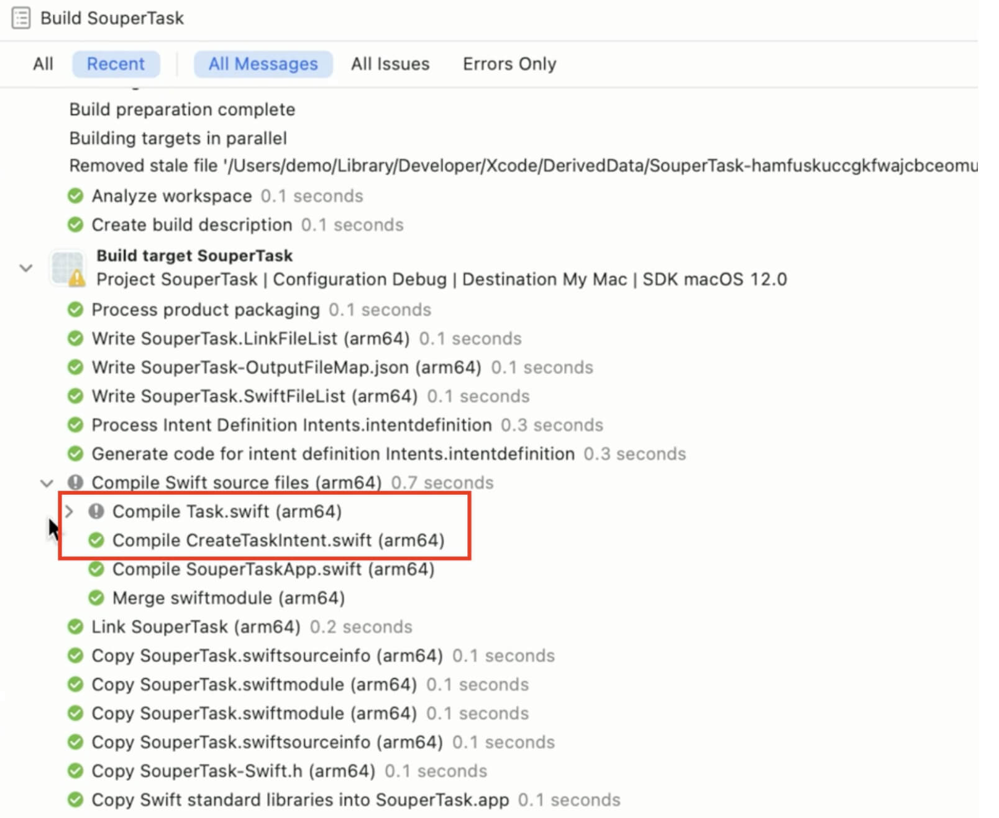

Shortcuts app 已经可以搜索到你的 Intent 了：

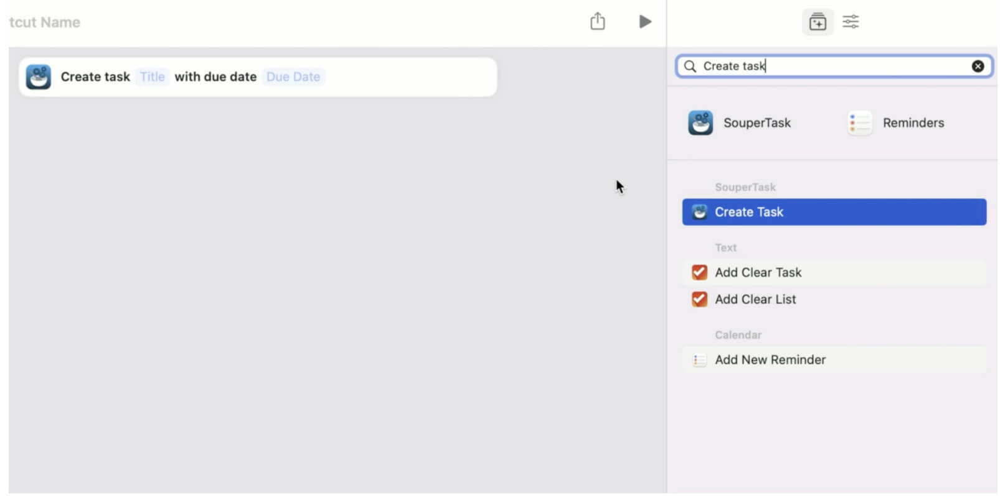

#### 处理 Intents 事件（Dispatch intents to handlers）

到此，我们就完成了 Intent 的定义，接着来看看如何响应用户的操作。

Apple 提供了 In-app 和 Intents Extension 两种响应方式。In-app 即主 App 来处理，事件将传递给 AppDelegate，在资源限制上更友好（比如资源访问或内存等限制）。而 Extension 更轻量，以独立进程去处理响应，不用唤醒 App。

In-app 事件响应通过 `application(_:handlerFor:)` 来实现，该接口是 macOS Monterey 新增的；而 Extension 通过继承 `INExtension` 并实现 `hander` 方法来处理。更多 In-App 和 Extension 的区别可以参考 [WWDC2020 Empower your intents](https://developer.apple.com/videos/play/wwdc2020/10073/)。

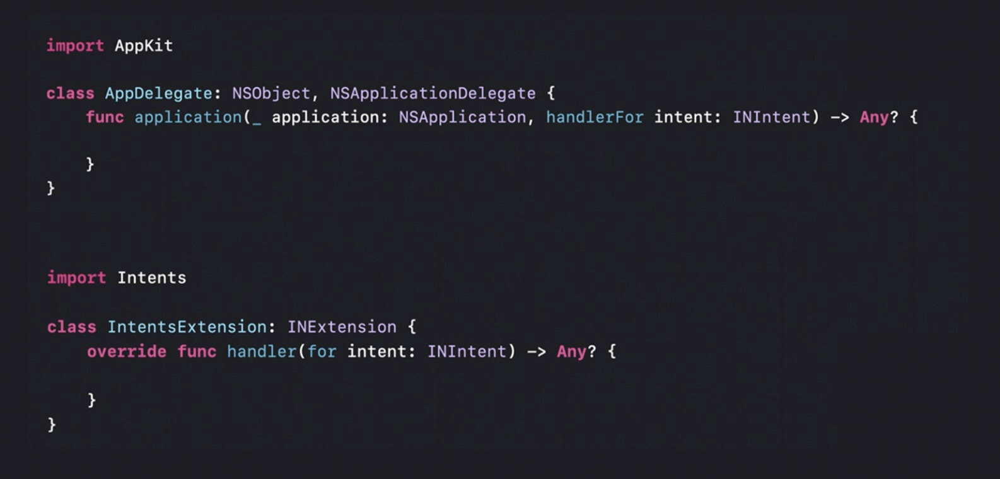

在实现相关方法后，我们在 App Target 中，关联这个 app 所支持的 Intents：

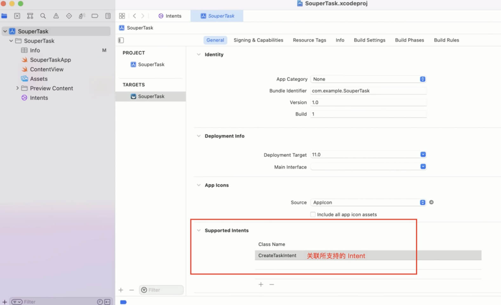

接着回到代码部分，创建 In-app 的事件响应：

1. 引入 Intents framework
2. 创建 AppDelegate，并实现 handlerForIntent 方法
3. 在 SwiftUI 生态中，还需要创建 delegate adaptor 关联 SwiftUI

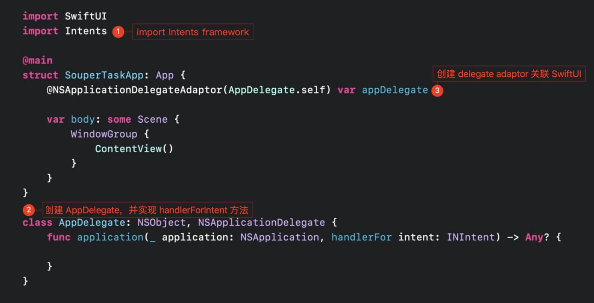

在前文我们完成编译后生成的 _CreateTaskIntent.swift_ 文件中，可以看到有名为 `CreateTaskIntentHandling` 的 protocol。用于响应事件的类，需要遵循这个 protocol。Protocol 以 Handling 结尾，比如 CreateTaskIntent 的 Protocol 就叫做 `CreateTaskIntentHandling`。

然后在 AppDelegate 中，判断收到的 Intent 事件，并返回对应的 `IntentHandler` 实例。

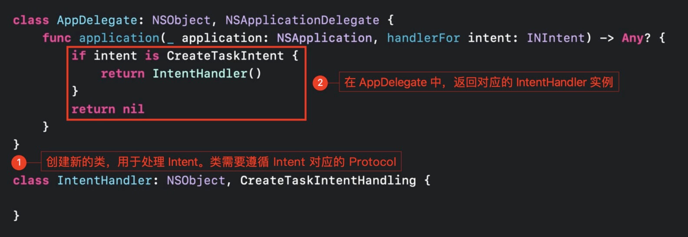

对于 `IntentHandler`，所遵循的 `CreateTaskIntentHandling` 提供了四类方法，分别是：

- Resolve：用于参数校验。我们可以给每个参数都提供一个 Resolve 方法。
- Provide Options：对于可枚举的选项，可以给用户提供一个动态的列表进行选择。
- Confirm：在执行 Handle 方法之前的再次确认，如网络环境是否正常等。
- Handle：实现具体的操作。

在 CreateTask 这个 Intent 中，有两个参数需要校验，分别是 `title` 和 `dueDate`，两者均不能为空。在实现时，通过返回 `.needsValue()` 来告知用户缺失参数。

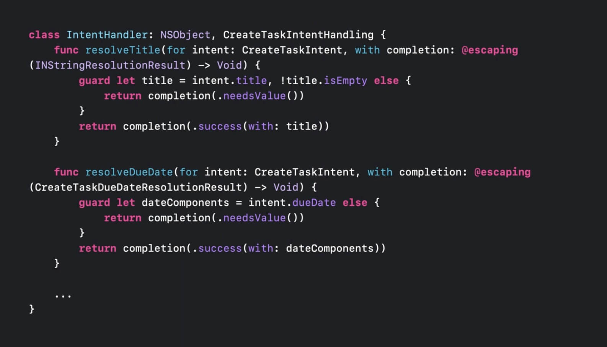

对于 `dueDate` 来说，除了不能为空以外，还需要指定时间必须是未来时间。对此，需要新建一个自定义 error 来提醒用户。回到 _Intents.intentdefinition_ 文件，给 `dueDate` 参数新增错误类型：

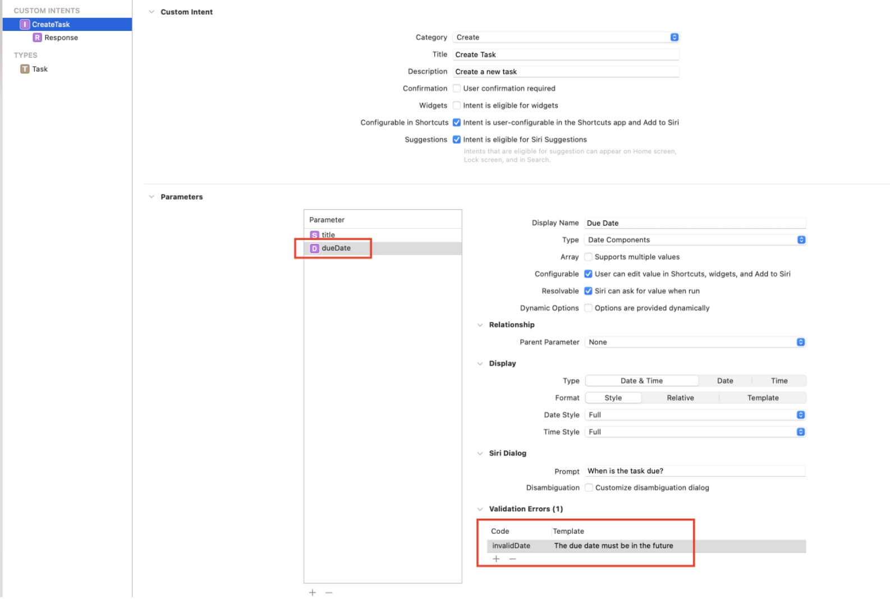

然后在 resolve 方法中，就可以判断 `dueDate`，然后返回指定错误了：

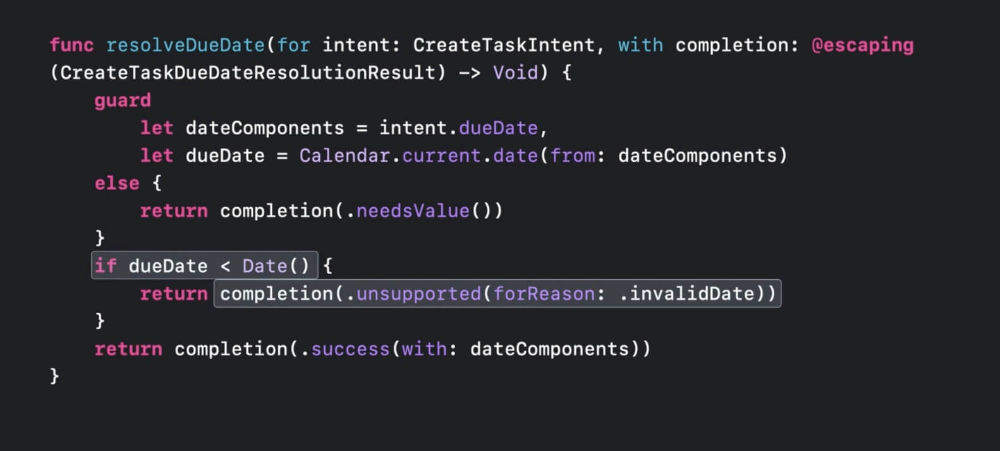

Provide Options 和 Confirm 这两个方法，大家可以根据自己的 Intents 需要来实现。在 CreateTask 这个 Intent 中，暂时不需要这两个步骤。接来下看看如何 Handle。

下面的代码片段除了调用 createTask 创建了任务以外，还实例化了 `CreateTaskIntentResponse` 提供输出。目的是为了给下一个流程提供输入，比如这里创建完任务以后，下一个 Intent 就可以利用这个结果，把任务分享出去。

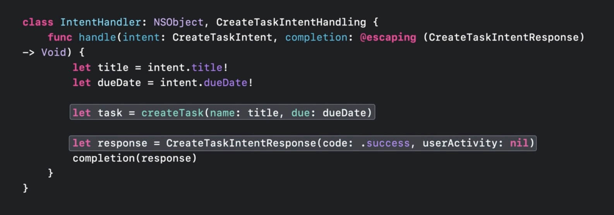

在实例化 `response` 后，需要给 `response` 新增要输出的属性。在本例中，`response` 需要输出一个任务对象：

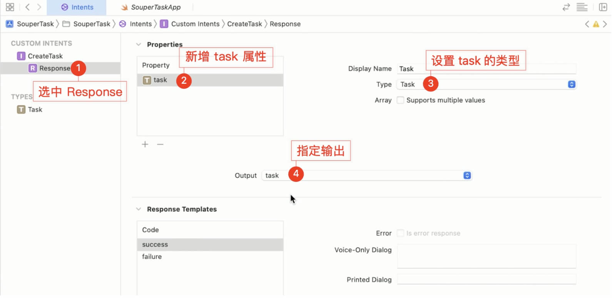

然后再回到代码中，将创建的 `task` 赋值给 `response.task`：

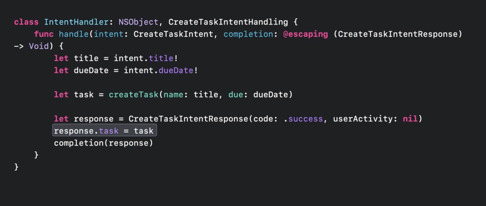

到此，就完成了 Intent 的创建和处理。最重要也是最容易忽视的一步：测试，记得尽量覆盖所有的用户场景 😜。测试可以在 Shortcuts app 中进行，比如用户可能输入一个不合法的 `dueDate`：

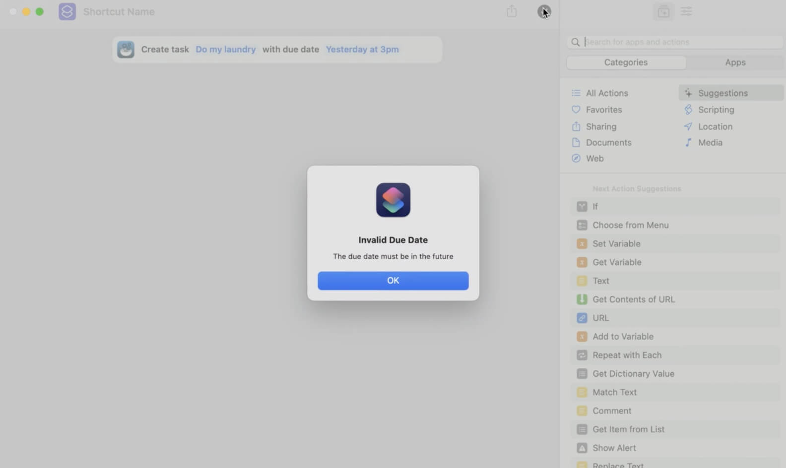

### 关于运行平台还需要注意的事

在开发 Shortcuts action 时，还需要注意和平台相关的事项。将会从四方面来进行介绍：

1. 通过 Mac Catalyst 移植的 Mac app（Apps built with Mac Catalyst）
2. 涉及文件操作的 app（Document-based apps）
3. 跨平台的 app（Cross-platform apps）（这里指的跨平台是 iOS/macOS，并非 iOS/Android）
4. 通过其他 app 或工具运行 shortcuts（Running a shortcut from your app or tool）

#### 通过 Mac Catalyst 移植的 Mac app（Apps built with Mac Catalyst）

如果采用 Mac Catalyst 构建 Mac app，在 macOS Monterey 下，已经可以直接用 iOS Intents API 去完成相关功能。在编译时，需要特别注意以下文件是否重新编译：

- Intents 和 IntentsUI Extension
- Intent Definitions
- 添加 Siri 按钮与相关 ViewController

#### 涉及文件操作的 app（Document-based apps）

虽然此前 Task 这个例子中，并不涉及文件操作。但实际上，很多 app 都是和文件相关的。在 iOS 15 和 macOS Monterey 中，intents 新增了 file 相关参数，运行用户选择特定文件到 actions 中。

如果 intents 是和文件操作相关的，记得尽量完整的覆盖相关操作。比如表格类的 app 就允许读取文件、新增数据到指定文件等操作。更多关于 Shortcuts 文件操作的例子，可以查看 [SoundAnalysis](https://developer.apple.com/videos/play/wwdc2021/10036/) 这个 Session。

#### 跨平台的 app（Cross-platform apps）

如果 app 既有 Mac 版本，又有 iOS 版本。可以分别在两个平台下编译相同的 intent definition 文件，以确保 intents 的名字和参数都相同，也能保证在多平台下，带来相同的体验。

即使 app 在 Mac 和 iOS 下有不同的 bundle id 也没关系，只要是同一个 Apple Developer team 下面，同名 intents 就可以共享。

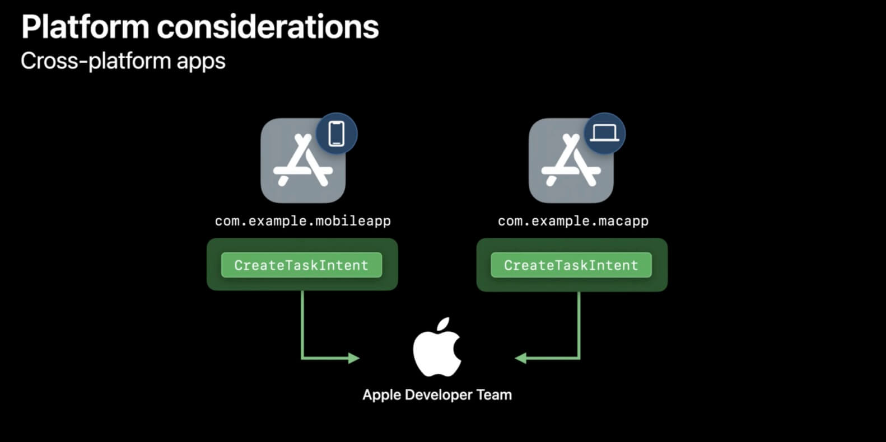

对于版本升级的 App 也是如此。在 iOS 15 中，只要是相同开发者，同名 intents 也会自动进行迁移。

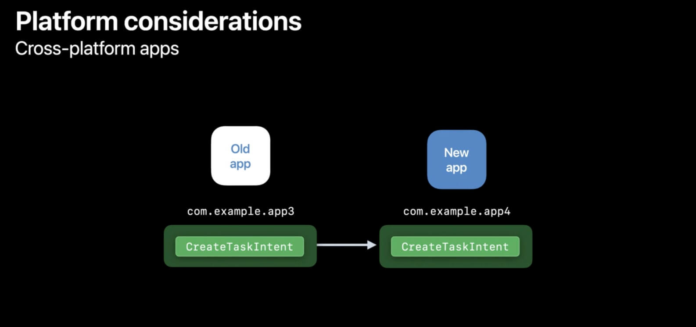

#### 通过其他 app 或工具运行 shortcuts

最后，我们来聊聊其他 app 或者命令行如何运行 shortcuts。Shortcuts 暴露了 scripting interface，所以 Mac app 和 AppleScript 可以调用相关接口查询和运行 shortcuts。除此之外，Apple 还提供了 Shortcuts 命令行工具，可以直接在命令行或者 Shell 脚本中运行 shortcuts。

AppleScript 访问方式（利用 Scripting Interface）：

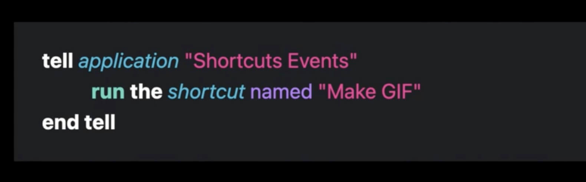

在 Swift/Objective-C app 中的访问方式（利用 Scripting Bridge）：

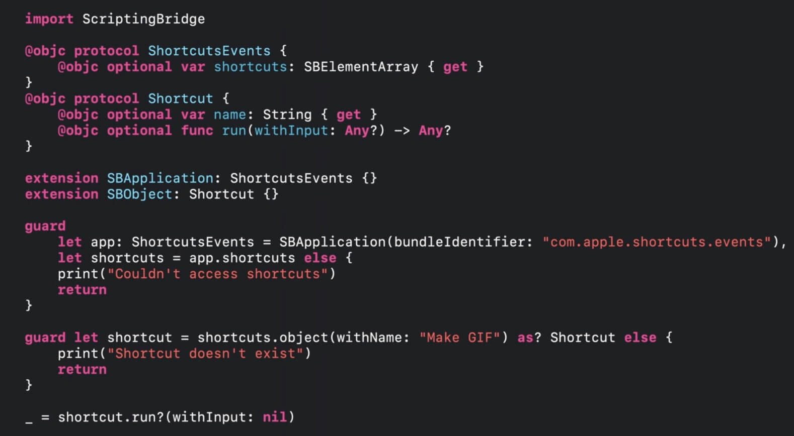

由于 App Sandbox 限制，还需要配置相关的 entitlements 才能正常访问和执行。

> 译者注（saitjr）：
>
> 这里提到的 App Sandbox 并不是 iOS Sandbox，而是 macOS 用来做权限访问控制的。详情可以参考 [App Sandbox Design Guide](https://developer.apple.com/library/archive/documentation/Security/Conceptual/AppSandboxDesignGuide/AboutAppSandbox/AboutAppSandbox.html#//apple_ref/doc/uid/TP40011183) 和 Entitlement Key Reference 中的 [Enabling App Sandbox](https://developer.apple.com/library/archive/documentation/Miscellaneous/Reference/EntitlementKeyReference/Chapters/EnablingAppSandbox.html#//apple_ref/doc/uid/TP40011195-CH4-SW5)。

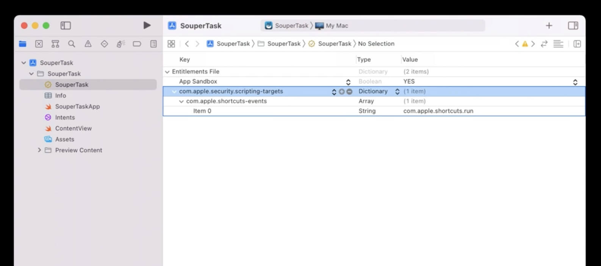

命令行中访问 shortcuts 的方式：

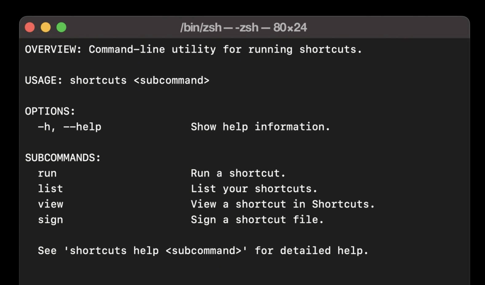

以上就是 Mac Shortcuts 的创建和使用。我们来回顾一下这一小节的内容：

- Shortcuts 的创建一共分 4 步
  - 创建 Intent Definition File
  - 定义 Intent，包括 Shortcuts 要用到的类型（如 Task），以及需要的事件（如 CreateTask）
  - 执行编译，在编译日志中会发现 Xcode 将 Intent Definition 生成了对应的类文件
  - 实现对应协议方法，响应 Intent 事件
- 关于运行平台
  - 通过 Mac Catalyst 移植的 Mac app，要注意以前的 iOS Intent 移植也正常
  - 在 iOS 15 和 macOS Monterey 中，支持了文件类型的 Type，可用于文件操作
  - 相同开发者的同名 Intent，Apple 已经为我们做了同步操作，无需担心
  - Shortcuts 可以通过 AppleScript、独立 app、命令行进行访问和执行

## 作为 app 开发者（iOS/macOS），应该如何设计 Shortcuts action

在之前的章节中，我们重点介绍了 macOS 下的 Shortcuts 内容。在这个小节中，将会讨论如何设计 Shortcuts action，什么样的 action 才是好的 action。

在设计 action 时，我们往往容易忽略很重要的一点：用户日常使用是打开 app 操作 UI，但使用 Shortcuts 时，用户甚至还没有打开你的 app。或许，我们应该换一种思考方式。

我们先来聊聊什么是 “action” —— Action 就是用户能用你的 app 做什么，换句话说，你的 app 提供什么能力给用户。我们拿日历 app 举例，思考一下用户打开日历通常想要做什么？新增日程？查看日程？变更日程？这些都非常适合作为 action，而这也是奇迹开始的地方。

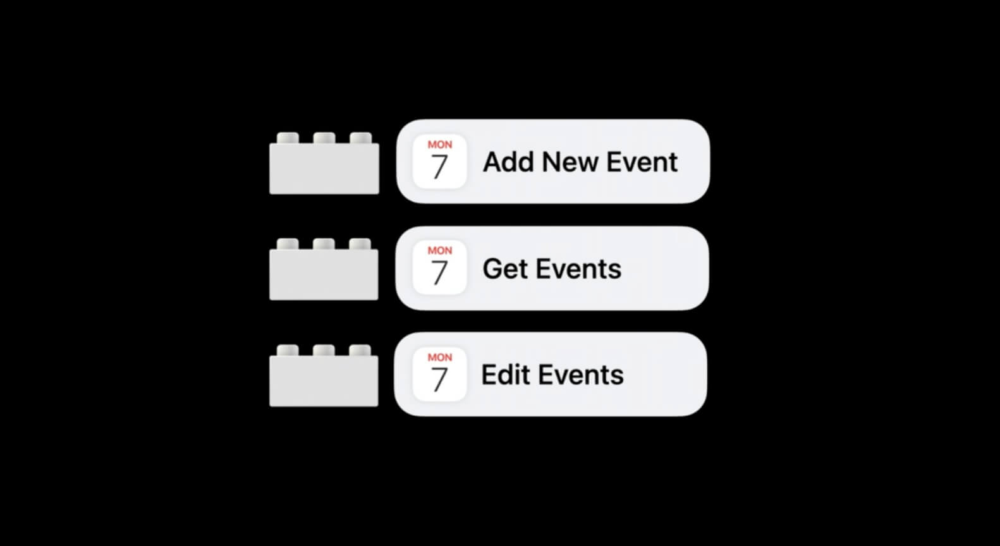

用户可以直接利用一个 action 生成 shortcuts，也可以将多个 action 进行组合，甚至还可以跨 app 进行组合。

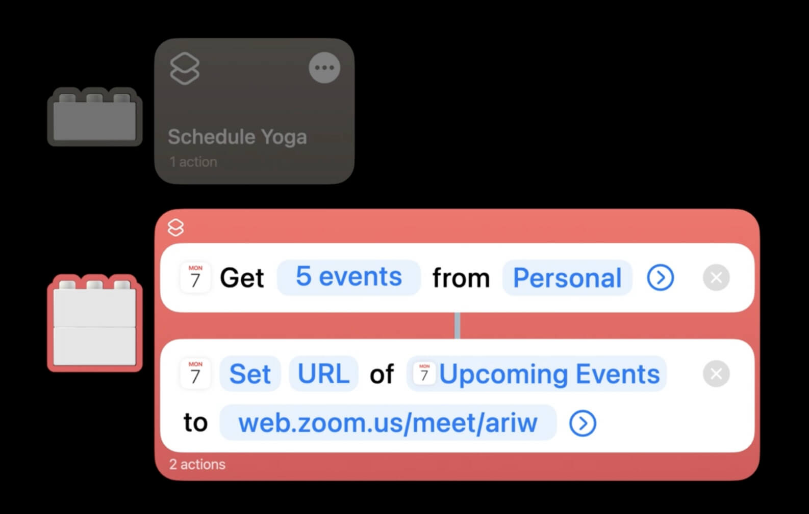

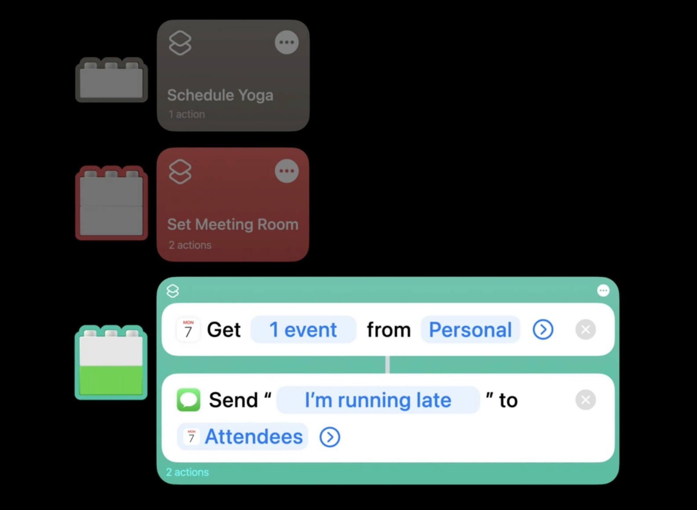

可以发现，仅仅是几个 action，用户就可以创造出成千上万个使用场景。在某种程度上来说，action 也升华了日历 app 的价值，让它不再局限于机械的对日程增删改查。

如果你的 app 提供了 action，即使用户没有在 Shortcuts 中使用到，系统也会根据用户行为在 Suggestions widget，搜索，或者锁屏页面自动推荐。如果用户使用 Siri 提到了 Shortcuts 的名称，系统就会唤醒对应的 action，并让用户输入必要的参数。这就以非常低的成本，让你的 app 支持了语音交互。

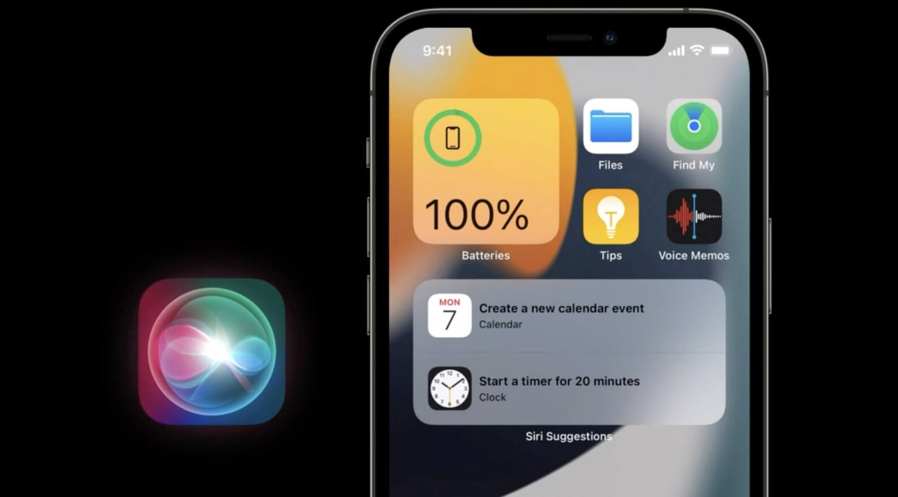

铺垫了那么多支持 action 的好处，那么我们进入正题：好的 action 应该具备哪些能力？

- 有用/易用（useful）
- 模块化（modular）
- 支持多种使用模式（multi-modal）
- 参数清晰明确（clear）
- 易被发现（discoverable）

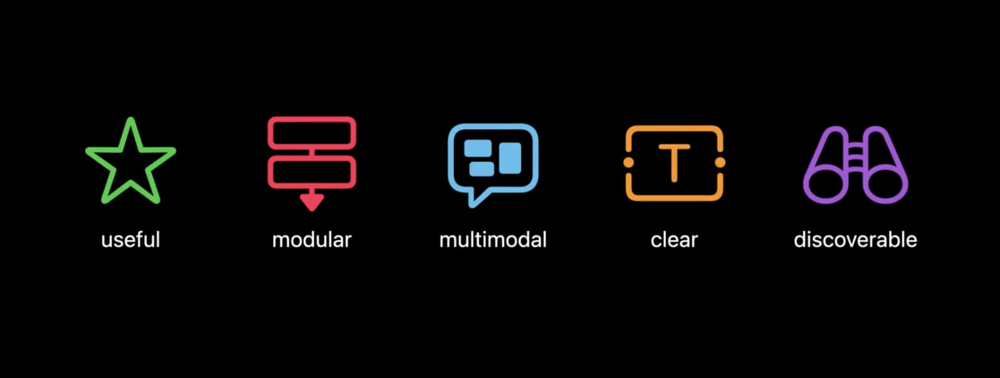

### 有用/易用（useful）

“有用”看起来像是一句废话，因为很难去衡量怎样算“有用”。在 Session 中给出了几个标准：

- Action 应包含用户在应用内常用的功能，比如日历 app，就提供了对日程的增删改查操作；
- 如无必要，尽量不要唤醒 app。如果需要新增输入，可以通过询问用户达到目的，而不是直接唤醒 app 让用户操作。

来看一个提醒事项 app（Reminder）的例子。新增提醒，就比打开一个特定的提醒列表这个 action 要更有价值。一方面新增提醒是一个高频操作，另一方面用户可以不必打开 app，不离开当前上下文就完成。而对于打开特定列表来说，就不可避免要唤醒 app，并且也不是那么常用。

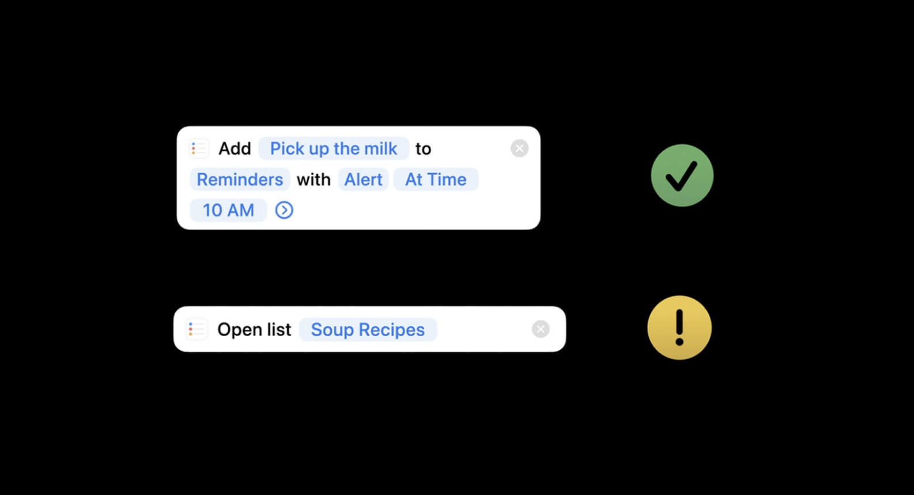

再回到新增提醒这个例子中，通常我们需要让用户输入提醒的内容。对此，上策是采用弹窗询问，而打开 app 让用户输入是下策。

当然，也不是所有 app 的所有功能都适合提供 action。评判标准在于功能是否足够简单，比如好呈现、好操作、所需要的参数或者上下文少。拿 Apple Watch app 举例，自定义表盘需要很多参数，也需要呈现一个 UI 给用户预览，这就不适合作为**一个** action。而切换已有的表盘，这个功能很简单，就可以作为**一个** action。

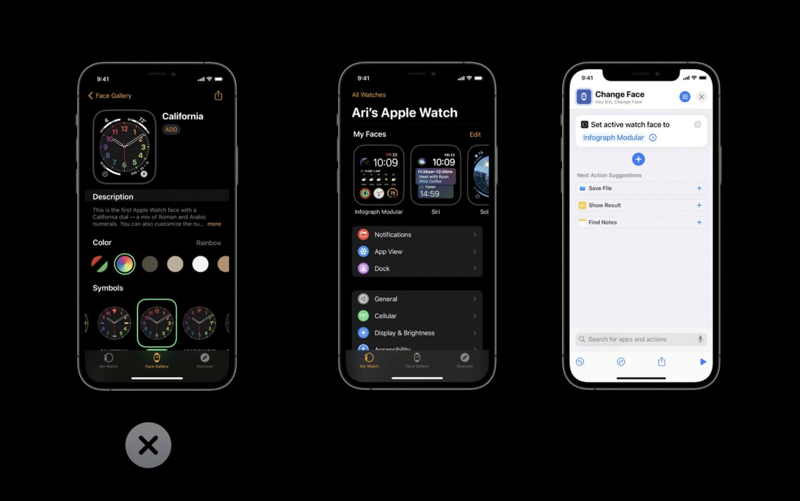

最后，再提一下使用频率的问题。使用频率高的功能肯定比频率低的功能更具备 useful 这个特性。虽然 Apple Music 里面的关注功能作为 action 也很棒，能一键关注多位用户，但相比起其他核心功能，比如听歌，就稍逊一筹了。所以，在时间有限的情况下，我们应当高优跟进高频功能。当然，如果时间充足，当我没说 🤭。

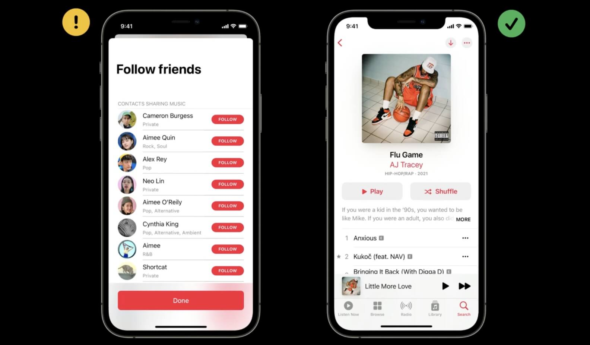

### 模块化（modular）

在 action 设计时，还有一个非常重要的标准：模块化。模块化程度将直接影响用户体验，也将直接影响创造力。Session 通过两个 app 举例，对比这两个 app 对 “清理历史任务” 这个 action 的设计。

> 笔者注：
>
> 模块化对于研发同学来说，应该并不陌生。这部分综合成一句话就是：单一职责。但当我们真正用这个原则来设计 action 时，小心陷入“道理我都懂”的困境。

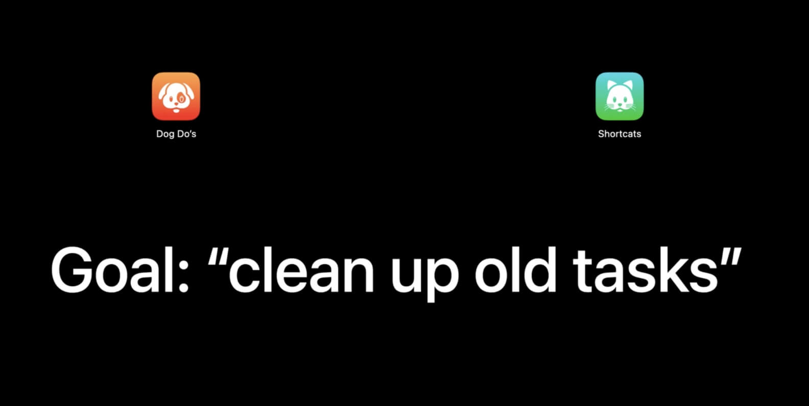

虽然是相同的目标，但两个 app 选择了不同的设计思路。Dog Do's 提供了一个大而全的 action，而 Shortcats 选择将 action 进行拆解。这不仅仅意味着他们创建 shortcuts 的方式不一样，接着往下看，就知道什么是谬以千里。

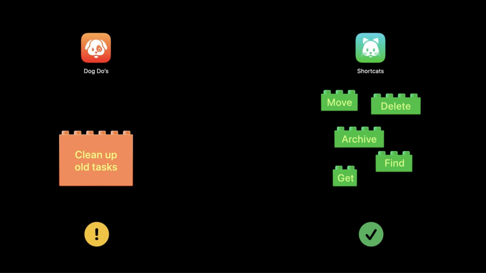

下图是针对 app 提供的 action 来创建 shortcuts 的方式。看似 Dog Do's 更简单，只需要一个 action 就行。但事实上，Shortcats 至少有以下优势：

- 上下文清晰：时间周期非常直观，获取的是一周前的任务；
- 参数可自定义：可以更改时间周期和时间类型，比如改为更新时间，而不是创建时间；
- Actions 之间可以排列组合：比如在获取到任务列表以后，还可以提供列表预览，让用户确认和选择是否要归档这些任务；
- 拥有更好的 Siri 建议：上一节提到即使用户没有创建对应的 shortcuts，Siri 也可以根据用户行为进行推荐。在这个例子中，Dog Do's 仅能推荐一个 action，而 Shortcats 的露脸机会就多了很多

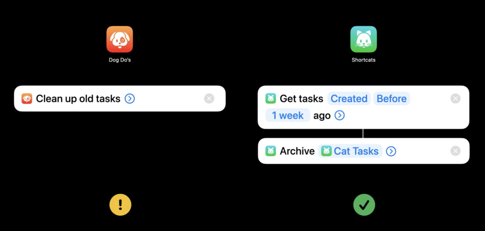

当我们引入其他 app 的 action 时，Shortcats 的模块化设计优势将更加明显。用户可以任意组合多个 app 的 action，这无疑是用户创造力的体现。

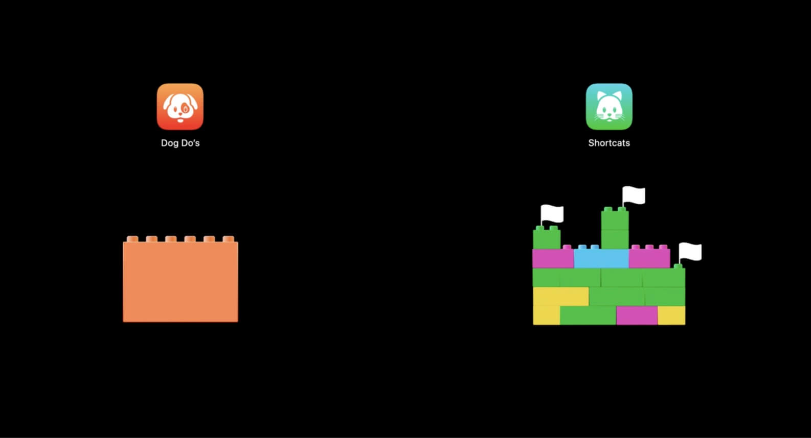

比如，在获取到两周前的任务列表以后，用户可以选择关联提醒、笔记等多个 action。Action 和 action 之间，采用 output/input 传递上下文。

同时，以前的归档 action 用户也可以换成别的能力，比如作为附件存储到 iCloud 中。

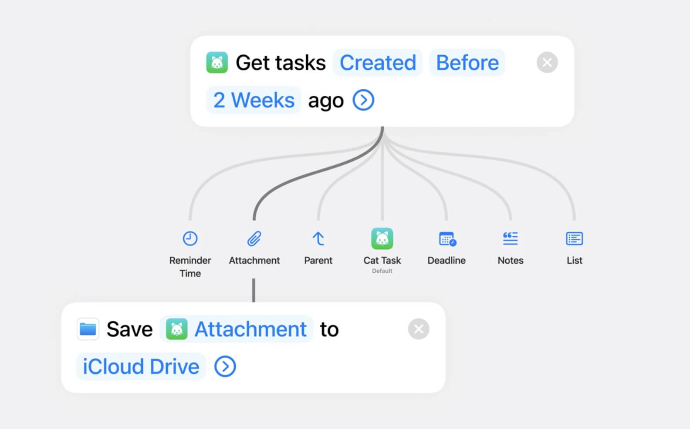

如果对输出类型进行拆分和标记，还可以在 Shortcuts Editor 编辑变量的时候找到他们：

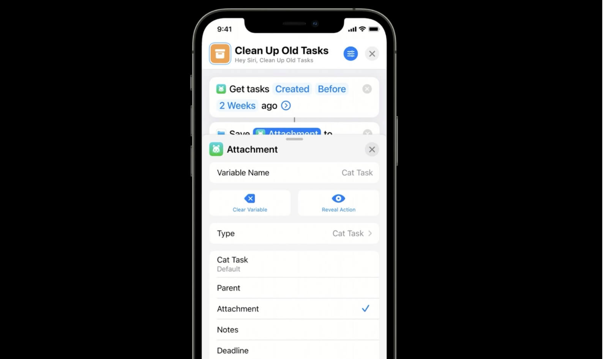

在设计 action 时，对实例（文件 app 操作文件、日历 app 操作日程等）的操作除了包含最基础的增删改查四个 action 以外，还需要包含：

- Thing：获取具体的实例，并支持预览和 output 输出
- Open：支持直接跳转到具体的实例，比如直接跳转到某个文件

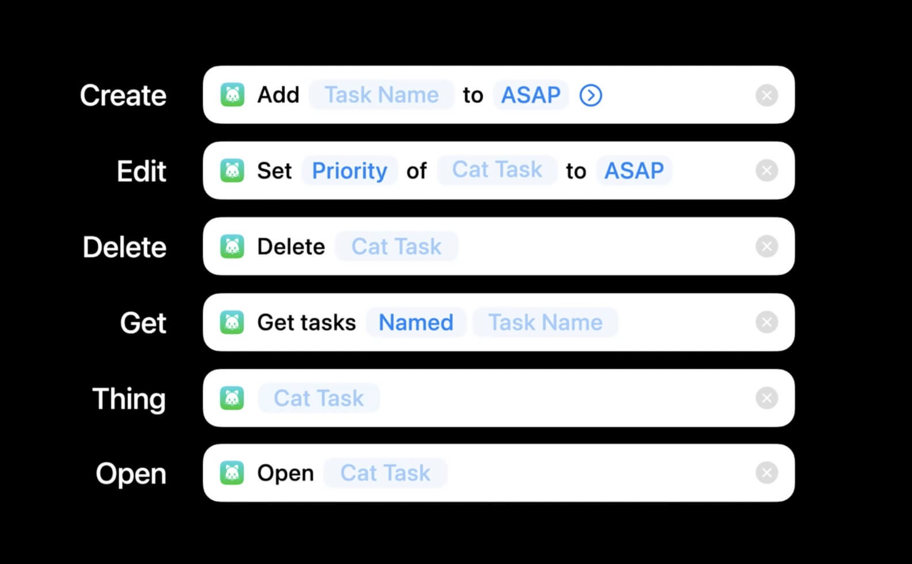

### 支持多种使用模式（multi-modal）

为了尽可能全的覆盖用户使用场景，每个 action 都应该支持以下三种模式：

- 通过 UI 触发：比如 Shortcuts app、菜单栏、Quick Action、Watch 等
- 通过 Siri 触发
- 可以在 Shortcuts 中进行编辑和运行

#### 通过 UI 触发

假设我们需要给 task 设置截止时间，点击 shortcuts 以后，应该提供日历让用户选择。

#### 通过 Siri 触发

同样是设置截止时间，假设是在 HomePod 的场景，Siri 会阅读提示语（如，什么时候截止），而用户通过语音告知明天或者下周二截止。

在提示语方面也要注意，弹窗和 HomePod 所用的提示语是一样。如果提示：什么时候截止。无论是弹窗还是 HomePod 语音对用户来说都非常明确。而仅仅提示“截止”两个字，在弹窗上看起来没问题，但 HomePod 念出来就有点摸不着头脑了。关于如何友好的和 Siri 交互，可以看这 [WWDC19: Designing great shortcuts](https://developer.apple.com/videos/play/wwdc2019/806/) 和 [WWDC20: Evaluate and optimize voice interaction for your app](https://developer.apple.com/videos/play/wwdc2020/10071/) 这两个 Session。

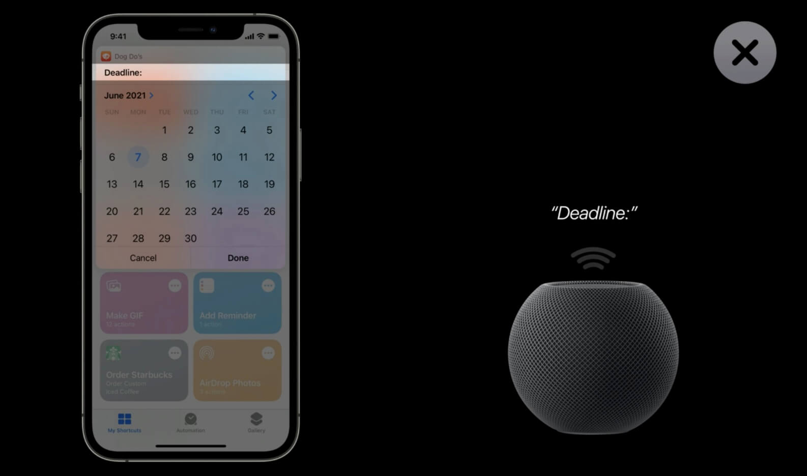

#### 在 Shortcuts 中进行编辑

在 Shortcuts Editor 中，蓝色矩形就是 action 对应的参数。在编辑 action 可以看到，每个参数都应该有对应的类型。如果你的类型不是系统内置的，也可以进行自定义。

比如 Set Playback Destination 这个 action，这是用于设置音频输出的 action，用户可以选择用 AirPods 还是 Bluetooth Speaker。为了让用户明确自己所选的设备，在点击参数时，提供了每个设备的 icon 和名称用于选择，这个类型就不是系统内置的。

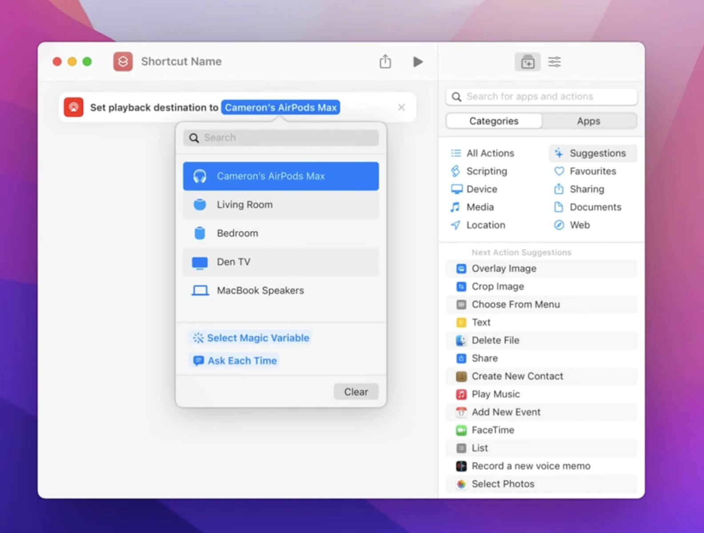

我们把这个称为动态枚举（Dynamic Enumerations），你也可以创建自己的动态枚举。用户使用动态枚举的场景通常有两处：

- Configuration：即用户在 Shortcuts Editor 中配置 shortcuts 点击变量的时候（左图）
- Resolution：用户在使用 shortcuts 的时候（右图）

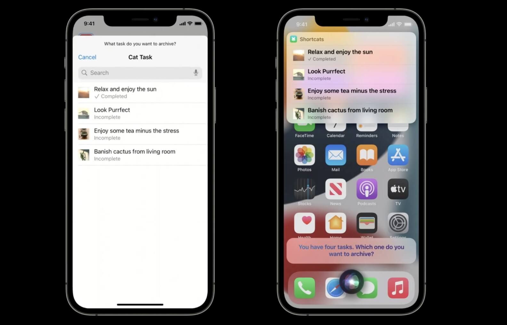

最后，我们再回到 UI 弹窗来看看。在用户运行 action 的时候，可以提供一些自定义页面，我们称之为 “snippets”。对于无法更改的操作（通常是一些写入操作，如下单、删除），我们应该有一个页面来告知用户是否要处理这些数据，而不是等处理完以后再告诉用户处理了这些数据。

### 参数清晰明确（clear）

在这一小节，让我们专注 Shortcuts Editor 中 action 的设计。在 iOS 13 的时候，Apple 建议 action 的描述应当更加语义化，更加贴近日常描述。今年在 UI 上作出了些许优化，省略了 action 对应的 app 名称，在换行上也有些改动。这使得一个 action 卡片被压缩得更窄，那么一屏就可以展示更多的 action。

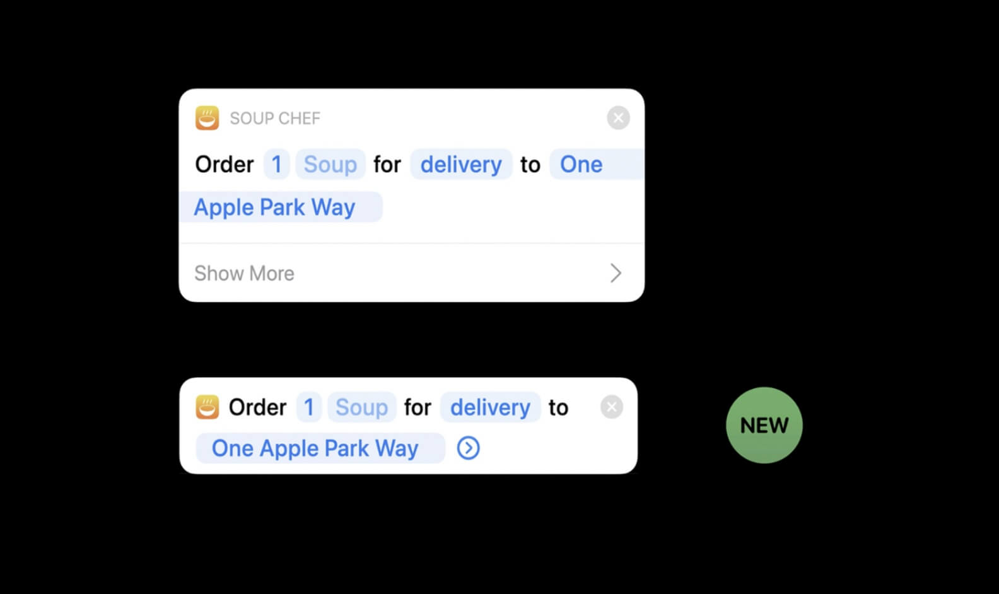

在编辑 shortcuts 的时候可以看到，action title 和 parameter summary 是不一样的。Action title 是每个 action 的标识，而 parameter summary 则应该尽可能语义化，提供更多信息给用户。不过，action title 最好能和 parameter summary 以相同的动词开头，这样更加优雅。

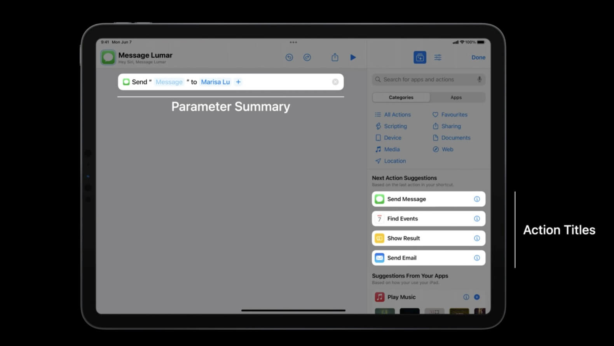

下面是一个更详细的例子。Awebreath 是一个呼吸训练的 app，设置时长以后，会提供一个 UI 和音乐来帮助集中注意力。Parameter summary 的设计需要注意：

- 简明扼要的描述，并且包含最为重要的几个参数
- 以动词开头，更贴近日常描述，但尽量不要有标点符号
- 不要包含非必填的参数，比如是否播放音乐是可选参数，就应该折叠到箭头按钮里面
- 必填参数一定做好校验，必要时提醒用户输入，某些场景下可以提供默认值

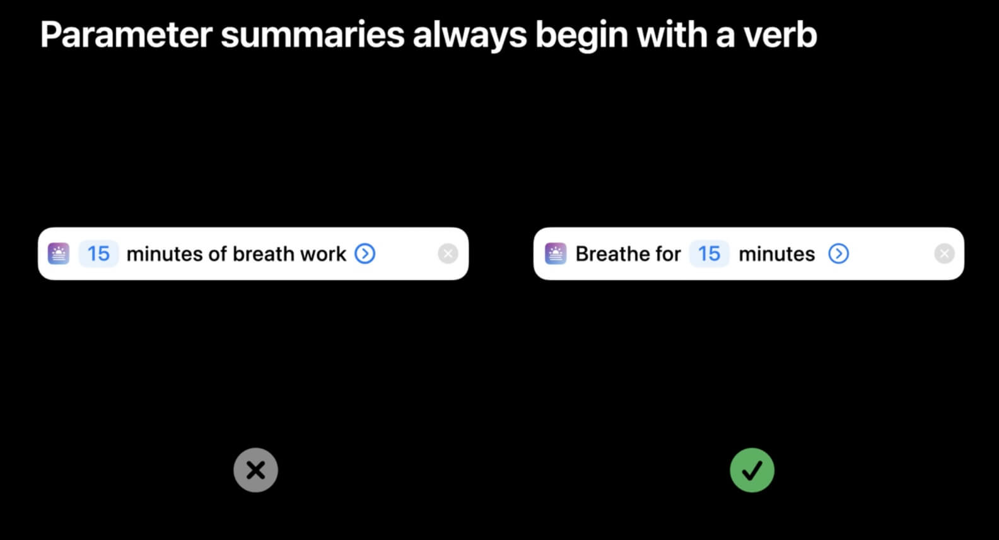

无论是可选参数，还是必填参数，用户均可以使用 “Ask Each Time” 每次都进行询问。所以，记得确保每个参数都要有对应提示语。

### 易被发现（discoverable）

酒香也怕巷子深，能被大家发现或者分享也很重要。在 iOS 15 和 macOS Monterey，新增了 shortcuts 生成 iCloud 链接和分享功能，并且在打开 shortcuts 时，还会告知用户可以在哪些场景下使用（右图）。作为开发者，你可以将链接分享到社交平台、app 的 help 页面等，方便大家查阅。

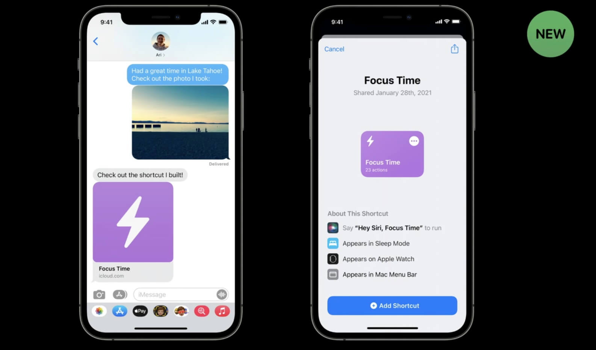

如果用户选择添加到 Siri，会告知用户应该以什么语句唤醒 shortcuts。当然，这个前提是 action 提供了 suggested invocation phrase。如果未提供，会让用户自己输入唤醒语句。

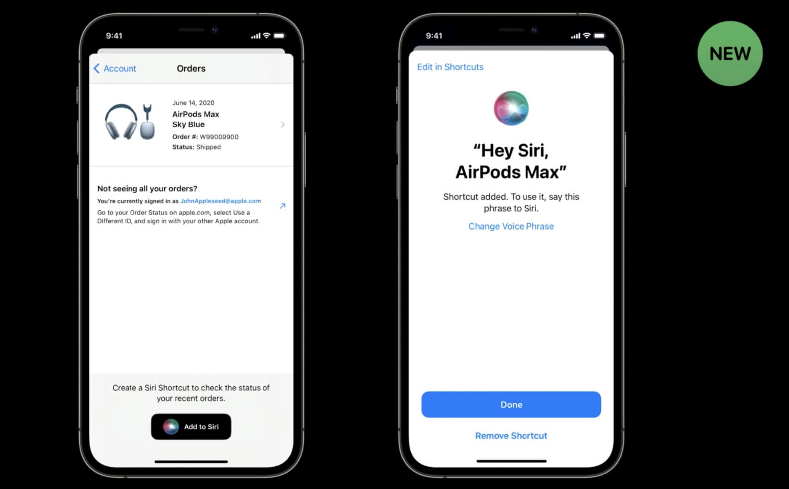

以上，就是关于 Shortcuts 设计的全部内容，让我们最后再回顾一下好的 action 应具备的能力：

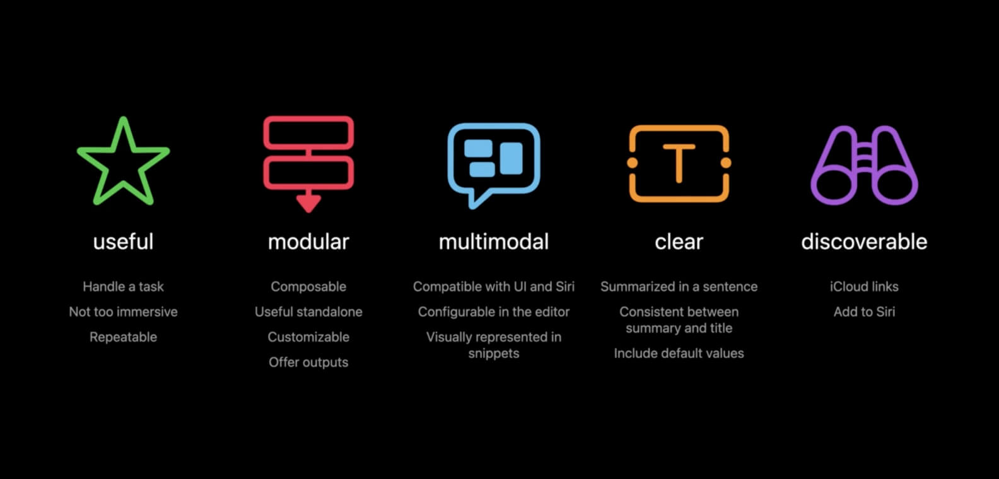

## 总结

通过这两个 Session 的介绍，相信大家对此次 Shortcuts 的新特性、Mac app 如何支持 Shortcuts 以及如何设计好的 action 有了不错的理解。为了加深印象，我们做一下小结。这两个 Session 从三方面介绍了 Shortcuts：

- Shortcuts for Mac 与相关更新
  - Shortcuts app 搬上了 Mac，整体设计风格还是熟悉的味道
  - 这次系统 app 的 action，带来了 Focus、Sound Recognition、File 相关更新
  - Shortcuts 的共享也更加方便了，可以通过链接、文件等形式分享
  - 在兼容性方面，通过 Shortcuts 打开以前的 Automator 产物就可以完成 Automator 到 Shortcuts 的迁移
- 如何给 Mac app 新增 Shortcuts 支持
  - 创建 Shortcuts action 分 4 步
    - 创建 Intent Definition File
    - 定义 Intent，包括 Shortcuts 要用到的类型（如 Task），以及需要的事件（如 CreateTask）
    - 执行编译，在编译日志中会发现 Xcode 将 Intent Definition 生成了对应的类文件
    - 实现对应协议方法，响应 Intent 事件
  - 关于运行平台
    - 通过 Mac Catalyst 移植的 Mac app，要注意以前的 iOS Intent 移植也正常
    - 在 iOS 15 和 macOS Monterey 中，支持了文件类型的 Type，可用于文件操作
    - 相同开发者的同名 Intent，Apple 已经为我们做了同步操作，无需担心
    - Shortcuts 可以通过 AppleScript、独立 app、命令行进行访问和执行
- 作为 app 开发者（iOS/macOS），应该如何设计 Shortcuts action
  - 有用/易用
    - Action 应包含用户在应用内常用的功能，比如日历 app，就提供了对日程的增删改查操作
    - 如无必要，尽量不要唤醒 app。如果需要新增输入，可以通过询问用户达到目的，而不是直接唤醒 app 让用户操作
  - 模块化
    - 模块化有诸多优点，比如上下文更清晰、参数可自定义、功能之间可以自由排列组合、方便关联其他 app 等
    - 操作实例时，至少要提供增、删、改、查、选中特定实例、打开实例这几个能力
  - 支持多种使用模式
    - 通过 UI 触发：比如 Shortcuts app、菜单栏、Quick Action、Watch 等
    - 通过 Siri 触发：注意提示语的合理性
    - 可以在 Shortcuts 中进行编辑和运行
  - 参数清晰明确
    - Parameter summary 应该以动词开头
    - 应该更加语义化，贴近日常沟通
    - 可选参数不要强制要求用户填写，降低用户使用成本
  - 易被发现
    - 注意用好 shortcuts 的分享功能
