# WWDC21 10259 - 键盘布局指南

基于 [Session 10259](https://developer.apple.com/videos/play/wwdc2021/10259) 梳理

为了充分理解本 session，建议对 Auto Layout 和 UILayoutGuide 有一定的了解。本文将讲解键盘在 iOS 或 iPadOS 应用程序中的工作方式，以及如何使用 UIKeyboardLayoutGuide 和 UITrackingLayoutGuide 以精简的代码集成键盘到界面中去，从而帮助用户在应用程序中使用屏幕键盘时获得更流畅、更愉快的体验。

[TOC]

## 布局指南 Layout guide

### 以往的键盘使用方式

自古以来，键盘的使用方式是注册通知、从通知中的信息得出适当的偏移量并做动画、做一定的数学运算，最后再调整键盘的布局等等。

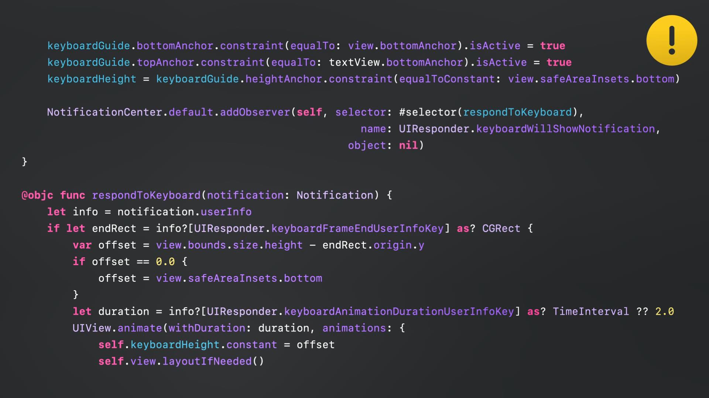

如上图的代码所示，通过创建自定义 anchor 和约束来响应通知。然后，注册相应的通知。通常，至少会有 willShow 和 willHide 等时机的通知事件。然后，将通过从通知中获取的信息来响应特定的通知，做相应的布局调整。

### 全新的 UIKeyboardLayoutGuide 

UIKeyboardLayoutGuide 是 iOS15 新增的一种布局方式。LayoutGuide 是一种在布局中表示空间而不使用视图的方法。UIKeyboardLayoutGuide 将在你的应用程序中代表键盘所占的位置。

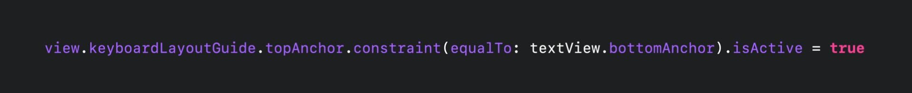

如上图代码所示，将 LayoutGuide 更改为 UIKeyboardLayoutGuide  后，不再需要注册通知及其响应事件的处理。所有的代码都归结为这一行。除了本地化不同以外，其它几乎是一样的。

#### 基本用法

1. 使用 `view.keyboardLayoutGuide`

2. 使用 `.topAnchor` 就能实现基本的功能

#### 优点

1. UIKeyboardLayoutGuide 与键盘的动画不冲突

2. 键盘高度的变化也能自动适配。

3. 键盘不固定时，底部安全区域的 safeAreaInsets 也不必担心了。

## 键盘集成 Integrating the keyboard

不要抵触或避免使用键盘布局，因为键盘也是应用程序布局的一部分。

### followsUndockeyBoard 属性

可以利用 UlKeyboardLayoutGuide 的一个新属性：followsUndockeyBoard。默认情况下为 false，但如果将其设置为 true，则当键盘浮动时，LayoutGuide 将跟随键盘并响应键盘所在位置的布局。另外，键盘不会再自动下降到底部。取消停靠时，也将不再侦听键盘隐藏的通知。LayoutGuide 设置键盘在哪个位置，键盘就在哪个位置。这意味着你必须更加清楚自己的布局是如何响应不同类型的键盘的。

### UITrackingLayoutGuide

UIKeyboardLayoutGuide 是 UITrackingLayoutGuide 的子类。我们称之为跟踪布局指南，是因为它跟踪那些在屏幕上移动时要更改的约束。开发者可以为其指定一个约束数组，该数组在靠近特定边时激活，离开时停用；或者指定约束数组在远离特定边时激活，靠近边时停用。

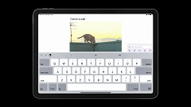

举个例子：

现在有一个需要实现如上图所示功能的测试程序。其中，当带有文本字段和控件的视图接近屏幕顶部时，它能降到底部而不是离开屏幕。而且，当键盘左右移动时，希望其他的图片移动一点，给它多一点空间。

那么，这一切是如何完成的呢？

其中，editView 是带有文本字段和控件的视图，imageView 是图像视图。

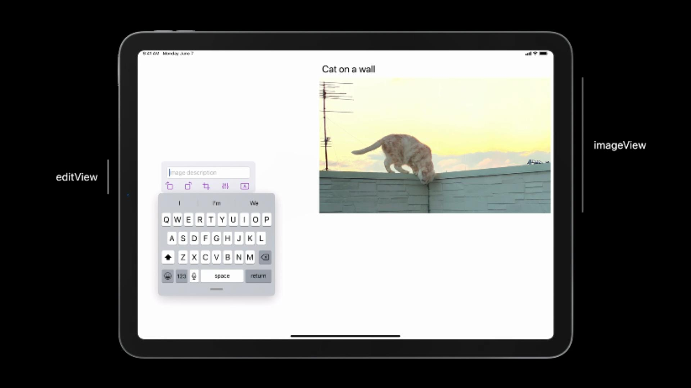

我们来看看代码，是如何实现 editView 接近屏幕顶部时，它能降到底部而不是离开屏幕的。

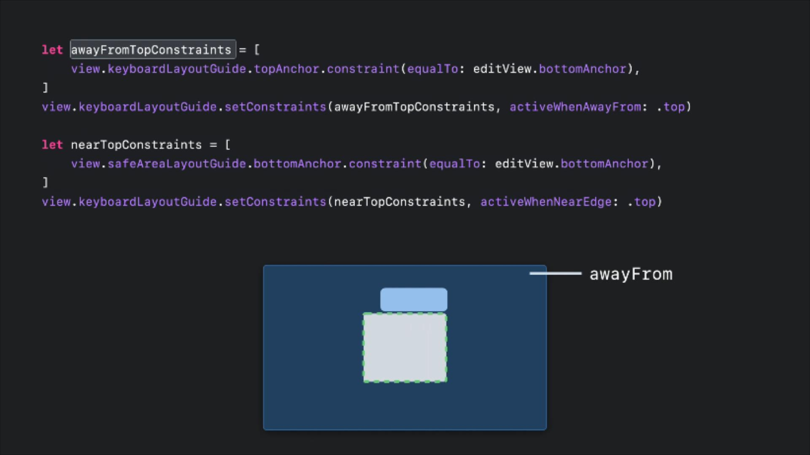

首先，我们定义一个数组，将 editView 的底部绑定到 keyboardLayoutGuide 的顶部。然后，我们将它们设置为仅当远离顶部时才处于激活状态，也就是靠近顶部时将被停用。

然后，我们定义一个单独的约束数组，当键盘接近视图顶部时，我们需要安全区域的底部约束生效。

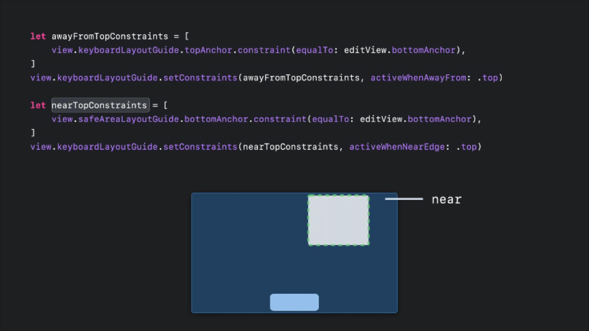

当将 editView 移近顶部时，awayFromTopConstraints 将被停用，而 nearTopConstraints 将被激活，并将键盘下拉到视图的底部。远离顶端时，情况正好相反。

接下来，让我们看看当键盘左右移动时，是如何实现让图片移动的。

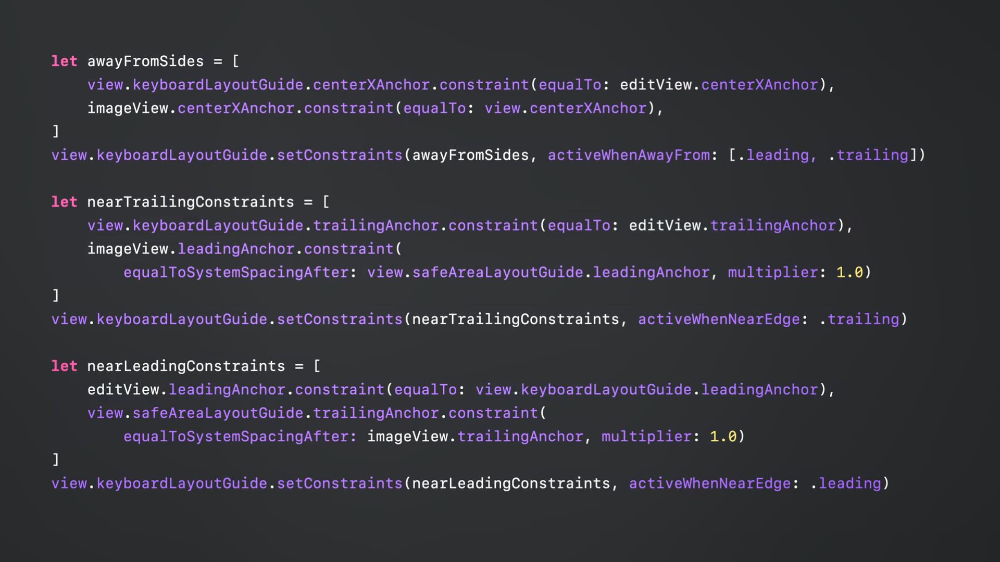

当键盘在 trailing 时，希望 editView 移到 trailing，然后让 imageView 稍微远离键盘。所以，当键盘靠近边缘的时候，把 imageView 从中心移到键盘的另一边，当键盘在 trailing 时，imageView 就变成了 leading，反之亦然。

当我们左右移动时，刚才提到的调整就会发生了。

### 键盘布局的“near”和“awayFrom”

原先的固定键盘被认为是靠近（near）底部，远离（awayFrom）其他的边。

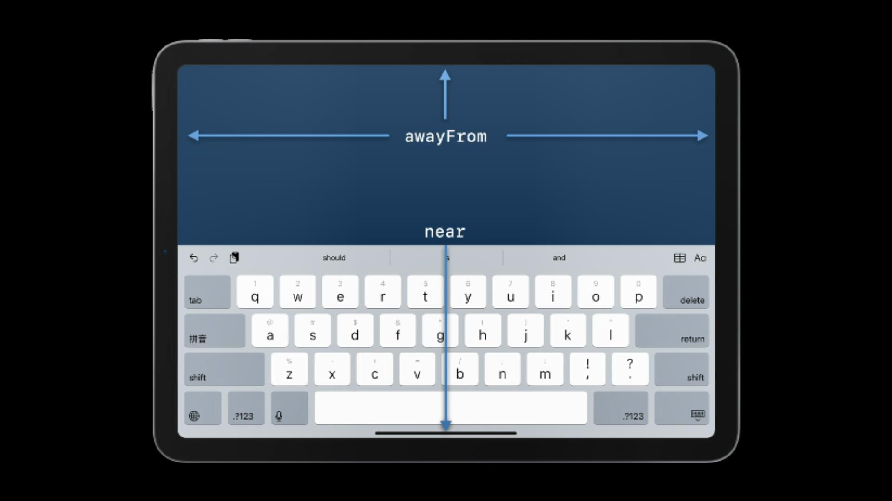

不固定的键盘可以远离（awayFrom）所有的边，也可以靠近（near）顶部边缘。

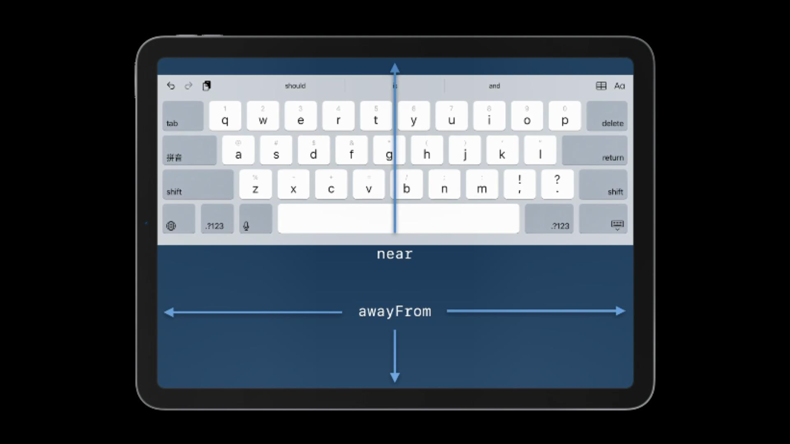

当它是浮动键盘时，它可以靠近（near）或远离（awayFrom）任何的边，甚至可以同时靠近（near）两个相邻的边。

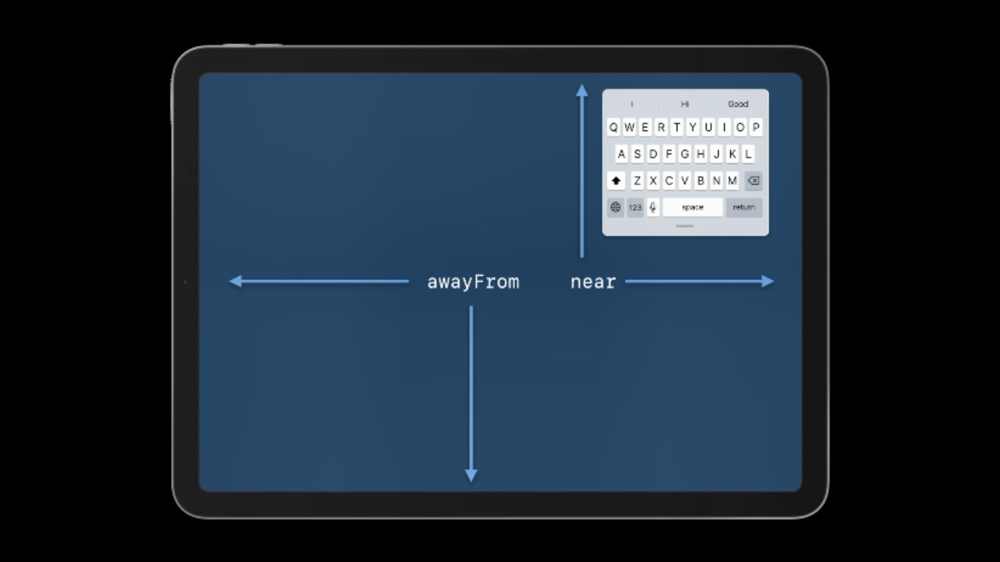

以上所有这些情形，都只适用于将 followsUndockeyBoard 属性设置为 true 的情况。而且在接下来的讨论中，这也是所有假设的前提。

## 不同场景的键盘类型 Types of keyboard

### 非固定键盘 Undocked Keyboard

当你选择使用非固定的键盘时，在设计布局时应该注意以下几个方面：

1. 永远记住，浮动的键盘可以远离（awayFrom）任何东西。
2. 当键盘远离（awayFrom）底部边缘或靠近（near）顶部边缘时，会发生什么情况？你需要注意键盘的 topAnchor 属性。解决此问题的方法是，当键盘离开底部边缘时设置约束，将这些视图从键盘的 topAnchor 移到 safeAreaLayoutGuide 的底部。
3. 用户可以随时移动键盘，所以你不能指望键盘在任何特定的地方。
4. 分离的键盘和非固定的键盘会远离（awayFrom）所有边缘，除非键盘非常接近顶部。
5. 与固定键盘一样，也总是远离（awayFrom）leading 和 trailing。

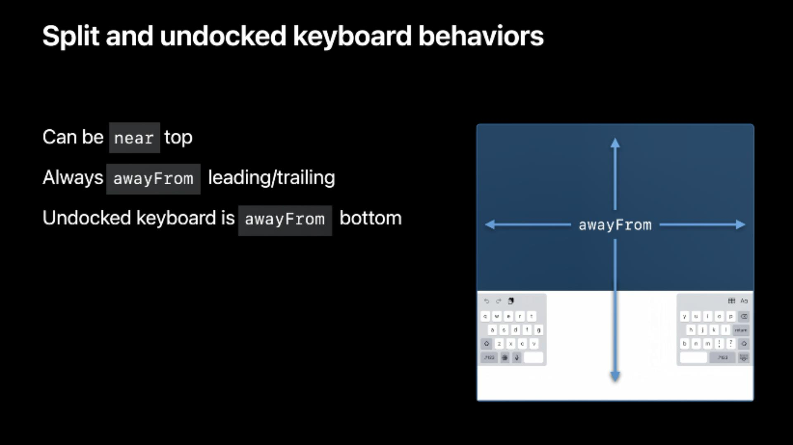

### 相机识别文字并输入 Text input via camera

今年有一种新的方式——使用相机输入文字。

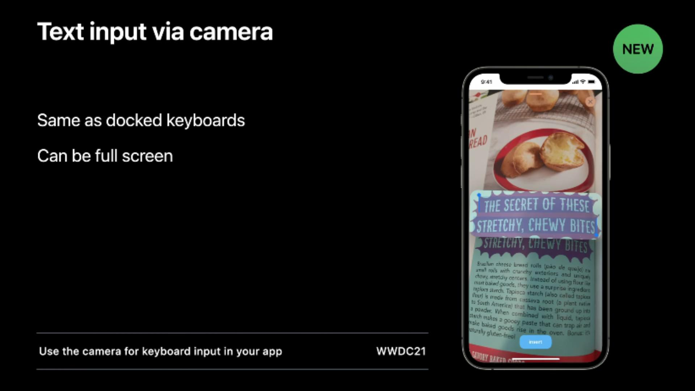

它是一个键盘，所以它仍然可以使用 Layout Guide。而且，它和普通的固定键盘是一样的，但它又是少数几个可以全屏显示的键盘之一。要了解更多关于利用相机输入文本的信息，请参看“[Use the camera for keyboard input in your app](https://developer.apple.com/videos/play/wwdc2021/10276/)”。

### 键盘样式 Hardware keyboard

1. 键盘会根据您使用的语言和快捷键栏中的按钮数量来改变宽度。

2. 以前，键盘始终是整个屏幕的宽度，但现在，非固定的键盘可以使用快捷键栏的 leading 和 trailing 了。

3. 键盘总是靠近（near）底部，远离（awayFrom）其余三个边。

4. 键盘是可折叠的！如果折叠它，它也可以靠近 leading 或 trailing。顺便说一句，这就是为什么要小心使用键盘的 widthAnchor 属性的原因之一。因为它可以很小，也可以是整个屏幕的宽度。

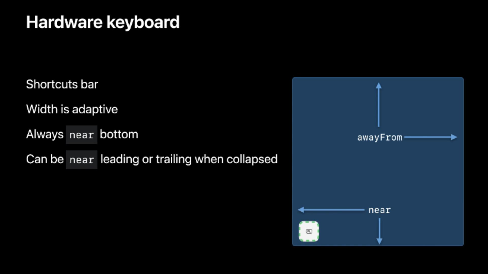

### 分屏情况下的非固定键盘 Multitasking behaviors

如果你不是屏幕上唯一的应用程序，而你正在使用非固定的键盘，那该怎么办？

首先，键盘是可以给应用程序留出空间的。当这种情况发生时，系统会把键盘当作已经消失。

第二，当应用程序变到宽度最窄的时候，上下边缘都在发挥作用，但是 leading 和 trailing 会保持远离（awayFrom）状态，不管键盘是否在应用程序上。

此外，如果应用程序不只是屏幕上唯一的应用，那么 LayoutGuide 的大小会根据应用程序窗口上的键盘而定。

让我们来举一些例子。

所有这些仅适用于 followsUndockeyBoard 设置为 true 的情况。如果是 false，键盘就在屏幕的底部，宽度是整个窗口的宽度。

1. 浮动情况：当应用程序是全屏的，键盘在中间浮动的，LayoutGuide 与其它控件都是远离（awayFrom）的约束关系。当前所有 awayFrom 的约束都已激活，所有 near 的约束都已停用。

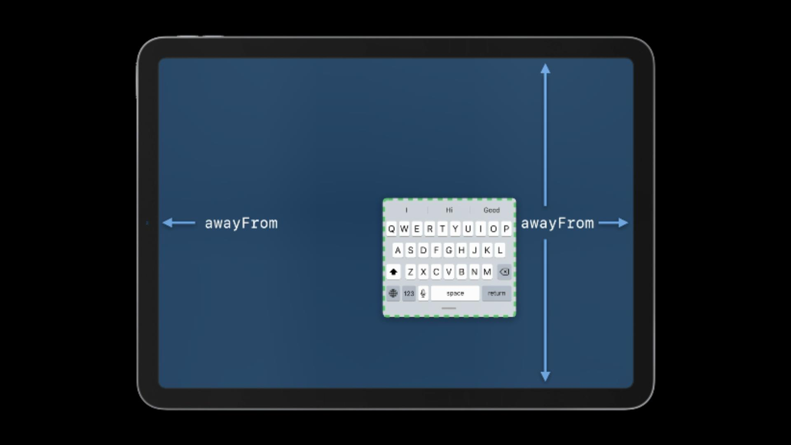

2. 分屏情况：当另一个应用程序出现在屏幕上时，如果你是一个更宽的应用程序，你的键盘仍然足够宽，与其它控件仍是远离（awayFrom）的约束关系。此时，键盘不需要移动那么多就能靠近（near）水平的边缘了。纵向的布局也是如此。

   当你的应用程序变成很窄时，LayoutGuide 总是处于远离（awayFrom）水平边缘的状态，但仍然可以靠近（near）顶部边缘。

   值得注意的是，LayoutGuide 的大小只考虑位于当前应用程序上的部分。

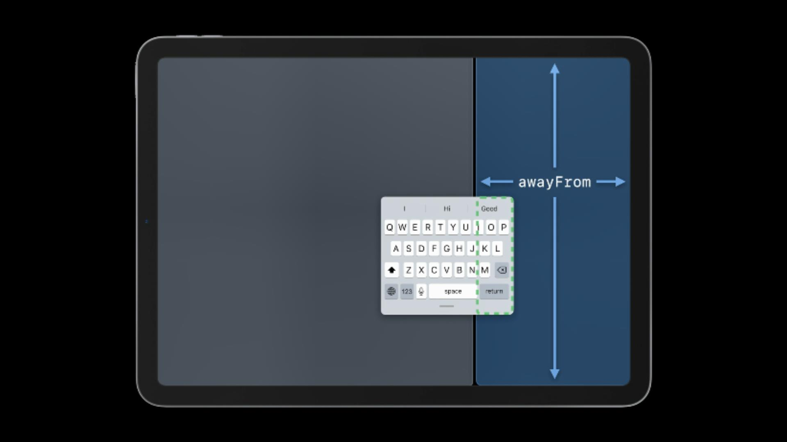

3. 固定键盘的情况：键盘又有整个屏幕的宽度时，LayoutGuide 会处于远离（awayFrom）顶部、leading 和 trailing 的状态。

   同样地，LayoutGuide 的大小只匹配位于当前应用程序上的部分。

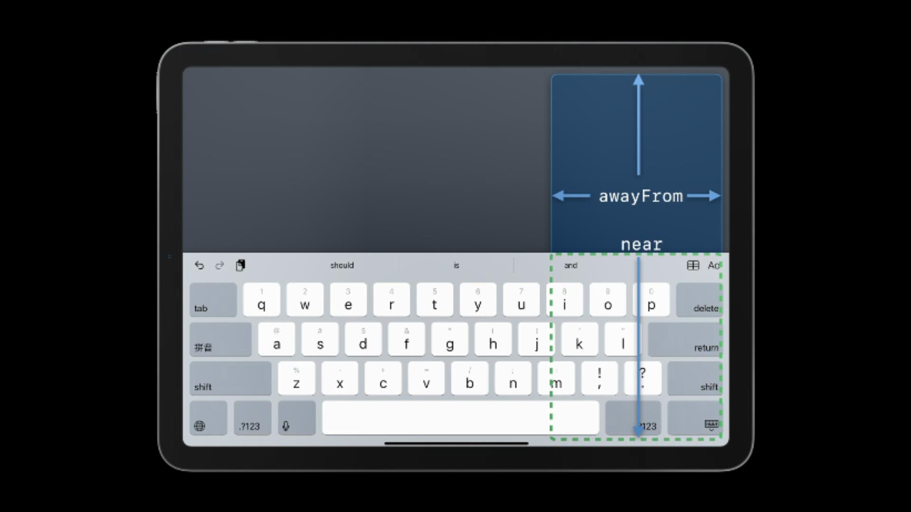

## 结语

从本 session 可以看出，Apple 这个键盘布局的技术方案是可以大大提升开发者的开发效率的，但是也由于被固有思维（觉得键盘并不是应用程序的一部分，而是系统负责的一套组件）所局限，所以如果可以的话，请开始使用 KeyboardLayoutGuide，并考虑将键盘集成到应用程序的界面中去，从而帮助用户在使用屏幕键盘时获得更流畅、更愉快的体验。

Apple 已经为本 session 提供了相应的[示例代码](https://developer.apple.com/documentation/uikit/keyboards_and_input/adjust_your_layout_with_keyboard_layout_guide)。

