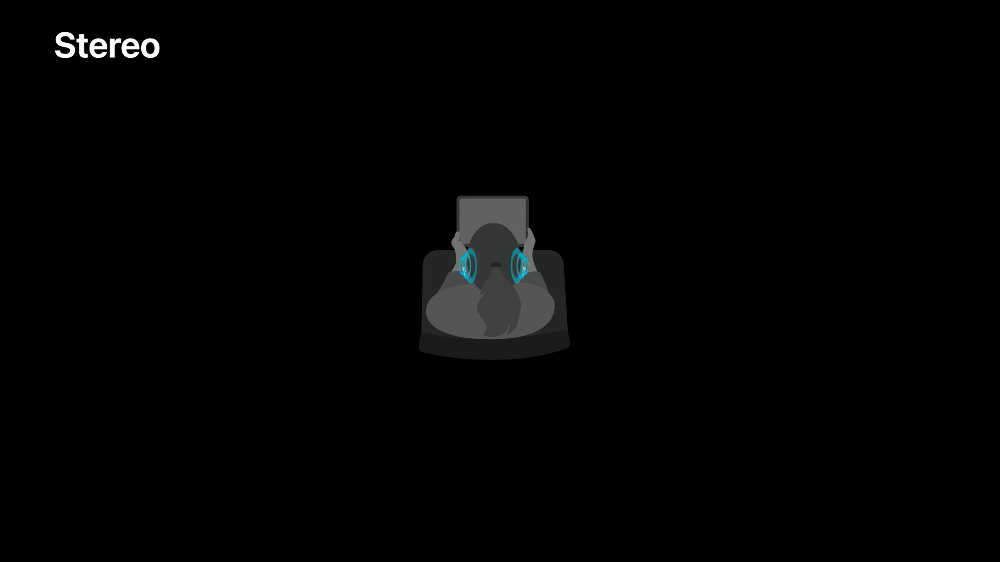
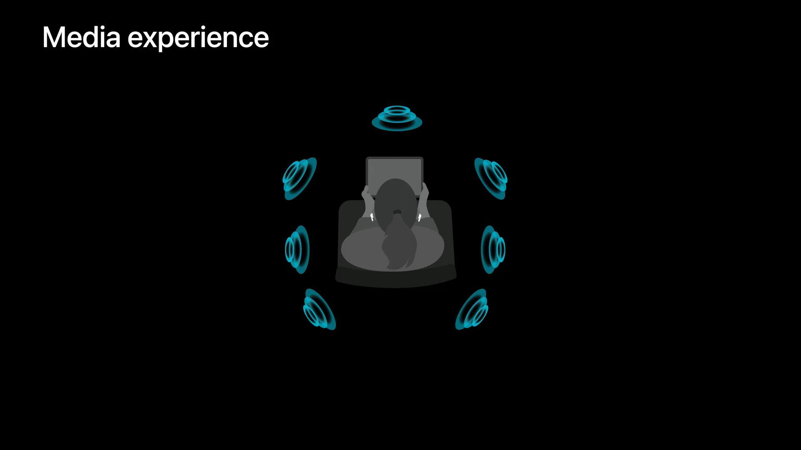
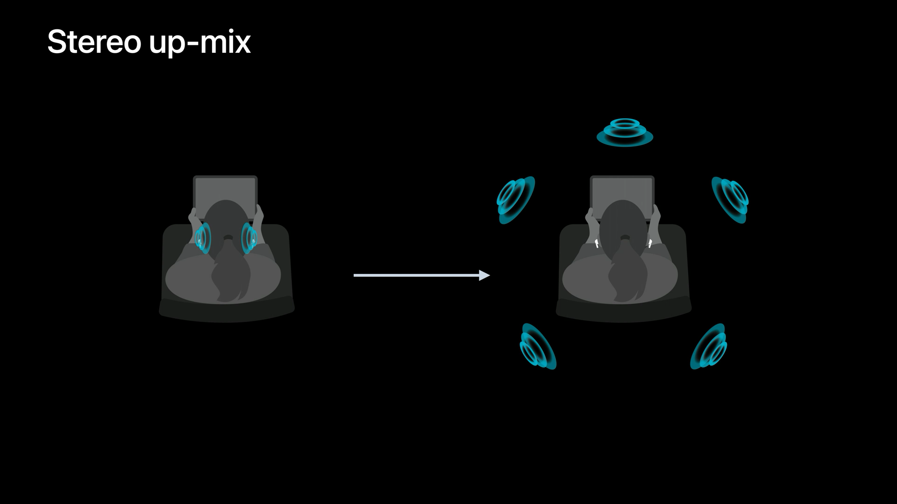
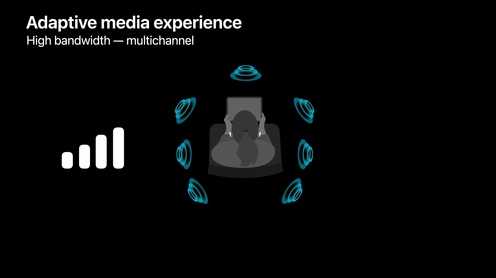
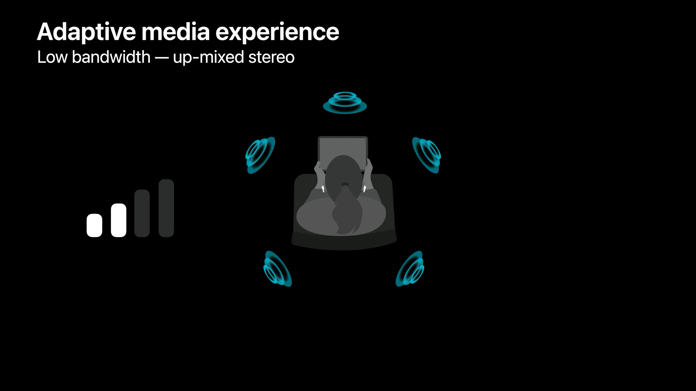
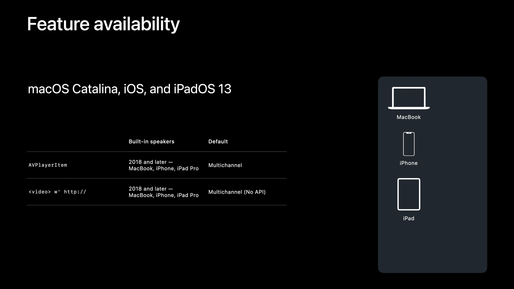
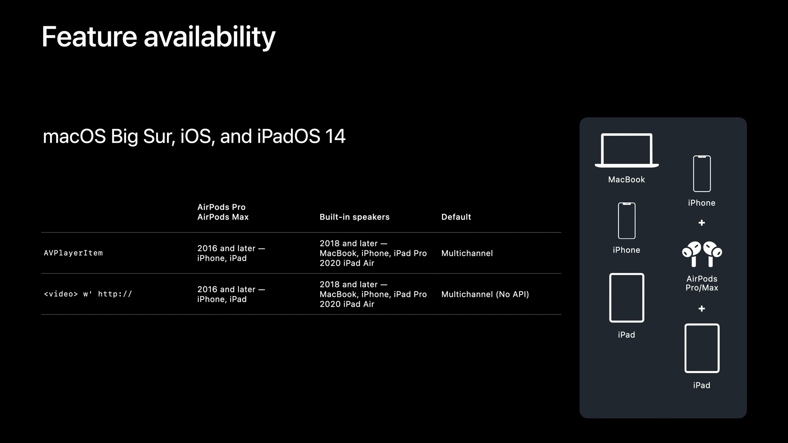
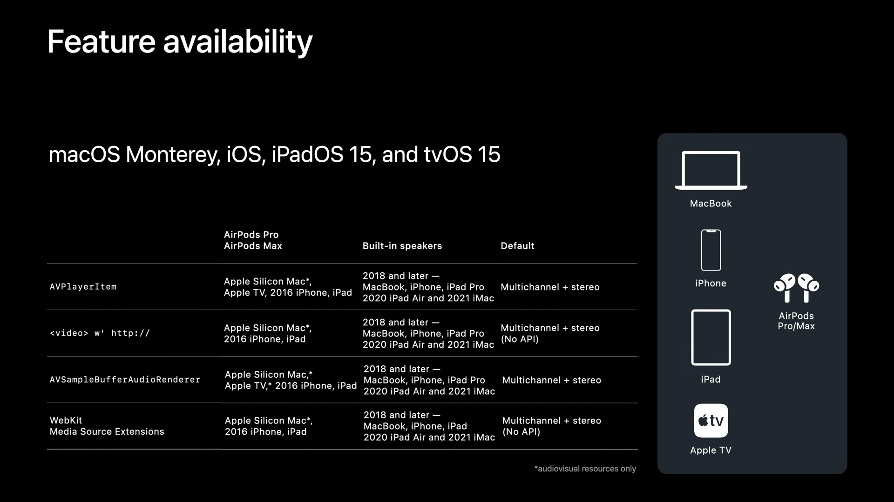

# WWDC21 10265 - 将你的应用沉浸在空间音频中

空间音频技术通过对多点音源（multipoint audio source）的渲染，提供一种身临其境的沉浸式体验，你可以基于此为用户提供影院般的体验，从而差异化你的服务；而用户只需使用手头现有的移动设备便可以体验到这一切。本文将带你探索空间音频，以及如何使用 core AVFoundation playback APIs 以及 WebKit 来实现对空间音频的支持。

## 什么是空间音频

在介绍空间音频之前，先回顾一下我们所熟悉的立体声技术。



立体声使用多声道来构造立体感的声音，但无论是使用耳机还是立体声扬声器，我们感知到的音场（soundstage）是极其受限的：我们听不到背后的声音、正前方的声音、头上的声音，由于缺少位置信息，立体声难以营造栩栩如生的体验。拿耳机来说，声音从位于我们头上耳机里的微型扬声器中发出，当我们移动头部时，这些扬声器也随着移动，这是一种“头上体验（in-head experience）”，和影院的效果不同。

空间音频则可以提供类似于影院般的音频体验，它是一种[心理声学（psychoacoustic）技术](https://en.wikipedia.org/wiki/Psychoacoustics)，基于人耳[音源定位](https://en.wikipedia.org/wiki/Sound_localization)的原理，通过细微地改变左右耳接收到的音频参数（响度、频率、时域等），可以营造出引人入胜的虚拟空间声场。

空间音频针对多声道音频效果最好，但立体声音频的效果也很出彩，它支持音视频媒体源或纯音频源，而且支持众多广大消费者已有的 Apple 设备。

### 如何分发空间音频资源

如前文所述，提供多声道音频资源可以使用户在你的应用中获得最佳的空间音频体验，多声道音频资源一般通过下列方式分发：

- 通过 HLS Variant 流分发
- 通过常规媒体文件分发
- 通过 WebKit 所支持的 W3C MSE 协议分发

Apple 对不同分发方式的支持有所不同，因此不同分发方式用户得到的体验也有所不同。

其中，基于 HLS 协议来分发不同的多声道音频资源可以让空间音频体验对用户所处的环境有着最佳的适应性。实际上，你可能已经拥有了多声道音频媒体资源，你只需简单地将他们发布，便可以在你的应用中默认启用了空间音频支持，不需要任何软件层面的改动。

## 空间音频带来的媒体体验

利用空间音频技术，你可以提供环绕的音乐体验，如同置身于音乐会之中，你也可以打造带有交互场景的全动态视频游戏（Full-motion），给玩家以沉浸式的冒险体验。而这样技术是如何工作的呢？

### 头外体验

和立体声的头上体验不同，当使用空间音频时，虚拟声场是静态的，不会随着我们头部的移动而移动，这是一种类似于影院的音频效果和听觉体验。这种体验可以由 Apple 的一系列产品内置的扬声器或者 Apple 所支持的一些耳机产品来实现。



当使用支持空间音频的耳机时，播放设备中的惯性测量单元（inertial measurement units）的测量值会同耳机中的测量值进行比较，用于确定听者的头部姿势，然后根据用户头部姿势的变化，播放设备会动态地调整音频渲染，以维持静态声场效果。这是一种头外体验（out-of-head experience），最终的结果让听者觉得声音是从摄像机的周围或者听者的周围发出来一样。即使在转弯的公交车上，或者在倾斜的飞机上，空间音频效果依然适用。

### Up-Mix 技术



Apple 还提供一种将立体声音源 up-mix 以产生 5.1 声道的音频体验，通过该技术，开发者可以使用现有的立体声音频资源库来提供空间音频效果。对于支持的耳机设备，这种音频处理方式是 2021 年秋季发布的系统（macOS Monterey，iOS 15，iPadOS 15，tvOS 15）的默认音频处理方式。

多声道音频资源的比特率比常规的立体声 AAC 资源要高得多，因此在传输时将占用更多的带宽，进而会影响视频画质。为了在有限的带宽环境中同时满足画质要求和空间音频效果，Apple 利用 up-mix 技术来动态适配用户带宽。

当用户的带宽不足以提供高质量的试听体验时，音频会无缝地降级为立体声资源，并使用 up-mix 技术提供空间音频处理。如果在降级转换之前提供了头部追踪，会继续维持追踪效果。之后，如果带宽恢复，完整的多声道空间音频处理也会恢复。





为了更好地支持这种自适应空间音频体验，均衡立体声和多声道音频资源间的响度变得更加重要，因此，请视情况在你的媒体资源 metadata 中提供 DRC 和 dialnorm。具体参见 Apple 官网的[相关文档](https://developer.apple.com/documentation/http_live_streaming/hls_authoring_specification_for_apple_devices)。

> 注：DRC（Dynamic Range Control）和 dialnorm 均是杜比音轨响度相关的元参数

## API

接下来介绍空间音频相关的 API。

应用通过 `AVPlayerItem` 或者 `AVSampleBufferAudioRenderer` 来提供空间音频支持。通过参数`allowedAudioSpatializationFormats`来配置所支持的空间音频效果类型：

```Swift
// AVPlayerItem
// or
// AVSampleBufferAudioRenderer
@available(macOS 11.0, *)
var allowedAudioSpatializationFormats: Int32
```

其中 `AVAudioSpatializationFormats` 取值如下：

```Swift
public struct AVAudioSpatializationFormats : OptionSet {
    public init(rawValue: UInt)

    public static var monoAndStereo: AVAudioSpatializationFormats { get }

    public static var multichannel: AVAudioSpatializationFormats { get }

    public static var monoStereoAndMultichannel: AVAudioSpatializationFormats { get }

}
```

- `monoAndStereo`：只对单声道或立体声格式音频进行空间音频化；
- `multichannel`: 只对多声道格式音频进行空间音频化；
- `monoStereoAndMultichannel`：以上二者均进行空间音频化；
- 传 `0` 禁用空间音频。

另外需要注意，Apple 的平台上也通过控制中心或蓝牙设置提供针对空间音频系统级别的控制。

通过参数 `isSpatialAudioEnabled` 来判断音频路由（audio route）是否支持空间音频：

```Swift
@available(iOS 6.0, *)
class AVAudioSessionPortDescription : NSObject {

    @available(iOS 15.0, *)
    var isSpatialAudioEnabled: Bool { get }

}
```

此外，在 `AVAudioSession` 中，Apple 将引入一个属性，使开发者可以向系统宣告你的应用支持多声道空间音频。如果用户没有在控制中心或蓝牙设置中启用空间音频选项，会显示一个提示。注意如果你的应用使用的是 `AVPlayer` ，系统会帮你设置这些提醒：

```Swift
extension AVAudioSession {
    @available(iOS 15.0, *)
    func setSupportsMultichannelContent(_ inValue: Bool) throws
    @available(iOS 15.0, *)
    var supportsMultichannelContent: Bool { get }
}
```

`isSpatialAudioEnabled` 表示当前端口是否支持空间音频 **&&** 用户是否允许使用空间音频。开发者可以监听音频路由变更，并在对应的事件处理中检查该属性。

当用户改变控制中心或蓝牙设置中的偏好时，`AVAudioSession` 会发出一个 `spatialPlaybackCapabilitiesChangedNotification`，该通知带有关于空间音频启用状态的信息，通过 `AVAudioSessionSpatialAudioEnabledKey` 来进行获取：

```Swift
extension AVAudioSession {
    @available(iOS 15.0, *)
    class let spatialPlaybackCapabilitiesChangedNotification: NSNotification.Name
}

@available(iOS 15.0, *)
let AVAudioSessionSpatialAudioEnabledKey: String
```

## 功能可用性

下面介绍过去三年 Apple 发布的系统/设备对空间音频的支持情况。

### 一、

支持 2018 年及以后年份型号的 MacBook、iPhone和 iPad Pro 产品系列，对应着 macOS Catalina、iOS 13 和 iPad OS 13 这些系统，通过内置的扬声器对下列音频播放方式提供空间音频支持：
- `AVPlayerItem`
- WebKit `<video>` 标签指定的任意 http scheme

默认情况下，选择可用的多声道音频进行空间音频化。



### 二、

在 macOS Big Sur、iOS 14 和 iPadOS 14 系统中，Apple 添加了对 AirPods Pro 和 AirPods Max 耳机的支持，利用这些配件，可以为 2016 年及以后的 iPhone 和 iPad 设备提供空间音频支持。

默认情况下仍然是选择可用的多声道音频进行空间音频化。



### 三、

最后，在最新的 macOS Monterey、iOS 15、iPadOS 15 以及 tvOS 15 中，Apple 对下列音频播放方式提供空间音频支持：
- `AVPlayerItem`
- `AVSampleBufferAudioRenderer`
- WebKit W3C MSE 扩展

其中 MSE 没有对应的 API 支持，不过可以通过 Media Capabilities API 在 AudioConfiguration 字典中查询空间音频支持的可用性。

默认情况下在可用且条件允许的情况下为所有的单声道、立体声和多通道音源提供空间音频化。对于 `AVSampleBufferAudioRenderer` 只含有音频的播放场景，默认情况下只提供多通道音频的空间音频化。

