# Session 10007 - IAP 新特性

本文基于 [Session 10007](https://developer.apple.com/videos/play/wwdc2022/10007) 梳理。

## 前言

本次 WWDC22，客户端通知层、Server API 层、Server Notification 层均有相关的新特性。虽然对比 WWDC21，本次更像是“小修小补”，但是本次也确实对一些痛点进行了补足。

在正式开始之前，由于本 Session 大部分基于 StoreKit 2、App Store Server API、App Store Server Notifications V2，因此建议先行阅读去年 WWDC21 的相关 Session：

- [WWDC21#Session 10114 - 初见 StoreKit 2](https://mp.weixin.qq.com/s/arA0_uyc4CWMQ7WJ2RanJA)
- [WWDC21#Session 10174 - IAP 后台通信优化与实践](https://mp.weixin.qq.com/s/dWsRKRJsYMRl0GX_36T-kg)
- [WWDC21#Session 10115 - IAP 用户退款与客诉处理优化](https://mp.weixin.qq.com/s/MtytymgkcP3_oAH7JyI1og)

另外，可以根据下面的 API Changes 图，对苹果 IAP 相关接口变动进行快速了解，用以辅助阅读。

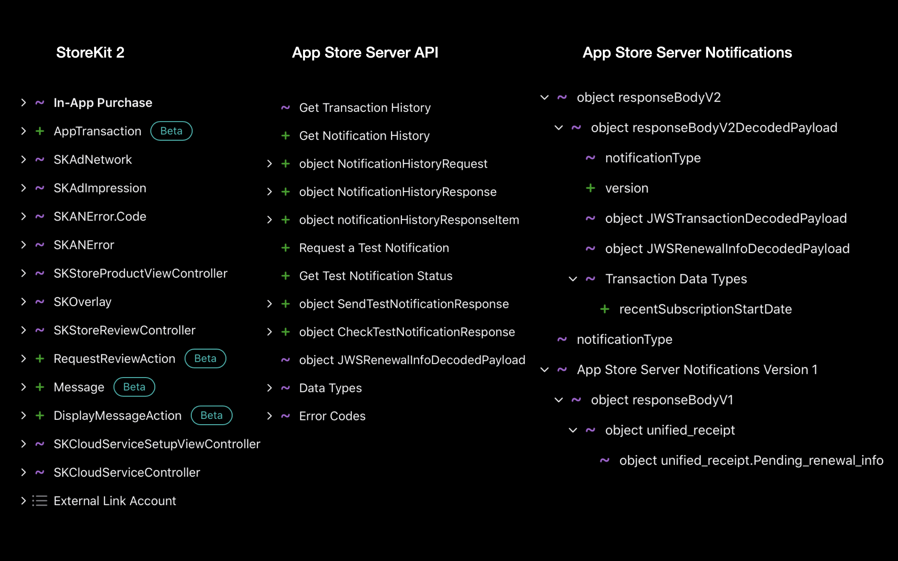

该图整理来源于以下三部分的 Apple Documentation API Changes。

- [StoreKit 2 API - Changes](https://developer.apple.com/documentation/storekit/in-app_purchase?changes=latest_major)

- [App Store Server Notifications - API Changes](https://developer.apple.com/documentation/appstoreservernotifications/?changes=latest_major)

- [App Store Server API - API Changes](https://developer.apple.com/documentation/appstoreserverapi?changes=latest_minor)

本文基于 WWDC22#10007 梳理，因此与视频保持一致，本文将内容划分为 Client / Server 层两大部分，同时会以视频顺序展开。除此之外，还会根据一些个人实践经验，补上一些理解与说明。

## 客户端部分

### App Transaction API：应用购买记录

众所周知，苹果于 WWDC21 发布了 StoreKit 2，其均以 JWS Receipt 形式传递信息。然而，WWDC21 发布的特性主要针对的是应用内购买项目，并没有针对应用购买做处理。而应用购买实则也是属于内购范围（包括免费应用，实则也存在购买行为），在 WWDC22 之前，我们可以使用 App Receipt 特性判断应用是否进行了预订、购买等行为。

一种常见的 App Receipt 结构如下：

```json
{
    "receipt": {
        "receipt_type": "...",
        "adam_id": ...,
        "app_item_id": ...,
        "bundle_id": "...",
        "application_version": "...",
        "download_id": ...,
        "version_external_identifier": ...,
        "receipt_creation_date": "... Etc/GMT",
        "receipt_creation_date_ms": "...",
        "receipt_creation_date_pst": "... America/Los_Angeles",
        "request_date": "... Etc/GMT",
        "request_date_ms": "...",
        "request_date_pst": "... America/Los_Angeles",
        "preorder_date": "... Etc/GMT",
        "preorder_date_ms": "...",
        "preorder_date_pst": "... America/Los_Angeles",
        "original_purchase_date": "... Etc/GMT",
        "original_purchase_date_ms": "...",
        "original_purchase_date_pst": "... America/Los_Angeles",
        "original_application_version": "...",
        "in_app": [ ... ],
    }
    "environment": "...",
    "latest_receipt_info": [ ... ],
    "latest_receipt": "...",
    "status": 0
}
```

对于预订场景，我们可以识别 preorder_date 等字段确认；对于需要确定购买时间、版本等场景，我们可以通过利用 original_purchase_date_ms、 original_application_version 等字段确认。

更为稳妥的情况下，我们还应将相关 App Receipt 传递至应用后端，然后应用后端调用苹果 verifyReceipt 进行验证，确保不存在篡改情况。除此之外，对于某些 App Receipt 为空的异常场景，我们还需要 SKReceiptRefreshRequest 进行票据刷新。票据刷新行为有可能导致 AppleID 授权弹框出现，因此按照此前苹果的最佳实践，建议我们提供一个按钮来进行票据刷新行为。

虽然在 StoreKit 2 中，我们仍旧可以利用 App Receipt 解决上述场景遇到的问题。但是 App Receipt 并不符合 StoreKit 2 统一使用 JWS Receipt 的设计观念。因此在本次 WWDC22 中，苹果在 StoreKit 2 将内购分为了应用内项目购买与应用购买两部分，其中应用购买使用本次新增的 App Transaction 进行代表。在我看来，App Receipt = Transaction History + App Transaction。

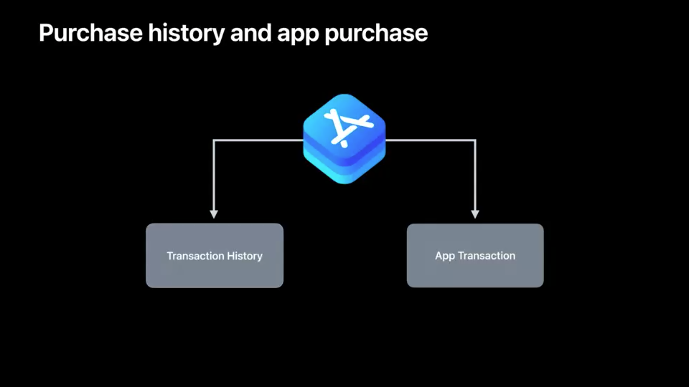

App Transaction 遵循了苹果 StoreKit 2 一贯以来的设计：

- 基于 Swift Concurrency
- 使用 JWS Receipt
- 支持 StoreKit 2 框架内校验
- 可以直接通过 App Transaction 相关接口对票据内字段进行取值

唯一美中不足的是 ，虽然数据仍旧是那些数据，但 App Transaction API 仅 iOS 16 及以上才能使用，并没有做到向前兼容。

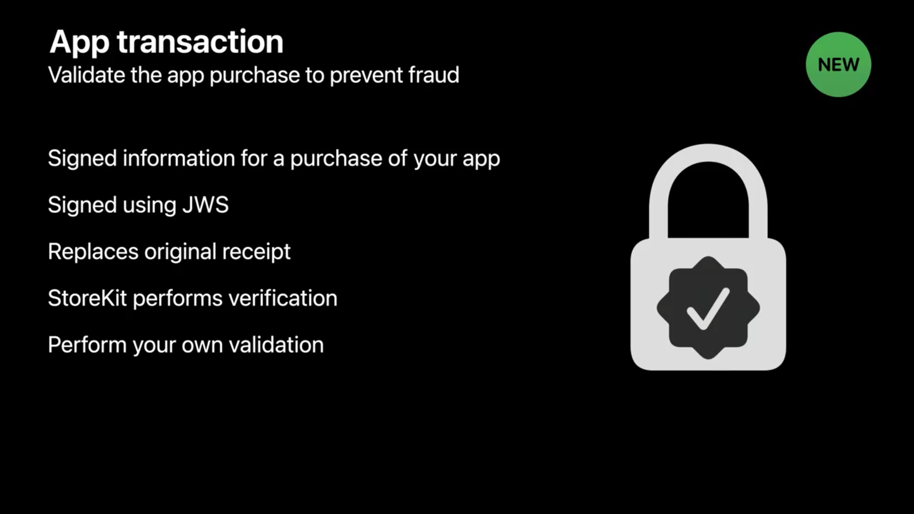

根据当前的 [App Transaction 文档](https://developer.apple.com/documentation/storekit/apptransaction)进行整理，我们可以得出如下结构图，可以看见当前该 API 设计的十分简单，一级类中仅有绿框的单例及静态刷新方法，蓝框部分为票据内的数据，与 App Receipt 数据基本无异；红框部分为用于校验 JWS Receipt 的基本信息，与 StoreKit 2 Transaction 部分信息类似；黄框部分为数据的 JSON 形式，也与此前 StoreKit 2 设计类似。

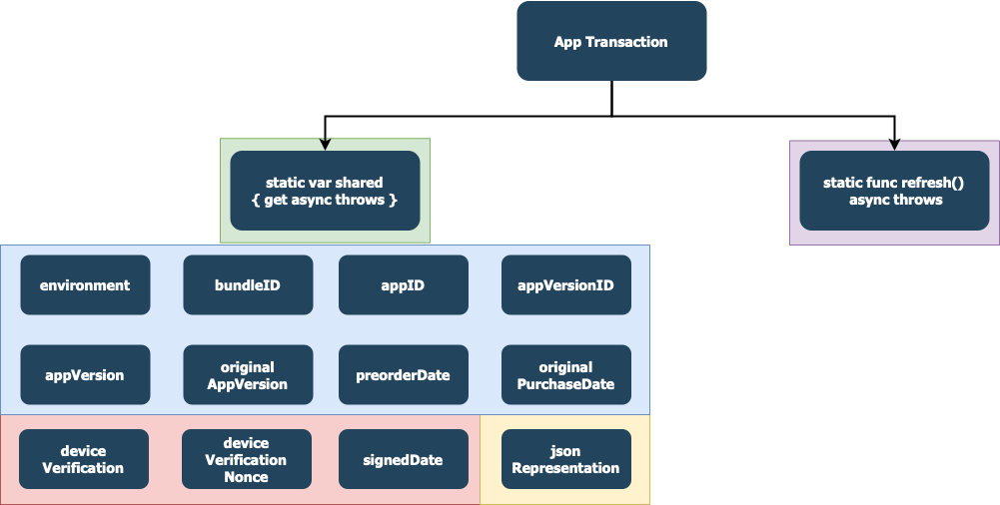

苹果在视频中给出了一个案例：我们一开始先提供付费型应用，后面因服务器成本提升，切至免费应用 + 非消耗型基础服务 + 订阅型增值服务的商业模式。由于商业模式的切换会影响最开始付费购买应用的用户，所以对于已经购买了付费应用的用户，我们需要隐藏非消耗型基础服务购买入口并免费提供相关内容。为实现该需求，我们可以利用以下简单的 App Transaction API 进行相应的处理。

```swift
let result: VerificationResult<AppTransaction> = try await AppTransaction.shared
switch result {
case .unverified(let appTransaction, let verificationError):
    /// Prompt the user to refresh the app transaction
    /// Provide a minimal experience for my app
case .verified(let appTransaction):
    let originalAppVersion = appTransaction.originalAppVersion
    let freeAppVersion = "8.0"
    let paidForApp = isPaidAppVersion(originalAppVersion: originalAppVersion, freeAppVersion: freeAppVersion)
    if paidForApp {
        /// Grant access to content & check additional purchases
    } else {
        /// Check current entitlements
    }
}

```

此处有一点需要特别说明，前文有提到，若 App Receipt 为空，我们需使用 SKRefreshReceipt 进行票据刷新，该步骤会有一定概率导致 AppleID 授权弹框出现，因此按照苹果原来（WWDC22 以前）的设计，应该提供一个刷新按钮给到用户进行票据刷新，避免用户因各种异常导致的 App Receipt 不存在的情况。

为了保持相同的用户体验，在将 App Receipt 切换至 App Transaction 后，也应该提供同样的刷新按钮，并在按钮点击时调用 [AppTransaction.refresh()](https://developer.apple.com/documentation/storekit/apptransaction/4020517-refresh) 以拉出 AppleID 登陆弹框，以与之前行为保持一致。由于该方法明确会触发 AppleID 授权弹框弹出，该方法应在 AppTransaction.shared 抛出异常时 / 本地校验时遇到 unverified 时 / 用户主动触发时再进行调用。

### New Properties：StoreKit 2 基础能力补足

这一小节，在我看来属于苹果对 WWDC21 基础能力的补足，包括以下内容：

- 新增部分 Format 字段：

  - 新增 [subscriptionPeriodFormatStyle](https://developer.apple.com/documentation/storekit/product/4044348-subscriptionperiodformatstyle)（视频无提及）：用于格式化订阅周期
  - 新增 [subscriptionPeriodUnitFormatStyle](https://developer.apple.com/documentation/storekit/product/4044349-subscriptionperiodunitformatstyl) 字段（视频无提及）：用于格式化订阅周期单元
  - 新增 [priceFormatStyle](https://developer.apple.com/documentation/storekit/product/4044347-priceformatstyle) 字段，用于供我们进行优惠价格的格式化。因 WWDC21 仅提供了 displayPrice，要想格式化或获取当前币种只能通过 Storefront 进行处理，所以这块优化还是比较必要的。此处再补充一点，其实我们在 WWDC22 之前，也可以通过解码 Product 对象的 jsonRepresentation，并通过 currencyCode 字段获取币种，但该字段相对隐蔽，且难以保证未来 JSON 结构是否会做相应调整，不够安全可靠。

    ```json
    /// Product 对象 jsonRepresentation 信息
    {
     "attributes": {
      "isFamilyShareable": 0,
      "isMerchandisedEnabled": 0,
      "isMerchandisedVisibleByDefault": 0,
      "isSubscription": 1,
      "kind": "Auto-Renewable Subscription",
      "offerName": "com.nw.promotional.drm.6",
      "offers": [
       {
        "assets": [],
        "buyParams": "productType=A&price=6000&salableAdamId=1560947991&pricingParameters=STDQ&pg=default",
        "currencyCode": "CNY",
        "discounts": [
         {
          "modeType": "PayAsYouGo",
          "numOfPeriods": 1,
          "offerId": "NWDiscount_Seahub_Only",
          "price": 3,
          "priceFormatted": "¥3.00",
          "recurringSubscriptionPeriod": "P7D",
          "type": "AdhocOffer"
         }
        ],
        "price": 6,
        "priceFormatted": "¥6.00",
        "recurringSubscriptionPeriod": "P7D",
        "type": "buy"
       }
      ],
      "releaseDate": "2009-06-17",
      "subscriptionFamilyId": "20753299",
      "url": "https:\\/\\/sandbox.itunes.apple.com\\/cn\\/app\\/id775594225"
     },
     "href": "\\/v1\\/catalog\\/cn\\/in-apps\\/1560947991?l=zh-Hans-CN",
     "id": "1560947991",
     "type": "in-apps"
    }
    ```

- 新增 IAP 环境字段：可取值 Production / Sandbox / Xcode（仅客户端存在），用于供我们在做数据分析时，确认当前 IAP 环境，以避免沙箱数据对现网数据分析造成影响。该新增字段涉及以下前后端接口：

  - StoreKit 2：该字段以 [AppStore.Environment](https://developer.apple.com/documentation/storekit/appstore/environment) 结构表示，并添加在 Transaction、AppTransaction、Product.SubscriptionInfo 等类上，用于表示 IAP 环境的的实例字段
  - App Store Server API：environment 字段于 App Store Server API 1.2 版本被添加到具体的 JWSTransactionDecodedPayload、JWSRenewalInfoDecodedPayload 内（注意截止 WWDC22 时，App Store Server API 版本已为 1.5）
  - App Store Server-to-Server Notifications：environment 字段于 App Store Server-to-Server Notifications 2.2 版本被添加到具体的 JWSTransactionDecodedPayload、JWSRenewalInfoDecodedPayload 内（注意截止 WWDC22 时，App Store Server-to-Server Notifications 版本已为 2.5）

- recentSubscriptionStartDate：新增用户最近连续订阅的时间（注意“连续”一词指的是用户没有出现过现网超 60 天的订阅 / 沙箱超 10 分钟的断档情况）。这个字段在我看来较为有用。这是因为当前苹果对于连续订阅满一年的用户按 85% 的比例分成给开发者，我们可以利用该字段，对高忠诚度 / 预流失用户进行及时的奖励 / 挽回，使得更高的用户比例满足连续订阅一年这一苹果给我们准备的“KPI”（关于这一块说明，可进一步参考[苹果自动续期订阅文档](https://help.apple.com/app-store-connect/#/dev75708c031)）。同样的，该新增字段也涉及以下前后端接口：

  - StoreKit 2：recentSubscriptionStartDate 以 UNIX Date 格式表示，并添加在 Product.SubscriptionInfo 等类上，表示用户的最近连续订阅的开始时间
  - App Store Server API：recentSubscriptionStartDate 字段于 App Store Server API 1.5 版本被被添加到 JWSRenewalInfoDecodedPayload 内
  - App Store Server-to-Server Notifications：recentSubscriptionStartDate 字段于 App Store Server-to-Server Notifications 2.5 版本被添加到 JWSRenewalInfoDecodedPayload 内

值得特别说明的是，上面字段向前兼容的，也就是我们只需要使用 Xcode 14 编译， iOS 15 系统也可以调用这部分接口。

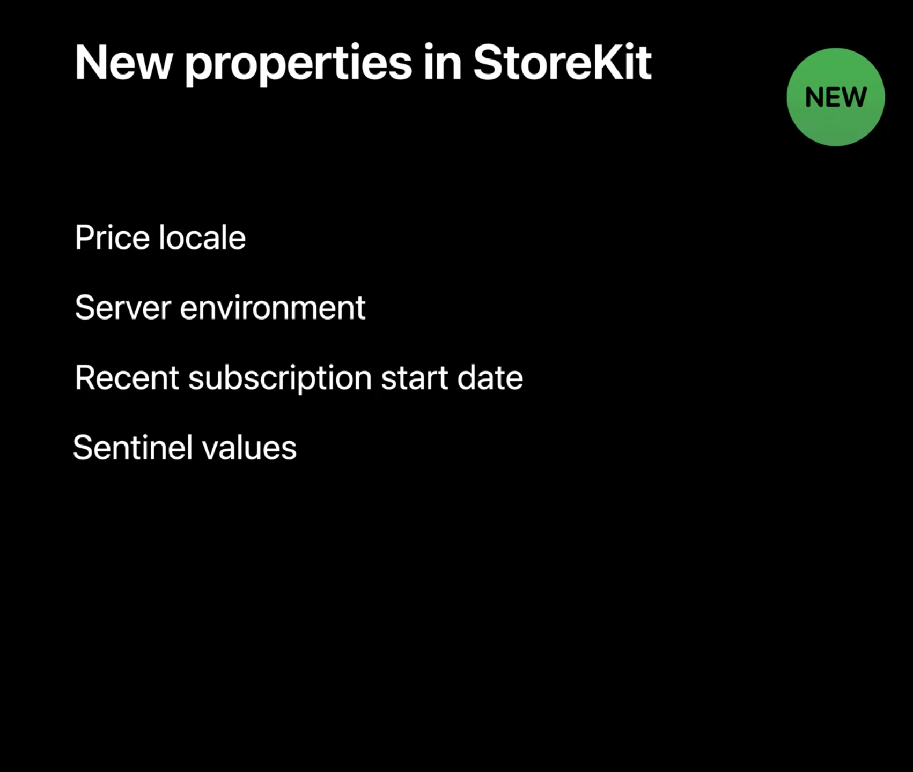

另外，苹果此处还提及了一个较为特殊的“哨兵值”（Sentinel values），该字段实际上是一个 PlaceHolder Values。用来解决上述三个字段在 StoreKit Testing + iOS 15 的情况。具体针对 StoreKit Testing + iOS 15 场景，上述字段会有如下表现：

- 区域信息会调整为 Locale(identifier: "xx_XX")
- 环境信息为空字符串（String.empty）
- recentSubscriptionStartDate == Date.distantPast

也就是说，在 StoreKit Testing + iOS 15，本次新增的字段均为异常表现，因此编写单测代码时需注意绕过。

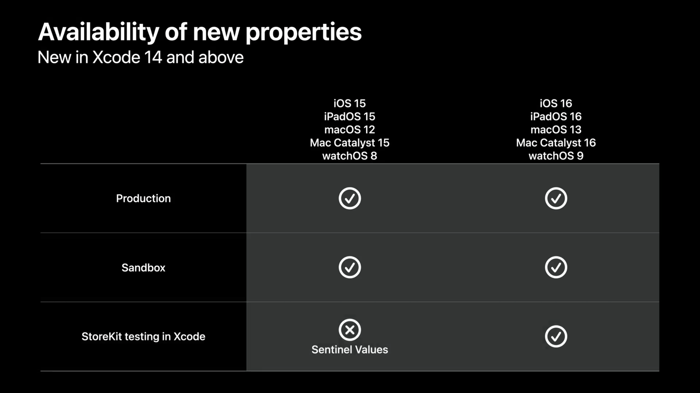

### SwiftUI Friendly APIs：SwiftUI 基础能力补足

StoreKit 除了普通的内购，还涉及优惠代码兑换界面的应用内弹出接口以及应用评分接口，这两块接口也是比较基础的（尤其是评分接口）。随着苹果对 SwiftUI 推进，本次新增了这两块接口的 SwiftUI 调用方式，但这两块接口仅支持 iOS 16 及之后的版本：

- 优惠代码兑换界面：增加 ViewModifier `offerCodeRedemption`，该接口对应的 Original StoreKit 内容为 [presentCodeRedemptionSheet()](https://developer.apple.com/documentation/storekit/skpaymentqueue/3566726-presentcoderedemptionsheet.) 。此处仅为 SwiftUI 适配，用以在 SwiftUI 上展示优惠代码兑换界面。与 SwiftUI Alert 类似，仅需提供一个状态传入即可控制界面弹出。

    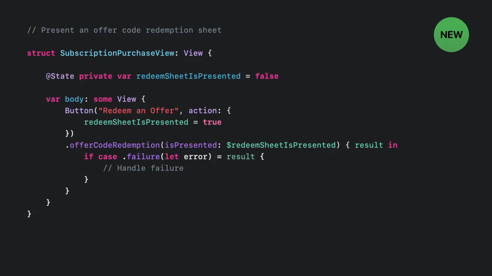

- 请求展示评分界面：需使用 `requestReview` 环境变量，在需要进行界面展示时，直接调用该方法，此处仅为 SwiftUI 适配。该方法对应 Original StoreKit 内容为 [SKStoreReviewController](https://developer.apple.com/documentation/storekit/skstorereviewcontroller.)，另外该方法也存在相同的限制：365 天内对于同个用户而言仅会展示 3 次评分界面。除此之外，苹果还有如下最佳实践推荐我们遵循：

  - 针对同一 App 版本，不应对同一用户弹出多次
  - 不应打断用户
  - 应该在用户获得成就的时候弹出
  - 应该提供开关，允许用户关闭该功能（关闭后不再展示）

    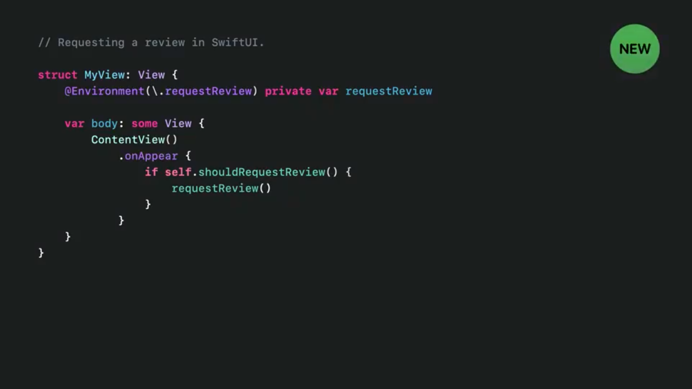

### StoreKit Messages：对苹果消息进行延迟展示

若我们进行了订阅涨价，对于符合条件（具体条件见[管理自动续期订阅的定价 - 提高自动续期订阅价格](https://help.apple.com/app-store-connect/#/devc9870599e)）的业务而言，苹果会推送涨价确认界面。如果涨价推送界面在一些不可被中断场景弹出，会极大的影响用户体验（想象剧情正达高潮，突然被一个涨价弹框啪脸上的心情）。因此，苹果推出了 StoreKit Message 接口。这部分接口允许我们对苹果需要展示的消息进行延迟展示。

当应用在前台运行时，苹果有可能会推送一些需要进行展示的消息（当前暂时只有涨价消息，未来可能会有更多信息），此时我们可以通过该接口进行处理。

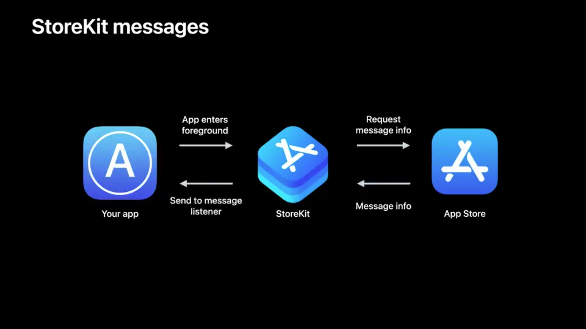

我们先来看看 StoreKit Message 的结构。根据当前苹果提供的文档可知，当前设计包含一个异步队列，异步队列内包含各类消息，同时还有一个代表消息类型的 Message.Reason 结构（截止写稿时，仅包含通用的 genric（具体包含什么消息尚不明确） 及 priceIncreaseConsent（订阅涨价）类型）

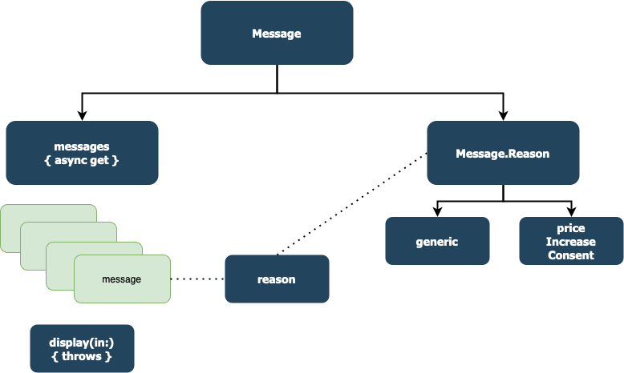

处理的示例代码如下：设置 Message Listener，将当前苹果推送的数据进行存储。需要注意的是：对于每次 StoreKit 推送的消息，我们自身应尽量确保仅展示一次（虽然调用展示接口时，苹果会二次判断该消息是否应该展示），因此此处在存储前还进行了主线程分发和防重判断，避免了重复。另外需要说明的是，该接口同样需要基于 iOS 16。

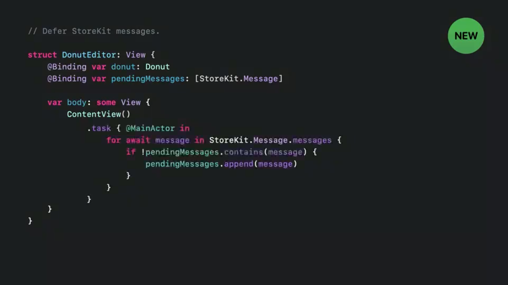

随后，我们可以直接使用 SwiftUI 环境变量 displayStoreKitMessage 对存储的消息进行展示。

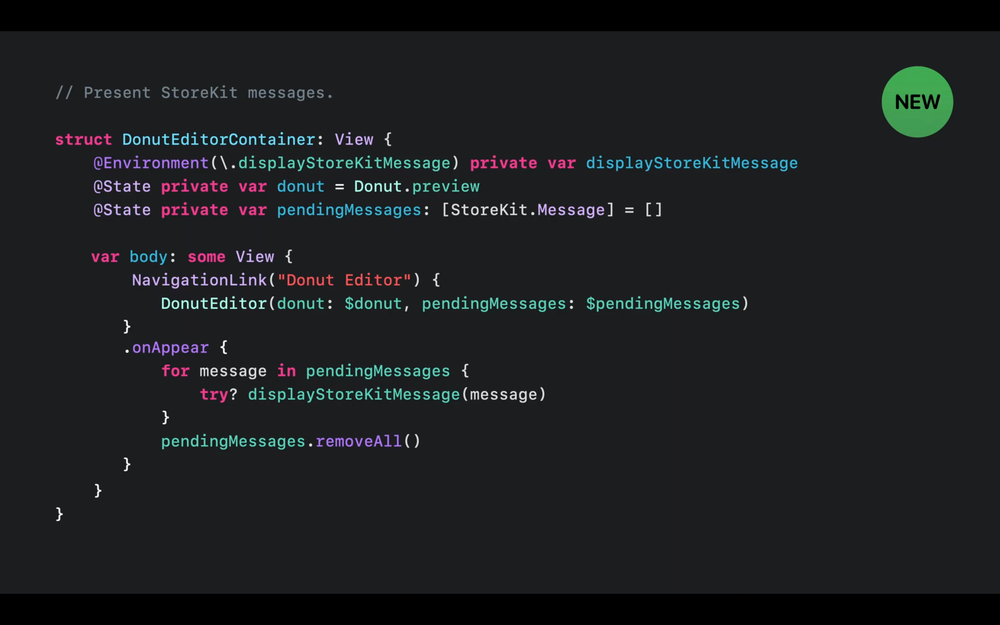

个人认为，这个接口涉及涨价的能力可以对应到 Original StoreKit [paymentQueueShouldShowPriceConsent:](https://developer.apple.com/documentation/storekit/skpaymentqueuedelegate/3521328-paymentqueueshouldshowpriceconse?language=objc) 接口。但与涨价通知接口设计不同，此接口更具扩展性，可以看到，StoreKit Message 类型理论上是可以无限添加的，同时还包含了一个神秘的 [generic](https://developer.apple.com/documentation/storekit/message/reason/3963908-generic) 类型。也就是说，苹果已经为未来的新消息添加提前做好了准备。我们在使用该接口的时候，还要对未来的场景进行考量（而非仅判断当前没有包含涨价，所以不接入该接口）。

### Application Username：Original StoreKit 透传能力对齐

众所周知，对于 StoreKit 2，我们可以往 appAccountToken 传入 UUID，该 UUID 会被一直原样透传到 JWS Receipt 中，我们可以在之后的后台处理利用该透传字段实现自己的一些业务逻辑。该功能推出后被不少开发者叫好，但由于 StoreKit 2 使用成本较高（需要 iOS 15 + Swift Concurrency），叫好不叫座的情况仍属不少。

终于，苹果对 Original StoreKit 的 applicationusername 也做了一次小修小补。若开发者通过 applicationUsername 传入 UUID，该字段会被以 UUID 形式存储在苹果后台，并留存在 JWS Receipt & App Receipt 中。

如果留心文档变更的朋友可以发现，该功能其实已于 2022 年 3 月份推出并进行了文档更新。但是值得说明的是，这里仍有几点需要特别注意：

- 需要考虑票据类型问题：该能力仅适用于 App Receipt，不适用于 Transaction Receipt
- 需要考虑传参格式问题：以前 applicationUsername 建议传参是 hash(userAccount)，当前建议传参是 UUID，必须要以 UUID 格式传入，此处才会具有透传特性
- 需要考虑向前兼容的问题：新的购买可以添加该字段，但是老的购买怎么处理
- 需要考虑长度问题：UUID 的长度能否满足当前及未来一段时间的业务需求

关于苹果透传字段的讨论，可参考[苹果内购录：关于透传字段的一些讨论](https://mp.weixin.qq.com/s/ZslPiqGmC6B8OfgwZeasrw)

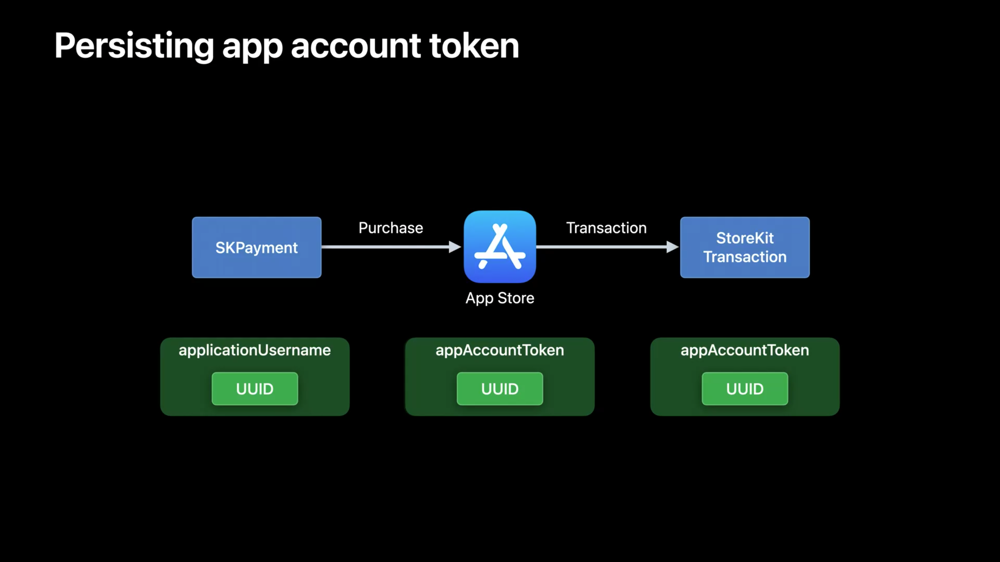

## 服务端部分

### New Transaction Fields：补充基础字段

此部分与上文所述的保持一致，JWSTransactionDecodedPayload、JWSRenewalInfoDecodedPayload 内新增 environment、recentSubscriptionStartDate 相关字段（如下图），分别表示当前 IAP 环境及用户最近连续订阅的时间（仅续费报文包含该字段）。

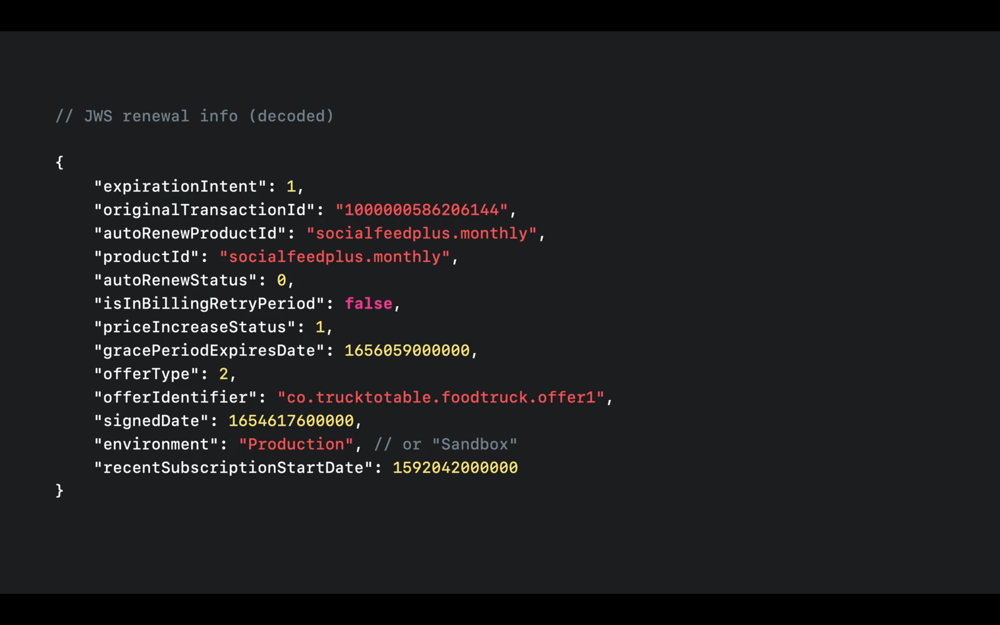

### App Store Server API：增加过滤器

苹果 WWDC21 给我们提供了 Get Transaction History App Store Server API，该接口使用分页模式进行查询，每页 20 条数据，且最老的数据在第一页，最新的数据在最后面。这样每次查询，我们可能会消耗大量的时间进行分页查询，为此，苹果建议我们存储 revision，即在每次查询之后，将当前我们关心的 originalTransactionId 的订单，与其第一次出现、最后一次出现的分页值 revision 存储起来。这样下次再次需要查找该 originalTransactionId 订单信息时，可以直接使用存储的 revision 范围进行辅助查找。

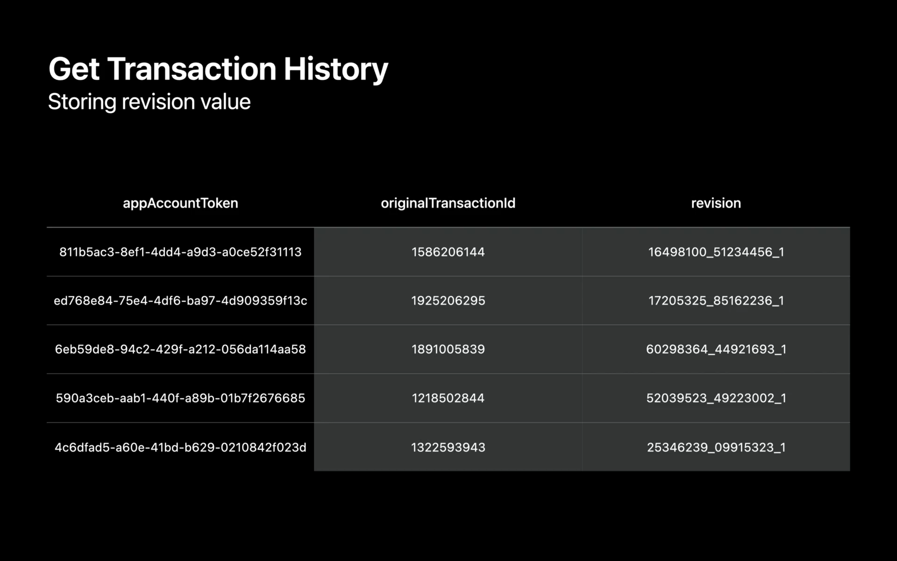

听上去似乎有理有据，可行性极高，然而对于一些经常进行支付行为的用户，其数据量极大（这里补充说明一下数据量大的原因，虽然该接口需要 originalTransactionId 作为入参，但查询出的订单并不局限于该 originalTransactionId 的订单，还会包含该用户在该应用里面的其他 originalTransactionId 订单）。

对于这种场景，苹果今年也提出了解法：条件过滤器。我们可以传入以下字段进行辅助过滤：

- 设置升降序过滤条件（默认的排序是最晚修改的在最后面，我们可以设置排序条件让最晚修改的到最前面）
- 设置苹果物品类型（Product Type）过滤条件
- 设置苹果物品标识（Product ID）过滤条件
- 设置苹果订阅组标识（Subscription Group ID）过滤条件
- 设置购买时间过滤条件
- 设置家庭共享状态条件
- 设置忽略无效订单条件

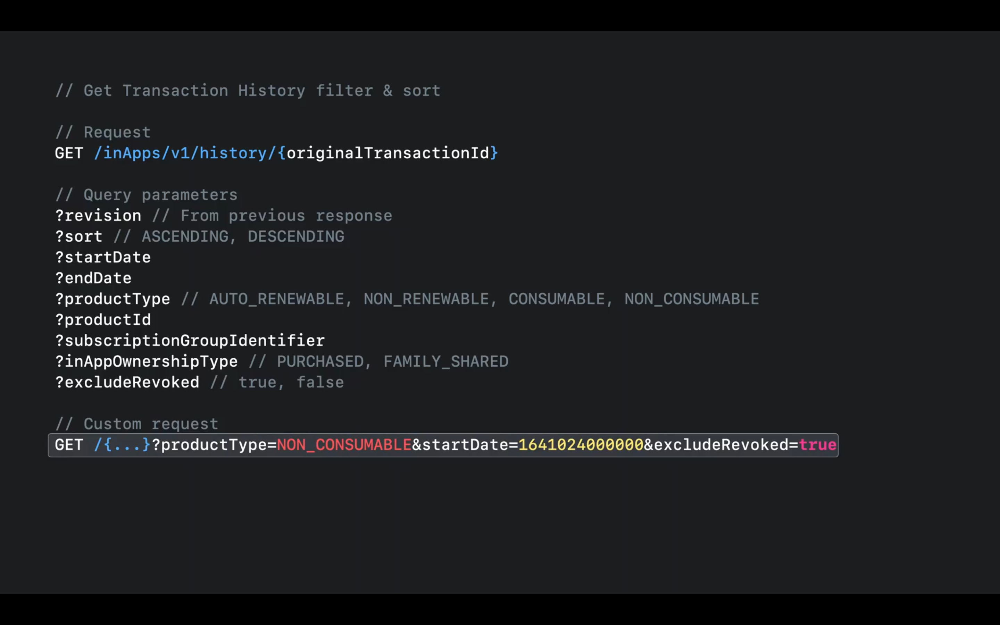

**需要特别注意的是：上面这些过滤条件之间是或的关系，只要满足其一就会展示**。因此，倘若我们需要筛选包含非消耗型及自动续期订阅型的历史订单，可以通过重复传参的方式进行，如下图示

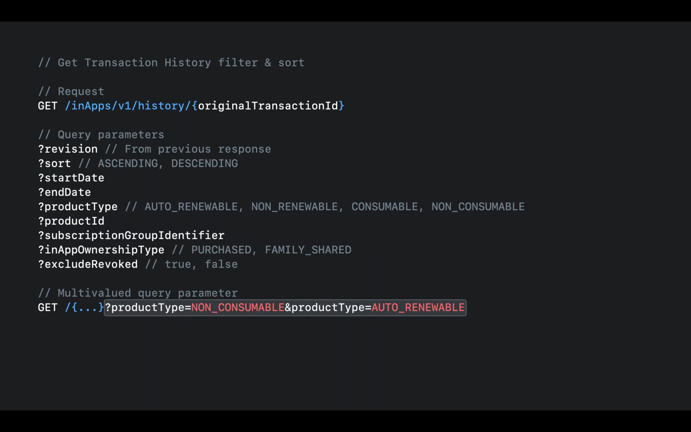

该接口能力落地以后，理论上我们可以仅通过上传 originalTransactionId + Get Transaction History API 的模式进行校验 。此前不可行的原因是因为单次请求时耗接近 1.5s，若加上分页时耗则可能比 App Receipt + verifyReceipt API 模式时耗更大。如今该条件过滤器能力落地后，能够快速筛选出最新的订单进行处理。

对比上传 JWS Receipt + 开发者后端证书链校验的方案，该模式上传数据量相对较少，但请求时耗不够稳定，且苹果服务质量相对开发者自身服务质量也难以保证，建议灰度试点对比后，再决定是否使用上传 originalTransactionId + Get Transaction History API 的校验模式。

### App Store Notifications V2：增强后台通知稳定性

长期以来，后台通知存在因为多方原因（苹果、运营商中间链路）等多方因素导致的异常。有时候在没有任何变更的情况下，我们会突然出现收不到后台通知的情况，或者后台通知量级骤降，次日骤升的情况。这类链路不稳定会导致订阅发货不实时、退款索回不实时等诸多问题，因此一直为开发者诟病已久。终于，苹果本年为此做出了巨大的努力，推出了下文所说的两点新特性。

#### 增加链路连通性验证相关接口

首先是验证通知链路可靠性功能，其通过**请求发包、接收发包、确认发包状态**三步来观察“开发者 => 中间链路 => 苹果 => 中间链路 => 开发者”这一整体链路状态。为了实现这三步，本次新增了以下三个能力：

- Request a Test Notification（App Store Server API）：调用后可请求苹果往配置好的 V2 通知地址发送 TEST 类型通知，并获取校验 Token
- TEST 通知类型（App Store Notifications V2）：用于验证链路的测试通知类型，不包含任何交易内容
- Get Test Notification Status（App Store Server API）：需使用校验 Token 调用，调用后可获得测试通知的接收状态及原数据

该功能具体使用方式如下：

1. 请求苹果发送 TEST 类型通知（App Store Server API）：请求后，会获得一个 `testNotificationToken`，用于第三步确认状态，因此我们需要对信息进行存储。

    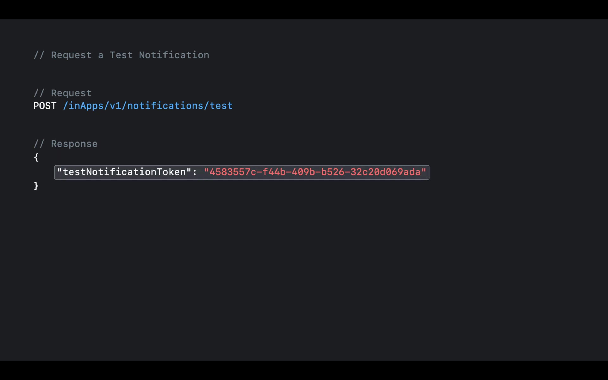

2. V2 TEST 类型通知（App Store Notifications V2）：请求后，若配置 V2 类型的服务器通知，会接收到 TEST 类型的相关通知**（若配置的是 V1 类型的服务器通知，无任何响应）**。

    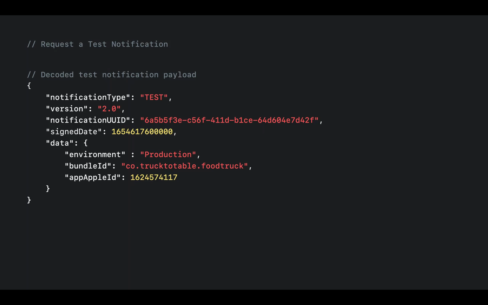

3. 我们可以通过第一步获得的`testNotificationToken` + Get Test Notification Status API 来确认当前的通知链路状态。

    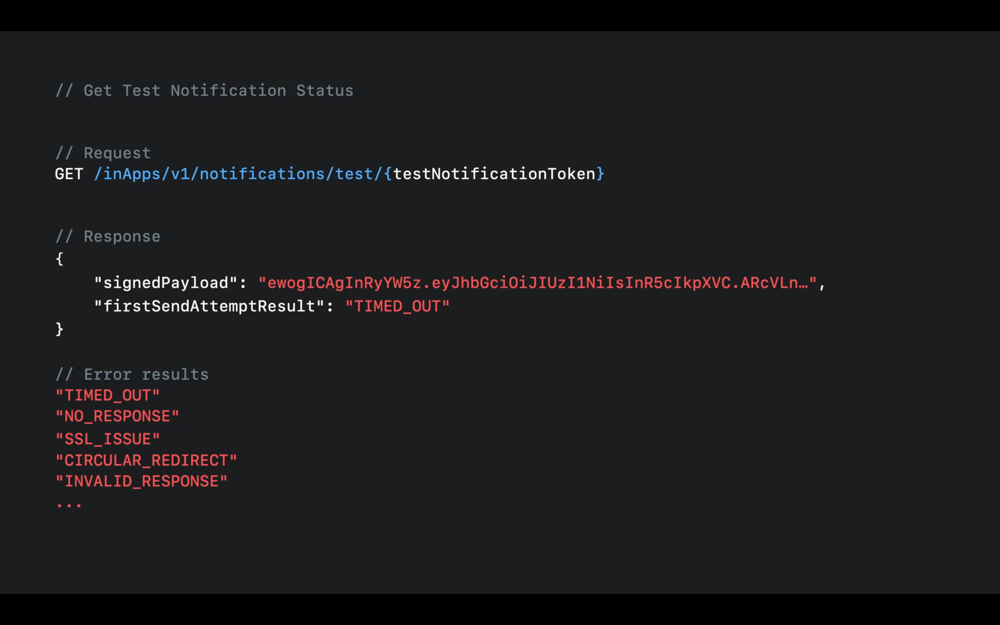

这个功能可以协助我们快速排查一些链路上的异常，以进行相应的修复优化，能够一定程度上解决链路异常的排查问题，但是仍有链路异常恢复的问题需要再做进一步考虑。另外在我看来，该功能不适用于 App Store Notifications V1 也是一个比较尴尬的点。

#### Get Notification History

对于 App Store Notifications V2 而言，当通知失败的时候，会在第 1、12、24、48、72 小时重试（App Store Notifications V1 为 6、24、48 小时重试），另外重试策略仅在苹果现网有效。这也就意味着，在以往的情况下，一旦过了 72 小时，通知丢了就再也找不回来了。

为了解决该场景的问题，苹果今年推出了 Get Notification History App Store Server API：我们可以通过该接口拉取**近六个月**、**V2 类型的后台通知数据**。

我们可以通过以下方式进行请求，该接口需要传入以下参数。

- startDate：关键参数，捞取的开始时间
- endDate：关键参数，捞取的结束时间
- originalTransactionId：可选参数，订单数据
- type：V2 通知类型
- subType：V2 通知子类型

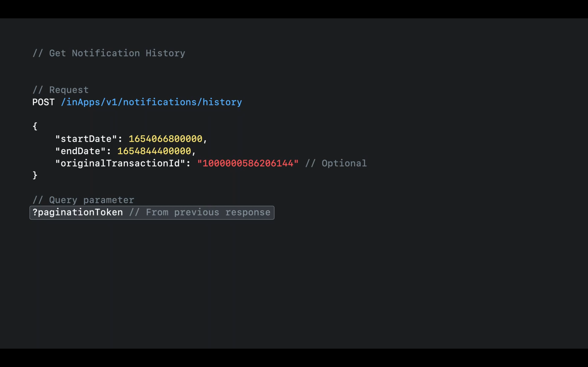

**需要特别说明的是，此处参数之间的关系是并的关系，也就是满足了所有条件的数据才会显示**（注意区分 Get Transaction History 过滤器）。此外，此处同样涉及分页，同样是 20 条数据每页，但对比 revision，苹果又新命名了一个 paginationToken 字段表示分页 Token。可以看到，我们可以从回包数据观察每个通知的接收情况。

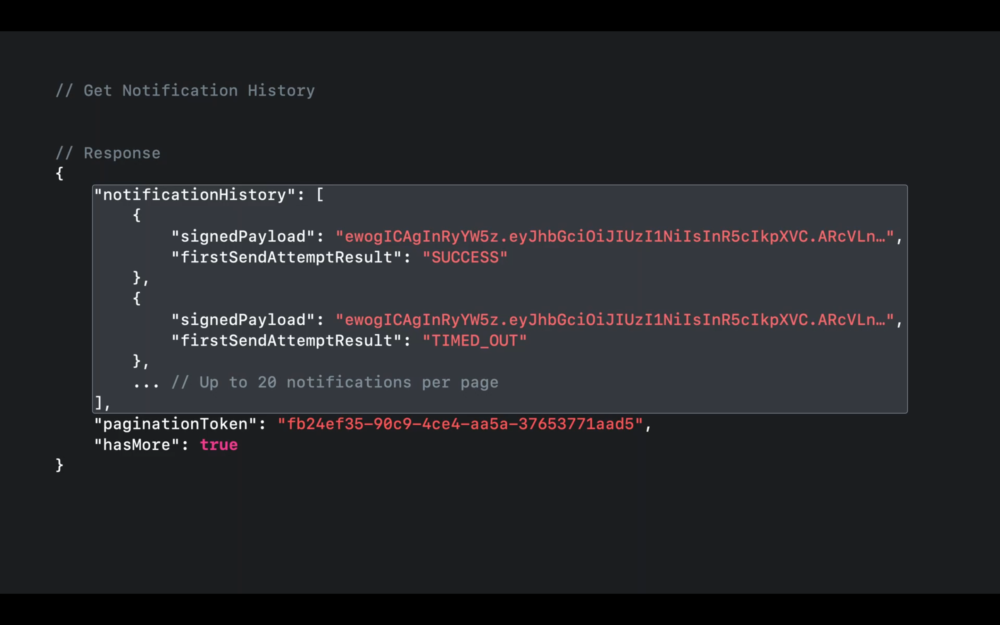

## 总结

在我看来，本次 WWDC22 上，IAP 相关的变更主要在一些小修小补的点上。本次虽无 WWDC21 的大拆大建，倒也对后台通知链路可靠性、透传能力对齐等关键问题作出了极大的优化，可以看出苹果对 IAP 这块越发重视，也以更加开放的心态回应开发者的诉求。以下为本次 WWDC22 的新特性整理表格，可用作速读回顾。

|                                                          痛点                                                           |                                新特性                                 |        新特性适用场景         |                               备注                               |
| :---------------------------------------------------------------------------------------------------------------------: | :-------------------------------------------------------------------: | :---------------------------: | :--------------------------------------------------------------: |
|                                            StoreKit 2 中无法确定应用购买记录                                            |                       新增 App Transaction API                        | 校验付费 App；校验预订时间等  |       注意与以前的体验保持一致，建议提供主动触发校验的按钮       |
| StoreKit 2、App Store Server API、App Store Server Notifications V2 无法获取环境信息；StoreKit 2 无法获得币种进行格式化 |                             添加相关字段                              | 区分沙箱 / 现网数据；获取币种 |        **StoreKit 2 相关新增字段均向前兼容，支持 iOS 15**        |
|                StoreKit 2、App Store Server API、App Store Server Notifications V2 无法判断连续订阅用户                 |                 新增 recentSubscriptionStartDate 字段                 |      用于判断用户忠诚度       |        需要注意该字段代表的是“**连续订阅用户**”的开始日期        |
|                 SwiftUI 上，无法通过快捷方便的方式展示 Offer Code 兑换界面、评分界面，需要经过中转处理                  |         新增 offerCodeRedemption 修饰符 / requestReview 接口          |       用于 SwiftUI 场景       |                         **仅限 iOS 16**                          |
|                                            StoreKit 2 中无法延迟展示苹果消息                                            |                       新增 StoreKit Message API                       |   用于延迟展示苹果消息场景    |            需要尽量考虑兼容未来可能出现的其他 Message            |
|                                      Original StoreKit 中不存在稳定可靠的透传字段                                       | 支持 Original StoreKit applicationUsername 字段透传至 appAccountToken |         用于信息透传          |  **applicationUsername 必须为 UUID 格式，需考虑向前兼容的问题**  |
|                                         Get Transaction History API 数据量较多                                          |                              增加过滤器                               |       用于快速筛选信息        | 过滤器仅限 Get Transaction History API；**多个条件之间为或关系** |
|                                        难以对苹果后台服务器通知链路异常进行排查                                         |                      增加链路连通性验证相关接口                       |     用于排查通知链路问题      |                      **仅支持 V2 类型通知**                      |
|                                   当后台服务器通知因链路异常导致丢失时，难以找回数据                                    |                  增加 Get Notification History 接口                   |      用于获取遗漏的通知       |             仅支持拉取近**六个月**的 **V2 类型通知**             |
