# WWDC22 10016 - 使用 CarPlay 扩展你的 App

>作者：kk, 全栈开发者，就职于字节跳动公司，侧重隐私安全领域。
>审核：

本文是根据 WWDC22 中的 [Get more milleage out of your app with CarPlay](https://developer.apple.com/wwdc22/10016) 撰写，主要是了解 CarPlay 在 iOS 16 中的新增功能。

## 引言

先做个简单的科普，CarPlay 是苹果推出的车机交互系统，可以让你在汽车的中控屏中使用你的手机 App 能力，因为苹果对于应用要求的限制，所以现有的功能大部分是导航以及音乐、FM 类的。

因为平时使用 CarPlay 比较多，也比较了解 CarPlay 的一些优缺点。在我看来 CarPlay 的好处在于让你很方便的在你驾驶的时候使用你的 App 程序，在获得需要的信息的同时不会被多余的信息干扰。而 CarPlay 的缺点我认为则是跟车机的交互深度不够深入，例如特斯拉可以通过一个屏幕控制车机的所有东西，而 CarPlay 只能控制你手机 App 的内容。

在这次 WWDC 中介绍了几分钟关于 CarPlay 的内容，根据发布会的内容结合此文，下面给大家介绍下 iOS16 中将会出现的 CarPlay 新特性。该主题偏介绍性，大家可以当做休闲读物来看，至于真正的开发需要参考 [Apple CarPlay 开发指南](https://developer.apple.com/carplay/documentation/CarPlay-App-Programming-Guide.pdf)。

## 概览

本文主要是介绍了 iOS 16 中 CarPlay 的新特性，包括:

1. 新增的两种应用类型。
2. 一种新的 CarPlay 测试方式。
3. 绘制内容到汽车仪表盘中。

除此之外为了更方便大家理解对应的内容，我先简单介绍了下 CarPlay 的开发方式。

## 如何进行 CarPlay 开发

### 获取授权

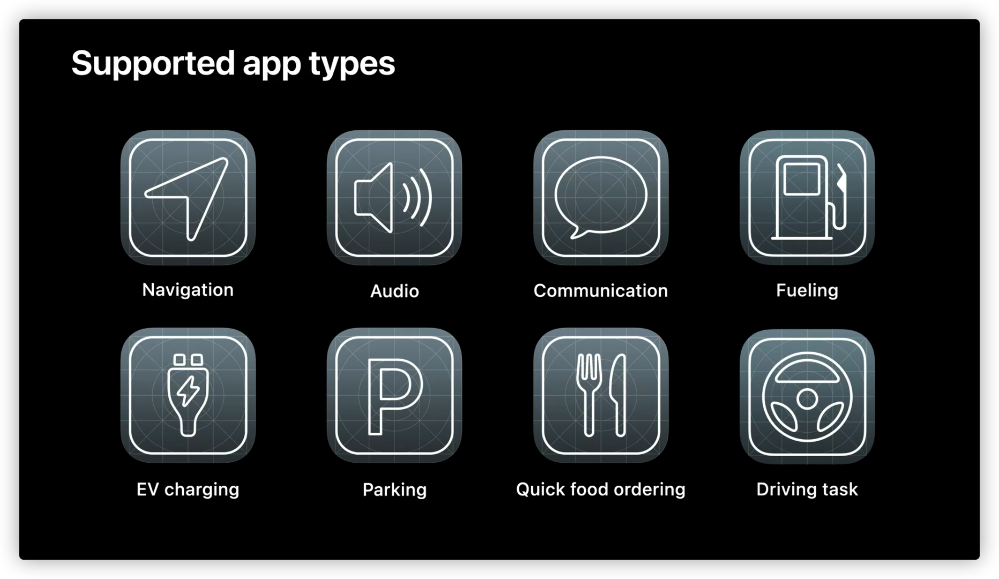
上架 CarPlay 应用的审核非常严格，你的应用必须符合苹果对于 CarPlay 的应用定义才能通过审核，同时只能支持一种应用类型。这也是为了驾驶安全着想，例如上架一些游戏应用，就会非常影响驾驶安全。目前 iOS 支持了六种应用类型 (图中左边三列)，并在 iOS 16 中提供了两种新的应用类型，加油和驾驶任务类型 (最右边一列)，在新特性的一节我们会重点介绍。
所以开发 CarPlay 应用我们要确认自己的 App 是否属于上述几种，确定后再前往 Apple 官网申请对应的 CarPlay 权限。只有拥有了 CarPlay 权限才有资格进行测试和上架。
参考文档：[申请 CarPlay 权限](https://developer.apple.com/documentation/carplay/requesting_carplay_entitlements?language=objc)

### 开发 CarPlay 应用

首先我们要明白 CarPlay App 是附属于 iPhone App 的，它们是同一进程。如果是先启动了 CarPlay App，那么系统会在后台启动你的 iPhone App。

- 如果杀死了 iPhone App 进程，那么 CarPlay App 就会关闭。
- 如果关闭 CarPlay App ，iPhone App 进程不会被杀死。
- 在 iOS 13 中，Apple 对 CarPlay 做了改进，CarPlay App 和 iPhone App 可以一个处于后台一个处于前台。而 iOS 13 之前 CarPlay App 和 iPhone App 是高度绑定的，只能共处前台或后台，用户体验不好。例如你在使用 CarPlay 导航时，手机将无法进行别的操作，否则会打断导航进程。

可以理解为 CarPlay 应用和 App 应用实际是一个应用的两个展示形态，CarPlay 的屏幕展示是依附于 App 实现的。所以我们开发 CarPlay 应用的时候就是在 App 工程中写代码。在这里会用到 iOS 13 的新特性 UIScene。

```swift
<key>UIApplicationSceneManifest</key>
<dict>
    <key>UIApplicationSupportsMultipleScenes</key>
    <false/>
    <key>UISceneConfigurations</key>
    <dict>
        <key>CPTemplateApplicationSceneSessionRoleApplication</key>
        <array>
            <dict>
                <key>UISceneClassName</key>
                <string>CPTemplateApplicationScene</string>
                <key>UISceneConfigurationName</key>
                <string>CarPlaySceneConfiguration</string>
                <key>UISceneDelegateClassName</key>
                <string>$(PRODUCT_MODULE_NAME).CarPlaySceneDelegate</string>
            </dict>
        </array>
    </dict>
</dict>
```

我们需要在 Info.plist 里声明一个新的 Scene 给 Carplay 使用。

```swift
import CarPlay

class CarPlaySceneDelegate: UIResponder, CPTemplateApplicationSceneDelegate {
    var interfaceController: CPInterfaceController?

    func templateApplicationScene(_ templateApplicationScene: CPTemplateApplicationScene,
            didConnect interfaceController: CPInterfaceController) {

        self.interfaceController = interfaceController
        let item = CPListItem(text: "Rubber Soul", detailText: "The Beatles")
        let section = CPListSection(items: [item])
        let listTemplate = CPListTemplate(title: "Albums", sections: [section])
        interfaceController.setRootTemplate(listTemplate, animated: true)
    }

    func templateApplicationScene(_ templateApplicationScene: CPTemplateApplicationScene,
            didDisconnect interfaceController: CPInterfaceController) {
        self.interfaceController = nil
    }
}
```

然后使用模板 (Template) 生成对应的视图控制器显示内容，最后就像我们平时开发一样继续做逻辑处理即可。详细内容可以参考：[显示内容到 CarPlay](https://developer.apple.com/documentation/carplay/displaying_content_in_carplay?language=objc)
在上面我们引入了模板的概念，这个在 CarPlay 应用开发过程中是极为重要的一个概念。

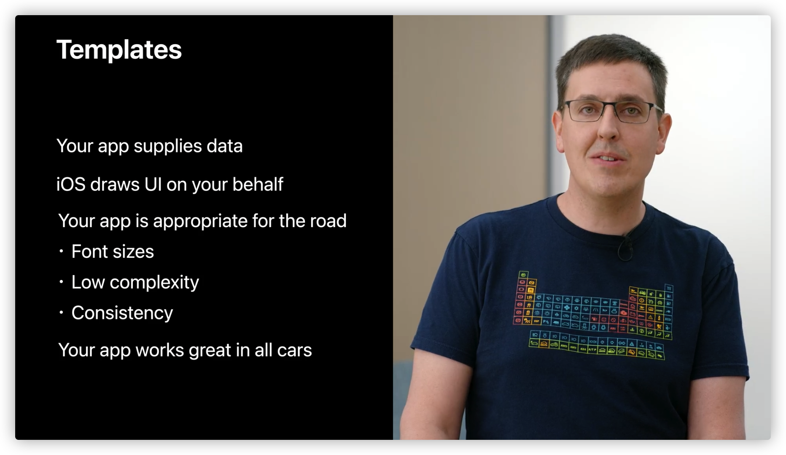
模板是苹果用来绘制 CarPlay 应用的一种方式，他给你提供了几种内置的模板，你只需要提供对应模板的数据，CarPlay 应用会自动根据你提供的数据和模板来渲染视图。模板的作用其实有点像 Swfift UI 的简化版，通过数据来驱动 UI 的绘制，这个很像我之前做过一个项目，我们在本地内置好组件 UI，通过自定义的 DSL 语言下发配置渲染。

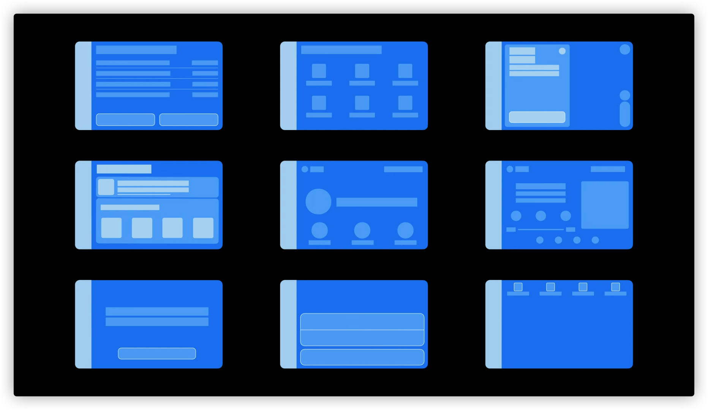

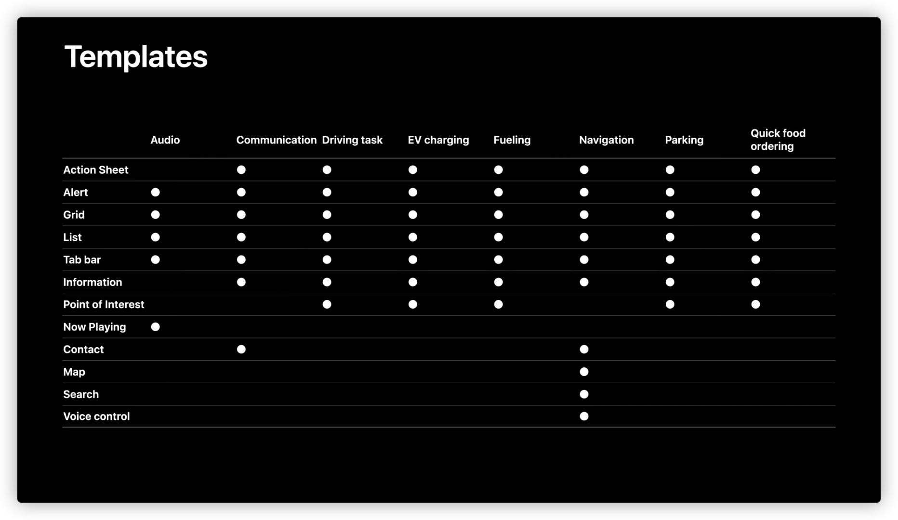

上面两幅图是苹果现在提供的几种模板类型，以及对应的模板适合哪种场景使用。看起来是覆盖了比较多的交互场景。

通过这种方式，一是方便了开发者来开发对应的 UI，另一个苹果也能更好的让你的 CarPlay 应用工作在各种不同形状的屏幕上。而缺点则是对应的 APP 视图类型会比较死板，被苹果限制的比较死。我认为这也是苹果想要的，CarPlay 是在驾驶过程中使用的，崇尚的是简洁、安全不干扰驾驶。通过模板可以很大程度上限制开发添加干扰驾驶者的功能操作。
我们通过上述示例代码的模板给大家简单讲解下模板的作用

```swift
let item = CPListItem(text: "Rubber Soul", detailText: "The Beatles")
let section = CPListSection(items: [item])
let listTemplate = CPListTemplate(title: "Albums", sections: [section])
```

CPListTemplate 是列表类视图的模板，他就像 App 平时开发过程中的 UITableView。是应用最为广泛的场景，而在 CarPlay 开发中，我们无法像 TableView 一样灵活定制自己的 Cell。而是只能靠上述 CPListItem 的各种属性来展示 UI，例如上述就是给这个 Item 设置了标题和详细信息。因为开发方式比较固化，所以他提供了更多灵活的属性让你在一定范围内可以定制这个 Item，例如: 对应的 Item 是否在播放音乐 (playing)、是否可点击 (enabing) 等等。
可参考: [CPListItem](https://developer.apple.com/documentation/carplay/cplistitem?language=objc)

## iOS 16 新特性

### 新的应用类型

#### 加油应用

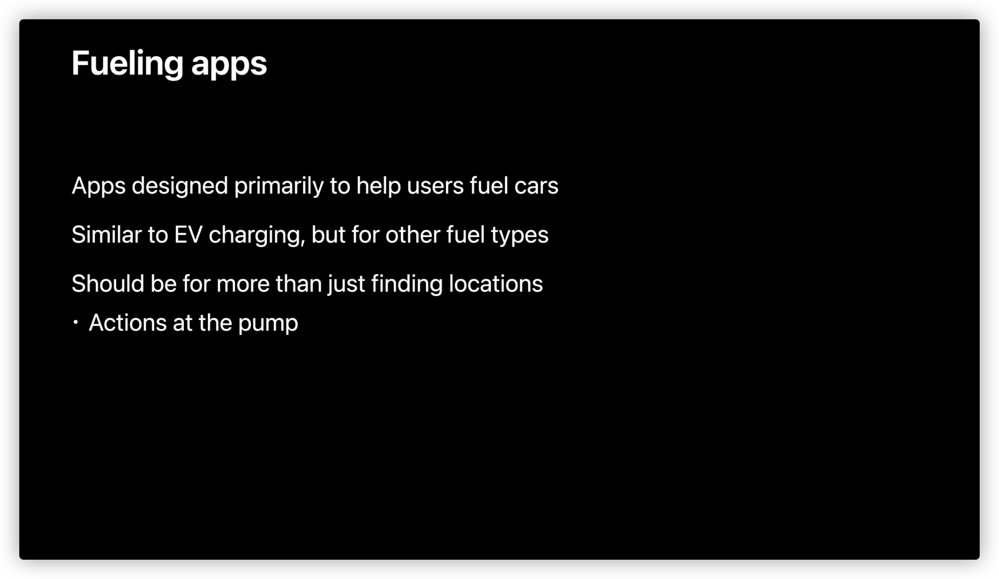

在 iOS 14 中，苹果支持了充电的应用类型(具体参考[WWDC20](https://developer.apple.com/wwdc20/10635))，方便用户寻找充电桩并使用充电桩，对此在新的系统中苹果希望也能够支持传统的续航模式-加油，因为大部分导航本身就有寻找加油站的功能，所以加油类应用不应该只是一个寻找加油站的功能，而是更多能够帮助用户进行加油的操作，比如：启动加油枪。我觉得中石油可以做个这样的 App，油枪选择到结账一站式服务。

#### 驾驶任务应用

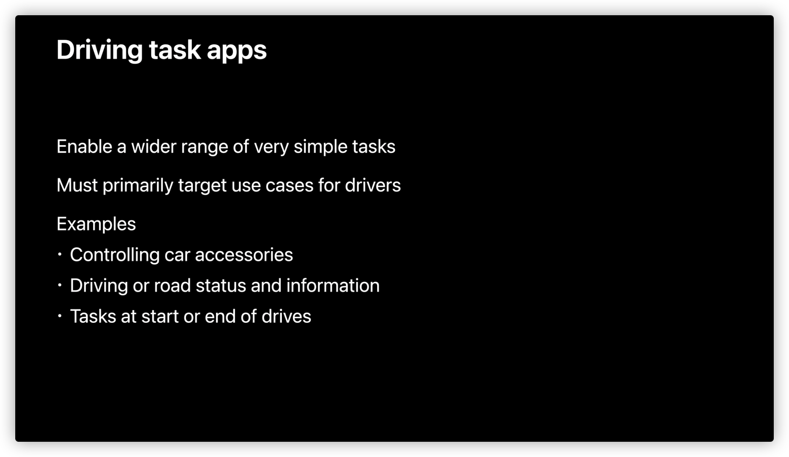

苹果对于驾驶任务的定义是：

1. 能够提供给你的驾驶更多的帮助
2. 一些很简单的驾驶任务，在单屏即可完成所以操作

比如控制汽车的一些功能、提供路况信息、开始和结束的驾驶任务。

文中介绍了几种应用场景，这里简单介绍下，有个概念即可。

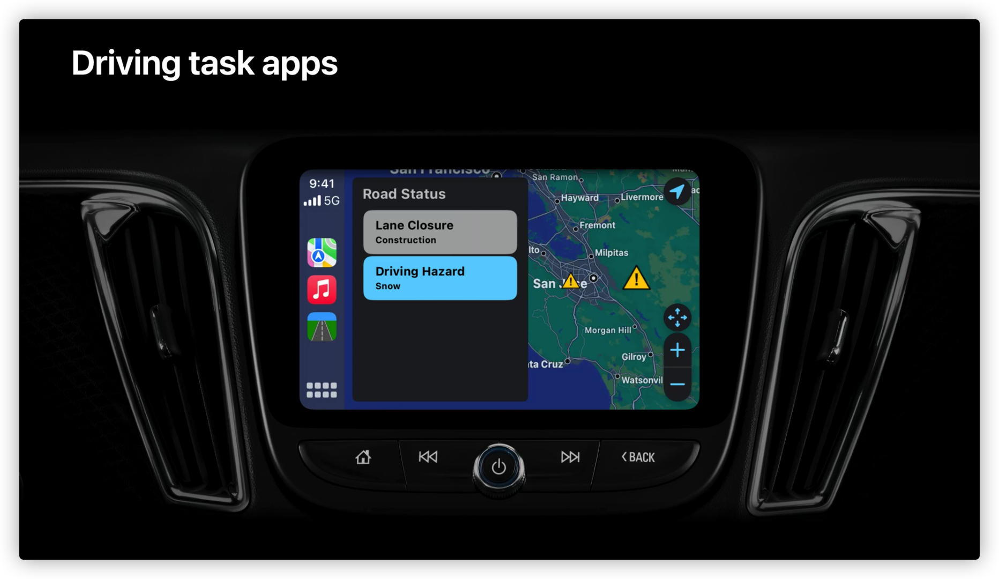

基于 `CPPointOfInterestTemplate`构建，提供一些附近的路况信息，比如附近在下雪之类的，我认为好像没啥用，百度地图都有了(狗头)。

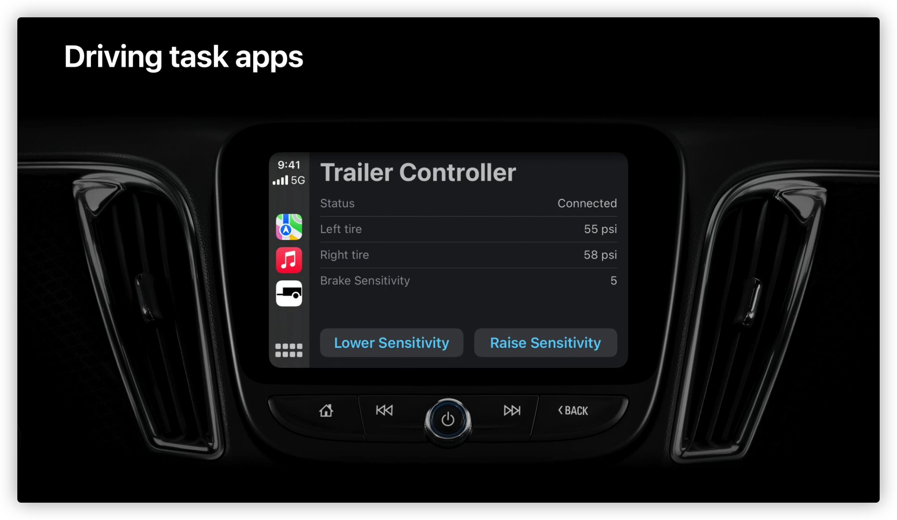

基于 `CPInformationTemplate` 构建，用于控制拖车功能，界面十分简洁，只有两个操作的按钮。

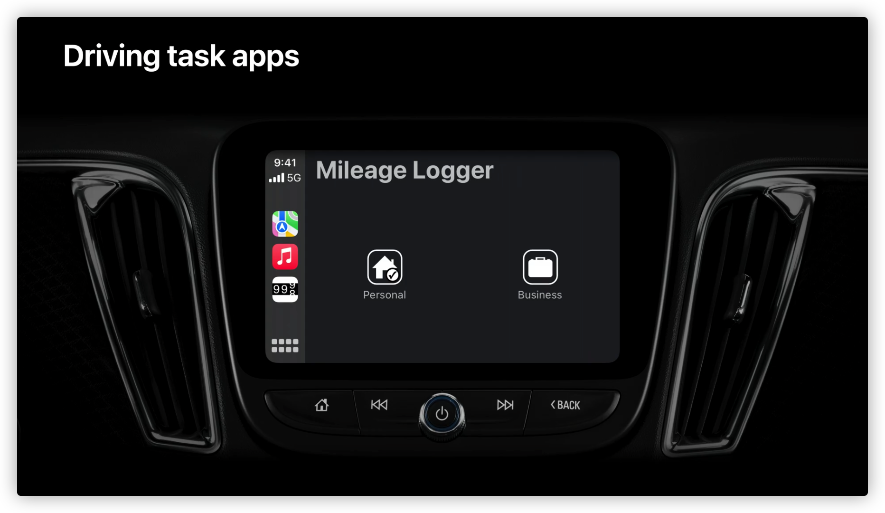

基于 `CPGridTemplate` 构建，很简单的里程记录器，可记录商务出行和个人出行。

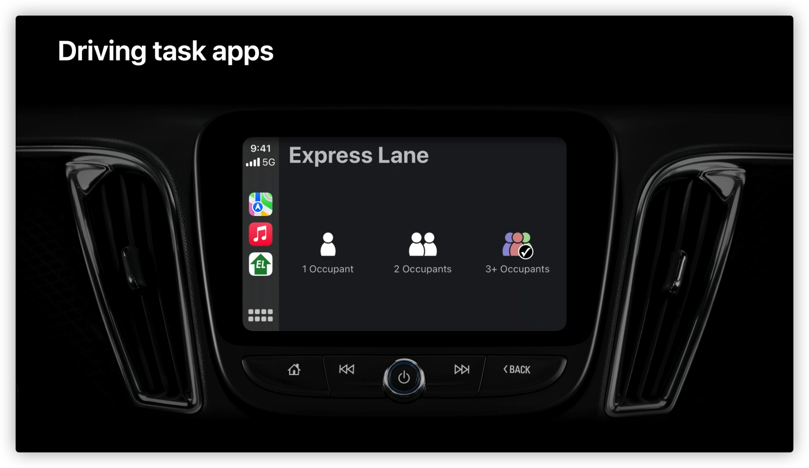

基于 `CPGridTemplate` 构建，高速路收费转发器，选择有几个乘客，这里不是很懂，应该是美国那边的高速按人收费的？

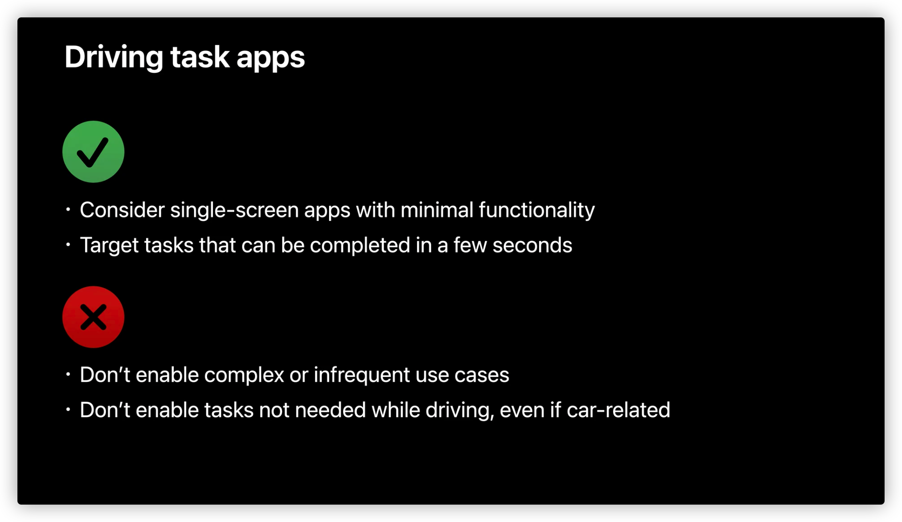

通过上述几个驾驶任务 App 的描述，苹果引出了对于驾驶任务 App 的设计原则：

1. 单屏类简单任务，能够几秒内完成。
2. 不要用于和驾驶无关的任务。(文中还用这不是 The kitchen sink 来说明这个原则，大家有兴趣可以了解下这个梗😊)

### 如何测试 CarPlay 应用

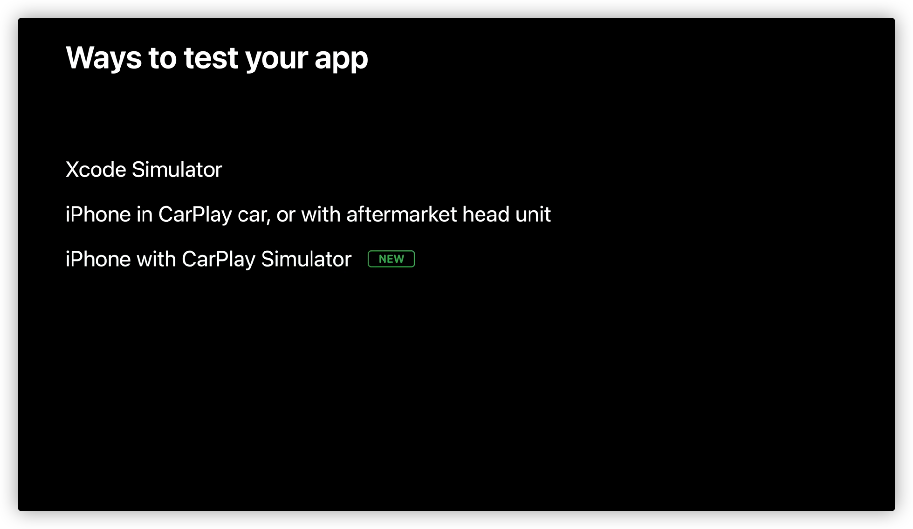

测试 CarPlay 应用主要有三种方式:

1. Xcode 模拟器。
2. 买一辆车。
3. 船新推出的 CarPlay 模拟器，也是接下来要重点介绍的。

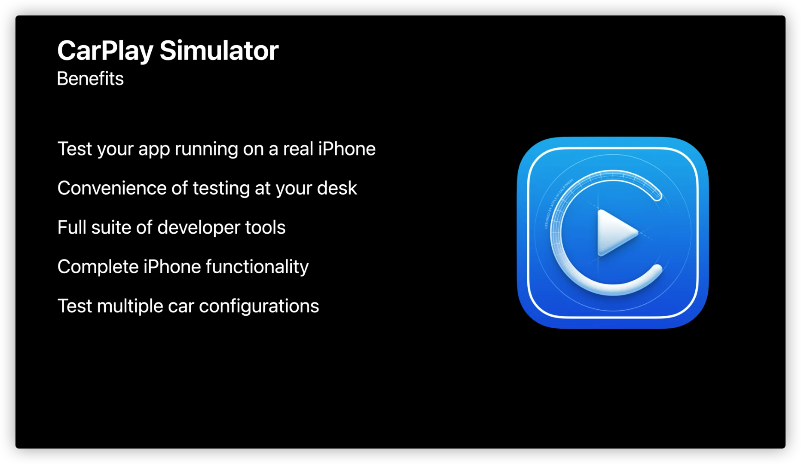

下载方式不细节介绍了，大家可以去 [CarPlay 专栏](https://developer.apple.com/carplay/)下载使用。我们来看看为什么已经有 Xcode 模拟器和一辆车 (假装你有）后，苹果还推出了这个 CarPlay 模拟器，它相对于前两种有什么优势。

可以看到他是连接你的 iPhone 使用的，使用的是真实的 iPhone 环境，这可以测试很多真实场景，例如 App 声音和收音机声音的混合效果，这就是模拟器无法做到的。其次你可以不离开你的桌面就能进行测试，总不能发现个问题就去停车场连接测试。

其次他也提供了很多方便测试的开发工具，还能让你测试对于不同汽车配置的兼容（例如屏幕大小）。

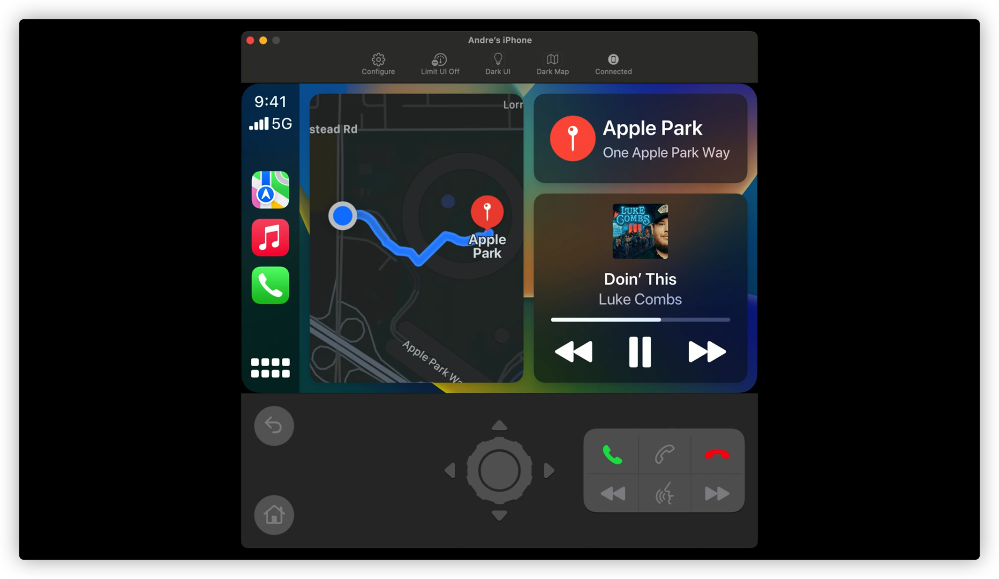

打开模拟器，可以看到上面有很多按钮，除一些比较简单的功能，像是语音识别、电话模拟、浅/暗色主题切换、断开连接模拟。他还支持了模拟很多车都有旋钮操作 (图中的上下左右功能），以及接下来重点阐述的高级配置功能。

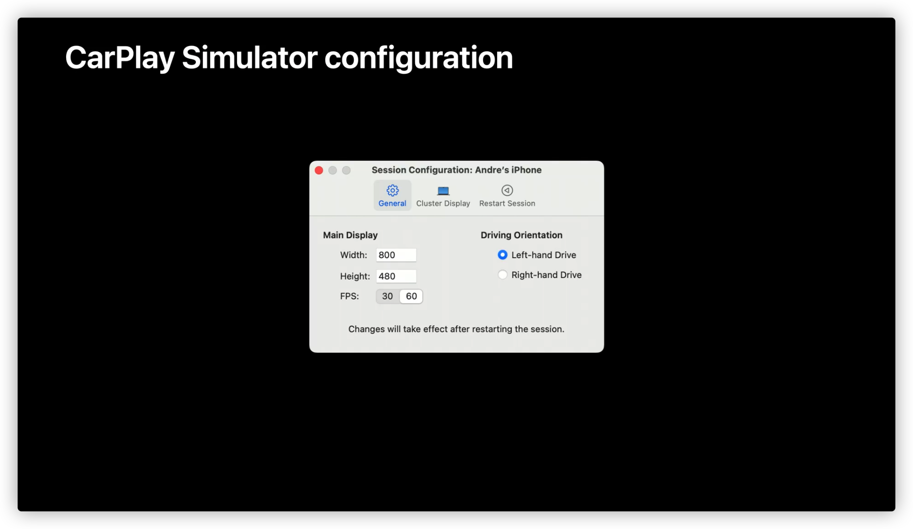

可以设置 CarPlay 屏幕的大小和方向盘位置。

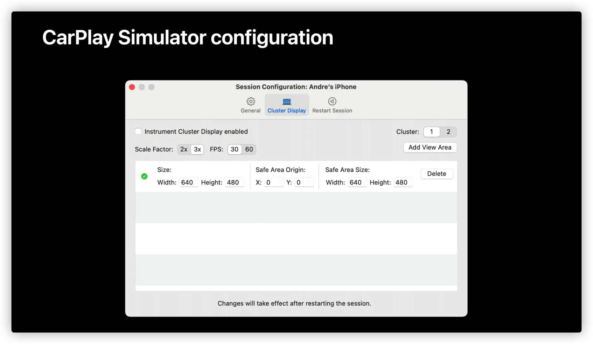

设置仪表盘的大小和安全显示区域。

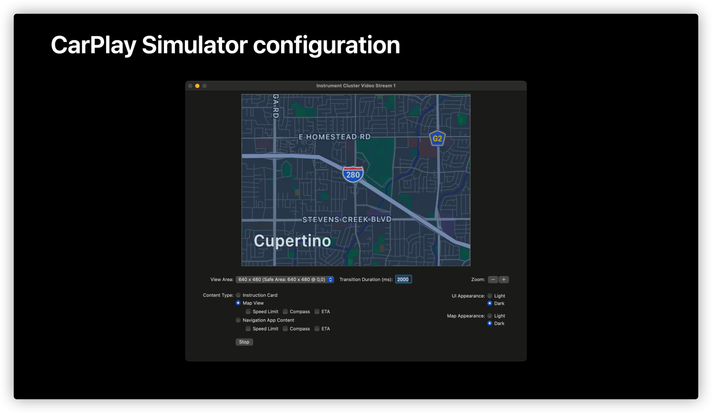

设置好仪表盘大小后，重新启动就会出现一个新的视图用来表示仪表盘内容。关于仪表盘显示视图是接下来要讲的，也是最后一个新的特性，是我认为比较有用的功能。

### 仪表盘视图

在这里其实有两个仪表盘，一个是 CarPlay 的仪表盘 (CarPlay Dashboard，类似 CarPlay 的 iPhone 主屏)，一个是汽车的仪表盘 (Instrument Cluster)。而 CarPlay 仪表盘是已经支持 App 显示了，本次要讲的是在汽车仪表盘中展示我们的 App 内容。

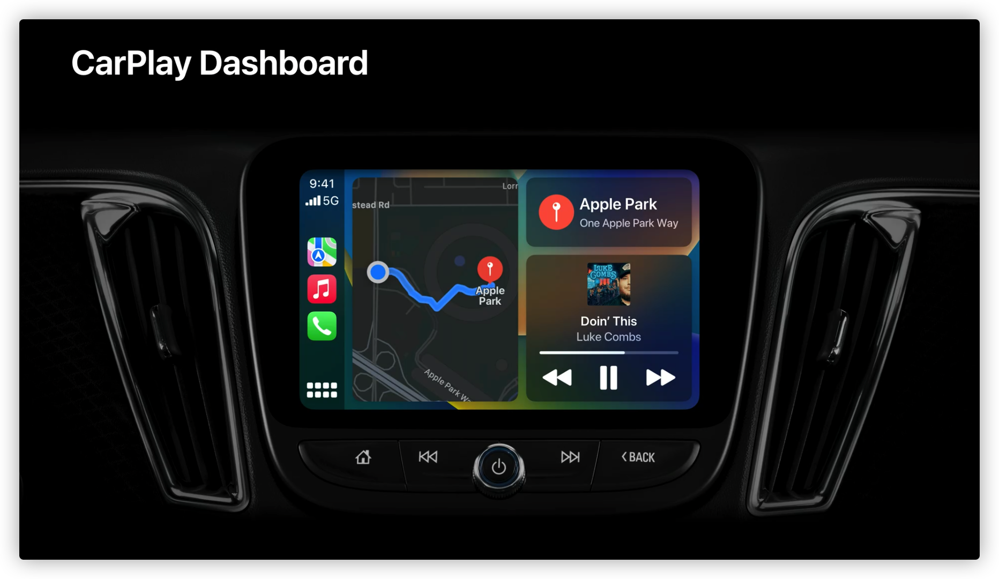

汽车仪表盘的使用方式和 CarPlay 仪表盘的使用方式其实很像，都需要在 Plist 里面声明 key 以及在 SceneDelegate 中绘制视图。

```swift

<dict>
    <!-- Indicate support for CarPlay dashboard -->
    <key>CPSupportsDashboardNavigationScene</key>
    <true/>
    <!-- Indicate support for instrument cluster displays -->
    <key>CPSupportsInstrumentClusterNavigationScene</key>
    <true/>
    <!-- Indicate support for multiple scenes -->
    <key>UIApplicationSupportsMultipleScenes</key>
    <true/>
    ...
<dict/>

```

在 Info.plist 中声明最新的  `UIApplicationSupportsMultipleScenes`  和 `CPSupportsInstrumentClusterNavigationScene` 值为 True。

```swift
extension TemplateApplicationSceneDelegate: CPTemplateApplicationInstrumentClusterSceneDelegate {
    
    func templateApplicationInstrumentClusterScene(
        _ templateApplicationInstrumentClusterScene: CPTemplateApplicationInstrumentClusterScene,
        didConnect instrumentClusterController: CPInstrumentClusterController) {
        // Connected to Instrument Cluster
        TemplateManager.shared.clusterController(instrumentClusterController, didConnectWith: templateApplicationInstrumentClusterScene.contentStyle)
    }
    
…

    func instrumentClusterControllerDidConnect(_ instrumentClusterWindow: UIWindow) {
        // Window in which to draw instrument cluster contents 
       self.instrumentClusterWindow = instrumentClusterWindow
    }
```

实现  `CPTemplateApplicationInstrumentCluster Scene Delegate`，这会提供给你一个窗口让你绘制你的视图，并告诉你什么时候仪表盘出现和消失。

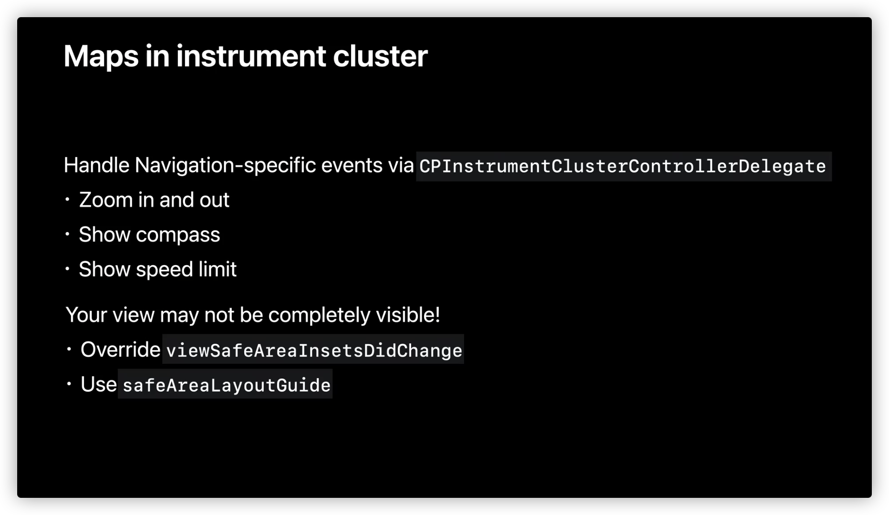

另外有些仪表盘还有放大缩小、显示速度的功能，你可以通过实现  `CPInstrumentClusterControllerDelegate`  代理来收到这些动作的通知，并及时做出应对。

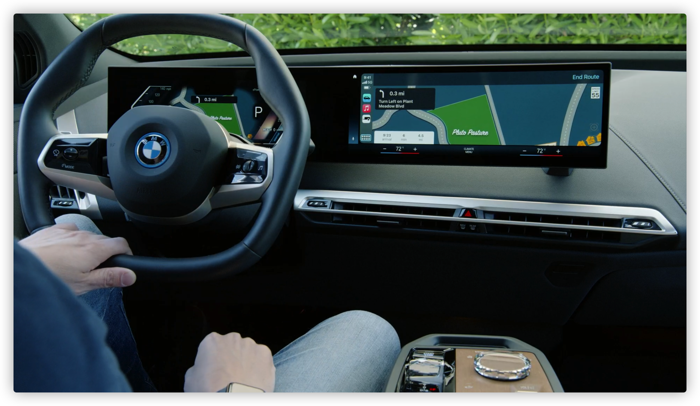

最后作者在他的豪车中给我们显示了下之前提到的很多应用，像拖车应用和旋钮在 CarPlay 中的适配效果、以及仪表盘视图的显示效果。

## 总结

本文除了 CarPlay 模拟器是有助我们开发应用的。剩下都是 CarPlay 的新能力介绍，对我个人来说，新的应用看起来是用途优先，但是从仪表盘展示功能可以看出苹果在这次更新中体现出了深度控制现有车机功能的野心，以后我们说不定不管什么车型 (支持 CarPlay ) 都可以通过一块屏幕控制车机的所有功能。
