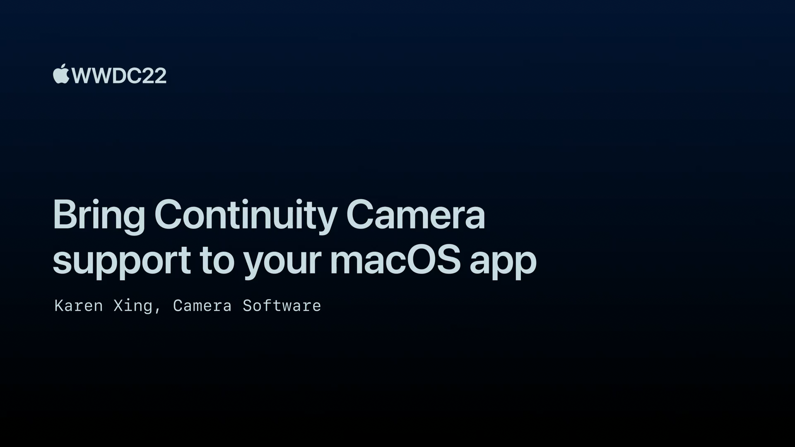

## 个人介绍

LeonardoLu，WWDC21 Swift Student Challenge Winner，就职于字节飞书音视频会议团队。

## 审核介绍

## 不超过 120 个字的文章简介

本文介绍了 macOS 13 和 iOS 16 的一个新的联动能力：Continuity Camera（连续互通相机）。这项能力将 iPhone 上优秀的摄像头模组和算力带到了 Mac 上面，并让大部分型号的 Mac 都能够受惠。Apple 不仅向我们展示了连续互通相机强大的功能/设计及其运用场景，同时演示了如何快速低侵入得集成连续互通相机的所有功能。

## 公众号/小专栏图文头图

