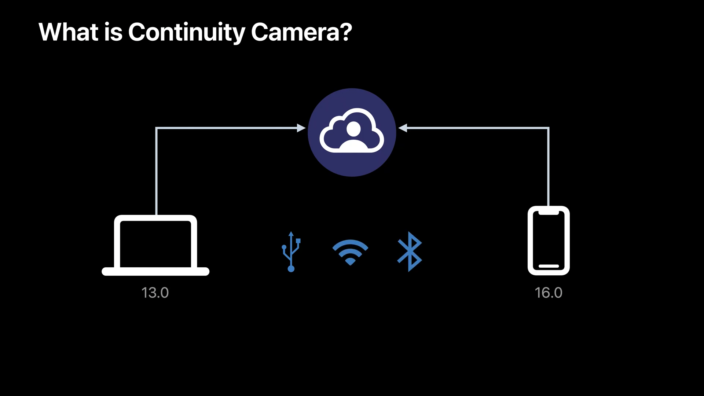
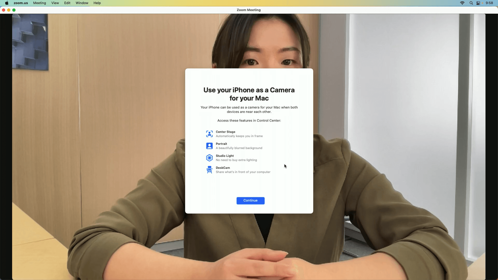
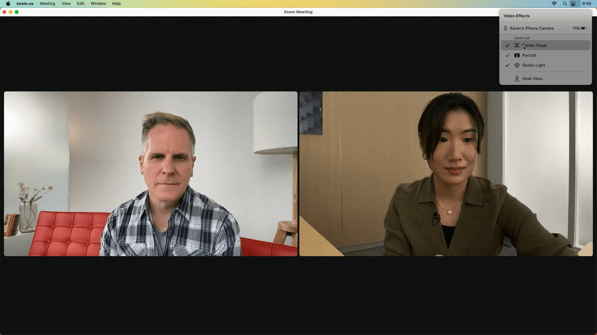
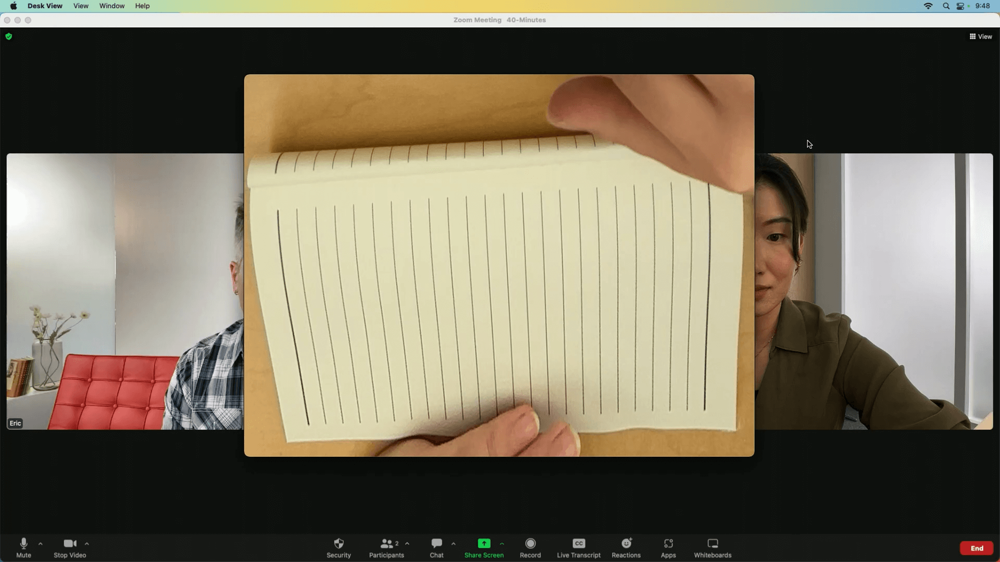
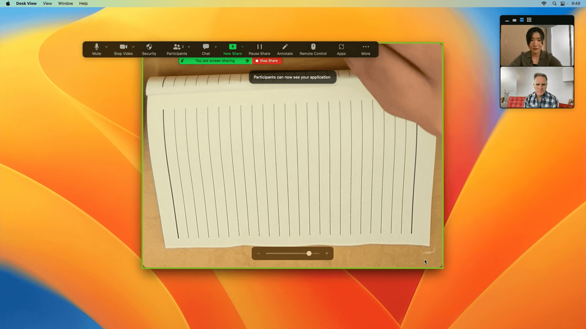
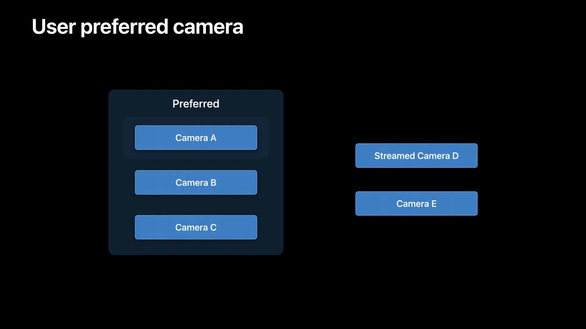
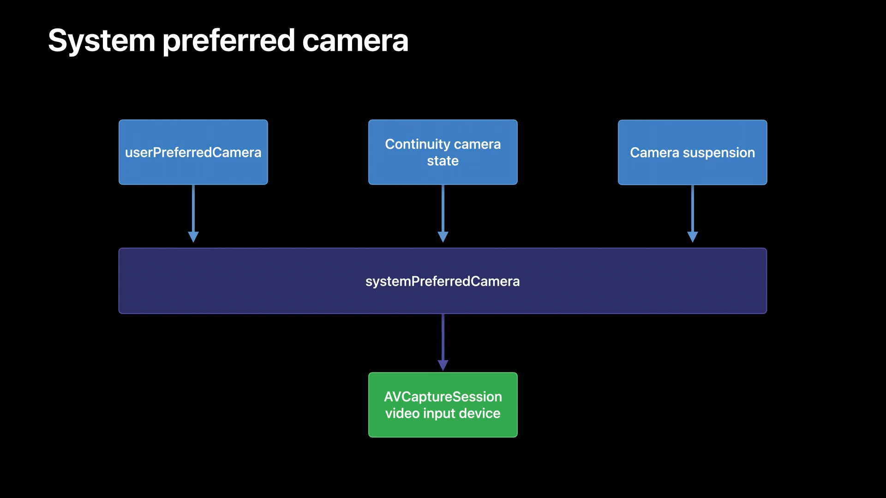
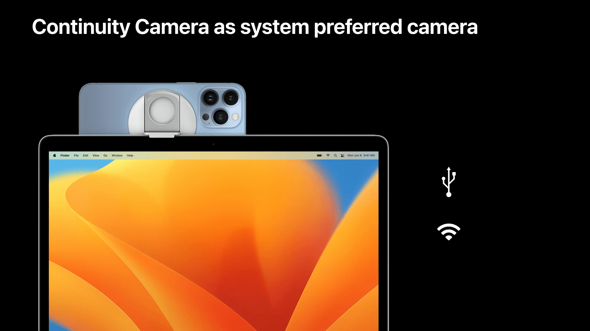
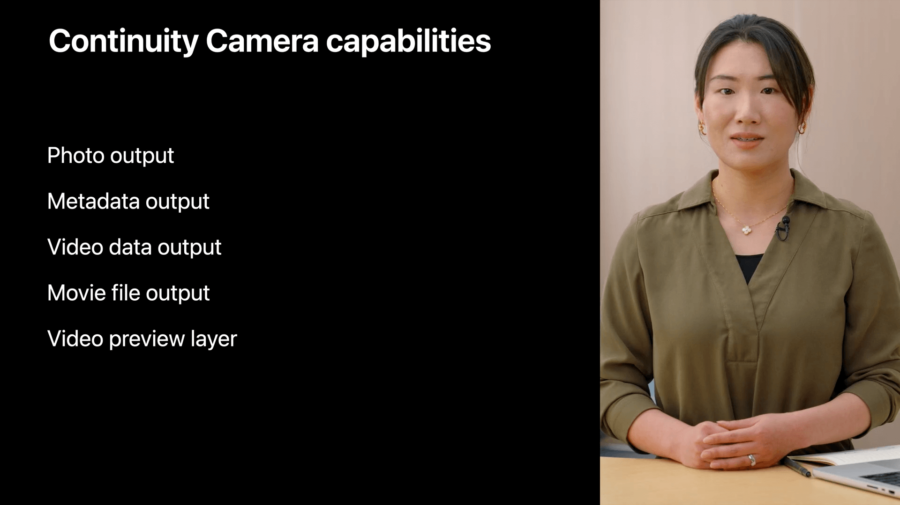
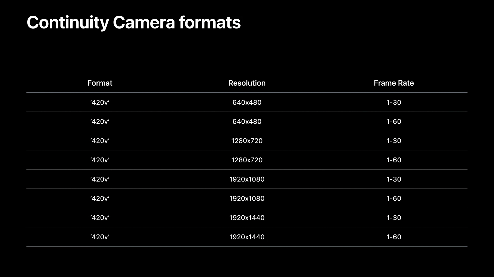

# Session 10018 为 macOS 应用支持「连续互通相机」

本文基于 [Session 10018](https://developer.apple.com/videos/play/wwdc2022/10018/)。

> 作者: LeonardoLu，WWDC21 Swift Student Challenge Winner，就职于字节飞书音视频会议团队。
>
> 审核者: anotheren（刘栋），老司机周报编辑，就职于丁香园 iOS 团队，Swift 老司机。

## 内容概述

Session 10018 向我们展示了 iPhone 和 Mac 的又一个联动能力：Continuity Camera（连续互通相机）-- 将 iPhone 与 Mac 连接后，将 iPhone 的摄像头作为外设被 Mac 识别。本文的内容分为三个部分:

- 介绍 Continuity Camera（连续互通相机）。
- 设计一个「优雅」的连续互通相机体验。
- 在 AVFoundation 中出现的新的 API。

> 本文后续将用「连续互通相机」指代 Continuity Camera。

---

## 什么是连续互通相机

Continuity Camera（连续互通相机）：通过 macOS 13 的新 API，Mac 能够将符合条件 iPhone 作为网络摄像头和麦克风使用；并且这种联动是无缝实现的，不需要特别的设置。

和其他 Mac 与 iPhone 的联动方式一样，连续互通相机要求两个设备登陆相同的 Apple ID 并开启双重身份验证、互相连接、近场等。

> iPhone 和 Mac 之间可以通过线缆、Wi-Fi+蓝牙等方式连接，和 Sidecar（随航）功能相似。
>
> **注意**，如果选择无线连接，那么必须同时开启 Wi-Fi 和蓝牙。



### Showcase

视频中，主讲人向我们展示了一些 App（Zoom）是如何利用这一功能来设计/增强现有视频会议能力。

#### Scene.1 连续互通相机的提示

首先，需要告诉用户正在使用连续互通相机；这其中不仅是设备的选择和使用，同时也展示了新支持的摄像头控制/特效。



#### Scene.2 连续互动相机与一般网络相机的不同

连续互动相机支持 iPhone 以任意四个方向放置；当 iPhone 垂直放置时，画面将自动对焦放大中间的画面；而当水平放置时，将提供更宽的水平方向的画面。

除此之外，还将支持一些已有的系统视频特效，例如：Center Stage、Portrait、Studio Light（需要 iPhone 12 及以上机型）。

1. Center Stage 借助于广角镜头，能够让不断移动位置的人物一直处于视频画面的中间位置。

2. Portrait 能够模糊背景突出人像的位置；这个功能原本只有在 Apple silicon 的 Mac 才能够使用，通过连续互动相机能够让所有的 Mac 都享受这一特效。

3. Studio Light 能够在恶劣的光照条件（比如：窗前）下提供更好的画面效果；它能够提供惊人的照明效果，暗化背景并照亮你的脸。

尽管每个特效都是分开介绍的，但是这些特效是可以同时开启并叠加使用。

相关内容可以参考 [What’s new in camera capture](https://developer.apple.com/videos/play/wwdc2021/10047/)。



#### Scene.3 全新的特效

> 本段提到的「桌面」一词均指的是「桌子的表面」而非「电脑桌面」。

如果想共同工作并共享桌面上的内容，您现在可以使用 Desk View（桌面视图）。Desk View 应用程序随 macOS 13 一起提供，可以在控制中心的启动。



它就像一个高架机位的摄像机，但不需要复杂的设备。 iPhone 会将超广角摄像头画面分成两部分，同时展示桌面和脸的画面；这样就可以在不调整摄像头位置的情况下，既展示人像，又可以展示一个类似投影仪的画面，在需要展示现实中的演示内容（例如：习题、绘图、特定物品等）相较于电子白板更加灵活；有意思的是，视频中虽然演示的是在桌面上的纸张上写字，但是在举例上提到了「编织针法」，这意味着 Desk View 的画面识别并不仅仅受限于背景分割十分明显的画面，可以预料到通过后续的算法迭代，这个功能对于画面中主要的部分捕捉会更加自由。

它利用超广角相机的扩展垂直视野，将透视失真校正应用于裁剪每一帧，然后旋转画面以创建此桌面视图。用户可以使用大多数视频会议应用程序中提供的共享窗口功能来共享此桌面的视频源，与主摄像机的视频源并行运行。

> 由于 Desk View 实际会在 API 层产生一个新的 `AVCaptureDevice`，所以对于大部分软件来说相当于多了一个视频源，即便是来自同一个外置设备；因此可以做到无需一行代码的改动就享有这个能力。



Desk View（桌面视图）可以单独使用，无需同时传输主摄像头的视频源。但当同时开启两个视频源时，Apple 建议主视频源开启 Center Stage 特效以确保人像总是在画面的中间。同时 Desk View 也提供了相应的 API ，下文我们将提到这个。

---

## 自动切换相机

刚刚讨论了开发者无需在应用程序中编写一行新代码即可获得的所有出色体验。但是，通过采用一些新的 API，可以让连续互通相机体验在应用程序中更加神奇和精致。

既然大多数用户将在 Mac 上获得至少两个摄像头设备，Apple 已经考虑了应该如何管理摄像头。在 macOS 13 之前，当设备被拔出或系统上有更好的相机可用时，应用程序中通常需要手动选择步骤。我们希望通过在应用程序中自动切换摄像头，为客户提供神奇的体验。Apple 在 `AVFoundation` 框架中添加了两个新的 API，以帮助应用程序中实现这个功能：`AVCaptureDevice` 上的类属性 [userPreferredCamera](https://developer.apple.com/documentation/avfoundation/avcapturedevice/3955202-userpreferredcamera/) 和 [systemPreferredCamera](https://developer.apple.com/documentation/avfoundation/avcapturedevice/3955201-systempreferredcamera/)。

```Swift
class var userPreferredCamera: AVCaptureDevice? { get set }
class var systemPreferredCamera: AVCaptureDevice? { get }
```

`userPreferredCamera` 是一个读/写属性。每当用户在应用程序中选择相机时，都需要设置此属性。这允许 `AVCaptureDevice` 类了解用户的偏好，在应用程序启动和重新启动时为每个应用程序存储相机列表，并使用该信息来建议相机。它还考虑到是否有任何相机连接或断开连接。此属性是键值可观察的，并根据用户偏好智能地返回最佳选择。当最近的首选设备断开连接时，它会自动更改为列表中的下一个可用摄像机。即使没有用户选择历史记录或未连接任何首选设备，它也会始终尝试返回可供使用的摄像头设备，并优先考虑之前已流式传输的摄像头。仅当系统上没有可用的摄像头时才返回 `nil`。



`systemPreferredCamera` 是只读属性。它结合了 `userPreferredCamera` 以及其他一些因素来建议系统上存在的相机的最佳选择。例如，当 `Continuity Camera` 显示应自动选择它的信号时，此属性将返回与 `userPreferredCamera` 不同的值。该属性还在内部追踪设备的状态，因此它将优先选择未暂停使用的设备。如果内置摄像头因关闭 MacBook 盖子而暂停使用，这有助于自动切换到另一个摄像头。



当手机以横向放置在固定支架上、屏幕关闭、通过 USB 连接到 Mac 或在 Mac 的近距离内时，连续互通摄像头会被自动选择。因为在这种情况下，用户的意图很明确，即设备应该被用作连续互通相机。



### 规范

`userPreferredCamera` 和 `systemPreferredCamera` 已被第一方应用程序采用。随着越来越多的应用程序采用这些 API，开发者将能够在 Apple 设备上为客户提供一种通用且一致的相机选择方法。

对于想要提供手动和自动行为的应用程序，Apple 建议添加一个新的 UI 来启用和禁用自动模式。大家可以在 macOS 13 的 FaceTime App 中体验 Apple 设计的交互和自动切换模式。

Apple 提供了一个就简单的实现自动切换模式的逻辑：

**当打开自动切换逻辑时：**

1. 开始监听 `systemPreferredCamera` （KVO）。
2. 根据 `systemPreferredCamera` 的值更新视频源。
3. 当用户设置了一个新的摄像头时对 `userPreferredCamera` 进行赋值。

**当关闭自动切换逻辑时：**

1. 停止监听 `systemPreferredCamera` （KVO）。
2. 根据用户的选择更新视频源。
3. 当用户设置了一个新的摄像头时对 `userPreferredCamera` 进行赋值。

即便是在开启自动选择模式下，也需要保留 UI 让用户可以手动选择自己的摄像头；同时，在关闭自动选择模式先，期望应用程序在用户选择摄像头时对 `userPreferredCamera` 进行赋值以便能够记录用户的使用习惯，并在下次开启自动选择模式时运用。

> 更多内容可以参考官方示例代码： [Supporting Continuity Camera in your macOS app](https://developer.apple.com/documentation/avfoundation/capture_setup/supporting_continuity_camera_in_your_macos_app)
>
> 注意：这份示例代码是用 SwiftUI、Combine、Actor 等新语法实现的，如果想更好的阅读，需要先熟悉上述语法的基本使用。

### 小结

从这里可以发现，Apple 不仅仅是将 iPhone 连接到 Mac 后提供了 iPhone 摄像头的视频源，从而为 Mac 用户提供一个触手可得的高质量网络相机；同时也包含了分布式计算的思想：将视频特效、相机控制等过程放在 iPhone 端上进行，降低 Mac 的算力依赖，提高其他硬件的利用率。

同时作为第一方厂商以自己的 App 为例，展示了如何快速集成/设计优雅的「自动切换模式」。

---

## 新能力

### 高像素捕捉

以前，macOS 仅支持以视频分辨率拍摄照片。从 macOS 13 开始，应用程序能够使用 Continuity Camera 拍摄高达 12 兆像素的照片。

可以通过在开始捕获会话之前首先在 `AVCapturePhotoOutput` 对象上将 `isHighResolutionCaptureEnabled` 设置为 `true` 来启用，然后在每次捕获的 `photoSettings` 对象上将 `isHighResolutionCaptureEnabled` 属性设置为 `true`。

```Swift
// New on macOS 13.0 and macCatalyst 16.0
private let photoOutput: AVCapturePhotoOutput
func configurePhotoOutput() {
    photoOutout.isHighResolutionCaptureEnabled = true
}

func capturePhoto() {
    let photoSettings = AVCapturePhotoSettings()
    photoSettings.isHighResolutionPhotoEnabled = true
    photoOutput.capturePhoto(with: photoSettings, delegate: self)
}
```

除了捕捉高分辨率照片外，`Continuity Camera` 还支持通过事先在 `photoOutput` 对象上设置最大照片质量优先级，然后通过在 `AVCapturePhotoSettings` 对象上设置 `photoQualityPrioritization` 属性来选择每个捕捉的优先级，从而控制如何优先考虑照片质量与速度。

```Swift
// New on macOS 13.0 and macCatalyst 16.0
private let photoOutput: AVCapturePhotoOutput
func configurePhotoOutput() {
    photoOutout.maxPhotoQualitvPrioritization = .qualitv
}

func capturePhoto() {
    let photoSettings = AVCapturePhotoSettings()
    photoSettings.photoQualityPrioritization = .speed
    photoOutput.capturePhoto(with: photoSettings, delegate: self)
}
```

> 相关内容可以参考：[Capture high-quality photos using video formats](https://developer.apple.com/videos/play/wwdc2021/10247/)

### 闪光灯

另一个与照片相关的功能是闪光灯。现在可以在 `photoSettings` 对象上设置 `flashMode` 以控制是否应根据场景和照明条件打开、关闭或自动选择闪光灯。

```Swift
// New on macOS 13.0 and macCatalyst 16.0
func configurePhotoOutput(){}
func capturePhoto() {
    let photoSettings = AVCapturePhotoSettings()
    photoSettings.flashMode = .on
    photoOutput.capturePhoto(with: photoSettings, delegate: self)
}
```

### Metadata

Apple 还在 macOS 上提供了 `AVCaptureMetadataOutput`，以允许处理捕获中的会话生成的定时元数据。现在可以从 iPhone 中流式传输面部元数据对象和人体元数据对象。

```Swift
// New on macOS 13.0 and macCatalyst 16.0
AVCaptureMetadataOutput

AVMetadataObjectType.face
AVMetadataObjectType.humanBody
```

在设置完成一个捕捉会话的使用视频输入和输出后，需要创建一个 `AVCaptureMetadataOutput` 并调用 `addOutput` 将其添加到会话中。要特别接收人脸元数据，请在输出中设置对象类型数组以包含人脸对象类型。通过检查 `availableMetadataObjectTypes` 属性确保支持请求的元数据类型。然后设置代理以接收元数据回调。会话开始运行后，应用程序将获得实时生成的面部元数据对象。

```Swift
// Use AVCaptureMetadata0utput to receive face metadata objects
func requestFaceMetadataForSession(_ captureSession : AVCaptureSession ) {
    let metadataOutput = AVCaptureMetadataOutout()
    captureSession.addOutput(metadataOutput)
    metadataOutput.metadataObjectTypes = metadataOutput
        .availableMetadataObjectTypes
        .filter { $0 == .face }
    metadataOutput.setMetadataObjectsDelegate(self, queue: self.processingQueue)
}
func metadataOutput(_ output: AVCaptureMetadataOutput,
                    didOutput metadata0bjects: [AVMetadataObject],
                    from connection: AVCaptureConnection) {
    // Process the received face metadata objects.
    ...
}
```

> 如果你看过 `AVMetadataObjectType` 并也看过了 WWDC22 关于 VisionKit 的内容「Capture machine-readable codes and text with VisionKit」（Session 10025），你会发现这两者在设置内容上十分相似，让人不禁猜想 `DataScannerViewController` 的实现是否是 AVFoundation + CoerML 封装起来的。

### 支持的输出内容/格式

除了上述提到的 `AVCapturePhotoOutput` 和 `AVCaptureMetadataOutput`，连续互动相机还支持：视频数据输出、电影文件输出、`AVCaptureVideoPreviewLayer`。



以下是连续互通相机支持的视频格式：



### Desk View（桌面视图）

Desk View 摄像头作为单独的 `AVCaptureDevice` 暴露出来。有两种方法可以找到此设备。

一、在设备发现会话中查找 AVCaptureDeviceTypeDeskViewCamera。

```Swift
// New on macOS 13.0 and macCatalyst 16.0

private func deskViewDevices() -> [AVCaptureDevice] {
    let discoverySession = AVCaptureDevice.DiscoverySession(
        deviceTypes: [.deskViewCamera],
        mediaType: .video,
        position: .unspecified)
    return discoverySession.devices
}
```

二、如果已经知道主摄像机的 `AVCaptureDevice` 对象，则可以使用该设备上的 `companionDeskViewCamera` 属性来访问桌面视图设备。当周围有多个连续互通摄像头设备时，此 API 将有助于配对主摄像头和 Desk View 设备。

```Swift
// New on macOS 13.0 and macCatalyst 16.0

// Access the primary camera's companion DeskView camera.
let deskViewCam = videoCameraDevice.companionDeskViewCamera
```

获得所需 Desk View 摄像机的 `AVCaptureDevice` 对象后，就像使用其他摄像机设备一样，应用程序可以在捕获会话中将其与 `AVCapture` 视频数据输出、电影文件输出或视频预览层一起使用。 Desk View 设备目前支持一种 420v 像素格式的流格式。该格式的分辨率为 1920 x 1440，支持的最大帧速率为 30 fps。

## 总结

本文/Session 讲述了关于连续互通相机的基本概念和使用，并介绍了如何集成这项能力为用户提供更好的体验。作为 Apple 生态中跨硬件体验中的又一大新能力，不仅加固了 Mac 与 iPhone 之间的联动关系，其高度封装的上层 API 也十分易用、侵入性低；而为实现这些能力所需的近场通讯能力让人兴趣盎然。

此外，结合 ScreenCaptureKit，可以实现一个 Apple 生态下、更加高效、功能丰富的 OBS/视频会议软件，并且受惠于触手可得的高质量的硬件和算法而无需专门的适配。相关类容可以参考：[Meet ScreenCaptureKit](https://developer.apple.com/videos/play/wwdc2022/10156/) （Session 10156）。
