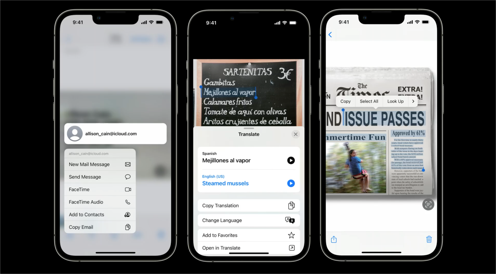

## 个人介绍

Eric(马楚鸿)，iOS 开发，坐标厦门，Swift 爱好者，目前在做远程视频会议开发。

## 审核介绍

anotheren（刘栋），老司机周报编辑，就职于丁香园 iOS 团队，Swift 老司机。

## 不超过 120 个字的文章简介

实况文本（Live Text）是 Apple 为 iOS 15 和 iPadOS 15 新增的实用功能之一，简单来说，实况文本是一个系统级的 OCR 工具，它能够帮助我们把照片、相机界面当中的文字转化为可交互的文本。在 iOS 16 系统中更是开放了一系列封装好的实况文本 API，让我们可以方便在应用中集成实况文本功能。

## 公众号/小专栏图文头图

