# WWDC22 - 使用新框架实现 Shortcuts - Dive into App Intents

本文基于 [Dive into App Intents](https://developer.apple.com/videos/play/wwdc2022/10032) 梳理

随着 iOS 的发展更新，App 已经不仅仅局限在用户手动点击打开来使用功能了。无论是自 iOS 10 推出的 Siri，还是后续 iOS 12 出现的 Shortcut，系统已经提供了各种入口供用户使用 App。用户甚至可以只通过系统级的服务使用 App 提供的功能而无需打开 App。

如今， Apple 在 iOS 16 推出了 App Intent 框架， 相对于之前为 App 实现不同 Extension 的开发方式，使用本框架可以用来统一实现扩展 App 的功能，以便于支持 Siri 、Spotlight、Shortcut app、 [Focus Filter](https://developer.apple.com/videos/play/wwdc2022/10121/) 等系统级服务。

> 苹果在 iOS 15 推出了专注模式， 打开特定的专注模式，可以设置在一个时间段内允许指定的 App 发出通知来避免打扰。 Focus Filter 则是 iOS 16 对专注模式的进一步增强。当启用某一个专注模式后，可以让适配此专注模式的 App 执行一些操作来过滤内容。
>
> 比如日历 App ，可以在工作模式开启后只展示工作相关的日程，不再展示个人日程，减少工作时其他内容对自己的打扰。
>
> 专注模式下 App 需要用户设置的内容则通过 App Intent 暴露给系统， 供用户进行设置。
>
> [`SetFocusFilterIntent`](https://developer.apple.com/documentation/appintents/setfocusfilterintent/)继承了 `AppIntent` , 是用来支持专注模式的特殊的 App Intent. 具体的实现内容指路 [WWDC22 Meet Focus filters](https://developer.apple.com/videos/play/wwdc2022/10121/).

本文将以一个书单 App 为例来逐步深入介绍 App Intent 框架，这个 App 用来追踪用户正在读的书、想要读的书、已阅读的书（对应 App 的三个 Tab)。
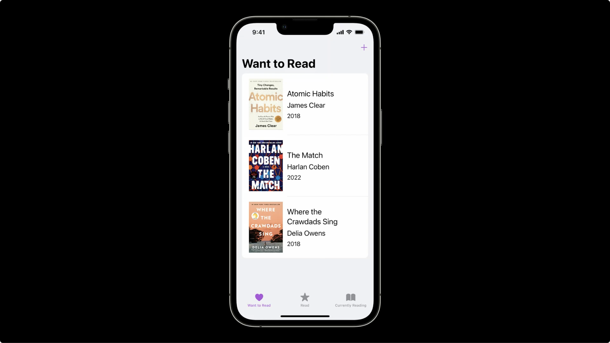

首先需要了解一下 App Intent 三个关键的部分组成：Intent，Entity，AppShortcut。
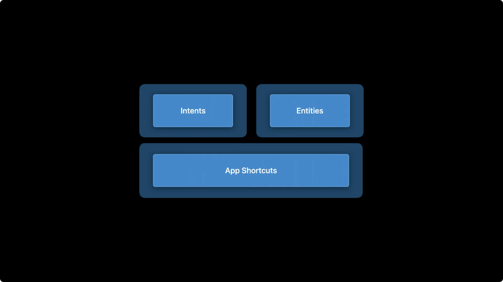

- Intent: 在 App 中构建的 Action，提供给系统去使用
- Entity：用来表示 App 中的内容，提供给 Intent 使用
- Shortcut：用来包装 Intent, 使之能被系统发现并使用

---

思考一下，对于本 App，用户的一些常用操作有哪些：直接打开“正在阅读”Tab 继续上一次的阅读， 最好直接打开某一本我正在阅读的书，或者在日常发现一本好书时能更快捷地把它添加进来……带着这些想法，我们开始逐步为书单 App 实现各种方便用户使用的 Intent。

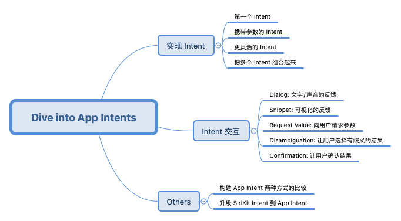

## 实现 Intent

### 第一个 Intent —— 打开“正在阅读”Tab

对于 App 的常用功能，我们可以考虑为其构建一个 Intent。
对于书单 App 来说，打开“正在阅读”的书橱是一个常用的场景，可以为此实现一个 Intent。

```swift
struct OpenCurrentlyReading: AppIntent {
    static var title: LocalizedStringResource = "Open Currently Reading"

    @MainActor
    func perform() async throws -> some PerformResult {
        Navigator.shared.openShelf(.currentlyReading)
        return .finished
    }

    static var openAppWhenRun: Bool = true
}
```

如上述代码所示， 定义了一个遵守 [AppIntent](https://developer.apple.com/documentation/appintents/appintent) 协议的结构体 `OpenCurrentlyReading` 即可实现一个最简单的 Intent。
协议内容如下：

- `perform()` 方法实现了 Tab 的跳转， 由于此操作与 UI 相关，需要在主线程执行，额外使用了 `@MainActor` 修饰
- `title` 是此 Intent 的标题，适配本地化的文案
- 此 Intent 的操作需要打开 App , `openAppWhenRun` 赋值为 `true`

定义完成后， 此 Intent 就会出现在 Shortcuts Editor 中了。（Intent 的使用场景非常多)

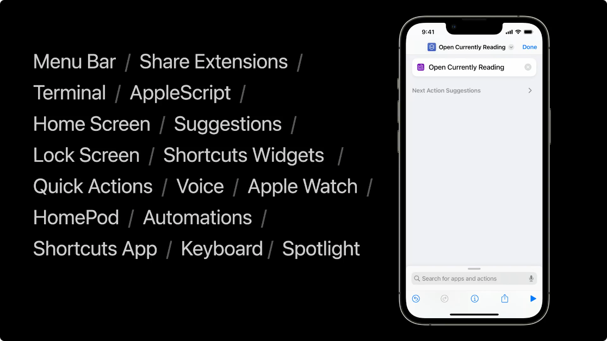

为了方便用户使用，我们可以直接把 Intent 包装起来，给 App 预置一些 AppShortcut：

```swift
public struct LibraryAppShortcuts: AppShortcutsProvider {
    static var appShortcuts: [AppShortcut] {
        AppShortcut(
            intent: OpenCurrentlyReading(),
            phrases: ["Open Currently Reading"],.
            systemImageName: "books.vertical.fill"
        )
    }
}
```

定义好 `LibraryAppShortcuts` 之后，其中的 Shortcuts 就会出现在快捷指令 App 中了。

关于实现 App Shortcuts 的更多内容，可以在另一个 session 中了解 [Implement App Shortcuts with App Intents](https://developer.apple.com/videos/play/wwdc2022/10170)

### 携带参数的 Intent —— 打开任意一个 Tab

上一个例子中，我们实现了可以打开 App 指定 Tab 的 Intent。但我们可以实现更为通用的 Intent，比如打开 App 的任意一个 Tab。所以我们可以通过给 Intent 添加参数来实现。

对于书单 App ，我们可以定义一个枚举来表示不同的 Tab。

```swift
public enum Shelf: String, AppEnum {
    case currentlyReading
    case wantToRead
    case read

    static var typeDisplayName: LocalizedStringResource = "Shelf"

    static var caseDisplayRepresentations: [Shelf: DisplayRepresentation] = [
        .currentlyReading: "Currently Reading",
        .wantToRead: "Want to Read",
        .read: "Read",
    ]
}
```

遵守 [AppValue](https://developer.apple.com/documentation/appintents/appvalue) 的类型才能被 Intent 使用。对于枚举我们可以遵守 [AppEnum](https://developer.apple.com/documentation/appintents/appenum), `AppEnum`是一个多层的协议，其中 `typeDisplayName` 定义了本类型用于阅读理解的名称，在 Shortcut app 中展示； `caseDisplayRepresentations` 定义了各个枚举值用于阅读的名称。

下图中的类型都可以作为 AppIntent 的参数。
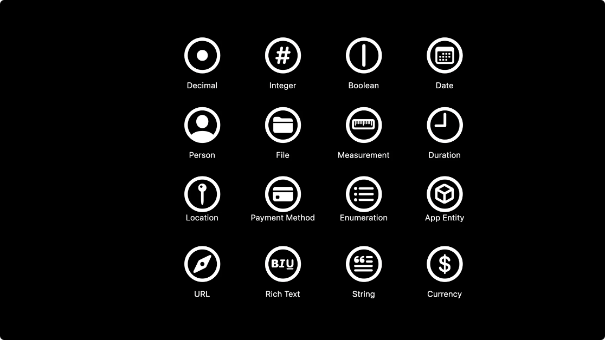

接下来我们使用这个参数来实现 Open Shelf Intent：

```swift

struct OpenShelf: AppIntent {
    static var title: LocalizedStringResource = "Open Shelf"

    @Parameter(title: "Shelf")
    var shelf: Shelf

    @MainActor
    func perform() async throws -> some PerformResult {
        Navigator.shared.openShelf(shelf)
        return .finished
    }

    static var openAppWhenRun: Bool = true
}
```

使用 [`@Parameter`](https://developer.apple.com/documentation/appintents/intentparameter) 包装表示此属性是通过传入的参数被赋值的。

`title` 是用于在 UI 上展示此参数的标题，其余被省略的初始化参数具体含义可在文档中查阅。

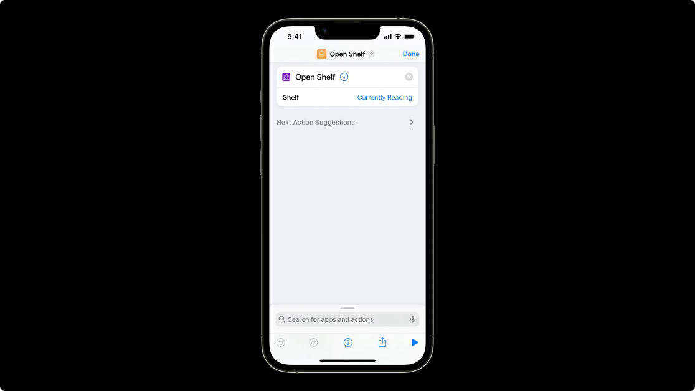

如上图所示，此时 Shelf 是作为一个参数在界面中占用了一行单独展示。

使用 ParameterSummary API 可以让用户界面更简单，把参数带入到一个表示意图的短语中， “打开\\(某个 Tab)”。

```swift

struct OpenShelf: AppIntent {

    ...
    static var parameterSummary: some ParameterSummary {
        Summary("Open \(\.$shelf)")
    }
    ...
}
```

展示结果如下图：
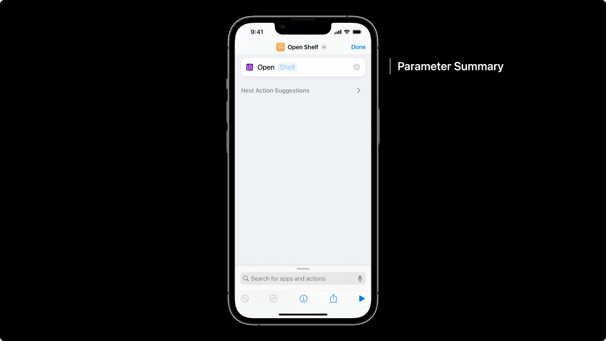

作为最佳实践， 应该永远给一个 Intent 实现 Parameter Summary。

### 更灵活的 Intent —— 打开某一本书

书不是可枚举的类型，结果更多，这时我们需要实现查询功能来得到结果。在实现 Intent 前，我们需要准备好定义 Book Entity 供 Intent 作为参数使用；再实现 Query 供系统检索。

```swift
struct BookEntity: AppEntity {
    var id: UUID
    var title: String

    var displayRepresentation: DisplayRepresentation {
        DisplayRepresentation(title: LocalizedStringResource(stringLiteral: title))
    }

    static var typeDisplayName: LocalizedStringResource = "Book"

    static var defaultQuery = BookQuery()
}
```

和枚举相似， 实体也需要实现对应的协议 [AppEntity](https://developer.apple.com/documentation/appintents/appentity) 才能供 Intent 使用。

- id 作为标识符需要稳定不变
- 关联 `defaultQuery` 供系统查询

#### 实现 Query

Query 是 App 给系统提供的用于检索 Entity 的接口。有如下几种检索方式：

- [EntityQuery](https://developer.apple.com/documentation/appintents/entityquery)
  通过 ID 检索(是 Query 必须实现的方式)
- [EntityStringQuery](https://developer.apple.com/documentation/appintents/entitystringquery) 通过字符串检索
- [EntityPropertyQuery](https://developer.apple.com/documentation/appintents/entitypropertyquery) 通过属性检索

Query 还会提供一些建议的结果供用户选择。即实现[`suggestedEntities()`](<https://developer.apple.com/documentation/appintents/entityquery/suggestedentities()-5jftb>)

如下图所示，当我们点击 Book 时，会弹出一个 Sheet 去检索，除了顶部的搜索栏可以让我们输入字符串检索外，下方也会展示一些建议的结果。

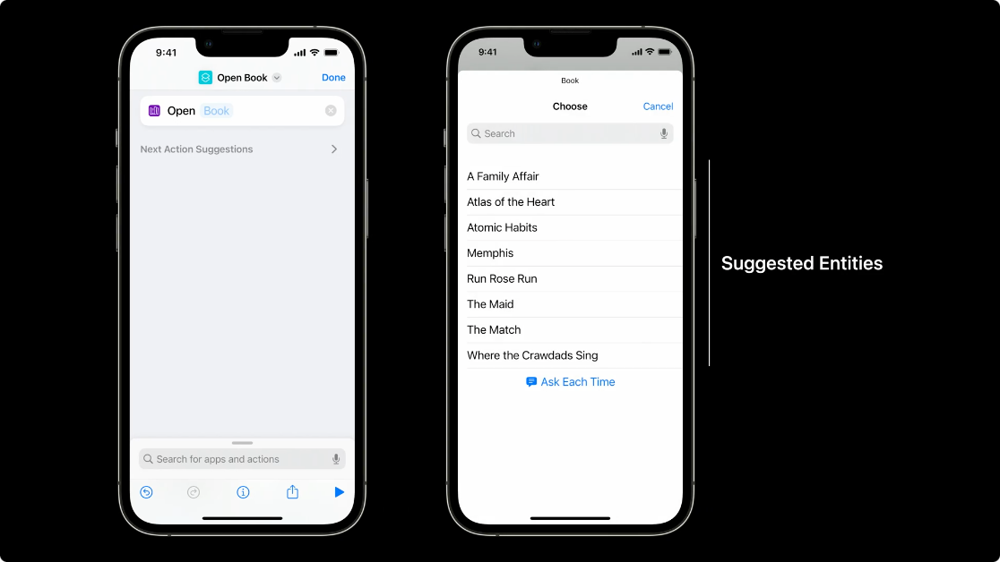

`BookQuery`的实现如下。

```swift

struct BookQuery: EntityStringQuery {
    // 实现 ID 检索
    func entities(for identifiers: [UUID]) async throws -> [BookEntity] {
        identifiers.compactMap { identifier in
            Database.shared.book(for: identifier)
        }
    }
    // 提供建议结果
    func suggestedEntities() async throws -> [BookEntity] {
        Database.shared.books
    }
    // 字符串检索
    func entities(matching string: String) async throws -> [BookEntity] {
        Database.shared.books.filter { book in
            book.title.lowercased().contains(string.lowercased())
        }
    }
}

```

#### EntityPropertyQuery

实现 `EntityPropertyQuery` 前，需要给对应的 Entity 中的属性包装为[EntityProperty](https://developer.apple.com/documentation/appintents/entityproperty)，才能供 Query 使用。
对于 `BookEntity` 可以对标题、出版时间等进行包装。

```swift
struct BookEntity: AppEntity{
  var id: UUID

  @Property(title: “Title”)
  var title: String

  @Property(title: “Publishing Date”)
  var datePublished: Date

  @Property(title: "Read Date")
   var dateRead: Date?

  ...
}
```

实现属性检索，需要完成如下三步：

- 明确可查的属性
  - 每个属性都需要定义支持的比较器([Property comparators](https://developer.apple.com/documentation/appintents/property-comparators))， 并且实现它
  - NSPredicate 或者和服务端约定的 REST API 都可以
- 结果的排序方式
- 实现 `entities(matching:)` 方法

```swift
struct BookQuery: EntityPropertyQuery {
    static var sortingOptions = SortingOptions {
        SortableBy(\BookEntity.$title)
        SortableBy(\BookEntity.$dateRead)
        SortableBy(\BookEntity.$datePublished)
    }

    static var properties = EntityQueryProperties {
        Property(keyPath: \BookEntity.title) {
            EqualToComparator { NSPredicate(format: "title = %@", $0) }
            ContainsComparator { NSPredicate(format: "title CONTAINS %@", $0) }
        }
        Property(keyPath: \BookEntity.datePublished) {
            LessThanComparator { NSPredicate(format: "datePublished < %@", $0 as NSDate) }
            GreaterThanComparator { NSPredicate(format: "datePublished > %@", $0 as NSDate) }
        }
        Property(keyPath: \BookEntity.dateRead) {
            LessThanComparator { NSPredicate(format: "dateRead < %@", $0 as NSDate) }
            GreaterThanComparator { NSPredicate(format: "dateRead > %@", $0 as NSDate) }
        }
    }

    func entities(matching string: String) async throws -> [BookEntity] {
        Database.shared.books.filter { book in
            book.title.lowercased().contains(string.lowercased())
        }
    }

    func entities(
        matching comparators: [NSPredicate],
        mode: ComparatorMode,
        sortedBy: [Sort<BookEntity>],
        limit: Int?
    ) async throws -> [BookEntity] {
        Database.shared.findBooks(matching: comparators, matchAll: mode == .and, sorts: sortedBy.map { (keyPath: $0.by, ascending: $0.order == .ascending) })
    }
}

```

实现属性检索后的界面如下图所示
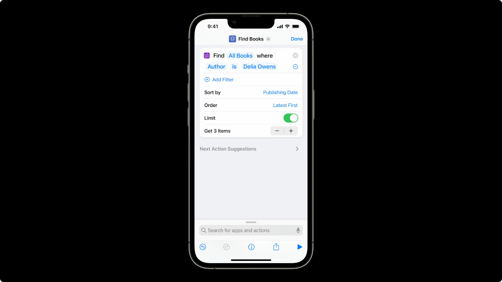

准备工作完成后，OpenBook Intent 的实现如下：

```swift

struct OpenBook: AppIntent {
    @Parameter(title: "Book")
    var book: BookEntity

    static var title: LocalizedStringResource = "Open Book"

    static var openAppWhenRun = true

    @MainActor
    func perform() async throws -> some PerformResult {
        Navigator.shared.openBook(book)
        return .finished
    }

    static var parameterSummary: some ParameterSummary {
        Summary("Open \(\.$book)")
    }

    init() {}

    init(book: BookEntity) {
        self.book = book
    }
}

```

其中 Intent 需要的参数`book` 就是通过 Query 检索而得到的。

### 把多个 Intent 组合起来 — 添加一本书，并打开

有些工作可以通过 Shortcut 去完成而不必打开 App，这样可以显著提升用户的效率。对于书单 App 来说，我们添加一本书的操作就可以不必打开 App 而完成。

```swift

struct AddBook: AppIntent {
    static var title: LocalizedStringResource = "Add Book"

    @Parameter(title: "Title")
    var title: String

    @Parameter(title: "Author Name")
    var authorName: String?

    @Parameter(title: "Recommended By")
    var recommendedBy: String?

    func perform() async throws -> some PerformResult {
        guard var book = await BooksAPI.shared.findBooks(named: title, author: authorName).first else {
            throw Error.notFound
        }
        book.recommendedBy = recommendedBy
        Database.shared.add(book: book)

        return .finished(
            value: book,
            showResultIntent: OpenBook(book: book)
        )
    }
}

enum Error: Swift.Error, CustomLocalizedStringResourceConvertible {
    case notFound

    var localizedStringResource: LocalizedStringResource {
        switch self {
            case .notFound: return "Book Not Found"
        }
    }
}

```

这里通过输入的书籍名称和作者来检索图书，得到图书后执行添加操作，最后 Intent 执行完成也可以将 `book`携带，供后续的 Intent 使用。如此即可把多个 Intent 串联组合起来。

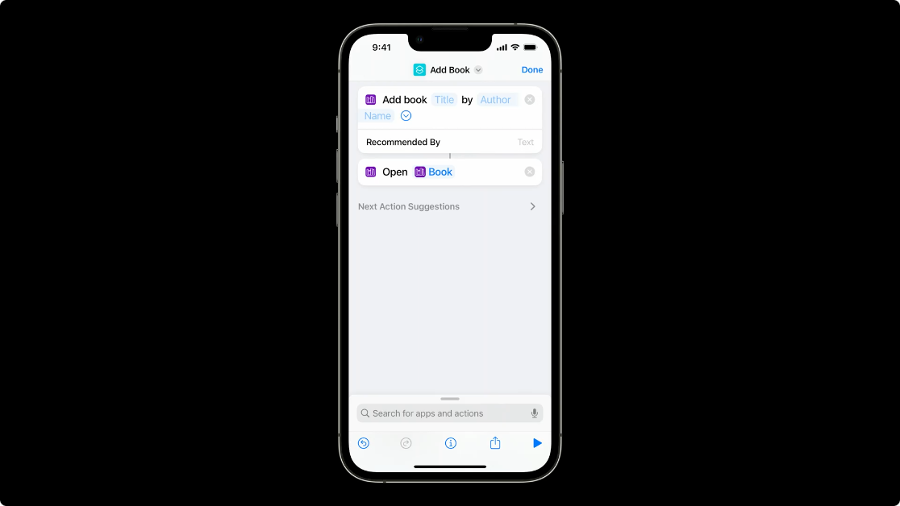

如果串联的下一个 Intent 只是为了用于展示，如例子中的 `OpenBook` Intent，那么`OpenBook`可以作为`AddBook`的 showResultIntent， 即添加书籍成功后再执行打开这本书的操作。

对于会出错的操作，需要抛出异常， Error 信息也需要本地化来告知用户。

## 与 Intent 的交互

Intent 执行完成后， 我们可能需要和用户进行一些交互，或许是告知执行结果；或许是执行结果存在歧义，需要用户参与解决。

框架提供了以下的一些交互方式：

- Dialog： 文字/声音的反馈
- Snippet： 可视化的反馈
- Request Value： 向用户请求所需的参数
- Disambiguation： 让用户选择存在歧义的结果
- Comfirmation： 让用户确认结果

接下来我们可以进一步完善书单 App 的`AddBook` Intent。

### dialog

`AddBook`我们可以在添加成功时使用简短的 dialog 告知用户。

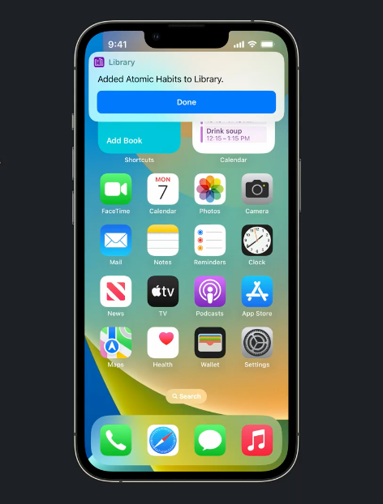

```swift
 struct AddBook: AppIntent {
     func perform() async throws -> some PerformResult {
        guard var book = await BooksAPI.shared.findBooks(named: title, author: authorName).first else {
            throw Error.notFound
        }
        book.recommendedBy = recommendedBy
        Database.shared.add(book: book)

        return .finished(
            value: book,
            dialog:"Added \(book) to Library!"
        )
    }
｝
```

### Snippets

对于`AddBook` ，也可以在执行成功时展示书籍封面来给用户反馈。

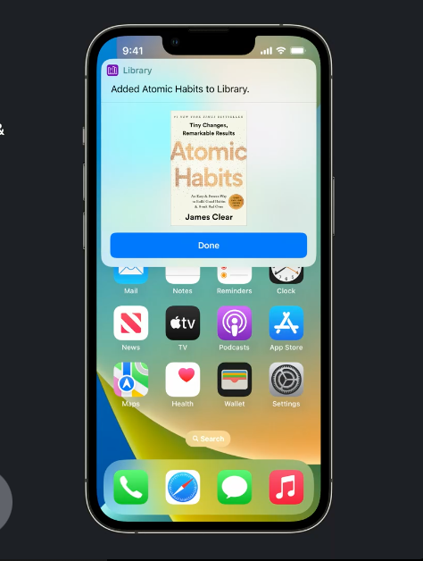

```swift
struct AddBook: AppIntent{
    func perform() async throws -> some PerformResult {
      ...
      return .finished(value: book){
        CoverView(book: book)
      }
    }
}
```

### Request Value： 向用户请求所需的参数

如果用户在加书时，只输入了`title`，而此时的查询结果不只有一本，可以向用户请求输入作者。

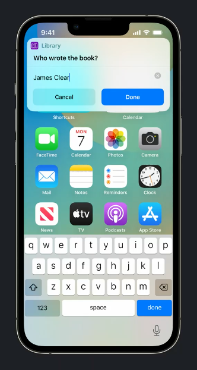

```swift
func perform() async throws -> some PerformResult {
    let books = await BooksAPI.shared.findBooks(named: title, author: authorName)
    guard !books.isEmpty else {
        throw Error.notFound
    }
    if books.count > 1 && authorName == nil {
        throw $authorName.requestValue("Who wrote the book?")
    }
    return .finished
}
```

### Disambiguation： 让用户选择存在歧义的结果

依旧是上述情况，只是此时查询得到结果并不多时，我们可以让用户进行作者的选择，而不必再输入。

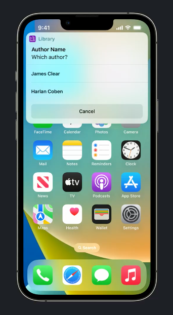

```swift
func perform() async throws -> some PerformResult {
    let books = await BooksAPI.shared.findBooks(named: title, author: authorName)
    guard !books.isEmpty else {
        throw Error.notFound
    }
    if books.count > 1 {
        let chosenAuthor = try await $authorName.requestDisambiguation(among: books.map { $0.authorName }, dialog: "Which author?")
    }
    return .finished
}
```

### Comfirmation： 让用户确认结果

再或者， 我们可以选定一本最受欢迎的书，来向用户询问这是不是他所添加的书。

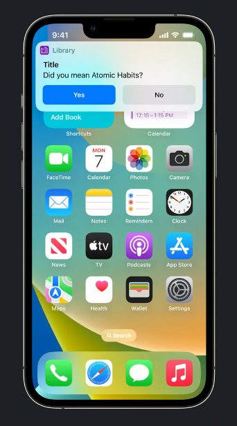

```swift

func perform() async throws -> some PerformResult {
    guard var book = await BooksAPI.shared.findBooks(named: title, author: authorName).first else {
        throw Error.notFound
    }
    let confirmed = try await $title.requestConfirmation(for: book.title, dialog: "Did you mean \(book)?")
    book.recommendedBy = recommendedBy
    Database.shared.add(book: book)
    return .finished(value: book)
}
```

以及在交易时，需要用户确认订单。

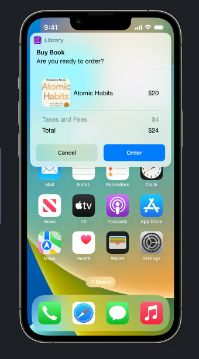

这里使用了一张预览图，让用户更清楚地检查订单信息。

```swift

struct BuyBook: AppIntent {
    @Parameter(title: "Book")
    var book: BookEntity

    @Parameter(title: "Count")
    var count: Int

    static var title: LocalizedStringResource = "Buy Book"

    func perform() async throws -> some IntentPerformResult {
        let order = OrderEntity(book: book, count: count)
        try await requestConfirmation(output: .finished(value: order, dialog: "Are you ready to order?") {
            OrderPreview(order: order)
        })

        return .finished(value: order, dialog: "Thank you for your order!") {
            OrderConfirmation(order: order)
        }
    }
}
```

## 关于 App Intent ，你需要知道的一些其他内容

### 构建 App Intent 两种方式的比较

#### In-app

最简单， 无需跨进程开发；有着更高的内存限制；可以播放音频；可以在前台执行 Intent；在后台可以让 App 通过特殊的模式启动。（但是不显示 Scenes, 用于提高性能）

App Intent 是在构建时提取静态文件得到的，会存在于 App 包内部。 为了确保能正常生效， AppIntent 必须实现在 target 或者 extension 中，而不是 framework。

本地化的文案也需要放在同一个 Bundle 中。

#### Extension

更轻量， 无需启动 App 即可执行，但是需要更多的开发工作。

更好的性能表现，对于 Focus 改变时，Focus filter intents 可以立即执行。

元数据文件在 Extension Bundle 中。

### 升级 SiriKit Intent 到 App Intent

与 Widget、 Message、 Media 等集成的 Siri Intent 是不可以升级的；

与 Siri、 Shortcut 相关自定义 Intent 是可以升级的，在对应的文件上点击 `Convert to AppIntent` 即可。

## 总结

全文虽然没有提 Siri, 但实现的 Shortcut 本身就可以被 Siri 使用。和以往的开发方式相比，AppIntents 框架让 Shortcut 与 Siri 结合得更为紧密，纯粹靠代码实现的开发方式也比以往简洁了很多。除了不兼容旧版本外，新框架总是更方便开发的。

## 一些参考

学习理解时，不实现具体的 UI 也能很轻松地实现并观察 App Intent 的表现，如果有 UI 需求可以参考下面这个仓库：
[A demo app exploring the new App Intents framework in iOS16.](https://github.com/mralexhay/Booky)
是一个仿照 Session Example 的 Library App
