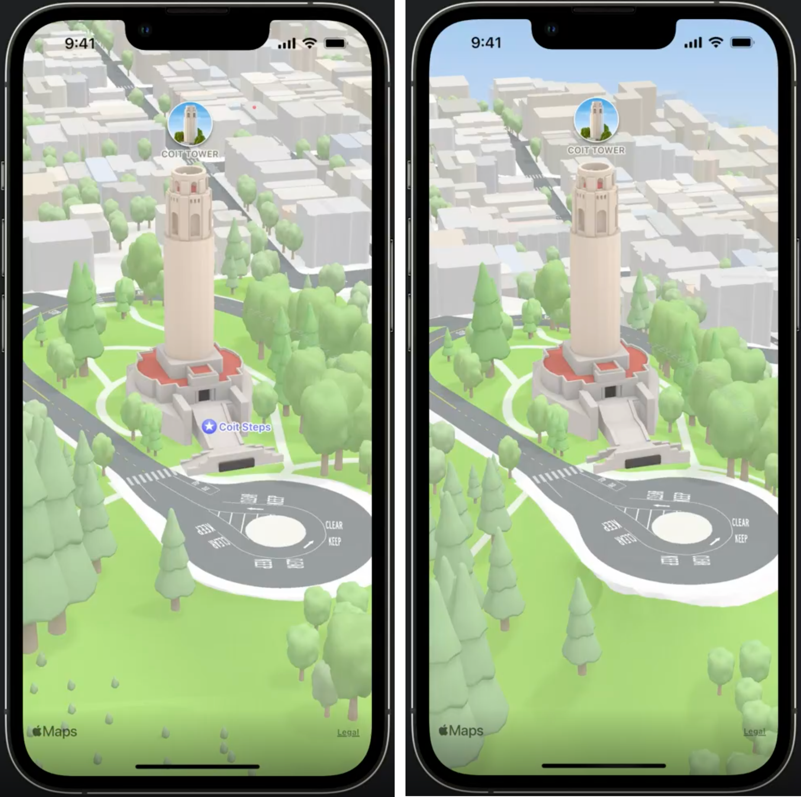
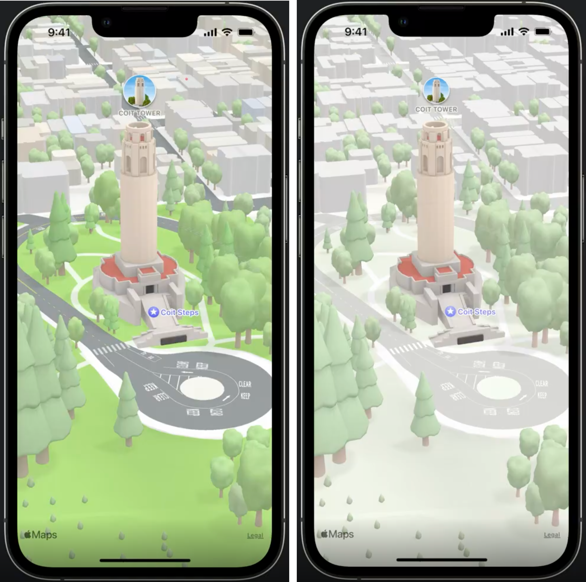
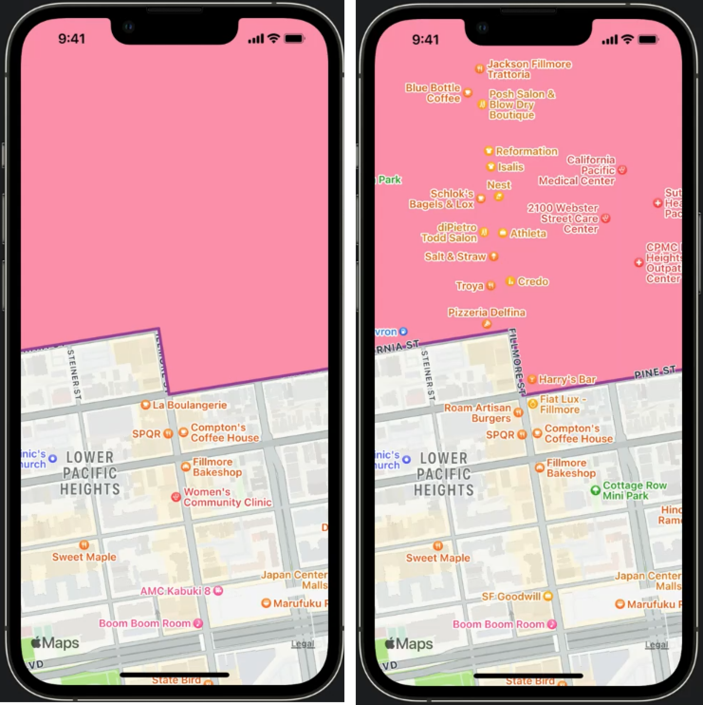
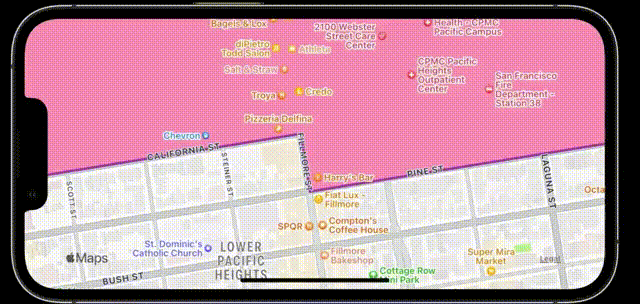
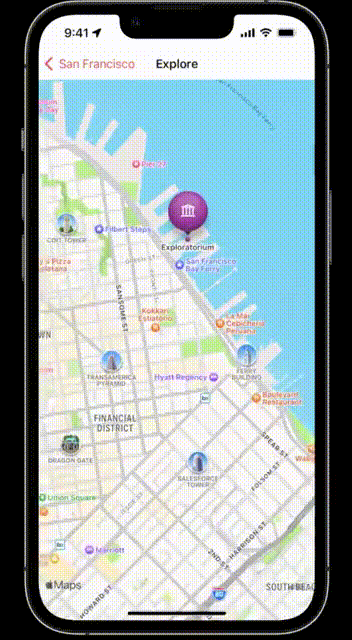

# WWDC22 10035 - 探索苹果地图新功能

>作者：钟山，iOS 开发，就职于字节跳动音乐平台业务组
>
>审核：士土Edmond木, 对 CocoaPods 有一点了解，目前对 Bazel 和 Swift 比较感兴趣。[Github Page](https://looseyi.github.io)
>
>本文基于 [Session 10035](https://developer.apple.com/videos/play/wwdc2022/10035/) 和 [Session 10006](https://developer.apple.com/videos/play/wwdc2022/10006/) 梳理。


自 2012 年 6 月 11 日苹果公司在 WWDC 上向外宣布在自家 iOS 系统中将不会再默认搭载 ‘Google 地图’，‘苹果地图’将取代而之默认在 iOS 的系统中向用户提供地图服务，不知不觉已经过去了整整十个年头。在 2012 年 9 月正式开放使用之后，因取代‘Google 地图’所推出的苹果地图服务内容不完整、功能欠佳等问题广受用户诟病。因为漏洞百出甚至引发过苹果的公关危机，CEO 库克还因此专门公开向用户道歉。库克当时表示：“会不断改进‘苹果地图’给予用户的体验”以及“如果消费者不满意该地图所提供的服务，可以使用 Google 或是 Nokia 地图”。

在这十年里，‘苹果地图’持续修补漏洞、改进功能，从一开始依赖第三方数据到自己收集数据，一直在努力将其打造为世界上最好的地图应用。同时为开发者提供了两种将地图 App 整合到其产品中的方式，其中之一是 MapKit，可以让你将地图 App 整合到 iOS、iPadOS 或 macOS 的 App 中，这样你就能在 App 中显示地图或卫星图像、添加注释和悬浮窗、标注兴趣点、确定地图坐标信息等等。另外一个是MapKit JS，可为网站带来交互式地图，不只是添加注释、悬浮窗，还有搜索和导航等地图服务的界面。

在今年的 WWDC 中，苹果不仅带来了 MapKit 的新功能，还首次开放 Apple Maps Server API（苹果地图服务接口） 来帮助开发者构建性能更好的地图服务。本文将对这部分内容进行详细介绍，主要分为两大块：

1. 探索 MapKit 新功能
2. Apple Maps Server API（苹果地图服务接口）

## 探索 MapKit 新功能

### Map Configuration 地图配置

在 iOS 15 中，配置地图的方式是通过 MKMapView 上的各种属性。苹果在 iOS 16 中，将弃用这些属性，并引入了新的 Map Configuration API 作为替代。

即将废弃的API:

```Swift
class MKMapView {
   var mapType: MKMapType API_TO_BE_DEPRECATED
   var pointOfInterestFilter: MKPointOfInterestFilter? API_TO_BE_DEPRECATED
   var showsBuildings: Bool API_TO_BE_DEPRECATED
   var showsTraffic: Bool API_TO_BE_DEPRECATED
   ....
}

enum MKMapType  {
    case standard = 0
    case satellite = 1
    case hybrid = 2
    case satelliteFlyover = 3
    case hybridFlyover = 4
    case mutedStandard = 5
}
```

新 API 使用 MKMapConfiguration 作为新地图配置 API 的抽象基类，有三个具体子类，分别为 MKImageryMapConfiguration、MKHybridMapConfiguration、MKStandardMapConfiguration。

如下面代码所示：

```Swift
class MKMapView {
    @available(iOS 16.0, *)
    var preferredConfiguration: MKMapConfiguration
   
    @available(iOS 16.0, *)
    var selectableMapFeatures: MKMapFeatureOptions
}

enum ElevationStyle {        
        case flat = 0 // 平面样式：意味着地面看起来是平坦的，道路，包括桥梁和立交桥，也显得平坦。
        case realistic = 1 // 逼真样式：意味着地面地形再现了真实世界的高程，例如丘陵和山脉。
}

class MKMapConfiguration {
     /// 基类支持 elevationStyle 属性，该属性可以是平面的，也可以是真实的。
    var elevationStyle: ElevationStyle
}

class MKImageryMapConfiguration: MKMapConfiguration { 
/// 影像地图配置：仅显示卫星影像，没有其它地图元素，因此它没有任何其他属性。
}

class MKHybridMapConfiguration : MKMapConfiguration { 
/// 混合地图配置
    var pointOfInterestFilter: MKPointOfInterestFilter? // 过滤器
    var showsTraffic: Bool // 是否展示交通流量状况
}

/// 强调样式
enum EmphasisStyle {
    case default // 
    case muted // 静音：隐藏你不关心的细节
}

class MKStandardMapConfiguration : MKMapConfiguration { 
/// 标准地图配置
    var emphasisStyle: EmphasisStyle
    var pointOfInterestFilter: MKPointOfInterestFilter?
    var showsTraffic: Bool
}

```

#### 配置类用途

以上配置使用效果如下图所示，从左到右依次为影像地图、混合地图、标准地图效果：


对比上面实现效果很容易看出来：

* 影像地图配置用于呈现卫星风格的影像
* 混合地图配置用于呈现基于图像的地图，其中添加了地图特征，例如道路标签和兴趣点
* 标准地图配置用于呈现完全基于图形的地图

#### ElevationStyle 角度样式

这是一个地图配置基类属性，所有的地图配置都可以设置，下图展示了标准地图配置分别设置 flat 和 realistic 的呈现效果：



这个属性可以理解为摄像机在不同高度摄像带来的不同视觉效果：

* flat 为默认属性，这个属性下意味着地面看起来是平坦的，包括道路、桥梁和立交桥也显得平坦。
* realistic 意味着地面地形再现了真实世界，例如丘陵和山脉，道路以逼真的细节描绘。

#### EmphasisStyle 强调样式

这个属性为标准地图配置独有，该属性可以是 default 或 muted。



可以看到：

* default 为默认，呈现细节更丰富。
* muted 对细节进行了弱化处理，隐去了部分细节，可以让用户关注你想让用户关注的信息。

#### 地图配置类和地图类型间的对应关系

针对新提供配置 API，不同的组合对应不同的 MKMapType，以下表格显示了新地图配置类和 MKMapType 属性之间的对应关系：


### Overlay improvements 覆盖物效果提升

覆盖物是苹果地图很早就支持的功能，可以盖住指定的地图区域。

```Swift
class MKMapView {
    func addOverlays(_ overlays: [MKOverlay], level: MKOverlayLevel)
}

enum MKOverlayLevel {   
    case aboveRoads = 0 // 覆盖物位于道路之上
    case aboveLabels = 1 // 覆盖物位于标签之上
}

```

下图展示了 aboveLabels 和 aboveRoads 的覆盖效果：



iOS 16 中为 aboveRoads 覆盖物引入的一个新功能，叫做透明建筑。当地图有倾斜角度时，树木和建筑物等地面物体在出现在覆盖物上方时会自动以透明度进行渲染，以免完全遮挡它们。效果如下图所示：



### Blend modes 图层混合模式

iOS 16 中 MKOverlayRenderer 会增加一个这个新的 blendMode 属性，这个属性可以更好地控制覆盖物的外观视觉效果，并解锁一系列新的创意可能性。

```Swift
class MKOverlayRenderer {
    var blendMode: CGBlendMode
}
```

在混合操作期间，两个图形层按照指定的一组混合模式进行组合，主要用来突出地理区域、淡化地图，使得内容突出。
MapKit 支持多种混合模式，如下所列：


### Selectable Map Features 可选择地图特征

在 iOS 16 中支持可选择地图功能，可选择的地图特征包括兴趣点，例如商店、餐馆和地标；领土，例如城市和州；和物理特征，例如山脉和湖泊。

```Swift
class MKMapView {
    var selectableMapFeatures:MKMapFeatureOptions
}

struct MKMapFeatureOptions: OptionSet {
    static var pointsOfInterest // 兴趣点
    static var terrirories // 领土
    static var physicalFeatures // 物理特征
}

protocol MKMapViewDelegate {
    optional func mapView(_: MKMapView, didSelect annotation: MKAnnotation)
    optional func mapView(_: MKMapView, didDeselect annotation: MKAnnotation)
    
    // existing
    optional func mapView(_: MKMapView,viewFor annotation: MKAnnotation) -> MKAnnotationView?
}

class MKMapFeatureAnnotation: MKAnnotation {
    var featureType: FeatureType
    var pointOfinterestCategory: MKPointOfInterestCategory?
    var iconStyle: MKIconStyle?
}

class MKIconStyle {
    var backgroundColor: UIColor
    var image: UIImage
}

class MKMapItemRequest: NSObject {
    init(featureAnnotation: MKMapFeatureAnnotation)
    
    func getMapItem(completionHandler: @escaping (MKMapItem?, Error?) -> Void)
    var mapItem: MKMapItem { get async throws }
}

// Existing API

open class MKMapItem: NSObject {
    open var placemark: MKPlacemark { get }
    
    open var name: String?
    open var phoneNumber: String?
    open var url: URL?
    
    // ...
    
    func openInMaps(launchOptions: [String: Any]? = nil, from scene: UIScene?) async -> Bool

}

```

只需要三个步骤就可以支持这个新功能，如下：

第一步，设置 MKMapView 的 selectableMapFeatures 属性，指定哪些特征类型可被用户选择。

```Swift
mapView. selectableMapFeatures = [. pointsOfInterest]
```

第二步，实现 MKMapView 委托代理 MKMapViewDelegate 来处理选择事件，即 func mapView(_: MKMapView,viewFor annotation: MKAnnotation) -> MKAnnotationView? 方法  和 func mapView(_: MKMapView, didSelect annotation: MKAnnotation) 方法。

```Swift
// 定义可选地图特征大头针样式
func mapView(_: MKMapView,viewFor annotation: MKAnnotation) -> MKAnnotationView? {
    if let feature = annotation as MKMapFeatureAnnotation? {
        var annotationView: MKMarkerAnnotationView = ...
        annotationView.image = feature.iconStyle?.image
        annotationView.color = ...
        return annotationView
    }
    
    return nil
}

// 处理用户选择事件
func mapView(_: MKMapView, didDeselect annotation: MKAnnotation) {
    guard let featureAnnotation = annotation as? MKMapFeatureAnnotation else { retrun }
    let featureRequest = MKMapItemRequest(mapFeatureAnnotation: featureAnnotation)
    
    ....
}
```

第三步，把 MKMapFeatureAnnotation 实例作为 init 参数传递给 MKMapItemRequest 实例，通过 MKMapItemRequest 获取用户界面中显示的额外地点信息。

```Swift
func mapView(_: MKMapView, didDeselect annotation: MKAnnotation) {
    guard let featureAnnotation = annotation as? MKMapFeatureAnnotation else { retrun }
    let featureRequest = MKMapItemRequest(mapFeatureAnnotation: featureAnnotation)
    
    Task {
        // Issue request.
        do {
            guard let featureItem = try await featureRequest.mapItem else { return }
            
            UIView.animate(withDuration: 4) {
                self.animateCamera(featureItem)
            } completion: { _ in
                 self.showInfoCardView(featureItem)
            }
        } catch {
        
        }
    }
}
```

Selectable Map Features 实际效果：



### Look Around 环顾四周

Look Around 是苹果地图在 iOS 13 中引入的，可以环顾四周来真正了解一个地方。 Look Around 图像提供了令人难以置信的细节水平，利用 3D 模型提供了与其他地图不同的真实感。在 iOS 16 中，苹果将 Look Around 引入到 MapKit 供开发者使用。
> Look Around 需要大量环境数据，目前只在部分国家城市支持。

```Swift
class MKLookAroundSceneRequest {
    init(coordinate: CLLocationCoordinate2D)
    init(mapItem: MKMapItem)
    var scene: MKLookAroundScene? { get async throws }
}

class MKLookAroundScene {

}

class MKLookAroundViewController: UIViewController {
    init(scene: MKLookAroundScene)
    var scene: MKLookAroundScene?
}

class MKLookAroundSnapshotter {
    init(scene: MKLookAroundScene, options: MKLookAroundSnapshotter. Options)
    var snapshot: MKLookAroundSnapshotter.Snapshot { get async throws }

}

```

只需要简单的步骤，即可完成适配，如下：

1. 首先明确该位置有没有 Look Around 数据。为此需要创建一个 LookAroundSceneRequest，这是 iOS 16 中引入的一个新类。通过 LookAroundSceneRequest 可以获得一个 MKLookAroundScene 实例。
2. MKLookAroundScene 实例作为 init 参数传递给新的 MKLookAroundViewController 实例
3. 展示 MKLookAroundViewController

Look Around 实际效果：


## Apple Maps Server API 苹果地图服务接口

苹果本次开放了四个服务 API 供开发者调用，分别是地址编码、逆向地址编码、地址搜索、估计到达时间。
本节将对新开放的 API 进行详细介绍，主要分为两大块：

1. 接口文档
2. 应用场景

### 接口文档

#### Generate a Maps Access Token 生成访问授权 Token

用来获取请求访问授权 accessToken，为后续请求提供身份验证。

##### URL

```Json
GET https://maps-api.apple.com/v1/token
```

##### 请求例子

```Json
curl -si -H”Authorization: Bearer <maps_auth_token>” ”https://maps-api.apple.com/v1/token”
```

```Json
{
  “accessToken”: “<maps_access_token>”,
  “expiresInSeconds”: 1800
}
```

#### Geocoding 地址编码

用来获取指定地址的经纬度信息。

##### URL

```Json
GET https://maps-api.apple.com/v1/geocode
```

##### Query Parameters

|  参数   | 描述  | 类型  | 是否必须  |
|  ----  | ----  |----  | ----  |
| q  | 需要编码的地址，例子：q=1 Apple Park, Cupertino, CA | string | 是 |
| limitToCountries  | 限制查询国家范围，格式使用国家地区编码，多个国家是用逗号分割，例子：limitToCountries=US,CA. | [string] | 否 |
| lang  | 指定响应数据的语言，格式使用 BCP 47 语言标记，默认为英文，例子：lang=en-US. | string | 否 |
| searchLocation  | 搜索位置，格式为纬度经度，中间使用逗号分割，例子：searchLocation=37.78,-122.42. | string | 否 |
| searchRegion  | 搜索区域，格式为北纬东经南纬西经，中间使用逗号分割，例子：searchRegion=38,-122.1,37.5,-122.5. | string | 否 |
| userLocation  | 用户位置, 格式为纬度经度，中间使用逗号分割，例子，userLocation=37.78,-122.42. | string | 否 |

##### 请求例子

```Json
curl -si -H”Authorization: Bearer <maps_access_token>” ”https://maps-api.apple.com/v1/geocode?q=Apple%20Park%2C%20Cupertino%2C%20CA”
```

```Json
{
  “results”: [
    {
      “coordinate”: {
        “latitude”: 37.3301996,
        “longitude”: -122.0106415
      },
      “displayMapRegion”: {
        “southLatitude”: 37.3257080235794,
        “westLongitude”: -122.01629018770203,
        “northLatitude”: 37.3346911764206,
        “eastLongitude”: -122.00499281229798
      },
      “name”: “Apple Park Way”,
      “formattedAddressLines”: [
        “Apple Park Way”,
        “Cupertino, CA  95014”,
        “United States”
      ],
      “structuredAddress”: {
        “administrativeArea”: “California”,
        “administrativeAreaCode”: “CA”,
        “locality”: “Cupertino”,
        “postCode”: “95014”,
        “thoroughfare”: “Apple Park Way”,
        “fullThoroughfare”: “Apple Park Way”,
        “areasOfInterest”: [
          “Apple Park”
        ]
      },
      “country”: “United States”,
      “countryCode”: “US”
    }
  ]
}
```

#### Reverse Geocoding 逆向地址编码

用来获取经纬度对应的地址列表。

##### URL

```Json
GET https://maps-api.apple.com/v1/geocode
```

##### Query Parameters

|  参数   | 描述  | 类型  | 是否必须  |
|  ----  | ----  |----  | ----  |
| loc  | 需要查询地址的经纬度，格式为纬度经度，中间使用逗号分割，例子：loc=37.3316851,-122.0300674 | string | 是 |
| lang  | 指定响应数据的语言，格式使用 BCP 47 语言标记，默认为英文，例子：lang=en-US. | string | 否 |

##### 请求例子

```Json
curl -si -H”Authorization: Bearer <maps_access_token>” ”https://maps-api.apple.com/v1/reverseGeocode?loc=37.3301996%2C-122.0106415”
```

```Json
{
  “results”: [
    {
      “coordinate”: {
        “latitude”: 37.3301996,
        “longitude”: -122.0106415
      },
      “displayMapRegion”: {
        “southLatitude”: 37.3257080235794,
        “westLongitude”: -122.01629018770203,
        “northLatitude”: 37.3346911764206,
        “eastLongitude”: -122.00499281229798
      },
      “name”: “Apple Park Way”,
      “formattedAddressLines”: [
        “Apple Park Way”,
        “Cupertino, CA  95014”,
        “United States”
      ],
      “structuredAddress”: {
        “administrativeArea”: “California”,
        “administrativeAreaCode”: “CA”,
        “locality”: “Cupertino”,
        “postCode”: “95014”,
        “thoroughfare”: “Apple Park Way”,
        “fullThoroughfare”: “Apple Park Way”,
        “areasOfInterest”: [
          “Apple Park”
        ]
      },
      “country”: “United States”,
      “countryCode”: “US”
    }
  ]
}
```

#### Estimated Time of Arrival 预计到达时间

用来计算从指定位置出发到某个目的地的到达时间。

##### URL

```Json
GET https://maps-api.apple.com/v1/geocode
```

##### Query Parameters

|  参数   | 描述  | 类型  | 是否必须  |
|  ----  | ----  |----  | ----  |
| origin  | 开始位置，格式为纬度经度，中间使用逗号分割，例子：origin=37.331423,-122.030503 | string | 是 |
| destinations  | 目的地 ，格式为纬度经度，例子：destinations=37.32556561130194,-121.94635203581443 | [string] | 是 |
| departureDate  | 出发时间（UTC），格式为 ISO 8601 格式，如果不传则使用服务端当前时间，例子：departureDate=2020-09-15T16:42:00Z | string | 否 |
| transportType  | 交通工具类型，目前支持三个交通工具，Automobile（汽车）、Transit（运输）、Walking（步行），默认为 Automobile，例子：transportType= Automobile | string | 否 |

注意：destinations 参数至少有一个目的地，最多不超过 10 个，多个的话使用“|”分割，例子：destinations=37.32556561130194,-121.94635203581443|37.44176585512703,-122.17259315798667

##### 请求例子

```Json
curl -si -H”Authorization: Bearer <maps_access_token>” ”https://maps-api.apple.com/v1/etas?origin=37.331423,-122.030503&destinations=37.32556561130194,-121.94635203581443|37.44176585512703,-122.17259315798667”
```

```Json
{
  “etas”: [
    {
      “destination”: {
        “latitude”: 37.32556561130194,
        “longitude”: -121.94635203581443
      },
      “transportType”: “AUTOMOBILE”,
      “distanceMeters”: 9550,
      “expectedTravelTimeSeconds”: 975,
      “staticTravelTimeSeconds”: 540
    },
    {
      “destination”: {
        “latitude”: 37.44176585512703,
        “longitude”: -122.17259315798667
      },
      “transportType”: “AUTOMOBILE”,
      “distanceMeters”: 23286,
      “expectedTravelTimeSeconds”: 1336,
      “staticTravelTimeSeconds”: 1039
    }
  ]
}
```

#### Search 搜索

用来搜索指定名称的地点。

##### URL

```Json
GET https://maps-api.apple.com/v1/geocode
```

##### Query Parameters

|  参数   | 描述  | 类型  | 是否必须  |
|  ----  | ----  |----  | ----  |
| q  | 需要搜索的地址，例子：q=eiffel tower | string | 是 |
| excludePoiCategories  | 需要排除在搜索结果里的兴趣点类型集合, 格式为兴趣点类型，中间使用逗号分割，例子，excludePoiCategories =Restaurant,Cafe | [PoiCategory] | 否 |
| includePoiCategories  | 搜索兴趣点类型集合, 格式为兴趣点类型，中间使用逗号分割，例子，includePoiCategories=Restaurant,Cafe | [PoiCategory] | 否 |
| limitToCountries  | 限制查询国家范围，格式使用国家地区编码，多个国家是用逗号分割，例子：limitToCountries=US,CA. | [string] | 否 |
| resultTypeFilter  | 用户位置, 格式为纬度经度，中间使用逗号分割，例子：resultTypeFilter=Poi | [string] | 否 |
| lang  | 指定响应数据的语言，格式使用 BCP 47 语言标记，默认为英文，例子：lang=en-US. | string | 否 |
| searchLocation  | 搜索位置，格式为纬度经度，中间使用逗号分割，例子：searchLocation=37.78,-122.42. | string | 否 |
| searchRegion  | 搜索区域，格式为北纬东经南纬西经，中间使用逗号分割，例子：searchRegion=38,-122.1,37.5,-122.5. | string | 否 |
| userLocation  | 用户位置, 格式为纬度经度，中间使用逗号分割，例子，userLocation=37.78,-122.42. | string | 否 |
> PoiCategory：兴趣点类型

##### 请求例子

```Json
curl -si -H”Authorization: Bearer <maps_access_token>” “https://maps-api.apple.com/v1/search?q=eiffel%20tower”
```

```Json
{
  “displayMapRegion”: {
    “southLatitude”: 48.856909736059606,
    “westLongitude”: 2.2924737352877855,
    “northLatitude”: 48.85963364504278,
    “eastLongitude”: 2.2965897526592016
  },
  “results”: [
    {
      “name”: “Eiffel Tower”,
      “formattedAddressLines”: [
        “5 Avenue Anatole France”,
        “75007 Paris”,
        “France”
      ],
      “structuredAddress”: {
        “administrativeArea”: “Île-de-France”,
        “locality”: “Paris”,
        “postCode”: “75007”,
        “subLocality”: “Tour Eiffel-Champs de Mars”,
        “thoroughfare”: “Avenue Anatole France”,
        “subThoroughfare”: “5”,
        “fullThoroughfare”: “5 Avenue Anatole France”,
        “areasOfInterest”: [
          “Eiffel Tower”,
          “Parc Du Champ De Mars”
        ],
        “dependentLocalities”: [
          “7th arr.”,
          “Tour Eiffel-Champs de Mars”
        ]
      },
      “country”: “France”,
      “countryCode”: “FR”,
      “coordinate”: {
        “latitude”: 48.85827172505176,
        “longitude”: 2.294531782785587
      }
    }
  ]
}
```

### 应用场景

不同设备上的同一个 app 重复请求同一个地址，会造成大量重复的请求，造成用户设备带宽和功耗浪费。苹果建议 App 后端服务作为网关来请求苹果地图服务接口，可以大大减少请求数量，节省用户宝贵的带宽、功耗。

> 需要注意的是苹果这次开放的服务 API 有访问配额，目前每天访问配额是 25,000 次，并且 MapsKit 和 MapKit JS 共享同一份配额。超过访问上限，苹果服务器将返回 429 错误码。如果你的 app 需要更多的访问配额，可以向苹果进行申请。

#### 应用示例

现在通过一个例子，来看看使用苹果地图服务接口前后给服务架构带来哪些变化。假如我们正在构建一个漫画书店位置服务，通过下图所示卡片的列表来告诉用户附近有哪些书店，卡片包含书店名称、地址、距离用户路程等位置信息。


首先来看看没有苹果地图服务 API 的服务架构：（假设包括这家漫画书店在内的地址信息已经存储在服务器上，并随时可以调用）


1. 设备首先向应用服务器请求，以获取漫画书店地址列表，后端服务器返回漫画书店地址列表到客户端设备。
2. 通过 MapKit 直接请求苹果地图服务，获取所需信息。
3. 合并第二步的所有响应，得到想要信息。

客户端和苹果服务端之间的这种互动，尤其是第二步必须执行大量操作，每执行一次任务，用户可能都需要多次向后端发送请求，会对 App 的性能产生负面影响。特别在通常具有高延时的蜂窝网络上，以这种使用方式逐次单个请求，效率非常低，甚至可能导致连接中断或数据丢失。当每个请求通过并发完成时，App 必须在单独的连接上发送、等待和处理每个请求的数据，失败的可能性大大增加。最后客户端还要合并端上所有的响应，处理成展示数据，客户端设备需要为这些额外的调用使用更多的带宽和功耗。

接下来，看看使用 App 后端服务器作为网关请求苹果地图服务接口的服务架构：


1. App 首先向应用服务器请求，这一步和前面架构一致。
2. App 后端服务器通过苹果地图服务接口来发起请求，并收到苹果地图服务器的响应。
3. App 后端服务器组合来自服务的每个响应，处理成必要的信息，并将响应发给 App。

这种做法减少和苹果服务器之间的频繁互动，App 仅仅向应用服务端发送一次请求，应用服务端完成了繁重的工作，相比之前的处理方式，这样用户体验更加友好。

#### 使用开放 API 的好处

* 全栈架构，一份服务可以多处使用。（考虑到应用还有安卓系统，这点存疑）
* 更高的网络性能。（请求数量减少，节约了带宽）
* 更低的功耗。（繁重工作在后端，端上计算量降低）

## 总结

从安全角度考虑，外国公司在中国是没有测绘资格的，所以苹果地图在国内一直使用的是高德提供的数据。同时高德地图也有自己的移动地图 App，从使用体验来看苹果地图的更新远慢于高德地图，高德地图的数据可以达到天级别甚至分钟级别在线更新，服务迭代也很快，苹果地图服务几乎是月或季度级别。所以在国内的 App 构建地图服务 ，不太会使用 MapKit。

如果你负责开发的 App 是服务海外地区，那么随着苹果地图功能越来越强大，完全可以考虑使用 MapKit 或者 MapKit JS 来构建地图服务。它不仅仅有完善的功能，相比接入其它地图 SDK，更可以为你的 App 节省安装包体积。

如果你的 App 已经在使用 MapKit 或者 MapKit JS，那么考虑适配下新的功能，并结合苹果地图服务接口，打造更好的用户体验。
