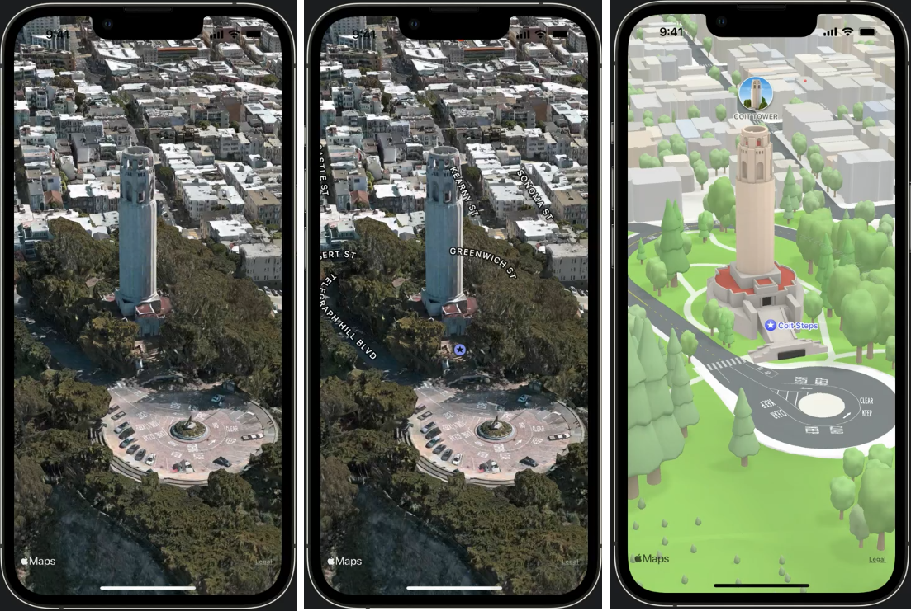
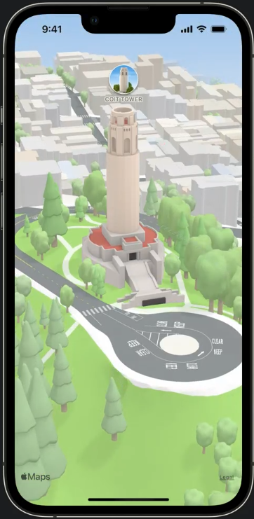
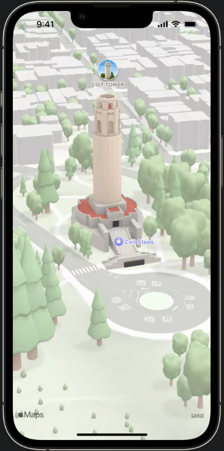
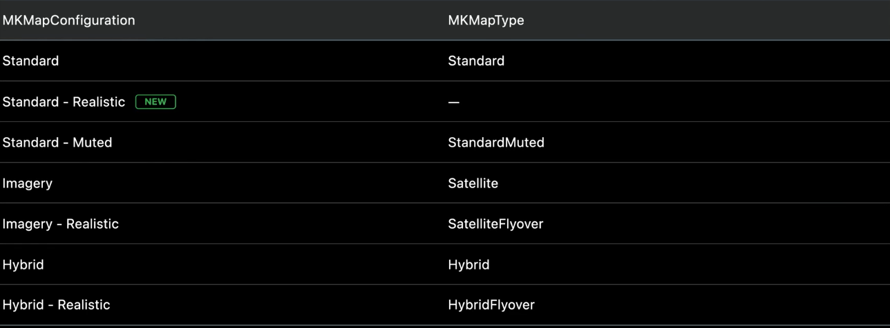
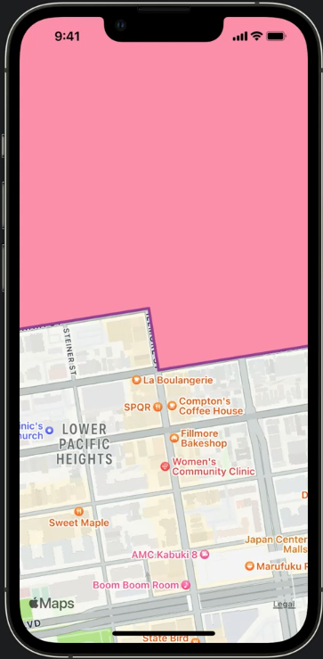
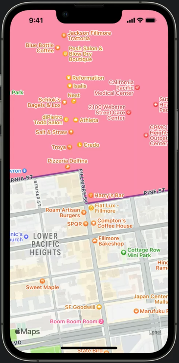
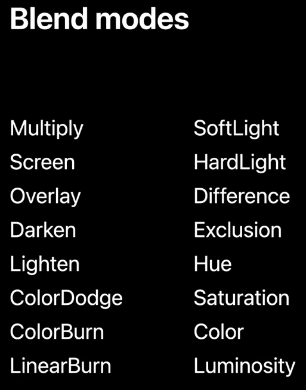
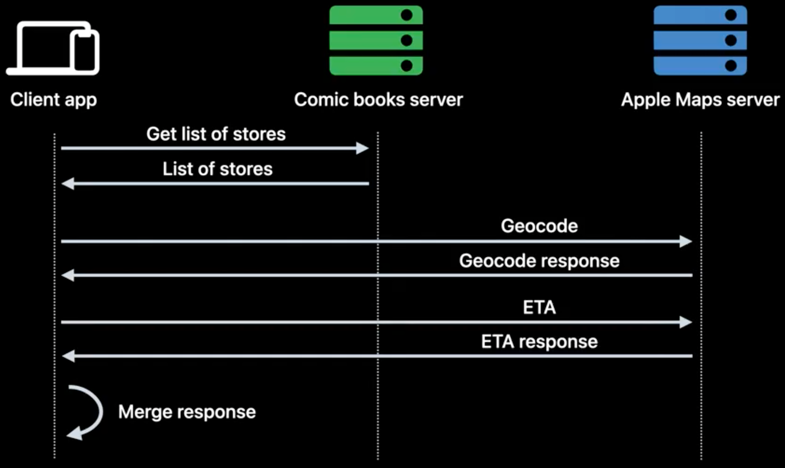
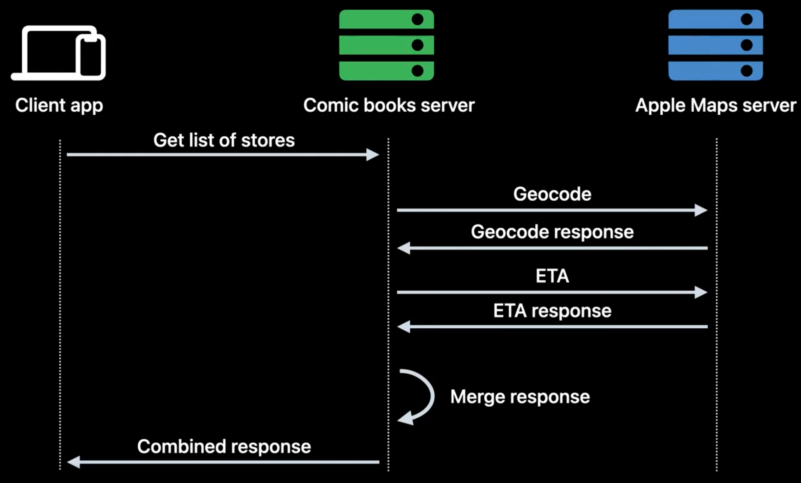

# WWDC22 10035 - 探索 MapKit 新功能

>作者：钟山，iOS 开发
>
>审核：士土Edmond木, 对 CocoaPods 有一点了解，目前对 Bazel 和 Swift 比较感兴趣。[Github Page](https://looseyi.github.io)
>
>本文基于 [Session 10035](https://developer.apple.com/videos/play/wwdc2022/10035/) 和 [Session 10006](https://developer.apple.com/videos/play/wwdc2022/10006/) 梳理。


自2012年6月11日 Apple 在 WWDC 上向外宣布在自家 iOS 中将不会再默认搭载 ‘Google 地图’，‘苹果地图’将取代而之默认在 iOS 的系统中向用户提供地图服务，不知不觉已经过去了整整十个年头。在 2012年9月正式开放使用之后，因取代‘Google 地图’所推出的自家地图服务内容不完整、功能欠佳等问题广受用户诟病。因为漏洞百出甚至引发过苹果的公关危机，CEO库克还因此公开向用户道歉。库克当时表示：“会不断改进‘苹果地图’给予用户的体验”以及“如果消费者不满意该地图所提供的服务，可以使用Google或是Nokia地图”。

在这十年里，‘苹果地图’持续修补漏洞、改进功能，从一开始依赖第三方数据到自己收集数据，一直在努力将其打造为世界上最好的地图应用。同时为开发者提供了两种将地图 app 整合到其产品中的方式，其中之一是 MapKit，可以让你将地图 app 整合到 iOS、iPadOS 或 macOS 的 app 中，这样你就能在 app 中显示地图或卫星图像、添加注释和悬浮窗、标注兴趣点、确定地图坐标信息等等。另外一个是MapKit JS，可为网站带来交互式地图，不只是添加注释、悬浮窗，还有搜索和导航等地图服务的界面。

在今年的 WWDC 中，苹果不仅带来了 MapKit 的新功能，还首次开放 Apple Maps Server API 来帮助开发者构建性能更好的地图服务。本文将对这部分内容进行详细介绍，主要分为两大块：

1. 探索 MapKit 新功能
2. Apple Maps Server API

## 探索 MapKit 新功能

### Map Configuration 地图配置

在 iOS 15 中，配置地图的方式是通过 MKMapView 上的各种属性。苹果在 iOS 16 中，将弃用这些属性，并引入了新的 Map Configuration API 作为替代。

即将废弃的API:

```Swift
class MKMapView {
   var mapType: MKMapType API_TO_BE_DEPRECATED
   var pointOfInterestFilter: MKPointOfInterestFilter? API_TO_BE_DEPRECATED
   var showsBuildings: Bool API_TO_BE_DEPRECATED
   var showsTraffic: Bool API_TO_BE_DEPRECATED
   ....
}

enum MKMapType  {
    case standard = 0
    case satellite = 1
    case hybrid = 2
    case satelliteFlyover = 3
    case hybridFlyover = 4
    case mutedStandard = 5
}
```

新 API 使用 MKMapConfiguration 作为新地图配置 API 的抽象基类，有三个具体子类，分别为MKImageryMapConfiguration、MKHybridMapConfiguration、MKStandardMapConfiguration。

如下面代码所示：

```Swift
class MKMapView {
    @available(iOS 16.0, *)
    var preferredConfiguration: MKMapConfiguration
   
    @available(iOS 16.0, *)
    var selectableMapFeatures: MKMapFeatureOptions
}

enum ElevationStyle {        
        case flat = 0 // 平面样式：意味着地面看起来是平坦的，道路，包括桥梁和立交桥，也显得平坦。
        case realistic = 1 // 逼真样式：意味着地面地形再现了真实世界的高程，例如丘陵和山脉。
}

class MKMapConfiguration {
     /// 基类支持 elevationStyle 属性，该属性可以是平面的，也可以是真实的。
	var elevationStyle: ElevationStyle
}

class MKImageryMapConfiguration: MKMapConfiguration { 
/// 影像地图配置：仅显示卫星影像，没有其它地图元素，因此它没有任何其他属性。
}

class MKHybridMapConfiguration : MKMapConfiguration { 
/// 混合地图配置
	var pointOfInterestFilter: MKPointOfInterestFilter? // 过滤器
	var showsTraffic: Bool // 是否展示交通流量状况
}

/// 强调样式
enum EmphasisStyle {
	case default // 
	case muted // 静音：隐藏你不关心的细节
}

class MKStandardMapConfiguration : MKMapConfiguration { 
/// 标准地图配置
	var emphasisStyle: EmphasisStyle
	var pointOfInterestFilter: MKPointOfInterestFilter?
	var showsTraffic: Bool
}

```

#### 配置类用途
以上配置使用效果如下图所示，从左到右依次为影像地图、混合地图、标准地图效果：



对比上面实现效果很容易看出来：

* 影像地图配置用于呈现卫星风格的影像
* 混合地图配置用于呈现基于图像的地图，其中添加了地图特征，例如道路标签和兴趣点
* 标准地图配置用于呈现完全基于图形的地图

#### ElevationStyle 角度样式

这是一个地图配置基类属性，所有的地图配置都可以设置，下图展示了标准地图配置分别设置 flat 和 realistic 的呈现效果：



这个属性可以理解为摄像机在不同高度摄像带来的不同视觉效果：

* flat为默认属性，这个属性下意味着地面看起来是平坦的，包括道路、桥梁和立交桥也显得平坦。
*  realistic意味着地面地形再现了真实世界的高度，例如丘陵和山脉，道路以逼真的高程细节描绘。

#### EmphasisStyle 强调样式

这个属性为标准地图配置独有，该属性可以是 default 或 muted。



可以看到：

* default为默认，呈现细节更丰富。
*  muted 对细节进行了弱化处理，隐去了部分细节，可以让用户关注你想让用户关注的信息。

#### 地图配置类和地图类型间的对应关系

针对新提供配置 API，不同的组合对应不同的 MKMapType，以下表格显示了新地图配置类和 MKMapType 属性之间的对应关系：




### Overlay improvements

简单回顾叠加层





iOS 16 中引入的一个新功能，称为透明建筑。无论您的叠加层是在道路之上还是在标签之上，当从上到下无倾斜地查看时，您的叠加层将始终呈现在建筑物的顶部。

```Swift
class MKMapView {
	func addOverlays(_ overlays: [MKOverlay], level: MKOverlayLevel)
}

enum MKOverlayLevel {   
    case aboveRoads = 0 //
    case aboveLabels = 1
}

```


### Blend modes

这个新的 API 让您可以更好地控制叠加层的外观和感觉，并解锁一系列新的创意可能性。

主要用来突出地理区域、淡化地图，使得内容突出。




### Selectable Map Features
用户点击地图可以在上面定义位置标签。

创建步骤

### Look Around 逛一逛

Look Around 是苹果地图在 iOS 13 中引入的，可以环顾四周来真正了解一个地方。 Look Around 图像提供了令人难以置信的细节水平，利用 3D 模型提供了与其他地图不同的真实感。在 iOS 16 中，苹果将 Look Around 引入到MapKit。

创建步骤


## Apple Maps Server API 苹果地图服务接口
苹果本次开放了四个服务 API 供开发者调用，分别是地址编码、逆向地址编码、地址搜索、估计到达时间。
本节将对新开放的 API 进行详细介绍，主要分为两大块：

1. 接口文档
2. 应用场景

### 接口文档
#### Generate a Maps Access Token 生成访问授权Token
用来获取请求访问授权 accessToken，为后续请求提供身份验证。

##### URL
```Json
GET https://maps-api.apple.com/v1/token
```

##### 请求例子
```Json
curl -si -H”Authorization: Bearer <maps_auth_token>” ”https://maps-api.apple.com/v1/token”
```

```Json
{
  “accessToken”: “<maps_access_token>”,
  “expiresInSeconds”: 1800
}
```


#### Geocoding 地址编码
用来获取指定地址的经纬度信息。
##### URL
```Json
GET https://maps-api.apple.com/v1/geocode
```
##### Query Parameters
|  参数   | 描述  | 类型  | 是否必须  |
|  ----  | ----  |----  | ----  |
| q  | 需要编码的地址，例子：q=1 Apple Park, Cupertino, CA | string | 是 |
| limitToCountries  | 限制查询国家范围，格式使用国家地区编码，多个国家是用逗号分割，例子：limitToCountries=US,CA. | [string] | 否 |
| lang  | 指定响应数据的语言，格式使用 BCP 47 语言标记，默认为英文，例子：lang=en-US. | string | 否 |
| searchLocation  | 搜索位置，格式为纬度经度，中间使用逗号分割，例子：searchLocation=37.78,-122.42. | string | 否 |
| searchRegion  | 搜索区域，格式为北纬东经南纬西经，中间使用逗号分割，例子：searchRegion=38,-122.1,37.5,-122.5. | string | 否 |
| userLocation  | 用户位置, 格式为纬度经度，中间使用逗号分割，例子，userLocation=37.78,-122.42. | string | 否 |
##### 请求例子
```Json
curl -si -H”Authorization: Bearer <maps_access_token>” ”https://maps-api.apple.com/v1/geocode?q=Apple%20Park%2C%20Cupertino%2C%20CA”
```

```Json
{
  “results”: [
    {
      “coordinate”: {
        “latitude”: 37.3301996,
        “longitude”: -122.0106415
      },
      “displayMapRegion”: {
        “southLatitude”: 37.3257080235794,
        “westLongitude”: -122.01629018770203,
        “northLatitude”: 37.3346911764206,
        “eastLongitude”: -122.00499281229798
      },
      “name”: “Apple Park Way”,
      “formattedAddressLines”: [
        “Apple Park Way”,
        “Cupertino, CA  95014”,
        “United States”
      ],
      “structuredAddress”: {
        “administrativeArea”: “California”,
        “administrativeAreaCode”: “CA”,
        “locality”: “Cupertino”,
        “postCode”: “95014”,
        “thoroughfare”: “Apple Park Way”,
        “fullThoroughfare”: “Apple Park Way”,
        “areasOfInterest”: [
          “Apple Park”
        ]
      },
      “country”: “United States”,
      “countryCode”: “US”
    }
  ]
}
```

####  Reverse Geocoding 逆向地址编码
用来获取经纬度对应的地址列表。
##### URL
```Json
GET https://maps-api.apple.com/v1/geocode
```
##### Query Parameters
|  参数   | 描述  | 类型  | 是否必须  |
|  ----  | ----  |----  | ----  |
| loc  | 需要查询地址的经纬度，格式为纬度经度，中间使用逗号分割，例子：loc=37.3316851,-122.0300674 | string | 是 |
| lang  | 指定响应数据的语言，格式使用 BCP 47 语言标记，默认为英文，例子：lang=en-US. | string | 否 |
##### 请求例子

```Json
curl -si -H”Authorization: Bearer <maps_access_token>” ”https://maps-api.apple.com/v1/reverseGeocode?loc=37.3301996%2C-122.0106415”
```

```Json
{
  “results”: [
    {
      “coordinate”: {
        “latitude”: 37.3301996,
        “longitude”: -122.0106415
      },
      “displayMapRegion”: {
        “southLatitude”: 37.3257080235794,
        “westLongitude”: -122.01629018770203,
        “northLatitude”: 37.3346911764206,
        “eastLongitude”: -122.00499281229798
      },
      “name”: “Apple Park Way”,
      “formattedAddressLines”: [
        “Apple Park Way”,
        “Cupertino, CA  95014”,
        “United States”
      ],
      “structuredAddress”: {
        “administrativeArea”: “California”,
        “administrativeAreaCode”: “CA”,
        “locality”: “Cupertino”,
        “postCode”: “95014”,
        “thoroughfare”: “Apple Park Way”,
        “fullThoroughfare”: “Apple Park Way”,
        “areasOfInterest”: [
          “Apple Park”
        ]
      },
      “country”: “United States”,
      “countryCode”: “US”
    }
  ]
}
```
#### Estimated Time of Arrival 预计到达时间
用来计算从指定位置出发到某个目的地的到达时间。
##### URL
```Json
GET https://maps-api.apple.com/v1/geocode
```
##### Query Parameters
|  参数   | 描述  | 类型  | 是否必须  |
|  ----  | ----  |----  | ----  |
| origin  | 开始位置，格式为纬度经度，中间使用逗号分割，例子：origin=37.331423,-122.030503 | string | 是 |
| destinations  | 目的地 ，格式为纬度经度，例子：destinations=37.32556561130194,-121.94635203581443 | [string] | 是 |
| departureDate  | 出发时间（UTC），格式为 ISO 8601格式，如果不传则使用服务端当前时间，例子：departureDate=2020-09-15T16:42:00Z | string | 否 |
| transportType  | 交通工具类型，目前支持三个交通工具，Automobile（汽车）、Transit（运输）、Walking（步行），默认为Automobile，例子：transportType= Automobile | string | 否 |

注意：destinations 参数至少有一个目的地，最多不超过10个，多个的话使用“|”分割，例子：destinations=37.32556561130194,-121.94635203581443|37.44176585512703,-122.17259315798667
##### 请求例子
```Json
curl -si -H”Authorization: Bearer <maps_access_token>” ”https://maps-api.apple.com/v1/etas?origin=37.331423,-122.030503&destinations=37.32556561130194,-121.94635203581443|37.44176585512703,-122.17259315798667”
```

```Json
{
  “etas”: [
    {
      “destination”: {
        “latitude”: 37.32556561130194,
        “longitude”: -121.94635203581443
      },
      “transportType”: “AUTOMOBILE”,
      “distanceMeters”: 9550,
      “expectedTravelTimeSeconds”: 975,
      “staticTravelTimeSeconds”: 540
    },
    {
      “destination”: {
        “latitude”: 37.44176585512703,
        “longitude”: -122.17259315798667
      },
      “transportType”: “AUTOMOBILE”,
      “distanceMeters”: 23286,
      “expectedTravelTimeSeconds”: 1336,
      “staticTravelTimeSeconds”: 1039
    }
  ]
}
```
#### Search 搜索
用来搜索指定名称的地点。
##### URL
```Json
GET https://maps-api.apple.com/v1/geocode
```
##### Query Parameters
|  参数   | 描述  | 类型  | 是否必须  |
|  ----  | ----  |----  | ----  |
| q  | 需要搜索的地址，例子：q=eiffel tower | string | 是 |
| excludePoiCategories  | 需要排除在搜索结果里的兴趣点类型集合, 格式为兴趣点类型，中间使用逗号分割，例子，excludePoiCategories =Restaurant,Cafe | [PoiCategory] | 否 |
| includePoiCategories  | 搜索兴趣点类型集合, 格式为兴趣点类型，中间使用逗号分割，例子，includePoiCategories=Restaurant,Cafe | [PoiCategory] | 否 |
| limitToCountries  | 限制查询国家范围，格式使用国家地区编码，多个国家是用逗号分割，例子：limitToCountries=US,CA. | [string] | 否 |
| resultTypeFilter  | 用户位置, 格式为纬度经度，中间使用逗号分割，例子：resultTypeFilter=Poi | [string] | 否 |
| lang  | 指定响应数据的语言，格式使用 BCP 47 语言标记，默认为英文，例子：lang=en-US. | string | 否 |
| searchLocation  | 搜索位置，格式为纬度经度，中间使用逗号分割，例子：searchLocation=37.78,-122.42. | string | 否 |
| searchRegion  | 搜索区域，格式为北纬东经南纬西经，中间使用逗号分割，例子：searchRegion=38,-122.1,37.5,-122.5. | string | 否 |
| userLocation  | 用户位置, 格式为纬度经度，中间使用逗号分割，例子，userLocation=37.78,-122.42. | string | 否 |
> PoiCategory：兴趣点类型

##### 请求例子
```Json
curl -si -H”Authorization: Bearer <maps_access_token>” “https://maps-api.apple.com/v1/search?q=eiffel%20tower”
```

```Json
{
  “displayMapRegion”: {
    “southLatitude”: 48.856909736059606,
    “westLongitude”: 2.2924737352877855,
    “northLatitude”: 48.85963364504278,
    “eastLongitude”: 2.2965897526592016
  },
  “results”: [
    {
      “name”: “Eiffel Tower”,
      “formattedAddressLines”: [
        “5 Avenue Anatole France”,
        “75007 Paris”,
        “France”
      ],
      “structuredAddress”: {
        “administrativeArea”: “Île-de-France”,
        “locality”: “Paris”,
        “postCode”: “75007”,
        “subLocality”: “Tour Eiffel-Champs de Mars”,
        “thoroughfare”: “Avenue Anatole France”,
        “subThoroughfare”: “5”,
        “fullThoroughfare”: “5 Avenue Anatole France”,
        “areasOfInterest”: [
          “Eiffel Tower”,
          “Parc Du Champ De Mars”
        ],
        “dependentLocalities”: [
          “7th arr.”,
          “Tour Eiffel-Champs de Mars”
        ]
      },
      “country”: “France”,
      “countryCode”: “FR”,
      “coordinate”: {
        “latitude”: 48.85827172505176,
        “longitude”: 2.294531782785587
      }
    }
  ]
}
```
### 应用场景
不同设备上的同一个 app 重复请求同一个地址，会造成大量重复的请求，造成用户设备带宽和功耗浪费。苹果建议应用后端服务作为网关来请求苹果地图服务接口，可以大大减少请求数量，节省用户宝贵的带宽、功耗。

> 需要注意的是苹果这次开放的服务 API 有访问配额，目前每天访问配额是25,000次，并且 MapsKit 和 MapKit JS 共享同一份配额。超过访问上限，苹果服务器将返回429错误码。如果你的 app 需要更多的访问配额，可以向苹果进行申请。

#### 应用示例
现在通过一个例子，来看看使用苹果地图服务接口前后给服务架构带来哪些变化。假如我们正在构建一个漫画书店位置服务，通过下图所示卡片的列表来告诉用户附近有哪些书店，卡片包含书店名称、地址、距离用户路程等位置信息。


首先来看看没有苹果地图服务 API 的服务架构：（假设包括这家漫画书店在内的地址信息已经存储在服务器上，并随时可以调用）



1. 设备首先向应用服务器请求，以获取漫画书店地址列表，后端服务器返回漫画书店地址列表到客户端设备。
2. 通过 MapKit 直接请求苹果地图服务，获取所需信息。
3. 合并第二步的所有响应，得到想要信息。

客户端和苹果服务端之间的这种互动，尤其是第二步必须执行大量操作，每执行一次任务，用户可能都需要多次向后端发送请求，会对 App 的性能产生负面影响。特别在通常具有高延时的蜂窝网络上，以这种使用方式单个请求，效率很低，甚至可能导致连接中断或数据丢失。当每个请求可以并行完成时，App 必须在单独的连接上发送、等待和处理每个请求的数据，失败的可能性大大增加。最后客户端还要合并端上所有的响应，客户端设备需要为这些额外的调用使用更多的带宽和功耗。

应用后端服务器作为网关请求苹果地图服务 API 的服务架构：



1. App 首先向应用服务器请求。
2. 应用服务器通过苹果服务接口来发起请求，并收到苹果地图服务器的响应。
3. 应用服务器组合来自服务的每个响应，并将响应发给App。

这种做法减少和苹果服务器之间的互动，App 仅仅向应用服务端发送一次请求，应用服务端完成了繁重的工作，相比之前的处理方式，这样用户体验更加友好。

#### 使用开放 API 的好处
* 全栈架构，一份服务可以多处使用。（考虑到应用还有安卓系统，这点存疑）
* 更高的网络性能
* 更低的功耗

## 总结

从安全角度考虑，外国公司在中国是没有测绘资格的，所以苹果地图一直使用的是高德提供的数据。同时高德也有自己的移动地图应用，使用体验来看苹果地图的更新远慢于高德地图，高德地图的数据可以天级别甚至分钟级别在线更新，服务迭代也很快，苹果地图服务几乎是月或季度级别。所以在国内的应用，基本不太会使用MapKit。

但是如果你负责开发的应用要出海，可以考虑使用苹果全新地图 API，支持可选地图功能和环顾四周等全新功能。

带有 3D 城市体验的全新地图需要兼容的硬件。在 iOS 上，新地图支持需要基于 A12 的 iPhone 和 iPad 或更高版本。在 macOS 上，新的地图支持需要任何基于 M1 的计算机或更高版本。

在 3D 城市体验不可用的区域，地图将自动退回以呈现具有平坦海拔的全新地图。在所有其他设备上，全新地图将以平面高度呈现。

在 M1 Mac 上，Xcode 允许您通过更改操作系统版本来模拟这两种体验。我们鼓励您尝试两者，以确保您的应用在所有设备上看起来都很棒！ 3D 城市体验可在世界各地的许多大都市地区使用。我们不断在此列表中添加新城市，因此我鼓励您查看会话说明中链接的功能可用性网站上的 3D 城市体验部分。我们关于采用全新地图和使用地图配置 API 的部分到此结束。
