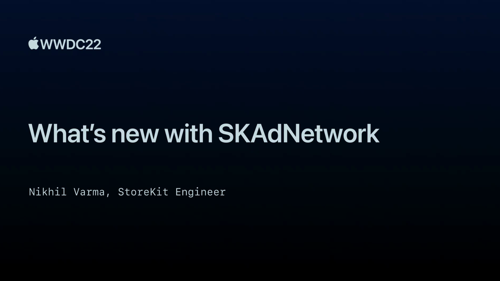

## 个人介绍

Sinno，iOS 开发者，目前就职于字节跳动音乐团队

## 审核介绍

士土Edmond木, 对 CocoaPods 有一点了解，目前对 Bazel 和 Swift 比较感兴趣。[Github Page](https://looseyi.github.io)

## 不超过 120 个字的文章简介

SKAdNetwork 是苹果于 2018 年推出的 App 安装归因框架，主要目标是在保护用户隐私的前提下，将归因数据发送给广告商，帮助广告主衡量广告的投放效果。在 WWDC 2022 上，苹果介绍了最新版本 4.0 的新特性，让我们一起来看看吧！

## 公众号/小专栏图文头图

