> 作者：Sinno，iOS 开发者，目前就职于字节跳动音乐团队
>
> 审核：士土 Edmond 木

# WWDC22 10038 - SKAdNetwork 4.0 新特性

## 前言

SKAdNetwork 是苹果于 2018 年推出的 App 安装归因框架，主要目标是在保护用户隐私的前提下，将归因数据发送给广告商，帮助广告主衡量广告的投放效果。在发布之初，SKAdNetwork 并未引起重视，主要是因为基于 IDFA 的归因方案已经非常成熟，随着 ATT 政策正式实施，IDFA 已经无法轻松获取，基于 SKAdNetwork 的归因方案越来越被人们重视。

在过去几年里，SKAdNetwork 也在不断完善， 在 WWDC 2022 上，苹果介绍了最新版本 4.0 的新特性，本文基于 session 10038 写作，分为以下几个部分：

1. 广告归因介绍
2. IDFA 归因
3. SKAdNetwork 归因
4. SKAdNetwork 4.0 新特性

## 广告归因介绍

### 广告归因

说到广告，相信大家并不陌生，但是你有想过你一天会看到多少广告吗？ 50 个？ 100 个？ 太少了！真实的数字可能有点夸张，据国外统计，2021 年，一个普通人一天要看超过 6000 个广告！

对于普通用户来说，看到的大部分广告都被习惯性忽视了，只有极少部分广告会真正影响用户的行为和决策---比如下单购买、下载 app 等。

对于广告主来说，肯定是希望花最少的钱，做最有营销效果的广告。

百货业之父约翰·沃纳梅克有句话特别出名：**"我知道有一半广告费浪费了，但我不知道是哪一半"**
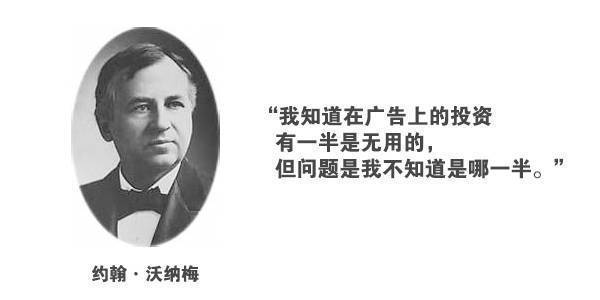

如何找到浪费的哪一半广告费？最有效的办法就是**对广告效果进行归因**。

> 这里先定义两个概念：
>
> 曝光：广告展示到用户面前
>
> 转化：用户观看广告后产生的下载、注册、充值、下单等行为

归因就指将转化功劳分配给用户完成转化所经历路径中的广告曝光。
> 举个例子：小米公司推出一款新手机，同时在某音，某手投放广告做推广，用户看到广告后可以点击广告链接直接跳到消费页进行购买。广告链接里带有广告 id， 可以标识该用户来自哪个广告。
>
> 投放一周后，通过用户消费来源链接的不同进行归因，发现来自某音的转化比某手要高，那么接下来就可以在某音投放更多的广告预算。
>

这个简单的例子只是想表现广告归因的重要性，它可以衡量广告的效果，指导后续的投放策略。
目前已经有很多专业的三方归因监测公司，比如 AppsFlyer，Adjust 等。

### iOS App 下载归因

本篇文章要讲的场景是 iOS 上 App 下载安装的归因。

iOS App 下载归因的方式有很多，如下图 AppsFlyer 介绍的归因方案，但是确定式匹配的目前只有基于设备 ID 匹配和 SKAdNetwork 的方案（苹果搜索广告只支持 App Store 里的广告，此处暂不涉及）。
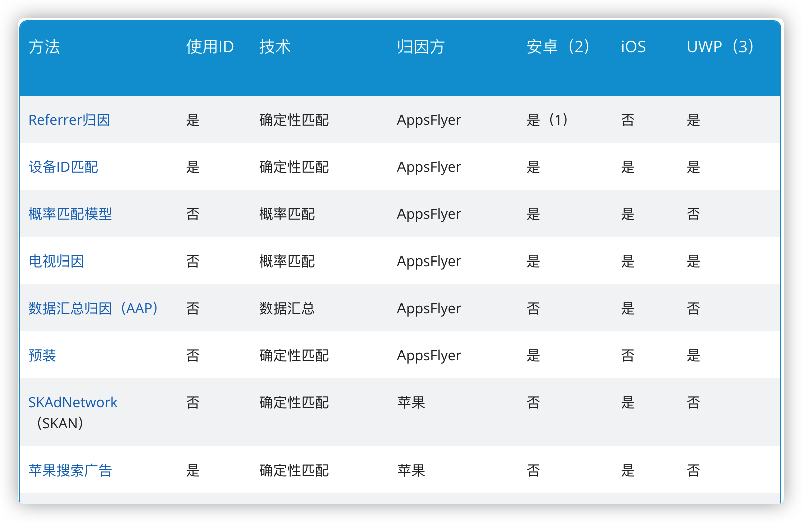

**归因优先级和归因窗口**

在用户下载前可能浏览/点击了多次广告，这种情况如何归因？

一般归因平台都会先归因到最近的点击，如果没有点击事件，才会归因到最近的浏览事件。

浏览和点击事件的回溯窗口也是不一样的，以 AppsFlyer 为例，浏览型归因的回溯窗口期是 24 小时，而点击型归因的窗口期是 7 天。

## IDFA 归因方案

### 什么是 IDFA

IDFA (Identifier for Advertising), 是 Apple 向用户设备随机分配的设备标识符, 广告主使用此标识符来跟踪数据，以便提供个性化广告。

其推出的主要目的是保护用户隐私（用户可以主动重置），替换之前用于唯一标识用户的 MAC 地址、UUID 等 ID。

IDFA 最重要的特点是：每个设备只有一个 IDFA， 同一设备不同 App 获取的 IDFA 是一致的。

### IDFA 归因

IDFA 匹配的过程如下：

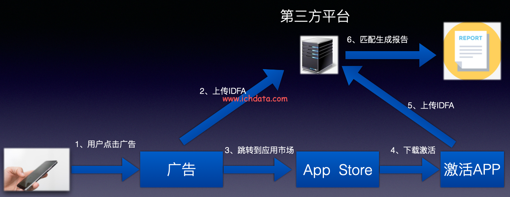

### 越来越严格的 IDFA 政策

从 IDFA 推出以来就可以由用户主动重置，重置后 App 获取的 IDFA 将和之前的不一致，从而避免被持续追踪。

2016 年，苹果更是推出了 LAT（Limit Ad Tracking）限制广告追踪政策，开启 LAT 后， App 获取到的 IDFA 将为全是 0 的字符串。据 Adjust 估算，至少有 12% 的 iOS 用户启用了 LAT，但仍没有影响 IDFA 成为主流的归因方案。

2021 年，苹果正式开始实施 ATT (App Tracking Transparency) 隐私政策，从 iOS 14.5 开始，App 需要用户授权同意才可获取到 IDFA。

据 AppsFlyer 的调查数据表明，只有 40% 左右的用户会同意获取 IDFA 的权限，在这种情况下，单纯通过 IDFA 进行匹配归因将无法覆盖大部分 iOS 用户。

## SKAdNetwork 归因

SKAdNetwork 是苹果于 2018 年推出的归因框架，可以在保护用户隐私的同时进行 App 下载归因。随着 ATT 政策的实施，SKAdNetwork 已经成为 iOS 平台上非常重要的精确式归因方案。

SKAdNetwork 涉及的参与者有三个：

* 广告网络(Ad networks): 在广告产生转化后签署广告并接收安装验证回传
* 媒体 App (Source apps): 从广告网络拉取广告并进行展示
* 广告主 App (Advertised apps): 在应用启动后调用相关 API 进行注册，以及后续转化数据的上报

### 归因过程

下图描述了 StoreKit 呈现的广告的安装验证路径。应用 A 是显示广告的媒体 App。应用 B 是用户安装的广告主 App

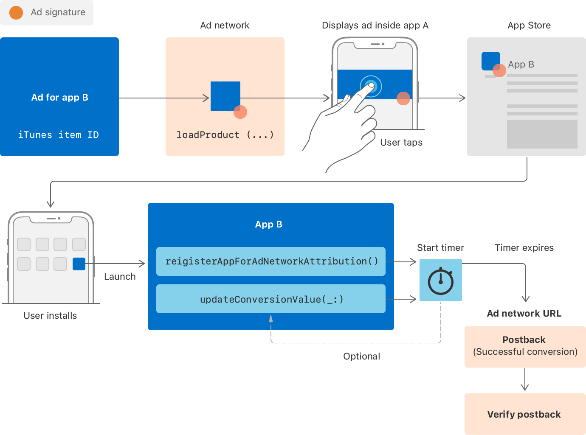

1. 应用 A 展示从广告网络加载的带有签名的广告
2. 用户点击广告进入 App Store 页面下载安装了应用 B
3. 应用 B 启动后调用 registerAppForAdNetworkAttribution 进行广告归因注册，第一次调用此方法时，若设备本地有归因数据，则会生成安装通知，同时启动一个 24h 的定时器。在 24h 内若调用 updateConversionValue 方法，则会重置该定时器(重新生成 24h 的定时器)
4. 24h 定时器到期，设备将在随机 0~24h 后向广告网络发送验证回传数据
5. 广告网络收到验证回传数据并进行归因

### 归因优先级和归因窗口期

StoreKit 呈现的广告总是优先于浏览广告，即使浏览广告事件后发生。

* 对于 StoreKit 呈现的广告， 用户在 30 天内下载了 App 就会被归因。

* 而对于浏览型的广告，用户在 24 小时内下载了 App 才能被归因。

* 在下载事件发生后，用户有 60 天的时间启动 App。

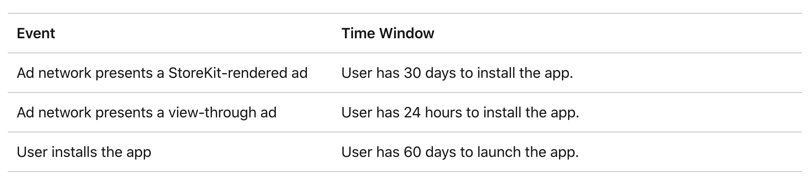

### 获胜回传和非获胜回传

Apple 归因回发数据里有个 did-win 字段，标识了是否获胜归因

> 获胜回传：归因到的广告所属广告网络会收到获胜回传
>
> 非获胜回传：未被归因的广告所属广告网络收到该回传

设备根据 SKAdNetwork 和 iOS 版本发送一个或多个回发：

* 对于使用 SKAdNetwork 版本 1 到 2.2 签名的广告，设备会发送一个获胜回传。

* 从 iOS 14.6 开始，对于使用 3.0 或更高版本签名的广告，设备会发送一个获胜回传，以及最多五个非获胜回传。

* 从 iOS 15 开始，如果开发者选择接收，设备还会将获胜回传的副本发送给广告应用的开发者。

事件的时间窗口同样适用于获胜和未获胜的回发。

## SKAdNetwork 4.0 新特性

在 WWDC 2022 中，Apple 介绍了 SKAdNetwork 4.0 的四个新特性：分层源标识符、分层转换价值、多次转换和 SKAdNetwork 网络归因，以及人群匿名性和 SKAdNetwork 的可测试性。

### 人群匿名性 (Crowd Anonymity)

人群匿名性是 Apple 用来指代 SKAdNetwork 提供归因数据的隐私保护方式的术语。安装次数决定了对用户隐私的保护级别。

当安装计数较低时，Apple 会采取额外措施通过限制发回的可跟踪信息来保护隐私。
随着计数的增加和用户的独特性开始融入人群，Apple 会发回更多数据。
最后，当计数达到最高层时，Apple 能够发回最多的数据，同时仍然保护隐私。

下面要介绍的分层源标识符、分层转换价值就会受人群匿名性层级的影响。

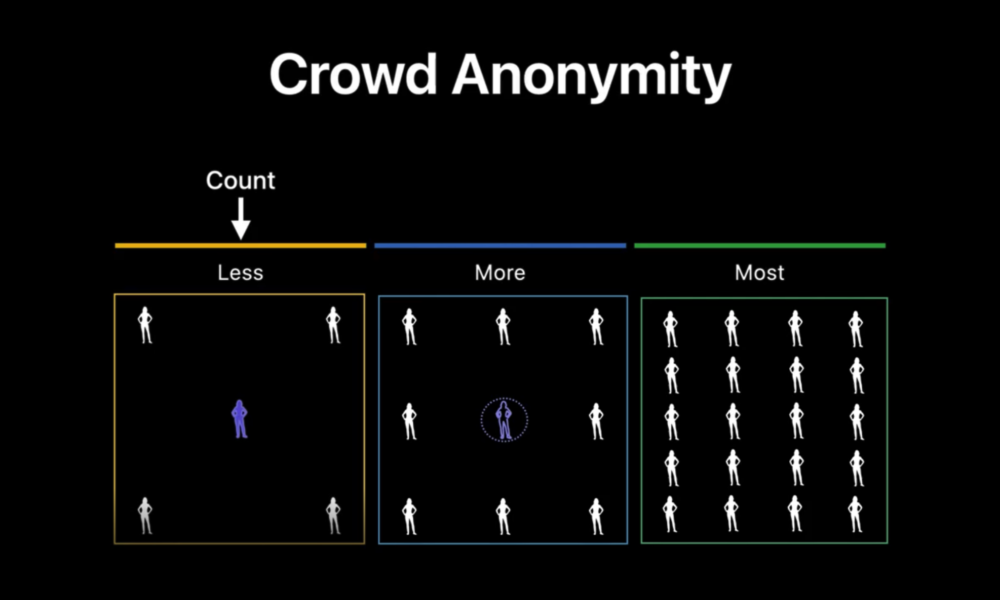

### 分层源标识符 (Hierarchical IDs)

SKAdNetwork 4.0 将活动标识符 (campaign identifier) 字段由两位数字扩充至四位数字，并且重命名为源标识符(source identifier)。

广告平台可以根据广告目标定义这个四位数的意义：例如，活动价值、广告位置或广告创意类型。

需要注意的是，为了保护隐私， 源标识符在回发中发送的数字位数具体取决于安装次数和活动已满足的隐私级别：在安装次数较低时只会发送低 2 位的数字，在安装量足够大时才会发送完整的 4 位数字。

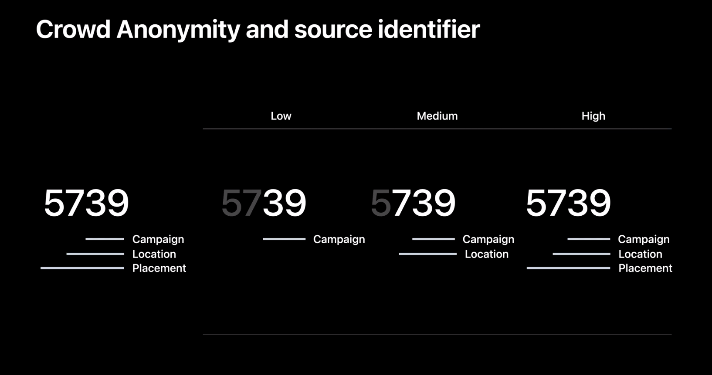

API 的变化：

1. SKAdImpression 新增属性 sourceIdentifier
2. SKStoreProductViewController 也相应的新增了源标识符对应的 key

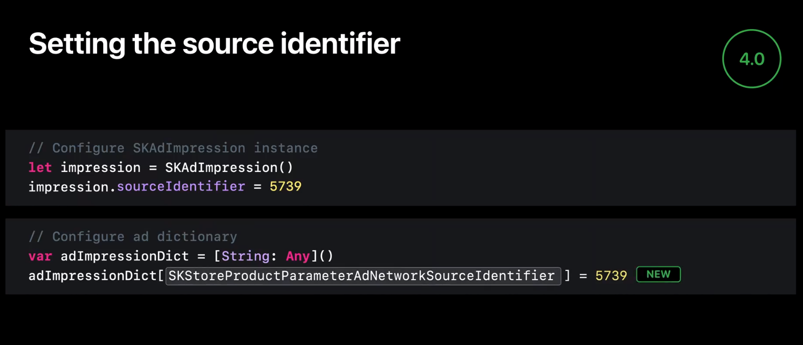

### 分层转化价值 (Hierarchical conversion values)

在 SKAdNetwork 4.0 中，苹果引入了两个转化值：粗粒度值和细粒度值。

* 粗粒度值：当广告系列的应用安装数量较少时，此值仅向广告商发送有限的效果信息。
* 细粒度值：只有在满足额外的隐私阈值时，广告商才会收到更详细的归因信息。用户隐私仍将得到保护。
  
当广告活动的应用安装数量较少时，粗粒度值可让广告商收到有限的归因信息。
粗粒度值可以是低、中或高。当满足额外的隐私阈值时发送细粒度值，并提供更详细的归属信息，同时仍保留用户隐私。细粒度值有 64 个可能的值。

分层转换值是有条件的，并且仅在发生足够数量的安装时才会显示。

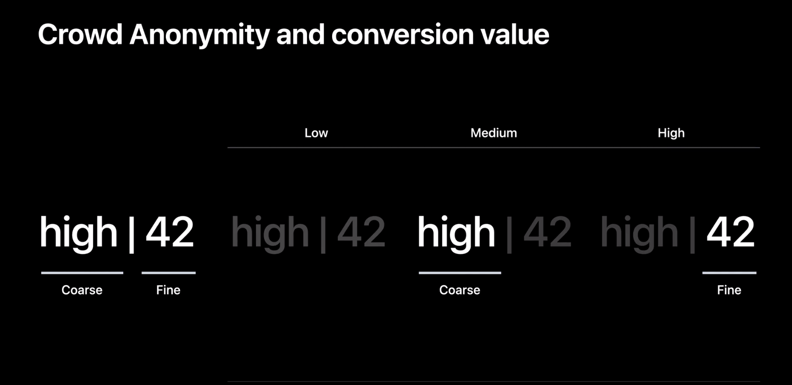

API 的变化：在更新转化值时，可以指定粗粒度值了。

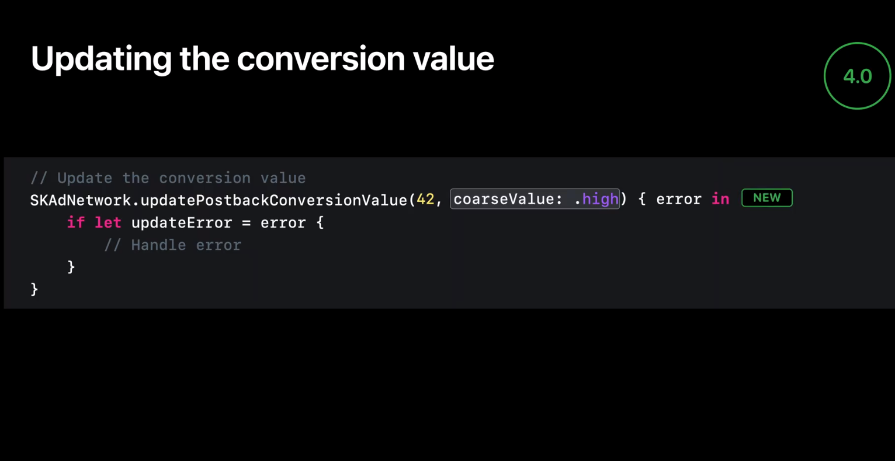

### 多次转化 (Multiple conversions)

在 SKAdNetwork 4.0 之前，转化事件只会发送一次，而现在广告平台最多可以收到三个回发，每个回发都基于特定的转化窗口（分别为 0-2 天、3-7 天和 8-35 天）。

这使广告网络能够更好地了解从广告系列安装应用程序的人随着时间的推移与广告应用程序的互动程度。SourceID、SourceAppID 和粗粒度转换值是有条件的，仅在满足隐私阈值时才包含在第二次和第三次回发中。

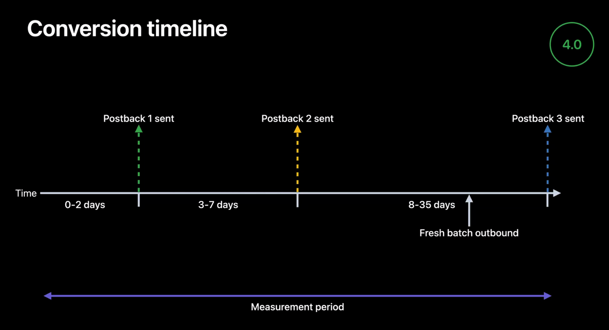

### SKAdNetwork 网络归因 (Web to SKAdNetwork)

SKAdNetwork 4.0 支持网页下载 app 归因，其归因过程如下：

1. 用户点击广告链接（需要配置额外参数），跳转到 App Store 对应的应用程序页面
2. Apple 向广告网络请求广告曝光数据
3. 用户安装 & 使用该应用程序
4. 经过一段时间更新转化值后，Apple 向广告网络发送转化事件

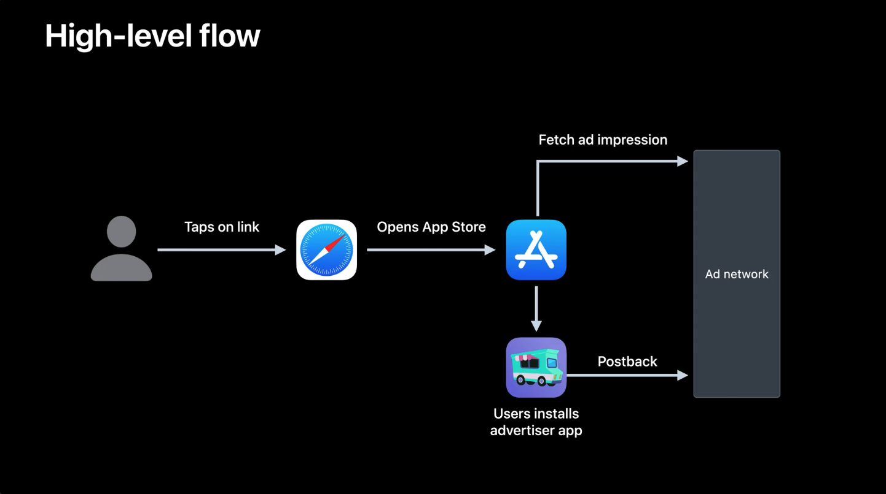

#### 广告链接配置

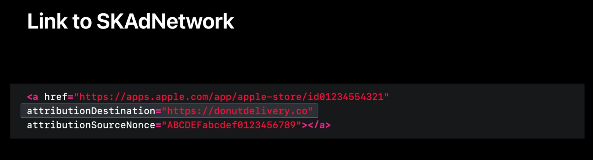

* href:  要下载的应用程序在 App Store 的链接
* attributionDestination: 告诉 Apple 从哪里获取广告曝光数据
* attributionSourceNonce: 广告平台根据这个值确定要发回的广告曝光数据

#### Apple 发送请求

Apple 从 attributionDestination 提取 host， 然后加上固定的协议和路径得到完整的请求 URL:

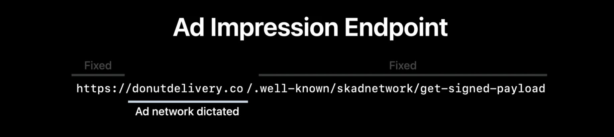

得到 URL 后会向其发送一个 POST 请求， body 里有个 source_nonce 字段，其值就是链接里配置的 attributionSourceNonce

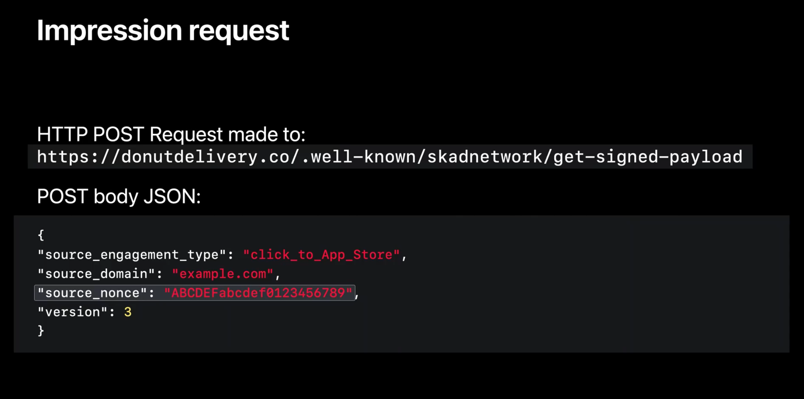

#### 广告网络返回广告曝光数据

广告网络收到请求后，应该返回对应的广告曝光数据。

响应参数如下： 其中 source_domain 就像 SourceAppID  一样标识了广告来源渠道。

总结一下，要支持网页的下载归因，广告网络需要

1. 生成广告链接
2. 提供获取广告曝光数据的接口服务
3. 支持处理回传数据的新字段 source_domain

媒体侧就只需要将广告链接和相关参数嵌入页面就可以了。

### SKAdNetwork 测试

SKAdNetwork 整个归因链路还是比较长的，测试和验证比较麻烦。

好在 Apple 也发现了这一点，在 Xcode 13.3 上提供了对 SKAdNetwork 可测试性支持，作为单元测试框架集成在 StoreKitTest 中。

在 WWDC 2022 上，介绍了两个容易出现问题的场景的测试：

* 验证曝光数据签名

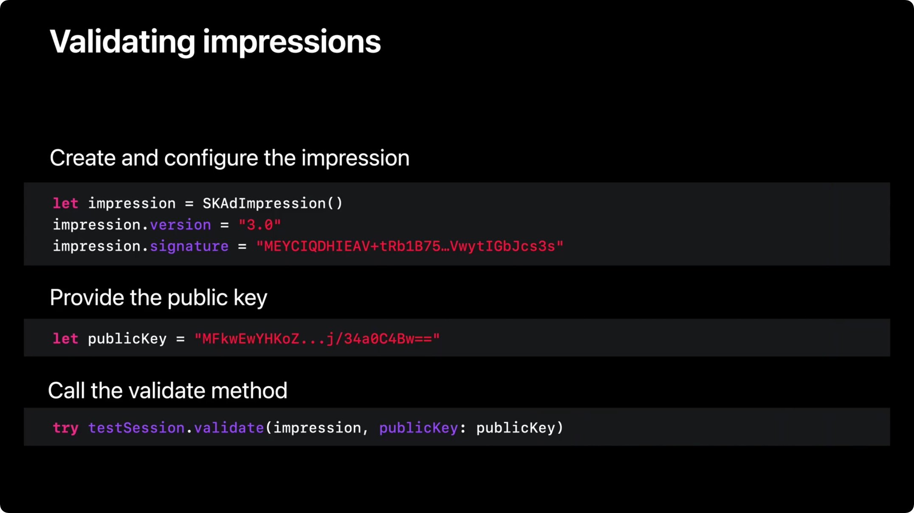

* 测试回传数据

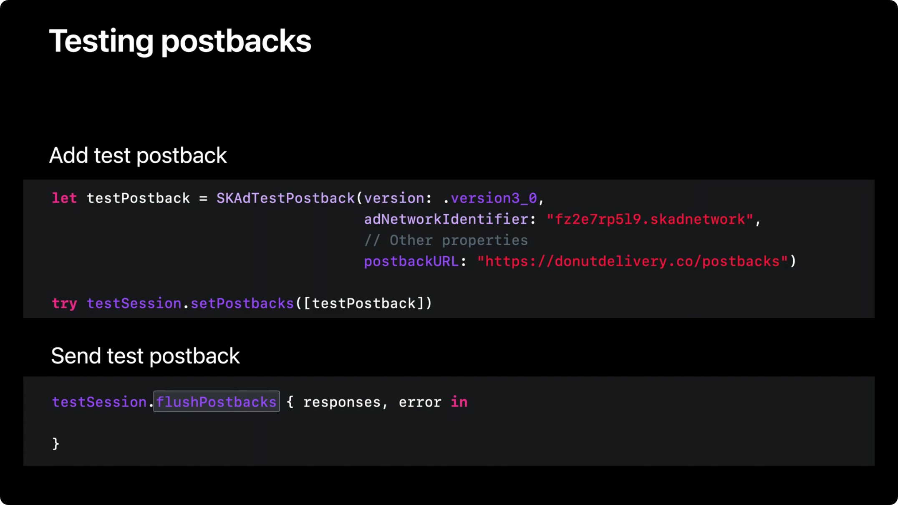

## 总结

本篇文章首先介绍了什么是广告归因，以及 iOS app 下载归因方案，包括基于 IDFA 的方案和 Apple 推出的 SKAdNetwork 方案。同时也介绍了 SKAdNetwork 4.0 的新特性：分层源标识符、分层转化值、多次转化及网络归因支持。随着 ATT 政策的执行，基于 SKAdNetwork 的方案已经成为主流方案。

## 参考链接

<https://developer.apple.com/documentation/storekit/skadnetwork/>

<https://ppcprotect.com/blog/strategy/how-many-ads-do-we-see-a-day/>

<https://www.ichdata.com/app-traffic-source-tracking-method-for-ios.html>

<https://www.appsflyer.com/blog/trends-insights/att-opt-in-rates-higher/>
