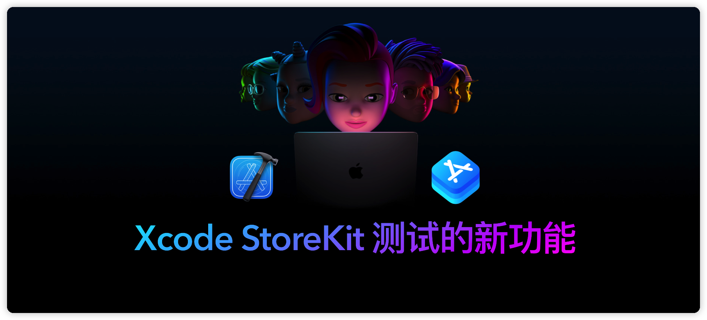

## 个人介绍

iHTCboy，目前就职于三七互娱37手游，从事游戏 SDK 开发多年，对 IAP 和 SDK 架构设计有丰富的实践经验。

## 审核介绍

黄骋志（橙汁），目前就职于字节跳动西瓜视频，负责基础技术相关工作，协助复杂业务进行重构。曾参与长视频支付相关工作。

SeaHub，目前任职于腾讯 TEG 计费平台部，负责搭建服务于腾讯系业务的支付组件 SDK，对 IAP 相关内容及 SDK 设计开发有一定的经验。

王浙剑（Damonwong），老司机技术社区负责人、WWDC22 内参主理人，目前就职于阿里巴巴。

## 不超过 120 个字的文章简介

本文主要聚焦于 In-App Purchase 内购商品的测试。在 Xcode 12 之前，App 内购买项目是不能在 Xcode 模拟器中进行购买，只能使用真机进行测试内购充值，因为模拟器无法连接到 App Store 服务器进行交易。苹果在 WWDC20 推出了 [StoreKit Testing](https://developer.apple.com/videos/play/wwdc2020/10659)，通过 Xcode 12 创建 StoreKit 配置文件和搭建本地测试环境，实现本地 App 内购买和验证收据等测试流程，而无需依赖 App Store 服务器。而今年的 WDC22 苹果对 StoreKit 测试流程改进完善，包含 Xcode 14 中测试功能的优化，支持订阅商品更多场景的测试，还有 StoreKit 配置文件通过 App Store Connect 自动同步等等。

## 公众号/小专栏图文头图

