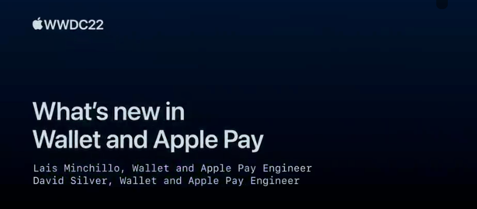

## 个人介绍

展菲，目前在某上市企业从事移动端项目研发。Swift 社区负责人，《ESP32-C3 物联网工程开发实战》作者。CSDN 博客专家，iOS 领域新星创作者，技术博客总访问量已达数百万。

## 审核介绍

士土Edmond木， 对 CocoaPods 有一点了解，目前对 Bazel 和 Swift 比较感兴趣。[#Github Page](https://looseyi.github.io)

小姜，现就职于 Booking.com 本地支付团队，在努力研究 SwiftUI 相关内容。目前 Booking.com 在伦敦、阿姆斯特丹、上海办公室都在招募移动开发，需要内推的同学欢迎加微信
`jiangyi--1130` 私聊。

王浙剑（Damonwong），老司机技术社区负责人、《WWDC22 内参》主理人，目前就职于阿里巴巴。

## 文章简介

本文通过回顾 `WWDC 2022` 了解 `Wallet` 和 `Apple Pay` 常规更新和新增的功能。其中常规更新包含：**无接触支付**、**Mac 同步 Apple Pay 功能**、**SwiftUI 新增 API**等功能，新增功能包含：**多商户支付**、**自动支付**、**订单跟踪**、**身份验证**等功能。最后更新了交通卡支持 `Apple Pay` 的城市和地区以及目前支持的设备，并提供相关 `Demo` 以供大家测试。

## 公众号/小专栏图文头图

