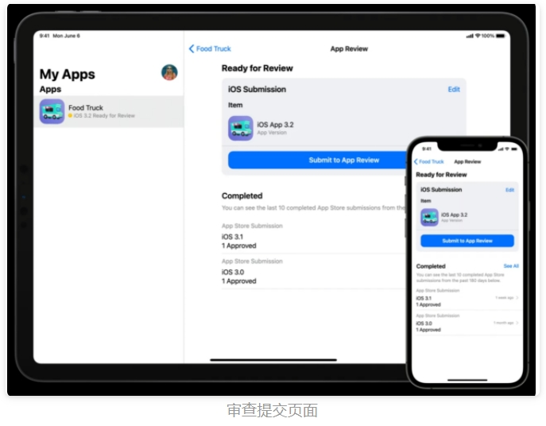
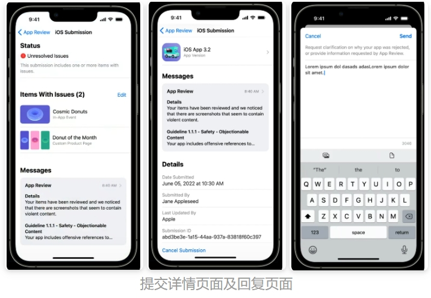
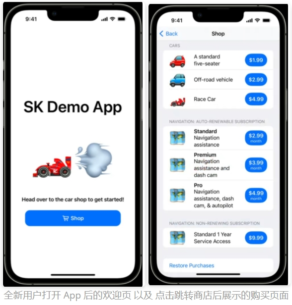
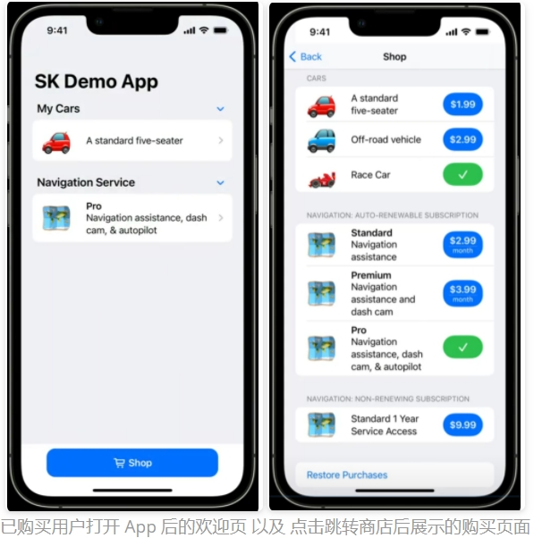

# 【WWDC22 10043/10044/110404】App Store Connect 中的新特性及最佳实践

本文基于 session [10043](https://developer.apple.com/videos/play/wwdc2022/10043/) 、[10044](https://developer.apple.com/videos/play/wwdc2022/10044/) 、[110404](https://developer.apple.com/videos/play/wwdc2022/110404/) 整理。

## 前言

本文包含 4 个内容：

* App Store Connect 中的新特性介绍
* 对其中的重要更新功能：增强的 App Store 提交体验、应用基准测试工具、用户订阅状态即时获取，展开最佳实践讨论

## App Store Connect 新特性

App Store Connect 作为苹果提供给开发者用来管理 App 信息、提交审核、查看 App 数据等功能平台，一直都是应用开发最重要的交付流程。本次 WDCC22 中苹果对 App Store Connect 做了不少的完善改进，我们来看看吧。

本次 App Store Connect 的更新主要有以下几点：

1. **App Clips API** ：轻应用自 WWDC20 上线以来，提供了一种“即时使用”的方式，使得用户无需在 App Store 下载完整的应用程序，就可以在特定场景下很方便地体验 App 内的核心功能。本次的更新对 App Clips API 进行了进一步的补充和完善，[session 10097](https://developer.apple.com/videos/play/wwdc2022/10097/) 中有详细的讲解。
2. **自定优惠代码**：在 2020 年年末时苹果首次推出订阅优惠代码，它由一组独特的、由数字和字母构成的编码，用户可以在 App 中输入来获得自动续订的折扣价格或免费优惠，对于开发者来说，这无疑是一个吸引、留住甚至赢回订阅用户的好机会。不过之前的优惠代码都是一次性的，只可兑换一次，此次的更新苹果推出了自定优惠代码，可以被自定义为可供多个用户兑换的优惠代码，比如 MyGame2022。这个更新对开发者来说极大节省了申请优惠代码的精力，在一些大型营销活动时就可以直接使用自定优惠代码设置一个和活动主题相关的优惠代码，这样用户就可以使用这个优惠代码来进行兑换，即宣传了活动主题又吸引了用户，可谓是一举两得。
3. **TestFlight for Mac** ：TestFlight 是苹果旗下的应用测试平台，能帮助开发者邀请用户对 App 进行测试，方便开发者更好地改进和完善 App。之前 TF 只有 iPhone、iPad 以及 Apple TV 版，即开发者只能测设在这三个平台的 App 版本。而在本次更新后， Mac 平台下也可以进行下载和使用，这进一步拓宽了应用测试的渠道，对于多渠道的应用来说无疑大大提高了测试的便捷性和有效性。
4. **TestFlight 组列**：此次针对 TestFlight 的更新，苹果还支持了对测试员进行分组的功能。对不同的组列可以添加不同的应用版本，这有利于我们去测试用户对 App 所提供的不同功能或特性的喜好，从而完善应用的设计和开发。
5. **TestFlight 组内管理**：此次更新还支持了 TestFlight 的组内管理，开发者可以在测试员编辑界面对组内的人员进行快速添加或者移除。
6. **应用内事件**：应用内事件也可以叫 App 内活动，是指在 App 和游戏中进行的、具有时效性的活动，例如游戏挑战、电影首映和直播活动等。用户可以在 iOS 和 iPadOS 的 App Store 上看到应用的 App 内活动，带来应用的更多曝光，从而达到吸引用户的效果。感兴趣的读者们可以查看对应的 [session](https://developer.apple.com/videos/play/wwdc2021/10171/) 来进一步了解。
7. **定制化产品页面**：定制化产品页面也叫自定产品页，开发者可以配置多个版本的产品页，让产品页在面对不同群体的用户能够展示出不同的、更贴合该群体的 App 预览、截屏和推广文本，从而突出展现不同的 App 功能或内容。
8. **产品页面优化**：产品页面优化是应用开发的一大利器，我们可以为应用的产品页创建多个测试方案，搭配不同的 App 图标、截屏和预览来进行测试，根据表现来了解用户的喜好，从而选择出表现最佳的产品页方案。产品页面优化和前面提到的定制化产品页面在 WWDC21 同时推出，两者的结合可以给予开发者利用归因来面对不同兴趣、地区等特征的用户时提供个性化内容的能力，增强用户体验。感兴趣的读者们可以查看对应的 [session](https://developer.apple.com/videos/play/wwdc2021/10295) 来了解它们的使用流程。
9. **对使用了苹果钱包的应用进行转移**：当我们需要将某个 App 出售给其他开发人员，或想要将其移至其他 App Store Connect 组织的时候，我们需要对这个 App 进行转移。本次更新后，苹果对使用了苹果钱包的应用也支持转移了，具体的步骤和方法可以查看苹果的 [帮助文档](https://help.apple.com/app-store-connect/#/deved688524f)。在转移后，App 的评论和评分都会被保留，用户也可以直接继续访问更新后的 App。
10. **Xcode Cloud** ：Xcode Cloud 作为苹果专门为开发者设计的一体化的集成和交付服务，提供了完整的开发流程，包括构建、测试、分发、收集反馈等。我们可以通过将基于云端的（cloud-base）工具集成到 Xcode，来加速应用的开发和构建，从而交付高质量的应用。之前的 Xcode Cloud 只是测试版本，经过一年 beta 测试，这次更新后苹果宣布该服务已全面推出，可供所有开发人员使用，并且在组内合作、测试场景都有了比较多的优化，具体可查看 session [110374](https://developer.apple.com/videos/play/wwdc2022/110374/) 、[110375](https://developer.apple.com/videos/play/wwdc2022/110375/) 、[110361](https://developer.apple.com/videos/play/wwdc2022/110361/) 。
11. **增强的 App Store 提交体验**，本次的更新对 App Store 的审核提交场景做了不少优化，提升了提审时的操作体验，在下文我们将会对该点更新进行详细讲解。
12. **App Store Connect API 更新**，此次的 API 带来了将近 60% 的更新，涉及到了 IAP 与订阅、客户评论与开发者回应、提交审查、App 未响应诊断等。在下文我们将会对其中涉及到的应用基准测试工具、用户订阅状态即时获取这两个新功能展开最佳实践讨论。

## 应用商店提交增强优化

### 组提交

首先，此次的 App Store Connect 更新在提审场景推出了组提交的方式，我们在提审时可以在单次提交内添加多个提交项，例如 App 版本、定制化产品页面、产品页面优化测试、应用内事件等。这样的方式能够提供更多的上下文方便苹果进行审查，并提高提交的一致性和有效性。对于我们开发者来说，也更加节省时间了，我们可以在一次提交里把所有的数据都加上，不仅可以让包更快过审，而且当某项不通过的时候也可以修改完再次提交，减少了和苹果来回沟通的时间。


无论你在一个组提交里添加了多少项，苹果都会在会在 24 小时内回复结果，并对里面的每一项给出独立结果，标注接受 or 拒绝。如下图所示。


由于只有组提交里所有的项目都被接受后，组提交才能成功通过，因此当你的组提交内有部分项目被拒绝时，你就可以有两种操作了：

一是修改那些被拒绝了的项目内容，然后重新提交，当它们全部被接受后，组提交就可以成功通过了。


二是直接删掉这些被拒绝的项目，那就相当于这个组提交内的所有项目都是通过的，那组提交自然就可以通过了。不过当然，这些删掉的项目还是要重新构建一组新的提交，这样才能保证所有的内容都没有遗漏。


通常来说，组提交里一般需要包含一个 App 版本，代表该次提审里面所有的项目都是针对这个版本来生效的。不过，如果在进行组提交之前已经有一个被批准的 App 版本了，那么这个提交里就可以省略掉这个项目，不用添加 App 版本了，可以直接提交这个版本对应的一些定制化产品页面、产品页面优化测试、应用内事件，而苹果就会根据这个版本来进行审核。另外，之前的定制化产品页面和应用内审核是需要提交二进制文件的，这次更新后也可以不用跟二进制了，又进一步提高了提审的灵活性。


需要注意的是，每个平台只能有一个在审的提交，需要等待上一个审核的提交完成了才可以提出新的提交。

### App Store Connect 中的 App Review 提交页面

在更新后的 App Store Connect 程序里，我们可以打开对应的 App Review 界面来进行审查的提交了。不仅如此，我们还可以查看审查的进度、编辑组提交里的项目、查看被拒绝的原因、回复 App Review ，如下图所示。这些功能可以在 iPadOS 和 iOS 平台上使用，因此这样的新功能使得我们可以在离开电脑时使用移动端快速进行审查的查看和响应，也算是一个较大地改进了。





## App Store Connect API 更新

接下来就是重磅的 App Store Connect API 更新啦，在本文我们将会对应用基准测试工具、用户订阅状态即时获取这两个重要更新进行讲解，并展开最佳实践讨论。

### 应用基准测试工具

本次更新 App Store Connect 将会新增一个名为 App Benchmarking 的新功能，意为应用基准。在该页面内可以非常直观地看到你所开发的应用在同类别的应用中对应指标的排名，例如转化率、留存率、付费用户平均收益等。界面会画出对应 25%、50%、75% 的百分位线，帮助开发者判断应用对应指标的优劣。有了这些直观地数据表现，开发者就可以针对性地提升应用对应的功能，更有方向性地进行优化了。


目前苹果提供的可比指标有以下几种：

1. 应用获取场景：转化率

2. 应用使用场景：次日留存率、7 日留存率、28 日留存率、崩溃率

3. 应用盈利场景：付费用户平均收益


苹果一向非常看重隐私，因此这次的应用基准数据也采取了一定的保密措施，在保护应用程序隐私的同时创造出这样的相关对比组和基准信息。

首先，应用基准数据的对比组构建基于两个规则：

1. 应用类别，如旅行、图片视频、动作游戏等，相同的应用类别才会进行比较；

2. 盈利方式，如免费、免费增值、付费、订阅等，由于不同盈利方式的应用的质量和预期效果会有区别，因此盈利方式也被纳入了构建对比组的考虑中。

其次，在隐私方面，苹果采用了一种叫做差异隐私的技术来进行信息的聚合，在每个对比组里会添加少量的噪音，并保证组内的应用程序个数足够多，在这样的操作下，数据集内的噪音就能掩盖对比组的确切组成，因此开发者就不能知道一个特定的应用到底在不在当前的对比组中，同时也不会破坏组内数据的相关性，提供对比信息。感兴趣的同学们可以看看这篇苹果的论文，里面有对这个[差异隐私 Differential Privacy](https://machinelearning.apple.com/research/learning-with-privacy-at-scale) 技术的详细讲解，包括原理推导和应用例子。


那么，对于开发者来说，我们看到了这些指标后，可以对应去做出什么样提升呢？苹果也给出了他的建议：

* 针对应用获取场景，我们可以通过定制化产品页面和产品页面优化这两个工具来针对不同的用户群体展示不同的界面，或者是使用不同的 icon 、图片、布局方式来进行测试，挑选出用户更喜欢的界面，以此来提高你所开发应用程序的下载转化率。

* 针对应用使用场景，苹果提供了一系列的应用内事件和 App Clips 轻应用功能，帮助我们展示应用丰富的功能场景，并通过 App Clips 轻应用快速完成微任务，提高程序的便捷性，吸引用户从而提高留存率。

* 针对应用盈利场景，则可以使用不同的定价策略，让用户根据自己的喜好和付费金额定制自己的体验，以及使用个性化的 IAP 促进方案来提高应用的平均收益，我们下文就会使用此次 App Store Connect API 更新的用户订阅状态即时获取功能来展开 IAP 促进方案的最佳实践。


### App Store Connect API - 用户订阅状态即时获取

此次 App Store Connect API 新增了用户订阅状态和购买历史的获取 API ，无论是 StoreKit 2 和之前版本的 StoreKit 都可以实现这个功能，这无疑提供了我们一个利器来判断用户当前所处的购买状态，以此针对性地展示个性化页面，为用户提供最新的产品。不进如此，我们还可以提供适当的优惠策略吸引老用户来恢复购买，因此来实现 IAP 促进方案。

#### 前置知识了解

对于新接触这部分的读者可能对 IAP 不是特别熟悉，这里我们进行一些前置知识的介绍。

首先，IAP 的全称为 In‑App Purchase，意为应用内购买，即用户在应用内发生的购买或订阅行为。这是应用实现盈利的重要方式之一，而实现 IAP 需要使用 App Store Connect API， 利用 StoreKit 2 或者是 StoreKit 来实现购买的完整流程，以及交易信息的维护。

对于 IAP 中销售的产品类型，苹果定义了以下三种核心产品状态：

1. non-consumables 非消耗品，例如 steam 上面购买的游戏、游戏皮肤、某一刊的电子杂志等。这些产品在购买后通常永久有效。

2. non-renewing subscriptions 非更新订阅，例如一个月的视频会员，一年的电子杂志订阅等。这些产品不会进行自动续费，到期了对应的权益就会消失，因此需要多次进行订阅。

3. auto-renewable subscriptions 自动更新订阅，例如连续包月的视频会员，连续包年的云空间套餐等。这类产品通常在购买时就会附带自动续订的协议，在新周期开始时进行自动扣费并刷新产品的到期时间，如果不进行手动取消，这类产品就会产生持续性的消费。非更新订阅和自动更新订阅可归为订阅一类，它们的区别就在于到期是否会进行自动续费。

对应的，用户也可以被分为以下三种核心状态：

1. in-depth new customers 全新用户，该状态标识此 Apple ID 的用户从来没有发生过应用内购买交易，因此对这类用户，我们可以提供默认的促销页面，提供多套 IAP 方案供用户选择。

2. purchased and active subscriber 已购或已订阅用户，这类用户当前是有商品交易正在生效的，因此我们需要在页面内提供对应的服务信息，保证他们的权益。

3. inactive purchase or inactive subscriber 购买或订阅已过期的用户，这个状态代表该用户在之前有进行过应用内购买，但是目前产品服务过期了，或者是被撤销了，所以当前没有产品正在生效。针对这类用户，我们可以考虑提供恢复订阅优惠，让这部分用户重新活跃起来。


好啦，有了上面的前置知识，我们就可以来看看在本次 App Store Connect API 更新中新增的用户订阅状态和购买历史的获取 API 是怎么样的，以及如何在实际场景去使用它来为我们的应用盈利带来提高。

#### API 讲解

想要在 App 启动时获取到当前用户的订阅状态，需要有三个步骤：开启 App Store 交易监听，确定客户的产品状态，检查是否有正在生效的自动更新订阅。通过这三个步骤所获得的数据我们就可以判定用户所处的状态及他购买的产品信息，以此来决定 App 启动后展示给用户的界面是怎么样的，提供个性化页面。

##### StoreKit 2

在 StoreKit 2 中，开启 App Store 交易监听的 API 如下：

```swift
// StoreKit 2
for await result in Transaction.updates {
    do {
        // check if the transaction is verified
        let transaction = try checkVerified(result)
        await self.updateCustomerProductStatus()
        await transaction.finish()
    } catch {
        // error handle
    }
}
```

在这段代码里，我们监听  App Store 的所有交易更新，并且通过 checkVerified 来进行交易的验证，验证无误后则可以进行下一步，获取用户的产品信息。

获取客户的产品信息则要用到 currentEntitlements 来向 App Store 请求客户当前活跃的交易，并通过 transaction.productType 来判断产品的状态，以此来做不同的页面设计：

```swift
// StoreKit 2
for await result in Transaction.currentEntitlements {
    do {
        // check if the transaction is verified
        let transaction = try checkVerified(result)
        switch transaction.productType {
        case .nonConsumable:
            // nonConsumable state handle
        case .nonRenewable:
            // nonRenewable state handle
        case .autoRenewable
            // autoRenewable state handle
        default:
            break
        }
    } catch {
        // error handle
    }
}
```

最后，针对自动更新订阅，我们还需要获取一下他们的状态，检查自动更新订阅是否过期、被撤销或者处于扣费失败的重试周期，以免出现判断错误。

```swift
// StoreKit 2
subscriptionGroupStatus = try? await subscriptions.first?.subsciption?.status.first?.state
if (subscriptionGroupStatus == .expired) {
    // expired state handle
} else if (subscriptionGroupStatus == .revoked) {
    // revoked state handle
} else if (subscriptionGroupStatus == .inBillingRetryPeriod) {
    // inBillingRetryPeriod state handle
}
```

这样我们就成功获取到用户的订阅状态和购买历史啦，StoreKit 2 是针对 IAP 场景下苹果的最新 API 支持，因此使用 StoreKit 2 来实现这段功能就会比较方便简单，而使用之前版本的 StoreKit 来实现就会比较繁杂一点了，我们接下来看看。

##### StoreKit 1

StoreKit 想要实现上面这些功能，首先需要使用 appStoreReceiptURL 来检索 app receipt ：

```swift
// StoreKit
if let appStoreReceiptURL = Bundle.main.appStoreReceiptURL,
    FileManager.default.fileExists(atPath: appStoreReceiptURL.path) {
    do {
        let receiptData = try Daya(sontentsOf: appStoreReceiptURL,
                                  options:.alwaysMapped)
        let receiptString = receiptData.base64EncodedString(options: [])
        // Read receiptData
    }
    catch {
        // error handle
    }
}
```

然后发送到 App Store Server 的 verifyReceipt 节点来进行验证：


最后，就可以收到对应的 receipt JSON，里面就包含了交易信息列表，以此就可以进行产品状态的判断了。StoreKit 的 Entitlement Engine 同样支持 new customer product 状态以及 non-consumables 和 non-renewing subscriptions product types 。具体可以点击 WWDC20 的 [Architecting for subsciptions](https://developer.apple.com/videos/play/wwdc2020/10671/) 这篇 session 来详细看看。

### 最佳实践讨论

接下来我们用一个例子来展开用户订阅状态即时获取的最佳实践讨论，这里我们以 StoreKit 2 为例。首先开启 App Store 交易监听时，我们需要进行交易的验证，确认交易的有效性：


接下来，我们通过轮询 currentEntitlements 来获得客户的活跃交易，并通过 transaction.productType 来判断产品的状态，把他们加到对应显示的组别中。其中别忘了需要获取一下自动更新订阅的状态，检查是否过期、被撤销或者处于扣费失败的重试周期：


最后，根据用户所处的购买状态，就可以进行个性化应用程序界面的设计了：

* 若前面所说的所有三种应用内购买产品类型都没有查到活跃交易，那么客户就可以被归为我们前面提到的全新用户，此时用户打开应用，就会看到默认的欢迎页，此界面上有个按钮，点击可跳转到“商店”页面进行购买。




* 若检测到当前用户已有购买订单，那么用户打开应用后就能看到他们购买产品的信息，并用一个绿色的已勾选复选框来表明应用程序已确认这些购买成功，并已启用了它们。




* 最后，对于已购买但当前订单已失效的用户，我们可以在启动页展示恢复购买的按钮，并展示对应的促销优惠信息，吸引用户进行点击购买。

通过这个例子，我们了解到了如何使用 StoreKit 2 和 StoreKit 来获取用户订阅状态，在用户点击打开 App 前就主动检查购买情况，并根据结果个性化展示页面，以此来实现 IAP 促进方案。

测试时，我们可以使用沙盒、TestFlight、Xcode StoreKit Testing 来测试应用的表现是否符合预期。

## 总结

本次 App Store Connect 的更新真的很多，本文只是取了其中的几个重点更新：增强的 App Store 提交体验、应用基准测试工具、用户订阅状态即时获取来进行了讲解，其他内容可以查阅前面提到的一些 session 去进一步深挖。总体来说，应用基准测试工具、用户订阅状态即时获取这两个功能都能较大地帮助开发者对自己 App 的表现进行分析和有方向性地提高，促进 App 的收益，希望对你们有帮助！
