# 【WWDC22 10043/10044/110404】App Store Connect 中的新特性及最佳实践

本文基于 session [10043](https://developer.apple.com/videos/play/wwdc2022/10043/) 、[10044](https://developer.apple.com/videos/play/wwdc2022/10044/) 、[110404](https://developer.apple.com/videos/play/wwdc2022/110404/) 整理。

> 作者：茗，目前就职于字节跳动剪映专业版，负责商业化技术相关工作。
>
> 审核：
>
> 黄骋志（橙汁），老司机技术社区核心成员，现于西瓜视频负责稳定性 OOM/Watchdog 相关工作。
>
> 王浙剑（Damonwong），老司机技术社区负责人、WWDC22 内参主理人，目前就职于阿里巴巴。

## 前言

本文包含 4 个内容：

* App Store Connect 中的新特性介绍
* 对其中的重要更新功能：增强的 App Store 提交体验、应用基准测试工具、用户订阅状态即时获取，展开最佳实践讨论

## App Store Connect 新特性

App Store Connect 作为苹果提供给开发者用来管理 App 信息、提交审核、查看 App 数据等功能平台，一直都是应用开发最重要的交付流程。本次 WDCC22 中苹果对 App Store Connect 做了不少的完善和改进，并且归纳出了一年来在 App Store Connect 的更新，如下图所示。

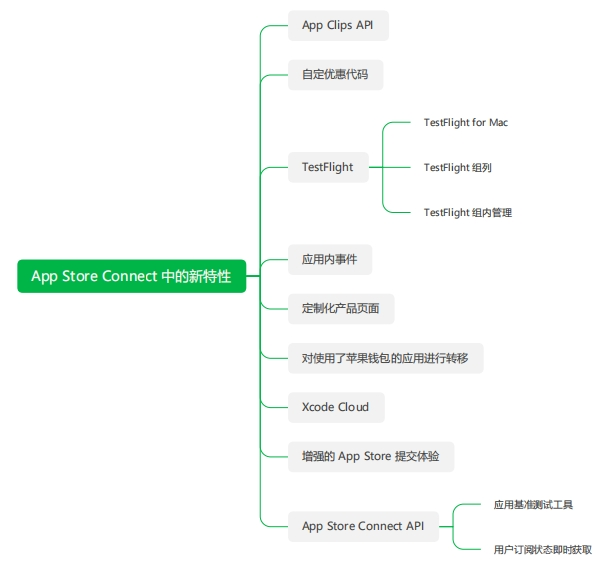

### App Clips

App Clips 也叫轻应用。自 WWDC20 上线以来，轻应用提供了一种“即时使用”的方式，使得用户无需在 App Store 下载完整的应用程序，就可以在特定场景下很方便地体验 App 内的核心功能，从而达到吸引用户的效果。APP Clips 的目标是在需要的时候无需安装，只要有网络，就可以迅速上手。苹果官方给出的场景是租用小型摩托、买咖啡、填停车表等。对轻应用概念不熟悉的读者们可以看看我们之前发布的 [WWDC21 session 的内参](https://xiaozhuanlan.com/topic/2048796351)，里面有非常详细的介绍和例子。

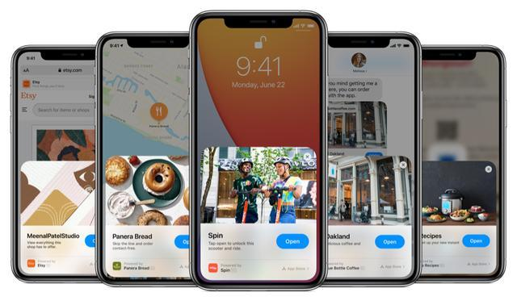

本次的更新对 App Clips 进行了进一步的补充和完善：

1. 首先是提升了 App Clips 的大小限制，从原来的 10MB 提升到了 15MB，这个上限的提升无疑对于开发者来说是件好事，我们可以在轻应用中提供更多的功能和内容了。

2. 苹果在本次更新推出了专门服务于 App Clips 的诊断工具，在设置 > App Clips Testing > 诊断下就能打开，在界面里输入 App Clips 对应的 URL，诊断工具就会自动执行诊断检查，并在发现问题后给予反馈，我们就可以对应去修改了。这样的功能大大提升了我们测试的效率，debug 起来更轻松更便捷了。
3. 在本次更新后， App Clips 可以和 CloudKit 一起进行协作了，我们可以在 CloudKit 数据库上储存的轻应用需要的数据和资源，然后在运行的时候读取它们来做一定的逻辑和功能。我们可以在 App Clips 的 Signing & Capabilities 页面下选择对应的 CloudKit 容器就可以开启 CloudKit 了。这个更新扩充了 App Clips 的数据来源，可以根据云端的数据来动态变化策略，就不用每改一次逻辑都要重新改代码再发布了。不过，因为这次只是初接入，还是有很多限制的，比如这些储存在 CloudKit 数据库上的数据只能读而不能写；只能连接公用数据库，而不能用私有数据库；没办法储存 key-value 键值对。不过相信这些能力也会逐渐完善的，期待。

### 自定优惠代码

在 2020 年年末时苹果首次推出订阅优惠代码，它由一组独特的、由数字和字母构成的编码，用户可以在 App 中输入来获得自动续订的折扣价格或免费优惠，对于开发者来说，这无疑是一个吸引、留住甚至赢回订阅用户的好机会。感兴趣的读者们可以查看 [苹果的官方文档](https://help.apple.com/app-store-connect/?lang=zh-cn#/dev6a098e4b1)，里面有订阅优惠代码具体使用的详细步骤。

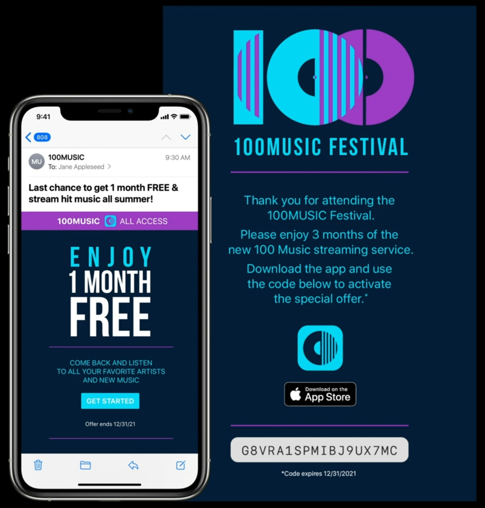

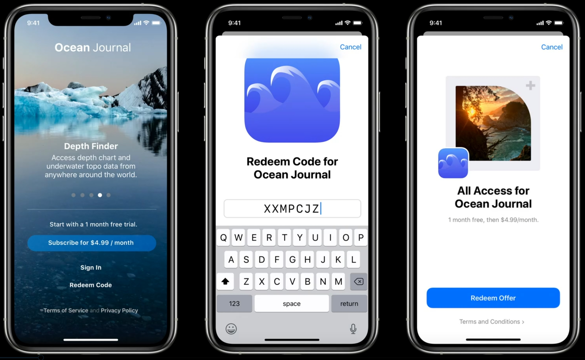

由于之前的优惠代码是一次性的，开发者往往需要申请多个优惠代码来满足活动的需求，导致活动的覆盖人数通常不会太多。而此次的更新中，苹果推出了自定优惠代码，自定优惠代码可以自定义其内容，并且还可以供多个用户兑换，例如 MyGame2022。这个更新对开发者来说极大节省了申请优惠代码的精力，在一些大型营销活动时就可以直接使用自定优惠代码设置一个和活动主题相关的优惠代码，这样用户就可以使用这个优惠代码来进行兑换，即宣传了活动主题又吸引了用户，可谓是一举两得。

### TestFlight

TestFlight 是苹果旗下的应用测试平台，能帮助开发者邀请用户对 App 进行测试，方便开发者更好地改进和完善 App。

开发者首先要把对应需要测试的 App 构建版本上传至 App Store Connect，测试者就可以点击开发者发布的公共链接或发送的电子邮件邀请中的链接，使用 TestFlight 来安装测试的 App 了。在使用过程中，苹果会收集和发送崩溃日志、使用信息和用户所提交反馈给开发者，开发者就可以使用这些信息来改进 App。

需要注意的是，App 的测试员分为内部测试员和外部测试员两种，而外部测试员的人数上限是 10000。其实在去年 11 月之前还没有这样的外部测试员人数限制，现在增加了这样的限制后，开发者在进行灰度测试的人员选择策略上要更加谨慎，合理分配这 10000 名额，并规划好不同方案来提升用户的粘性。

关于 TestFlight 的更多使用规则，感兴趣的读者们可以查看 [苹果的官方文档](https://testflight.apple.com/) 来了解具体的配置和使用方法。

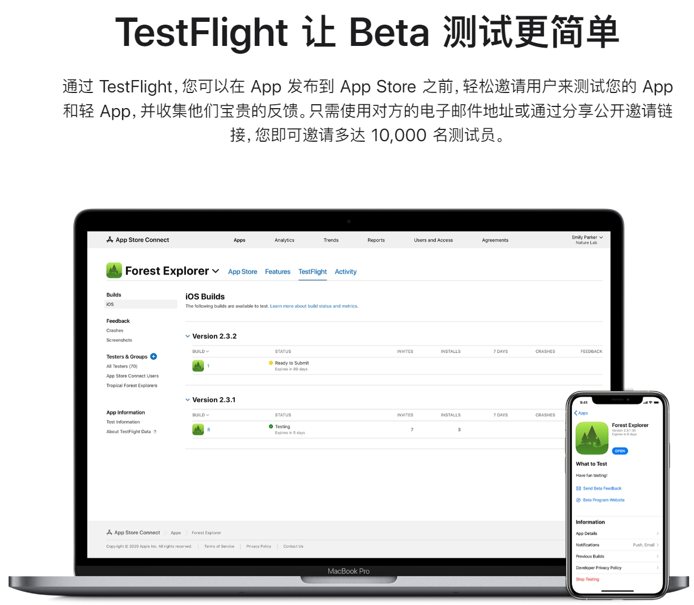

近年来，关于 TestFlight 的功能更新主要有这三点：

* **TestFlight for Mac** ：之前 TF 只有 iPhone、iPad 以及 Apple TV 版，即开发者只能测设在这三个平台的 App 版本。在去年 11 月，苹果推出了 TestFlight for Mac ，使得测试 App 在 Mac 平台下也可以进行下载和使用了，这进一步拓宽了应用测试的渠道，对于多渠道的应用来说无疑大大提高了测试的便捷性和有效性。对该功能感兴趣的读者可以点击对应的 [App News 链接](https://developer.apple.com/news/?id=0bemba6j) 来仔细瞧瞧。

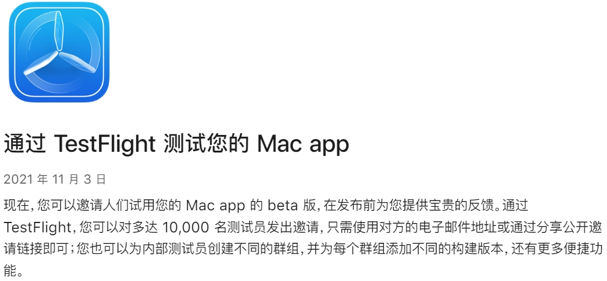

* **TestFlight 组列**：在 TestFlight 的更新中，苹果还支持了对测试员进行分组的功能。对不同的组列可以添加不同的应用版本，这有利于我们去测试用户对 App 所提供的不同功能或特性的喜好，从而完善应用的设计和开发。

* **TestFlight 组内管理**：更新还支持了 TestFlight 的组内管理，开发者可以在测试员编辑界面对组内的人员进行快速添加或者移除。这个更新完善了 TestFlight 中的测试员管理，使得开发者能够便捷地编辑测试员的组成。不过需要注意的是，被删除的人员不会立刻就失去使用 App 的权限，还是会占着测试员的名额，需要等待 90 天才会被真正移除。

### App Event

在去年的 WWDC21 中，苹果首次提出了 App Event 概念，App Event 是指在 App 和游戏中进行的、具有时效性的活动，例如游戏挑战、电影首映和直播活动等。当开发者成功添加了应用的 App Event 后，用户可以在 iOS 和 iPadOS 的 App Store 上看到对应的 App Event 卡片，这上面通常会标注活动的开始时间，并附带一张宣传图或视频。当用户点击打开活动详情页面时，就可以看到活动的详细描述了。该功能实际上在去年 10 月底才真正可用，还在之前介绍的基础上增加了嵌入式的提醒按钮，在活动的详情页面内点击订阅该活动，就可以方便地添加日程提醒，并且当活动开始时也能收到 App Store 的通知提醒。具体详情在 [App News 链接](https://developer.apple.com/news/?id=zghdvfza) 里有介绍。

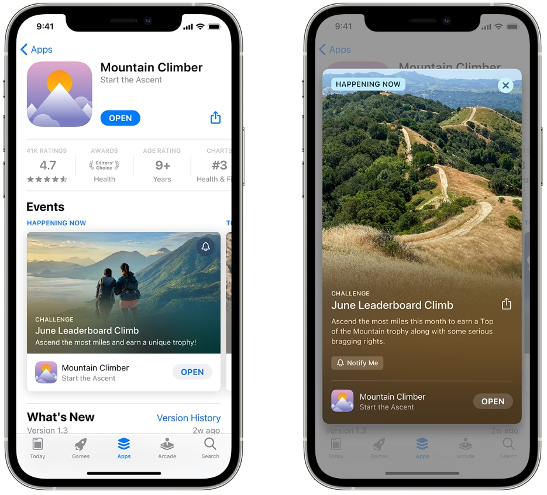

当用户点击活动卡片时，如果用户还没有安装该应用，App Store 会引导用户进行下载和安装。安装完成后，用户再次点击就可以直接跳转到 App 对应的活动专区了。

那么我们提交的 App Event 会出现在 App Store 具体哪个页面呢？有以下三个板块：

1. App 的产品页：当用户打开我们 App 的产品页，最近的 App Event 卡片会显示在上方。
2. 搜索结果：当用户搜索我们的 App 时，如果已经下载了我们的 App ，将会在 App 下方看到最近的 App Event 卡片；如果没有下载，在 App 下方显示的就是 App Clips。用户还可以搜索 App Event 的名字，这时候也会显示出来我们的 App ，并在下方显示 App Event 卡片。
3. “Today”、“游戏”和“App”标签页。我们提交了 App Event 以后可以向苹果的审核团队提交进入 App Store 精选推荐的申请，苹果将会根据 UI 设计、用户体验、创新性、独特性、辅助功能、本地化、App Store 产品页还有专用于一些游戏类 App 的指标来进行考核，最后筛选出的 App Event 就可以被显示在 App Store 的“Today”、“游戏”和“App”标签页了。具体的审核规则可以点击苹果的 [官方网站](https://developer.apple.com/cn/app-store/getting-featured/) 来详细了解。

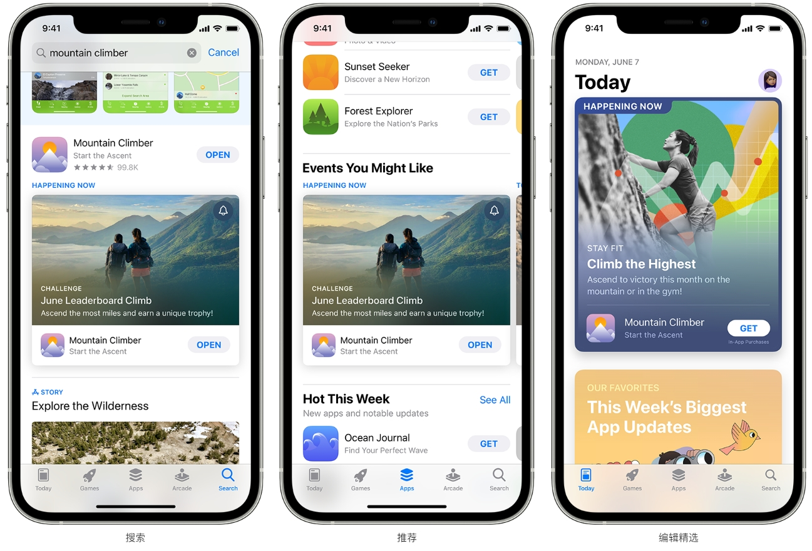

毫无疑问，App Event 为我们的应用带来了更多曝光，从而能够吸引到更多的用户来进行下载和使用，是我们推广 App 的有力手段。对这个功能感兴趣的读者还可以看看对应的 [session](https://developer.apple.com/videos/play/wwdc2021/10171/) 来进一步了解。

### 定制化产品页面 和 产品页面优化

定制化产品页面和产品页面优化是近年来苹果一起推出的两样产品页优化利器，在 WWDC21 就被苹果提出，不过真正在去年 12 月才正式推出而可以开始使用，具体详情可以点击 [App News 链接](https://developer.apple.com/cn/news/?id=2xnhx92t) 看看。这两样功能能够以测试分析的手法帮助开发者改善产品页的设计，从而促进产品的转化率。接下来就让我们一起来看看吧。

#### 定制化产品页面

定制化产品页面又叫自定产品页，开发者可以配置多个版本的产品页，让产品页在面对不同群体的用户能够展示出不同的、更贴合该群体的 App 预览、截屏和推广文本，从而突出展现不同的 App 功能或内容。每个产品页会被配有唯一的 URL 链接，开发者可以使用这些唯一的链接将特定受众定向到该页面。比如说某个营销广告在多个省份同时进行，那么我们就根据不同省份的特点设计不同的产品页，并把在不同省份投放的广告链接到各自省份的自定产品页面中，去着重宣传省份的特色内容。

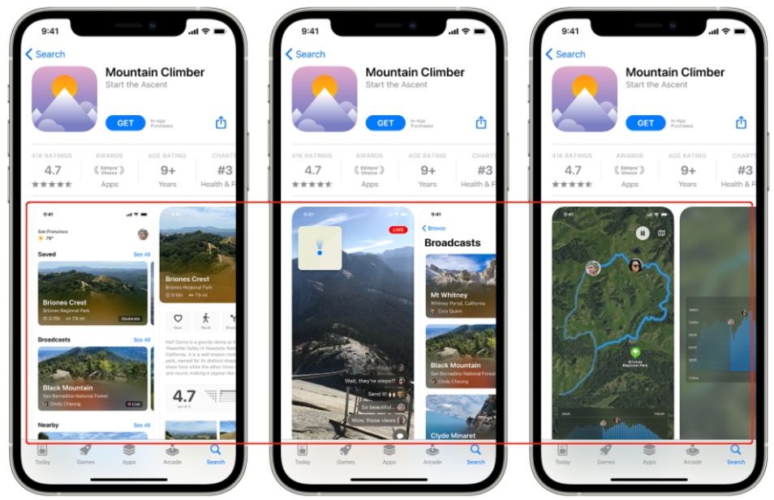

我们可以在 App Store > 我的 App > 功能 > 自定产品页下找进行自定产品页的的创建，创建的时候可以选择从空白页来创建，或者复制现有的产品页来创建，不过要已经处于“可销售”和“准备提交”状态下的产品页才可以被拷贝创建。

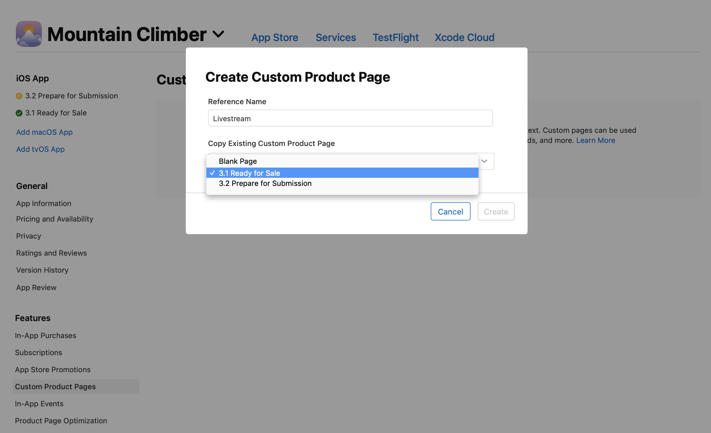

创建了以后系统就会生成一个唯一的自定产品页网址（URL），我们就可以使用这个 URL 来进行不同的投放策略了。

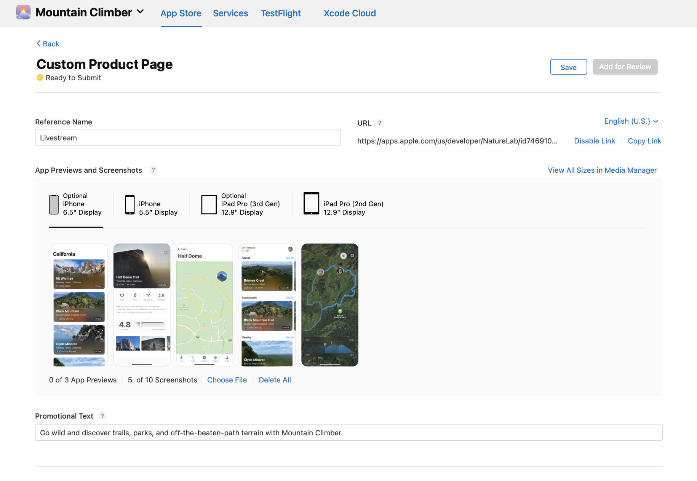

除此之外，自定义产品页：

1. 一次最多可发布 35 个自定义产品页面。

2. 可随时创建和删除自定义产品页。自定产品页被删除后，当用户访问该产品页的 URL 时会被自动重定向到 App 的默认产品页。

3. 所有自定产品页使用的元数据都必须经过审核，但可独立于 App 更新版本提交审核。

4. 审核期间，无法修改自定产品页的截图、预览视频和宣传文本。如需修改，需要取消提交，并在修改后重新提交。

5. 开发者可以通过 App Analytics 查看产品页的展示次数、下载量、转化率等，监控每个自定产品详情页的转化率等。

#### 产品页面优化

产品页面优化同样是为产品页服务的，在这个工具中我们可以为应用的产品页创建多个测试方案，搭配不同的 App 图标、截屏和预览来进行测试，根据表现来了解用户的喜好，从而选择出表现最佳的产品页方案。例如 icon 更改后是否会带来了更好的转化率，或者在截图中突出显示某个特定功能是否增加了特定本地化的下载量等等。

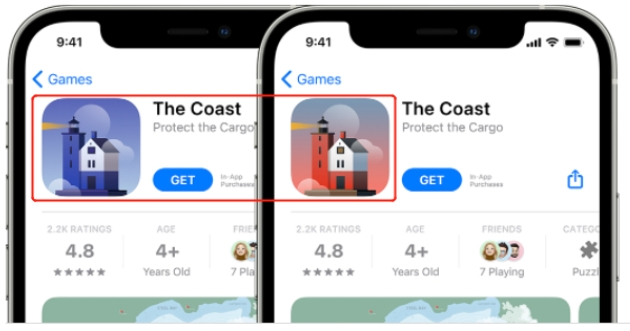

创建产品页面优化测试的时候，我们最多可以设置三个测试方案。设置好后 App Store 就会把测试方案通过一定的随机算法把它显示给一定比例的用户，当然这个比例是我们自己设置的。测试开始后，我们可以 App Store Connect 的 App Analytics 页面查看产品页面优化的测试结果，包含每个产品页方案的预计转化率、不同产品页方案之间的转化率比较，以及 Apple 得出这些测试结果的置信度等。根据结果我们就可以判断出哪个测试方案表现更佳，从而挑选出更优的产品页。

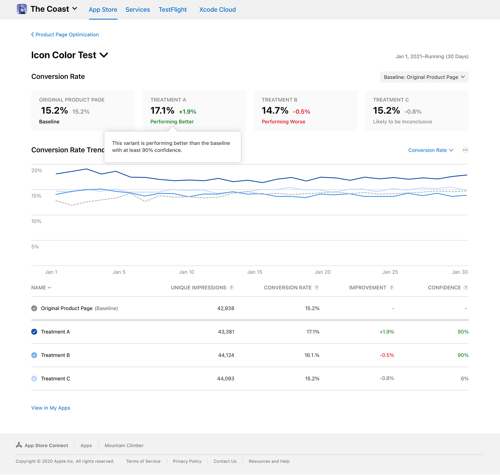

对于产品页面优化，需要注意的是：

1. 整个测试周期最长 90 天。

2. 一次只可以提交一个测试，每个测试组最多可以添加三种测试方案。

3. 一旦启动测试，将无法更改。想要更改只能终止后删除，再重新构建新的测试。

4. 可以随时终止测试，但一旦终止测试便无法重新运行。如需启动需要重新创建测试，开始新一轮测试。
5. 如果在测试运行期间提交了新的 App 版本，本轮测试将自动终止。

6. 测试中所用到的任何元数据都需要提交苹果审核。
7. 只有当 App 的状态为“可供销售”时，才能进行产品页优化测试。
8. 前面说到的自定产品页、Apple Watch 和 iMessage 的 App Store 产品页不支持产品优化测试。

产品页面优化和定制化产品页面两者的结合可以给予开发者利用归因来面对不同兴趣、地区等特征的用户时提供个性化内容的能力，增强用户体验。对这部分感兴趣的读者可以点击苹果的 [开发文档](https://help.apple.com/app-store-connect/?lang=zh-cn#/dev3a2998d9f) 或者是 WWDC2021 的对应 [session](https://developer.apple.com/videos/play/wwdc2021/10295) 来进一步查看它们的更多使用方法。

### 应用转移

当我们需要将某个 App 出售给其他开发人员，或想要将其移至其他 App Store Connect 组织的时候，我们就要对这个 App 进行转移。通过应用转移，App 无需从 App Store 下架就可以将其所有权转让给另一名开发者。在转移后，App 的评论和评分都会被保留，用户也可以直接继续访问更新后的 App。

在更新前，苹果只能支持以下几种类型的 App 进行应用转移：

1. 提供自动续期订阅的 App
2. 使用钥匙串共享的 App
3. 采用通知推送服务的 App
4. 使用 Apple Pay 的 App
5. 支持“通过 Apple 登录”的 App
6. 借助 Mac Catalyst 创建的 App
7. 使用 iCloud 的 App
8. 游戏 App
9. App 套装

而本次更新后，苹果对使用了苹果钱包的应用也支持转移了，具体的步骤如下：

1. 确认该 App 是否可以转移。App 必须满足这些条件才可转移：转移方和接受方的账户均处于正常状态、该 App 必须至少有一个已发布至 App Store 的版本等。要了解具体条件，可以查看 [苹果的官方文档](https://help.apple.com/app-store-connect/#/devaf27784ff)。
2. 备份所有 App 信息。因为 App 转移后会从我们当前的账户中移除，所以我们最好备份一下信息以防丢失。
3. 发起 App 转移。转移方发起 App 转移后，App 转移正式执行。此时 App 的状态会变成“等待 App 转让”状态，接收方需要在 60 天内进行确认。
4. 接受 App 转移。接收方收到 App 转让提醒后进入界面需要输入新的 App URL 和 App Store 联系信息，然后点击“接受”，此时 App 的状态会变成“正在处理 App 转让”，最多等待两个工作日后，App 转移就完成啦。

还有些细节需要注意：

1. 转移 App 前还需要移除其所有构建版本和测试人员，并清空“测试信息”下方的全部信息栏。
2. 在 App 被转移后，与其相关联的 App ID 也会转让给接收方的开发者帐户。
3. 无论 App 所有权状态如何，在转移 App 后，新增或额外的促销代码均无法使用。
4. 转移 App 完成后，“App 分析”中 App 数据的访问权限就被禁止了。

对这部分感兴趣的读者可以查看苹果的 [帮助文档](https://help.apple.com/app-store-connect/#/deved688524f) 查看应用转移的具体步骤和注意事项。

### Xcode Cloud

Xcode Cloud 作为苹果专门为开发者设计的一体化的集成和交付服务，提供了完整的开发流程，包括构建、测试、分发、收集反馈等。我们可以通过将基于云端的（cloud-base）工具集成到 Xcode，来加速应用的开发和构建，从而交付高质量的应用。

之前的 Xcode Cloud 只是测试版本，经过一年 beta 测试，这次更新后苹果宣布该服务已全面推出，可供所有开发人员使用。目前升级到 13.4.1 与 14.0 beta 版 Xcode 工具，我们就可以使用 Xcode Cloud 的完整功能了。Xcode Cloud 与用户端 Xcode 紧密集成，所有在 Xcode Cloud 上构建和测试的结果，甚至是应用程序崩溃的回传报告，都会在我们自己的 Xcode 中呈现。

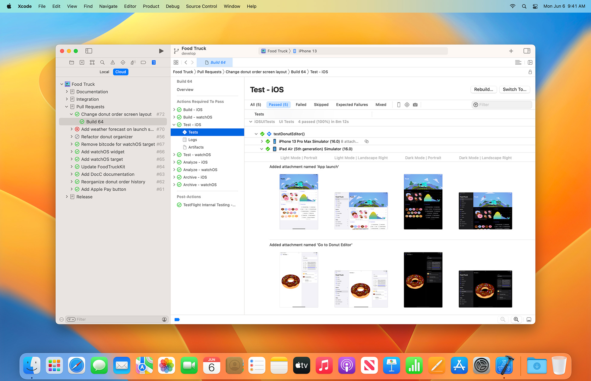

不仅如此，我们还可以在 App Store Connect 上查看到 Xcode Cloud 的测试结果，还可以结合前面提到的 TestFlight 工具一起使用，以供开发团队进行测试版测试。

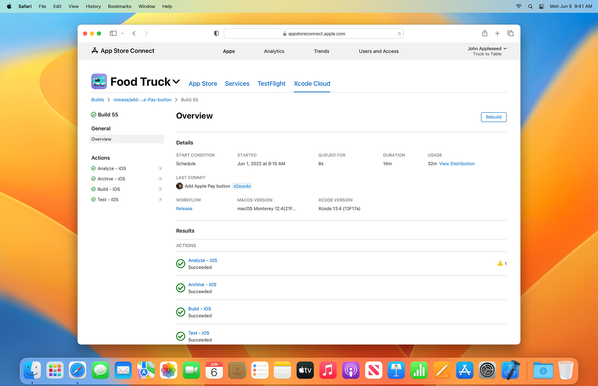

不过，目前的 Xcode Cloud 只能在 Mac 段上搭配 Xcode 来使用，还不能在 Windows 的 PC 上来使用，而且在跨平台 App 开发上也有限制，只能支持 iOS、macOS、watchOS 和 tvOS 的 App 开发，不能提供 Android 或 Windows 跨平台的 App 开发。

苹果预计今夏开始提供 Xcode Cloud 订阅方案，将推出 4 种月费方案，根据使用运算时长来计价，每月 25 小时收费约 14.99 美元起，若是 Apple 开发者计划成员，明年底前将可获得免费额外 25 小时的使用额度。

对这部分感兴趣的读者可以查看查看今年的 [WWDC22 session 110374](https://developer.apple.com/videos/play/wwdc2022/110374/) 、[WWDC22 session 110375](https://developer.apple.com/videos/play/wwdc2022/110375/) 、[WWDC22 session 110361](https://developer.apple.com/videos/play/wwdc2022/110361/) 来进一步了解它的使用方法和应用场景。

### App Store 提交

本次的更新对 App Store 的审核提交场景做了不少优化，推出了增强的 App Store 提交体验，以此来提升开发者提审时的操作体验，在下文我们将会对该点更新进行详细讲解。

### App Store Connect API

此次的 App Store Connect 在 API 上新增了将近 60% 的更新，涉及到了 IAP 与订阅、客户评论与开发者回应、提交审查、App 未响应诊断等。在下文我们将会对其中涉及到的应用基准测试工具、用户订阅状态即时获取这两个新功能展开最佳实践讨论。

## 应用商店提交增强优化

### 组合提交

首先，此次的 App Store Connect 更新在提审场景推出了组合提交的方式，我们在提审时可以在一次提交把多个项目组合起来，例如 App 版本、定制化产品页面、产品页面优化测试、应用内事件等。这样的方式能够提供更多的上下文方便苹果进行审查，并提高提交的一致性和有效性。对于我们开发者来说，也更加节省时间了，我们可以在一次提交里把所有的数据都加上，不仅可以让包更快过审，而且当某项不通过的时候也可以修改完再次提交，减少了和苹果来回沟通的时间。


无论你在一个组合提交里添加了多少项内容，苹果都会在 24 小时内回复结果，并对里面的每一项给出独立的结果，标注它们被接受 or 拒绝。如下图所示。


由于只有组合提交里所有的项目都被接受后，组合提交才能成功通过，因此当你的组合提交内有部分项目被拒绝时，你可以有以下两种选择了：

一是修改那些被拒绝了的项目内容，然后重新提交，当它们全部被接受后，组合提交就可以成功通过了。

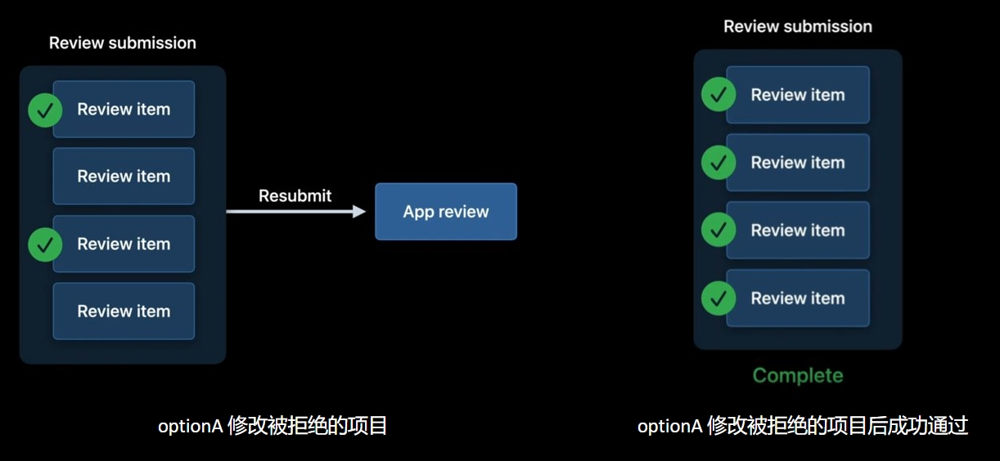

二是直接删掉这些被拒绝的项目，那就相当于这个组合提交内的所有项目都是通过的，那组合提交自然就可以通过了。不过当然，这些删掉的项目还是要重新构建一组新的提交，这样才能保证所有的内容都没有遗漏。

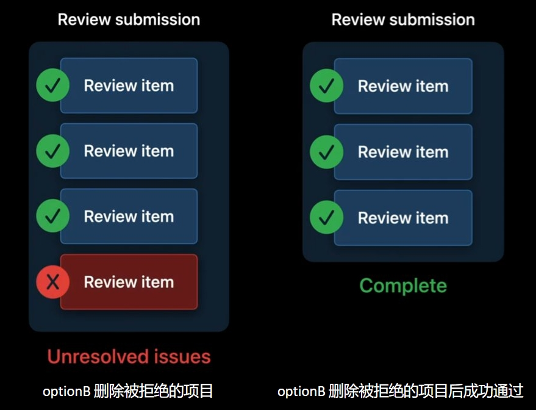

通常来说，组合提交里一般需要包含一个 App 版本，代表该次提审里面所有的项目都是针对这个版本来生效的。不过，如果在进行组合提交之前已经有一个被批准的 App 版本了，那么这个提合交里就可以省略掉这个项目，不用添加 App 版本了，可以直接提交这个版本对应的一些定制化产品页面、产品页面优化测试、应用内事件，而苹果就会根据这个版本来进行审核。另外，之前的定制化产品页面和应用内审核是需要提交二进制文件的，这次更新后也可以不用跟二进制了，又进一步提高了提审的灵活性。


需要注意的是，每个平台只能有一个在审的提交，需要等待上一个审核的提交完成了才可以提出新的提交。

### App Store Connect 中的 App Review 提交页面

在本次更新里，苹果对 App Review 的移动端场景也做了进一步的优化，我们可以在 App Store Connect 程序里打开对应的 App Review 界面来进行审查的提交了，如下图所示。

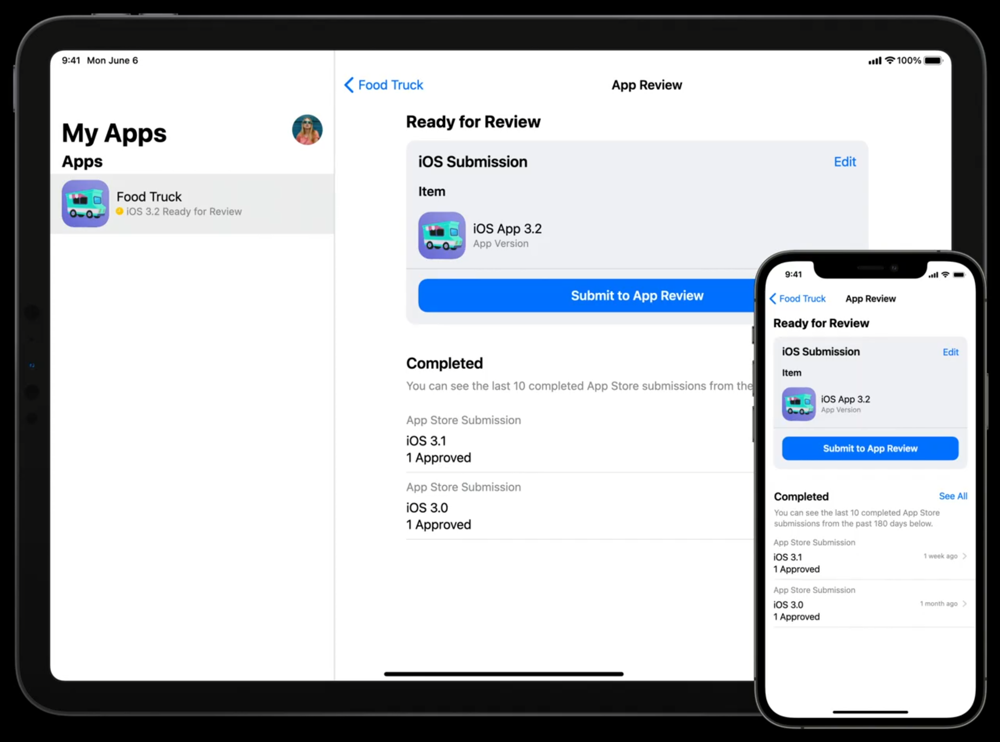

不仅如此，我们还可以在界面里查看审查的进度、查看审查的具体信息、回复 App Review，如下图的左中右场景所示。

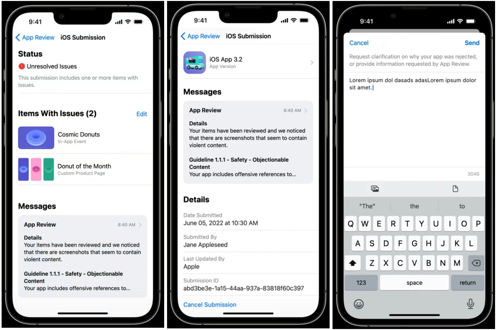

目前这些功能可以在 iPadOS 和 iOS 平台上使用，这样的新功能使得我们可以在离开电脑时使用移动端快速进行审查的查看和响应，也算是一个较大地改进了。

## App Store Connect API 更新

接下来就是重磅的 App Store Connect API 更新啦，在本文我们将会对应用基准测试工具、用户订阅状态即时获取这两个重要更新进行讲解，并展开最佳实践讨论。

### 应用基准测试工具

本次更新 App Store Connect 将会新增一个名为 App Benchmarking 的新功能，意为应用基准。在该页面内可以非常直观地看到你所开发的应用在同类别的应用中对应指标的排名，例如转化率、留存率、付费用户平均收益等。界面会画出对应 25%、50%、75% 的百分位线，帮助开发者判断应用对应指标的优劣。有了这些直观地数据表现，开发者就可以针对性地提升应用对应的功能，更有方向性地进行优化了。


目前苹果提供的可比指标有以下几种：

1. 应用获取场景：转化率

2. 应用使用场景：次日留存率、7 日留存率、28 日留存率、崩溃率

3. 应用盈利场景：付费用户平均收益


苹果一向非常看重隐私，因此这次的应用基准数据也采取了一定的保密措施，在保护应用程序隐私的同时创造出这样的相关对比组和基准信息。

首先，应用基准数据的对比组构建基于两个规则：

1. 应用类别，如旅行、图片视频、动作游戏等，相同的应用类别才会进行比较；

2. 盈利方式，如免费、免费增值、付费、订阅等，由于不同盈利方式的应用的质量和预期效果会有区别，因此盈利方式也被纳入了构建对比组的考虑中。


其次，在隐私方面，苹果采用了一种叫做差异隐私的技术来进行信息的聚合，在每个对比组里会添加少量的噪音，并保证组内的应用程序个数足够多，在这样的操作下，数据集内的噪音就能掩盖对比组的确切组成，因此开发者就不能知道一个特定的应用到底在不在当前的对比组中，同时也不会破坏组内数据的相关性，提供对比信息。感兴趣的同学们可以看看这篇苹果的论文，里面有对这个[差异隐私 Differential Privacy](https://machinelearning.apple.com/research/learning-with-privacy-at-scale) 技术的详细讲解，包括原理推导和应用例子。

那么，对于开发者来说，我们看到了这些指标后，可以对应去做出什么样提升呢？苹果也给出了他的建议：

* 针对应用获取场景，我们可以通过定制化产品页面和产品页面优化这两个工具来针对不同的用户群体展示不同的界面，或者是使用不同的 icon 、图片、布局方式来进行测试，挑选出用户更喜欢的界面，以此来提高你所开发应用程序的下载转化率。

* 针对应用使用场景，苹果提供了一系列的应用内事件和 App Clips 轻应用功能，帮助我们展示应用丰富的功能场景，并通过 App Clips 轻应用快速完成微任务，提高程序的便捷性，吸引用户从而提高留存率。

* 针对应用盈利场景，则可以使用不同的定价策略，让用户根据自己的喜好和付费金额定制自己的体验，以及使用个性化的 IAP 促进方案来提高应用的平均收益，我们下文就会使用此次 App Store Connect API 更新的用户订阅状态即时获取功能来展开 IAP 促进方案的最佳实践。


### App Store Connect API - 用户订阅状态即时获取

此次 App Store Connect API 新增了用户订阅状态和购买历史的获取 API ，无论是 StoreKit 2 和之前版本的 StoreKit 都可以实现这个功能，这无疑提供了我们一个利器来判断用户当前所处的购买状态，以此针对性地展示个性化页面，为用户提供最新的产品。不进如此，我们还可以提供适当的优惠策略吸引老用户来恢复购买，因此来实现 IAP 促进方案。

#### 前置知识了解

对于新接触这部分的读者可能对 IAP 不是特别熟悉，这里我们进行一些前置知识的介绍。

首先，IAP 的全称为 In‑App Purchase，意为应用内购买，即用户在应用内发生的购买或订阅行为。这是应用实现盈利的重要方式之一，而实现 IAP 需要使用 App Store Connect API， 利用 StoreKit 2 或者是 StoreKit 来实现购买的完整流程，以及交易信息的维护。

对于 IAP 中销售的产品类型，苹果定义了以下三种核心产品状态：

1. non-consumables 非消耗品，例如 steam 上面购买的游戏、游戏皮肤、某一刊的电子杂志等。这些产品在购买后通常永久有效。

2. non-renewing subscriptions 非更新订阅，例如一个月的视频会员，一年的电子杂志订阅等。这些产品不会进行自动续费，到期了对应的权益就会消失，因此需要多次进行订阅。

3. auto-renewable subscriptions 自动更新订阅，例如连续包月的视频会员，连续包年的云空间套餐等。这类产品通常在购买时就会附带自动续订的协议，在新周期开始时进行自动扣费并刷新产品的到期时间，如果不进行手动取消，这类产品就会产生持续性的消费。非更新订阅和自动更新订阅可归为订阅一类，它们的区别就在于到期是否会进行自动续费。

对应的，用户也可以被分为以下三种核心状态：

1. in-depth new customers 全新用户，该状态标识此 Apple ID 的用户从来没有发生过应用内购买交易，因此对这类用户，我们可以提供默认的促销页面，提供多套 IAP 方案供用户选择。

2. purchased and active subscriber 已购或已订阅用户，这类用户当前是有商品交易正在生效的，因此我们需要在页面内提供对应的服务信息，保证他们的权益。

3. inactive purchase or inactive subscriber 购买或订阅已过期的用户，这个状态代表该用户在之前有进行过应用内购买，但是目前产品服务过期了，或者是被撤销了，所以当前没有产品正在生效。针对这类用户，我们可以考虑提供恢复订阅优惠，让这部分用户重新活跃起来。


好啦，有了上面的前置知识，我们就可以来看看在本次 App Store Connect API 更新中新增的用户订阅状态和购买历史的获取 API 是怎么样的，以及如何在实际场景去使用它来为我们的应用盈利带来提高。

#### API 讲解

想要在 App 启动时获取到当前用户的订阅状态，需要有三个步骤：开启 App Store 交易监听，确定客户的产品状态，检查是否有正在生效的自动更新订阅。通过这三个步骤所获得的数据我们就可以判定用户所处的状态及他购买的产品信息，以此来决定 App 启动后展示给用户的界面是怎么样的，提供个性化页面。

##### StoreKit 2

在 StoreKit 2 中，开启 App Store 交易监听的 API 如下：

```swift
// StoreKit 2
for await result in Transaction.updates {
    do {
        // check if the transaction is verified
        let transaction = try checkVerified(result)
        await self.updateCustomerProductStatus()
        await transaction.finish()
    } catch {
        // error handle
    }
}
```

在这段代码里，我们监听  App Store 的所有交易更新，并且通过 checkVerified 来进行交易的验证，验证无误后则可以进行下一步，获取用户的产品信息。

获取客户的产品信息则要用到 currentEntitlements 来向 App Store 请求客户当前活跃的交易，并通过 transaction.productType 来判断产品的状态，以此来做不同的页面设计：

```swift
// StoreKit 2
for await result in Transaction.currentEntitlements {
    do {
        // check if the transaction is verified
        let transaction = try checkVerified(result)
        switch transaction.productType {
        case .nonConsumable:
            // nonConsumable state handle
        case .nonRenewable:
            // nonRenewable state handle
        case .autoRenewable
            // autoRenewable state handle
        default:
            break
        }
    } catch {
        // error handle
    }
}
```

最后，针对自动更新订阅，我们还需要获取一下他们的状态，检查自动更新订阅是否过期、被撤销或者处于扣费失败的重试周期，以免出现判断错误。

```swift
// StoreKit 2
subscriptionGroupStatus = try? await subscriptions.first?.subsciption?.status.first?.state
if (subscriptionGroupStatus == .expired) {
    // expired state handle
} else if (subscriptionGroupStatus == .revoked) {
    // revoked state handle
} else if (subscriptionGroupStatus == .inBillingRetryPeriod) {
    // inBillingRetryPeriod state handle
}
```

这样我们就成功获取到用户的订阅状态和购买历史啦，StoreKit 2 是针对 IAP 场景下苹果的最新 API 支持，因此使用 StoreKit 2 来实现这段功能就会比较方便简单，而使用之前版本的 StoreKit 来实现就会比较繁杂一点了，我们接下来看看。

##### StoreKit 1

而 StoreKit 1，也就是 Original StoreKit，想要实现上面这些功能，首先需要使用 appStoreReceiptURL 来检索 app receipt ：

```swift
// StoreKit
if let appStoreReceiptURL = Bundle.main.appStoreReceiptURL,
    FileManager.default.fileExists(atPath: appStoreReceiptURL.path) {
    do {
        let receiptData = try Daya(sontentsOf: appStoreReceiptURL,
                                  options:.alwaysMapped)
        let receiptString = receiptData.base64EncodedString(options: [])
        // Read receiptData
    }
    catch {
        // error handle
    }
}
```

然后发送到 App Store Server 的 verifyReceipt 节点来进行验证：


最后，就可以收到对应的 receipt JSON，里面就包含了交易信息列表，以此就可以进行产品状态的判断了。StoreKit 的 Entitlement Engine 同样支持 new customer product 状态以及 non-consumables 和 non-renewing subscriptions product types 。具体可以点击 WWDC20 的 [Architecting for subsciptions](https://developer.apple.com/videos/play/wwdc2020/10671/) 这篇 session 来详细看看。

### 最佳实践讨论

接下来我们用一个例子来展开用户订阅状态即时获取的最佳实践讨论，这里我们以 StoreKit 2 为例。首先开启 App Store 交易监听时，我们需要进行交易的验证，确认交易的有效性：


接下来，我们通过轮询 currentEntitlements 来获得客户的活跃交易，并通过 transaction.productType 来判断产品的状态，把他们加到对应显示的组别中。其中别忘了需要获取一下自动更新订阅的状态，检查是否过期、被撤销或者处于扣费失败的重试周期：


最后，根据用户所处的购买状态，就可以进行个性化应用程序界面的设计了：

* 若前面所说的所有三种应用内购买产品类型都没有查到活跃交易，那么客户就可以被归为我们前面提到的全新用户，此时用户打开应用，就会看到默认的欢迎页，此界面上有个按钮，点击可跳转到“商店”页面进行购买。


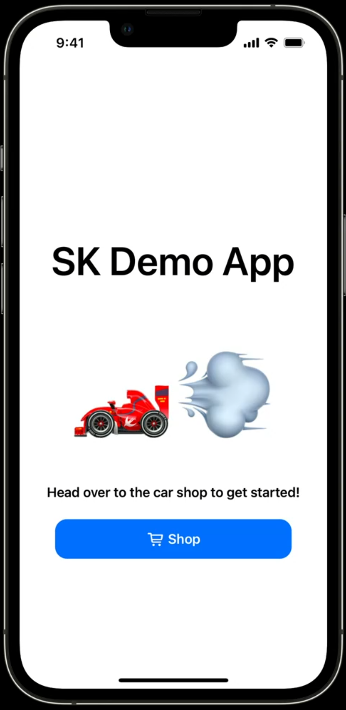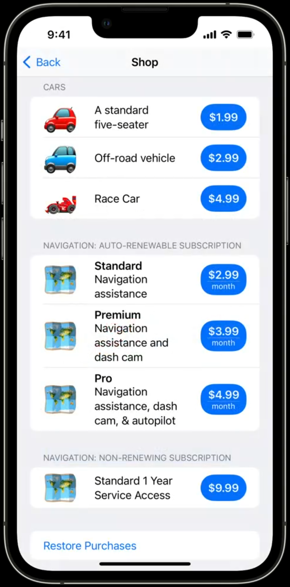

* 若检测到当前用户已有购买订单，那么用户打开应用后就能看到他们购买产品的信息，并用一个绿色的已勾选复选框来表明应用程序已确认这些购买成功，并已启用了它们。


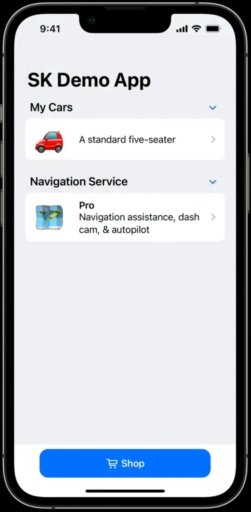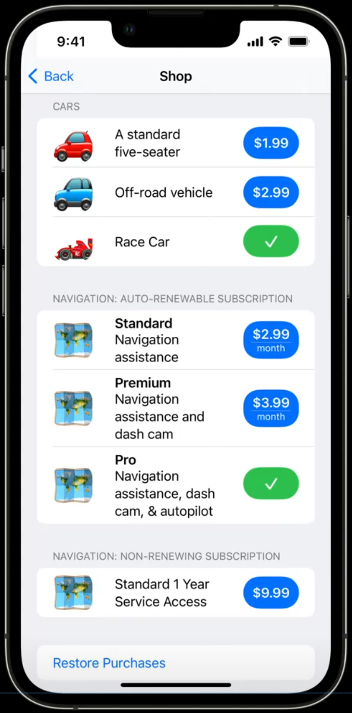

* 最后，对于已购买但当前订单已失效的用户，我们可以在启动页展示恢复购买的按钮，并展示对应的促销优惠信息，吸引用户进行点击购买。

通过这个例子，我们了解到了如何使用 StoreKit 2 和 StoreKit 来获取用户订阅状态，在用户点击打开 App 前就主动检查购买情况，并根据结果个性化展示页面，以此来实现 IAP 促进方案。

测试时，我们可以使用沙盒、TestFlight、Xcode StoreKit Testing 来测试应用的表现是否符合预期。

## 总结

本次 App Store Connect 的更新真的很多，本文只是取了其中的几个重点更新：增强的 App Store 提交体验、应用基准测试工具、用户订阅状态即时获取来进行了讲解，其他内容可以查阅前面提到的一些 session 去进一步深挖。总体来说，应用基准测试工具、用户订阅状态即时获取这两个功能都能较大地帮助开发者对自己 App 的表现进行分析和有方向性地提高，促进 App 的收益，希望对你们有帮助！
