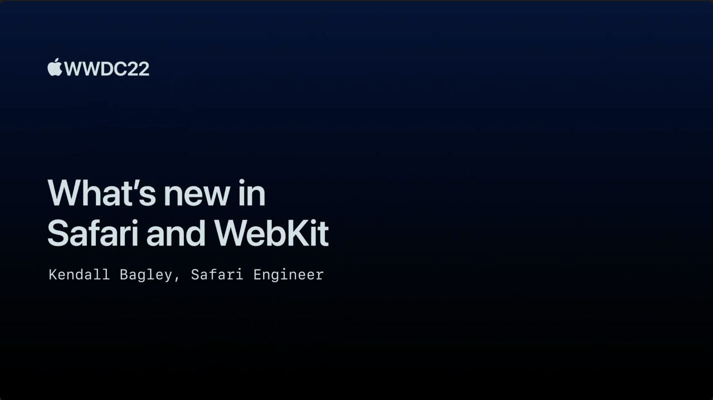

## 个人介绍

夏天， iOS 程序员，简书/掘金文章贡献者，摸鱼周报联合编辑，公众号 iOS 成长指北

## 不超过 120 个字的文章简介

本文主要介绍过去一年，Safari 和 Webkit 有哪些新增功能和改进。全文着重介绍了两个方面的改进，一个是 `CSS`，耗费了大量的笔墨介绍了过去 `CSS` 上的新增功能。另外就是 Web API 上新增了`Web Push`、`Web Manifest File`、`Broadcast channels` 、文件系统访问 API 以及在 `Canvas` 上对 `P3` 色域的支持。

## 公众号/小专栏图文头图

