# Session 10048 - Safari 和 WebKit 新特性介绍

本文是根据 [What's new in Safari and WebKit](https://developer.apple.com/videos/play/wwdc2022/10048/) 进行撰写，主要介绍过去一年苹果在 Safari 和 WebKit 上的一些改进。

过去一年，对 Safari 开发团队来说是极为忙碌的一年：完成了 5 个 `Release` 版本的迭代以及包括 16.0 `Beta` 版本在内的两个 `Beta` 版本，而往年的  `Release`  版本均不超过 2 个。

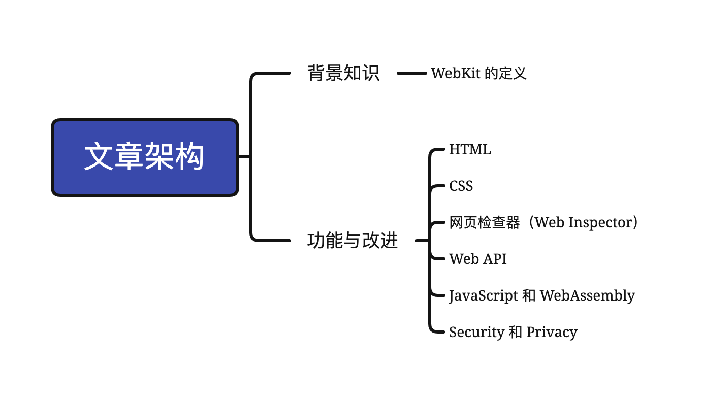

我们先介绍一些 WebKit 背景知识，什么 WebKit，浏览器内核的架构如何。

然后我们将介绍最近一年在 HTML、CSS 、网页检查器（Web Inspector）、Web API、

JavaScript 和 WebAssembly、Security 和 Privacy 上的新增的功能与改进，期间会穿插一些前端的知识以方便于你更好的理解。

每个小节都提供了导图，介绍 Safari 在哪个版本有哪些功能与改进，我们将挑选其中有代表性的几个，通过示例展示效果以便加深理解

那么我们开始介绍今天的主角：WebKit

## WebKit 介绍

为了更好的理解 WebKit，我们需要了解 WebKit  是什么

[WebKit](https://en.wikipedia.org/wiki/WebKit) 是 Apple 开发的浏览器引擎，主要用于其 Safari 网络浏览器以及所有 iOS 网络浏览器。

一个完整的浏览器引擎，其基本架构如下图所示：

> 图片来源 [WebKit 渲染引擎特性，以 Chrome V8 为例](https://blog.csdn.net/abraham76/article/details/124632284)

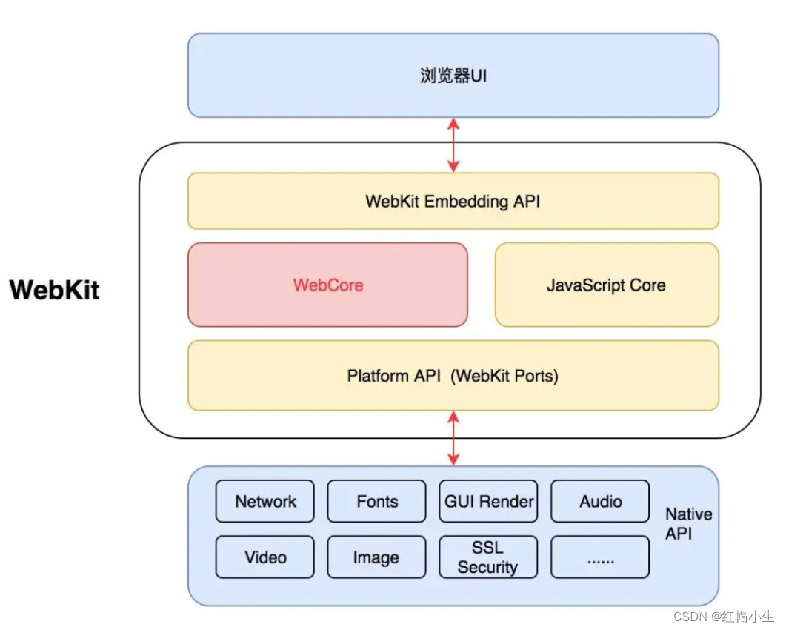

浏览器最核心的部分是浏览器内核，其主要组成部分有两个：

* 排版引擎，用于解析 HTML，CSS 并做页面渲染
* JS 引擎，用于解释执行 JavaScript 代码

浏览器引擎工作的原理就是将输入的 HTML、CSS 和 JavaScript 进行处理，并最终输出我们看到的完整的、可以进行交互的并且可以在多平台展示的具体网页。

## 功能与改进

过去一年中，这 7 个 Safari 版本共计发布了 162 项功能改进。

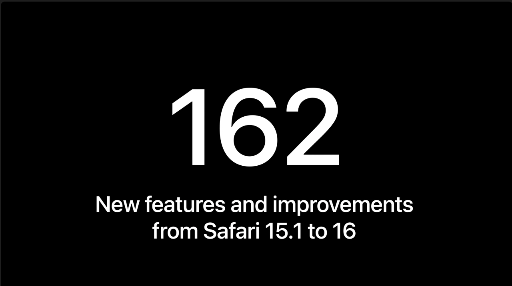

我将参照 [What's new in Safari and WebKit](https://developer.apple.com/videos/play/wwdc2022/10048/) 中的分类，对更新内容进行说明，并进行相应的补充

* HTML
* CSS
* 网页检查器（Web Inspector）
* Web API
* JavaScript 和 WebAssembly
* Security 和 Privacy

### HTML

下图列举了过去一年，在 `HTML` 上，Safari 有了那些更新

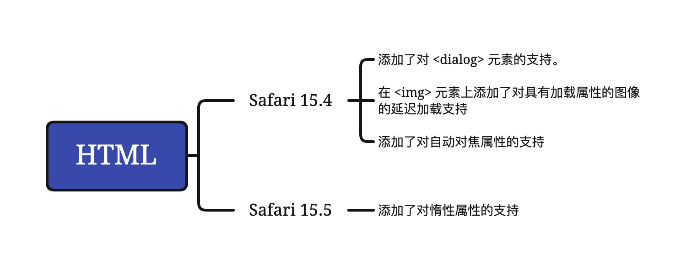

#### `<dialog>`

这里先介绍一点基础概念，以便于理解元素

 `DOM` 树：网页的标签、文本、**注释**等，通过节点方式形成一个完整的页面内容和结构，网页上的一切内容，通过组合而成，最终形成的文档结构称为 `DOM` 树

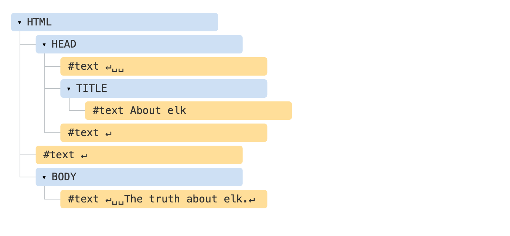

元素：用标签 `<>` 创建的，常见的元素有 `<div>`、`<h1>` 到 `<h6>` 等，简单类比为`UIButton`、`UIImageView` 之类

属性：创建元素时，其支持一些基本的配置项，这些配置项称之为属性

新增 `<dialog>` 元素标签，这是可以在覆盖于所以展示元素最顶端的对话框。新的 `<dialog>`  元素提供了一种非常简单的方法来以一种健壮且可访问的方式来创建覆盖整个页面元素的对话框，在这个对话框中，我们可以进行部分操作。

测试时你可以通过设置 `open` 属性来显示对话框。

示例代码如下：

```html
<!-- 指示这个对话框是激活的和能互动的。当这个 open 属性没有被设置，对话框不应该显示给用户。推荐使用 .show() 或 .showModal() 方法来渲染 对话框，而不是使用 open 属性。 -->
<dialog method="dialog" open> 
  <form id="dialogForm">
    <label for="givenName">Given name:</label>
    <input class="focus" type="text" name="givenName">
    <label for="familyName">Family name:</label>
    <input class="focus" type="text" name="familyName">
    <label>
      <input type="checkbox"> Can trade in person
   </label>
   <button>Send</button>
  </form>
</dialog>

```

你可以通过查看 [`<dialog>`](https://developer.mozilla.org/zh-CN/docs/Web/HTML/Element/dialog) 来获取更多用法。

#### ``

另一个值得关注的更新是在`` 元素上添加了对具有加载属性的图像的延迟加载支持。

将 `` 元素的 `loading` 属性设置成 `lazy`，对于第一次加载时不在屏幕上的图片，仅当图片被滚到屏幕的可视区域时，浏览器才会加载它们，使得页面加载更快，响应更快。

示例代码如下：

```html

```

通过利用浏览器的原生支持而不是通过监听屏幕的滚动的偏移量来计算，能够真正释放生产力。

### CSS

同样，我们通过一张图来看一下过去一年有哪些 CSS 上新增的特性

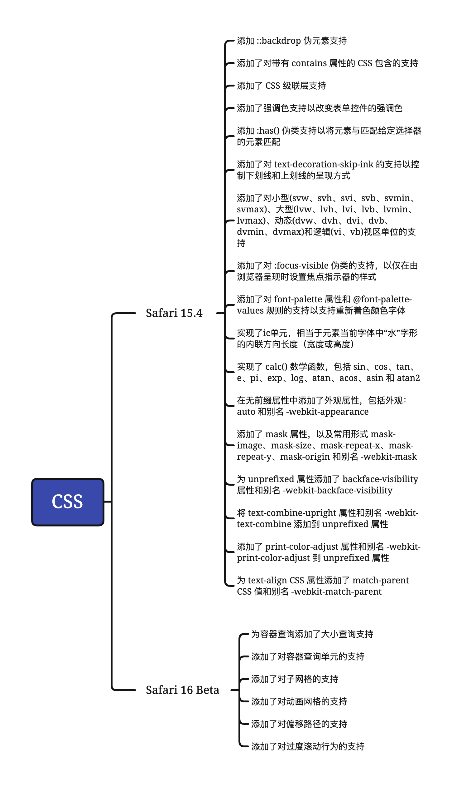

#### `::backdrop`

在理解 `::backdrop` 之前，我们需要知道什么是选择器、伪类、伪元素

选择器：通过 `id`，元素类型等途径，匹配到对应的元素，这里对应的可以是一个，也可以是一类

伪类：主要是为了已有元素添加样式，其本身是符合某条件的元素`已存在`

* 状态伪类：在某种状态下的元素，如鼠标的悬停状态 `:hover`、鼠标点击时的状态 `:active` 等
* 结构性伪类： 符合某种查找条件下的元素，如在 `DOM` 树查看第一个子元素 `:first-child`、所有状态为选中的元素`:checked` 之类的

伪元素：不是通过标签 `<>` 创建的，但是可以在 `DOM` 树中找到这个节点，伪元素就是伪类对应的`状态`

我们在 [What's new in Safari and WebKit](https://developer.apple.com/videos/play/wwdc2022/10048/) 上打开 Web 检查器，选中 `Elements` 选项， 这里的`:before` 就是结构性伪类，在 `DOM` 树中看到`::before` 就是伪元素

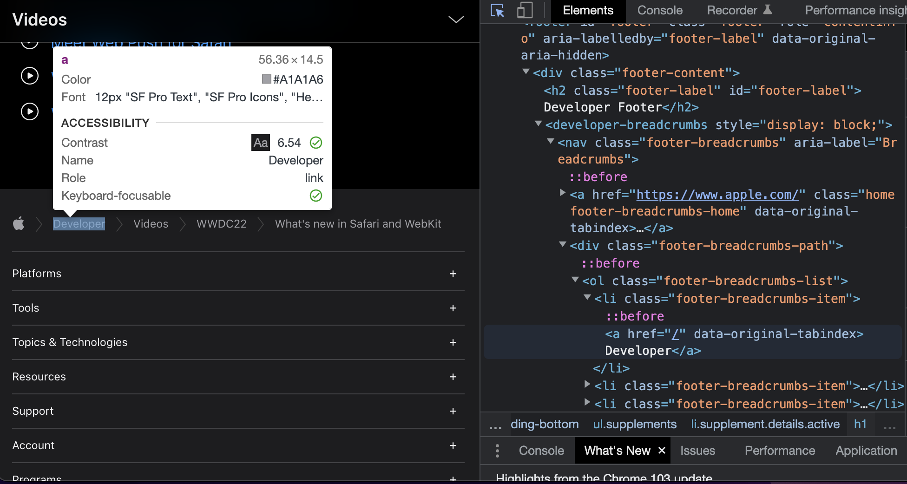

由于新增了 `::backdrop` 的伪元素支持，可以修改大多数浏览器默认的背景色 —— 黑色，下面的示例代码修改了上述示例  `dialog` 对话框的背景色。

```css
/* ::backdrop pseudo-element */

dialog::backdrop {
  background: linear-gradient(rgba(233, 182, 76, 0.7), rgba(103, 12, 0, 0.6));
  animation: fade-in 0.5s;
}

@keyframes fade-in {
  from {
    opacity: 0;
  }
  to {
    opacity: 1;
  }
}
```

#### Container Queries

另外一个值得注意的点是，在 Safari 16.0 Beta 版本中提供容器查询的技术—— [Container Queries](https://developer.mozilla.org/en-US/docs/Web/CSS/CSS_Container_Queries)，容器查询技术致力于解决当容器大小不同时，其内在的布局情况随之改变的问题

> 原 Session 示例代码有问题

```css
/* Container queries */

.container {
  container-type: inline-size;
  container-name: clothing-card;
}
.content {
  display: grid;
  /* 示例代码提供的 grid-template-rows：1fr 修饰的是行高，请参照下面代码修改列*/
  grid-template-columns: 1fr;
  gap: 1rem;
}
@container clothing-card (width > 250px) {
  .content {
    grid-template-columns: 1fr 1fr;
  }
  /* additional layout code */
}
```

当页面宽度超过 `250px` 时，列表每行的元素将从 1 行变成 2 行。

#### CSS Cascade

我们知道 CSS 就是一系列规则组装而成的样式描述语言，当我们在多个层级中对用一个属性设置不同值得时候就会产生冲突，浏览器用来解决这种冲突的机制我们称之为**级联**或者**层叠**。

在 Safari 16.0 Beta 这种机制进行了更迭，文章称之为 `powerful change`。

现有的浏览器机制会根据复杂的计算来确定具体元素的样式，而在新的 Safari 中，你可以通过在 CSS 中定义图层的顺序来确定哪个图层对其他图层具备更高的优先级。此时， 无论使用的选择器的特殊性如何，该层都将优先被选中。

也许你可以使用它们让设计系统与覆盖或用于项目自定义样式的框架分开。

```css
/* Author Styles - Layer A */
@layer utilities {
  div {
    background-color: red;
  }
}

/* Author Styles - Layer B */
@layer customizations {
  div {
    background-color: teal;
  }
}

/* Author Styles - Layer C */
@layer userDefaults {
  div {
    background-color: yellow;
  }
}
```

你可以查看 [CSS Cascade](https://developer.mozilla.org/en-US/docs/Web/CSS/Cascade) 来加深你对样式层叠机制的理解。

#### :has()

另一个令人惊叹的新增功能是 `:has()`，这是一个伪类，可以充当父选择器。你可以结合 CSS 中的任何其他选择器，并通过 `:has()` 来查找同级元素、属性、表单字段的状态等等。

```css
<!-- :has() pseudo-class -->

<style>
  form:has(input[type="checkbox"]:checked) {
    background: #ff927a;
  }
</style>

<form class="message">
  <textarea rows="5" cols="60" name="text" 
    placeholder="Enter text"></textarea>
  <div class="checkbox">
    <input type="checkbox" value="urgent"> 
    <label>Urgent?</label>
  </div>
  <button>Send Message</button>
</form>
```

无需额外的方法，通过 `:has()`我们可以完成对表单内某个元素的查找，并判断当状态为选中时当前表单的样式。

#### viewport units（视口单位）

在  Safari 15.4 中，添加了包括小型，大型，动态和逻辑四大类共计 20 种视口单位的支持。

这对移动开发者来说是一个值得注意的点，当浏览器的视口因滚动而改变时，开发者可以根据根据最小、最大和动态的视口大小来修改 Web 布局。


请按照如下方式来记忆这些

> * `s for small`
> * `l for large`
> * `d for dynamic`
> * `v for viewport`
> * `h for height`
> * `w for width`
> * `i for inline`
> * `b for block`

下面以 svh、lvh 和 dvh 一组为例，通过一张图示来了解其含义。

* 当首次在 Safari 浏览器中打开 H5 页面时（左侧模拟器），能看到 H5 页面和一些 Safari 底部按钮，此时的视口大小就是 `svh`（最小视口高度）；
* 当 H5 页面滚动时（右侧模拟器），即不展示 Safari 按钮时，视口的大小会增加，此时的视口大小就是 `lvh`（最大视口高度）；
* 而图中所示的 `dvh`（动态视口高度）就是介于 svh 和 lvh 中间的值。

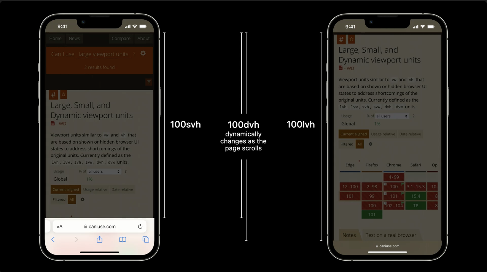

我们以竖直排列的 `TableView` 为例来简单认识一下 [inline](https://developer.mozilla.org/zh-CN/docs/Web/CSS/Inline_formatting_context) 内联样式和 [block](https://developer.mozilla.org/zh-CN/docs/Glossary/Block/CSS) 块样式。

 [block](https://developer.mozilla.org/zh-CN/docs/Glossary/Block/CSS) 块样式就像是每一行的 `Cell` 一样，每一块都要独占一行。

而当我们需要在一行的 `Cell` 中从左到右排列多个元素，需要将该行元素的属性 `display` 的值设为 `inline`，这样我们就可以一行排列数个元素。

对于移动端开发者来说 [inline](https://developer.mozilla.org/zh-CN/docs/Web/CSS/Inline_formatting_context) 内联样式和 [block](https://developer.mozilla.org/zh-CN/docs/Glossary/Block/CSS) 块样式可能需要着重理解一下。

我们在[【WWDC22 10049】探索 iOS 16 中 WKWebView 的新功能](https://xiaozhuanlan.com/topic/7295803164) 中更加详细的介绍了关于视口单元的信息，你可以获取更多了解。

#### 偏移路径

当我们需要创建一个绕圆旋转的动画是，在早期通过 CSS 动画，其代码如下

```css
@keyframes circle{
    from{
        transform: translate(50%, 150px)
        rotate(0turn)
        translate(-50%, -150px)
        translate(50%,50%)
        rotate(1turn)
        translate(-50%,-50%)
    }
    to{
        transform: translate(50%, 150px)
        rotate(1turn)
        translate(-50%, -150px)
        translate(50%,50%)
        rotate(0turn)
        translate(-50%,-50%)
    }
}
.ball{
    animation:  circle 3s infinite linear;
}
```

在 Safari 16.0 之后，你可以新增的偏移路径特性，大大简化了路径动画实现的复杂度，仅需如下代码：

```css
/* offset-path */

:is(.blue, .teal, .yellow, .red)  {
  offset-path: circle(9vw at 5vw 50%);
}

@keyframes move {
  100% { 
    offset-distance: 100%;
  }
}

/* Animation */
.clothing-header.clicked :is(.blue, .teal, .red, .yellow) {
  animation: move 1100ms ease-in-out;
}
```

就可以达到下面的效果

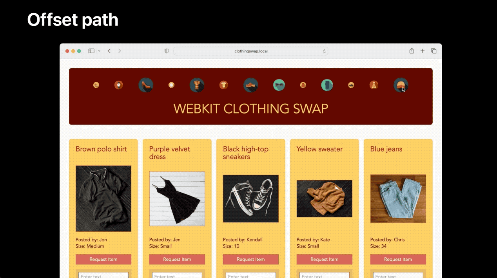

#### scroll behavior

 在 Safari 15.4 之后，新增了滚动行为 [scroll behavior](https://developer.mozilla.org/zh-CN/docs/Web/CSS/scroll-behavior)，你可以通过下面的 GIF 对比效果

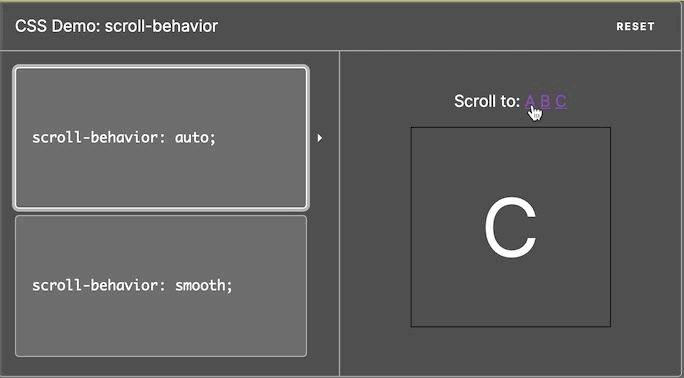

通过定义滚动行为，让同页面的分段跳转更为平滑，大致理解为`UIScrollView` 跳转到某个 `Point` 时是否开启动画。

#### `:focus-visible`

当我们需要让用户关注于页面是上的某些点时，我们可以通过定义用户鼠标点击或者键入内容时，比较一下，当你用鼠标*点击控件*和用键盘 *tab 切换控件*有何不同。

下图中的 `<button>`  定义了`focus`  和 `:focus-visible` 两种状态的结果

按压状态下按钮无边框，而用键盘 *tab 切换控件*时出现了明显的边框

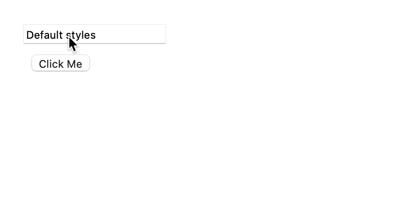

核心 CSS 代码如下：

```css
button:focus {
    outline: none;
    background: transparent;
}
button:focus-visible {
  /* Draw a very noticeable focus style for
     keyboard-focus on browsers that do support
     :focus-visible */
  outline: 4px dashed darkorange;
  background: transparent;
}
```

#### `accent-color`

CSS `accent-color` 属性可以在不改变浏览器默认表单组件基本样式的前提下重置组件的颜色。你还可以使用当前的组件，而不需要自定义新的组件。

注意：`accent-color` 只针对特定的组件：

* [`<input type="checkbox">`](https://developer.mozilla.org/en-US/docs/Web/HTML/Element/input/checkbox)
* [`<input type="radio">`](https://developer.mozilla.org/en-US/docs/Web/HTML/Element/input/radio)
* [`<input type="range">`](https://developer.mozilla.org/en-US/docs/Web/HTML/Element/input/range)
* [`<progress>`](https://developer.mozilla.org/en-US/docs/Web/HTML/Element/progress)

下图来源于[张鑫旭的 CSS accent-color 属性简介](https://www.zhangxinxu.com/wordpress/2022/03/css-accent-color/)中所提供示例的运行结果

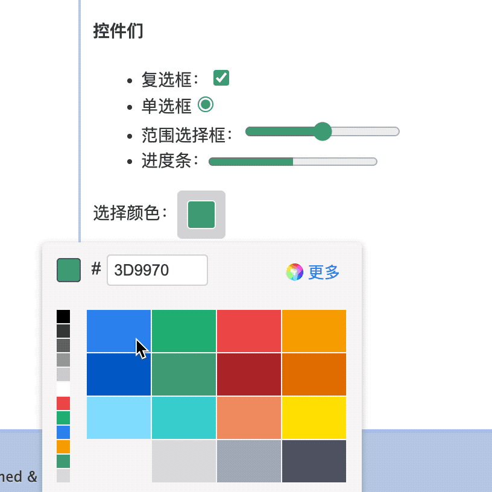

#### 停用部分 WebKit prefixes

在过去的一年，越来越多原本用于实验性的 webKit 前缀，我们都将其转变为标准的属性，以使 CSS 更易于编写和更具互操作性。当然，带前缀的版本此时仍然有效。

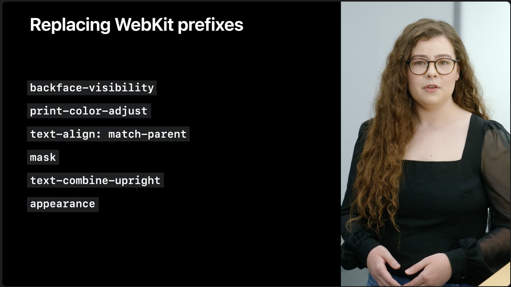

#### 排版

Safari 15.4 中新增了部分功能丰富了 Web 排版的可操作性。

WebKit 添加了 CSS 属性 `font-palette` 和`@font-palette-values` 规则的支持。

`font-palette` 属性为 Web 开发人员提供了一种方法，可以选择包含在彩色字体中的几个不同的预定义调色板中的一个。

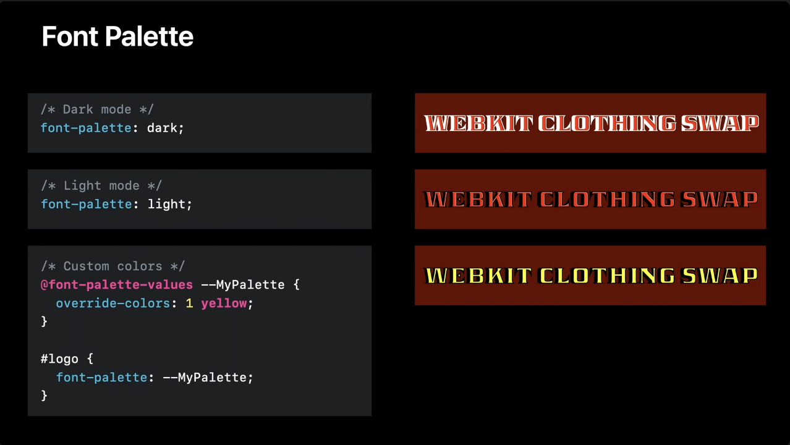

WebKit 添加了对 `text-decoration-skip-ink` 的支持，以控制下划线和上划线在通过字形上升和下降时呈现的形式。

到此，我们已经讲述了多种 CSS 的改进，但还没有结束。

#### 网格容器

多年以来，CSS 网格布局都是前端工程师的一种`心病`。就像这个问题 [CSS Grid 布局那么好，为什么至今没有人开发出基于 Grid 布局的前端框架呢？](https://www.zhihu.com/question/397861009)所说，网格布局并不是一个面向新手的布局方式，你需要了解更多的信息才能得心应手。

现在我们可以通过更简单的方式来实现网格布局

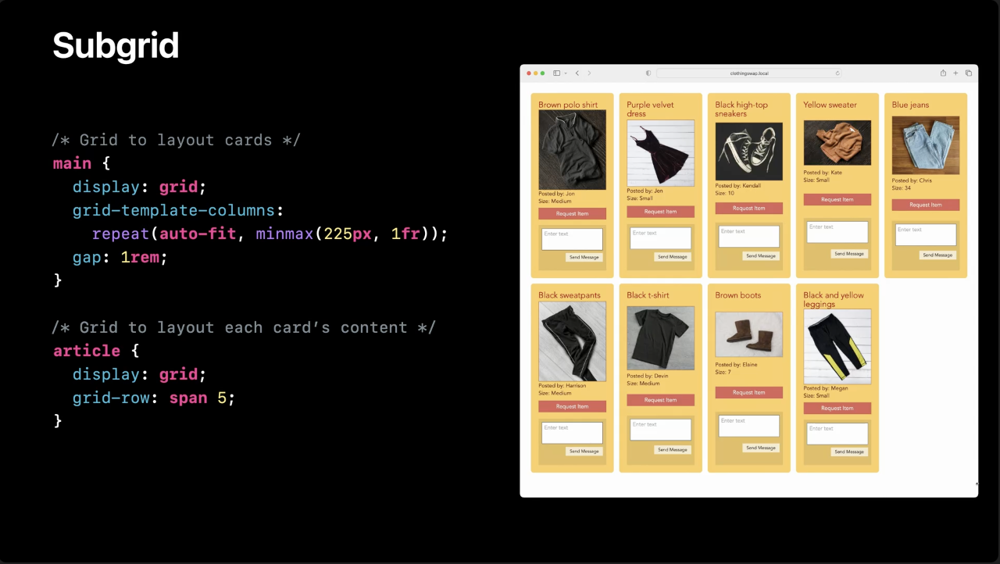

CSS Grid 是革命性的，但它只影响网格容器的直接子级。通过设置 `grid-template-rows: subgrid` 属性，网格中的内容就像也被网格布局一样，井然有序。

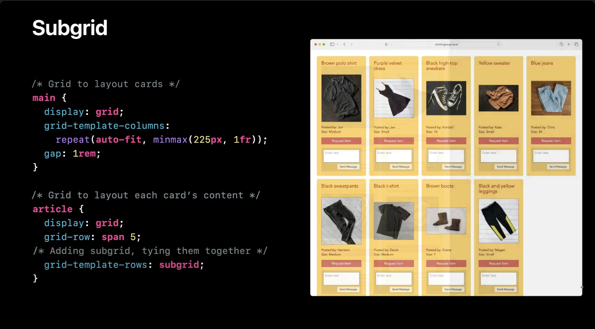

### 网页检查器（Web Inspector）

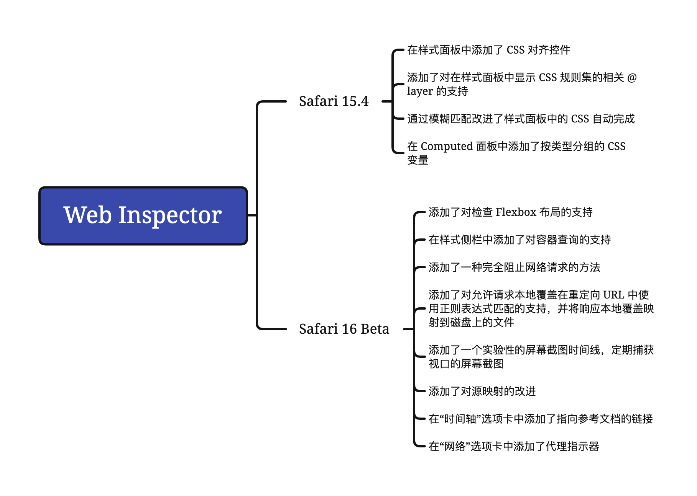

网页检查器中也新增一些功能，可以更好的帮助我们开发调试，以下是部分改进项：

#### Flexbox  检查器

通过使用新的 Flexbox 检查器，你可以可视化元素之间的间距。当我们切换到 `Layout` 选项时，我们找到新的 Flexbox 检查器，并选中它。你可以选择点开全部选项也不用担心浏览器的性能问题。

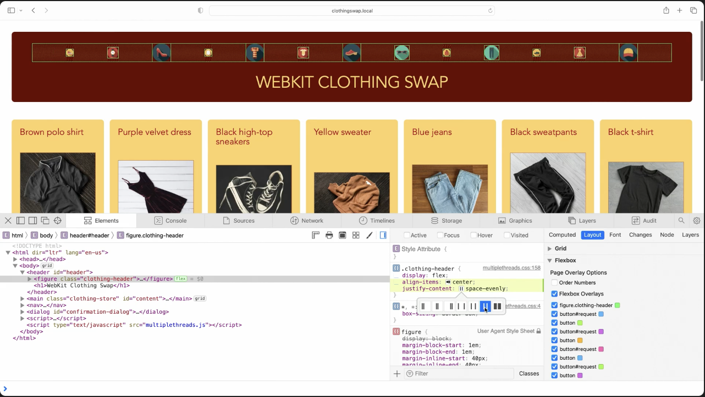

当我们修改属性 `justify-content` 时，我们可以清晰的选择合适的值。

#### 模糊补全

新的 CSS 模糊补全功能能够帮助你的选择合适的变量值而不用担心忘记它们，与以往不同的是，你输入的即便是名称尾部，也是可以匹配出来的。

#### 创建开发工具的拓展

今年网页检查器的更新中最值得瞩目的是 [Create Safari Web Inspector Extensions](https://developer.apple.com/videos/play/wwdc2022/10100)，开发者可以使用最新的 Web 扩展 API 将自己的工具直接添加到 Web 检查器中

### Web API

接下来让我们看看最近一年，在 Web API 方面 WebKit 又新增改进了哪些功能：

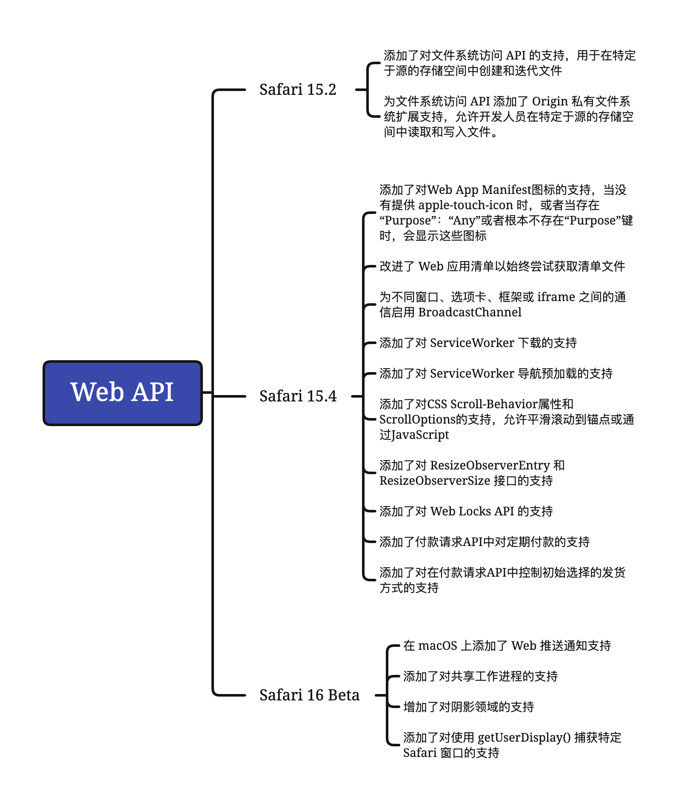

#### Web Push

在 Web API 方面最令人瞩目就是新增了 Web Push 的支持。使用 Web Push 可以提升 macOS 上的 Safari 中网站和 Web 应用程序的通知体验，不过 iOS 和 iPadOS 得在下一个版本才能体验。

我们的专栏文章[【WWDC22 10098】在 Safari 里使用 Web Push](https://xiaozhuanlan.com/topic/0819724365)介绍了这一特性。

#### Web Manifest File

在 Safari 15.4 之后，我们将可以定义用户将 Web 应用保存到主屏幕的时展示的图标。这种应用被称为[渐进式 Web 应用（PWA）](https://developer.mozilla.org/zh-CN/docs/Web/Progressive_web_apps)。

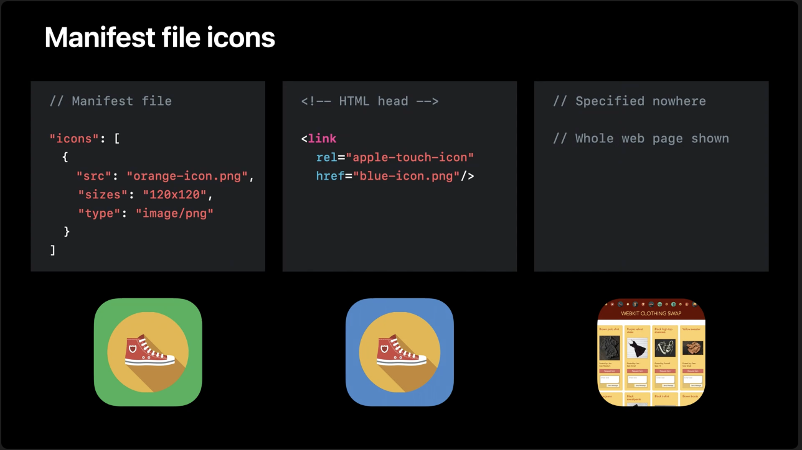

在苹果设备上将网站添加到主屏幕上，其展示的图标优先级最高的是在`<head></head>` 区域添加  `apple-touch-icon`，如果你需要在不同的苹果设备上展示不同的网站图标，这是唯一可能满足条件的方式。

[Web App Manifest](https://developer.mozilla.org/zh-CN/docs/Web/Manifest) 的 `related_applications` 参数可以指定一个“应用程序对象”数组，对待不同分组可以展示不同的图标

```json
// `play` 代表 `Google Play Store`，`itunes` 则代表 `Apple App Store`
"related_applications": [
  {
    "platform": "play",
    "url": "https://play.google.com/store/apps/details?id=com.example.app1",
    "id": "com.example.app1"
  }, {
    "platform": "itunes",
    "url": "https://itunes.apple.com/app/example-app1/id123456789"
  }]
```

如果你并没有做任何处理，主屏上的图标将是该网页的缩率图。

#### Broadcast channels

**Broadcast Channel** 会创建一个所有**同源页面**都可以共享的（广播）频道，因此其中某一个页面发送的消息可以被其他页面监听到。

```js
// State change
broadcastChannel.postMessage("Item is unavailable");
```

参照 [Broadcast Channel API](https://developer.mozilla.org/zh-CN/docs/Web/API/Broadcast_Channel_API)，通过构造 [`BroadcastChannel`](https://developer.mozilla.org/zh-CN/docs/Web/API/BroadcastChannel) 来简单地“订阅”特定频道，并在它们之间进行双向通信。

图片来源 MDN


#### 文件系统访问 API

在 Safari 15.2 开始允许 Web 开发者通过[文件系统访问 API](https://developer.mozilla.org/en-US/docs/Web/API/File_System_Access_API) 在浏览器中操作本地文件。

这个 API 允许与用户本地设备或用户可访问的网络文件系统上的文件进行交互，核心功能主要是读取文件、写入或创建文件以及访问文件夹。它提供了比较稳妥的本地文件交互模式，即保证了实用价值，又保障了用户的数据安全。

```js
// Accessing the origin private file system
const root = await navigator.storage.getDirectory();

// Create a file named Draft.txt under root directory
const draftHandle = await root.getFileHandle("Draft.txt", { "create": true });

// Access and read an existing file
const existingHandle = await root.getFileHandle("Draft.txt");
const existingFile = await existingHandle.getFile();
```

#### P3 色域的支持

Safari 开始支持更为丰富的色彩，全年，我们成为了首个在 CSS 颜色级别中定义新颜色语言的浏览器引擎。今年，我们为 canvas 元素内的内容添加了对 P3 颜色的支持。

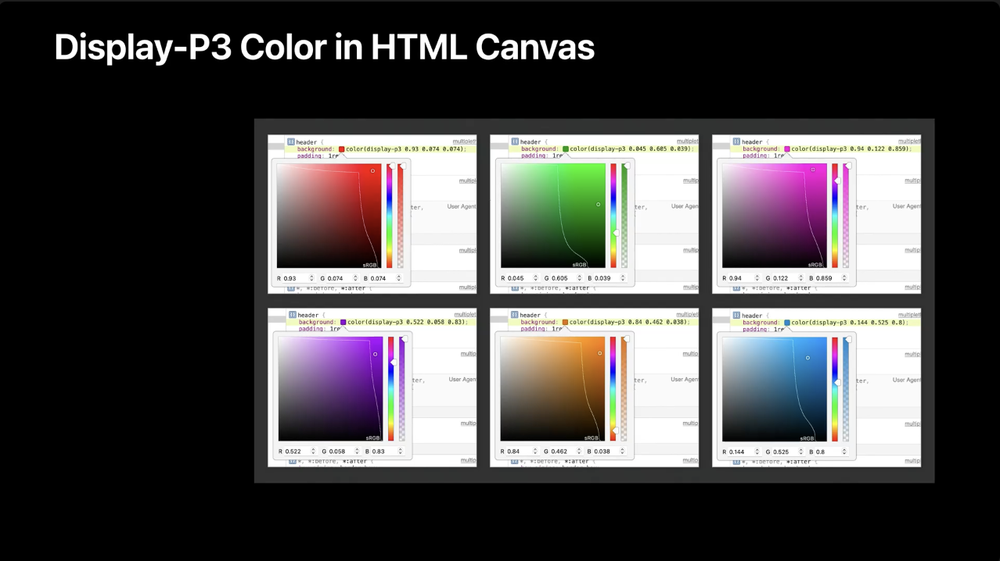

我们最常创建的色彩是一般是采用`sRGB` *色域* 标准，现在，在支持 `P3` *色域* 标准的设备上，支持更为丰富的色彩：

```css
header {
    color: rgb(0, 255, 0);
    color: color(display-p3 0 1 0);
}
```

从现在开始，进入全新的色彩时代，更好的满足用户视觉需求。

### JavaScript 和 WebAssembly

下图为过去一年在 JavaScript 和 WebAssembly 的新特性简介

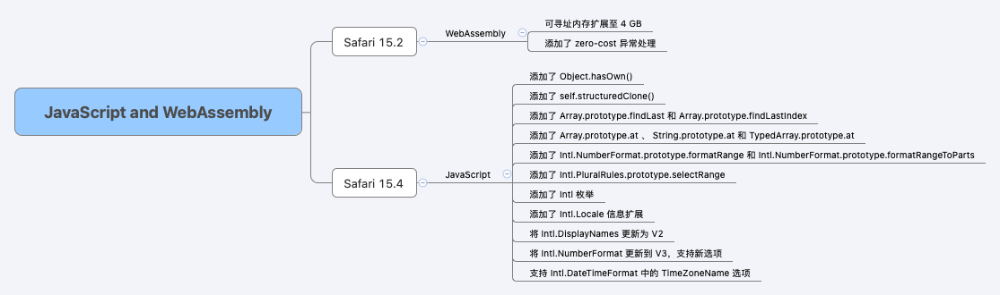

#### SharedWorker

在理解`SharedWorker` 之前，你需要知道`Web Worker` 的概念。

我们知道 JavaScript 语言采用的是单线程模型，也就是说，所有任务只能在一个线程上完成，一次只能做一件事。前面的任务没做完，后面的任务只能等着。

为了充分发挥计算机的计算能力，提出了`Web Worker` 的概念。

`Web Worker`的作用，就是为 JavaScript 创造多线程环境，允许主线程创建 `Worker` 线程，将一些任务分配给后者运行。

`SharedWorker` 接口代表一种特定类型的 `Worker` ，可以从几个浏览上下文中*访问*，例如几个窗口、iframe 或其他 `Worker` 。它们实现一个不同于普通 `Worker` 的接口，具有不同的全局作用域。

> `SharedWorker`  的实质在于 share，不同的线程可以共享一个线程，他们的数据也是**共享的**。 数据的共享能够帮助我们减少计算和网络请求。

不过使用 `Web Worker` 时需要注意以下几点：

* **同源限制**
* **DOM 限制**
* **通信联系** 无法与主线程直接通信，只能通过消息来实现
* **脚本限制**
* **文件限制**

代码如下：

```js
// Create Shared Worker
let worker = new SharedWorker("SharedWorker.js");

// Listen for messages from Shared Worker
worker.port.addEventListener("message", function(event) {
  console.log("Message received from worker: " + event);
});

// Send messages to Shared Worker
worker.port.postMessage("Send message to worker");
```

#### 在数组中搜索

今年，新增了一些新的 JavaScript 方法能够帮我们更好的在数组中进行搜索

```js
const list = ["shirt","pants","shoes","hat","shoestring","dress"];
const hasShoeString = (string) => string.includes("shoe");

console.log(list.findLast(hasAppString));
// shoestring

console.log(list.findLastIndex(hasAppString));
// 4
```

你可以通过 `findLast` 和 `findLastIndex` 在数组中从后往前搜索，而不需要先将数组 `reserve`。

 当我们需要搜索特定下标的对象时，有一个简单的方法是使用 `at(index)` 方法，其最大特点是支持负数下标：

```js
const list = ["shirt","pants","shoes","hat","shoestring","dress"];

// Instead of this:
console.log(list[list.length - 2]);

// It's as easy as:
console.log(list.at(-2));

```

上述两个方法的输出值都是 `shoestring`。

#### 更好的国际化支持

新的 Safari 将提供更好的国际化支持，`Intl` 对象的设计目的是使特定位置的数据更容易国际化。提供了精确的字符串对比、数字格式化，和日期时间格式化。

你可以查看 [Intl](https://developer.mozilla.org/zh-CN/docs/Web/JavaScript/Reference/Global_Objects/Intl) 查看具体哪些属性，以及国际化使用的构造器和其他语言的方法等常见的功能。

#### WebAssembly

对于网络平台而言，WebAssembly 具有巨大的意义，它提供了一条途径，使得以各种语言编写的代码都可以以接近原生的速度在 Web 中运行。

WebAssembly 的作用是可以将编译型语言 `C` / `C++` / `Rust` 等转成 `JS` 可以识别的中间码并执行，这有两大好处，一个是原有的复杂软件可以方便的移植到浏览器环境，一个执行效率变高了

这种情况下，以前无法运行的客户端软件都将可以运行在 Web 中。

随着今年的改进，使用 WebAssembly 的 Web 应用程序只会变得更加强大，其可寻址内存扩展到 4GB，并且新的`zero-cost` 异常处理更是带来了性能提升。

### Security 和 Privacy

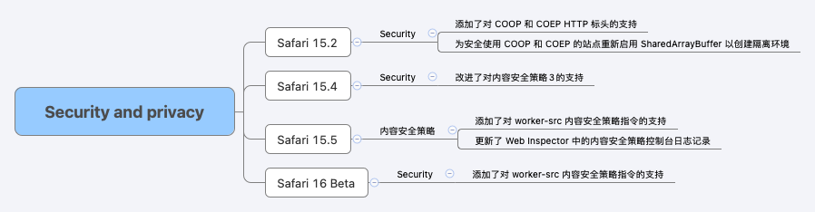

#### COOP  和 COEP HTTP 标头

为了解决跨域问题，我们新增了 `COOP`  和 `COEP` HTTP 标头，使用新的跨域打开器策略和跨域嵌入器策略 HTTP 响应标头，网页可以选择进程隔离，这也意味着网页将在其自己的专用 `webContent` 进程中运行。

#### 内容安全策略 3（CSPL3）

[内容安全策略(Content Security Policy)](https://www.w3.org/TR/CSP2/)简称`CSP`是由[W3C](https://www.w3.org)小组定义的一项规范，其主要做用是提供一个额外的安全层，用于检测并削弱某些特定类型的攻击,包括跨站脚本 (XSS) 和数据注入攻击等。

在新版本的 Safari 中增加了对内容安全策略的更新，特别是新的严格动态源表达式。

```js
// strict-dynamic source expression

// Without strict-dynamic
Content-Security-Policy: script-src desired-script.com dependent-script-1.com
  dependent-script-2.com dependent-script-3.com; default-src "self";

// With strict-dynamic
Content-Security-Policy: default-src "self"; script-src "nonce-desired" "strict-dynamic";
```

你可以使用 nonce 来允许某些脚本，然后将这种信任扩展到已经受信任的脚本加载的脚本。而不需要明确的`白名单`。

## 总结

过去一年在 Safari 和 WebKit 中开发了差不多完成 162 项功能和改进。

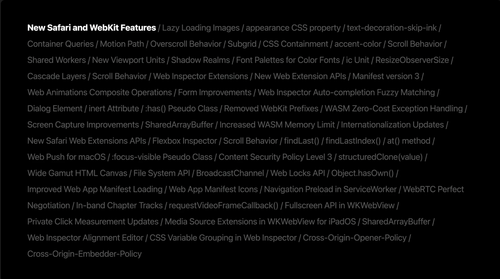

请原谅我并不能针对每个点一一展开论述。

你可以通过[Safari Technology Preview Release Notes 132- 147](https://developer.apple.com/safari/technology-preview/release-notes/) 来查看过去一年苹果在 HTML、CSS 增强、Web Inspector 工具、Web API 等各个方面的详细更新情况。

当你准备使用某些新特性时，使用 [Can I use](https://caniuse.com/) 来了解某些新特性的兼容性和支持的版本是非常重要的。

如果你想尝试新的功能，你可以通过下载 [Safari Technology Preview](https://developer.apple.com/safari/resources/) ，在其中试用 Safari 和 WebKit 新的更新和改进。 [Safari Technology Preview](https://developer.apple.com/safari/resources/) 支持不需要更新 beta 系统来体验新版功能的版本。

你可以参照[时间线](https://trac.webkit.org/timeline)获取了解更多的细节，如果在 WebKit 中遇到错误——有关 HTML、CSS、JavaScript、DOM API 或 Web Inspector 的问题——请确保通过 [WebKit 的错误跟踪系统](https://trac.webkit.org)发送反馈。

### 致歉

由于笔者对前端内容并不是非常擅长，所总结的内容和理解难免存在疏漏和错误，如有问题，请与我联系。

### 参考文章

[开发者注意了，WebKit 迎来新升级！](https://xw.qq.com/cmsid/20220319A01GC700)
