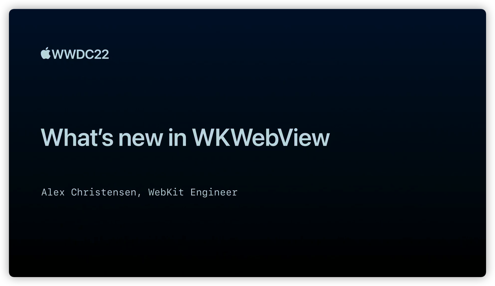

## 个人介绍

Style月月，iOS程序媛，简书/掘金文章贡献者，目前任职于小米，侧重于海外相关业务

## 审核介绍

## 不超过 120 个字的文章简介

本文将主要聚焦于 Apple 的 AR/MR 新 API：RoomPlan 。全文共分为 3 个部分：第一部分是 Apple 的 AR/MR 技术发展回顾，包括 RoomPlan 和 Object Capture 技术背后的原理简介。第二部分是对 RoomPlan 技术的介绍，包括如何使用官方 API ，快速在您的 App 中使用 RoomPlan，以及如何通过数据 API 自定义 RoomPlan 的使用。最后一部分是关于 AR/MR 应用设计实践的相关建议。

本文主要是探索 WKWebView 在 iOS 16 中的新功能，全文主要分为 

## 公众号/小专栏图文头图

