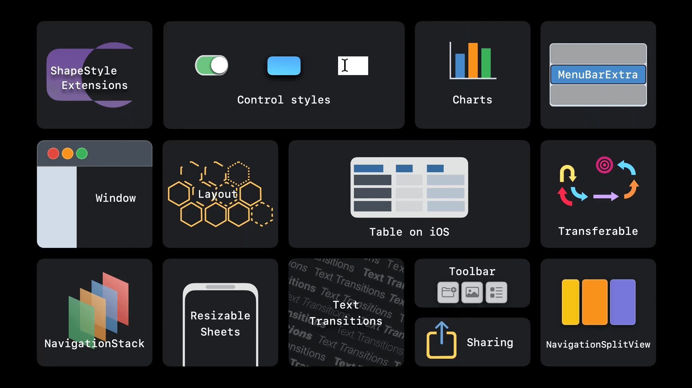

## 个人介绍

Logic Wang，就职于 Fidelity 大连分公司, 担任数字技术专家职务。

## 审核介绍

Jake Lin，在 REA Group 担任 Senior Mobile Tech Lead，负责公司的移动研发和团队建设。喜欢研究 iOS 和 Android 两平台的架构，爱折腾声明式 UI 和响应式编程范式。并编写了 [iOS 开发进阶](https://t2.lagounews.com/lR59RGRBct5E3) 课程。

## 不超过 120 个字的文章简介

本文介绍 WWDC22 中 SwiftUI 的更新，使用代码 + 图片的形式进行介绍，包括 SwiftChart， Navigation and windows， Advanced controls，Sharing，Graphics and layout 等主题内容的介绍。

## 公众号/小专栏图文头图

