# Session 10052 - What's New In SwiftUI

本文基于 [Session 10052](https://developer.apple.com/videos/play/wwdc2022/10052/) 梳理.

今天很荣幸与大家分享 WWDC22 的 What's New in SwiftUI Session。
一起来看看今年又有哪些更新呢？在开始之前先让我们回忆一下 **去年的更新内容**。

1. SafeArea 内容，新增了 `.safeAreaInset` 来以某个 View 作为 safeArea。
2. List 增强， 包括 `.refreshable` 的下拉刷新能力， `searchable` 的搜索能力 `.swipeActions` 的 row 侧滑功能，以及一些小的 UI 调整，比如支持 `.listRowSeparator` 隐藏等。
3. Toobar 的增强，可以自定义 SwiftIUI 导航栏 BarItem，自定义依附于键盘顶端的 view 等。
4. 新增了 `@FocusState` 关键字，手动控制 firstResponder 进行输入等操作。
5. 新增 `AsyncImage` 进行异步图片网络请求。
6. 增加了 Text 对于 Mardown 的支持等。

**而回到今年的 WWDC， 我们用一张图来完整展示今年 SwiftUI 的更新内容**


有没有发现特别感兴趣的主题，先别着急，我们分 5 大类来依次介绍一下。

* SwiftChart
* Navigation and windows
* Advanced controls
* Sharing
* Graphics and layout

---

## 首先是介绍一下重头戏 SwiftChart

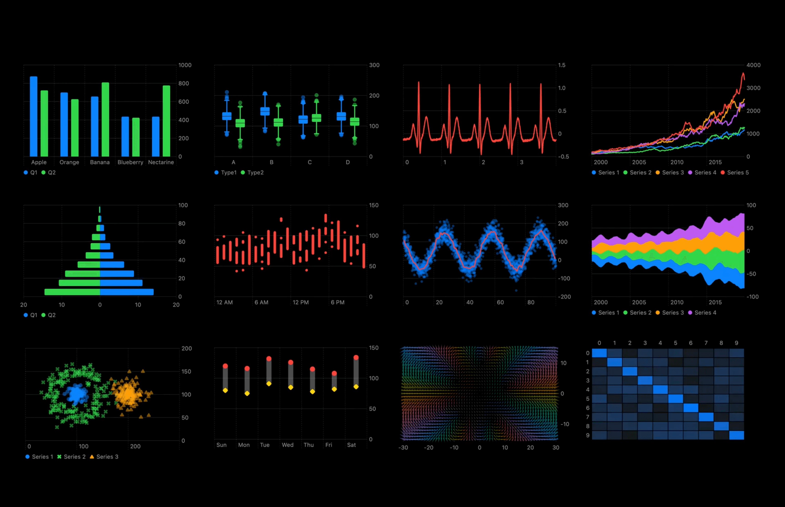
上图看到的这些效果是 Apple 在 WWDC22 上介绍 Charts 时所展示的效果，是不是很酷炫？  
在 iOS16 以前当我们需要绘制图表的时候，很可能会使用开源的图表库。其中当属具有 25.6k Stars 的 danielgindi/Charts 最为流行。  
danielgindi/Charts 能支持大部分常用的图表， 而且同时为 Android 与 iOS 提供相同的 API，功能非常强大与便捷。其中 iOS 部分使用 CoreGraphics 进行绘制，在使用的时候需要注意 xAsix 与 yAsix 坐标的设置。  
可惜对于 Accessibility 的支持有限，Dynamic Type 与 VoiceOver 等处理也非常复杂，这点还是 Apple 原生的 SwiftUI Chart 更胜一筹。  
加上目前海外 App，例如我司 App 主要所在的美国市场，有政策要求必须支持 Accessibility，相信未来 SwiftUI Chart 对有海外需求的小伙伴也是有非常大的帮助的。  
  
今天先进行一些简单实用介绍，比如常见的柱状图/折线图/基准线等。

1 柱状图( `BarMark` )

```swift
Chart(partyTasksRemaining) { task in
    BarMark(
        x: .value("date", unit: .day),
        y: .value("Task Remaining", task.remainingCount)
    )
}
```

2 折线图( `LineMark` )

```swift
Chart(partyTasksRemaining) { task in
    LineMark(
        x: .value("date", unit: .day),
        y: .value("Task Remaining", task.remainingCount)
    )
    .foregroundStyle(byL .value("Category", task.category))
}
```

3 基准线( `RuleMark` )
甚至可以为其添加文字说明 `.annotation(...)` 。

```swift
Chart(partyTasksRemaining) { task in
    AnyCharts{ ... }
    RuleMark(y: .value("Value", 5))(
        .annotation(position: .top, alignment: .trailing) {
            VStack {
                Text("Today's Goal")
                Text("Status: ✔️")
            }
        }
    )
}
```

除此之外还可以进行图表的叠加，只需要合理操作 Chart 数据源，即可实现

```swift
Chart(date.source) { source in
    BarMark(x: .value("data", source.date, unit: .hour),                    
            y: .value("value", source.value))
            
    LineMark(x: .value("data", source.date, unit: .hour),
             y: .value("value", source.lineValue))
        .foregroundStyle(Color.red)
            
    RuleMark(y: .value("value", source.value))
}
```

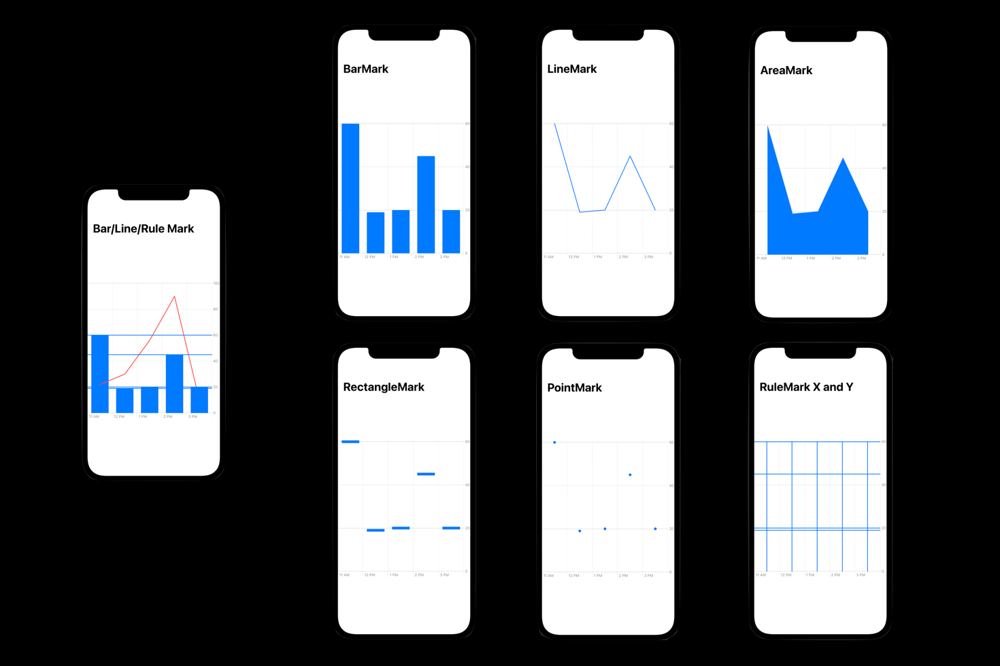

---

上面是使用过原生 API 在 10 行左右即可实现的效果，对开发者真的非常友好，苹果之前在 iOS 内置的 Health app 中苹果开始大量使用图表，而现在开放成为开发者使用的 framework。

这很 Apple，会借鉴很多开源库，了解解决开发者的需求。
比如早期 Apple 借鉴而推出的 UICollectionView，以及随着 Swift 推出的 Codable 等等，现在都在 iOS 开发领域抢夺了很多开源库的份额。

了解更多关于 Swift Charts 内容，请持续关注我们，后续我们也会更新 Charts 相关 Session。
心急的小伙伴可以先查看 WWDC 以下两个 Session 的视频提前了解。

[Hello Swift Charts](https://developer.apple.com/videos/play/wwdc2022/10136/)
[SwiftCharts: Raise the bar](https://developer.apple.com/videos/play/wwdc2022/10137/)

介绍完 Swift Charts， 让我们一起看看 SwiftUI 对导航栏和窗口进行的 API 更新。

## Navigation and windows

SwiftUI 刚推出时候，导航栏使用的是 `NavigationView` 与 `NavigationButton` 的组合来进行跳转，使用 `@Environment (\.presentationMode)` 环境变量进行 `pop/dismiss` 返回。

很快跳转下一层级所使用的 `NavigationButton` 就被 `NavigationLink` 所替代， 在 iOS15 中，返回页面所使用的 `\.presentationMode` 也被 `\.dismiss` 替代， 而在今年导航栏 `NavigationView` 也会被 `NavigationStack` 的替代。

不过这些只是 API 的改变，还是只能逐级页面跳转，我们还是无法方便操作导航栏堆栈，比如跳转多级页面后，直接返回中间的某一级别页面等操作还是异常的困难。
今年苹果终于解决这些导航问题了，下面一起看看有那些重大的更新。

> NavigationStack

听名字就知道他终于开放导航栏堆栈了，这赋予了我们比过去更简洁优雅的跳转方式。
与过去 UIKit 中的 `UINavigaitonViewController.viewControllers` 类似。
下面是代码的例子。

```swift
NavigationStack {
    List(foodItems) { item in
        NavigationLink(value: item) {
            Label(item.title, image: item.icon)
        }
    }
    .navigationDestination(for: FoodItem) { item in
        FoodDetailView(item: item)
    }
}
```

在 iOS16 之前，我们只能使用 `NavigationView` 来包裹 `NavigationLink` 来让其跳转。
现在只需要将原本 `NavigationView` 所在位置替换为 `NavigationStack` 我们就获得了上面的一段代码，区别仅仅在于有了新的 modifier `.navigationDestination` 可以统一处理跳转入口了，提升好像不明显啊， 我们期待的堆栈操作呢？
别急，看下一段代码。

```swift
@State private var selectedItems: [FoodItem] = []
NavigationStack(path: $selectedItems) {
    List(foodItems) { item in
        NavigationLink(value: item) {
            Label(item.title, image: item.icon)
        }
    }
    .navigationDestination(for: String.self) { item in
        FoodDetailView(text: item, path: $selectedItems)
    }
}
```

可以看到这段代码与上段代码多了个 `path:` 与一个 `FoodItem` 数组。
SwiftUI 作为响应式编程语言，`var selectedItems: [FoodItem]` 便是与导航栏堆栈双向绑定的数组，跳转方式没变，但是我们现在可以操作这个数组来控制导航栏堆栈了。
接下来看在二级页面 `FoodDetailView` 中具体操作堆栈的代码。

```swift
struct FoodDetailView: View {
    let item: foodItem
    @Binding var path: [FoodItem]

    var body: some View {
        Text(item.title)
            .onTapGesture {
                path.removeSubrange(1...) // 返回根视图
                // 对 path 数组操作即可改变导航栏堆栈
                // path.append(foodItem) 即可继续跳转
                // 如果使用String作为path即与URLRouter类似效果
            }
    }
}
```

二级页面只有一个 `Text` 文本，当点击文本时候，操作 `path` 数组即可做到代码注释所述功能，这也得益于 `@Binding` 与一级页面 `@State` 的数据绑定。
关于 navigation 详细内容可以参照 小专栏: [SwiftUI 新导航方案](https://xiaozhuanlan.com/topic/7841259603)

既然说完了导航跳转，那就不得不也要提一下模态弹出页面的跳转方式。

> `.presentationDetents`

在 SwiftUI 中常使用 `.sheet` 和 `.fullScreenCover` 等方式从底部弹出一个新的 View 。
不过这种弹出目前却有一个不足之处，无法让弹出的 View 顶部透明，继续显示底层 View 的一些细节， 而 UIKit 中 present 方法却可以做到。
这一遗憾今年终于也得以弥补，那就是新的 modifier，`.presentationDetents`。

```swift
    var body: some View {
        Text("Hello, World!")
            .onTapGesture {
                showBudget.toggle()
            }
            .sheet(isPresented: $showBudget, content: {
                BudgetView()
                    .ignoresSafeArea()
                    .presentationDetents([.large, .height(300)])
                    .presentationDragIndicator(.visible)
            })
    }
```

效果如图。
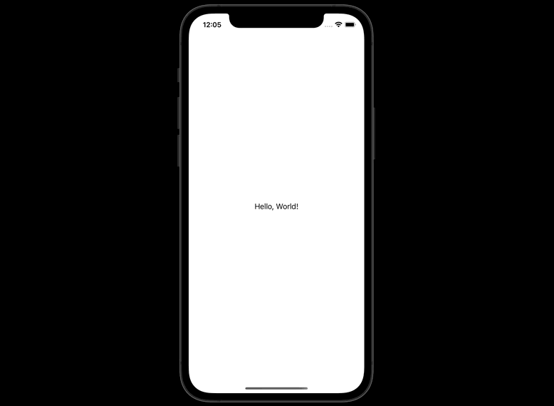

代码中 `presentationDetents` 跟随参数是一个集合，示例中设置为 `[.large, .height(300)]` ，所以 gif 演示中，可以做到两段滑动，分别处于 300 和全屏状态。

说完 iOS 上的各种跳转，让我们看看 iPad 上特有的一些组件。

> NavigationSplitView

以前做过 iPad 适配的小伙伴应该对这个 Split 关键字并不陌生，提供了一个列表的分屏展示能力，在 UIKit 与之对应的组件有 `UISplitViewController`，而在 SwiftUI 的 AppKit 中有 `HSplitView` 。
现在 iPad 设备中，SwiftUI 终于为我们提供了类似的 Components。
这里不过多介绍了，直接上代码和图例。
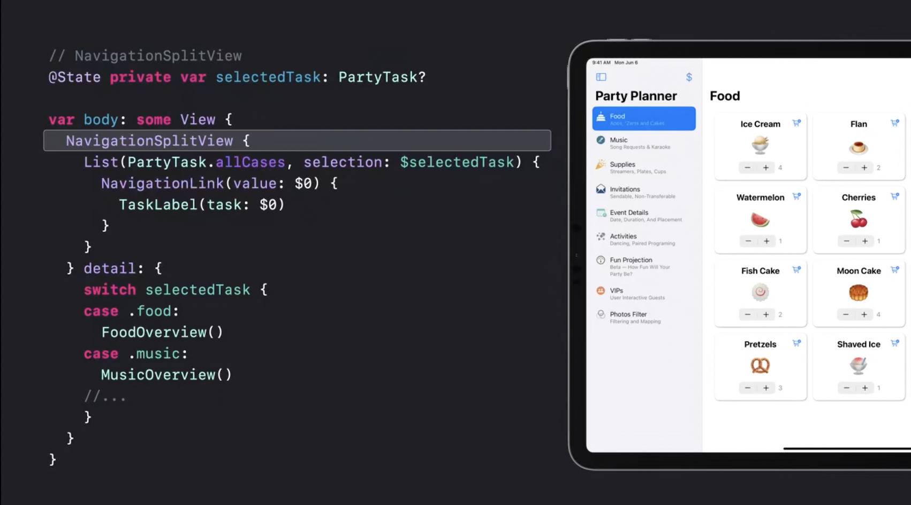

`NavigationSplitView` 中 List 为左侧列表一级页面，而 `detail` 所展示为二级详情页面内容。同时 `NavigationSplitView` 还可以很好的支持 iPad 的多 App 分屏模式。

说了这么多都是 iOS 和 iPadOS 上的内容，接下来我们看看 macOS 的多 window 更新。

> macOS 独立 Window 支持

之前使用 SwiftUI 来构建程序主页面时候，一般来说使用 `WindowGroup` ，可以生成多个窗口以允许对应用程序的数据进行不同的透视。
今年新增了 `Window` 容器，为 Mac 的 app 声明一个唯一的窗口，并支持快捷键打开，同时为其提供了较多的 modifier，例如默认大小/位置/可调整大小等等。
示例代码如下。

```swift
@main
struct PartyPlanner: App {
    var body: some Scene {
        WindowGroup("Party Planner") {
            TaskViewer()
        }
        Window("Party Budget", id: "budget") {
            BudgetView()
        }
        .keyboardShortcut("0") //快捷键支持 Command+0
        .defaultPosition(.topLeading)
        .defaultSize(width: 220, height: 250)
    }
}
```

示例中 Window 可以使用快捷键 Command + 0 单独唤醒，设置了默认尺寸与位置。
其使用场景更适合作为一个独立且较小的辅助窗口来使用。
如果对于 Scene 和 window 有兴趣，可以参考我们的另一片文章
[将多窗口引入 SwiftUI 应用](https://xiaozhuanlan.com/topic/3529016874)

当然 macOS 的更新不止于此，SwiftUI 的能力也不限于一个平台，比如上段代码中的 `BudgetView` , 作为一个自定义的 SwiftUI View，也可以在不修改代码的情况下，来支持 iOS / iPadOS 等不同平台。

macOS 除了新增独立辅助窗口外，也新增了 Menubar 组件，可以展示在系统桌面右上角的位置  `MenuBarExtra`。
话不多说，上代码～

```swift
@main
struct PartyPlanner: App {
    WindowGroup("Party Planner") { ... }
    MenuBarExtra("Bulletin Board", systemImage: "quote.bubble") {
        BulletinBoardView()
    }
    .menuBarExtraStyle(.window)
}
```

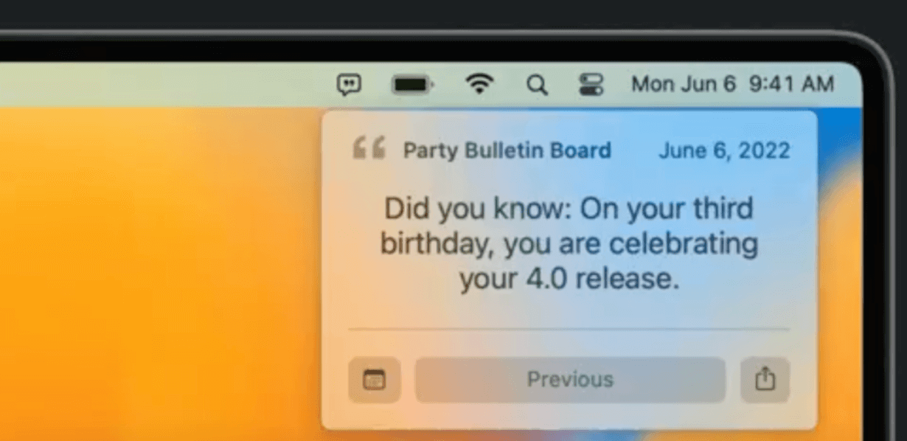

需要额外提一下的地方是， MenuBarExtra 可以独立运行， 也就是说 App 可以不唤醒 WindowGroup 的时候使用。甚至代码中根本不需要 WindowGroup 的情况下也可以独立运行。

说了这么多，SwiftUI 对于跨平台的支持真是不遗余力，各位小伙伴要不要考虑在公司为技术发言为自己发言，将自己的 App 做成跨平台项目？

关于这方面的 Xcode 支持，可以参照以下视频，也可以持续关注我们后续相关专题更新。
[What's new in Xcode](https://developer.apple.com/videos/play/wwdc2022/110427/)
[Use Xcode to develop a multiplatform app](https://developer.apple.com/videos/play/wwdc2022/110371/)

刚刚我们介绍了一些跳转与窗口等， 接下来介绍一下对视图控制的提升。

> Advanced controls 高阶控制

3.1 Form
SwiftUI 中的 `Form` 增加了新的 style，当然 `Form` 会自动适配 iOS/iPadOS/macOS。

```swift
Form {
    Section { 
        LabeledContent("Location") {
            AddressView(location)
        }
        DatePicker("Date", selection: $date)
    }
    Section { 
        Picker("Accent color", selection: $accent) { ... }
        Picker("Color scheme", selection: $scheme) { ... }
        Toggle(isOn: $extraGuests) {
            Text("Allow extra guests")
            Text("The more the merrier!")
        }
    }
}
.formStyle(.grouped)
```

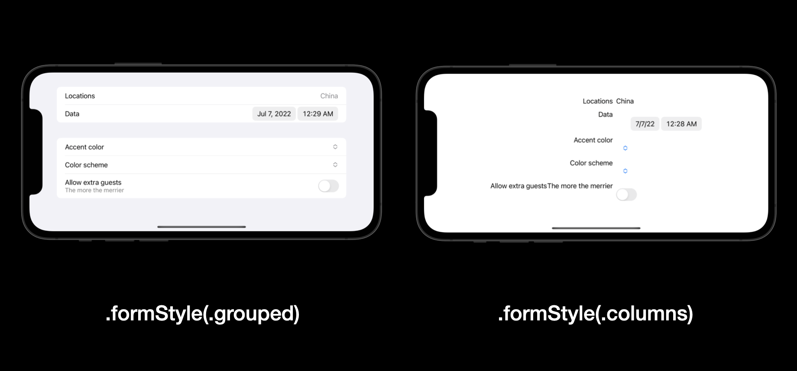
图中可以看出，`formstyle` 对于 `Form` 的影响，这个例子中使用 `.grouped` 更加合适。

除了 `Form` 的提升，作为最常用的 `Test` / `TextField` 也有些提升，属于很细节很重要的变化。让我们一起来看看 `lineLimit` 的提升。

```swift
Text("Hello World")
    .lineLimt(2...3)
    
TextField("Description", text: $description, axis: .vertical)
    .lineLimit(5...10)
```

过去 `lineLimt` 只支持一个常数，限制其最高行数，限制也可以限制最低行数，让我们在一个例子中看一下其作用。

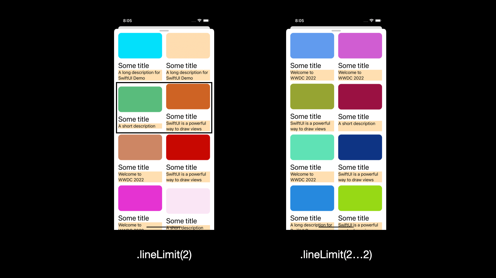
这是使用 `LazyVGrid` 创建的 `View` , 每一个 Item 包含一个色块，一个标题和一段副标题，同时为副标题 `Text` 增加了浅橙色背景。
可见左侧截图中黑色框范围内，出现了 Item 没有对齐的现象，原因在于副标题文本长度的不确定。
而右侧使用 `lineLimit(2...2)` 将行数锁定为 2 行来优雅简单的解决这个问题。
如果是 iOS16 之前，就需要使用类似如下的代码思路来解决。

```swift
Text("\n\n")
    .frame(maxWidth: .infinity)
    .overlay {
        Text(model.subTitle)
            .lineLimit(2)
    }
    
```

这便是使用 `overlay` / `background` 之类的思路来做两层 `Text`。

除了 `Text` 这种贴心好用的更新外，对于 `DatePicker` 也有些更新。
`MultiDatePicker`, 看名字也可以理解，日期选择器支持多选啦～

```swift
@State private var activityDates: Set<DateComponents>

var body: some View {
    MultiDatePicker("Dates", selection: $activityDates)
}
```

如图所示
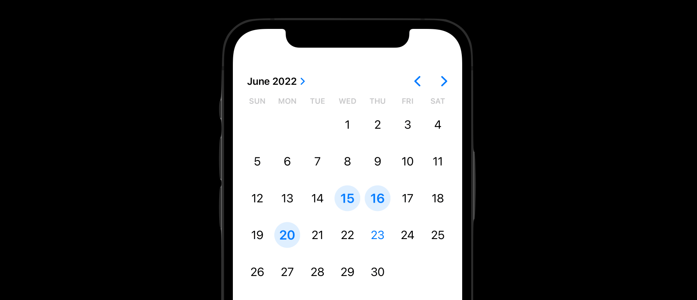

日期选择代码和逻辑比较简答，便不过多介绍，我们继续来看一下好玩的新东西，我姑且翻译成 ‘状态聚合’(Mixed-state)。
这个功能可以将多种相同类型的 `View` 进行组合，统一管理。
我们以 `Toggle` 为例，创建四个 `Toogle`, 而后进行 ‘状态聚合’。

```swift
DisclosureGroup {
    Toggle("Balloons", isOn: $includeBalloons)
    Toggle("Confetti", isOn: $includeConfetti)
    Toggle("Inflatables", isOn: $includeInflatables)
    Toggle("Party Horns", isOn: $includePartyHorns)    
} label: {
    Toggle("All Decorations", isOn: [
        $includeBalloons,
        $includeConfetti,
        $includeInflatables,
        $includePartyHorns
    ])
}
```

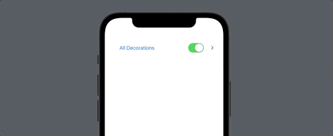

另外 `DisclosureGroup` 也支持风格的自定义，需要继承 `DisclosureGroupStyle`，如果有兴趣可以持续关注我们后续文章。
另外 SwiftUI 作为跨平台语言，`DisclosureGroup` 也支持 macOS。
得益于 SwiftUI 的 View tree 机制，很多 modifier 都具有 Environment 的特性，方便批量设置，比如接下来介绍的 `toggleStyle`。

```swift
@State private var useSwiftHashtag = false
@State private var usePartyHashtag = false
@State private var useChartsHashtag = false
@State private var useOMTHHashtag = false
    
var body: some View {
    VStack(alignment: .leading) {
        HStack {
            Toggle("#Swiftastic", isOn: $useSwiftHashtag)
            Toggle("#WWParty", isOn: $usePartyHashtag)
        }
        HStack {
            Toggle("#OffTheCharts", isOn: $useChartsHashtag)
            Toggle("#OneMoreThing", isOn: $useOMTHHashtag)
        }
    }
    .padding()
    .toggleStyle(.button)
    .buttonStyle(.bordered)
}
```

.png)
代码中创建了 4 个 Toggle， 分为两行。
右侧截图与左侧截图相比，只是多了一行 `.toggleStyle(.button)`。
除此之外 `Menu`/`Picker` 也新增了多种 `style`， 接下来我们继续看看其他控件，`Stepper`。

`Stepper` 新增 `format` 能力， 支持 number / 百分比等 13 种类型。
且自动适配 macOS 支持数字填写，iOS 为 +- 按钮，watchOS 也有对应适配。

```swift
Stepper(value: $value,
        step: step,
        format: .number) {
    Text("Current value: \(value), step: \(step)")
}
```

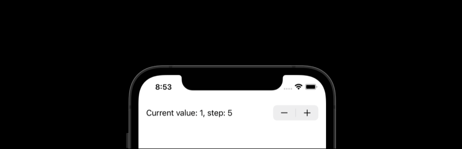

下一个组件，是先在 macOS 上使用的，刚刚登陆 iOS / iPadOS 平台。
那就是 `Table`， 话不多说，直接上代码和图片。

```swift
@State private var attendees: [Attendee]

var body: some View {
    Table(attendees) {
        TableColumn("Name") { attendee in
            AttendeeRow(attendee)
        }
        TableColumn("City", value: \.city)
        TableColumn("Status") { attendee in
            StatusRow(attendee)
        }
    }
}

var body: some View {
    Table(attendees, selection: $selection) {
        ...
    }
    .contextMenu(forSelectionType: Attendee.ID.self){ selection in
        if selection.isEmpty {
            Button("New Invitation") { addInvition() }
        } else if 1 == section.count {
            Button("Mark as VIP") { markVIPs(selection) }
        }
        ...
    }
}
```

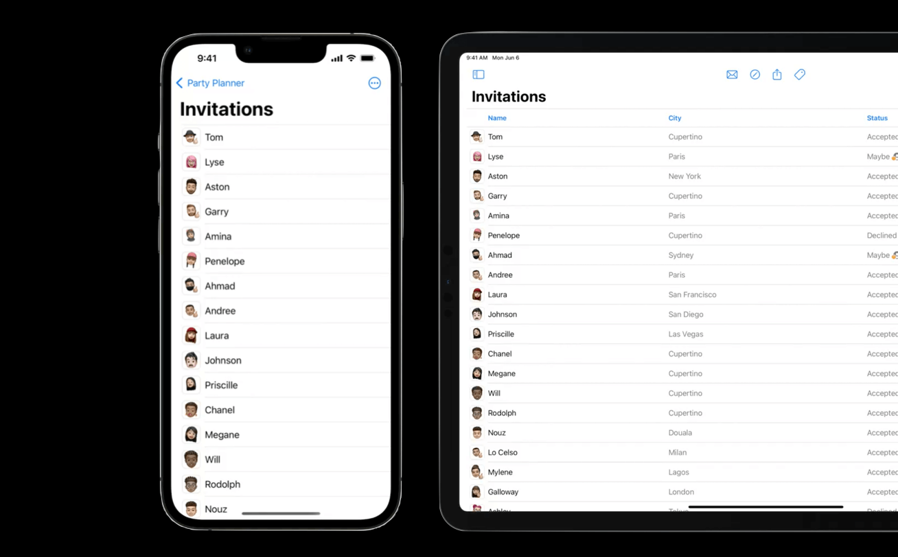
不过我认为在 iOS 中仍然有许多不足支持，比如默认只显示首列 `TableColumn`，在 iPad 和 Mac 中才会展开，如果在 iOS 系统中支持左右滑动也许效果会更好。
另外 `Table` 提供了`contextMenu`的点击事件处理，可以直接在屏幕 popup 一个菜单选项。
支持与 `List` 类似的 `searchable` modifier， 甚至更强大。

除此之外还有些 `Toobar` 的更新，我们简单介绍一下。
iOS16 之前的 `.toobar` 提供了自定义导航栏左右按钮，以及键盘顶部跟随等选项, 为我们提供了很多便捷， 今年在此基础上进一步加强，不过更多在 iPad 上。

```swift
Table(attendees, selection: $selection) {
    ...
}
.toolbar(id: "invitations") {
    ToolbarItem(id: "new", placement: .secondaryAction) {
        Button(action: sendNewInvitation) {
            Label("New Invitation", systemImage: "envelope")
        }
    }
}
```

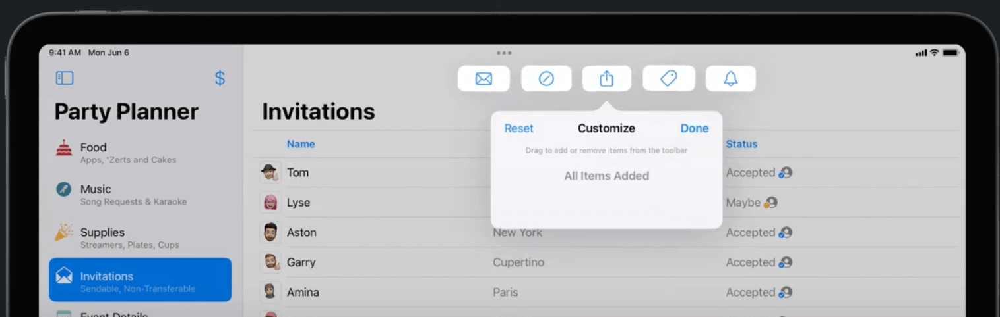

`ToolbarItemPlacement` 新增了 `secondaryAction` 类型，开发者进行导航栏按钮预设后，允许用户自己决定自己的导航栏按钮的顺序位置等。

关于这些 UI 组件的更新，我们之后的文章会进行详细介绍。 等不及的小伙伴可以查看 WWDC 视频。
[SwiftUI on iPad: Organize your interface](https://developer.apple.com/videos/play/wwdc2022/10058/)
[SwiftUI on iPad: Add toobars, titles, and more](https://developer.apple.com/videos/play/wwdc2022/110343/)
[What's new in iPad app design](https://developer.apple.com/videos/play/wwdc2022/10009/)
[SwiftUI on the Mac: Build the fundamentals](https://developer.apple.com/videos/play/wwdc2021/10062/)

上面提到的大部分更新都是对已有内容的更新。
让我们看点新出的内容，`ShareLink`。

## Sharing

新推出了 `ShareLink` API，来使用系统的分享功能，与 UIKit 中的 UIActivityViewController 所提供的能力类似，现在可以在 SwiftUI 中使用 `ShareLink` 来做了， 同时可以自动在多平台以不同的 UI 进行适配。

```swift
Gallery( ... )
    .toobar {
        ShareLink(
            item: image,
            preview: SharePreview("Birthday Effects")
        )
    }
```

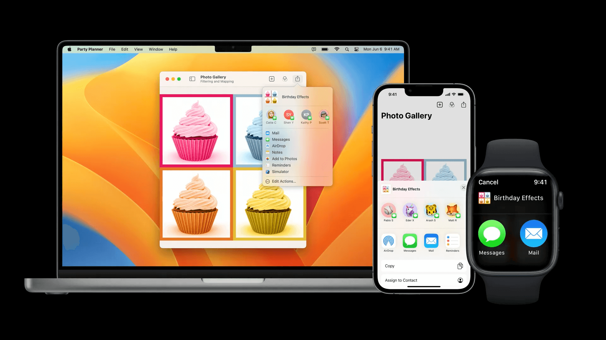

图中介绍了相同代码，在 iOS / watchOS/ macOS 中所呈现的不同形态。
分享是相互的，可以将数据向外分享，自然也可以从外部向 App 传递，与之对应的便是 `dropDestination` 来接受外部传入的数据，默认支持 `String, Data, URL, Attributed String, Image` 等类型的数据。

```swift
Gallery( ... )
    .dropDestination(
        payloadType: Image.self
    ) { receivedImage, location in
        image = receivedImage.first
        return !receivedImage.isEmpty
    }
```

其中 `payloadType` 为所接受的数据类型，方法闭包所跟随的闭包类型为 `([Transferable], CGPoint) async -> Bool`, 我们只需要获取到元组中第一个元素即可取得传递进来的数据。
从 API 可以看到，数据需要遵守 `Transferable`，其实只需要遵守此协议，自定义类型的数据也可以接受传递。
详情参照 [Meet Transferable](https://developer.apple.com/videos/play/wwdc2022/10062/)

介绍完分享功能，接下来介绍一下 SwiftUI 在图形和布局的更新。

## Graphics and layout

提到 Graphics，那必须先介绍一下 SF Symbol, 今年已经更新到 4.0 beta 版本。
SF Symbol 现在拥有 4000+ 的图标，可以和 Apple 的文字系统无缝集成，可以跟随 Dynamic Type 进行无损的放大缩小， 我们一些常用的图标，箭头，形状，天气，健康，媒体等均内置与系统中。
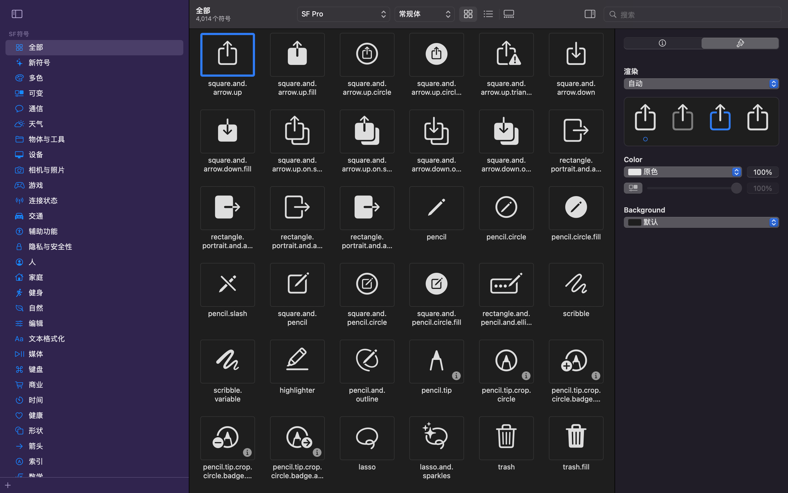
SF Symbol 有 Mac 版 App，需要的小伙伴可以自行[下载](https://developer.apple.com/sf-symbols/)。
在系统中使用 SF Symbol 只需要 使用 `Image(systemName: "SF Symbol Name")` 即可。
而今年对 SF Symbol 新增了阴影效果与渐变效果，代码如下。

```swift
struct CalendarIcon: View {
    var body: some View {
        VStack {
            Image(systemName: "calendar")
            Text("June 6")
        }
        .background(in: Circle().inset(by: -20))
        .backgroundStyle(.blue.gradient)
        .foregroundStyle(
            .white.shadow(.drop(radius:1, y: 1.5))
        )
        .padding(20)
    }
}
```

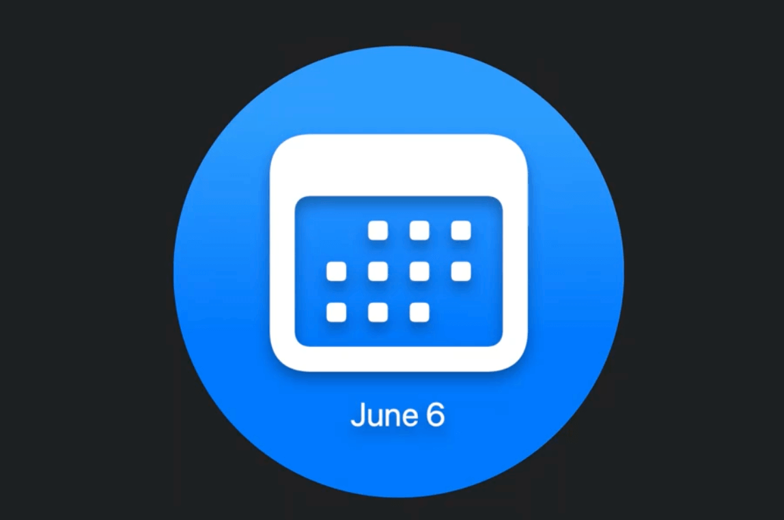
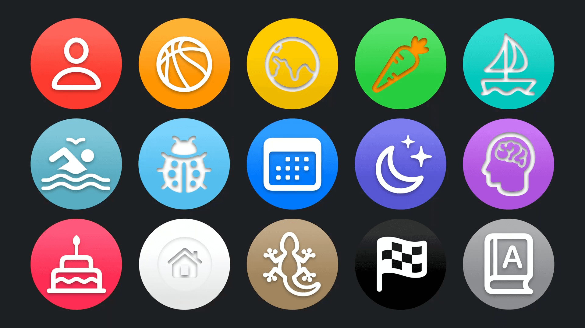

示例中蓝色的背景使用 `backgroundStyle` 带有了渐变效果，另外 SF Symbol 的图片也带有了阴影效果，这些都是新的 modifier，他们使图像更立体，更时尚，我们都知道苹果的设计，几乎引领了手机 UI 的设计，也许这种图像效果接下来就是所流行的。

说完图像，我们最后说说布局。

> Grid / Layout / ViewThatFits / AnyLayout

以前当我们使用 SwiftUI 进行瀑布流布局多时候，大都使用 `LazyVGrid` 与 `LazyHGrid`。可是它们无法随意的控制瀑布流中的每个元素大小和位置。几乎丧失以前在 UIKit 中自定义 `UICollectionViewFlowLayout` 的布局和动画效果。

好在今年一切都有了变化，我们先来介绍新的 `Grid`。

`Grid` 提供了一种新的布局方式，不再局限于 `LazyVGrid/LazyHGrid`，开放了 `GridRow` 与 `.gridCellColumns(count)`。

```swift
var body: some View {
    Grid {
        GridRow {
            NameHeadline()
                .gridCellColums(2)
        }
        GridRow {
            CalendarIcon()
            SymbolGrid()
        }
    }
}
```

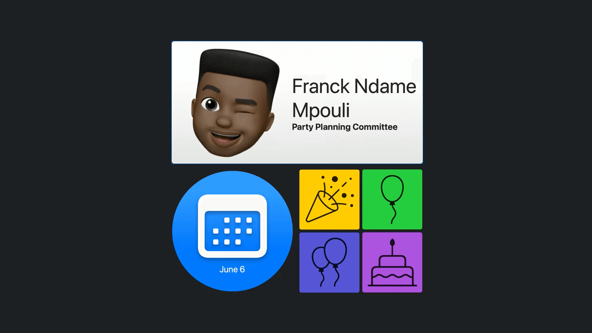
可以查看到代码中，任务头像与名字的 cell (NameHeadline)，占用两列 cell 宽度。
日历占用一个 cell（CalendarIcon）宽度，四种符号占用一个 cell (SymbolGrid) 的空间。
这种大小不相同布局，过去的 `LazyV/HGrid` 是无法直接做到。现在只需要几行就可以优雅设置，实在是太棒了。

如果有更复杂的需求，还可以自定义 `Layout`，与过去重写 `UICollectionFlowLayout` 比较接近, 遵守 `Layout` 协议， 提供每个元素所在位置，并且根据协议提供的子视图来返回父视图所需空间即可完成。

而新的 ViewThatFits API 就更有趣了，可以根据设备尺寸来自动代码中预设的布局方式。
如果想要手动控制或者切换布局，Apple 还提供了 AnyLayout 来进行支持动画的切换。
本文作为介绍文章就不一一详细介绍了。

其他 Layout 相关可以参考我们介绍布局的详细文章。
[在 SwiftUI 中组合各种自定义布局](https://xiaozhuanlan.com/topic/1507368249)

后续内容请持续关注我们，感谢大家的耐心阅读。
