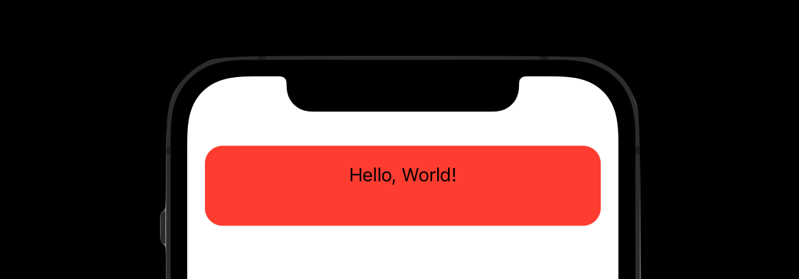
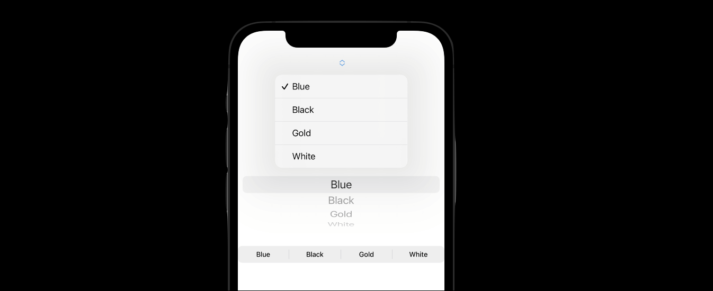
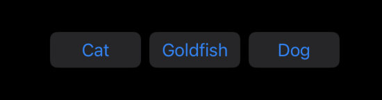

# Section 10052
# What's New In SwiftUI(WWDC22)

稍后了解完今年的新内容后如果想回顾去年的视频，传送门 [WWDC21 What's New in SwiftUI]() 。


今天很荣幸与大家分享 WWDC22 的 What's New in SwiftUI Session.
一起来看看今年又有哪些更新呢？在开始之前先让我们回忆一下 **去年的更新内容**。
1. SafeArea 内容，新增了 `.safeAreaInset` 来将任意 view 作为主 view 的 任意方向safeArea等.
2. List 增强， 包括 `.refreshable` 的下拉刷新能力， `searchable` 的搜索能力 `.swipeActions` 的 row 侧滑功能，以及一些小的UI调整，比如支持 `.listRowSeparator` 隐藏等。
3. Toobar 的增强，可以自定义 SwiftIUI 导航栏BarItem，自定义依附于键盘顶端的 view 等。
4. 新增了 `@FocusState` 关键字，手动控制 firstResponder 进行输入等操作。
5. 新增 `AsyncImage` 进行异步图片网络请求。
6. 增加了Text对于Mardown的支持等。


**而回到今年的 WWDC， 我们用一张图来完整展示今年SwiftUI的更新内容**


有没有发现特别感兴趣的主题，先别着急，我们分5大类来依次介绍一下。
* SwiftChart
* Navigation and windows
* Advanced controls
* Sharing
* Graphics and layout

---


### 1 首先是介绍一下重头戏 SwiftChart


上图看到的这些效果是 WWDC22，Apple 在介绍 Charts 时候所展示的效果，有没有很酷炫。
在iOS16以前当我们需要绘制图表的时候，开源图表库使用最多是 25.6k Star的danielgindi/Charts 。
支持常用的大部分图表，使用时候主要注意点在于xAsix与yAsix坐标设置，iOS部分使用 CoreGraphics 进行绘制，Android与iOS两套代码具有相同的API，很强大与便捷。
可惜对于 Accessibility 的支持有限，Dynamic Type 与 VoiceOver 等处理也非常复杂，这点还是 Apple 原生的 SwiftUI Chart 更胜一筹。
加上目前海外App，例如我司App主要所在的美国市场，有政策要求必须支持Accessibility，相信未来 SwiftUI Chart 对有海外需求的小伙伴也是有非常大的帮助的
  
今天先进行一些简单实用介绍，比如常见的柱状图/折线图/基准线等。

1.1 柱状图( `BarMark` )
```swift
Chart(partyTasksRemaining) { task in
    BarMark(
        x: .value("date", unit: .day),
        y: .value("Task Remaining", task.remainingCount)
    )
}
```

1.2 折线图( `LineMark` )
```swift
Chart(partyTasksRemaining) { task in
    LineMark(
        x: .value("date", unit: .day),
        y: .value("Task Remaining", task.remainingCount)
    )
    .foregroundStyle(byL .value("Category", task.category))
}
```

1.3 基准线( `RuleMark` )
甚至可以为其添加文字说明 `.annotation(...)` 。
```swift
Chart(partyTasksRemaining) { task in
    AnyCharts{ ... }
    RuleMark(y: .value("Value", 5))(
        .annotation(position: .top, alignment: .trailing) {
            VStack {
                Text("Today's Goal")
                Text("Status: ✔️")
            }
        }
    )
}
```
除此之外还可以进行图表的叠加，只需要合理操作 Chart 数据源，即可实现
```swift
Chart(date.source) { source in
    BarMark(x: .value("data", source.date, unit: .hour),                    
            y: .value("value", source.value))
            
    LineMark(x: .value("data", source.date, unit: .hour),
             y: .value("value", source.lineValue))
        .foregroundStyle(Color.red)
            
    RuleMark(y: .value("value", source.value))
}
```


---
上面是使用过原生API在10行左右即可实现的效果，对开发者真的非常友好，苹果之前在 iOS 内置的 Health app 中苹果开始大量使用图表，而现在开放成为开发者使用的framework。

这很 Apple，会借鉴很多开源库，了解解决开发者的需求。
比如早期 Apple 借鉴而推出的 UICollectionView，以及随着 Swift 推出的 Codable 等等，现在都在 iOS 开发领域抢夺了很多开源库的份额。

了解更多关于 Swift Charts 内容，请持续关注我们，后续我们也会更新 Charts 相关Session。
心急的小伙伴可以先查看WWDC以下两个 Session 的视频提前了解。

[Hello Swift Charts](https://developer.apple.com/videos/play/wwdc2022/10136/)
[SwiftCharts: Raise the bar](https://developer.apple.com/videos/play/wwdc2022/10137/)

介绍完 SwiftUI Charts， 让我们一起看看 SwiftUI 对导航栏和窗口进行的 API 更新。

### 2. Navigation and windows

SwiftUI刚推出时候，导航栏使用的是 `NavigationView` 与 `NavigationButton` 的组合来进行跳转，使用 `@Environment (\.presentationMode)` 环境变量进行 `pop/dismiss` 返回。

很快跳转下一层级所使用的 `NavigationButton` 就被 `NavigationLink` 所替代， 在iOS15中，返回页面所使用的 `\.presentationMode` 也被 `\.dismiss` 替代， 而在今年导航栏 `NavigationView` 也会被 `NavigationStack` 的替代。

不过这些只是 API 的改变，还是只能逐级页面跳转，我们无法方便操作导航栏堆栈，比如跳转多级页面后，直接返回中间的某一级别页面。
今年这个功能它来了～


2.1 NavigationStack

听名字就知道他终于开放导航栏堆栈了，这赋予了我们比过去更简洁优雅的跳转方式。
与过去 UIKit中 的`UINavigaitonViewController.viewControllers`类似。
下面是代码的例子。

```swift
NavigationStack {
    List(foodItem) { item in
        NavigationLink(value: item) {
            Label(item.title, image: item.icon)
        }
    }
    .navigationDestination(for: FoodItem) { item in
        FoodDetailView(item: item)
    }
}
```
在iOS16之前，我们只能使用`NavigationView`来包裹`NavigationLink`来让其跳转。
现在只需要将原本`NavigationView`所在位置替换为`NavigationStack`我们就获得了上面的一段代码，区别仅仅在于有了新的 modifier`.navigationDestination`可以统一处理跳转入口了，提升好像不明显啊， 我们期待的堆栈操作呢？
别急，看下一段代码。
```swift
@State private var selectedItems: [FoodItem] = []
NavigationStack(path: $selectedItems) {
    List(foodItem) { item in
        NavigationLink(value: item) {
            Label(item.title, image: item.icon)
        }
    }
    .navigationDestination(for: String.self) { item in
        FoodDetailView(text: item, path: $selectedItems)
    }
}
```
可以看到这段代码与上段代码多了个`path:`与一个`FoodItem`数组。
SwiftUI 作为响应式编程语言，`var selectedItems: [FoodItem]` 便是与导航栏堆栈双向绑定的数组，跳转方式没变，但是我们现在可以操作这个数组来控制导航栏堆栈了。
接下来看在二级页面`FoodDetailView`中具体操作堆栈的代码。
```swift
struct FoodDetailView: View {
    let item: foodItem
    @Binding var path: [FoodItem]

    var body: some View {
        Text(item.title)
            .onTapGesture {
                path.removeSubrange(1...) // 返回根视图
                // 对 path 数组操作即可改变导航栏堆栈
                // path.append(foodItem) 即可继续跳转
                // 如果使用String作为path即与URLRouter类似效果
            }
    }
}
```

二级页面只有一个 `Text` 文本，当点击文本时候，操作 `path` 数组即可做到代码注释所述功能，这也得益于 `@Binding` 与一级页面 `@State` 的数据绑定。
关于 navigation 详细内容可以参照 WWDC: [The SwiftUI cookbook for navigation](https://developer.apple.com/videos/play/wwdc2022/10054/)

既然说完了导航跳转，那就不得不也要提一下模态弹出页面的跳转方式。

2.2 `.presentationDetents`
在 SwiftUI 中常使用 `.sheet` 和 `.fullScreenCover` 等方式从底部弹出一个新的 View 。
不过这种弹出目前却有一个不足之处，无法让弹出的 View 顶部透明，继续显示底层 View 的一些细节， 而 UIKit 中 present 方法却可以做到。
这一遗憾今年终于也得以弥补，那就是新的 modifier，`.presentationDetents`。

```swift
    var body: some View {
        Text("Hello, World!")
            .onTapGesture {
                showBudget.toggle()
            }
            .sheet(isPresented: $showBudget, content: {
                BudgetView()
                    .ignoresSafeArea()
                    .presentationDetents([.large, .height(300)])
                    .presentationDragIndicator(.visible)
            })
    }
```
效果如图。


代码中 `presentationDetents` 跟随参数是一个集合，示例中设置为 `[.large, .height(300)]` ，所以gif演示中，可以做到两段滑动，分别处于300和全屏状态。

说完 iOS 上的各种跳转，让我们看看 iPad 上特有的一些组件。

2.2 NavigationSplitView

以前做过iPad适配的小伙伴应该对这个 Split 关键字并不陌生，提供了一个列表的分屏展示能力，在 UIKit 与之对应的组件有 `UISplitViewController`，而在 SwiftUI 的 AppKit 中有 `HSplitView` 。
现在 iPad 设备中，SwiftUI终于为我们提供了类似的Components。
这里不过多介绍了，直接上代码和图例。


`NavigationSplitView` 中 List 为左侧列表一级页面，而 `detail` 所展示为二级详情页面内容。同时 `NavigationSplitView` 还可以很好的支持 iPad 的多 App 分屏模式。

说了这么多都是 iOS 和 iPadOS 上的内容，接下来我们看看 Mac os 的多 window 更新。

2.3 mac 新 window 支持
之前使用 SwiftUI 来构建程序主页面时候，一般来说使用 `WindowGroup` ，可以生成多个窗口以允许对应用程序的数据进行不同的透视。
今年新增了 `Window` 容器，为 Mac 的 app 声明一个唯一的窗口，切支持快捷键打开，同时为其提供了较多的 modifier，例如默认大小/位置/可调整大小等等。
示例代码如下。
```swift
@main
struct PartyPlanner: App {
    var body: some Scene {
        WindowGroup("Party Planner") {
            TaskViewer()
        }
        Window("Party Budget", id: "budget") {
            BudgetView()
        }
        .keyboardShortcut("0") //快捷键支持 Command+0
        .defaultPosition(.topLeading)
        .defaultSize(width: 220, height: 250)
    }
}
```
示例中Window可以使用快捷键 Command + 0 单独唤醒，设置了默认尺寸与位置。
其使用场景更适合作为一个独立且较小的辅助来窗口使用。

当然 Mac os 的更新不止于此，SwiftUI 的能力也不限于一个平台，比如上段代码中的 `BudgetView` , 自定义的 SwiftUI View，也可以在不修改代码的情况下，跨平台的支持 iOS / iPadOS 等。

Mac os 除了新增独立辅助窗口外，也新增了 Menubar 组件，可以展示在系统桌面右上角的位置  `MenuBarExtra`。
话不多说，上代码～
```swift
@main
struct PartyPlanner: App {
    WindowGroup("Party Planner") { ... }
    MenuBarExtra("Bulletin Board", systemImage: "quote.bubble") {
        BulletinBoardView()
    }
    .menuBarExtraStyle(.window)
}
```


需要额外提一下的地方是， MenuBarExtra 可以独立运行， 也就是说 App 可以不唤醒 WindowGroup 甚至没有 代码中没有 WindowGroup ，而独立运行。

说了这么多，SwiftUI 对于跨平台的支持真是不遗余力，各位小伙伴要不要考虑在公司为技术发言为自己发言，将自己的 App 做成跨平台项目？

关于这方面的Xcode支持，可以参照以下视频，也可以持续关注我们后续相关专题更新。
[What's new in Xcode](https://developer.apple.com/videos/play/wwdc2022/110427/)
[Use Xcode to develop a multiplatform app](https://developer.apple.com/videos/play/wwdc2022/110371/)

刚刚我们介绍了一些跳转与窗口等， 接下来介绍一下对其中视图控制的提升。

> 3. 高级控制

3.1 Form
SwiftUI中的 `Form` 增加了新的style，当然 `Form` 会自动适配 iOS/iPadOS/Mac os。
```
Form {
    Section { 
        LabeledContent("Location") {
            AddressView(location)
        }
        DatePicker("Date", selection: $date)
    }
    Section { 
        Picker("Accent color", selection: $accent) { ... }
        Picker("Color scheme", selection: $scheme) { ... }
        Toggle(isOn: $extraGuests) {
            Text("Allow extra guests")
            Text("The more the merrier!")
        }
    }
}
.formStyle(.grouped)
```

图中可以看出，`formstyle` 对于 `Form` 的影响，这个例子中使用 `.grouped` 更佳合适。


3.2 Controls

3.2.1 ```.lineLimit```
这是一个对于```Text/TextField```等都有效的modifier。
```
Text("Hello World")
    .lineLimt(2...3)
    
TextField("Description", text: $description, axis: .vertical)
    .lineLimit(5...10)
```


这个modifier的存在可以解决过去SwiftUI对于垂直布局页面支持的不足。
比如有一个两列的```LazyVGrid```， 之前使用```.lineLimit(2)```， 由于服务器数据的不确定性，无法保证每个item的相同大小，需要进行额外的适配操作。
当然使用iOS16的```Grid``` + ```GridRwo```也可以避免这个问题，我们稍后进行介绍。

把之前不好的地方展示出来，这个坑如何解决。


3.2.2 MultiDatePicker 
日期选择器支持多选了。
```
@State private var activityDates: Set<DateComponents>

var body: some View {
    MultiDatePicker("Dates", selection: $activityDates)
}
```
如图所示


3.2.3 Mixed-state
我们可能有些情况需要控制一系列的toggles。更多转折。
> ```DisclosureGroup```可以将简单的进行toggle等的全选了。
```
DisclosureGroup {
    Toggle("Balloons", isOn: $includeBalloons)
    Toggle("Confetti", isOn: $includeConfetti)
    Toggle("Inflatables", isOn: $includeInflatables)
    Toggle("Party Horns", isOn: $includePartyHorns)    
} label: {
    Toggle("All Decorations", isOn: [
        $includeBalloons,
        $includeConfetti,
        $includeInflatables,
        $includePartyHorns
    ])
}
```

当然也可以对```DisclosureGroup```进行一定的自定义
```
struct MyDisclosureStyle: DisclosureGroupStyle {
    func makeBody(configuration: Configuration) -> some View {
        VStack {
            Button {
                withAnimation {
                    configuration.isExpanded.toggle()
                }
            } label: {
                HStack(alignment: .firstTextBaseline) {
                    configuration.label
                    Spacer()
                    Text(configuration.isExpanded ? "hide" : "show")
                        .foregroundColor(.accentColor)
                        .font(.caption.lowercaseSmallCaps())
                        .animation(nil, value: configuration.isExpanded)
                }    
                .contentShape(Rectangle())
            }
            .buttonStyle(.plain)
            if configuration.isExpanded {
                configuration.content
            }
        }
    }
}
```
> DisclosureGroup也可以用在Picker上但是只能用在MacOS上， 对于iOS和iPadOS则只有其他风格可选。
> ```Picker```也支持与```DisclosureGroup```类似的组合多选方式，不过仅仅MacOS可用。
```
@Binding var selectedDecorations: [Decoration]

var themes: [Binding<Theme>] {
    selectedDecorations.lazy.map(\.theme)
}

var body: some View {
    Picker("Decoration Theme", selection: $themes) {
        Text("Blue").tag(Theme.blue)
        Text("Black").tag(Theme.black)
        Text("Gold").tag(Theme.gold)
        Text("White").tag(Theme.white)
    }
    .pickerStyle(.radioGroup)
}
```
除了```.radioGroup```（仅MacOS可用） style以外还有```.inline/.wheel/.menu/.segmented/.automatic```等风格，大家可以多多尝试。



> .toggleStyle
> 
对于多选Button也提供了一种使用Toggle的新方式。
```
@State private var useSwiftHashtag = false
@State private var usePartyHashtag = false
@State private var useChartsHashtag = false
@State private var useOMTHHashtag = false
    
var body: some View {
    VStack(alignment: .leading) {
        HStack {
            Toggle("#Swiftastic", isOn: $useSwiftHashtag)
            Toggle("#WWParty", isOn: $usePartyHashtag)
        }
        HStack {
            Toggle("#OffTheCharts", isOn: $useChartsHashtag)
            Toggle("#OneMoreThing", isOn: $useOMTHHashtag)
        }
    }
    .padding()
    .toggleStyle(.button)
    .buttonStyle(.bordered)
}
```
.png)

除此之外Menu/Picker也有各自的组合style。

> ```Stepper```

```Stepper```新增```format```， 支持number/百分比等13种类型。
且自动适配MacOS支持数字填写，iOS为+-按钮，watchOS也有对应适配。
```
Stepper(value: $value,
        step: step,
        format: .number) {
    Text("Current value: \(value), step: \(step)")
}
```
3.3 Table
MacOS之前推出的Table，现在在iPadOS/iOS中也可以使用，方便快捷的创建多列列表。
只是在iOS中会默认只显示首列`TableColumn`，在iPad和Mac中效果会更好。
也提供了`contextMenu`的点击事件响应。
```
@State private var attendees: [Attendee]

var body: some View {
    Table(attendees) {
        TableColumn("Name") { attendee in
            AttendeeRow(attendee)
        }
        TableColumn("City", value: \.city)
        TableColumn("Status") { attendee in
            StatusRow(attendee)
        }
    }
}

var body: some View {
    Table(attendees, selection: $selection) {
        ...
    }
    .contextMenu(forSelectionType: Attendee.ID.self){ selection in
        if selection.isEmpty {
            Button("New Invitation") { addInvition() }
        } else if 1 == section.count {
            Button("Mark as VIP") { markVIPs(selection) }
        }
        ...
    }
}
```


对于iPadOS的`.toobar`也进行了一些加强。
.toobar 的问题在于。

```
Table(attendees, selection: $selection) {
    ...
}
.toolbar(id: "invitations") {
    ToolbarItem(id: "new", placement: .secondaryAction) {
        Button(action: sendNewInvitation) {
            Label("New Invitation", systemImage: "envelope")
        }
    }
}
```

Table同时也支持iOS15为List推出的```.searchable```， 甚至可以分```scope```进行范围搜索。
更多详情可以参考WWDC
[SwiftUI on iPad: Organize your interface](https://developer.apple.com/videos/play/wwdc2022/10058/)
[SwiftUI on iPad: Add toobars, titles, and more](https://developer.apple.com/videos/play/wwdc2022/110343/)
[What's new in iPad app design](https://developer.apple.com/videos/play/wwdc2022/10009/)
[SwiftUI on the Mac: Build the fundamentals](https://developer.apple.com/videos/play/wwdc2021/10062/)

说完新的，让我们看一下新的API更新。（转折润色）
> 4. Sharing
新推出了```ShareLink``` API，方便唤起系统UI进行数据向外部的分享
以前Watch不可以。

```
Gallery( ... )
    .toobar {
        ShareLink(
            item: image,
            preview: SharePreview("Birthday Effects")
        )
    }
```


与之对应，也有从外部向App传递数据的API。
```
Gallery( ... )
    .dropDestination(
        payloadType: Image.self
    ) { receivedImage, location in
        image = receivedImage.first
        return !receivedImage.isEmpty
    }
```
数据传递默认可以支持如下类型
```String, Data, URL, Attributed String, Image```.
如果想要更多数据类型，可以遵守```Transferable```协议进行自定义。
```
struct BirthdayFilter: Codable {
    ...
}

extension BirthdayFilter: Transferable {
    static var representation: some TransferRepresentation {
        CodableRepresentation(contentType: .birthdayFilter)
    }
}

```
详情参照 [Meet Transferable](https://developer.apple.com/videos/play/wwdc2022/10062/)

##### Graphics and layout
介绍SF symbol（），扩展SF Symbol字体让普通图片也可以，但是Shadows不足了。

获得更惊艳的UI效果，配合SF Symbol效果更佳。
示例中蓝色的背景使用```backgroundStyle```带有了渐变效果，而SF Symbol/Text 则带有了阴影效果，这些新的modifier为编程带来了很多便利。
同时也都适配了动画。
```
struct CalendarIcon: View {
    var body: some View {
        VStack {
            Image(systemName: "calendar")
            Text("June 6")
        }
        .background(in: Circle().inset(by: -20))
        .backgroundStyle(.blue.gradient)
        .foregroundStyle(
            .white.shadow(.drop(radius:1, y: 1.5))
        )
        .padding(20)
    }
}
```


##### Grid / Layout / ViewThatFits / AnyLayout
先说明原来的不足。幸运的

```Grid```提供了一种新的Layout方式，不再局限于```LazyVGrid/LazyHGrid```，开放了GridRow与```.gridCellColumns(count)```。
```swift
var body: some View {
    Grid {
        GridRow {
            NameHeadline()
                .gridCellColums(2)
        }
        GridRow {
            CalendarIcon()
            SymbolGrid()
        }
    }
}
```


列举一下剩下的Modifier
.gridCellColumns(Int) 可以规定某个item所占用是几倍cell空间。
.gridCellAnchor(UnitPoint) 可以layout所占用空间的位置
除此之外还有
.gridColumnAlignment(HorizontalAlignment)
.gridCellUnsizedAxes(Axis.Set)
让layout更自由。


至于新增的Layout协议，是继承自Animatable，与UIKit中的UICollectionFlowLayout有相似的地方。
作为先导篇我们简单介绍其中两个方法，
```
func sizeThatFits(proposal: ProposedViewSize, subviews: Self.Subviews, cache: inout Self.Cache) -> CGSize

func placeSubviews(in bounds: CGRect, proposal: ProposedViewSize, subviews: Self.Subviews, cache: inout Self.Cache)
```

sizeThatFits的功能在于可以手动根据容器(Stack/Grid)内子试图，来自定义的调整容器的size。
方法中包含了subviews属性来描述容器内的子试图，例如VStack中的每一行， 而proposal参数描述容器原始的建议尺寸。
比如我们在HStack中放置3个button，如果button的文字长度不同，则无法做到每个button宽度相同的效果，这时候可以考虑使用Layout协议。
思路是获取HStack中button宽度最大的元素，然后调整HStack宽度为3*最大宽度

```
func sizeThatFits(
        proposal: ProposedViewSize,
        subviews: Subviews,
        cache: inout Void
    ) -> CGSize {
        guard !subviews.isEmpty else { return .zero }

        let maxSize = maxSize(subviews: subviews)
        let spacing = spacing(subviews: subviews)
        let totalSpacing = spacing.reduce(0) { $0 + $1 }

        return CGSize(
            width: maxSize.width * CGFloat(subviews.count) + totalSpacing,
            height: maxSize.height)
}
```
对于容器调整完毕，很显然我们接下来该调整subviews了。
便是利用placeSubviews方法，描述的是每个subview所处位置与size，思路如下。

```
func placeSubviews(
    in bounds: CGRect,
    proposal: ProposedViewSize,
    subviews: Subviews,
    cache: inout Void) {
    
    guard !subviews.isEmpty else { return }

    let maxSize = maxSize(subviews: subviews)
    let spacing = spacing(subviews: subviews)

    let placementProposal = ProposedViewSize(width: maxSize.width, height: maxSize.height)
    var nextX = bounds.minX + maxSize.width / 2

    for index in subviews.indices {
        subviews[index].place(
            at: CGPoint(x: nextX, y: bounds.midY),
            anchor: .center,
            proposal: placementProposal)
        nextX += maxSize.width + spacing[index]
    }
}
```
补充一下自定义的maxSize和spacing方法代码
```
func maxSize(subviews: Subviews) -> CGSize {
    let subviewSizes = subviews.map { $0.sizeThatFits(.unspecified) }
    let maxSize: CGSize = subviewSizes.reduce(.zero) { currentMax, subviewSize in
        CGSize(
            width: max(currentMax.width, subviewSize.width),
            height: max(currentMax.height, subviewSize.height))
    }

    return maxSize
}
 
func spacing(subviews: Subviews) -> [CGFloat] {
    subviews.indices.map { index in
        guard index < subviews.count - 1 else { return 0 }
        return subviews[index].spacing.distance(
            to: subviews[index + 1].spacing,
            along: .horizontal)
    }
}
```

我们如果将Layout的代码整合起来，便得到了一个相同宽度的Stack，暂时命名为MyEqualWidth**H**Stack。
我们如果以相同思路进行设计，也可以得到一个MyEqualWidth**V**Stack。
由此我们引入我们下一个介绍的方法，ViewThatFits使用合适布局的方法。

比如一种场景，MyEqualWidth**H**Stack容器中的元素无法水平容纳会超出屏幕，比如调整了Accessibility的字体大小，为了适配我们需要切换到MyEqualWidth**V**Stack，水平布局buttons的情况，没错该ViewThatFits出场了。
```
struct ViewThatFits<Content> : View where Content : View { ... }
```

```
struct ButtonStack: View {
    var body: some View {
        ViewThatFits { // Choose the first view that fits.
            MyEqualWidthHStack { // Arrange horizontally if it fits...
                Buttons()
            }
            MyEqualWidthVStack { // ...or vertically, otherwise.
                Buttons()
            }
        }
    }
}
```
这样我们可以让程序自动选择适合的Layout模式。
如果程序可以根据适配情况自动选择，那么很显然我们也可以有很多方式进行手动切换。
比如AnyLayout
```
var body: some View {
    let layout = alwaysVLayout ? AnyLayout(HStack()) : AnyLayout(VStack())
    layout {
        Buttons()
    }
    .animation(.default)
    ...
    // alwaysVLayout.toggle()
}
```


其他Layout相关可以参考相关Session，我们之后也会进一步更新。
[Compose custom layouts with SwiftUI](https://developer.apple.com/videos/play/wwdc2022/10056/)

后续内容请持续关注我们，感谢大家的耐心阅读。