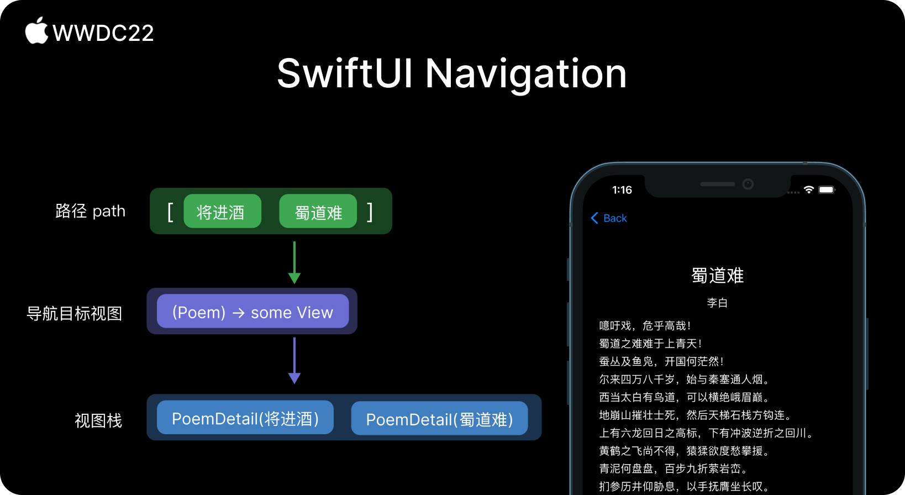

ps. 这里补充其他信息。请严格按照以下格式填写。

## 个人介绍

zddhub(张东东)，iOS 开发，开源爱好者。

## 审核介绍

Jake Lin, 在 REA Group 担任 Senior Mobile Tech Lead，负责公司的移动研发和团队建设。喜欢研究 iOS 和 Android 两平台的架构，爱折腾声明式 UI 和相应式编程范式。并编写了 [iOS 开发进阶](https://t2.lagounews.com/lR59RGRBct5E3) 课程。

## 不超过 120 个字的文章简介

这篇文章详细讲述了 SwiftUI 现有导航方案的不足，以及新方案的解决方案，并给出了一些新方案的适用场景和建议。全文通过一个真实的例子，来展示、验证文中提到的技术。

## 公众号/小专栏图文头图

