# WWDC22 10056 - 在 SwiftUI 中组合各种自定义布局

本文是根据 WWDC22 中的 [Compose custom layouts with SwiftUI](https://developer.apple.com/videos/play/wwdc2022/10056/) 撰写。

## 一段话总结

- `SwiftUI` 已经为开发者提供包含 `Text`、`Images`、`Graphics` 等元素的内置视图，并且可以通过他们来创建自定义的复合视图。今年的 `SwiftUI` 提供了新的布局工具，以便开发者可以更加灵活的将视图元素进行排列组合。接下来会从一些实际的场景出发，让我们一起探讨在不同的需求下，该如何选择最合适的布局工具。
- 笔者也会结合自己的实际使用，说下自己对于新的 `SwiftUI API` 的理解和思考。

## 内容概览

- 【简单】场景一：介绍一名 `Grid` 家族的新成员，它非常适合实现二维布局中的静态视图。
- 【中等】场景二：讨论如何使用新的布局接口创建自定义的 `SwiftUI` 容器类型。
  - 在场景二中穿插介绍了一个新的接口 `ViewThatFits`, 使用它可以根据屏幕空间选择容器集合里最合适的容器。
- 【困难】基于场景二：苹果给出了关于避免滥用 `GeometryReader` 的建议和 `Layout` API 的解读, 笔者会结合实际谈谈对 `GeometryReader` 的看法。
- 【简单】场景三：展示了如何使用 `AnyLayout` 在不同的布局类型之间平滑的过渡。

## 场景一：Grid

本小节会介绍容器视图家族的新成员 - `Grid`, 如果对于 `Grid` 还不了解的小伙伴，可以先参阅 WWDC20 [SwiftUI 中的 Stacks, Grids, 和 Outlines](https://developer.apple.com/videos/play/wwdc2020/10031), 先对 `Grids` 有个基本了解。

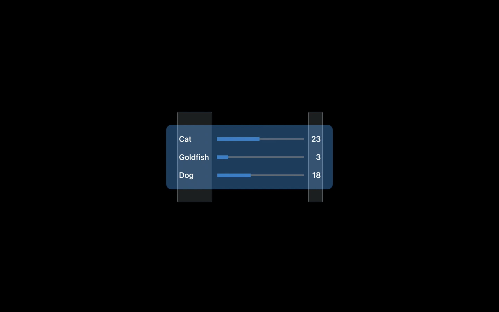

- 如上图，需求一：第一和第三列的宽度取决于它们所在行内容最大的宽度。因为我们希望在其他内容显示不受影响的情况下，第二列中表示百分比进度的视图能够尽可能地获得更多的空间。

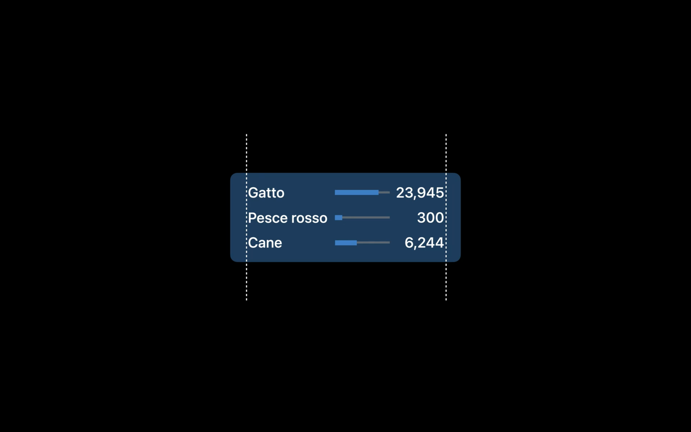

- 如上图，需求二：第一列名称文本左对齐；第三列的数量文本右对齐。

- 需求三：每行之间加一个横跨三列内容的分割线进行分隔。

### 接下来我们先来看下第一个需求的分析和实现

首先我们看看现有用于实现二维网格的组件 - `LazyVGrid/LazyHGrid`，它们非常适合可滚动的内容。

**我们可以用它们来方便地实现这个需求吗？**

答案是否定的，虽然我们可以用它们来实现二维网格，但是因为它们只加载可见或即将可见的视图，这意味着容器不能在两个维度自动的调整单元格的尺寸。

以 `LazyHGrid` 为例，它可以计算出每列的宽度，因为它可以在绘制之前测量列中的所有视图。但是因为视图不能一次全部加载的原因，它不能测量一行中的每个视图的高度，自然而然也无法得知行的最高的高度是多少。如果要想达到这个目的，需要在 `LazyVGrid/LazyHGrid` 初始化前将所有相关的尺寸信息算好。

**我们可以使用 `VStack` 嵌套 `HStack` 的方式来方便地实现这个需求吗？**

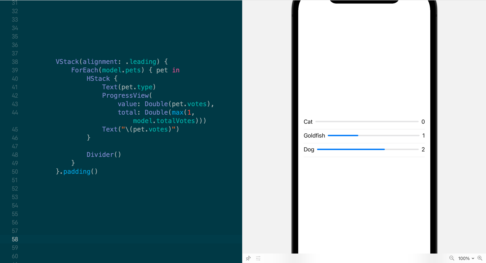

答案也是否定的，如上图，因为每一行中第一列和第三列的文字内容不可能宽度都完全是一致的，这会导致第二列的百分比视图长短不一。如果要使宽度一致，也还是需要在初始化前将所有的相关的尺寸信息算好。

**那我们有更好的选择吗？**

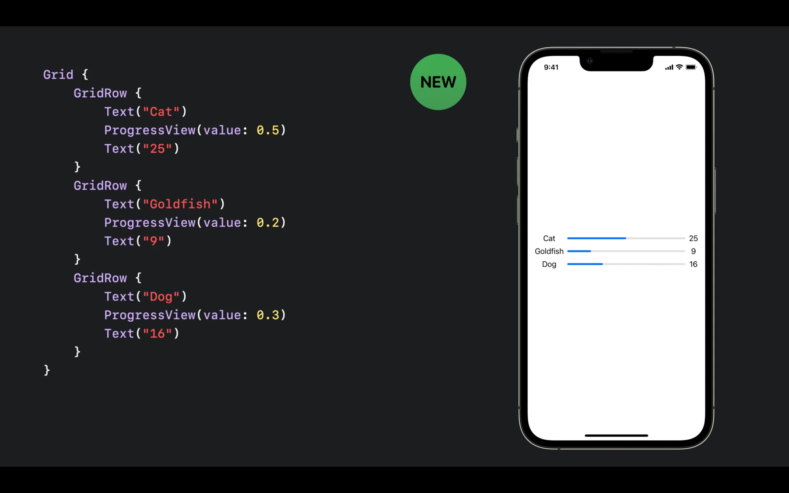

有的，如上图。`SwiftUI` 为开发者提供了一个新的 `Grid` 视图，与惰性网格不同，`Grid` 一次加载其所有视图，因此它可以自动调整其单元格的大小来自动对齐其所在的列和行。

而且第二列表示百分比的视图是等宽的，说明了第一和第三列的宽度与它们在每种情况下容纳最宽的那行一样宽。

现在第一个需求就这样被完成了，在进入第二个需求之前, 我们先创建一个基本数据模型，让其在某个地方存储投票数等信息。这样我们可以在 `ForEach` 中创建每一行的 `GirdRow` 。

### 一切准备就绪让我们来看下第二个需求的分析和实现

现在，所有单元格都居中对齐，这是 `Grid` 的默认设置，现在我们来看下如何让第一列名称文本左对齐；第三列的数量文本右对齐。

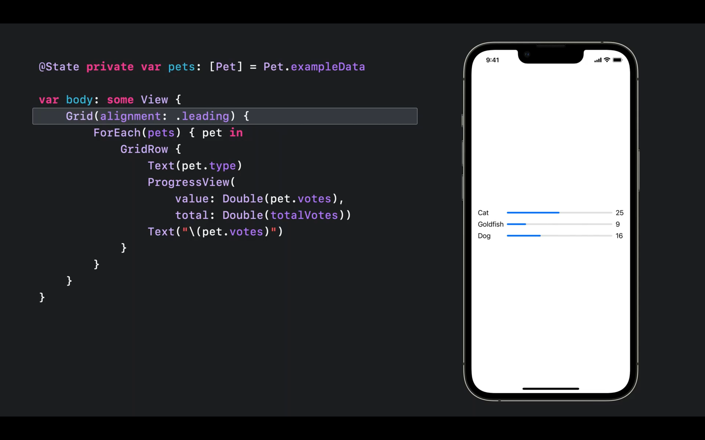

首先，如上图，我们使用 `alignment` 来初始化 `Grid` 。在这里使用的值 `.leading` 适用于 `Grid` 中的所有单元格，现在前两列看起来已经满足我们了。

**但最后一列呢？我们希望的是让它右对齐。**

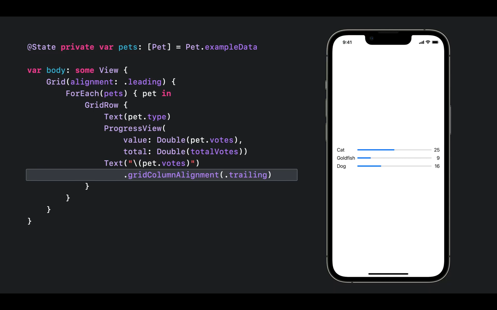

为了改变单个列的对齐，`Grid` 提供了一个叫 `gridColumnAlignment` 视图修饰器,它会用该列中的每个单元格生效。因此，我们可以在第三列文本视图上使用这个视图修饰器，传入 `.trailing`, 效果如上图所示。现在第二个需求也被轻松的完成了。

### 接下来让我们来看下第三个需求的分析和实现

**现在我们得到了一个还不错的效果，但是每行之间可以加一条分隔线吗？**

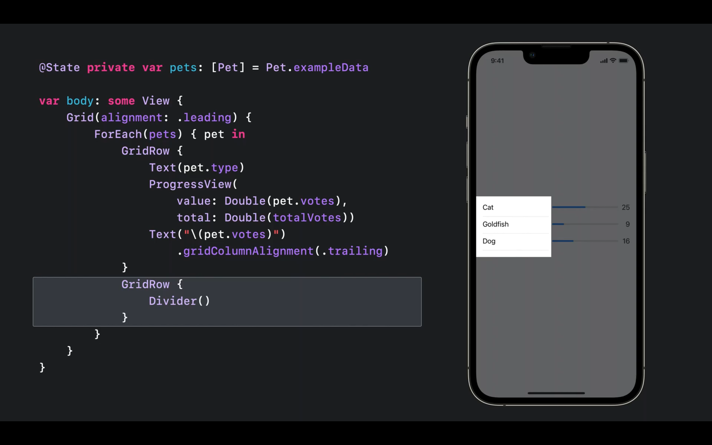

如上图，我们按照我们通常会按照 `VStack` 这种单一维度容器视图的思路来，尝试在 `Grid` 中添加一个新的 `GridRow` 里面包含一个 `Divider()`。但是这种方式在二维视图里面没有按照预期的方式工作。

首先，因为分隔线是一个灵活的视图，它导致第一列占用更多空间。简单说就是，Grid 现在为第三列提供内容所需的宽度，并在前两列之间平均划分剩余空间。

其次，第一个 `GridRow` 有三个视图而第二个 `GridRow` 只有一个 `Divider` 视图，在第二个 `GridRow` 中缺少的视图只会在后面的每列中创建空单元格来代替。

**但我们真正想要的是让分隔线跨越 `Grid` 的所有列，有什么办法可以让我们做到这一点呢？**

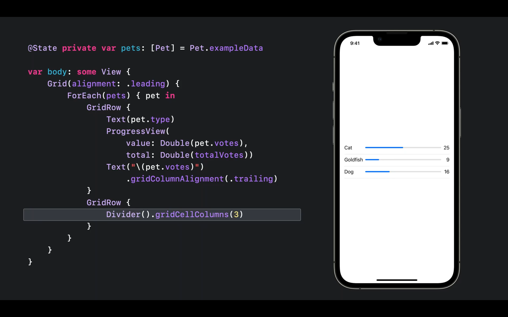

如上图所示，在这里 `Grid` 提供了一个新的视图修改器 `gridCellColumns`, 他可以让单个视图跨越一定数量的列，在这个需求中我们传入 3 使分隔线跨越了所有列。并且这里还提供了一个简单的写法，我们去掉 `GridRow`, 保留 `Divider()`, 分割线会默认跨越所有的列。

## 场景二：Layout & ViewThatFits

本小节会分为三个部分讨论如何使用新的布局接口创建自定义的 SwiftUI 容器类型，在阅读本小节需要小伙伴掌握 SwiftUI 基础的布局知识，如果还不了解的，可以先参阅 WWDC19 [在 SwiftUI 中创建自定义视图](https://developer.apple.com/videos/play/wwdc2019/237)。

### 第一部分：自定义布局投票按钮组件

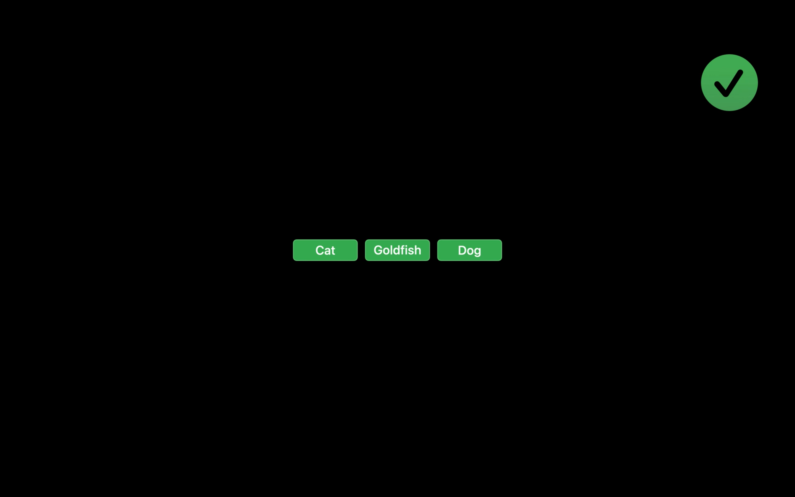

如上图，需求是所有按钮的宽度与最宽的那个按钮保持一致。

**乍一看，这是一个平平无奇的需求，那么我们使用 Hstack 构建它会发生什么？**

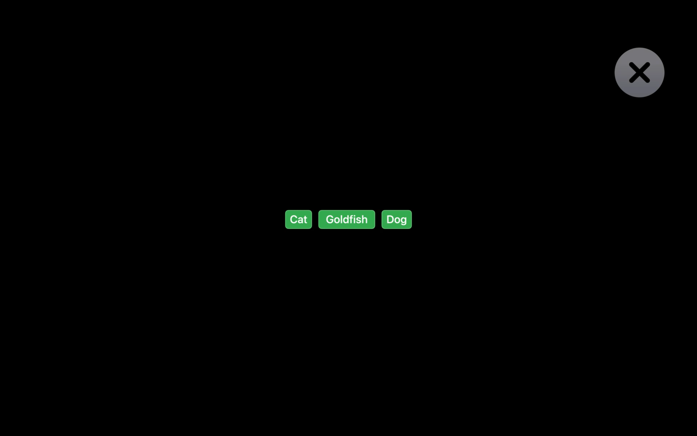

如上图，我们可以发现每个按钮都会自动调整大小以适合其文本的内容，并且 `HStack` 将它们水平地排列在一起。在很多情况下，这种默认的行为正是我们想要的，但它并不完全符合我对这个项目的预期。

**让我们看看这个视图层次结构以及布局流程，看看我们可以更改哪些内容以获得我想要的行为呢?**

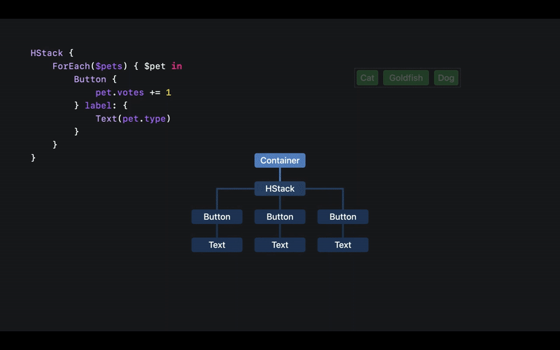

如上图，首先，HStack 的容器向 HStack 传入一个大小（笔者注，大家可以想象下在 iPhone 与 iPad 上的这个容器的差别），在这个基础上，HStack 为它包含的三个 Button 提供了一个 `ProposedSize`。然后每个按钮将该大小传入给它的 `Text`。

`Text` 计算它们实际需要的大小，这取决于它们包含的字符串，并将其大小上报给 `Button`。然后 `Button` 又把大小往上层视图传递，`HStack` 使用此信息自行调整大小，将 `Button` 放置在其空间中，然后将自己的大小上报给容器。

**如果我将每个 Text 包装在一个 Flexible Frame 中并让它可以随意增长，是不是可以达到我们想要的效果呢？**

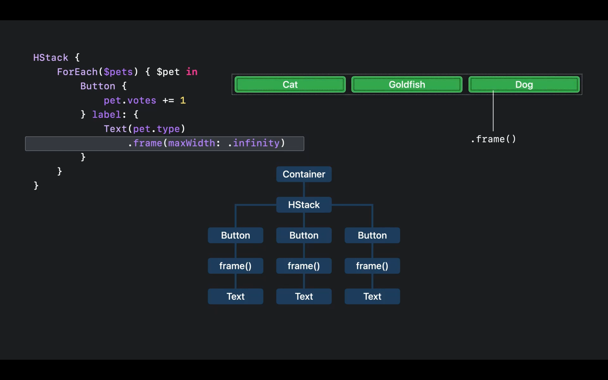

如上图，我们通过一个视图修改器 `.frame(maxWidth: .infinity)` 实现了它。现在每个 `Button` 变成了等宽的效果，但是这并没有完全符合我们的预期，当屏幕容器变成 iPad 和 Mac 上，这个视图会撑满整个屏幕，显得十分的拥挤。

**那我们能否实现一个自定义的布局容器 EqualWidthHStack ，来 100%的满足我们的需求呢？**

可以的，`SwiftUI` 提供了一组新的 `Layout` 协议，该协议提供了两个核心接口 `sizeThatFits` 和 `placeSubviews`，使得我们可以直接来控制上报给容器的大小和每个子视图的位置与大小。

接下来让我一起来看下具体实现。

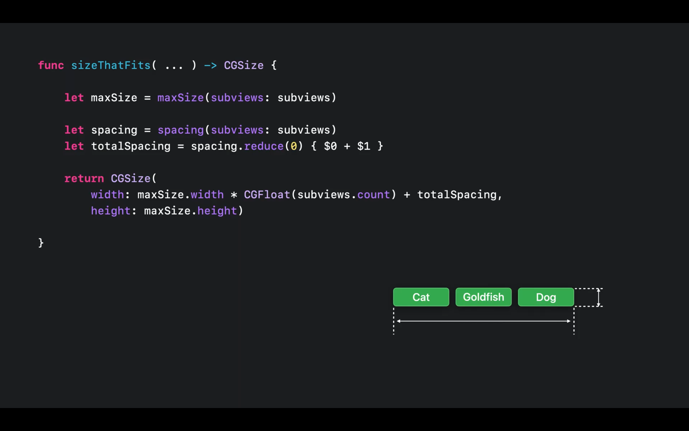

- 如上图，接口提供了 `subviews` 参数，我们不可以直接修改它，但是可以获取到它们的相关信息，比如它们的 `sizeThatFits` 。
- 遍历所有的子视图，找出宽度最宽的子视图，拿到它的大小。在示例中，最宽的子视图是 `Goldfish` 。
- 确定每个子视图之间的间距，并将所有的间距相加。在示例中，通过下面代码块拿到了 SwiftUI 默认的间距，当然也可以根据自己的需要自定义间距的值。

```
private func spacing(subviews: Subviews) -> [CGFloat] {
    subviews.indices.map { index in
        guard index < subviews.count - 1 else { return 0 }
        return subviews[index].spacing.distance(
            to: subviews[index + 1].spacing,
            along: .horizontal)
    }
}
```

- 因为我们在自定义的是一个横向的布局容器，所以无需重新计算高度，只要使用子视图的高度即可。
- EqualWidthHStack 宽度等于最宽的子视图的宽度乘以子视图的数量，加上总间距。
- 最终把得到的理想大小上报给容器视图。

**容器视图的大小确定了，那子视图的位置和大小又要怎么确定呢？**

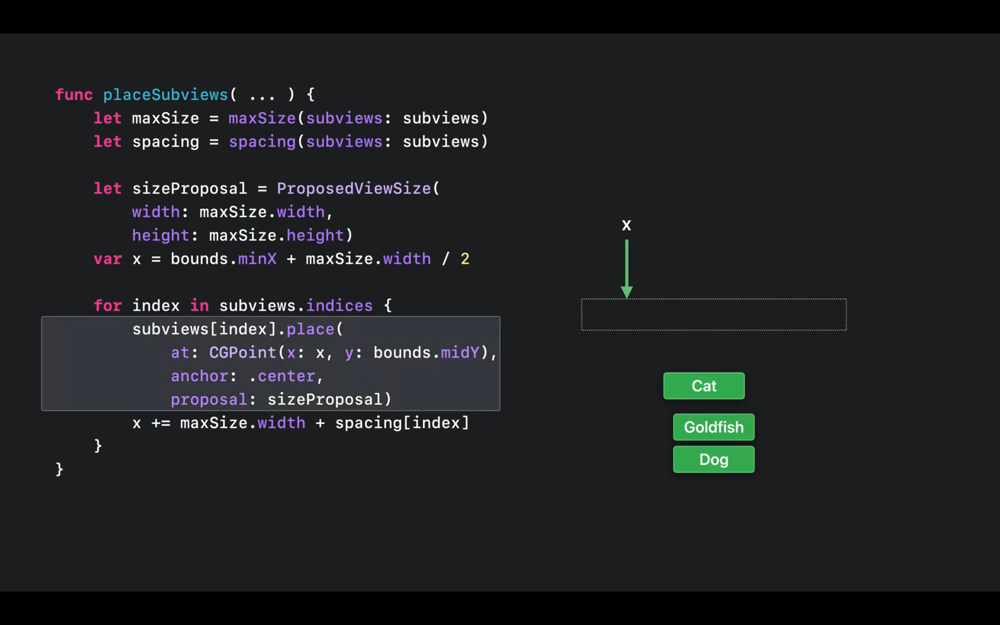

- 如上图，像上个接口中的实现一样，先通过计算得到宽度最宽的子视图的大小，每个子视图之间的间距。
- 确定每个子视图的大小都与宽度最宽的子视图的大小一致。
- 接口提供了 `bounds`，使得我们可以找到子视图在容器试图上的起始位置。在示例中，子视图需要从左往右依次排列，所以以 `bounds.minX` 来计算每个子视图的起始位置。
- 最后通过遍历所有的子视图，给每一个子视图位置、大小信息。

最终我们终于得到了我们预期的效果。

但是因为我们在自定义布局当中给子视图提供的都是理想大小，Button 的大小只取决于它们包含的文本的宽度，并不会去考虑屏幕空间。当被设置为超大字体时，它们并不会折行，而是会直接超出屏幕的显示区域。

### 第二部分：根据屏幕空间选择容器集合里最合适的容器

**可以不可以有什么智能的方式，在合适屏幕空间选择合适的布局容器呢？**

在这里，SwiftUI 提供了新的布局容器选择器 ViewThatFits，我们可以把它当做一个容器视图的集合，它可以自动选择合适的容器视图来适配屏幕的空间。

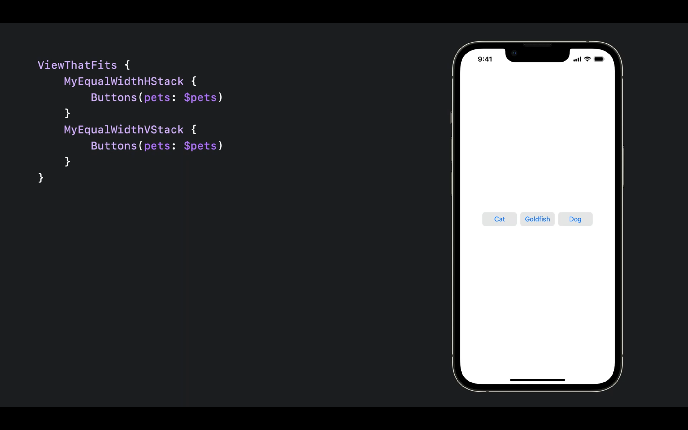

如上图，在屏幕宽度足够的情况下，选择第一个自定义的容器视图。

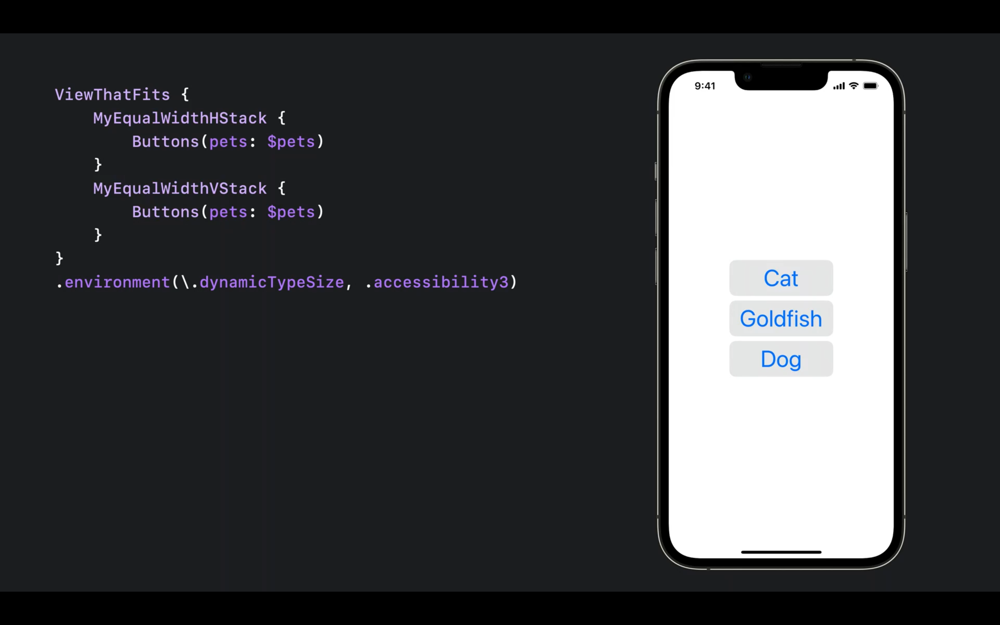

如上图，在屏幕宽度不足以展示第一个自定义容器视图的情况下，选择第二个。

下面有两个思考题，大家感兴趣的话可以思考并自己动手尝试下。

- 思考题一，如果屏幕尺寸都不足够的情况下，会选择哪个容器视图呢？
- 思考题二，我们是否能直接在 `sizeThatFits` 中，根据比较 `ProposedSize` 和上报给容器视图的大小，来实现类似的逻辑吗？

### 第三部分：自定义排名布局组件

最后我们需要来实现我们的宠物排名组件。

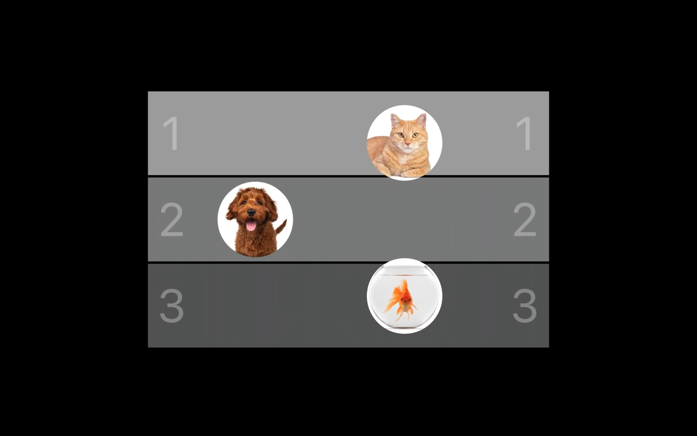

如上图，我们这次玩的更有难度一点，新的需求是以圆形排列绘制视图，然后根据排名旋转排列。

- 首先，我们的新的布局容器 `MyRadialLayout` 要尽可能的填充到这个屏幕空间，所以我们使用 `replacingUnspecifiedDimensions()` 将 `sizeThatFits` 中的 `ProposedSize` 转化成 `CGSize` 并上报给容器视图。

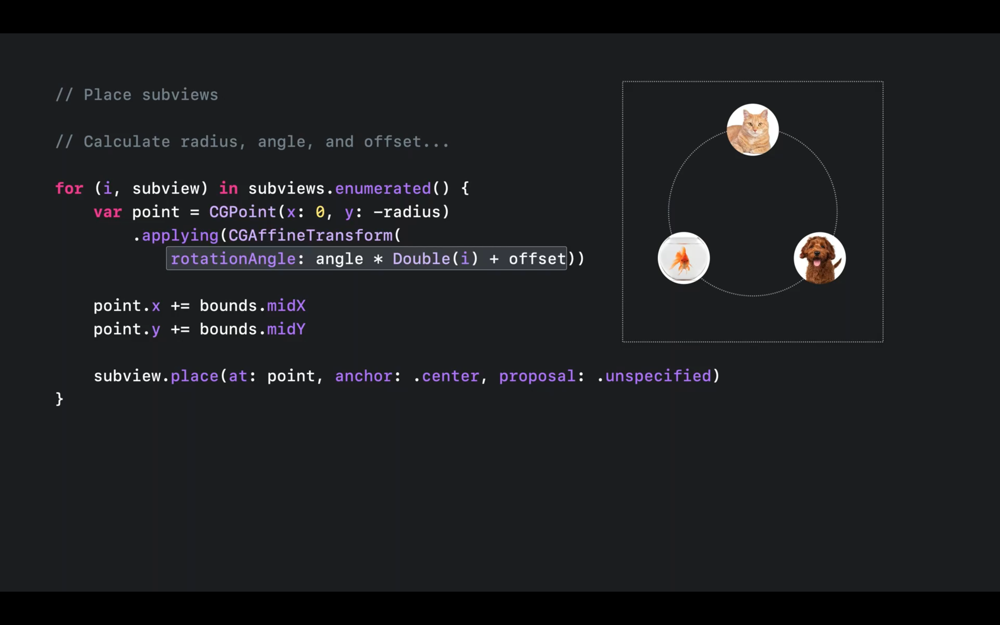

- 然后如上图，将一个可以旋转的环形向量放到视图的中间，并根据子视图的所有可能的坐标设置夹角。
- 根据每个宠物实际的投票数设置偏移量，最终每个子视图得到它们的位置。

**宠物的投票数和排名是不断变化的，那我们如何在 `sizeThatFits` 和 `placeSubviews` 协议实现中获取这些值并更新视图呢？**

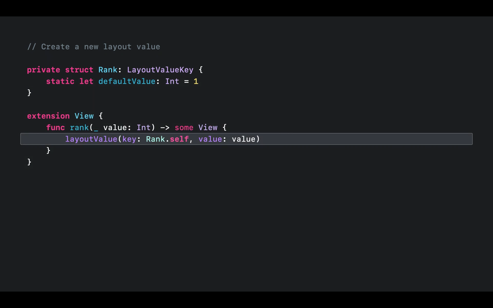

- 如上图，我们可以通过使用协议 `LayoutValueKey` 并且通过在 `layout(key: value:)` 中监听宠物排名的数据，可以实现在 `placeSubviews` 时读取每个宠物的排名值以计算它们的偏移量。

现在我们得到了一个，可以根据排名信息不断地调整宠物头像位置的 `MyRadialLayout` 。

## 场景三：AnyLayout

最后一个小节就比较简单了，主要介绍如何使用 AnyLayout 来让同一个视图的不同布局切换时平滑过渡。使用 `AnyLayout` 可以避免重新创建一个新的视图，这样过渡动画也会十分的自然，如果还想要有更多相关内容，可以参阅 WWDC19 [揭秘 SwiftUI](https://developer.apple.com/videos/play/wwdc2021/10022/) 最开始关于 `View Identity` 的相关内容。

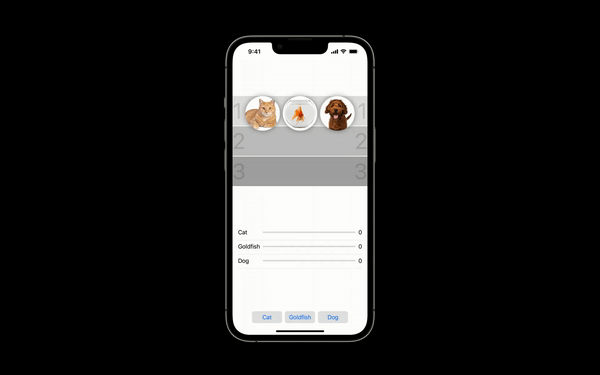

如上图，需求是宠物头像从开始的 `HStack` 切换到自定义的 `MyRadialLayout` 时，可以有平滑的过渡动画。

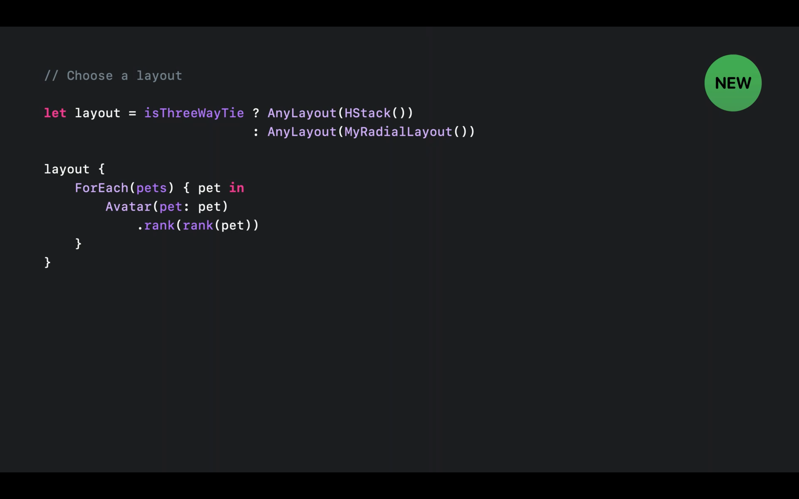

如上图，使用 `AnyLayout` 类型允许我们将不同的布局应用于单个视图层次结构，以便保持 `View Identity` 从一种布局类型转换到另一种布局类型时是一致的。

因为 `isThreeWayTie` 属性是从 `state` 派生的，所以 SwiftUI 会在它发生变化时注意到它并识别出它需要重绘这个视图。但是由于视图层次结构 `Identity` 始终保持不变，`SwiftUI` 将其视为一个变化的视图，而不是一个新的视图。结果只需要多写一行代码，我们就可以在布局类型之间创建平滑的过渡。

我们终于完成了所有的需求。接下来让我们聊聊在 `SwiftUI Layout` 有哪些需要注意的事项📢和一些扩展知识。

## 基于场景二：苹果开发工程师的建议以及笔者的一些个人理解

如果还没有了解过 [GeometryReader, View Preferences](https://vimeo.com/479376622) 的同学，这个视频里面有非常详细的背景介绍，感兴趣的可以参考。

### 第一部分：谨慎使用 `GeometryReader` 的警告⚠️

**在开始让我们先回顾下，`SwiftUI Layout` 的基本流程。**

1. 容器传给子视图一个建议大小。
2. 子视图根据自己的内容计算出自己的大小。
3. 子视图上报自己的大小给容器。
4. 容器基于 `alignment` 定位子视图在其中的位置。

有没有一种回到 `UIKit frame` 手动布局的味道？ 可以看出 `frame?` 对于 SwiftUI Layout 的重要。

**那如果抛开最新 `Layout API`，开发者怎么去获取 `SwiftUI View frame?` 呢？**

简单的回答是 `GeometryReader`，它的本质是一个闭包，闭包的参数是一个叫 `GeometryProxy`,通过该参数我们可以获取到 `safe area, frame`。

然后子视图可以通过 `View Preferences` 将获取到大小/位置信息上报给自己容器视图。

**那这样的话不也是可以实现 `sizeThatFits` 和 `placeSubviews` 类似功能吗？这不是显得有些鸡肋了？**

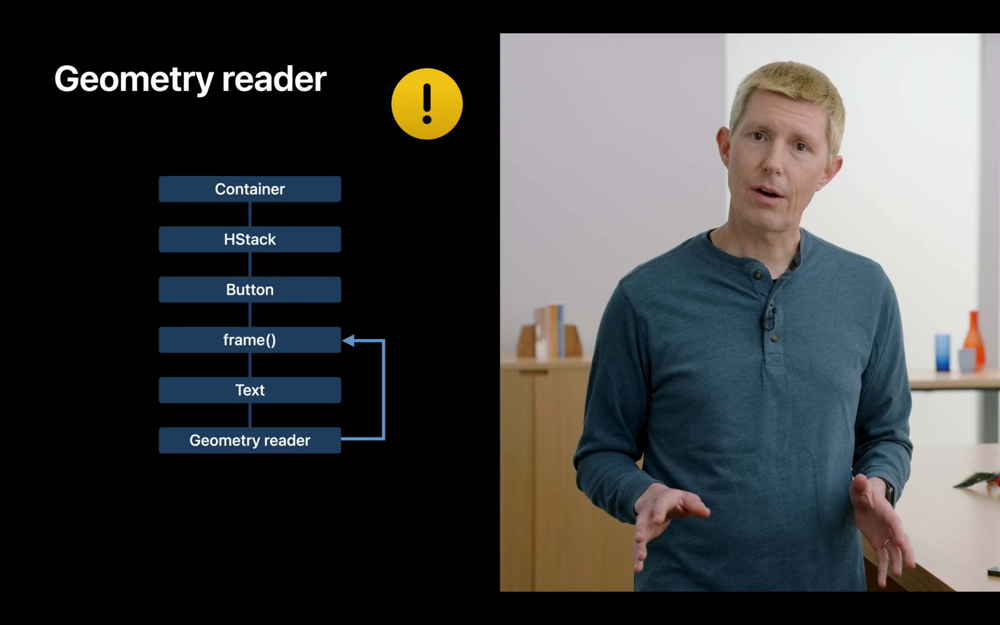

在这里苹果工程师给出了答案，并不是这样:

- 请注意，对于 `GeometryReader` 的预期用途，布局信息应该始终向下流动。
- 如果像上图中那样，将 `GeometryReader` 中的布局信息绕过 `SwiftUI` 的布局引擎上报，很有可能会导致不停地触发父视图向下传参数，同时导致 `GeometryReader` 不停地上报。最终导致循环，造成 `Crash`。
- 所以苹果工程师建议的做法是使用新的 `Layout API`，通过布局引擎来实现类似的事情。

### 第二部分：笔者眼中的 `GeometryReader`

下面我会结合最开始给出的视频里面的例子，简单聊聊 `GeometryReader` 在实际开发中的具体使用场景。[参考代码](https://github.com/terhechte/NSSpain2020Code)

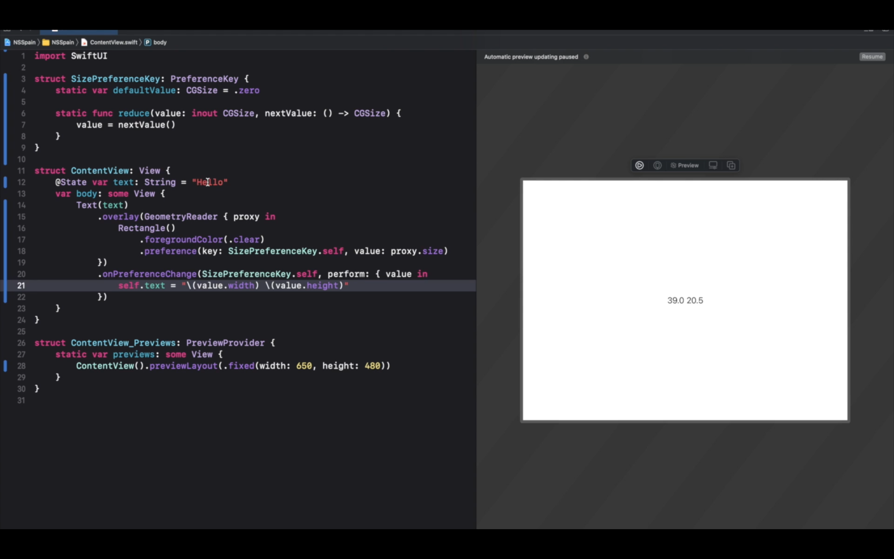

如上图，通过在 `ViewModifier overlay` 中添加一个 `GeometryReader` 来读取视图的布局信息。

这个场景可以经常在日常 Debug 中使用，可以帮助大家获得父视图准确的布局信息，避免一些 SwiftUI 里反直觉的坑。

风险等级：低。

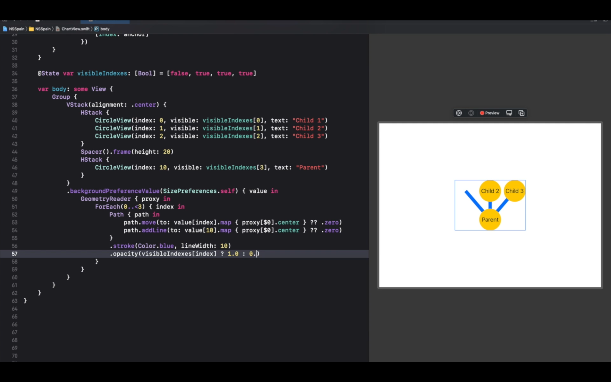

如上图，通过 `View Preferences` 将获取到位置信息上报给 `GeometryReader`，然后在 `GeometryReader` 依次绘制 `Path` 实现了一个简单树状图。

这个场景在日常开发中可以实现时间轴等效果。

风险等级：低。

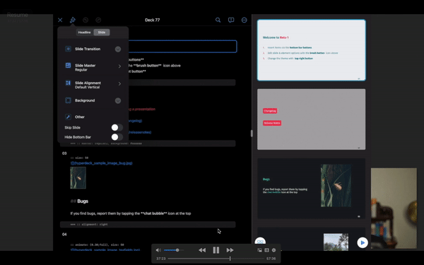

在很多工程中都是 `SwiftUI UIKit` 混合使用的状态，作者实现了一个继承自 `UIHostingController` 的 `ViewController` 来显示 `SwiftUI` 实现的内容。

如上图，默认情况下，`ViewController` 不会随着内容的改变而改变，作者必须再次使用 `GeometryReader`，从它那里拿到 `SwiftUI.View` 大小信息，然后将信息上报给 `navigationController.preferredContentSize` 来控制 `ViewController` 的大小。

这个场景在日常开发中经常会在，将一个继承自 `UIHostingController` 的 `ViewController` 插入到 `UITableView Cell` 中使用到。这个情况属于绕过了苹果开发工程师提到的绕过 `SwiftUI` 布局引擎上报信息的情况。

风险等级：高。

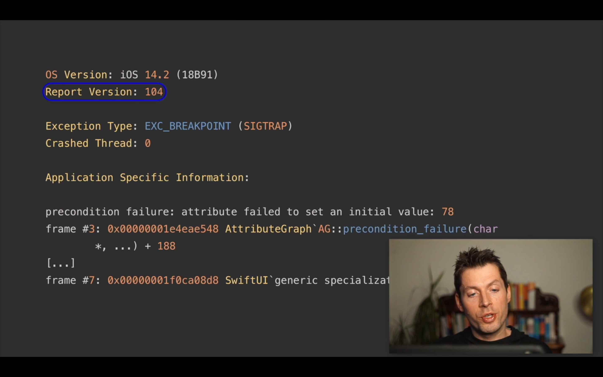

如上图，`AttributeGraph` 这个 `Crash` 笔者在自己的工程中也经常遇到，大胆猜测这个就是苹果工程师所说的循环引用的问题。如果有小伙伴知道如果处理，欢迎留言🤗。

**新的 `Layout API` 只能在最近的版本才能使用，那之前版本又该如何处理呢？**

笔者在这里倒是知道有一个比较 hacky 的方案（谨慎使用！），如果你恰好是在使用了 `UIViewRepresentable` 的场景下，重写 [_overrideSizeThatFits(_ size:, in proposedSize:, uiView:)](https://github.com/xybp888/iOS-SDKs/blob/a110a31ce82e42621b3e7ba31bd6563c02d2631a/iPhoneOS13.0.sdk/System/Library/Frameworks/SwiftUI.framework/Modules/SwiftUI.swiftmodule/arm64e-apple-ios.swiftinterface#L7613) 方法可以得到跟新接口中的 `sizeThatFits` 相同的效果。

至于 `placeSubviews`，笔者没有找到的替代方案，如果有小伙伴知道如果处理，欢迎留言🤗。

## 最后

这些就是 `SwiftUI` 用于编写应用程序视图布局的一些新工具。我们可以使用 `Grid` 来构建高度可定制的静态信息二维布局。我们可以使用布局协议来定义自己的通用布局、可重用布局或特别定制用例的布局。当我们想让 SwiftUI 从一组视图中选择最适合屏幕可用空间时，我们可以使用 ViewThatFits。我们可以使用 AnyLayout 在不同的布局类型之间平滑地过渡。以及关于 `GeometryReader` 的讨论。

这篇文章中，有很多地方处于笔者自己的理解和认知，难免有不足之处，欢迎大家指正和讨论！

- [Composing custom layouts with SwiftUI](https://developer.apple.com/documentation/swiftui/composing_custom_layouts_with_swiftui)
- [Grid](https://developer.apple.com/documentation/swiftui/grid)
- [Layout](https://developer.apple.com/documentation/swiftui/layout)
- [ViewThatFits](https://developer.apple.com/documentation/swiftui/viewthatfits)
- [AnyLayout](https://developer.apple.com/documentation/swiftui/anylayout)
