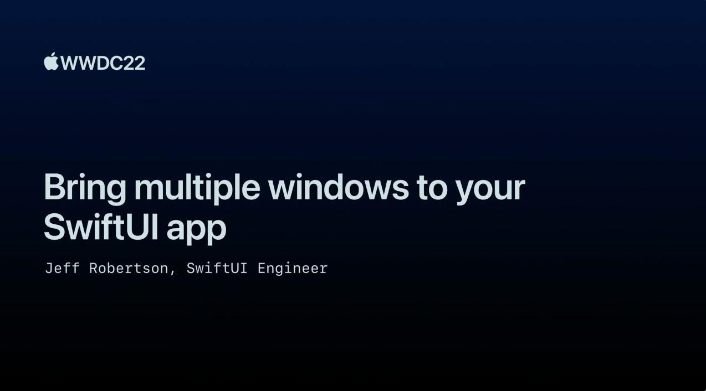

## 个人介绍

魏王磊，iOS&Android 开发，就职于字节跳动 FusionApp 团队。

## 审核介绍

Jake Lin，在 REA Group 担任 Senior Mobile Tech Lead，负责公司的移动研发和团队建设。喜欢研究 iOS 和 Android 两平台的架构，爱折腾声明式 UI 和响应式编程范式。并编写了 [iOS 开发进阶](https://t2.lagounews.com/lR59RGRBct5E3) 课程。  

水水，前字节跳动影像团队 iOS 开发，独立负责 SwiftUI 项目在业务侧落地，目前即将前往美国读研。热衷于思考构建高质量 iOS 架构，对关于 Swift 一切新鲜事物感兴趣，常年混迹于声明式 UI 和响应式编程范式。3 年 SwiftUI 实战编程老鸟。  

## 文章简介

本文将围绕构建 SwiftUI app 的多窗口进行讨论。 共分为 4 个部分： 1. 介绍 SwiftUI 生命周期中的各种 scene types，包括几个新引入的 Window 和 MenuBarExtra； 2. 通过添加`auxiliary scenes`的方式将这些 scene types 组合在一起； 3. 介绍一些为特定 scenes 打开窗口的新 API； 4.介绍一些在 app 中自定义 scene 的方法。

## 公众号/小专栏图文头图

