# WWDC22 - Bring multiple windows to your SwiftUI app

本文基于 WWDC22 Session 10061 - [Bring multiple windows to your SwiftUI app](https://developer.apple.com/videos/play/wwdc2022/10061/) 整理

> 作者：魏王磊，iOS&Android 开发，就职于字节跳动 FusionApp 团队。
>
> 审核：
>

本 Session 主要探讨了如何使用 scene types 轻松构建更丰富的 app, 分为一下四个部分:

* **Scene basics** - SwiftUI 生命周期中的各种 scene types，包括几个新引入的 types；
* **Auxiliary scenes** - 如何通过添加 auxiliary scenes 的方式将这些 scene types 组合在一起；
* **Scene navigation** - 介绍一些为特定 scenes 打开窗口的新 api；
* **Scene customizations** - 分享一些在 app 中自定义 scene 的方法；

## Scene basics

介绍 Scene types 之前我们先回顾一下基础知识，SwiftUI app 是由 App Scene View 组成的树状结构； 显示在屏幕上的 Window 表示了 Scenes 的内容。本文依然以 BookClub 为例，这个 app 的 Scene 只有一个 WindowGroup，并运行在多个平台上。如下图所示:
> Tips: 更多基础知识请参考：[App essentials in SwiftUI](https://developer.apple.com/videos/play/wwdc2020/10037/)

> BookClub 是一个用来跟踪图书阅读进度的 app, 在 WWDC20 中多次出现，更多资料请参考：<https://developer.apple.com/documentation/swiftui/fruta_building_a_feature-rich_app_with_swiftui>

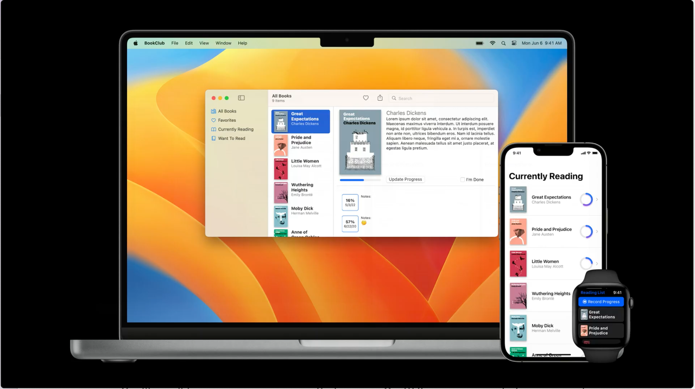

系统会根据运行平台的不同而调整 Scene 的展示行为， 在诸如 iPadOS 和 macOS 这样支持多窗口的平台上， 一个 WindowGroup 可以包含多个相同类型的 Window。如下图所示：

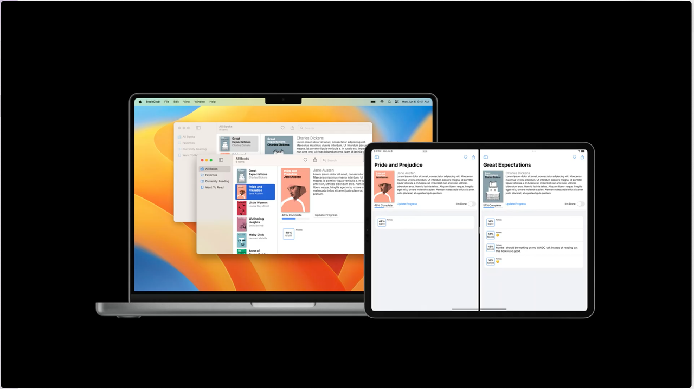

Scene 的 behaviors 和 representation 会因使用的 Scene types 而异。 例如， 一个 scene 中可能只包含一个实例，而无视平台差异。

那就让我们回顾一下现有的 Scene types；

* **WindowGroup** - 这个 Scene 提供了一种跨 Apple 平台的构建数据驱动 app 的方法；
* **DocumentGroup** - 可以在 iOS 和 macOS 上构建 document-based apps;
* **Settings** - 可以定义一个在 macOS 中进行应用设置的 Window;  

这些 Scene types 组合起来可以使 app 的功能更丰富。如下代码所示，App 中包含了 WindowGroup， DocumentGroup 和 Settings 三个 Scene。

```swift
import SwiftUI
import UniformTypeIdentifiers

@main
struct MultiSceneApp: App {
    var body: some Scene {
        WindowGroup {
            ContentView()
        }

        #if os(iOS) || os(macOS)
        DocumentGroup(viewing: CustomImageDocument.self) { file in
            ImageViewer(file.document)
        }
        #endif

        #if os(macOS)
        Settings {
            SettingsView()
        }
        #endif
        }
    }
    struct ContentView: View {
        var body: some View {
            Text("Content")
        }
    }

    struct ImageViewer: View {
        var document: CustomImageDocument

        init(_ document: CustomImageDocument) {
            self.document = document
        }

        var body: some View {
            Text("Image")
        }
    }

    struct SettingsView: View {
        var body: some View {
        Text("Settings")
        }
    }
    struct CustomImageDocument: FileDocument {
        var data: Data

    static var readableContentTypes: [UTType] { [UTType.image] }

    init(configuration: ReadConfiguration) throws {
        guard let data = configuration.file.regularFileContents
        else {
            throw CocoaError(.fileReadCorruptFile)
        }
        self.data = data
    }

    func fileWrapper(configuration: WriteConfiguration) throws -> FileWrapper{
        FileWrapper(regularFileWithContents: data)
    }
}
```

今年苹果新增了两个新的 Scene types:

1. **Window**，在 Apple 所有平台上表示一个唯一的，单一的 Scene；
2. **MenuBarExtra**， 在 macOS 系统的菜单栏中呈现为常驻控件；

> 备注: 小编查阅了 SwiftUI 最新的 API 发现 Window Scene 目前只支持 macOS 平台。

以上就是 SwiftUI 的全部 Scene types， 如下图所示：第一排依次为 WindowGroup， Settings， DocumentGroup; 第二排依次为 Window, MenuBarExtra。

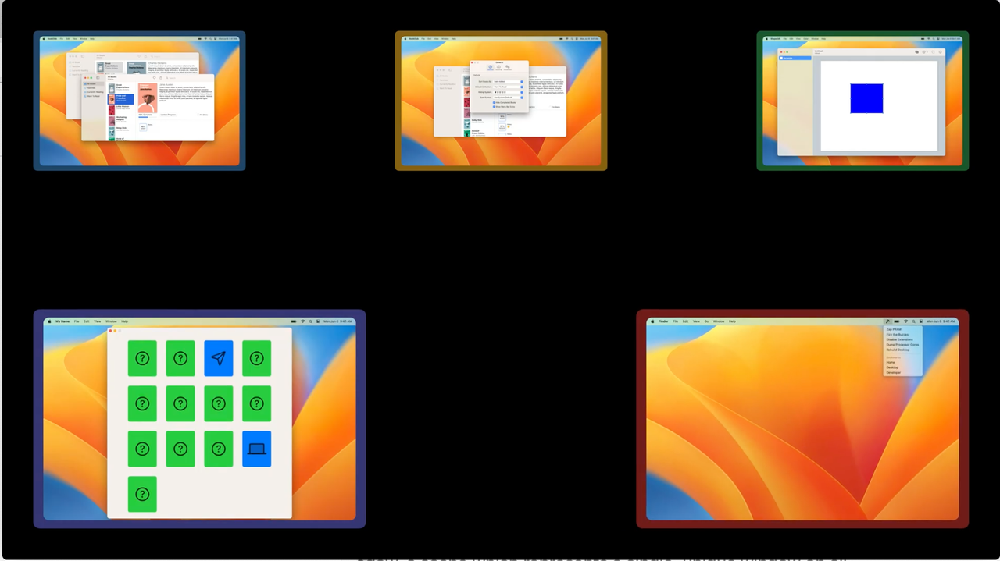

下面让我们重点介绍一下 Window 和 MenuBarExtra 这两个 Scene；
与其他的 scene types 一样， 你可以将 Window 和 MenuBarExtra 作为独立 scene 使用，或者与其他 scene 组合使用。

* **Window**

不同于 WindowGroup 的多窗口， Window scene 只会在一个唯一的 window 实例中表示其 contents。
使用代码如下所示：

```swift
import SwiftUI

@main
struct BookClub: App {
    @StateObject private var store = ReadingListStore()

    var body: some Scene {
        WindowGroup {
            ReadingListViewer(store: store)
        }
        Window("Activity", id: "activity") {
            ReadingActivity(store: store)
        }
    }
}

struct ReadingActivity: View {
    @ObservedObject var store: ReadingListStore

    var body: some View {
        Text("Reading Activity")
    }
}

class ReadingListStore: ObservableObject {

}
```

因此，当你的 scene contents 在 iPadOS 和 macOS 上表示某些全局 app state 而不适合用 WIndowGroup 的多窗口样式时，可以用 Windows Scene 来展示。例如，一个游戏 app 可能希望只允许单主窗口去呈现它的 contents。游戏 app 界面如下图所示：

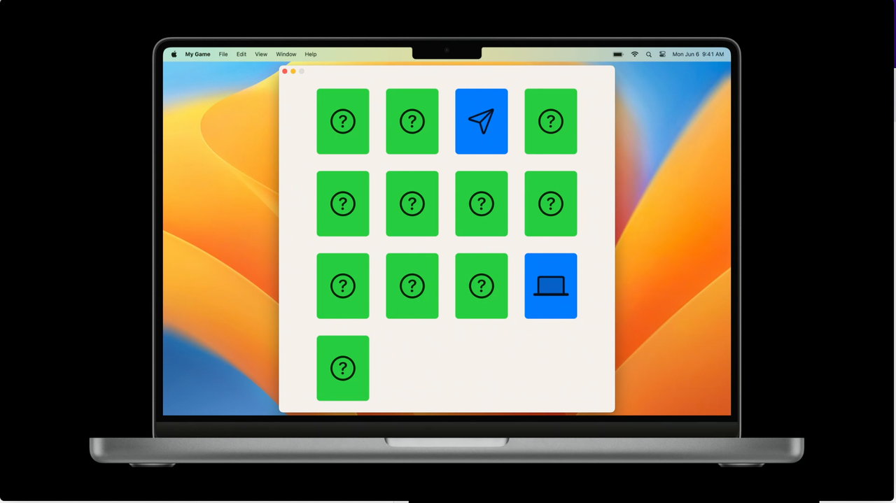

* **MenuBarExtra**

MenuBarExtra 是一个只适用 macOS 平台的 scene， 其行为与其他 scenes 稍有不同，它不会将内容渲染在窗口中，而是将其标签放在菜单栏中， 当 anchored 这个标签时，在菜单或者窗口中显示其内容。此外， 只要关联的 app 正在运行， 无论该 app 是否在前台， 它都可以使用。
这个 scene 非常适合创建可轻松访问其功能的 standalone utility apps； 或者当跟其他 scene 组合时， 提供了另外一种访问 app 功能的方式。如下图所示：

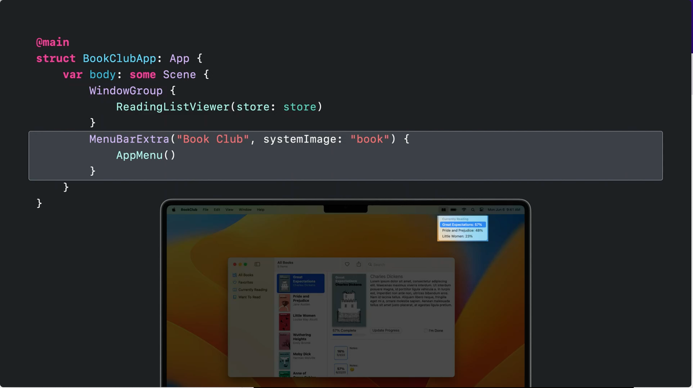

代码如下所示：

```swift
import SwiftUI

@main
struct UtilityApp: App {
    var body: some Scene {
        MenuBarExtra("Utility App", systemImage: "hammer") {
            AppMenu()
        }
    }
}

struct AppMenu: View {
    var body: some View {
        Text("App Menu Item")
    }
}
```

MenuBarExtra 支持两种展现样式：

*  将其内容展现为下拉菜单（默认样式）；

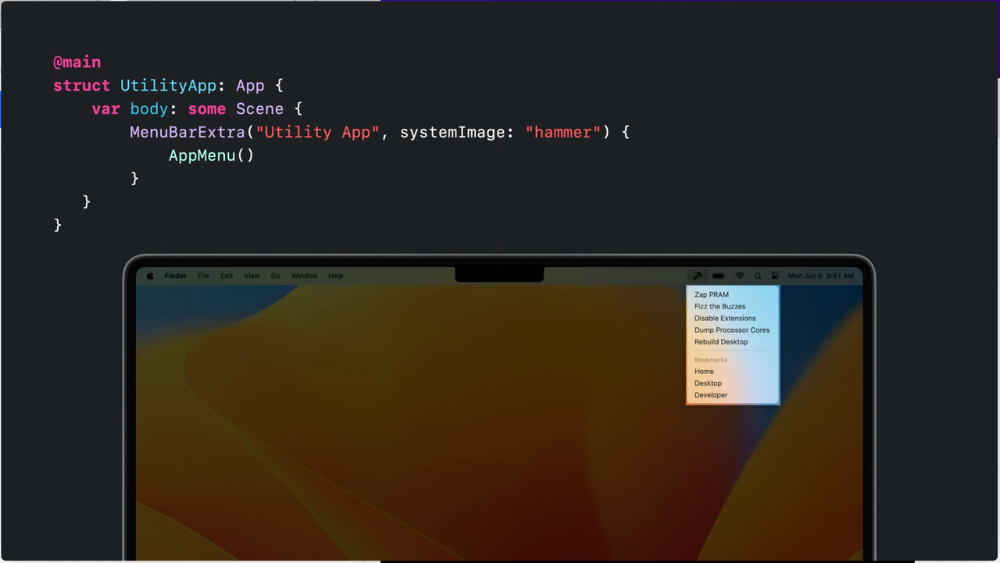

* 将内容展示在无边框的窗口中；

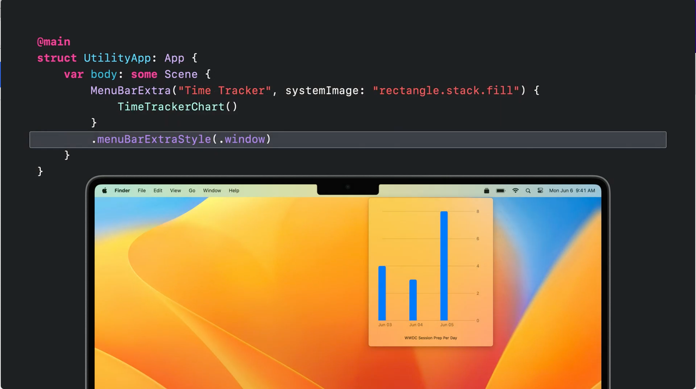

添加了两种新的 scene 后，SwiftUI apps 可以在 Apple 所有平台上呈现更丰富的功能。
以上就是本 Session 中关于 Scene basics 的全部内容。

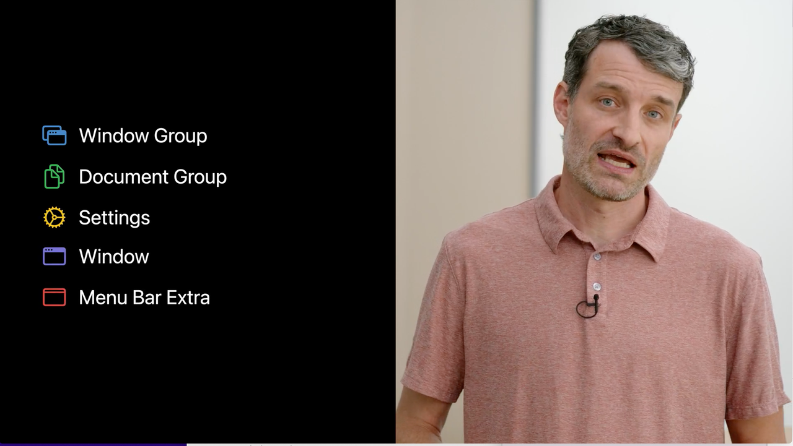

## Auxiliary scenes

接下来让我们看一下这些新的 API 与我们现有 scene types 结合的例子。在 macOS 上， BookClub app 受益于 WindowGroup 的多窗口特性，可以展示在一个新的窗口中展示阅读活动的 Acitivty。如下图所示：

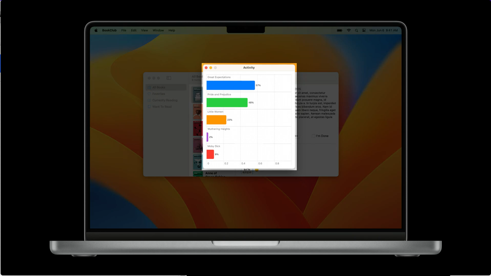

这是一个 macOS apps 如何很好地利用该平台上利用额外屏幕空间和灵活窗口排布的例子。
接下来我们通过 auxiliary scene 的方式来重新实现一下这个界面。Activity 窗口的数据被 app 的 state 所驱动， 因此 Window scene 是理想选择(注释：在这里打开通过相同 State 控制的多窗口显然不合适)。实现代码如下图所示：

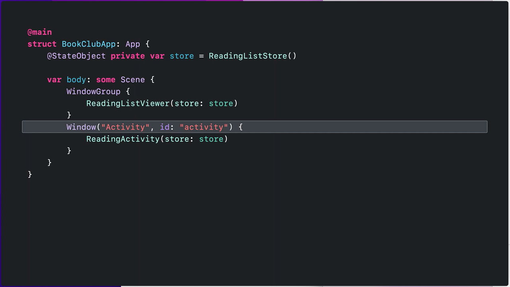

在这里，Window Scene 的标题 "Activity" 被用于 Window 菜单中下拉菜单项的标签（如下图）。 选择这个标签，该 scene 窗口将被打开（如果已打开， 则展示到前台）。

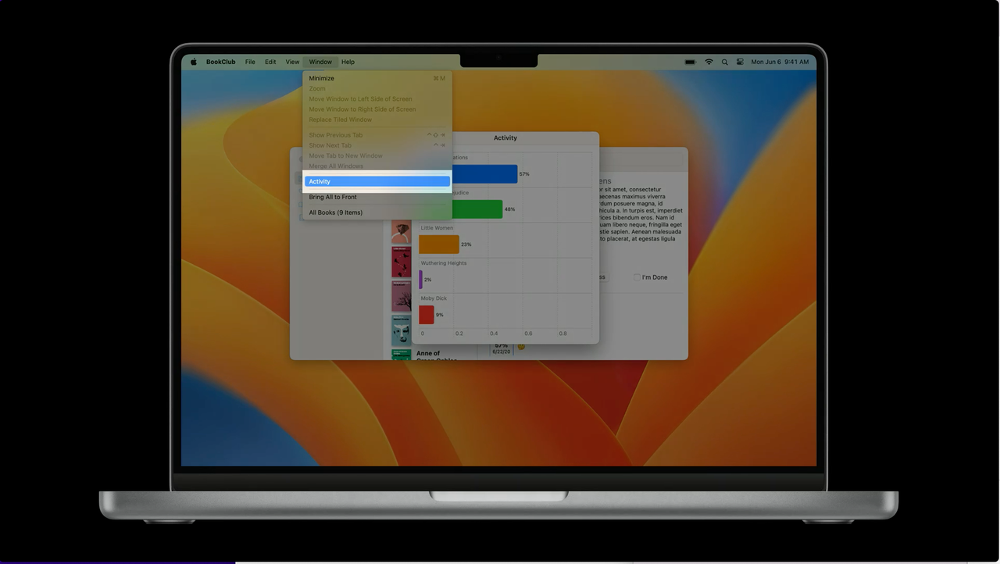

## Scene navigation

>在介绍了向 BookClub app 中添加 Auxiliary scenes 之后，接下来介绍一些新 scene presentation APIs， 以及如何将它们集成到你的 app 中以提供更丰富的体验。  

BookClub app 中包含的 context menu 可以操作 Content List 中的的 Item。 这个 context menu 包含一个 "open in New Window" 菜单项，可以触发 window presentation。如下图所示：通过 Button 触发 window presentation。

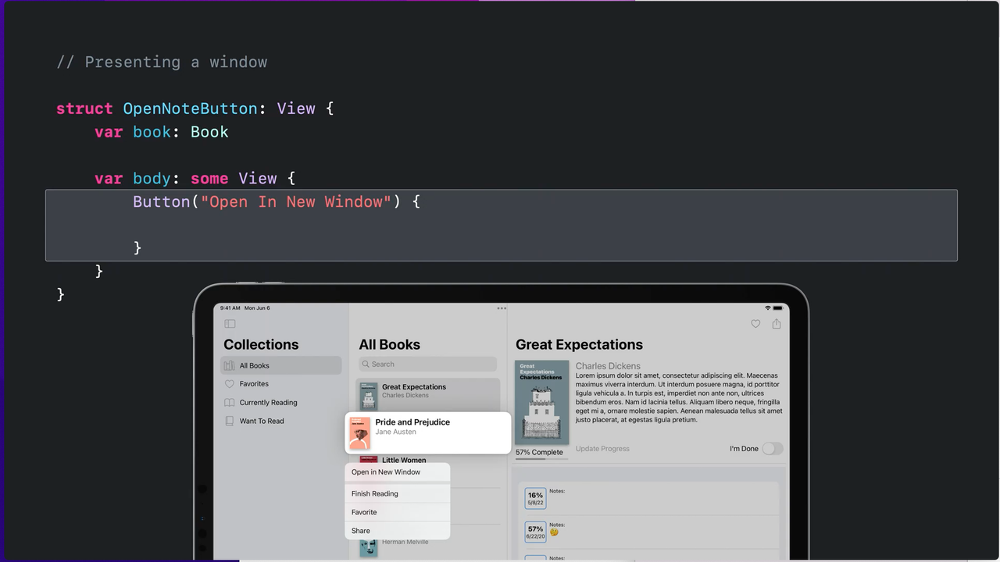

在这里我们介绍几个新的 action，用来打开与 app 定义的场景相关联的窗口。

* **openWindow action** 可以为 WindowGroup 和 Window 呈现窗口。使用方法有两种： 第一种是传递给这个 action 的 identifier 必须跟 app 中 scene 所定义的 identifier 相匹配。例如 图 2-2 中 Window scene 定义的 id = "activity" 必须要跟 openWindow 中 id 相同。如下图所示：

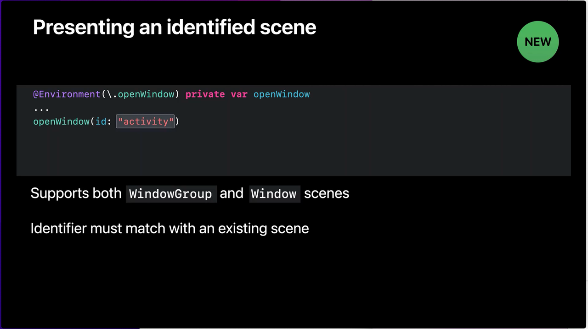

第二种是在 openWindow action 中设置 presentation value， 这种 action 仅支持 WindowGroup。值的类型必须和 scene 初始化所提供的类型相匹配。如下图所示：

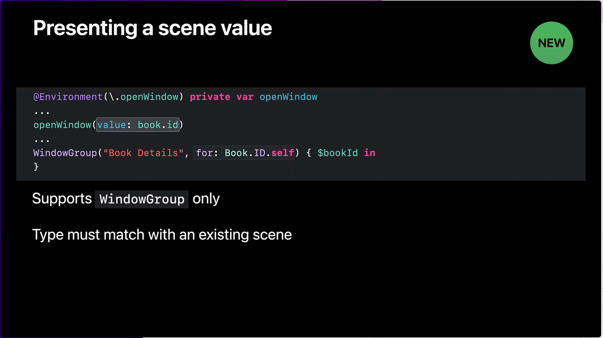

* **newDocument action** 支持为 FileDocuments 和 ReferenceFileDocuments 打开新的文档窗口。 这个 action 要求 app 中相应的 DocumentGroup 必须具有 editor role ，这样每次展示窗口时都会创建 Document。如下图所示：

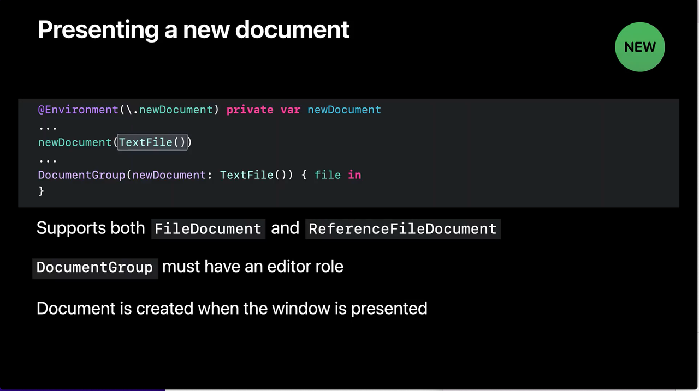

* **openDocument action** 可以呈现在磁盘中已存在文件的文档 windows。初始化时需要提供一个指向打开文件的 URL，与此同时需要定义一个 DocumentGroup 来显示窗口，并且需要为读取文件类型定义一个文档类型。如下图所示：

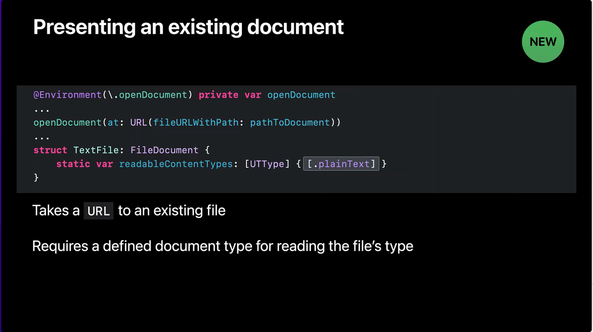

在前面的例子中，我们为 View 添加一个 openWindow environment 属性， 并且直接从 Button 中调用 openWindow (依赖 openWindow action 的 callable)

同时由于 Book 的类型符合 identifier， 因此 我们将这个 identifier value 传递给 openWindow。

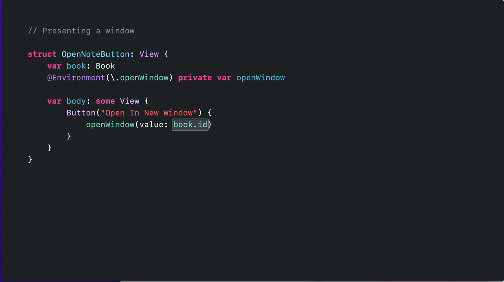

接下来讨论一下这个 identifier，在这个实例中我们用到的 book.id 是一个 UUID 类型的值。注意，Book 是值类型。因此，如果我们使用 book.id 作为 presented value， 打开新的窗口将展示这个 identifier 的一个副本， 对其中任何一个窗口进行编辑将不会影响另外一个。
  
使用 book 的 identifier 使我们的 model store 代替了通过为单个值提供多个绑定的方式成为实质的源。Book 的类型还必须符合 Hashable 和 Codable 协议，下一节会详细讨论。  

最后一点，尽可能传传轻量的值(lightweight value)，  这里 Book 的 identifier 就是一个最好的例子。
> 有关值类型的更多信息， 请参阅相关开发者文档.

> 需要 Hashable 的一致性(conformance)才能将 Book 和 open window 关联，需要 Codable 的一致性是为了持有 state restoration 的 value。  

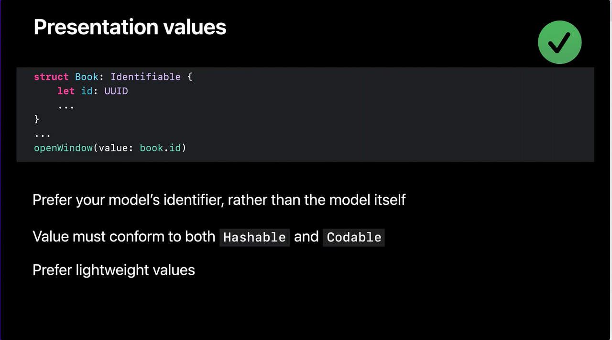

由于 SwiftUI 保留该值用于 state restoration，因此使用轻量的值将使得你的 app 的响应能力更强。  

接下来我们需要添加一个 WindowGroup scene 来显示图书详情页（如下图所示），以配合上面定义的 Button 部分。  

注意下图中 WindowGroup 的初始化时传递了 Book.ID 类型的数据，这个值的类型和我们上文中传递给 openWindow action 的值相匹配。

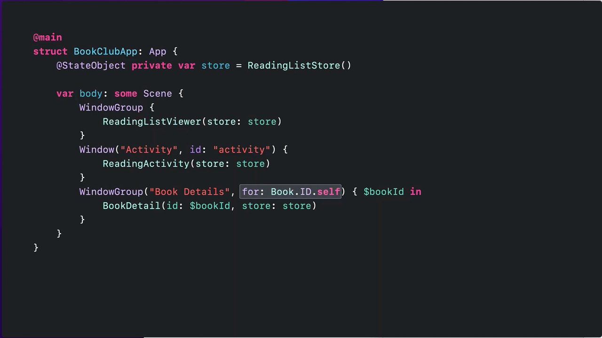

当给 WindowGroup 提供一个关联值时， SwiftUI 将为该值创建新的子 scene，该子 scene 的 root content 由该值使用 WindowGroup 的 view builder 所定义。

WindowGroup 传入的值总是和 openWindow action 的值保持一致，当给 openWindow 提供一个已打开窗口的值时，就会将该窗口展示在前台，否则创建一个新的窗口。 以 BookClub app 为例， 在已经存在图书详情窗口的 context menu 中操作"open window"， 会将该窗口显示在前面， 而不会打开一个新窗口。如下图所示：

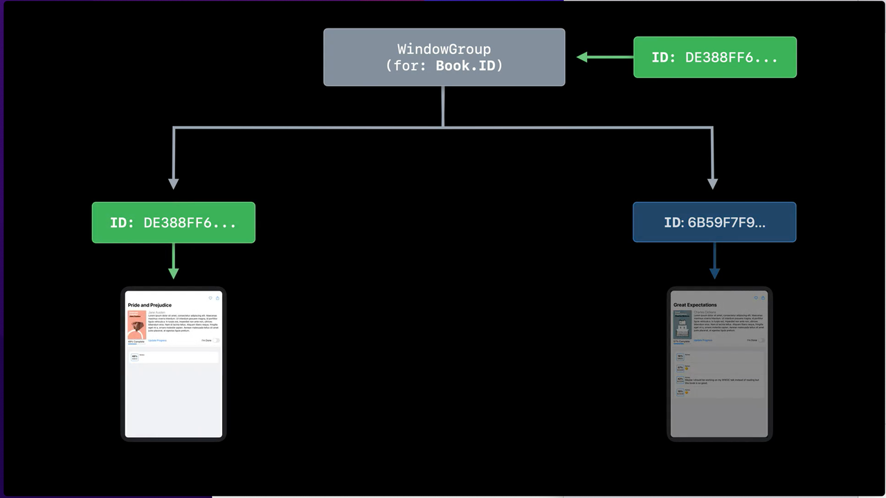

Presented value 也将由 SwiftUI 自动持久化以便 state restoration。view 也会被绑定到初始的 presented value。你可以在窗口打开时随时修改这个绑定。  

当重新创建 scene 以恢复状态时，SwiftUI 会将最新的值传递给窗口的 Content view。如下图所示：  

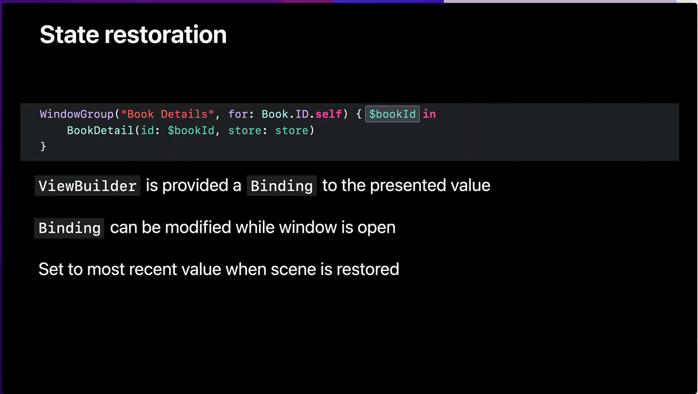

在这里，我们将 Book.ID 绑定到详情页中， 它可以在我们的 model store 中查找指定的 item 进行显示。  

## Scene customizations

这一部分介绍一些在应用中自定义 scene 的方法。

*  `.commandsRemoved`

在前部分中我们已经定义了两个 WindowGroup scenes，(一个是 app 的主视图窗口，另一个是详情页的窗口)，同时 SwfitUI 会默认为这两个 Group 在 "File"菜单添加各自的菜单项。如下图所示：

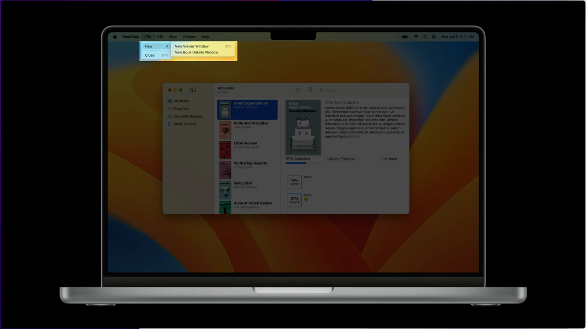

在这个例子中，我们只希望通过内容的上下文菜单打开图书详情页窗口，而不是通过菜单栏，那么我们可以通过设置 modifier `.commandsRemoved` 来从"File"菜单栏将这个入口移除。  
commandsRemoved modifier 是新增的 scene modifier， 可以使 scene 不再提供默认的 commands。

设置 commandsRemoved 后  "文件" 菜单栏现在只剩下一个打开主窗口的菜单，代码及效果图如下所示：

```swift
WindowGroup("Book Details", for: Book.ID.self) { $bookId in
    BookDetail(id: $bookId, store: store)
 }
 .commandsRemoved()
```

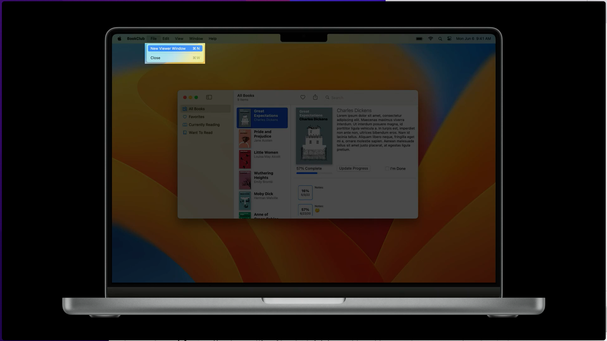

*  `.defaultPostition`

在之前介绍 Auxiliary scenes 时，我们使用 Window Scene 定义了 Activity 窗口，在打开展示这个窗口时，如果之前没有可用的 state， SwiftUI 默认将窗口放置在屏幕中间。如下图所示：  

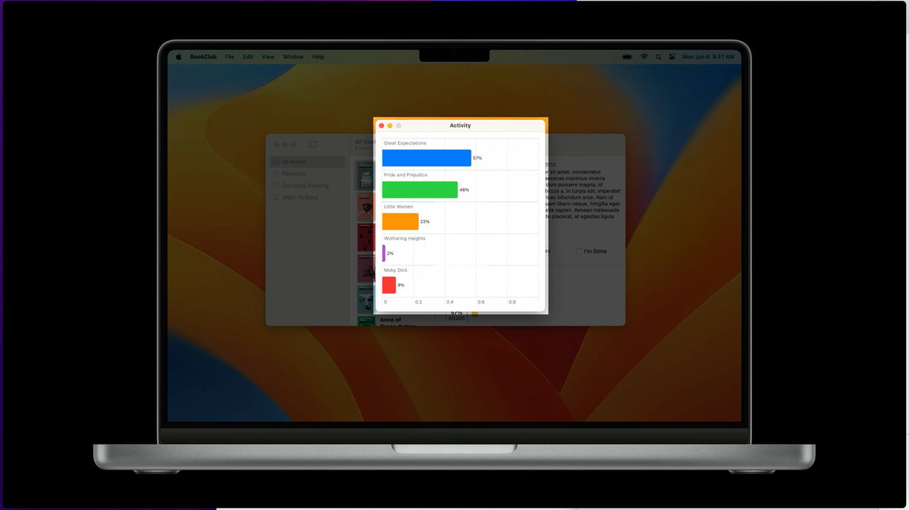

如果想修改默认位置，可以通过 modifier `.defaultPostition` 将窗口放置指定位置，除非从之前状态中恢复。  

```swift
struct ReadingActivityScene: Scene {
    @ObservedObject var store: ReadingListStore

    var body: some Scene {
        Window("Activity", id: "activity") {
            ReadingActivity(store: store)
        }
        .defaultPosition(.topTrailing)
    }
}
```

这里设置的是相对屏幕位置(例如 .topTrailing )，同时会在考虑当前语言环境的情况下将窗口放在适当的位置。设置完成后 Activity 窗口就会和屏幕中其他窗口的位置区分开，以便阅读。

如下图所示：  

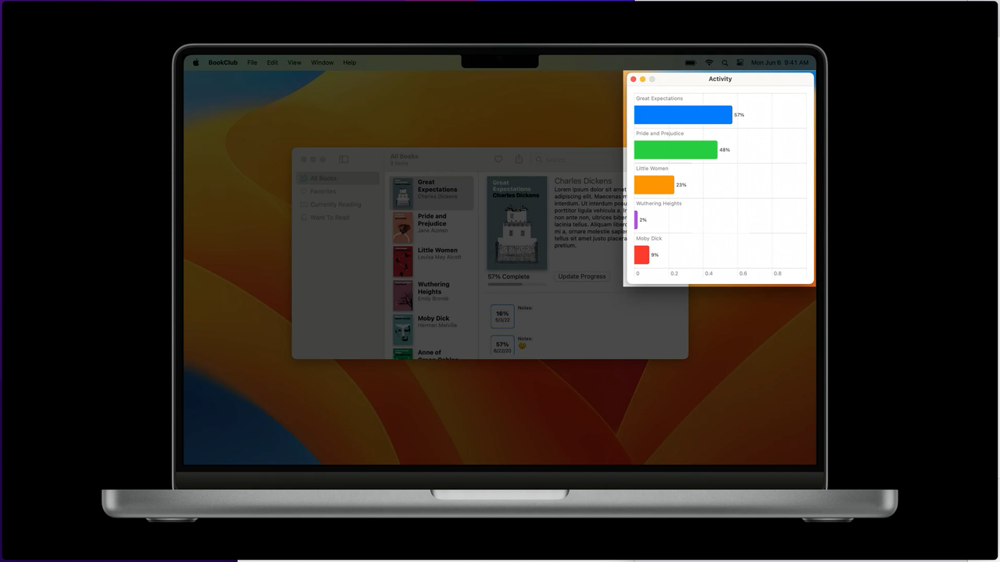

*  `.defaultSize`  

可以通过添加 defaultSize modifier 的方式可以设置 Window 的默认尺寸。如下图所示：

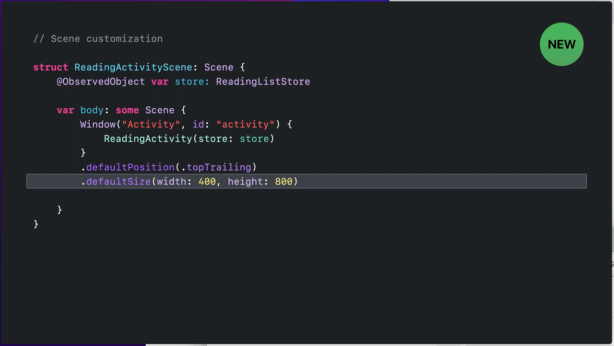

*  `.keyboardShortcut`  

使用`keyboardShortcut` modifier 可以设置 behavior 的快捷键。下图使用这个 modifier 来给 Activity Window 设置一个打开的快捷键 `Option-Command-0` 。  

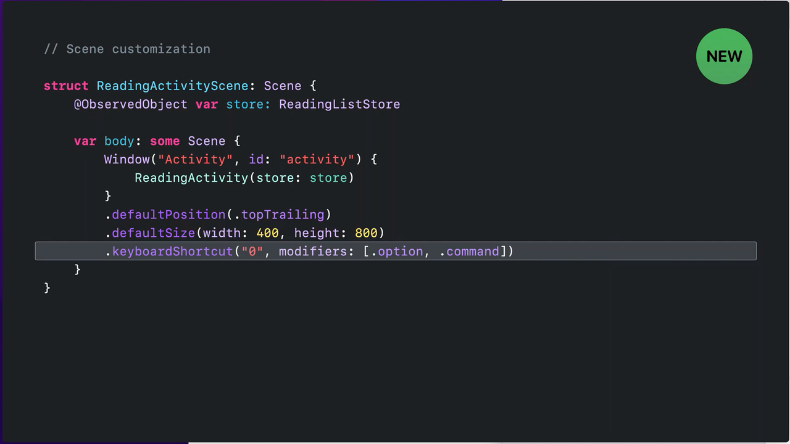

设置完成后在 "Window" 菜单栏可以看到 "Activity" 的快捷键，如下图所示：

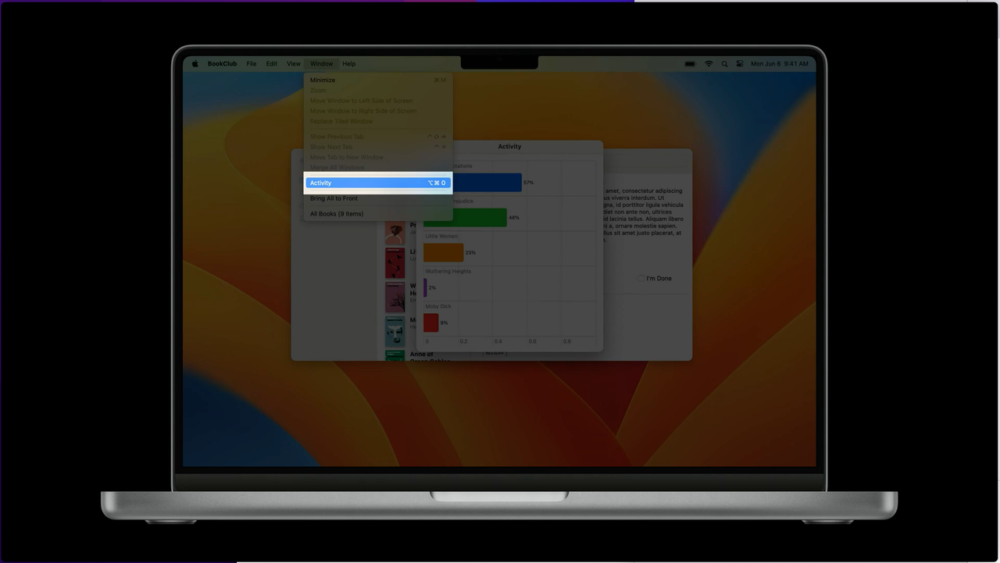

给常用场景设置快捷方式提升自定义 app 的一种好方式，还可以重置默认的快捷方式 `Command-N` (默认添加在主 WindowGroup 中)。  

以上就是本次介绍的新的 API， 如果想要了解更多怎样向 iPadOS 和 macOS app 中添加功能的信息， 请查看 [SwiftUI on iPad: Organize your interface](https://developer.apple.com/videos/play/wwdc2022/10058/) 和 [SwiftUI on iPad: Add toolbars, titles, and more.](https://developer-rno.apple.com/videos/play/wwdc2022/110343/)  
