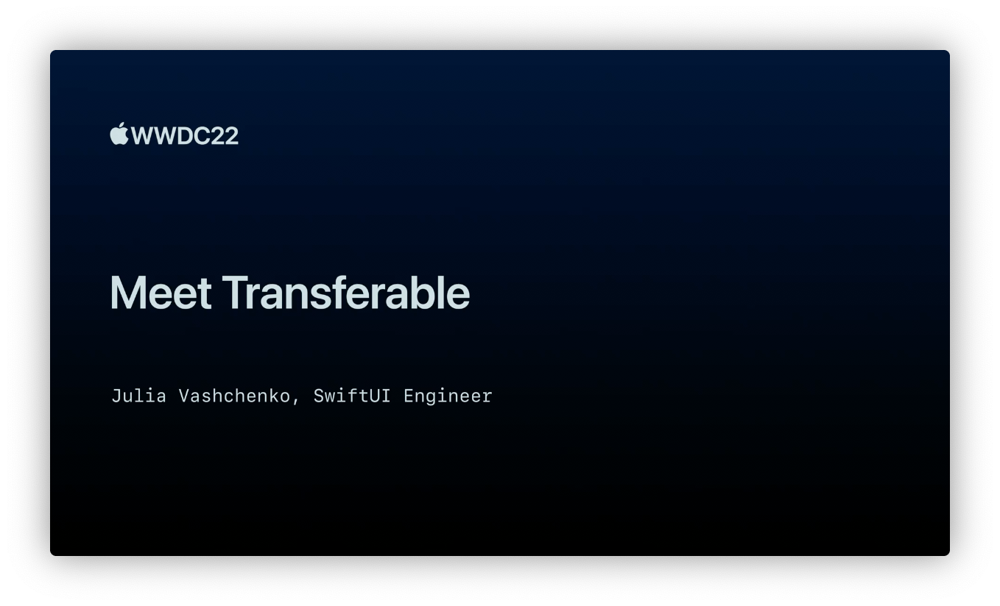

## 个人介绍

ooatuoo, iOS 开发。

## 审核介绍

Cyandev，目前就职于抖音基础技术团队，研发流程方向全栈工程师，在 Swift、大前端领域有比较丰富的经验。

## 不超过 120 个字的文章简介

CoreTransferable 是苹果今年新出的纯 Swift 的框架，提供了一种更 Swift、更声明式的方式来描述数据该如何被传输和共享。本文将介绍其核心的 `Transferable` 协议的实现方式，及其常见的用法。

## 公众号/小专栏图文头图

