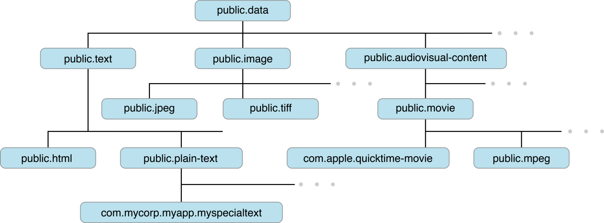

# Session 10062 - 初见 Transferable

> 作者：ooatuoo，iOS 开发者。
>
> 审核：

本文基于 Session 10062 [Meet Transferable](https://developer.apple.com/videos/play/wwdc2022/10062) 梳理

## 前言

[`Core Transferable`](https://developer.apple.com/documentation/coretransferable) 是苹果今年新出的纯 Swift 的框架，提供了一种更 Swift、更声明式的方式来描述数据该如何被传输和共享。本文将介绍其核心的 `Transferable` 协议的实现方式，及其常见的用法。

## NSItemProvider

在这之前表示传输和共享的数据，都是用 `NSItemProvider`，它是 iOS 8.0 出的 Objective-C API，现在看已经非常古老了。比如下面的例子就是支持把文本拖拽到别的 app 的实现，还需要将 `String` 转换成 `NSString`：

``` swift
Text("Hello World")
    .onDrag {
        NSItemProvider(object: "Hello World" as NSString)
    }
```

除了不够 Swift，回调也没有类型保证，比如下面的例子，只是接收图片就得处理一堆分支，非常蛋疼，更不用说支持多个类型的内容了：

``` swift
Rectangle()
    .onDrop(of: [.image], isTargeted: nil) { providers in
        for provider in providers {
            if provider.canLoadObject(ofClass: UIImage.self) {
                provider.loadObject(ofClass: UIImage.self) { item, error in
                    if let image = item as? UIImage {
                        // handle image
                    } else {
                        print(error?.localizedDescription)
                    }
                }
                return true
            }
        }
        return false
    }
```

另外，功能上也有些局限，比如没法支持多种类型的内容拖拽到我们的 app，比如第一个例子里，`onDrag` 只支持提供一个 `NSItemProvider`。

为了解决这些问题，Apple 推出全新了 `Core Transferable` 框架。

## 概览

我们先来感受下上面两个例子在新框架下的写法，SwiftUI 新增了 [`draggable(_:)`](https://developer.apple.com/documentation/swiftui/view/draggable(_:)) 和 [`dropDestination(payloadType:action:isTargeted:)`](https://developer.apple.com/documentation/swiftui/view/dropdestination(payloadtype:action:istargeted:)) 两个 viewModifier 来代替之前的 `onDrag` 和 `onDrop`，因为 `String`、`Image`、`Data`、`URL`、`AttributedString` 这几个系统的类型都已经默认实现了 `Transferable`，我们可以直接用：

``` swift
struct PortraitView: View {
  @State var portrait: Image // 👈🏻 Transferable type

  var body: some View {
    portrait
      .cornerRadius(8)
      .draggable(portrait) // 👈🏻 支持 drag
      .dropDestination(payloadType: Image.self) { (images: [Image], _) in // 👈🏻 支持 drop
        if let image = images.first {
          portrait = image
          return true
        }
        return false
      }
  }
}
```

可以看到 `.dropDestination` 回调的结果就已经是对应的 `Image` 类型了，无需再处理类型转换。

另外，SwiftUI 也新增了 `PasteButton` 和 `ShareLink` 两种系统的视图来方便开发者实现复制和分享的功能，两者也都只需要提供支持 `Transferable` 的类型即可：

- [`PasteButton`](https://developer.apple.com/documentation/swiftui/pastebutton)：

``` swift
var body: some View { 
  // 👇🏻 实现 Transferable 的类型
  PasteButton(payloadType: String.self) { pastedString in 
    // ... 
  } 
}
```


- [`ShareLink`](https://developer.apple.com/documentation/swiftui/sharelink)，新增的系统提供分享按钮：

``` swift
@State private var portrait: Image

var body: some View {
  Profile()
    .toolbar {
      ShareLink(item: portrait)
    }
}
```

watchOS 9 上也可以分享了：


## 自定义 Transferable

除了上面几种框架已经默认支持的系统类型之外，该如何让自己的数据类型支持 `Transferable` 呢？

我们先来看看 `Transferable` 的定义：

``` swift
public protocol Transferable {
  associatedtype Representation: TransferRepresentation

  @TransferRepresentationBuilder<Self> static var transferRepresentation: Self.Representation { get }
}

public protocol TransferRepresentation: Sendable {
  associatedtype Item: Transferable
  associatedtype Body: TransferRepresentation

  @TransferRepresentationBuilder<Self.Item> var body: Self.Body { get }
}
```

从定义来看，我们自定义的数据类型只需要提供 `transferRepresentation` 就可以了，框架提供如下几种 `TransferRepresentation`，一一来介绍下：

### `CodableRepresentation`

我们先看下它的构造方法，为了突出重点，简化掉了一些类型约束：

``` swift
public struct CodableRepresentation<Item, Encoder, Decoder> : TransferRepresentation, Sendable where Item : Transferable {
    init(for itemType: Item.Type = Item.self, contentType: UTType) where Encoder == JSONEncoder, Decoder == JSONDecoder
}
```

可以看到除了数据类型外，还需要提供 `contentType` 即 `UTType`，那么这个 UTType 是什么呢？

我们知道，当在两个不同的应用程序之间发送共享内容的时候，本质上是在传递二进制数据，因此，除了要提供发送内容与二进制数据相互转换的方法之外，还需要提供二进制数据对应的内容类型，这样接收方才能知道它们实际获得的是什么。

UTType 就是用来描述数据类型的标识，它实际上是统一类型标识符（Uniform Type Identifiers, UTI）的封装。UTI 可以用来描述文件类型、内存中数据的类型或者其他实体的类型。UTI 的声明类似于继承的关系，比如下图中的 `public.jpeg` 也是属于图片类型 `public.image` 的一种。系统已经预知了大量常见的文件和数据类型，比如文本、图片、各种不同格式音视频，具体的可以查看这个[文档](https://developer.apple.com/documentation/uniformtypeidentifiers/uttype/system_declared_uniform_type_identifiers)。关于更多 UTI 的介绍，可以看[这里](https://developer.apple.com/videos/play/tech-talks/10696)。



现在假设我们有个 Profile 的数据结构：

``` swift
struct Profile: Codable {
    var id: UUID
    var name: String
    var bio: String
    var funFacts: [String]
    var video: URL?
    var portrait: URL?
}

我们来给它创建一个自定义的 UTI，首先在 Info.plist 创建自定义标识符的声明：


然后在代码中创建自定义的 UTType：

``` swift
import UniformTypeIdentifiers

extension UTType {
    static var profile: UTType = UTType(exportedAs: "com.example.profile")
}
```

由于我们的 Profile 已经实现了 `Codable`，可以直接创建 `CodableRepresentation` 了，当然你也可以别的 Encoder 和 Decoder：

``` swift
extension Profile: Transferable {
    static var transferRepresentation: some TransferRepresentation {
        CodableRepresentation(contentType: .profile)
    }
}
```

现在 Profile 就支持了 `Transferable`。

## `DataRepresentation`

如果我们有一堆 Profile 需要归档成 CSV，那么我们可以用 `DataRepresentation`，只需要提供从 data 解析和生成 data 的方法：

``` swift
struct ProfilesArchive {
    init(csvData: Data) throws { }
    func convertToCSV() throws -> Data { Data() }
}

extension ProfilesArchive: Transferable {
    static var transferRepresentation: some TransferRepresentation {
        DataRepresentation(contentType: .commaSeparatedText) { archive in
            try archive.convertToCSV()
        } importing: { data in
            try ProfilesArchive(csvData: data)
        }
    }
}
```

## `FileRepresentation`

对于内存占用较大的数据，我们可以通过文件来共享，只需要给定文件内容的标识符，以及文件的路径：

``` swift
struct Video: Transferable {
    let file: URL
    static var transferRepresentation: some TransferRepresentation {
        FileRepresentation(contentType: .mpeg4Movie) { 
            SentTransferredFile($0.file)
        } importing: { received in
            let destination = try Self.copyVideoFile(source: received.file)
            return Self.init(file: destination)
        }
    }
}
```

## `ProxyRepresentation`

`ProxyRepresentation` 是用来把某个现有（已支持 Transferable 的）类型作为当前类型的一个 representation，比如上面的 `Profile`，有些复制粘贴的地方不支持这个 UTType，我们可以加一个表示文本类型的 `ProxyRepresentation`：

``` swift
extension Profile: Transferable {
    static var transferRepresentation: some TransferRepresentation {
        CodableRepresentation(contentType: .profile)
        ProxyRepresentation(exporting: \.name)
    }
}
```

这样不支持的地方就可以直接当作文本来处理。
注意，这里声明的顺序很重要，接收方会按这个顺序寻找其支持的内容类型。

另外，我们可能还会遇到某些条件下不支持共享的情况，可以通过 `exportingCondition` 来声明：

``` swift
extension ProfilesArchive: Transferable {
    static var transferRepresentation: some TransferRepresentation {
        DataRepresentation(contentType: .commaSeparatedText) { archive in
            try archive.convertToCSV()
        } importing: { data in
            try Self(csvData: data)
        }
        .exportingCondition { $0.supportsCSV }
    }
}
```

## 总结

通过上面的例子，想必你能感受到这种声明式写法的便利，得益于 Swift 的 @resultBuilder，我们可以更方便的组合和复用  `TransferRepresentation`，也可以利用 Opaque Types 的特性，满足我们某些情况下需要隐藏内部实现的需求。
