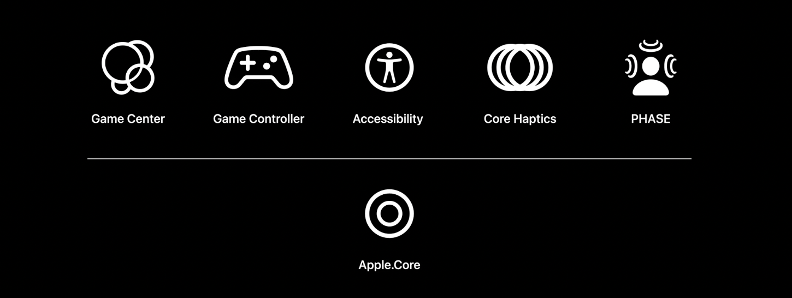

## 个人介绍

七夜，一名外企伪全栈开发工程师，原生、游戏皆有涉猎。

## 审核介绍

xxx

## 不超过 120 个字的文章简介

本文将帮助开发者如何在 Unity 应用或游戏中快速集成 Apple 的一些原生功能插件，以提升作品的体验。本次 WWDC ， Apple 为我们带来了六个基于 Unity 版本的插件：Apple.Core、Game Center、Game Controller、Accessibility、Core Haptics 和 PHASE。我们将分别介绍它们的功能，以及如何快速编译、导入到开发者的项目中。文末，还给出了使用这些插件的一些场景以及注意点。

## 公众号/小专栏图文头图

