# WWDC22 10065 - 即插即用：将 Apple frameworks 添加到您的 Unity 游戏项目

> 作者：七夜，一名外企伪全栈开发工程师。
>
> 审核：xxx

作者本人作为最早的一批手游开发者，当年使用 ObjC 对接苹果应用内支付、推送以及一些三方登录、广告、分享等 SDK ，要痛苦就有多么痛苦。是的，当时还是 MRC 时代，手一抖就内存泄露了。毫不夸张的是就算现在，很多项目组只有一个人知道如何对接 iOS 的相关功能，是的，这个人还是被负责人按着头去开发的。

今年的 WWDC 给大家最直观的感受是，没那么多黑科技，也许是在憋大招。不过今年 Apple 竟然破天荒的为 Unity 提供了 C# 版本的 Apple 插件，这完全不符合 Apple 的高冷气质，令人非常惊讶。另外， Apple 还提供了 Metal-cpp 插件，开发者可以使用 C++ 去调用 Metal API ,展现了我果的开放与包容，终于接地气了。对于，从事游戏开发者，尤其是 Unity 开发者来说，是一个非常大的福音。

翻开手游引擎的老黄历，最早比较知名的 iOS 平台游戏引擎： Cocos2d-iPhone 。后来，为了兼顾安卓平台，国人重写了 Cocos2d-iPhone ，于是出现了风靡一时的 2D 开源游戏引擎 Cocos2d-X 。随着手机性能的爆发性增长，以及传统的轻度休闲、卡牌类游戏已不能满足日益增长的玩家需求， 3D 重度游戏应运而生。作为工具链齐全、功能强大的 3D 游戏引擎 Unity 脱颖而出。曾经被 Adobe 拒绝收购的 Unity 快速占领手机游戏引擎市场，据 Unity 2022 年的[官方报告](https://developer.unity.cn/projects/62938cebedbc2a001d6cac25)统计，过去一年上线的手机游戏，超过 50% 的游戏使用了 Unity 作为游戏引擎 。大家熟知的游戏：《王者荣耀》、《英雄联盟手游》、《APEX》、《原神》、《万国觉醒》、《使命召唤手游》、《Pokemon Go》等都使用了 Unity 作为游戏引擎。当然，《和平精英》和《堡垒之夜》使用的是另外一个知名游戏引擎 Unreal 。目前，国内除了网易还在使用自研的游戏引擎 Messiah 和 NeoX ，诸如腾讯、米哈游等一线游戏厂商基本上使用 Unity 或是 Unreal 作为主流游戏引擎开发手机游戏。面对游戏每年提供给 Apple 的巨额分成，尤其是占据半壁江山的功勋 Unity ，苹果爸爸今年终于为 Unity 提供了 C# 版本的 Apple 插件。

本文将帮助开发者如何在 Unity 应用或游戏中快速集成 Apple 的一些原生功能插件，以提升作品的体验。本次 WWDC ， Apple 为我们带来了六个基于 Unity 版本的插件：Apple.Core、Game Center、Game Controller、Accessibility、Core Haptics 和 PHASE。我们将分别介绍它们的功能，以及如何快速编译、导入到开发者的项目中。文末，还给出了使用这些插件的一些场景以及注意点。

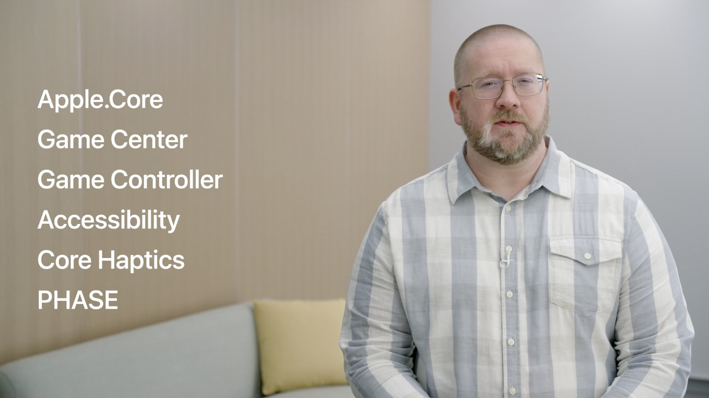

本文将主要聚焦于 Apple 的六个 Unity 插件功能说明与使用。全文共分为 3 个部分：

- 第一部分，是针对 Apple 的插件：Apple.Core、Game Center、Game Controller、Accessibility、Core Haptics 和 PHASE 的功能说明。
- 第二部分，是如何下载、编译、引入这些插件到您的工程。
- 最后一部分，是关于使用这些插件的场景以及相关建议。

> 阅读建议：  
>
> 如果您是 Unity 新手或是第一次接触 Apple 相关功能的接入，建议阅读全文，并结合 Apple 官方文档进行学习；
>
> 如果您以往有对接过 Game Center、Game Controller 等原生插件，可以直接跳到文章的第二部分开始阅读；
>
> 如果你想了解使用 Apple 的六个 Unity 插件使用的场景或是注意点，可以直接跳转到文章的第三部分。
  
> 相关 Session ：
>
> [Session 10065 : Plug-in and play: Add Apple frameworks to your Unity game projects
](https://developer.apple.com/videos/play/wwdc2022/10065/)
>
> [Session 10151 : Add accessibility to your Unity games](https://developer.apple.com/videos/play/wwdc2022/10151/)
>
> [Session 10064 : Reach new players with Game Center dashboard](https://developer.apple.com/videos/play/wwdc2022/10064/)
>
> [Session 110930 : WWDC22 Day 2 recap](https://developer.apple.com/videos/play/wwdc2022/110930/)

## Apple 的 Unity 插件功能说明

首先，我们先了解一下 Unity 插件的设计原则和理念。有 iOS 或是 Mac 开发经验的开发者一定知道，Apple Frameworks 通常是以模块化方式进行封装设计。这样设计的优势是使开发者可以为项目选择合适的技术，同时保持紧凑、高效的代码。对于 Unity 插件，也遵循了同样的模式。每个插件都映射到一个单一的底层 Framework ，开发者可以根据游戏的需要选择要使用的插件集。每个插件都公开了基于 C# 的 Unity 脚本，脚本尽可能直接映射到底层 Framework 。并且，底层 Framework 和 Unity 插件具有很多相似的 API 。这样设计的好处是，如果开发者对底层 Framework 非常熟悉的话，那你将能够快速上手 Unity 插件。反之，通过学习 Unity 插件，开发者将间接地熟悉了底层 Framework 。

另外不得不提的是，这些 Unity 插件是以 Apple 平台原生库基础上构建的。这些原生库充当 C# 脚本和底层 Framework API 之间的胶水层。 Apple Unity 插件适用于 Unity packages ，因此开发者可以通过 Unity Editor 内置的 Package Manager 管理项目里的插件。在一些场景中，这些插件具有定制的编辑器功能，这样可以大大提升开发者的接入效率。除此之外，每个插件都配有详细的自述文件、示例和相关的 Apple Developer 文档等。

接下来我们分别介绍这六个插件：

### 1. Apple.Core

[Apple.Core](https://github.com/apple/unityplugins/blob/main/plug-ins/Apple.Core/Apple.Core_Unity/Assets/Apple.Core/Documentation~/Apple.Core.md) 将每个插件的 Build Settings 统一到单独的 Unity 项目设置窗口中。因为您需要编译每个插件的各个本地库，Apple.Core 还包含一个资源管理器，它确保导入的插件库可以针对所需要的平台进行配置。 Apple.Core 还包含构建后处理项目配置的脚本，在构建您的项目时，它确保编译后产生的 Xcode 工程能够正确引用原生库。有对接过 iOS 或 Mac 功能的 Unity 开发者，想必比较了解上述这个流程，因为 Unity 提供了 UnityEditor.PluginImporter 类、 IPreprocessBuildWithReport 接口以及 PostProcessBuild 方法等可以实现 Unity 导出 Xcode 工程后，根据需要引入对应平台的原生库并可以修改 Info.plist 。 Apple.Core 还定义了一些运行时交互类型，从而简化了 C# 脚本和原生代码层之间的数据传递。特别指出的是，Apple.Core 是所有其他 Apple Unity 插件的依赖项。所以，如果使用了其它插件，那您必须先导入 Apple.Core 到你的 Unity 工程里。

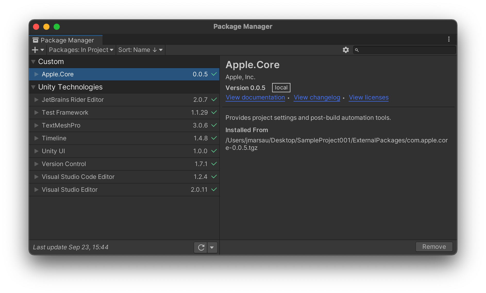

为了保证原生库被正确的引入、Info.plist 和权限描述被合理的设置， Apple.Core 定义了一个 Unity PostProcessBuild 来保证这些任务按步骤执行。 此外，Apple.Core 还定义了一个抽象类 AppleBuildStep ，以便为所有 Apple Unity 插件使用此功能。事实上，任何包含 Apple.Core 的项目也可以定义自定义构建步骤。

定义自定义构建步骤非常简单，开发者只需创建一个新脚本，并且定义的新对象需要继承自 AppleBuildStep 。另外，开发者可以选择覆盖 AppleBuildStep 中定义的任何方法，且任何公共字段都将自动显示为 Apple Build Settings UI 中的选项。以下是一个实现自定义构建步骤的简单示例：

```
using Apple.Core;

namespace MyProject.Editor
{
    public class MyCustomBuildStep : AppleBuildStep
    {
        public override void OnBeginPostProcess(AppleBuildProfile appleBuildProfile, BuildTarget buildTarget, string pathToBuiltProject)
        {
            Debug.Log("OnBeginPostProcess was called for my custom build step.");
        }
    }
}
```

在应用程序被最终编译之前，派生自 AppleBuildStep 的对象以及方法将会在 Unity 编译后被调用。开发者可以根据需要重写以下方法：

1. OnBeginPostProcess
2. OnProcessInfoPlist
3. OnProcessEntitlements
4. OnProcessFrameworks
5. OnProcessExportPlistOptions
6. OnFinalizePostProcess

请切记，以上方法将会严格按照顺序执行。

### 2. Apple.Accessibility

[Apple.Accessibility](https://developer.apple.com/videos/play/wwdc2022/10151) 作为无障碍辅助功能插件，合理运用将会提升您的游戏在 Apple 平台上无障碍触达性。今年 WWDC 用[一个 Unity 示例游戏项目](https://developer.apple.com/videos/play/wwdc2022/10151)使用 VoiceOver （旁白）和 Switch Control （切换控制）等辅助技术，并且向您展示如何使用动态缩放文本，以及界面调整：例如降低透明度或增加对比度等等。

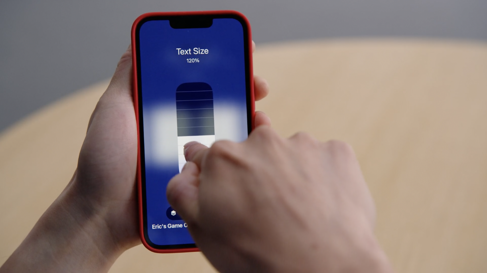

 Apple Accessibility 插件将会给 Unity 无障碍游戏带来巨大飞跃，我们将重点介绍其中的三项技术。第一种， VoiceOver 是一款可以帮助盲人或视力低下用户的屏幕阅读器。它能够读取屏幕上的项目，并为用户提供自定义手势来实现控件交互。


第二种， Switch control 允许行动不便的老人或是残障人士通过额外的开关来控制交互。

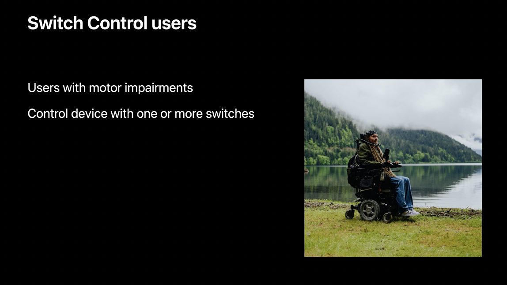

第三种， Dynamic Type 允许用户根据自己的阅读能力设置文本大小。

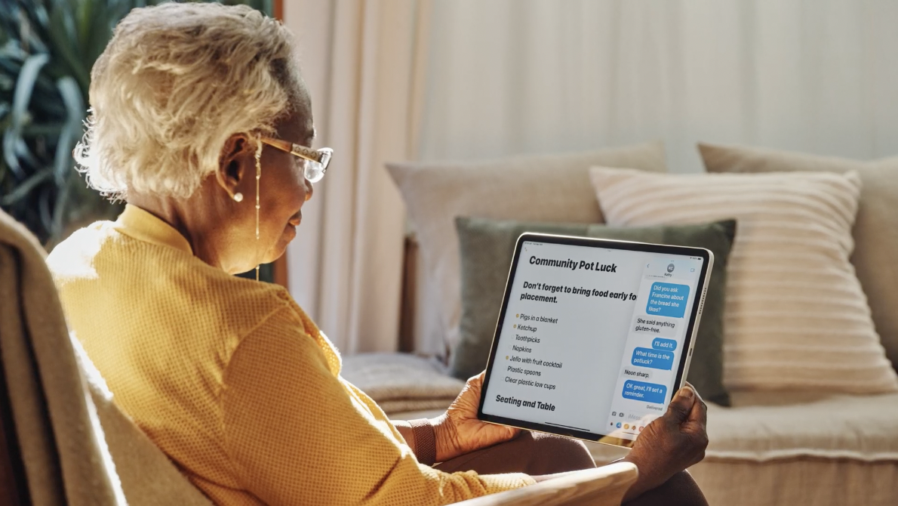

针对视力缺陷的用户，设置支持文本自动缩放，代码示例：

```csharp

public class AccessibilityTextSizeAdjustment : MonoBehaviour
{
    Text axNode;
    int initialSize;

    void Awake()
    {
        axNode = GetComponent<Text>();
        initialSize = axNode.fontSize;
    }

    void Start()
    {
        AdjustTextSize();
    }
    
    // 设置文本自动缩放回调
    private void OnEnable()
    {
        AccessibilitySettings.onPreferredContentSizeChanged += AdjustTextSize;
    }
    
    // 移除文本自动缩放侦听
    private void OnDisable()
    {
        AccessibilitySettings.onPreferredContentSizeChanged -= AdjustTextSize;
    }

    void AdjustTextSize()
    {
        var scale = AccessibilitySettings.PreferredContentSizeMultiplier;
        axNode.fontSize = (int)(scale * initialSize);
    }
}


```

针对盲人的旁白功能以及色盲用户群体的颜色反转，以及针对有运动障碍的切换控制示例代码：

```csharp
internal class AccessibilitySettingsWatcher : MonoBehaviour
{
    public Text voText = null;
    public Text invertText = null;
    public RawImage image = null;
    void Start()
    {
        _updateSettingsText();
       
    }

    void OnEnable()
    {
        // 设置旁白侦听回调函数
        AccessibilitySettings.onIsVoiceOverRunningChanged += _settingChanged;
        // 设置颜色反转侦听回调函数
        AccessibilitySettings.onIsInvertColorsEnabledChanged += _settingChanged;
        // 设置切换控制侦听回调函数
        AccessibilitySettings.onIsSwitchControlRunningChanged += _settingChanged;
    }
    
    void OnDisable()
    {
        // 移除旁白侦听回调
        AccessibilitySettings.onIsVoiceOverRunningChanged -= _settingChanged;
        // 移除颜色反转侦听回调
        AccessibilitySettings.onIsInvertColorsEnabledChanged -= _settingChanged;
        // 移除切换控制侦听回调
        AccessibilitySettings.onIsSwitchControlRunningChanged -= _settingChanged;
    }

    void _settingChanged()
    {
        _updateSettingsText();
    }

    void _updateSettingsText()
    {
        // 获取旁白、颜色反转当前状态
        bool voEnabled = AccessibilitySettings.IsVoiceOverRunning;
        bool invertEnabled = AccessibilitySettings.IsInvertColorsEnabled;
        voText.text = voEnabled ? "VoiceOver: ON" : "VoiceOver: OFF";
        invertText.text = invertEnabled ? "Invert Colors: ON" : "Invert Colors: OFF";
        float hue = 29f / 360f;

        if (!invertEnabled)
        {
            hue += 0.5f;
        }
        // 反转颜色
        image.color = Color.HSVToRGB(hue, 1.0f, 1.0f);
    }
}

```

   > 相关文章推荐
   >
   > [WWDC2018: Deliver an Exceptional Accessibility Experience](https://developer.apple.com/videos/play/wwdc2018/230)
   >
   > [WWDC2018: VoiceOver: App Testing Beyond The Visuals](https://developer.apple.com/videos/play/wwdc2018/226/)
   >
   > [WWDC2019: Accessibility Inspector](https://developer.apple.com/videos/play/wwdc2019/257/)
   >
   > [WWDC2019: Making Apps More Accessible With Custom Actions](https://developer.apple.com/videos/play/wwdc2019/250)
   >
   > [WWDC2020: Make your app visually accessible](https://developer.apple.com/videos/play/wwdc2020/10020)
   >
   > [WWDC2022: Add accessibility to your Unity games](https://developer.apple.com/videos/play/wwdc2022/10151)

### 3. Apple.CoreHaptics

[Core Haptics](https://developer.apple.com/documentation/corehaptics) 可让开发者自定义的触觉和音频反馈添加到应用或是游戏中。通过使用触觉、音频与用户进行物理互动，可以吸引用户注意力并强化他们的行为。一些系统提供的界面元素（如 UISwitch、UISlider、UIPickerView ）会在用户与其交互时自动提供触觉反馈。 使用 Core Haptics，开发者还可以通过组合触觉模式来扩展此功能。

 Core Haptics 里的触觉事件分为持续( Continuous )事件和瞬时( Transient )事件。前者可设置持续时间控制持续振动，后者类似轻敲或者撞击的短暂事件。另外，我们可以控制事件的锐度( sharpness )和强度( intensity )。游戏开发者在播放剧情动画、抽奖页面抽到 SSS 级道具、匹配到对手或是释放大招技能等场景加上触觉反馈，能够提升用户的体验以及趣味性。

若开发者需要使用触觉反馈功能，只需要了解以下四个部分：  

- 创建并启动触觉引擎： CHHapticEngine
- 创建触觉事件： CHHapticEvent
- 创建触觉事件队列容器： CHHapticPattern
- 基于触觉引擎创建播放器： CHHapticPlayer ，并播放触觉事件

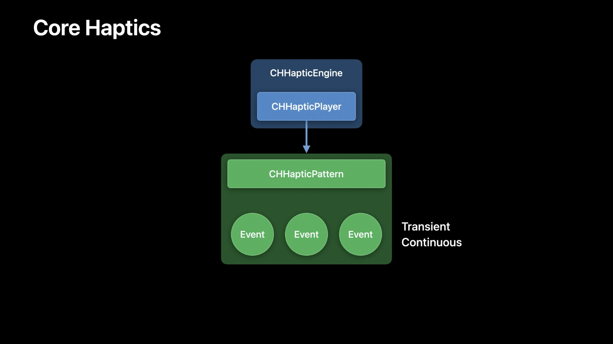

接下来我们提供一个基于 CHHapticAdvancedPatternPlayer 实现的触觉反馈示例：

```C#
using Apple.CoreHaptics;

// 首先，我们需要创建一个触觉引擎
var eng = CHHapticEngine();

// 在合适的时机启动它（过早的启动会导致耗电）
eng.Start();

// 创建一组强度数值从高到低的 CHHapticTransientEvents
var events = new List<CHHapticEvent>();
for (float i = 0; i < 1f; i += 0.1f)
{
    events.Add(new CHHapticTransientEvent { Time = i });
}
var pattern = new CHHapticPattern(
    events,
    new List<CHHapticParameterCurve>
    {
        new CHHapticParameterCurve
        {
            ParameterID = CHHapticDynamicParameterID.HapticIntensityControl,
            ParameterCurveControlPoints = new List<CHHapticParameterCurveControlPoint> {
                new CHHapticParameterCurveControlPoint(0f, 0.25f),     // Time 0, 1/4 intensity
                new CHHapticParameterCurveControlPoint(0.5f, 1f),   // Time 0.5, full intensity
                new CHHapticParameterCurveControlPoint(1f, 0.25f)      // Time 1, back to 1/4 intensity
            }
        }
    }
);

// 创建播放器
var advPlayer = eng.MakeAdvancedPlayer(pattern);

// 设置 loop 属性
advPlayer.LoopEnabled = true;
advPlayer.LoopEnd = 1f;

// 开始播放
advPlayer.Play();

// 关闭播放
advPlayer.Stop();
```

   > 相关文章推荐
   >
   > [WWDC2019: Introducing Core Haptics](https://developer.apple.com/videos/play/wwdc2019/520)
   >
   > [WWDC2021: Practice audio haptic design](https://developer.apple.com/videos/play/wwdc2021/10278#)
   >
   > [小专栏: Core Haptics 初体验](https://xiaozhuanlan.com/topic/0382695741)

### 4. Apple.GameController

[Apple.GameController](https://developer.apple.com/documentation/gamecontroller?language=objc) 支持用户通过物理或虚拟游戏控制器与应用或游戏进行交互。目前游戏控制器支持以下产品： DualShock 4 、DualSense 和 Xbox ，以及鼠标、键盘和 Siri Remote 。在游戏中，物理控制器被表示成 [GCController](https://developer.apple.com/documentation/gamecontroller/gccontroller?language=objc) 对象。当连接控制器时，游戏控制器框架会自动创建一个 GCController 对象。然后，开发者可以使用此对象来配置控制器并读取其输入的数据。

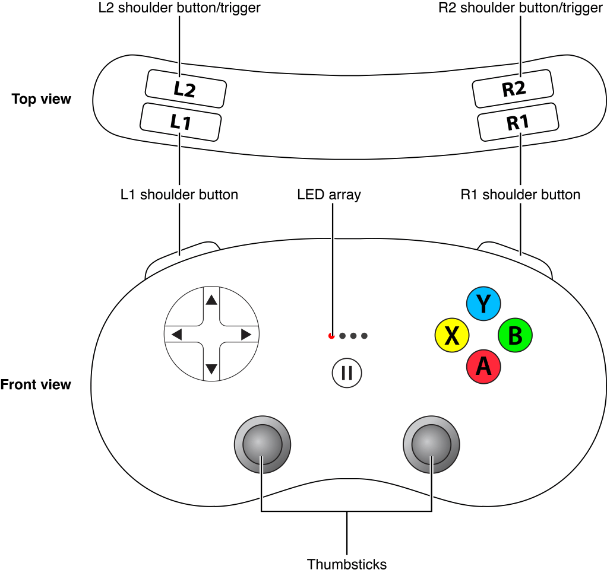

开发者的游戏与 GameController 交互大致以下步骤：

- 初始化 Game Controller 服务
- 注册连接控制器的回调
- 搜索玩家的无线设备
- 获取已连接的控制器
- 通过轮询控制器，建立持续的输入指令通道
- 获取外设的指令，并在游戏里做出动作响应
- 控制器回调事件处理
- 其它，例如：获取控制器详细信息或特征值

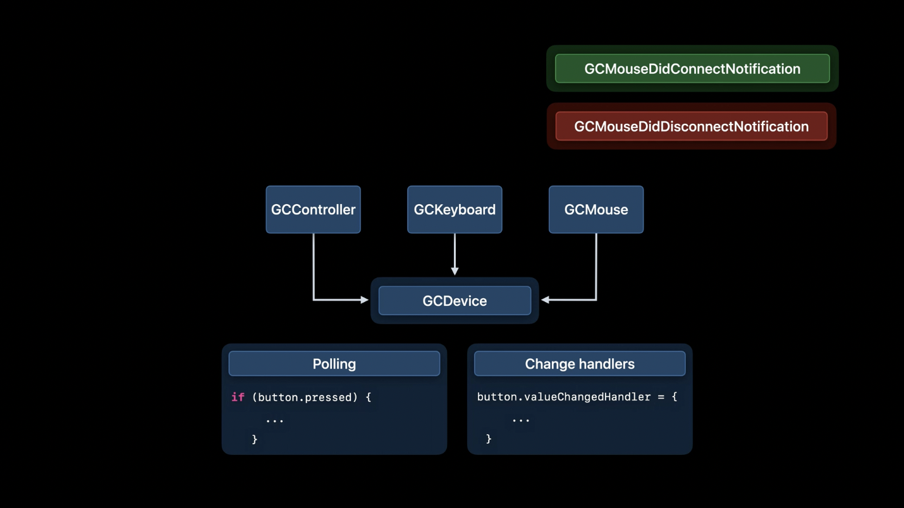

代码示例：

```csharp
// 初始化控制器服务
await GCControllerService.Initialize();

// 注册连接和断开回调
GCControllerService.ControllerConnected += OnControllerConnected;
GCControllerService.ControllerDisconnected += OnControllerDisconnected;

var controllers;
var controller;

private void OnControllerConnected(object sender, ControllerConnectedEventArgs args)
{
    // 关闭无线搜寻外设
    GCControllerService.StopWirelessDiscovery();
    
    // 获取已经连接
 controllers = GCControllerService.GetConnectedControllers();
  
 // 获取其中一个外设控制器，实际开发中需要考虑多外设的情况，分别做出响应
 if (controllers != null && controllers.Count > 0) controller = controllers[0];
}

private void OnControllerDisconnected(object sender, ControllerConnectedEventArgs args)
{
    // 当外设断开连接时候，根据实际需要是否重新搜索
}

// 开启无线搜寻外设
await GCControllerService.StartWirelessDiscovery();

// 开启对所有控制器的轮询，建立状态通道
GCControllerService.PollAllControllers();

if(controller != null && controller.GetButton(GCControllerInputName.ButtonA))
{
    // 对 ButtonA 点击事件进行响应
}


```

   > 相关文章推荐
   >
   > [WWDC2019: Supporting New Game Controllers](https://developer.apple.com/videos/play/wwdc2019/616)
   >
   > [WWDC2020: Advancements in Game Controllers](https://developer.apple.com/videos/play/wwdc2020/10614)
   >
   > [WWDC2021: Tap into virtual and physical game controllers](https://developer.apple.com/videos/play/wwdc2021/10081)
   >
   > [NextPrevious
Incorporating Controllers into Your Game](https://developer.apple.com/library/archive/documentation/ServicesDiscovery/Conceptual/GameControllerPG/IncorporatingControllersintoYourDesign/IncorporatingControllersintoYourDesign.html)

### 5. Apple.GameKit

[GameKit](https://developer.apple.com/documentation/gamekit?language=objc) 允许玩家能与朋友互动、提供排行榜排名、获得成就以及能够参与多人游戏。因此，开发者可以通过使用 GameKit 框架为游戏实现 Game Center 社交功能。补充说明， Game Center 是一项 Apple 服务，它提供了一个单一帐户，可以在所有游戏和设备上识别到这个玩家。玩家在他们的设备上登录 Game Center 后，他们可以访问他们的朋友以及其它 Game Center 功能。在今年的 [WWDC](https://developer.apple.com/videos/play/wwdc2022/10064) 中， Apple 给我们介绍了使用 Game Center 仪表板吸引新玩家。通过仪表盘可以更直观地让玩家看到成就、高分记录、排行榜的变化，激发玩家的游戏热情。

另外，玩家可以在 App Store 游戏详情页面可以看到正在玩此款游戏的好友。

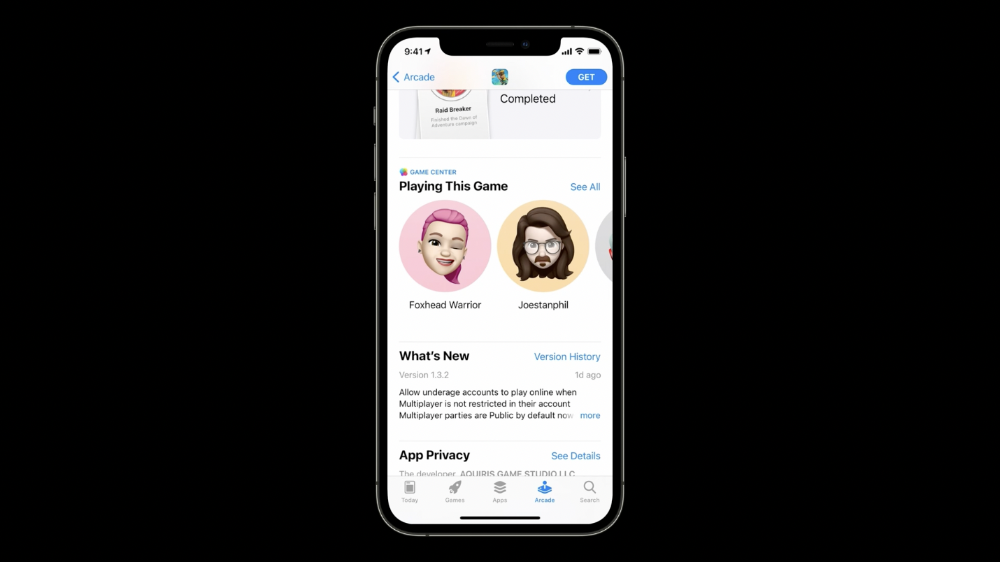

开发者可以为游戏添加排行榜，让玩家了解他们在世界各地的朋友和玩家中的排名。另外，实时排行榜和定期比赛，可以激发玩家的玩游戏欲望，并且玩家还可以通过解锁各种成就来获得额外的奖励。

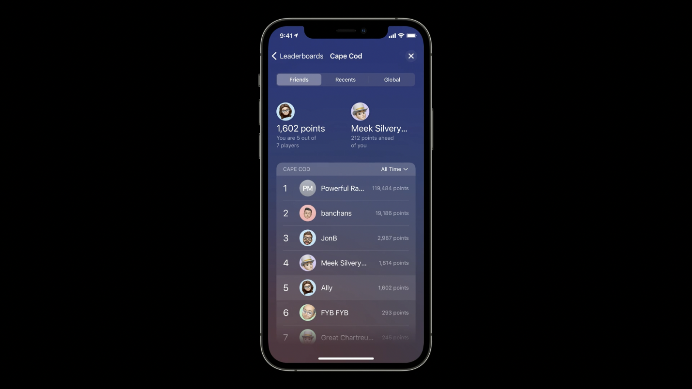

GameKit 支持实时和回合制多人游戏，玩家可以选择自动匹配或邀请好友一起游戏。

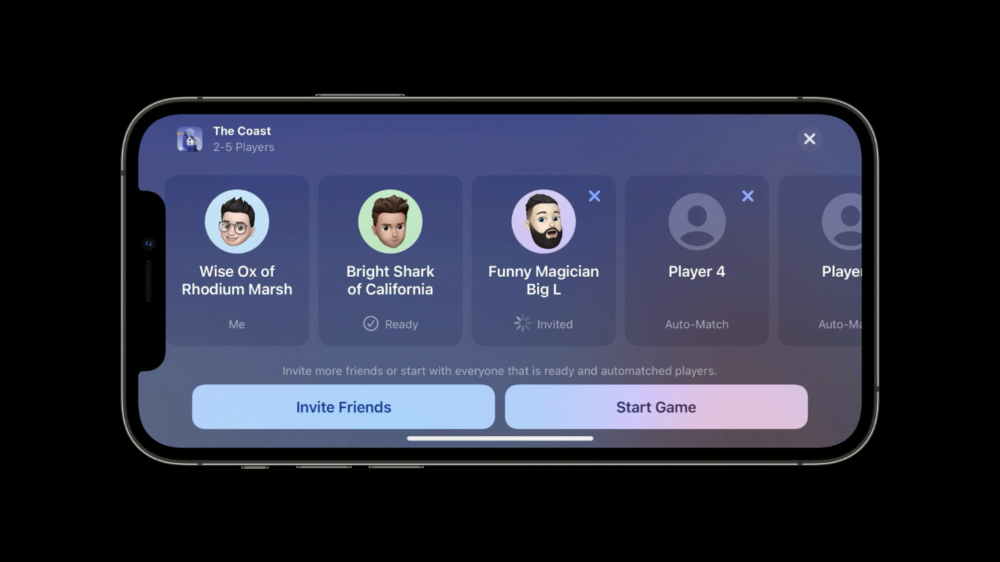

另外，即使游戏不在前台，玩家也可以收到好友的游戏邀请。

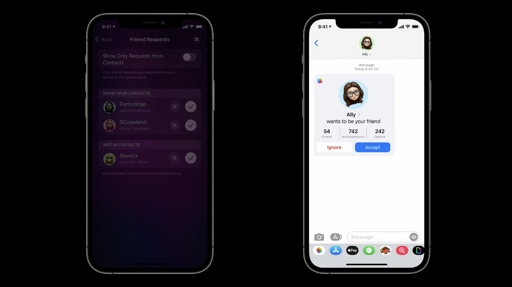

GameKit 还为玩家提供了用户界面组件，可以在游戏中直接查看[精彩片段](https://xiaozhuanlan.com/topic/1068759324)并访问他们的 Game Center 数据。例如，他们可以浏览个人资料、排行榜和成就，以及管理好友列表。

由于对 GameKit 的大多数调用都是异步的，因此公共方法是基于 `Task` 或 `Task<>` 的。如果 GameKit 报告错误，将抛出 GameKitException 。所以，开发者需要使用 `try -catch` 来正确处理异常。

接下来我们看下基础功能代码示例：

```C#
try
{
  // Auth 认证
  var player = await GKLocalPlayer.Authenticate();
  Debug.Log($"GameKit Authentication: isAuthenticated => {player.IsAuthenticated}");
  
  // 获取已经授权访问的好友列表
  var friends = await GKLocalPlayer.Local.LoadFriends();

  // 获取可以向其发起挑战的玩家列表
  var challengeableFriends = await GKLocalPlayer.Local.LoadChallengeableFriends();

  // 获取最近一起游戏过的好友列表
  var recentPlayers = await GKLocalPlayer.Local.LoadRecentPlayers();
  
  // 获取成就列表
  var achievements = await GKAchievement.LoadAchievements();
  foreach(var a in achievements) 
  {
    Debug.Log($"Achievement: {a.Identifier}");
  }
  
  // 上报成就
  var achievementId = "a001";
  var progressPercentage = 100;
  var showCompletionBanner = true;
  var achievements = await GKAchievement.LoadAchievements();
  var achievement = achievements.FirstOrDefault(a => a.Identifier == achievementId);
  achievement ??= GKAchievement.Init(achievementId);
  if(!achievement.IsCompleted) {
      achievement.PercentComplete = progressPercentage;
      achievement.ShowCompletionBanner = showCompletionBanner;
      // 也可以同时解锁多个成就
      await GKAchievement.Report(achievement, ...);
  }
  
  // 重置成就
  await GKAchievement.Reset();
  
  // 打开成就、排行榜面板
  var gameCenter = GKGameCenterViewController.Init(GKGameCenterViewController.GKGameCenterViewControllerState.Achievement);
  // 将会等待玩家关闭面板
  await gameCenter.Present();
}
catch(GameKitException exception)
{
  Debug.LogError(exception);
}

// 获取本地用户信息
var localPlayer = GKLocalPlayer.Local;
Debug.Log($"Local Player: {localPlayer.DisplayName}");

```

再看下进阶功能代码示例：

```C#
try
{
  // 对战请求初始化以及玩家数设置
  var matchRequest = GKMatchRequest.Init();
  matchRequest.MinPlayers = 2;
  matchRequest.MaxPlayers = 2;
  // 获取对战对象，并设置回调
  GKMatch match = await GKMatchmakerViewController.Request(matchRequest);
  match.DataReceived += OnMatchDataReceived;
  match.DataReceivedForPlayer ++ OnMatchDataReceivedForPlayer;
  match.DidFailWithError += OnMatchErrorReceived;
  match.PlayerConnectionStateChanged += OnMatchPlayerConnectionStateChanged;

  private void OnMatchDataReceived(byte[] data, GKPlayer fromPlayer)
  {
    // 处理对战数据
  }

  private void OnMatchDataReceivedForPlayer(byte[] data, GKPlayer forRecipient, GKPlayer fromPlayer)
  {
    // 处理对战玩家的数据
  }

  private void OnMatchErrorReceived(GameKitException exception)
  {
    // 处理接收的对战错误
  }

  private void OnMatchPlayerConnectionStateChanged(GKPlayer player, GKPlayerConnectionState state)
  {
    // 处理对战玩家的连接状态
  }
  
  // 邀请玩家到对战中
  await GKMatchmaker.Shared.AddPlayers(match, matchRequest);
  
  // 取消对战请求
  GKMatchmaker.Shared.Cancel();
  
  // 断开对战
  match.Disconnect();
  
  // 给选择的玩家发消息
  var players = new GKPlayer[] { ... };
  var data = Encoding.ASCII.GetBytes("Hello World");
  match.SendToPlayers(data, players, GKSendDataMode.Reliable);
  
  // 创建语音对话通道
  var channel = match.VoiceChat("myChannelName");
  channel.Start();
  
  var score = 100;
  var context = 0;

  // 提交积分
  await leaderboard.SubmitScore(score, context, GKLocalPlayer.Local);
}
catch(GameKitException exception)
{
  Debug.LogError(exception);
}

```

Apple 近几年持续为游戏社交带来了很多新特性，在这里不得不感叹一声：给力！但是，随着近几年游戏出海全球化战略、跨平台兴起，尤其是移动端游戏，考虑到安卓端的大量用户，目前市场上已经很难出现 iOS 独占游戏。安卓商店更是良莠不齐(还活着的非谷歌安卓商店至少有 50 家)，谷歌商店是有成就相关功能，但是不能跟 Apple GameKit 提供的其它功能一一对齐。再加上大陆是没有办法使用谷歌商店一些特性，对中国大陆发行的游戏来说，由于没有办法在 iOS 和 Android 双端保持一致的功能，那么游戏厂商会放弃苹果提供的某些功能，而是由游戏内直接实现。《原生》游戏的跨端成功，对于很多游戏公司来说也是一次学习和探索的机会，除了考虑移动端，还得兼顾 PC 、 Switch 端的发行可能。 GameKit 提供的独有功能优势将会变得更低。不过，对于一些轻度、休闲的游戏，且对双端功能不追求一致性，只是为了获得 iOS 侧更多用户的开发商来讲，还是非常有吸引力的。

   > 相关文章推荐
   >
   > [Apple.GameKit Usage](https://github.com/apple/unityplugins/blob/main/plug-ins/Apple.GameKit/Apple.GameKit_Unity/Assets/Apple.GameKit/Documentation~/Apple.GameKit.md)
   >
   > [WWDC2020: Design for Game Center](https://developer.apple.com/videos/play/wwdc2020/10145/)
   >
   > [WWDC2020: Tap into Game Center: Dashboard, Access Point, and Profile](https://developer.apple.com/videos/play/wwdc2020/10618/)
   >
   > [WWDC2021: What’s new in Game Center: Widgets, friends, and multiplayer improvements](https://developer.apple.com/videos/play/wwdc2021/10066)
   >
   > [WWDC2022:
Reach new players with Game Center dashboard](https://developer.apple.com/videos/play/wwdc2022/10064)

### 6. Apple.PHASE

[PHASE (Physical Audio Spatialization Engine)](https://developer.apple.com/documentation/phase?language=objc) 能够帮助开发者为应用程序和游戏构建复杂、交互式和身临其境的音频场景。 PHASE 可以实时控制声音层并调整音频参数，帮助开发者在开发过程中创建空间音景和场景，而不是等到后期制作阶段。另外，开发者还可以使用 PHASE 结合视觉场景的动态变化，给出动态且有空间属性的音频反馈，提升应用或游戏的整体体验。

在过去，开发者需要做出大量修改才能实现应用或游戏模拟复杂环境音。现在，开发者在熟悉了 PHASE 后，开发者只需要根据配置场景不同音频的参数，就能实现复杂环境音。并且，当开发者修改场景（例如添加游戏关卡）时，音频会跟随关卡的视觉变化而变化。 PHASE 将声音与视觉相结合，通过以下四种方式可以最大限度地减少音频维护的成本：

- 发生场景对象遇到一些几何体阻碍，音量将会衰减。例如，当玩家躲在墙后时，PHASE 会降低来袭火球的音量。
- 在您的应用或是游戏运行时提供复杂的声音事件。
- 根据不同空间物体的形状产生不同的音效。当您向 PHASE 提供场景对象的形状时，音量会根据玩家相对于该形状的距离和方向进行衰减。
- PHASE 为开发者提供添加混响和定时音频反射功能，可以制造环境效果并模拟室内场景。

PHASE 主要包含四个部分，包括 Sources 、 Listeners 、 Acoustic Geometry 和 Materials 。如果想更系统的学习 PHASE ，可以参考去年老司机小专栏文章：[《使用 PHASE 探索几何感知的音频》](https://xiaozhuanlan.com/topic/5479286310)。

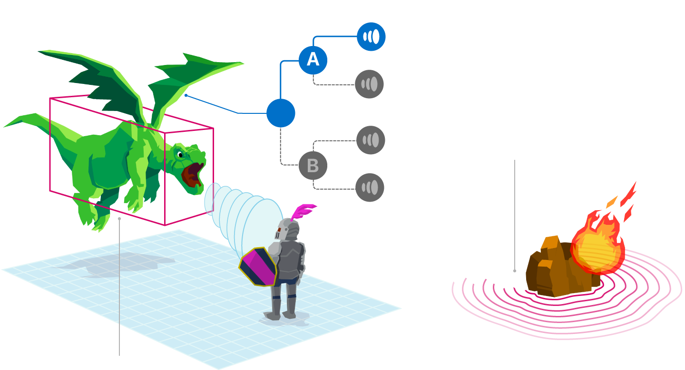

我们来看一下 Sample 里实现的 PHASE 混响自定义面板：

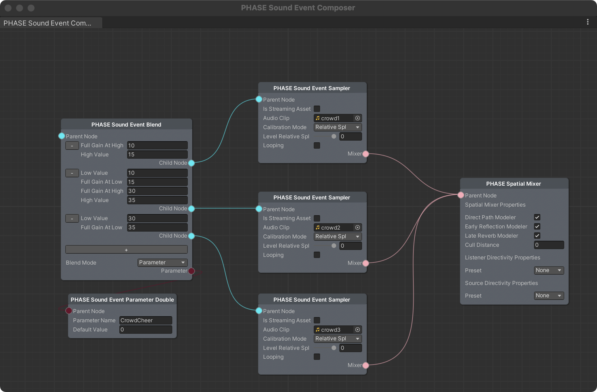

触发上述音效的代码逻辑：

```csharp

using UnityEngine;
using Apple.PHASE;

public class AmbienceBlender : MonoBehaviour
{
    [Range(0.0f, 50.0f)]
    [SerializeField] private float _crowdBlend = 0.0f;

    [SerializeField] private PHASESource _source = null;

    // Update is called once per frame
    void Update()
    {
        _source.SetMetaParameterValue("CrowdCheer", _crowdBlend);
    }
}

```

通过类似蓝图这样的自定义面板来实现声音的合成、编辑，非常有利于非软件技术出身的音频同事来进行游戏的音效设计。合理的分工，利用 PHASE 赋予音效的能力，结合视角的变幻，将会给游戏玩家带来沉浸式体验。

   > 相关文章推荐
   >
   > [Apple.PHASE Usage](https://github.com/apple/unityplugins/blob/main/plug-ins/Apple.PHASE/Apple.PHASE_Unity/Assets/Documentation~/Apple.PHASE.md)
   >
   > [WWDC2021: Discover geometry-aware audio with the Physical Audio Spatialization Engine (PHASE)](https://developer.apple.com/videos/play/wwdc2021/10079/)
   >
   > [小专栏: 使用 PHASE 探索几何感知的音频](https://xiaozhuanlan.com/topic/5479286310)

## 如何下载、编译、引入 Unity 插件

如果您是使用 Unity 插件的新手，这一部分内容可以帮助您快速上手。

#### 环境要求

- Python3
- npm
- Xcode
- Unity 2020.3.33f1

   > 特别说明：
   >
   > 苹果官方强烈建议使用 Unity 2020.3.33f1 进行编译插件。待编译完成后，可以给到更高的 Unity 版本使用。
   >

### 1. 从 Github 下载 [Unity 插件源码](https://github.com/apple/unityplugins)

```bash
git clone https://github.com/apple/unityplugins.git
```

该仓库下，包含 6 个插件的源码以及对应的文档说明，编译脚本 `build.py` 。其中 Apple.Core 是必须要导入的，其它 5 个插件可以根据需要导入。

| Plug-In | Readme |
|:--------|:------|
| Apple.Core | [Apple.Core Documentation](../plug-ins/Apple.Core/Apple.Core_Unity/Assets/Apple.Core/Documentation~/Apple.Core.md) |
| Apple.Accessibility | [Apple.Accessibility Documentation](../plug-ins/Apple.Accessibility/Apple.Accessibility_Unity/Assets/Apple.Accessibility/Documentation~/Apple.Accessibility.md) |
| Apple.CoreHaptics | [Apple.CoreHaptics Documentation](../plug-ins/Apple.CoreHaptics/Apple.CoreHaptics_Unity/Assets/Apple.CoreHaptics/Documentation~/Apple.CoreHaptics.md) |
| Apple.GameController | [Apple.GameController Documentation](../plug-ins/Apple.GameController/Apple.GameController_Unity/Assets/Apple.GameController/Documentation~/Apple.GameController.md) |
| Apple.GameKit | [Apple.GameKit Documentation](../plug-ins/Apple.GameKit/Apple.GameKit_Unity/Assets/Apple.GameKit/Documentation~/Apple.GameKit.md) |
| Apple.PHASE | [Apple.PHASE Documentation](../plug-ins/Apple.PHASE/Apple.PHASE_Unity/Assets/Documentation~/Apple.PHASE.md) |

### 2. 编译

调用苹果给我们写好的脚本：

```bash
cd  xxx/unityplugins (进入到下载下来的仓库里，然后执行下面命令)
python3 build.py
```

作者本地执行过程中遇到了下述 ⚠️ ：

```
STDOUT:
xcode-select: error: tool 'xcodebuild' requires Xcode, but active developer directory '/Library/Developer/CommandLineTools' is a command line tools instance

[WARNING]: No Unity installation tracked with version: 2020.3.33f1
```

第一个问题是环境设置问题，需要打开 Xcode -> Preference -> Locations -> Command Line Tools ,勾选安装的 Xcode 版本。

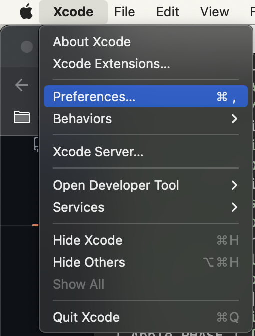
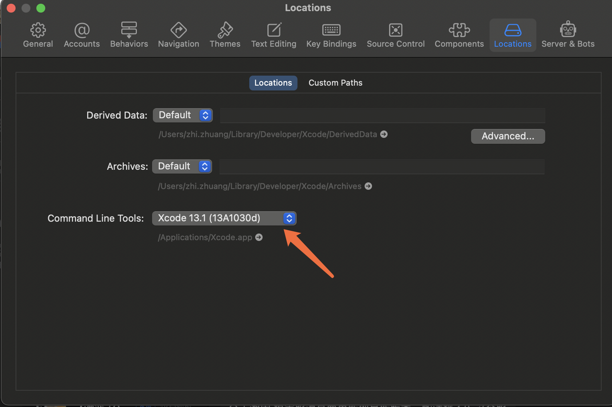

第二个问题是由于本地没有安装 Unity 2020.3.33f1 或是安装的路径跟脚本里默认的路径不一致导致。我们需要指定我们本地的 Unity 安装路径即可。例如作者本地的 Unity 路径是 `/Applications/2021.3.3f1c1` ，那我们只要使用以下命令:

```bash
python3 build.py -u /Applications/2021.3.3f1c1
```

编译成功后，可以在本地看到编译后的库，以 `.tgz` 结尾:

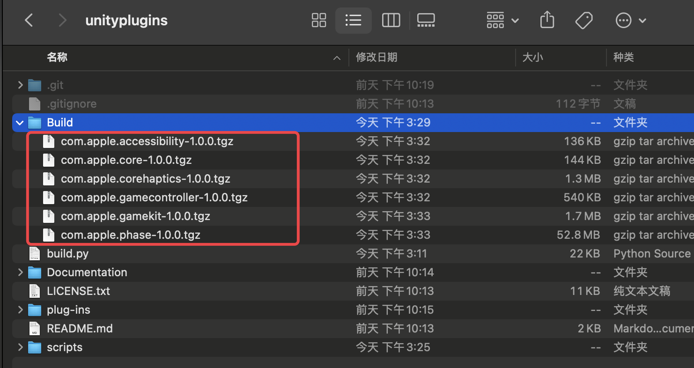

### 3. 将库导入到 Unity 项目里

1、作者使用了 Unity 官方提供的游戏学习项目，打开 Unity 项目 -> Window -> Package Manager :

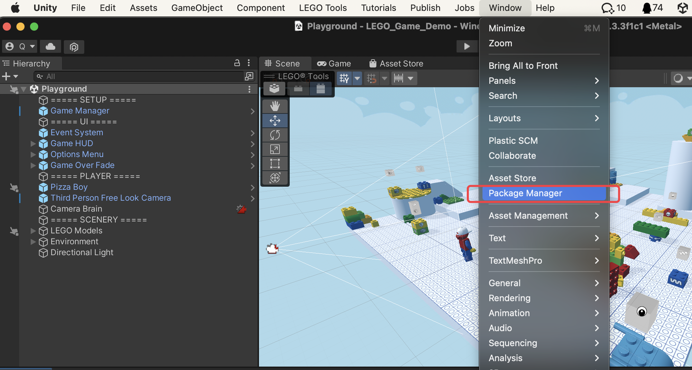

2、选择 `Add package from tarball...` ,然后将上文编译的 `xxx.tgz` 文件导入:

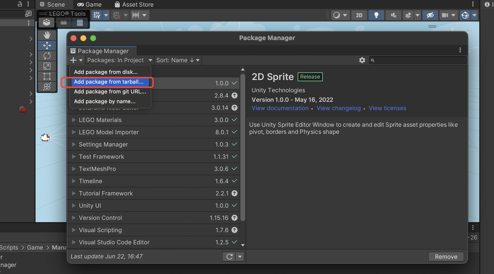

3、这里我们将 6 个库全部导入，如图:

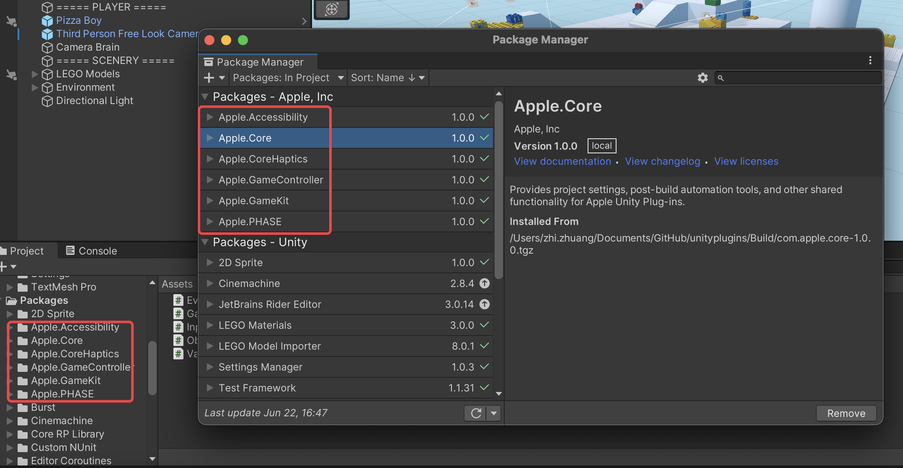

4、打开项目配置，我们可以看到插件还在 Unity 里定制了配置界面，如图:

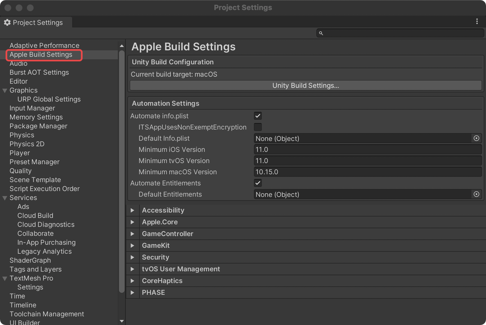

5、若发现导入的库报错 `xxx has no meta file, but it's in an immutable folder. The asset will be ignored` ，可以在 Package Manager 里移除之前的 6 个插件。然后将之前编译好的 `xxx.tgz` 解压，再打开 Package Manager ，选择 `Add package from disk...` ，找到 `xxx.tgz` 解压后的文件夹，选择里面的 `package.json` 方式导入插件库。导入完以后，将不会报错，可以正常使用这些插件库。

6、接下来在项目里引入插件库，接着可以根据上文第二部分描述的使用方式或是官方开发者网站提供的 API 进行开发。

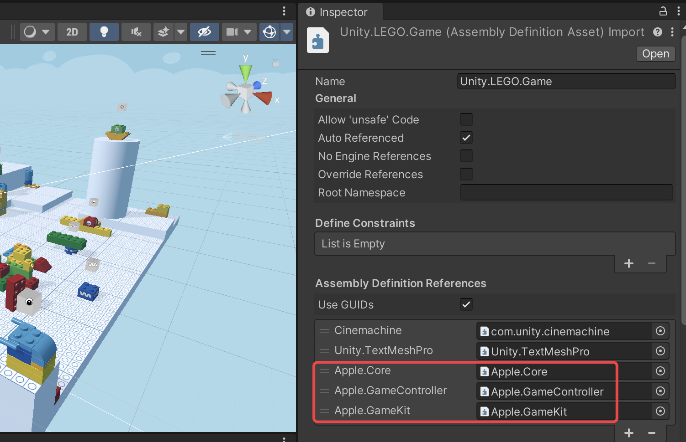

由于 Apple 插件库是苹果系平台独有功能,建议在调用相关 API 时候，在需要的情况下判断下平台，不然在其它平台运行会报错。代码示例:

```csharp

async void Start()
{
    // 判断平台
    if (Application.platform == RuntimePlatform.IPhonePlayer || Application.platform == RuntimePlatform.OSXPlayer)
    {
        try
        {
            GKLocalPlayer _localPlayer = await GKLocalPlayer.Authenticate();
            Debug.Log($"GameKit Authentication: isAuthenticated => {_localPlayer.IsAuthenticated}, displayName: {_localPlayer.DisplayName}");
        }
        catch (System.Exception exception)
        {
            Debug.LogError(exception);
        }
    }
    else
    {
        // 其它平台逻辑
    }
}

```

## 使用 Apple 的六个 Unity 插件使用的场景或是注意点

首先，还是非常感谢 Apple 为我们提供的六个 Unity 插件，这让很多不熟悉 ObjC 或是 Swift 的 Unity 开发者减轻了学习新语言的成本，就可以直接通过 C# 完成 Apple 的这些插件功能调用。另外一方面，也方便了 Unity 开发者可以更容易的控制 Unity 项目编译前后的流程把控与参数配置。最近几年不断地为游戏提供新特性，也让我们看到了 Apple 对游戏开发者的重视。不过这些插件很多功能特性是 Apple 平台独有，所以开发者在调用这些功能时候，一定要注意当前平台是否可以使用。

关于这些插件使用的注意点总结：

- Apple.Core 是使用其它插件的基础，若使用其它五个插件的任意一个，都必须导入 Apple.Core 。另外， Apple.Core 还提供的编译前后控制以及 Info.plist 设置、权限设置等功能，是推荐开发者早日使用的。
- Game Center 里提供了登录认证、成就系统、积分榜、仪表盘、多人对战邀请、游戏语音频道等功能极大地提升了游戏了竞技性和互动性。但是在使用这些功能时候，要考虑多端实现的问题，会有功能不对齐的陷阱，还是要整体考虑。
- Game Controller 为玩家提供了外设控制的功能，对于一些操作性要求较高的游戏，比如篮球、足球、赛车、格斗等这些题材的游戏，还是非常推荐使用该插件。不过，要提醒的一点是，使用外设的玩家相比不使用外设的玩家是占据优势的。所以，开发者如果使用该插件一定要考虑下公平性原则，比如使用外设的玩家匹配到一起竞技。
- Accessibility 为儿童、老人、残障人士提供了旁白、颜色反转、字体放大等很多很棒的特性。虽然目前很多游戏并没有很好的支持这一用户群体，但还是希望各个游戏厂商能够提供无障碍的功能，帮助这一群体尽可能的像正常人一样参与到竞技中来。
- Core Haptics 提供的触觉和音频反馈，能够提升我们游戏的体验性。例如，对战匹配成功、大招技能释放等场景合理使用触觉反馈，能够给玩家带来不一样的体验。
- PHASE 能够为游戏构建复杂、交互式和身临其境的音频场景。对于那些重度游戏，且游戏厂商对游戏品质追求高的游戏，推荐尽快使用该功能。
