# Session 10066 - 探索 Matal 3

本文基于 [Session 10066](https://developer.apple.com/videos/play/wwdc2022/10066/)，[Session 10101](https://developer.apple.com/videos/play/wwdc2022/10101/)以及[Session 10104](https://developer.apple.com/videos/play/wwdc2022/10104/) 梳理。

Metal 是 Apple 的高效低销图形计算 `API` 。它旨在以最快、最高效的方式驱动 `Apple` 产品背后强大的 `GPU`。它提供对 `GPU` 命令的线程或直接控制、支持显式着色器编译的丰富着色语言，以及有帮助调试和分析复杂应用程序和游戏的深度集成工具。
自推出以来，`Metal` 着重于 `GPU` 驱动的渲染、机器学习和光线追踪添加了许多高级图形和计算功能。
`Apple` 芯片为每台新 `Mac` 上令人难以置信的图形性能和效率铺平了道路，而 `Metal` 解锁了这些功能。今年，`Metal` 凭借 `Metal 3` 迈向了一个新的高度。
`Metal 3` 是一组强大的新功能，可实现更高的性能和渲染质量，帮助您的应用和游戏运行得更快，看起来更棒。

## 功能

### 快速资源加载

现代游戏和应用程序对资源加载有很高的要求，从文件中快速传输小的资源请求到用户的 `Metal` 资源，对高质量视觉效果尤为关键，但是现有的存储 `API` 基本是为大型、批量请求而设计的。
在 `Metal 3` 中，用户可以使用与图形和计算相同的显式多线程命令模型、快速资源加载来应对许多小负载请求。每个请求都是一个命令，多个命令可以排队等待，异步提交。它会直接加载到 `Metal` 缓冲区和纹理中，无需额外步骤，从而节省开发工作量和传输时间。借助 `Metal` 的同步原语，开发者还可以轻松地在 `GPU` 操作和加载操作之间进行协调。
纹理的流系统真正受益于快速资源加载，让我们来看一个例子。
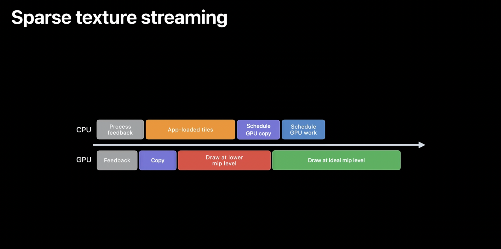

`Metal` 稀疏贴图允许应用程序以瓦片粒度流式传输纹理。
基于 `Metal` 稀疏贴图构建的纹理流送系统包括四个步骤：首先，根据前一帧的反馈决定加载什么。其次，从文件存储中加载瓦片。再次，从暂存区复制到稀疏贴图。最后，画出这一帧。
加载和复制所需的时间越长，意味着应用以较低质量绘制的时间越长。

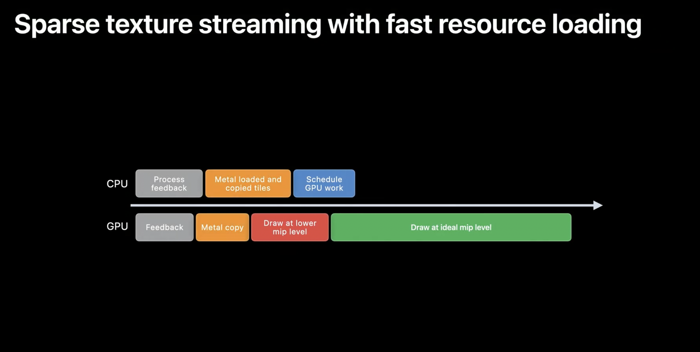

#### 游戏中资源加载的实例

游戏通常会在首次启动或新关卡开始时显示加载屏幕，以便将游戏资源加载到内存中。随着玩家在关卡中移动，游戏会为场景加载更多资源。这个做法的缺点是当游戏向存储系统发出多个请求以预先加载资产时，玩家必须等待很长时间。此外，这些资产可能会占用大量内存。
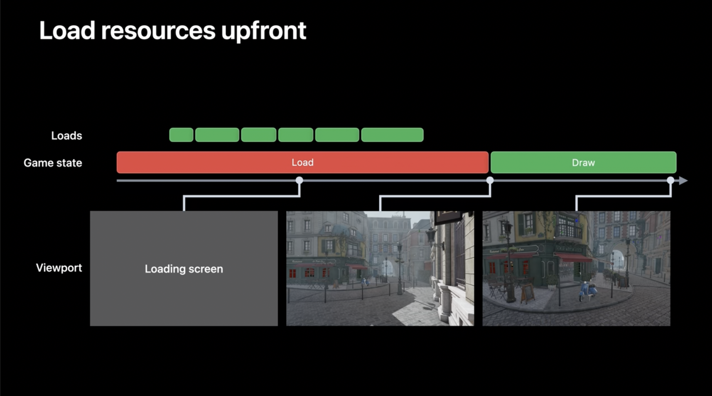
下述方法可以改善这个体验：

##### 动态流式传输对象

通过在玩家靠近对象时动态流式传输对象可以改善这种体验，游戏一开始只加载它需要的内容，然后随着玩家通过关卡逐渐流式传输其他资源。
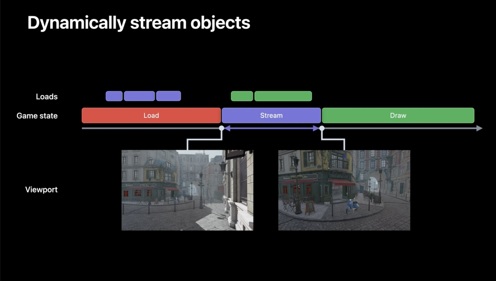[](./images/dynamically_stream_objects2.png)
例如，游戏最初以较低的分辨率加载这个木板，但当玩家走向它时，游戏会加载更高分辨率的版本。这种方法减少了玩家在加载屏幕时的等待时间。

##### 降低颗粒度

即使近距离播放，玩家仍可能在场景中看到低分辨率项目，因为加载高分辨率版本需要很长时间。解决此问题的一种方法是流式传输每个资源的较小部分。例如，游戏可以仅使用稀疏纹理加载场景的可见区域，而不是整个 `mip` 级别的。这大大减少了应用需要流式传输的数据量。
使用这种方法，负载请求变小，但请求数量变多了。但这没关系，因为现代存储硬件可以一次运行多个加载请求。这意味着用户可以在不影响游戏玩法的情况下增加场景的分辨率和规模。除了发出大量的小负载请求外，我们还可以对负载请求进行优先级排序，以确保高优先级请求及时完成。

下面向您展示 `Metal 3` 的快速资源加载如何帮助您做到这一点。

#### 关键功能和 API

快速资源加载是一种从存储中加载资源的异步 API。与现有的加载 API 不同，发出加载的线程不需要等待加载完成。加载操作同时执行以更好地利用更快存储的吞吐量。您可以批量加载操作以进一步最小化资源加载的开销。最后，使用 `Metal 3`，可以优先考虑加载操作以降低延迟。加载资源分为三个步骤：

- 打开文件
- 发出必要的加载命令
- 将这些加载命令与渲染工作同步。

下面将逐一介绍。

1. 通过创建 `Metal` 文件句柄打开一个文件
可以通过使用 `Metal` 的设备单例创建文件句柄来打开现有文件。例如，此代码使用 `Metal` 设备实例通过使用文件路径 `URL` 调用其新的 `makeIOHandle` 方法来创建文件句柄。

```python
var fileIOHandle: MTLIOPFileHandle!
do {
   try fileHandle = device.makeIOHandle(url: filePath)
} catch {
   print (error)
}
```

2. 通过创建 IO 命令队列和 IO 命令缓冲区来发出加载命令
一旦有了文件句柄，就可以使用它来发出加载命令。
这是应用程序中的一个典型场景，它执行加载操作并编码 `GPU` 工作。使用现有的加载 `API`，应用程序必须等待加载工作完成，然后才能对渲染工作进行编码。
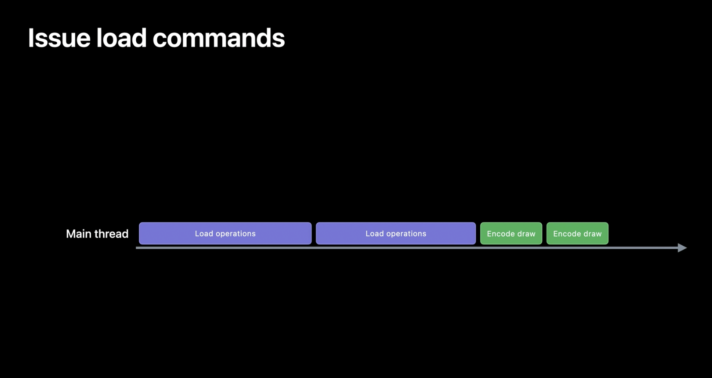
`Metal 3` 让您的应用程序异步执行加载命令。它创建一个 `Metal IO` 命令队列。然后使用该队列创建 `IO` 命令缓冲区并将加载命令编码到这些缓冲区。但是，由于命令缓冲区在命令队列上异步执行，因此您的应用无需等待加载操作完成。事实上，不仅 `IO` 命令缓冲区内的所有命令同时执行，`IO` 命令缓冲区本身也同时执行并无序完成。
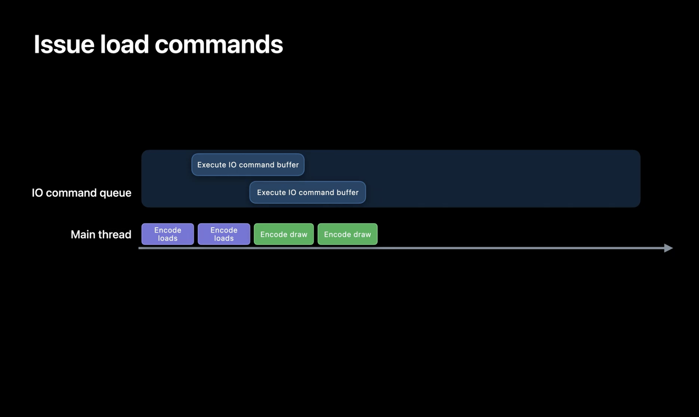
这种并发执行的模型通过最大化吞吐量更好更快地利用了存储硬件。

可以将三种类型的 IO 命令编码到命令缓冲区： 

- loadTexture，加载到 Metal 纹理以进行纹理流式传输
- loadBuffer，加载到 Metal 缓冲区以流式传输场景或几何数据
- loadBytes，它加载到 CPU 可访问的内存。

将加载命令编码到命令缓冲区以在队列上执行
要创建队列，首先制作并配置一个 `IO` 命令队列描述符。默认情况下，队列是并发的，但也可以将它们设置为按顺序完全按顺序运行命令缓冲区。然后将队列描述符传递给 `Metal` 设备实例的 `makeIOCommandQueue` 方法。

```cpp
// Create a Metal IO command queue
let commandQueueDescriptor = MTLIOCommandQueueDescriptor()

commandQueueDescriptor.type = MTLIOCommandQueueType.concurrent // or serial

var ioCommandQueue: MTLIOCommandQueue!
do {
   try ioCommandQueue = device.makeIOCommandQueue(descriptor: commandQueueDescriptor)
} catch {
   print(error)
}
```

通过调用命令队列的 `makeCommandBuffer` 方法创建一个 `IO` 命令缓冲区。然后使用该命令缓冲区对加载纹理和缓冲区的加载命令进行编码。`Metal` 的验证层将在运行时捕获编码错误。加载命令使用之前创建的 `fileHandle` 实例。将加载命令添加到命令缓冲区后，通过调用命令缓冲区的提交方法将其提交到队列以执行。

```cpp
// Create Metal IO Command Buffer
let ioCommandBuffer = ioCommandQueue.makeCommandBuffer()

// Encode load commands
// Encode laod texture and load buffer commands
ioCommandBuffer.load(texture, slice: 0, level: 0, size: size,
                     sourceBytesPerRow: bytesPerRow, sourceBytesPerImage: bytesPerImage,
                     destinationOrigin: fileHandle, sourceHandleOffset: 0)
                     
ioCommandBuffer.load(buffer, offset: 0, size: size,
                     sourceHandle: fileHandle, sourceHandleOffset: 0)
// Commit command buffer for execution
ioCommandBuffer.commit()
```

3. 同步加载和渲染

应用程序通常在完成为该渲染加载资源后开始其渲染工作。但是使用快速资源加载的应用程序需要一种将 IO 命令队列与渲染命令队列同步的方法。这些队列可以与 `Metal` 共享事件同步。
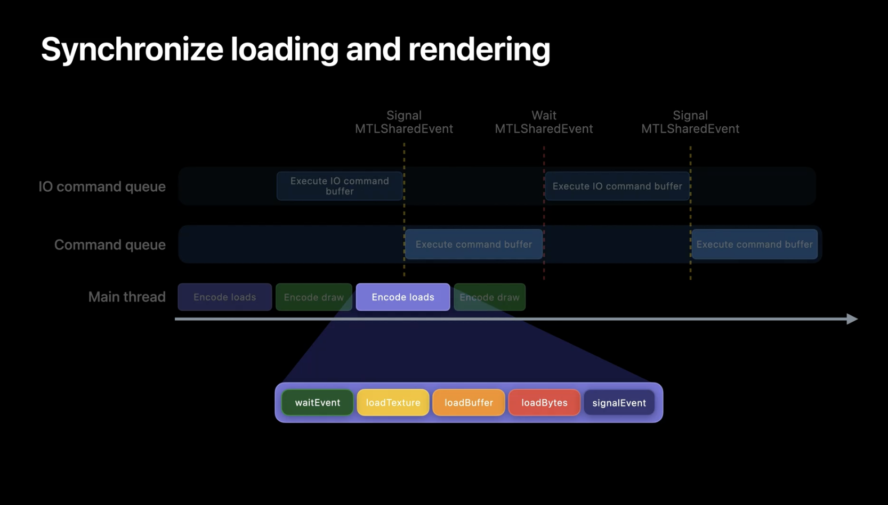
`Metal hared` 事件可以将 `IO` 队列中的命令缓冲区与渲染队列中的命令缓冲区同步。通过对 `waitEvent` 命令进行编码可以告诉命令缓冲区等待共享事件。类似地，可以通过对 `signalEvent` 命令进行编码来控制命令缓冲区发送共享事件信号。
`Metal` 确保命令缓冲区中的所有 `IO` 命令在发出共享事件信号之前都是完整的。要在命令缓冲区之间进行同步，首先需要一个 `Metal ShareEvent` 。可以通过调用其 `waitForEvent` 方法来告诉命令缓冲区等待共享事件。类似地，可以调用其 `signalEvent` 方法告诉命令缓冲区向共享事件发出信号。
```cpp
var sharedEvent: MTLSHaredEvent!
sharedEvent = device.makeSharedEvent()

// Create Metal IO command buffer
let ioCommandBuffer = ioCommandQueue.makeCommandBuffer()

ioCommandBuffer.waitForEvent(sharedEvent, value: waitVal)

// Encode load commands

ioCommandBuffer.signalEvent(sharedEvent, value: signalVal)
ioCommandBuffer.commit()

// Grapics work wairs for the IO command buffer to signal
```
可以将类似的逻辑添加到相应的 `GPU` 命令缓冲区，以便它等待 `IO` 命令缓冲区发出相同共享事件的信号。

加载资源的步骤以及 `API` 汇总如下
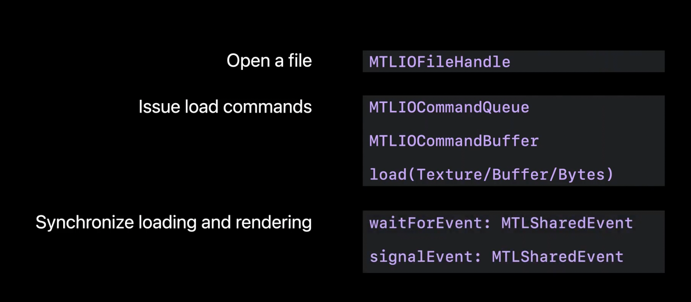


#### 进阶功能

##### 取消加载
这是一个典型的场景：
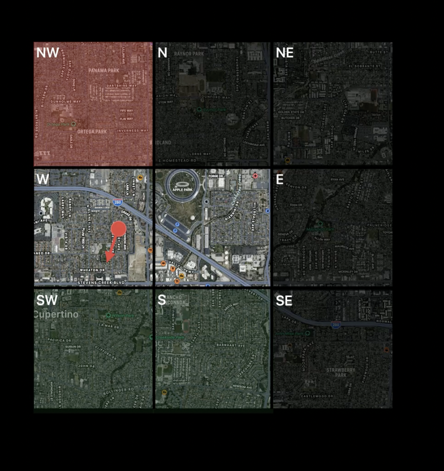
由于游戏无法将其整个地图放在内存中，它将地图细分为数个区域。随着玩家在地图上的前进，游戏开始预加载地图的区域。根据玩家的方向，游戏确定预加载的最佳区域是西北、西部和西南区域。但是，一旦玩家移动到西部地区并开始向南行驶，预装西北地区就不再有用了。为了减少未来加载的延迟，`Metal 3` 允许您尝试取消加载操作。
```cpp
// Player in the center region
// Encode loads for the North-West region
ioCommandBufferNW.commit()
// Encode loads for the West region
ioCommandBufferW.commit()
// Encode loads for the South-West region
ioCommandBuuferSW.commit()

// Player in the western region and heading south
// tryCancel NW command buffer
ioCommandBufferNW.tryCancel()

// ... 
func regionNWCanceled() -> Bool {
   return ioCommandBufferNW.status == MTLIOStatus.cancelled
}
```
当播放器位于中心区域时，编码并提交三个区域的 `IO` 命令缓冲区。然后当玩家在西部地区向南行驶时，使用 `tryCancel` 方法取消对西北地区的加载。取消是在命令缓冲区粒度内的，因此我们可以在执行过程中取消命令缓冲区。
如果稍后想知道该区域是否已完全加载，可以检查命令缓冲区的状态。

##### IO 工作与高优先级队列
考虑一个游戏场景，其中玩家传送到场景的新部分，于是游戏开始流式传输大量图形资源。同时，游戏需要播放瞬移音频资源。快速资源加载允许我们加载应用程序的所有资产，包括音频数据。要加载音频，可以使用前面讨论的 `loadBytes` 命令加载到应用程序分配的内存。在此示例中，纹理和音频 `IO` 命令缓冲区在单个 `IO` 命令队列上同时执行。下图显示了存储层的请求。
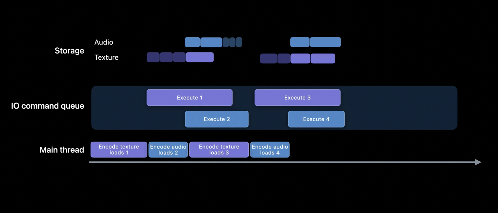
存储系统能够并行执行音频和纹理加载请求。为了避免延迟音频，流系统能够优先考虑音频请求而不是纹理请求，这一点至关重要。要优先考虑音频请求，就需要创建一个单独的 `IO` 命令队列，并设置高优先级。存储系统将确保高优先级的 `IO` 请求具有较低的延迟并优先于其他请求。为音频资产创建单独的高优先级队列后，音频加载请求的执行时间变小了，而并行纹理加载请求的执行时间变长了。
下面是创建高优先级队列的方法
```cpp
let commandQueueDescriptor = MTLIOCommandQueueDescriptor()
commandQueueDescriptor.type = MTLIOCommandQueueType.concurrent // or serial

// Set Metal IO Command queue Priority
commandQueueDescriptor.priority = MTLIOPriority.high // or normal or low

var ioCommandQueue: MTLIOCommandQueue!
do {
   try ioCommandQueue = device.makeIOCommandQueue(descriptor: commandQueueDescriptor)
} catch {
   print(error)
}
```
只需将命令队列描述符的优先级属性设置为高即可。当然也可以将优先级设置为正常或低，然后像往常一样从描述符创建一个新的 `IO` 命令队列。不过需要注意，创建队列后就无法更改队列的优先级了。

#### 最佳实践
下面是应用程序添加快速资源加载的最佳实践
- 考虑压缩资源。
可以使用内置或自定义压缩来减少应用程序的磁盘占用空间，用运行时性能换取更小的磁盘占用空间。
- 在使用稀疏纹理时通过调整稀疏页面大小来提高存储吞吐量。

##### 使用 Metals 3 的 API 离线压缩资源文件
首先，创建一个压缩上下文并使用块大小和压缩方法对其进行配置。然后将部分资产文件传递到上下文以生成所有文件的单个压缩版本。压缩上下文通过将所有数据分块，并使用选择的编解码器对其进行压缩并将其存储到一个包文件中。
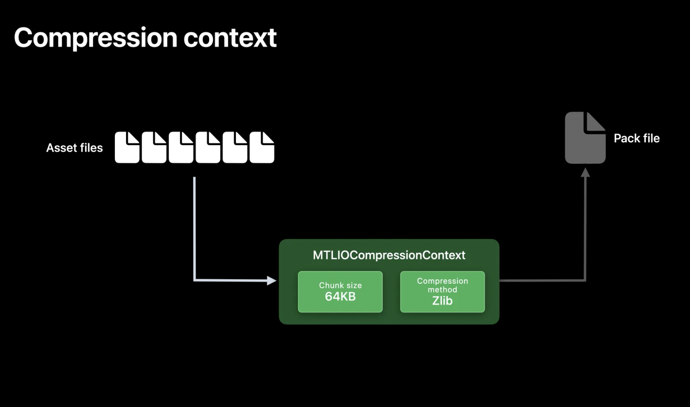
在此示例中，上下文将数据压缩为 64KB 大小的块，但我们自然可以根据要压缩的数据的大小和类型选择合适的块大小。

下面看一看 `Metal 3` 中的使用。首先，通过提供创建压缩文件的路径、压缩方法和块大小来创建压缩上下文。接下来，获取文件数据并将其附加到上下文中。在这里，文件数据在一个 `NSData` 对象中。可以通过多次调用追加数据来追加来自不同文件的数据。
添加完数据后，通过调用 `flush` 和 `destroy` 压缩上下文函数完成并保存压缩文件。
```cpp
// Create a compressed file

// Create compression context
let chunksize = 64 * 1024
let compressionMethod = MTLIOCompressionMethod.zlib
let compressionContext = MTLIOCreateCompressionContext(compressedFilePath, compressionMethod, chunkSize)

// Append uncompressed file data to the compression context
 // Get uncompressed file data
 MTLIOCOmpressionContetAppendData(compressionContext, filedata.bytes, filedata.length)

 // Write the compressed file
 MTLIOFlushAndDestroyCompresssionContext(compressionContext)

```

可以通过创建文件句柄来打开和访问压缩文件，此文件句柄在发出加载命令时使用。对于压缩文件，`Metal 3` 执行内联解压缩，通过将偏移量转换为它需要解压缩的块列表，并将它们加载到资源中。

可以使用 `Metal` 设备实例创建文件句柄。例如，此代码使用 `Metal` 设备实例通过向我之前介绍的 `makeIOHandle` 方法提供压缩文件路径来创建文件句柄。
```cpp
// Create an Metal File IO Handle

// Create handle to a compressed file
var compressedFileIOHandle: MTLIOFileHandle!
do {
   try compressedFileHnadle = device.makeIOHandle(url: compressedFilePath, compressionMethod: MTLIOCompressionMethod.zlib)
} catch {
   print(error)
}
```
压缩文件有一个压缩方法的附加参数，这与我们创建压缩文件时使用的压缩方法相同。下面是不同压缩方法以及它们各自的特点：
- 当解压速度很关键并且您的应用程序可以承受较大的磁盘占用时，请使用 `LZ4`。
- 如果编解码器速度和压缩率之间的平衡对您很重要，请使用 `ZLib`、`LZBitmap` 或 `LZFSE`。
- 在平衡的编解码器中，`ZLib` 更适用于非 `Apple` 设备。
- `LZBitmap` 编解码速度快，`LZFSE` 压缩比高。
- 如果需要最佳压缩比，请考虑使用 `LZMA` 编解码器，前提是您的应用可以承受解码资源所需的额外时间。
- 也可以使用自己的压缩方案。
有时可能会遇到数据受益于自定义压缩编解码器的情况，此时就可以用自己的压缩器替换压缩上下文，并在运行时自己转换偏移量并执行解压缩。
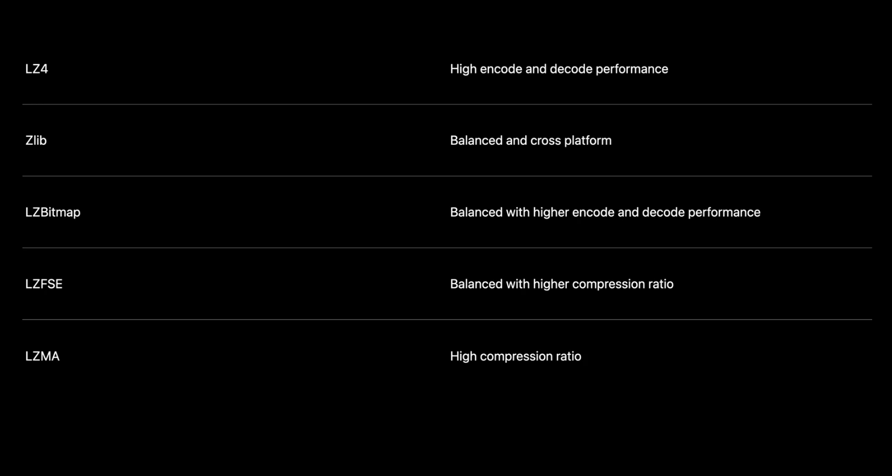
##### 调整稀疏页面大小
早期版本的 `Metal` 支持以 16K 的粒度将切片加载到稀疏纹理。使用 `Metal 3`，可以指定两种新的稀疏切片大小：64 和 256K。
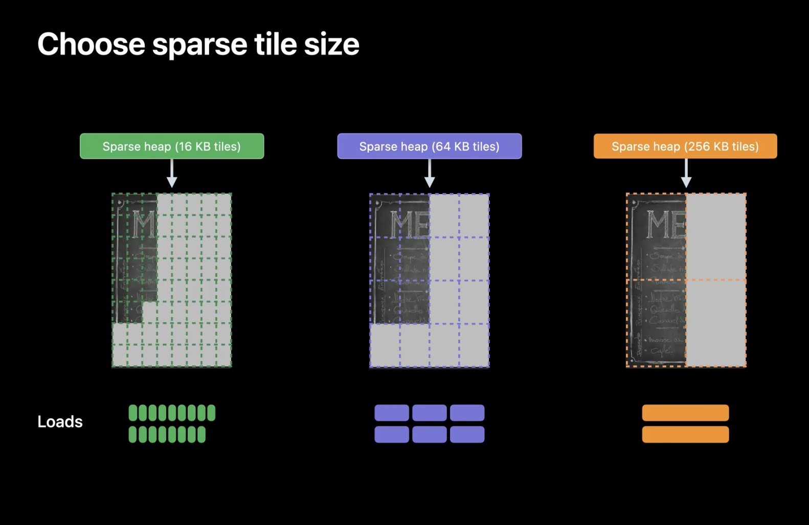
这些新尺寸允许以更大的粒度流式传输纹理，以更好地利用和饱和存储硬件。需要注意的是：流式传输较大的图块大小和流式传输的数据量之间存在权衡，因此必须尝试查看哪种大小最适合应用程序以及其稀疏纹理。

#### 工具支持
接下来，让我们看看如何使用 `Metal Developer Tools` 来分析和调试应用程序中的快速资源加载。

`Xcode 14` 包括对快速资源加载的全面支持。
1. 运行时分析
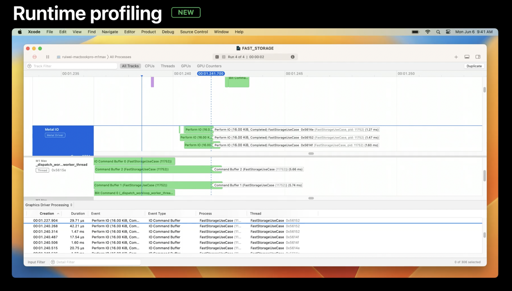
在 `Xcode 14` 中，`Instruments` 可以使用 `Metal System Trace` 模板分析快速资源加载。`Instruments` 是一款功能强大的分析和分析工具，可帮助您在 `Metal` 应用程序中实现最佳性能。`Metal System Trace` 模板允许您检查加载操作何时被编码和执行。
您将能够了解它们如何与您的应用在 `CPU` 和 `GPU` 上执行的活动相关联。
要了解如何使用 `Instruments` 分析的 `Metal` 应用程序，请查看之前的 Session
- [Optimize Metal apps and games with GPU counters WWDC20](https://developer.apple.com/videos/play/wwdc2020/10603/)
- [Optimize high-end games for Apple GPUs](https://developer.apple.com/videos/play/wwdc2021/10148/)

2. API 视查
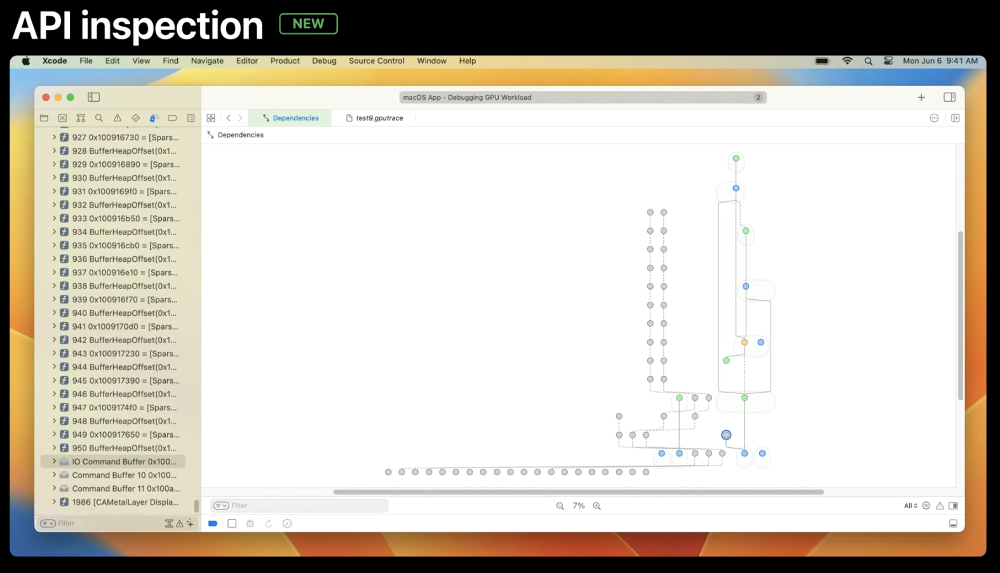
借助 `Xcode 14` 中的 `Metal` 调试器，您现在可以分析游戏对新的快速资源加载 `API` 的使用情况。
3. 依赖分析
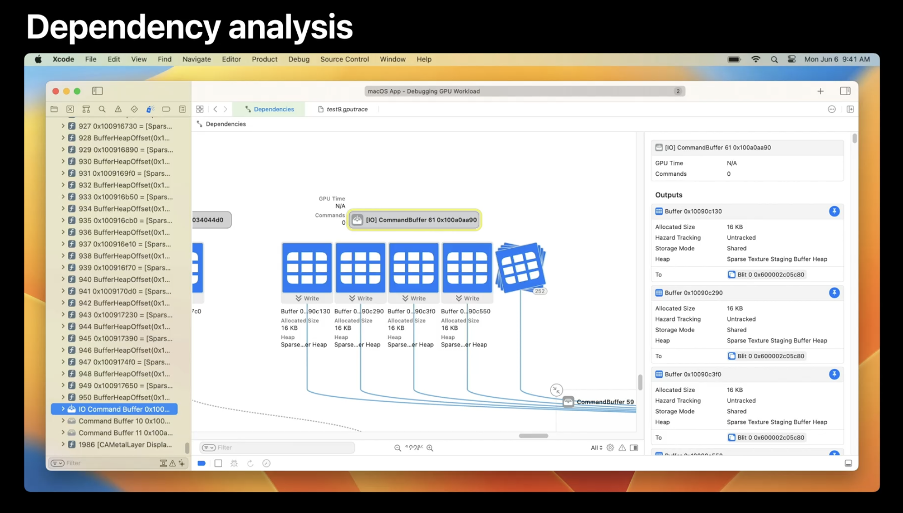
捕获帧后，将能够检查所有快速资源加载 `API` 调用。可以使用新的依赖项查看器直观地检查快速资源加载依赖项。
依赖关系查看器详细概述了 `IO` 命令缓冲区和 `Metal` 之间的资源依赖关系。
从这里，您可以使用新的 `Dependency` 查看器中的所有功能，例如新的同步边和图形过滤，来深入了解和优化您的资源加载依赖项。
要了解有关 `Xcode 14` 中新的 `Dependency` 查看器的更多信息，请查看 Session [“Go bindless with Metal 3"](https://developer.apple.com/videos/play/wwdc2022/10101/) . 
#### 实际效果
这是一个测试场景，它使用新的快速资源加载 `API`， 通过使用 16 KB 大小的稀疏纹理来流式传输纹理数据。
该场景来自配备 `M1 Pro` 芯片的 `MacBook Pro`。流系统查询 `GPU` 的稀疏纹理访问计数器以识别两件事：它已采样但未加载的图块和应用程序未使用的已加载图块。
该应用程序使用此信息对其需要的图块的负载列表和不需要的图块的驱逐列表进行编码。这样，工作集只包含应用程序最有可能使用的图块。

如果玩家决定前往场景的另一部分，应用程序需要输入一组全新的高分辨率纹理。
如果流媒体系统足够快，播放器将不会注意到这种流媒体的发生。
暂停场景，就可以更清楚地观察图像差异。
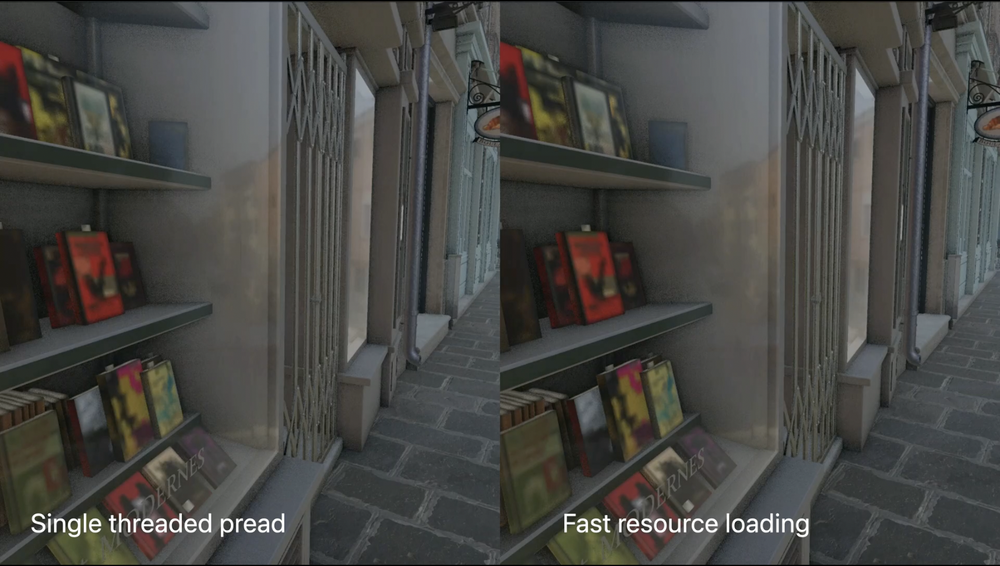
左侧是使用 `pread API` 在单个线程上加载稀疏图块。
右侧是使用快速资源加载 `API` 加载稀疏图块。
当玩家进入场景时，大部分纹理还没有完全加载。加载完成后，可以看到最终的高分辨率版本的纹理。
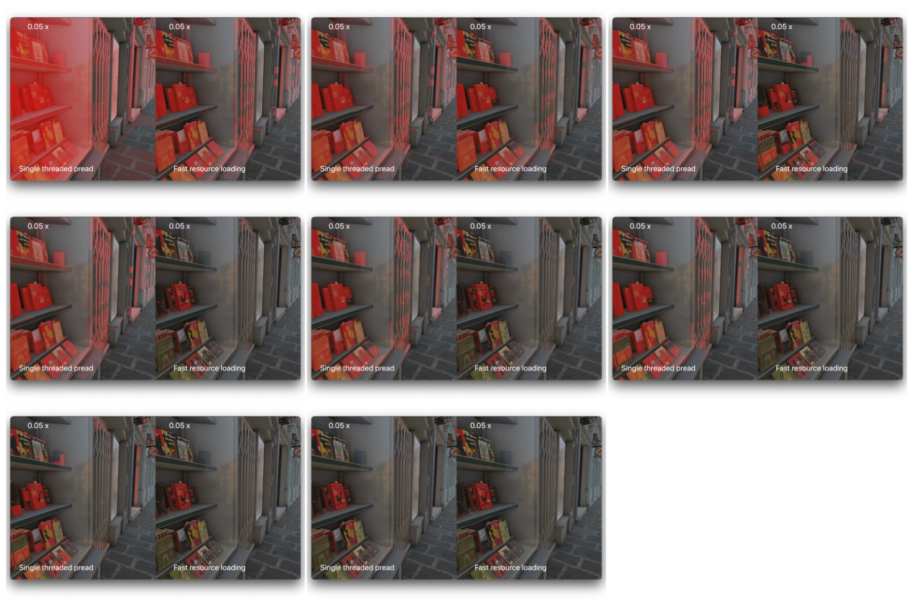
如果我回到这个场景的开头并放慢速度，就更容易注意到快速资源加载提供的改进。为了突出差异，此渲染将应用程序尚未加载的瓷砖标记为红色。起初，场景显示应用程序尚未加载大部分图块。然而，随着玩家进入场景，与单线程预加载版本相比，快速资源加载改善了高分辨率瓦片的加载并最大限度地减少了延迟。
Metal 3 的快速资源加载可帮助您构建强大而高效的资源流系统，让应用程序利用最新的存储技术。

Metal 3 中的快速资源加载引入了利用现代存储硬件的强大功能进行高吞吐量资产加载的新方法，这些功能可以大大提高应用的视觉质量和响应能力。

### 离线编译
新的离线编译工作流程也能够减少应用程序的加载时间和卡顿。着色器二进制文件是特定于 `GPU` 的机器代码，传统上是在应用程序运行时生成的，作为 `Metal` 流水线创建过程的一部分。生成这些二进制文件是一项昂贵的操作，通常于应用启动期间在后台悄加载。但是，有时它们需要在帧内发生，这反过来会导致帧卡顿。这些二进制文件由 `Metal` 缓存，因此不会经常都造成这个开销，但在应用程序首次启动或首次需要二进制文件时仍会造成开销。
通过离线编译，您可以在运行时消除着色器二进制文件的生成。
通过将二进制生成转移到项目构建时间，您可以显著减少在加载时创建 `Metal` 流水线所花费的时间，并在即时创建这些管道时减少应用程序中的卡顿。
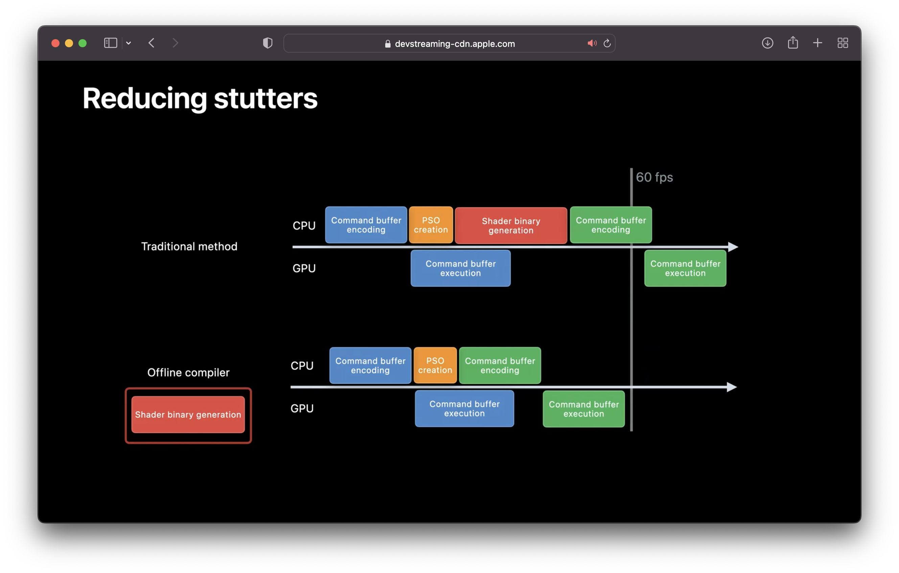
这是一个需要在编码期间创建 `Metal` 流水线状态对象的游戏示例。
由于这是 `Metal` 以前从未见过的流水线，它会生成所需的着色器二进制文件。这是一个耗时很长的操作，它会中断对其余帧的编码，并导致应用程序达不到帧率目标。虽然这只会发生一次，但足以让用户注意到帧卡顿。
相比之下，离线编译意味着着色器二进制文件可以在构建时生成，因此每个管道状态的创建速度很快，执行也很顺畅。

离线编译也会对应用程序加载时间产生巨大影响。

多数应用程序在专用加载阶段创建大部分 `Metal` 管道状态对象。着色器二进制文件在第一次加载时生成。如果应用程序创建了许多这样的流水线，那么用户可能会等待很长时间。

通过离线编译，着色器二进制生成可以再次转移到项目构建阶段完成，从而缩短加载时间并让用户更快地进入应用程序。
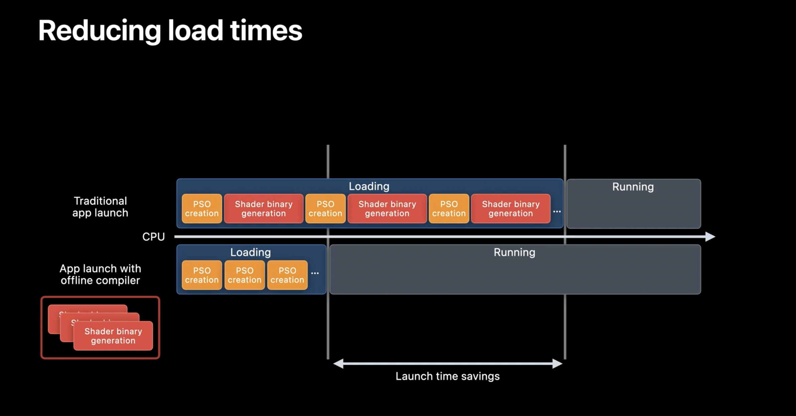

离线编译是具有许多复杂管道的应用程序的游戏规则改变者。想了解有关离线编译和其他改进的更多信息，请查看session ["Target and optimize GPU binaries with Metal 3"](https://developer.apple.com/videos/play/wwdc2022/10102/)。
### MetalFX
`MetalFX` 为 `Metal` 应用提供平台最优的图形效果。
`MetalFX Upscaling`通过高性能放大和抗锯齿在更短的时间内渲染高质量的图形。
重要的是，您可以选择时间或空间算法的组合来帮助提高性能。

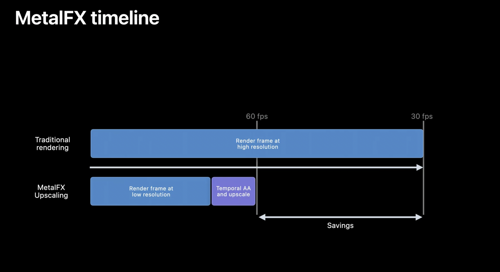

虽然 `Retina` 分辨率提供了您希望应用和游戏利用的清晰细节，但生成所有这些像素也会影响性能。使用 `MetalFX Upscaling` ，您可以选择生成较低分辨率的像素，然后让框架以更低的成本生成高质量、高分辨率的图像，从而获得更高的帧率。
`MetalFX` 是一个强大的框架，它使高性能、高质量的升级成为现实。要了解有关 `MetalFX Upscaling` 的更多信息，请查看 Session ["Boost performance with MetalFX Upscaling"](https://developer.apple.com/videos/play/wwdc2022/10103/)。
### Mesh Shaders
接下来是 `Metal` 新的灵活几何管线：`Mesh Shaders`。 
传统的可编程图形管道让您可以在着色器中转换顶点，然后将其组装成图元，以便通过固定功能硬件进行光栅化。这对于大多数应用程序来说已经足够了，但是有的情况下（如剔除技术）需要访问整个原语。每个顶点也被独立读取、转换和输出。因此，您不能在绘制过程中添加顶点或图元。
高级几何处理需要更大的灵活性。传统来说，这意味着在计算过程中对几何图形进行预处理。
但这需要将可变数量的中间几何存储到设备内存中，这对用户来说很难预算。
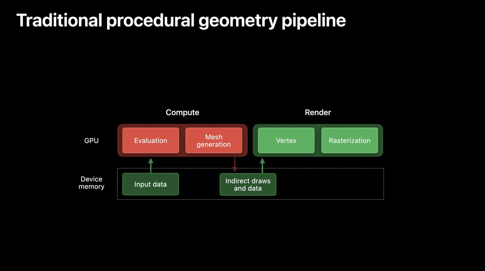
`Metal Mesh Shaders`引入了另一种几何处理管道，它用灵活的 2 阶段模型取代了传统的顶点阶段，并支持对几何图形进行分层处理。第一阶段分析整个对象以决定是否在第二阶段扩展、收缩或细化几何。它通过在渲染过程中提供计算能力来实现这一点，而不需要中间设备内存存储。Mesh Shaders 非常适合执行 GPU 驱动的剔除、LOD 选择和程序几何生成的应用程序。
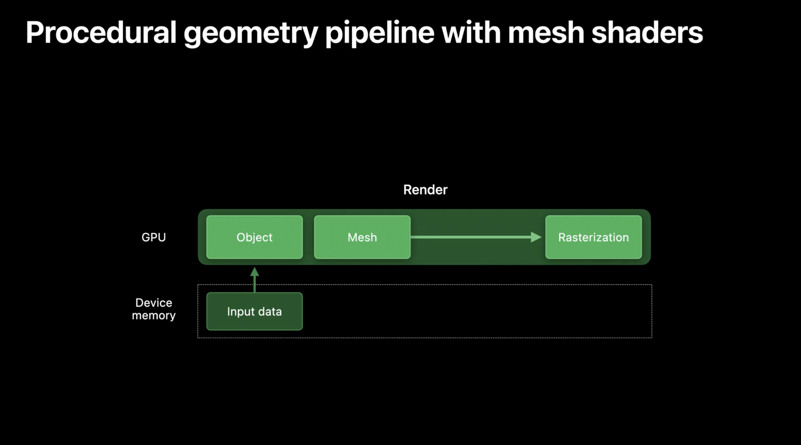

在此示例中，计算过程会评估曲面，然后生成其几何图形。然后将该几何图形及其绘制命令写入设备内存以供稍后的渲染过程使用。由于 `high expansion factor` 和间接绘制的调用，预测所需的内存量变得十分困难。`Mesh Shaders` 通过在渲染管道中内联运行两个类似计算的阶段来提高效率。
Object 阶段评估输入以确定需要生成多少网格。
然后 `Mesh` 阶段生成实际的几何图形。这些网格被直接发送到光栅化器，绕过到设备内存的往返，以及对顶点处理的需要。
网格着色器可让您为您的应用程序构建高效的程序几何、剔除和 `LODing` 系统。
要了解有关网格着色器的更多信息，请查看 Session "Transform your geometry with Metal mesh shaders"

### 光线追踪管道

`Metal` 还增加了对 GPU 驱动的光线追踪管道的支持，以进一步优化您的应用程序。
让我们将 `Metal 3` 的光线追踪与之前可用的进行比较。

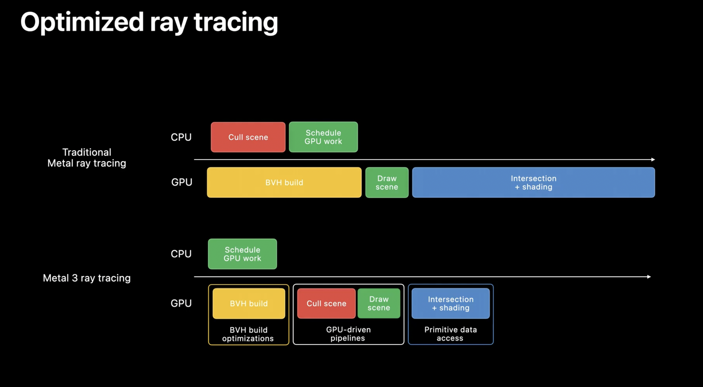
`Metal 3` 光线追踪可节省大量 CPU 和 GPU 时间。
首先，加速结构的构建时间更短，使得有更多的 GPU 时间来绘制和追踪光线。其次，由于对光线追踪的新间接指令缓冲区的支持，诸如剔除之类的 CPU 操作可以转移到 GPU。
最后，`Metal 3` 光线追踪支持直接访问原始数据，简化、优化了求交和着色。
`Metal 3` 光线追踪将变得比以前更好、更强大。要了解有关光线追踪的更多信息，请前往 Session ["Maximize your Metal ray tracing performance"](https://developer.apple.com/videos/play/wwdc2022/10105/)。

### 机器学习

现在，我将向您展示 Metal 3 如何加速机器学习推理和训练。
Metal 3 在加速机器学习方面进行了重大改进，额外支持在 Mac 上加速网络训练，并对图形和媒体处理应用程序中的 ML 推理优化进行了重大优化。

#### TensorFlow

`TensorFlow` 是一种流行的机器学习框架，在 Mac 上通过 GPU 加速。
最近发布的 Mac Studio 在 `M1 Ultra`上的训练相较于 CPU ，在各种网络上都提供了高达 16 倍的加速。
`Metal 3` 加速了许多新的 `TensorFlow` 操作。
这意味着与 CPU 的同步更少，从而获得更高的可扩展性能。

#### PyTorch

`PyTorch` 是另一个非常流行的用于网络训练的 ML 框架，它最近使用 Metal 获得了 GPU 加速。
在配备 `M1 Ultra` 的 `Mac Studio` 上，您可以获得显著优于 CPU 的训练加速。
例如，训练 `BERT` 模型提速 6.5 倍，训练 `ResNet50` 提速 8.5 倍。
Metal 优化了 Apple 芯片上的 ML 推理，以最大限度地提高性能。
这对于基于 Metal 的高性能视频和图像处理应用程序尤其适用，例如 `BlackMagic Design`的 `DaVinci Resolve`。
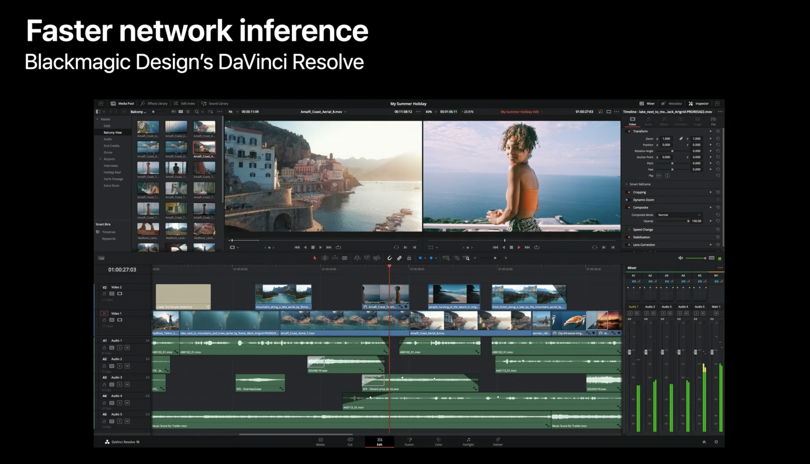
`DaVinci Resolve` 是一个专注于颜色分级的视频制作平台，在其工作流程中广泛使用 Metal 和机器学习。
结果令人难以置信。借助 Metal 对加速机器学习的支持，`BlackMagic Design` 的编辑和调色工作流程以及基于 ML 的工具实现了显着的性能改进。
要了解有关机器学习更新的更多信息，请前往 Session "Accelerate machine learning with Metal"。

### 硬件支持

现在我们来看一看哪些硬件支持上述的 Metal 3 功能。
所有现代 iOS、iPadOS 和 macOS 设备都支持 Metal 3，包括配备 A13 Bionic 或 M1 芯片或更新版本的 iPhone 和 iPad，以及所有 Apple 芯片 Mac 系统和配备最新 AMD 和 Intel GPU 的 Mac 系统。
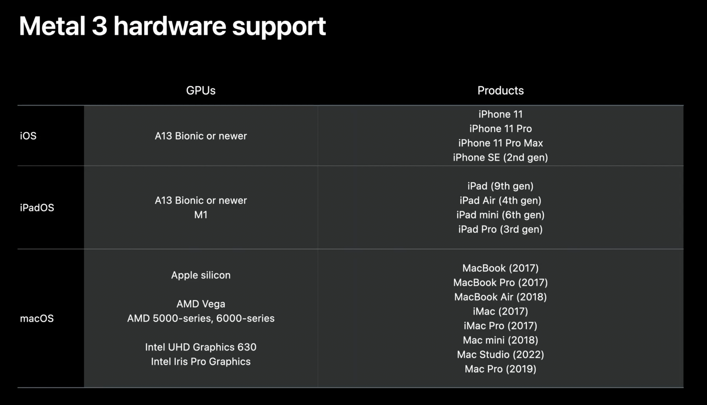
要确定给定设备是否支持 Metal 3，请使用 Metal 设备上的 supportsFamily 查询。

```c++
if device.supportsFamily(.metal3){
     // My awesome Metal 3 renderer   
}
```

### 开发者工具

`Metal 3` 不仅包含功能，它还包括一套全面的高级开发工具，下面我们来介绍一部分。
`Xcode 14` 中的 `Metal Dependency Viewer` 可以更轻松地可视化整个渲染器或放大单个通道【pic】。
例如，为了更轻松地采用 GPU 驱动的管道或与快速资源加载同步，依赖查看器现在包括同步边缘，以帮助您分析和验证您的依赖。
`Xcode 14` 中改进的加速结构查看器可帮助您充分利用 `Metal 3` 的优化光线追踪。
首先，您现在可以突出显示场景中的各个图元。
选择一个图元，左侧的窗口中会显示其相关的图元数据。最后，如果您的场景有运动信息，`Acceleration Structure Viewer` 现在可以可视化不同的时间点。

这只是对 `Xcode 14` 中的一些开发者工具更新的快速浏览。还有许多其他新功能，例如 `Dylib` 支持、新资源列表、着色器编辑器中的文件导航、自定义缓冲区查看器布局等等。

要详细了解工具以及如何充分利用 `Metal 3` 的进步，请查看这些 Session，它们将帮助您构建高级图形、游戏和专业应用程序。
- Maximize your Metal ray tracing performance
- Go bindless with Metal 3
- Profile and optimize your game's memmory
- Scale compute workloads across Apple GPUs
- Load resources faster with Metal 3
