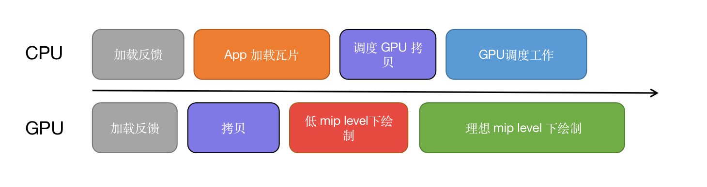
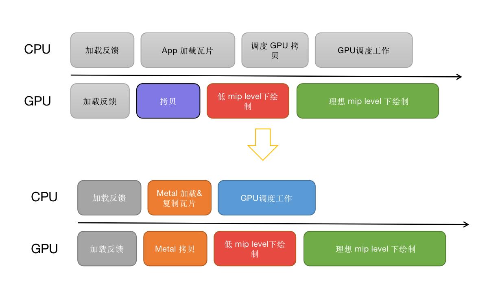
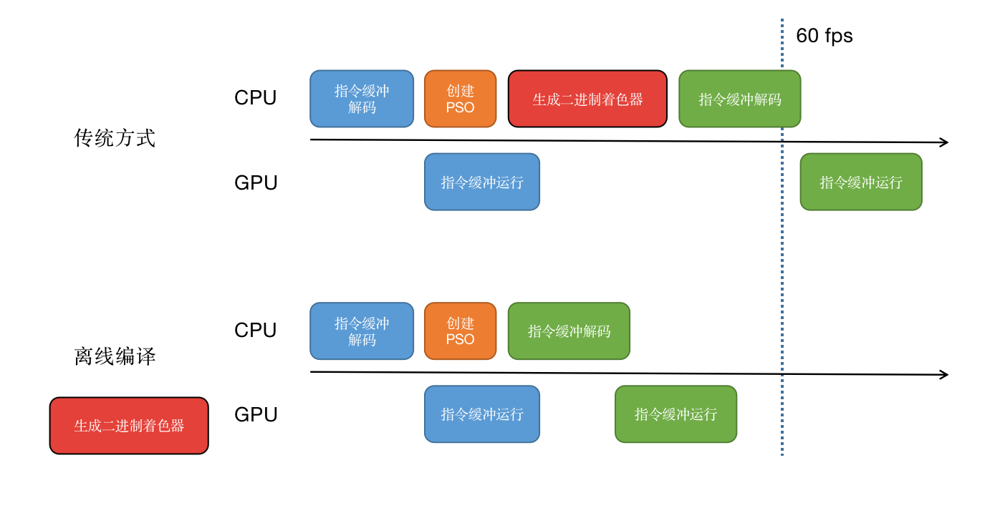

# Session 10066 - VisionKit 的机器视觉方案，更智能的捕获文本与条码

本文基于 [Session 10025](https://developer.apple.com/videos/play/wwdc2022/10025/) 梳理。

> 作者：Layer（杨杰），就职于抖音 iOS 即时通讯团队，经常被可爱的人看到个人介绍。
>
> 审核：anotheren（刘栋），老司机周报编辑，就职于丁香园 iOS 团队，Swift 老司机。


## 简介
Metal 是 Apple 的高效低销图形计算 `API` 。它旨在以最快、最高效的方式驱动 `Apple` 产品背后强大的 `GPU`。它提供对 `GPU` 命令的线程或直接控制、支持显式着色器编译的丰富着色语言，以及有帮助调试和分析复杂应用程序和游戏的深度集成工具。
自推出以来，`Metal` 着重于 `GPU` 驱动的渲染、机器学习和光线追踪添加了许多高级图形和计算功能。
`Apple` 芯片为每台新 `Mac` 上令人难以置信的图形性能和效率铺平了道路，而 `Metal` 解锁了这些功能。今年，`Metal` 凭借 `Metal 3` 迈向了一个新的高度。
`Metal 3` 是一组强大的新功能，可实现更高的性能和渲染质量，帮助您的应用和游戏运行得更快，看起来更棒。
## 正文
### 功能
#### 快速资源加载
现代游戏和应用程序对资源加载有很高的要求，从文件中快速传输小的资源请求到用户的Metal 资源，对高质量视觉效果尤为关键，但是现有的存储 API 基本是为大型、批量请求而设计的。
在 `Metal 3` 中，用户可以使用与图形和计算相同的显式多线程命令模型， 快速资源加载来应对许多小负载请求。每个请求都是一个命令，多个命令可以排队等待，异步提交。它会直接加载到 `Metal` 缓冲区和纹理中，无需额外步骤，从而节省开发工作量和传输时间。借助 Metal的 同步原语，开发者还可以轻松地在 `GPU` 操作和加载操作之间进行协调。
纹理的流系统真正受益于快速资源加载，让我们来看一个例子。


`Metal` 稀疏贴图允许应用程序以瓦片粒度流式传输纹理。
基于 `Metal` 稀疏贴图构建的纹理流送系统包括四个步骤：首先，根据前一帧的反馈决定加载什么。其次，从文件存储中加载瓦片。第三，从暂存区复制到稀疏贴图。最后，画出这一帧。
加载和复制所需的时间越长，意味着应用以较低质量绘制的时间越长。

快速资源加载可最大限度地减少加载开销，并确保存储硬件在其队列中有足够的请求，以最大限度地提高吞吐量。这提供了更快和更稳定的性能，以便将更多时间用于高质量绘图。
快速资源加载将大大简化您为实现高质量资产流式传输所需编写的代码。
要了解有关快速资源加载的更多信息，请查看[Session 使用 Metal 3 更快地加载资源](https://developer.apple.com/videos/play/wwdc2022/10104)。
#### 离线编译
新的离线编译工作流程也能够减少应用程序的加载时间和卡顿。着色器二进制文件是特定于GPU 的机器代码，传统上是在应用程序运行时生成的，作为 `Metal` 流水线创建过程的一部分。生成这些二进制文件是一项昂贵的操作，通常于应用启动期间在后台悄加载。但是，有时它们需要在帧内发生，这反过来会导致帧卡顿。这些二进制文件由 `Metal` 缓存，因此不会经常都造成这个开销，但在应用程序首次启动或首次需要二进制文件时仍会造成开销。
通过离线编译，您可以在运行时消除着色器二进制文件的生成。
通过将二进制生成转移到项目构建时间，您可以显著减少在加载时创建 `Metal` 流水线所花费的时间，并在即时创建这些管道时减少应用程序中的卡顿。
【pic】
这是一个需要在编码期间创建 `Metal` 流水线状态对象的游戏示例。
由于这是 `Metal` 以前从未见过的流水线，它会生成所需的着色器二进制文件。这是一个耗时很长的操作，它会中断对其余帧的编码，并导致应用程序达不到帧率目标。虽然这只会发生一次，但足以让用户注意到帧卡顿。
【pic】
相比之下，离线编译意味着着色器二进制文件可以在构建时生成，因此每个管道状态的创建速度很快，执行也很顺畅。

离线编译也会对应用程序加载时间产生巨大影响。
【pic】
多数应用程序在专用加载阶段创建大部分Metal 管道状态对象。着色器二进制文件在第一次加载时生成。如果应用程序创建了许多这样的流水线，那么用户可能会等待很长时间。

通过离线编译，着色器二进制生成可以再次转移到项目构建阶段完成，从而缩短加载时间并让用户更快地进入应用程序。
离线编译是具有许多复杂管道的应用程序的游戏规则改变者。想了解有关离线编译和其他改进的更多信息，请查看session "Target and optimize GPU binaries with Metal 3"。
MetalFX
MetalFX 为 Metal 应用提供平台最优的图形效果。
MetalFX 倍线（Upscaling）通过高性能放大和抗锯齿在更短的时间内渲染高质量的图形。
重要的事，您可以选择时间或空间算法的组合来帮助提高性能。
【pic】
虽然Retina 分辨率提供了您希望应用和游戏利用的清晰细节，但生成所有这些像素也会影响性能。使用MetalFX Upscaling，您可以选择生成较低分辨率的像素，然后让框架以更低的成本生成高质量、高分辨率的图像，从而获得更高的帧率。
MetalFX 是一个强大的框架，它使高性能、高质量的升级成为现实。要了解有关MetalFX Upscaling 的更多信息，请查看Session" Boost performance with MetalFX Upscaling"。
#### Mesh Shaders
接下来是Metal 新的灵活几何管线：Mesh Shaders。 
传统的可编程图形管道让您可以在着色器中转换顶点，然后将其组装成图元，以便通过固定功能硬件进行光栅化。这对于大多数应用程序来说已经足够了，但是有的情况下（如剔除技术）需要访问整个原语。每个顶点也被独立读取、转换和输出。因此，您不能在绘制过程中添加顶点或图元。
高级几何处理需要更大的灵活性。传统来说，这意味着在计算过程中对几何图形进行预处理。
但这需要将可变数量的中间几何存储到设备内存中，这对用户来说很难预算。
Metal Mesh Shaders引入了另一种几何处理管道，它用灵活的 2 阶段模型取代了传统的顶点阶段，并支持对几何图形进行分层处理。第一阶段分析整个对象以决定是否在第二阶段扩展、收缩或细化几何。它通过在渲染过程中提供计算能力来实现这一点，而不需要中间设备内存存储。Mesh Shaders非常适合执行GPU 驱动的剔除、LOD 选择和程序几何生成的应用程序。
【pic】
在此示例中，计算过程会评估曲面，然后生成其几何图形。然后将该几何图形及其绘制命令写入设备内存以供稍后的渲染过程使用。由于高膨胀系数（high expansion factor）和间接绘制的调用，预测所需的内存量变得十分困难。Mesh Shaders通过在渲染管道中内联运行两个类似计算的阶段来提高效率。
Object阶段评估输入以确定需要生成多少网格。
然后Mesh阶段生成实际的几何图形。这些网格被直接发送到光栅化器，绕过到设备内存的往返，以及对顶点处理的需要。
网格着色器可让您为您的应用程序构建高效的程序几何、剔除和LODing 系统。
要了解有关网格着色器的更多信息，请查看Session "Transform your geometry with Metal mesh shaders"
#### 光线追踪管道
Metal 还增加了对 GPU 驱动的光线追踪管道的支持，以进一步优化您的应用程序。
让我们将 Metal 3 的光线追踪与之前可用的进行比较。
【pic】
Metal 3 光线追踪可节省大量 CPU 和 GPU 时间。
首先，加速结构的构建时间更短，使得有更多的 GPU 时间来绘制和追踪光线。其次，由于对光线追踪的新间接指令缓冲区的支持，诸如剔除之类的 CPU 操作可以转移到 GPU。
最后，Metal 3 光线追踪支持直接访问原始数据，简化、优化了求交和着色。
Metal 3 光线追踪将变得比以前更好、更强大。要了解有关光线追踪的更多信息，请前往Session" Maximize your Metal ray tracing performance"。
#### 机器学习
现在，我将向您展示 Metal 3 如何加速机器学习推理和训练。
Metal 3 在加速机器学习方面进行了重大改进，额外支持在 Mac 上加速网络训练，并对图形和媒体处理应用程序中的 ML 推理优化进行了重大优化。
##### TensorFlow

TensorFlow 是一种流行的机器学习框架，在 Mac 上通过 GPU 加速。
最近发布的 Mac Studio 在 M1 Ultra 上的训练相较于 CPU ，在各种网络上都提供了高达16 倍的加速。
Metal 3 加速了许多新的 TensorFlow 操作。
这意味着与 CPU 的同步更少，从而获得更高的可扩展性能。
##### PyTorch
PyTorch 是另一个非常流行的用于网络训练的 ML 框架，它最近使用 Metal 获得了 GPU 加速。
在配备 M1 Ultra 的 Mac Studio 上，您可以获得显著优于CPU的训练加速。
例如，训练 BERT 模型提速6.5倍，训练ResNet50提速8.5倍。
Metal 优化了 Apple 芯片上的 ML 推理，以最大限度地提高性能。
这对于基于 Metal 的高性能视频和图像处理应用程序尤其适用，例如 BlackMagic Design的 DaVinci Resolve。
DaVinci Resolve 是一个专注于颜色分级的视频制作平台，在其工作流程中广泛使用 Metal 和机器学习。
结果令人难以置信。借助 Metal 对加速机器学习的支持，BlackMagic Design 的编辑和调色工作流程以及基于 ML 的工具实现了显着的性能改进。
要了解有关机器学习更新的更多信息，请前往Session "Accelerate machine learning with Metal"。
### 设备
现在我们来看一看哪些硬件支持上述的 Metal 3 功能。
所有现代 iOS、iPadOS 和 macOS 设备都支持 Metal 3，包括配备 A13 Bionic 或 M1 芯片或更新版本的 iPhone 和 iPad，以及所有 Apple 芯片 Mac 系统和配备最新 AMD 和 Intel GPU 的 Mac 系统。
【pic】
要确定给定设备是否支持 Metal 3，请使用 Metal 设备上的 supportsFamily 查询。
```c++
if device.supportsFamily(.metal3){
     // My awesome Metal 3 renderer   
}
```
### 开发者工具

Metal 3 不仅仅是功能。它还包括一套全面的高级开发工具，下面我们来介绍一部分。
Xcode 14 中的 Metal Dependency Viewer 可以更轻松地可视化整个渲染器或放大单个通道【pic】。
例如，为了更轻松地采用 GPU 驱动的管道或与快速资源加载同步，依赖查看器现在包括同步边缘，以帮助您分析和验证您的依赖。
2. Xcode 14 中改进的加速结构查看器可帮助您充分利用 Metal 3 的优化光线追踪。
首先，您现在可以突出显示场景中的各个图元。
选择一个图元，左侧的窗口中会显示其相关的图元数据。最后，如果您的场景有运动信息，Acceleration Structure Viewer 现在可以可视化不同的时间点。

这只是对 Xcode 14 中的一些开发者工具更新的快速浏览。还有许多其他新功能，例如 Dylib 支持、新资源列表、着色器编辑器中的文件导航、自定义缓冲区查看器布局等等。

要详细了解工具以及如何充分利用 Metal 3 的进步，请务必查看这些其他Session，这些Session将帮助您构建高级图形、游戏和专业应用程序。
- Maximize your Metal ray tracing performance
- Go bindless with Metal 3
- Profile and optimize your game's memmory
- Scale compute workloads across Apple GPUs
- Load resources faster with Metal 3

## 结语
本文介绍了 Metal 3 用于提高性能和质量的高级功能：快速资源加载以获得更高质量的纹理流；让加载时间更短卡顿更少的离线编译； MetalFX Upscaling以在更短的时间内以高分辨率渲染；用于高级几何处理的网格着色器；更快的加速结构构建、交叉点和光线追踪着色；以及更加高速的机器学习。
最后，本文介绍展示了一些高级工具，可帮助您使用 GPU 驱动的管道和光线追踪等高级功能。
要了解有关新代码示例和文档的更多信息，请访问deleloper.apple.com/Metal。

感谢您的阅读。