---

session_ids: [10068]

---

# Session 10068 - UIKit 新特性

本文基于[Session 10068](https://developer.apple.com/videos/play/wwdc2022/10068/) 梳理。

> 作者：肿肿
>
> 审核：

## 前言

UIKit 作为 iOS 开发过程中非常核心的一个 framework，每年的更新换代都会对其做出一些升级和调整。只不过以往更多是针对单独的改动出独立的 session，没有专门出一个 session 成去体系地介绍 UIKit 里的改动。自从 wwdc 2021 开始，第一次系统地介绍了 What's new in UIKit ，主要围绕的方面包括针对生产效率提升的改动，UI 改动及 API 的改动等等。今年沿用了去年的思路，继续围绕这几个方面展开介绍。这个 session 虽然没有办法展开介绍所有的 UIKit 改动的技术细节，但它会把 UIKit 新特性里最重要的部分归纳到一起，起到提纲挈领的作用，让大家对 UIKit 的变动有一个整体的了解。文中会附有一些 session 的链接以及苹果的官方文档，方便读者了解其更进一步的改动细节。

## 本文知识目录

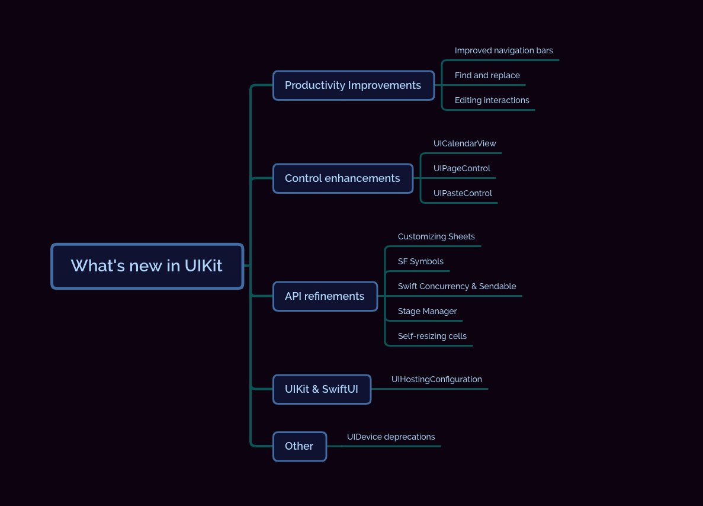

## 提升生产效率方面的改动

### NavigationBar 的新特性

#### NavigationItemStyle

在 iOS 16 ，UIKit 新增了两种新的 Navigation 样式：**Browser** 和 **Editor**。

Browser 样式给使用**历史记录或文件夹结构**进行导航的应用程序提供了更加用户友好的 UI 样式，例如 Web 和文档浏览器。

而 Editor 样式专门针对**编辑文档**提供了一套更加便捷的 UI 样式。

[苹果文档](https://developer.apple.com/documentation/uikit/uinavigationitemstyle)

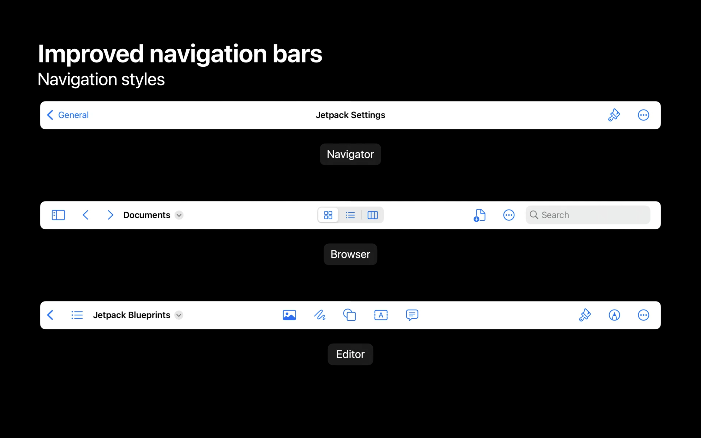

#### Center Items

在这两种样式下，我们可以把不太重要的标题挤到左边展示，在中间提供一块区域放一些操作按钮，方便用户更便捷地创作。

点击最右边"更多"菜单中的"自定义工具栏"选项，可以在弹出窗口中拖动来重新排列这些 Items 。改动之后的新配置在应用程序重启之后还会存在。

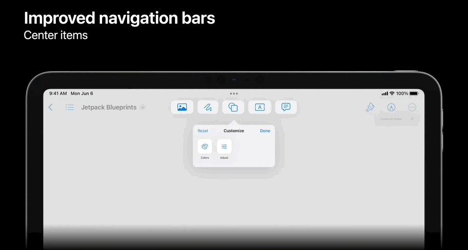

在屏幕尺寸适应方面，例如，开启 side-by-side 模式时，系统会把屏幕上展示不开的 item 都放在最右边的"更多"菜单里面。

[苹果文档](https://developer.apple.com/documentation/uikit/uinavigationitem/3987967-centeritemgroups)

#### Title Menu

iOS 16 还添加了与之相配的 Title menu，用户点击 navigation item 的 title 的时候就会弹出。它会提供一些基础的标准功能：复制、移动、重命名、导出和打印。当我们实现相应的 delegate 方法时，它们就会自动显示在菜单中。

当然，我们也可以将完全自定义的项目添加到 title menu。

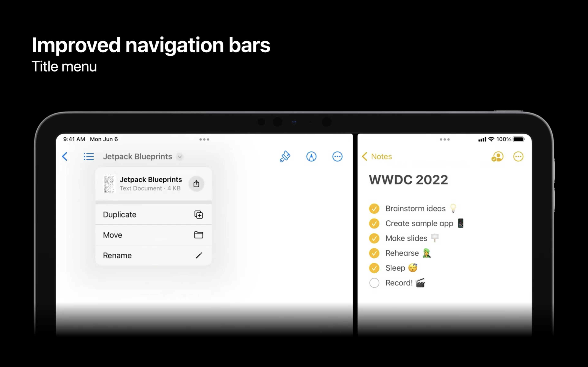

[苹果文档](https://developer.apple.com/documentation/uikit/uinavigationitem/3967523-titlemenuprovider)

此外，使用 Mac Catalyst 构建的应用程序通过与 NSToolbar 无缝集成，无需额外代码即可利用新的 Navigation Bar 样式。

### 文本操作

iOS 16 提供了可以在各个 App 里一致地操作文本的新方法。

#### 查找和替换

新的查找和替换是专门用来处理文本的，而不是应用于一些更高级的应用内搜索去处理一些数据模型对象，例如照片或日历事件。

它会提供系统的查找面板，如下图所示。

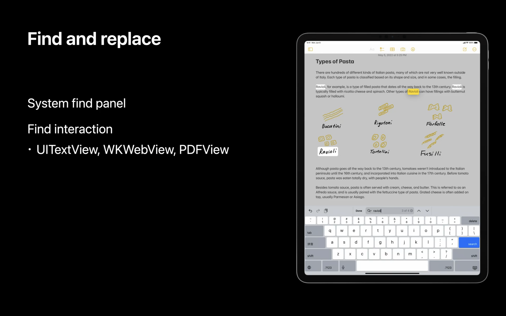

我们只需设置 `isFindInteractionEnabled` 这个属性为 true，就可以使让 UITextView ，WKWebView 和 PDFView 使用新的查找和替换事件。这项特性可以在引入该系统的多个视图和文档中无缝工作。

[苹果文档](https://developer.apple.com/documentation/uikit/uitextview/3975939-isfindinteractionenabled/)

#### 编辑菜单

iOS 16 对编辑菜单进行了比较大的改动。它会根据用户的操作行为展示不同的样式。

如果用户使用 touch 交互，会展示一个重新设计过后更具交互性的菜单。

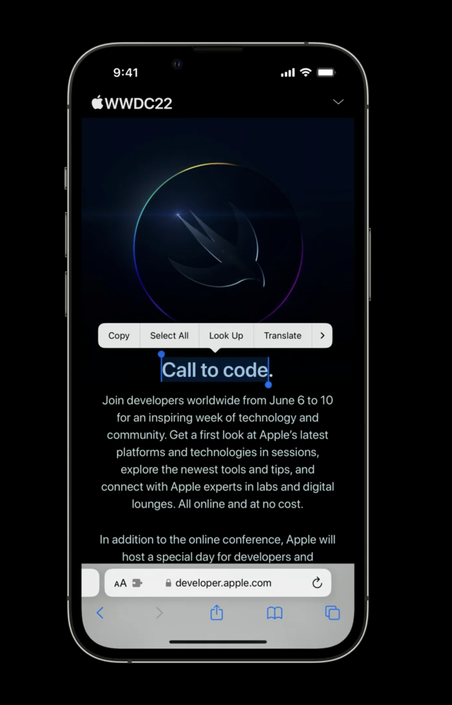

如果是使用指针交互，会展示功能更加全面的菜单。

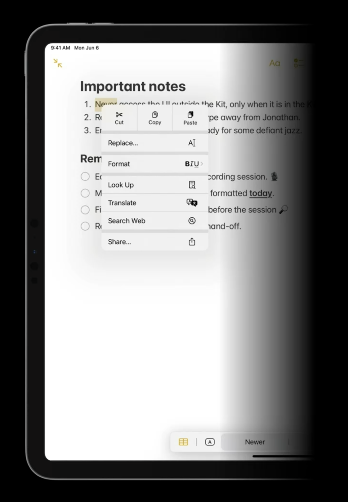

为了同时可以提供这两种体验，iOS16 引入了 **UIEditMenuInteraction**，替换掉了 **UIMenuController(废弃)**。

它提供了一些新的 API 让我们可以在 UITextView 和 UITextField 的编辑菜单里加入一些自己的 action。

想要了解更多细节的话可以去查看[Adopt desktop-class editing interactions](https://developer.apple.com/videos/play/wwdc2022/10071/)

[苹果文档](https://developer.apple.com/documentation/uikit/uieditmenuinteraction/)

### Sidebar

在 iOS 16 中的 slide over 模式下，UIKit 会替我们管理一组私有视图，这样侧边栏会自动变得更加醒目，而无需我们增加任何额外代码。

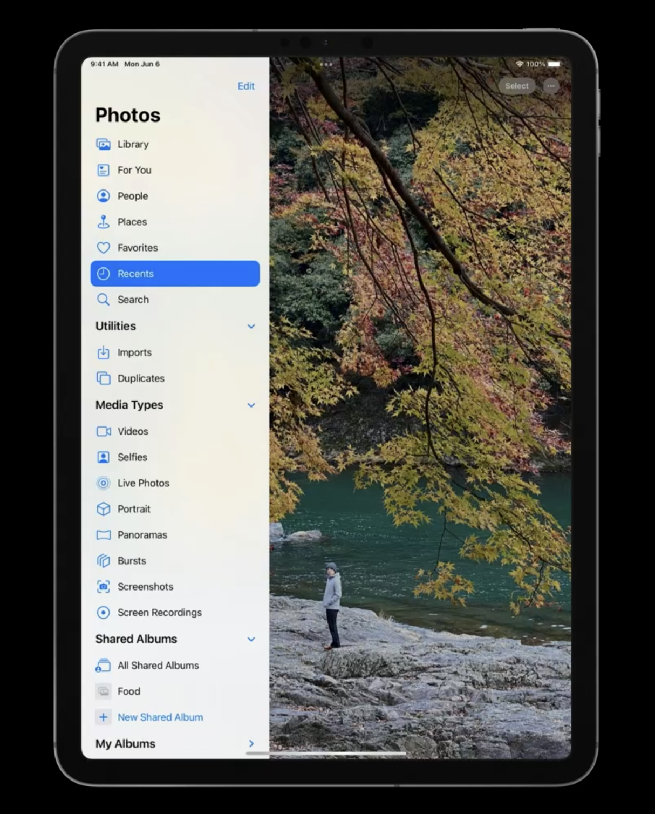

## UIControl 的改动

### UICalendarView

UIDatePicker 的 inline calendar 样式（ iOS 14 引入）现在单独摘出去，成为了一个全新的组件 UICalendarView 。它有以下几点优势：

- 多种选择方式：支持单选和多选
- 可以设置某些日期是可选的或者是不可选的
- 使用 `NSDateComponents` 而不是 `NSDate` ，这样使得我们可以拿到更准确的日期。但需要注意的是由于 NSDateComponent 比较灵活，提供了各种日历，所以在使用的时候，开发者需要指定 Calendar 的类型，防止用户使用的是奇奇怪怪的日历导致出现异常。
- 提供了一个装饰去注释单个日期。装饰会展示在日期的下方，提供了两种样式：default，image。当然也支持 custom 。default 是一个小圆点，可以设置颜色和大小。custom 的装饰是不允许交互的，如果过大会被裁减。

下面提供一个简单的例子来讲解一下

首先是 CalendarView 的创建

```swift
let calendarView = UICalendarView()
calendarView.delegate = self // 设置代理，用于设置Decoration
calendarView.calendar = Calendar(identifier: .gregorian) // 设置日历

calendarView.backgroundColor = .white //设置背景为白色
calendarView.tintColor = .orange  //设置tintColor为橘色
calendarView.layer.cornerRadius = 8
calendarView.layer.masksToBounds = true
calendarView.visibleDateComponents = DateComponents(calendar: Calendar(identifier: .gregorian), year: 2022, month: 6, day: 1) //设置可见的日期，如果不设置的话默认是当前日期

// 日期多选
let multiDateSelection = UICalendarSelectionMultiDate(delegate: self) //设置代理
//可以设置默认选择的日期
multiDateSelection.selectedDates = [
    .init(year: 2022, month: 6, day: 6),
    .init(year: 2022, month: 6, day: 7),
    .init(year: 2022, month: 6, day: 8)
]
calendarView.selectionBehavior = multiDateSelection

//当然也可以使用单选
//let singleDateSelection = UICalendarSelectionSingleDate(delegate: self)
//singleDateSelection.selectedDate = .init(year: 2022, month: 6, day: 6)
//calendarView.selectionBehavior = singleDateSelection
view.addSubview(calendarView)
```

然后我们需要实现对应的多选/单选日期的代理，这里以多选的为例：

```swift
// 选中日期
func multiDateSelection(_ selection: UICalendarSelectionMultiDate, didDeselectDate dateComponents: DateComponents) {
    selectedDates.removeAll(where: { dateComponents == $0 })
}

// 取消选中日期
func multiDateSelection(_ selection: UICalendarSelectionMultiDate, didSelectDate dateComponents: DateComponents) {
    selectedDates.append(dateComponents)
}

// 设置日期是否可选
func multiDateSelection(_ selection: UICalendarSelectionMultiDate, canSelectDate dateComponents: DateComponents) -> Bool {
    let currentDateCompontent = Calendar(identifier: .gregorian).dateComponents([.year, .month, .day], from: .init())
    if currentDateCompontent.year ?? .zero > dateComponents.year ?? .zero { return false }
    return true
}

// 设置日期是否可以取消选择
func multiDateSelection(_ selection: UICalendarSelectionMultiDate, canDeselectDate dateComponents: DateComponents) -> Bool {
    let currentDateCompontent = Calendar(identifier: .gregorian).dateComponents([.year, .month, .day], from: .init())
    if currentDateCompontent.year ?? .zero > dateComponents.year ?? .zero { return false }
    return true
}
```

接下来就是设置一些 Decoration

```swift
func calendarView(_ calendarView: UICalendarView, decorationFor dateComponents: DateComponents) -> UICalendarView.Decoration? {
    switch myDatabase.eventType(on: dateComponents) { //这几个枚举是自己定义的
    case .none: // 可以设置为空
        return nil
    case .defaultDecorator: // 默认样式 支持设置颜色和大小
        return .default(color: .blue, size: .large)
    case .imageDecorator: // 设置图片 
        return .image(.init(systemName: "wifi"), color: .orange)
    case .customDecorator: // 设置自定义类型
        return .customView {
            let label = UILabel()
            label.text = "WWDC"
            label.textColor = .black
            label.font = .systemFont(ofSize: 8)
            return label
        }
    }
}
```

按照以上方式实现出来最后的样式会如下

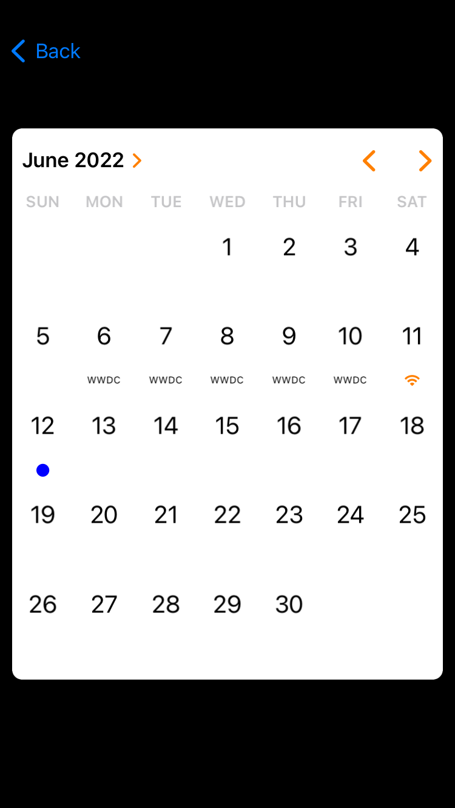

[苹果文档](https://developer.apple.com/documentation/uikit/uicalendarview)

### PageControl

UIPageControl 这个控件也做了一些优化。

- PageControl 之前只可以左右滑动，现在可以自定义控件的排列方向和滑动方向了。提供了一个 `direction` 属性，支持各种方向和方式去滚动了。
- PageControl 之前只支持设置 indicator 的图片，而具体展示出来当前的页面的 indicator 样式依赖于系统去处理深色和浅色的变化来做区别。现在支持了自定义当前的 indicator 图片。

```swift
pageControl.direction = .topToBottom // 除此之外还支持bottomToTop, leftToRight, rightToLeft
pageControl.preferredIndicatorImage = UIImage(systemName: "square")
pageControl.preferredCurrentPageIndicatorImage = UIImage(systemName: "square.fill") // New
```


[苹果文档](https://developer.apple.com/documentation/uikit/uipagecontrol)

不知道有多少读者在用系统的 pageControl，小编长年以来都是使用自定义的 pageControl 来满足 UE 大佬们变态的需求，此次更新还是离这些需求的距离有些遥远，只能说是聊胜于无吧。

### PasteBoard

 Apple 一直在持续更新一些功能来保护用户隐私和安全。

在 iOS 15，当 App 在不使用系统提供的 Paste 接口，而是以代码的方式访问 pasteboard 时，会在屏幕上展示一个横幅来提醒用户。

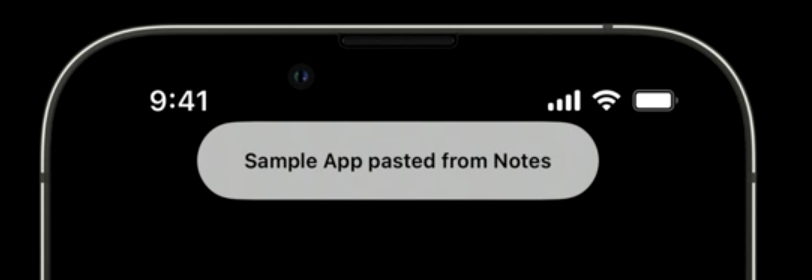

而在 iOS 16 会弹出一条 alert 向用户询问是否同意使用 pasteboard ，用户同意之后才能拿到内容。

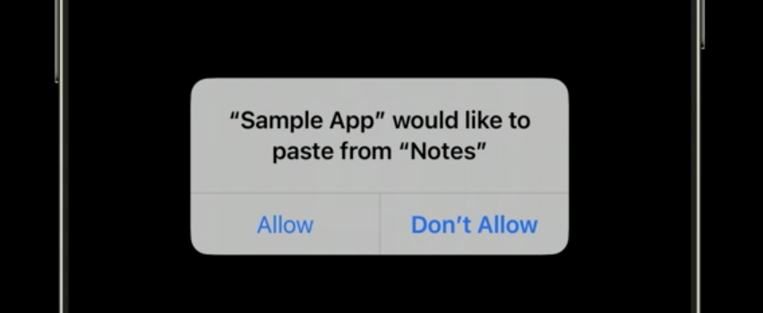

如果不想弹这个 alert ，开发者需要使用系统提供的粘贴接口来隐式地访问 pasterboard 的内容。

如果开发者使用了自定义的粘贴控件，可以用这个新的 UIPasteControl 来替换它们，这个控件的外观和行为类似于 fill 样式的 UIButton。只要 pasteboard 获得与控件的粘贴 target 兼容的内容，它就会变成 enable 的状态。它的样式如下

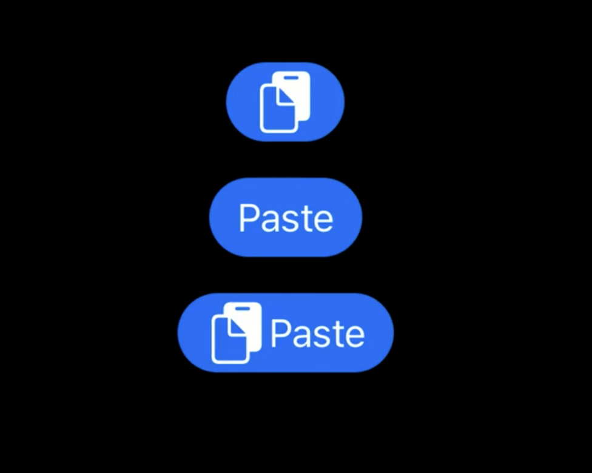

[苹果文档](https://developer.apple.com/documentation/uikit/uipastecontrol)

## API 改动

### 自定义 Sheets

 iOS 15 给 Sheets 增加了 detent 属性，包含 large 和 medium 两种样式，使得 sheet 可以在页面中展示出两种不同的高度。

 iOS 16 对于这个属性做了扩展，增加了 custom 样式。开发者使用 custom 可以自己来定义 sheet 展示出来的高度。custom 样式支持给高度赋一个常数值，或者给一个最大高度的百分比。而且自定义的 detent 是可以通过提供 Identifier 来实现复用的。

需要注意的是这个高度值不能包含底部的安全区高度，以便我们在浮窗展示和跟底部相连的 sheets 展示时候，样式不会出现问题。

```swift
sheet.detents = [
    .custom { context in
        200.0 // 常数类型
    },
    .custom { context in
        context.maximumDetentValue * 0.8 // 百分比类型
    }
]
```

[苹果文档](https://developer.apple.com/documentation/uikit/uisheetpresentationcontroller/detent)

### SF Symbols 的新功能

#### 渲染模式

SF Symbols 支持四种渲染模式：单色、多色、分层和调色板。

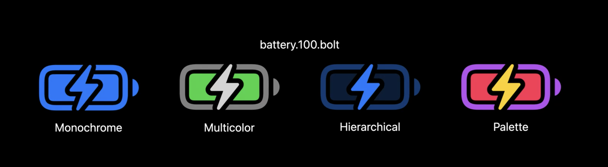

在 iOS 15 及以前，UIKit 默认会使用单色渲染，但在 iOS 16 里，UIKit 可能会默认使用其他的模式来渲染。例如一些设备相关的 Symbols，在 iOS 16 会默认使用分层渲染。

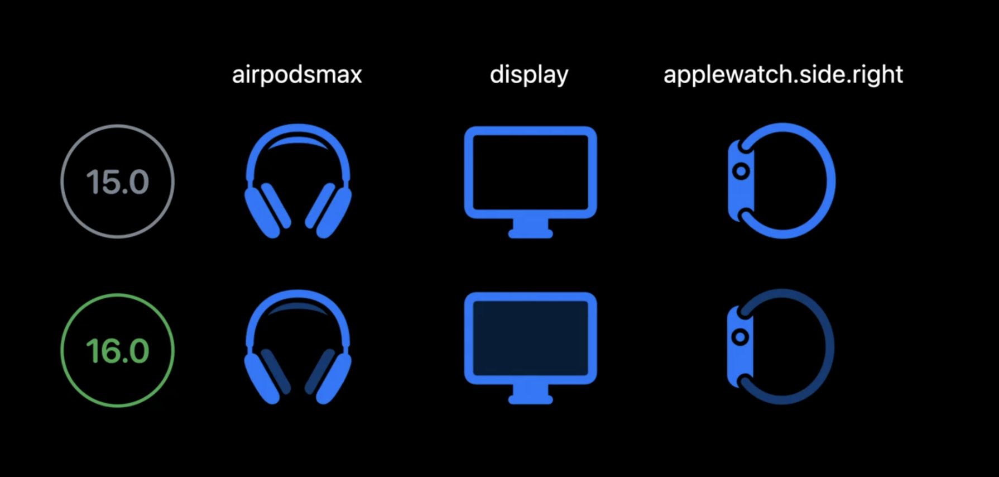

如果在 iOS 16 里依然需要使用单色渲染，那我们需要通过如下方式单独进行设置

```swift
UIImage.SymbolConfiguration.preferringMonochrome() 
```

#### 变量渲染

UIKit 增加了对可变 Symbol 的支持，我们可以给他设置一个从 0-1 范围内的值来控制它展示不同的样式。例如我们想要展示 wifi 强度的时候，就可以通过设置 wifi 的图片的变量来实现。以上提到的这两种（变量渲染与渲染模式）是可以混合使用的。下面提供一个简单的例子。

```swift
let image = UIImage(
    systemName: "wifi",
    variableValue: 0.4,
    configuration: UIImage.SymbolConfiguration(paletteColors: [.orange])
)
```

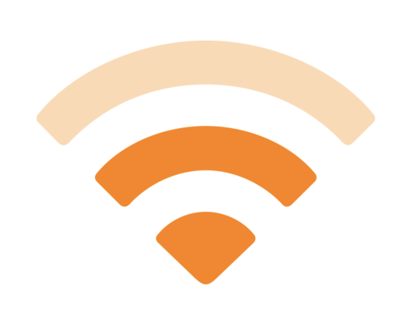

现在许多系统符号现在都支持可变渲染，并且开发者也可以更新其自定义符号以支持可变性。想要了解如何创建自定义变量符号，可以去看“[在 SF Symbols 中采用可变颜色](https://developer.apple.com/videos/play/wwdc2022/10158/)”和“[SF Symbols 4 中的新特性](https://developer.apple.com/videos/play/wwdc2022/10157/)”。

[苹果文档](https://developer.apple.com/documentation/uikit/uiimage/3955178-init)

### Swift 并发编程改动

去年已经在 SwiftUI 里面引进了并发编程，不了解的同学可以去 [**【WWDC21 10019】在 SwiftUI 中遇见并发编程**](https://xiaozhuanlan.com/topic/2957164803)了解一下历史。这里主要介绍一下今年的改动。

iOS 16 为了迎合 swift 并发编程这一特性，让 UIImage, UIColor, UIFont, UITraitCollection 等不可变类型也遵循 Sendable 协议，这使得我们可以在 MainActor 和自定义的 Actor 之间传递它们而不会引起编译器警告。

由于这些类型是不可变的，在后续的步骤里如果需要对这些对象进行修改，就必须得创建一个 copy 对 copy 进行操作，这样原对象还是原来的样子，其他使用原对象的地方也不会受到影响。而与之相比，UIBezierPath 是可变类型，不够安全，所以无法遵循 Sendable 协议。

有想了解更多关于 swift 并发编程和 Sendable 协议的，可以去看“[使用 Swift 并发消除数据竞争](https://developer.apple.com/videos/play/wwdc2022/110351/)”和“[可视化和优化 Swift 并发](https://developer.apple.com/videos/play/wwdc2022/110350/)”。

### Stage Manager

iOS 16  对额外展示提供了更多的支持。开发者如果没有使用 UIScreen 相关 API 的话，无需对此做任何改动。但如果使用了的话就需要注意了。开发者现在不能再假设 app 是在 main screen 上了，因为接下来会把 `UIScreen.main` 和 `UIScreen生命周期的通知` **废弃**掉。

如果开发者还没有用 UIScene 的话，现在为了支持多窗口，就需要做一些调整了。

### 自适应 Cell

UICollectionView 和 UITableView 中的 Cell 现在可以根据 Cell 里面的内容变化自己适应大小了。为此 UIKit 给这两个组件提供了一个 `selfSizingInvalidation` 的属性，这个属性默认是 enbaled 的状态。

```swift
    @available(iOS 16.0, *)
    public enum SelfSizingInvalidation : Int, @unchecked Sendable {

        /// No updates will take place when -invalidateIntrinsicContentSize is called on a self-sizing cell or its contentView.
        case disabled = 0

        /// Calling -invalidateIntrinsicContentSize on a self-sizing cell or its contentView will cause it to be resized if necessary.
        case enabled = 1

        /// Calling -invalidateIntrinsicContentSize on a self-sizing cell or its contentView will cause it to be resized if necessary, and
        /// any Auto Layout changes within the contentView of a self-sizing cell will automatically trigger -invalidateIntrinsicContentSize.
        case enabledIncludingConstraints = 2
    }
```

当自适应属性启用的时候，Cell 可以让它所在的 TableView 或者是 CollectionView 重新布局。如果你使用 UIListContentConfiguration  来设置 cell，自适应会在 cell 的配置发生变动的时候自动触发。当然我们也可以在 cell 里调用 `invalidateIntrinsicContentSize` 方法来手动触发重新布局。如果在 cell 的布局里中使用了 Autolayout ，我们可以用 `enabledIncludingConstraints`。当 cell 检测到它的 contentView 内的有任何自动布局更改时，它会自动调用自身的 `invalidateIntrinsicContentSize`。

默认情况下，cell 大小发生变化时会有动画，这时候我们可以把 `invalidateIntrinsicContentSize` 的调用放在 `UIView.performWithoutAnimation` 的 block 里来去掉动画。就像这样：

```swift
UIView.performWithoutAnimation {
    self.invalidateIntrinsicContentSize()
}
```

UICollectionView 和 UITableView 会智能地将多个 cell 的大小变化合并成一次更新操作，在最佳时间去执行。

[苹果文档](https://developer.apple.com/documentation/uikit/uicollectionview/4001100-selfsizinginvalidation)

## 在 UITableView 和 UICollectionView 里使用 SwiftUI

在 iOS 16 中，提供了一种方式`UIHostingConfiguration`来使得 SwiftUI 的 cell 可以和 UIKit 的 cell 在同一个 TableView/CollectionView 里混合使用。

```swift
let cell = UITableViewCell()
cell.contentConfiguration = UIHostingConfiguration {
  /// 这里可以写swiftUI的代码
    VStack(spacing: 10) {
        Group {
            Text("SwiftUICell title")
                .font(.system(size: 20))
            Text("SwiftUICell description")
                .font(.system(size: 16))
        }
        .frame(
            maxWidth: .infinity,
            maxHeight: .infinity,
            alignment: .topLeading
          )
    }
}
return cell

//或者可以直接用已经封装好的SwiftUI的Cell
let cell = UITableViewCell()
cell.contentConfiguration = UIHostingConfiguration {
    SwiftUICell()
}
return cell
```

[苹果文档](https://developer.apple.com/documentation/SwiftUI/UIHostingConfiguration)

### UIDevice改动

1. 为了防止用户被标记， UIDevice.name 现在不再返回用户自定义的设备名称，而是设备的型号名称。如果想要获取用户自定义的设备名称，现在需要用户授权才可以。

2. 不再可以通过设置 UIDevice.orientation 来控制横竖屏了，取而代之的是 UIViewController 里面的方法`preferredInterfaceOrientation` 等 API。

[苹果文档](https://developer.apple.com/documentation/uikit/uidevice)
