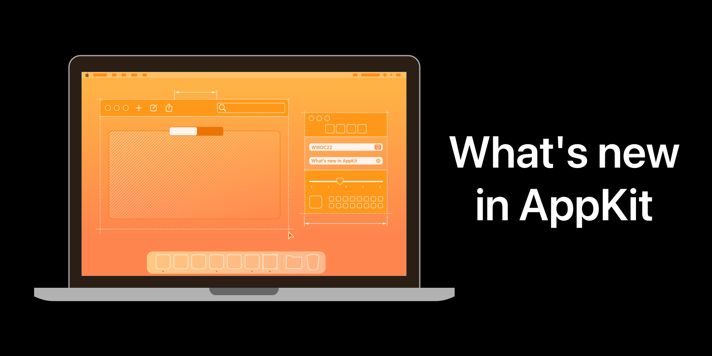

## 个人介绍

Ethan Wong，iOS 和 Mac 应用开发者，曾获 WWDC 21 & 22 学生挑战赛奖项。

## 审核介绍

Cyandev，目前就职于抖音基础技术团队，研发流程方向全栈工程师，在 Swift、大前端领域有比较丰富的经验。

王浙剑（Damonwong），老司机技术社区负责人、WWDC22 内参主理人，目前就职于阿里巴巴。

## 不超过 120 个字的文章简介

AppKit 是 macOS 应用的核心框架之一。WWDC22 对 AppKit 框架的更新包括对设计语言的完善和平台一致性相关的演进。本文将介绍 AppKit 在 WWDC22 上的新特性和开发者的适配要点。

## 公众号/小专栏图文头图

