# WWDC22 10074 - AppKit 框架的新特性

> 作者：Ethan Wong，iOS 和 Mac 应用开发者，曾获 WWDC 21 & 22 学生挑战赛奖项。
>
> 审核：

> **注：因为文章撰写时，相关的特性和对应的 API 还处于 Beta 阶段，我们将根据最终的 API 更新一些内容**

AppKit 构建了 macOS 的核心用户体验，是大多数 Mac 应用开发者使用最多的框架之一。AppKit 框架拥有相当长的历史，Apple 对其的演进代表着对 macOS 交互的体验的思考和期望。和 WWDC21 一样，WWDC22 对 AppKit 框架的更新对 macOS Big Sur 以来的全新设计语言进行了进一步的完善，同时也包含了平台一致性相关的演进。

本文将介绍 AppKit 在 WWDC22 上的新特性和开发者的适配要点。

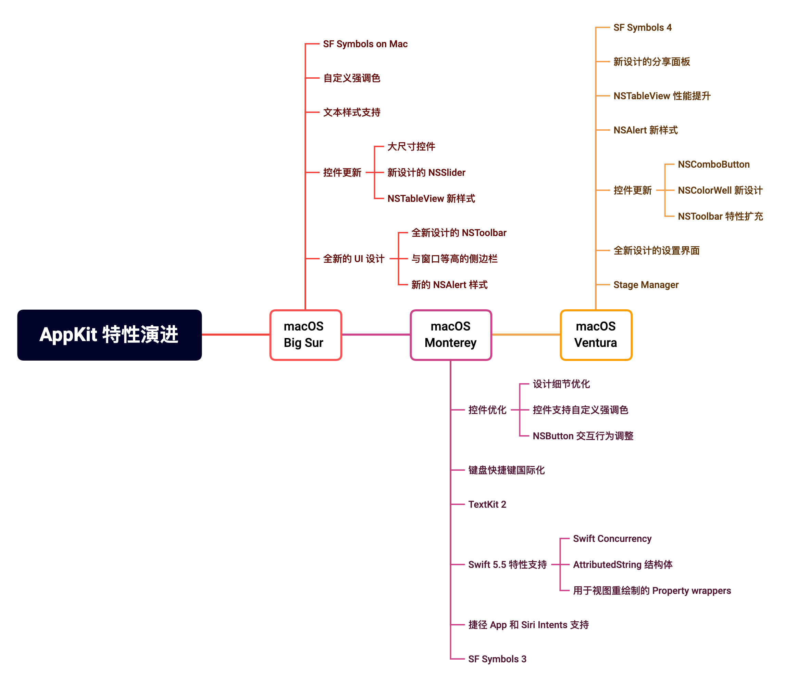

> 阅读建议
>
> - 如果你是原生 Mac 应用开发者，建议通篇浏览本文；
>
> - 如果你使用 SwiftUI 或 Catalyst 技术开发了 Mac 应用，同时希望了解 WWDC22 中相关技术的演进，可以参考下面的 Sessions：
>
>   - [Session 10075 - Use SwiftUI with AppKit](https://developer.apple.com/videos/play/wwdc2022/10075)
>
>   - [Session 10068 - What's new in UIKit](https://developer.apple.com/videos/play/wwdc2022/10068)
>
> - 本文中讨论的新特性的相关的 Session 链接会在各个章节中给出，可以根据需要进行扩展阅读；
>
> - 除了对框架的更新之外，WDC22 还更新了人机交互指南 (HIG, Human Interface Guidelines)。新的人机交互指南更强调平台间的交互一致性，可以通过下面的链接阅读：
>
>   - [Human Interface Guidelines](https://developer.apple.com/design/human-interface-guidelines/guidelines/overview/)

## Stage Manager

Stage Manager 是 macOS Ventura 和 iPadOS 16 的新特性。该特性可以将不活跃的窗口收起到侧面，同时将活跃的窗口居中显示，以帮助用户将注意力集中在当前交互中的窗口上。用户可以通过拖动的方式将窗口聚合成组，聚合成组的窗口可以同时被唤起或收起。当用户开启 Stage Manager 时，打开新的窗口会收起当前活跃的窗口。

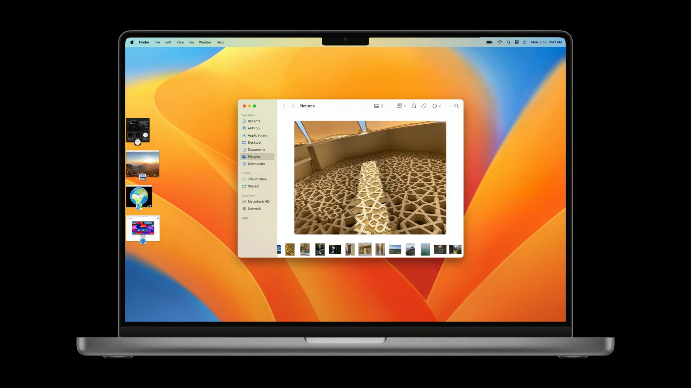

Stage Manager 没有引入新的公开 API，开发者可以通过现有的 API 使应用的窗口正确适配 Stage Manager 的行为：

1. 普通窗口（`NSWindow` 实例）的各项特性将遵从原有的 API 行为。

2. 打开一个新窗口时，如果被打开的窗口是浮动面板（floating panel)、或模态窗口（modal window）或其 `toolbarStyle` 的值为 `.preference`，Stage Manager 不会收起当前活跃的窗口。

   > - 浮动特性由 `isFloatingPanel` 属性来控制。当面板（`NSPanel` 实例）`isFloatingPanel` 属性值为·`true` 时，会产生区别于普通面板的一系列的行为，具体细节可以查阅文档：[isFloatingPanel](https://developer.apple.com/documentation/appkit/nspanel/1531901-isfloatingpanel)。
   > - 对于面板（`NSPanel` 实例）和窗口（`NSWindow` 实例）的行为异同，可以查阅文档 [How Panels Work](https://developer.apple.com/library/archive/documentation/Cocoa/Conceptual/WinPanel/Concepts/UsingPanels.html#//apple_ref/doc/uid/20000224)。
   > - `NSWindow.toolbarStyle` 在 macOS Big Sur 中被引入，用于适配新的 toolbar 样式，具体细节可参阅 [Session 10104 - Adopt the new look of macOS](https://developer.apple.com/videos/play/wwdc2020/10104)。

3. 如果窗口实例的 `collectionBehavior` 属性值包含了 `.fullScreenAuxiliary`、`.moveToActiveSpace`、`.stationary` 或者 `.transient` 的任何一个，则 Stage Manager 不会对其进行管理。

   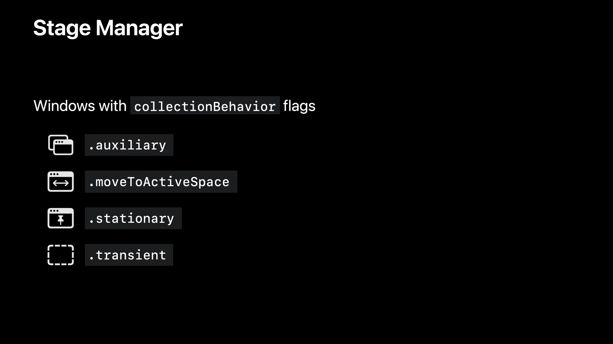

   > `NSWindow.collectionBehavior` 属性容易让开发者感到困惑。该属性在历史上进行了多次扩充，间接反映了 macOS 的窗口管理特性的迭代历程:
   >
   > - `collectionBehavior` OS X 10.5 中首次引入，包含 `.canJoinAllSpaces` 和 `.moveToActiveSpace` 两个定义，用于适配多桌面空间。
   >
   > - OS X 10.6 为 `collectionBehavior` 添加了 `.managed`、`.transient` 和 `.stationary` 三个定义，用于更好地适配 「Exposé」 特性。同时还添加了 `.participatesInCycle` 和 `ignoresCycle` 两个定义，用于适配「窗口」菜单中的「循环显示窗口」特性。
   >
   > - OS X 10.7 为 `collectionBehavior` 添加了 `.fullScreenPrimary`、`.fullScreenAuxiliary` 和 `.fullScreenNone` 三个定义，用于适配窗口的全屏幕特性。
   >
   > - OS X 10.11 为 `collectionBehavior` 添加了 `fullScreenAllowsTiling` 和 `fullScreenDisallowsTiling` 两个定义，用于适配全屏分屏的特性。

## 偏好设置

### 全新设计的系统设置

macOS Ventura 对系统偏好设置进行了全新的设计。

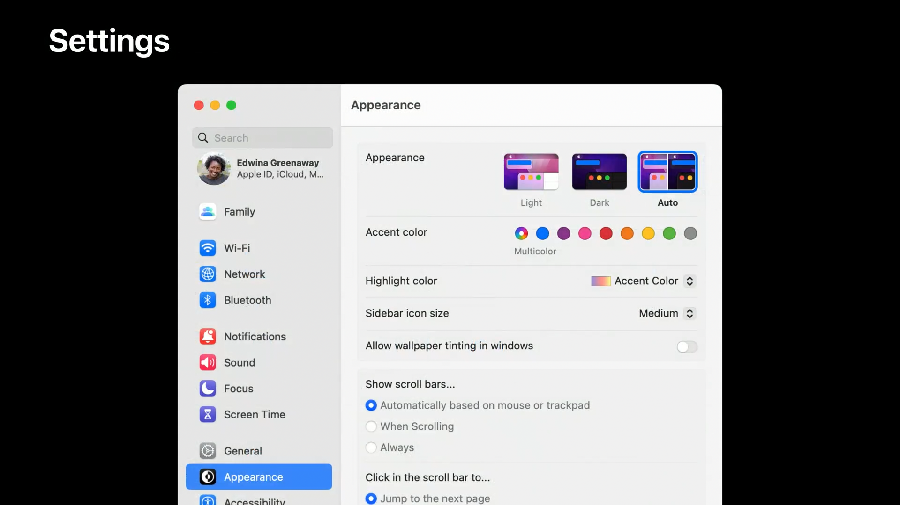

自定义安装的偏好设置面板（preference bundles）将保持原有的兼容性，在设置面板的左侧的边栏上显示入口。

> 在 macOS Ventura Beta 1 上，自定义安装的设置面板没有显示到侧边栏上，该问题在 macOS Ventura Beta 2 得到修复。

### 文案更新

为了和其他系统对齐，文案「偏好设置」 被重命名为「设置」。

链接到 macOS 13.0 SDK 的应用，在 macOS Ventura 系统上，AppKit 会自动对应用菜单中的「偏好设置」菜单项文案进行转换。开发者需要自行调整应用内其他场景的相关文案。

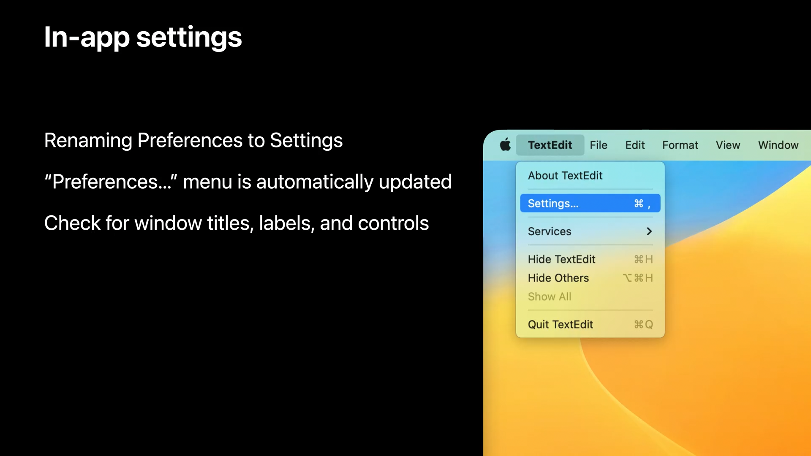

> AppKit 的这一实现并不优雅，是通过直接比较菜单项标题文案判断是否需要进行转换的。菜单标题为「Preferences」、「Preferences…」（U+2026, Horizontal Ellipsis）或是「Preferences...」都会命中这一行为，国际化文案同理。开发者无法禁用这项行为。同时，这并不是 AppKit 第一次根据应用链接的 SDK 版本使用不同的行为。例如，`NSWindow.toolbarStyle` 和 `NSTableView.style` 属性的默认值都仅在应用链接的 SDK 版本大于或等于 11.0 时才会生效。

### SwiftUI `Form` 的新设计

Apple 对表单的设计风格进行了优化，以更好地适配新的 macOS 设置界面风格，表单控件可以自动地根据当前环境进行布局。

对于 SwiftUI `Form` 编写的表单界面，可以直接通过设置 `FormStyle.grouped` 来获得这种样式。该样式会将文本框和菜单按钮等控件渲染成无边框的样式，仅在鼠标悬停在其上方时展示出边框。同时，`Toggle` 组件渲染成尺寸较小的开关样式。SwiftUI 会自动处理表单自身的滚动行为以及内部控件的布局和视觉效果。

```swift
Form {
  TextField("Computer Name", text: $name)
  Toggle("Screen Sharing", isOn: $screenSharing)
  Toggle("File Sharing", isOn: $fileSharing)
  Picker("AirDrop", selection: $airdrop) {
    ForEach(AirDropVisibility.allCases, id: \.self) {
      Text($0.label).tag($0)
    }
  }
}
.formStyle(.grouped)
```

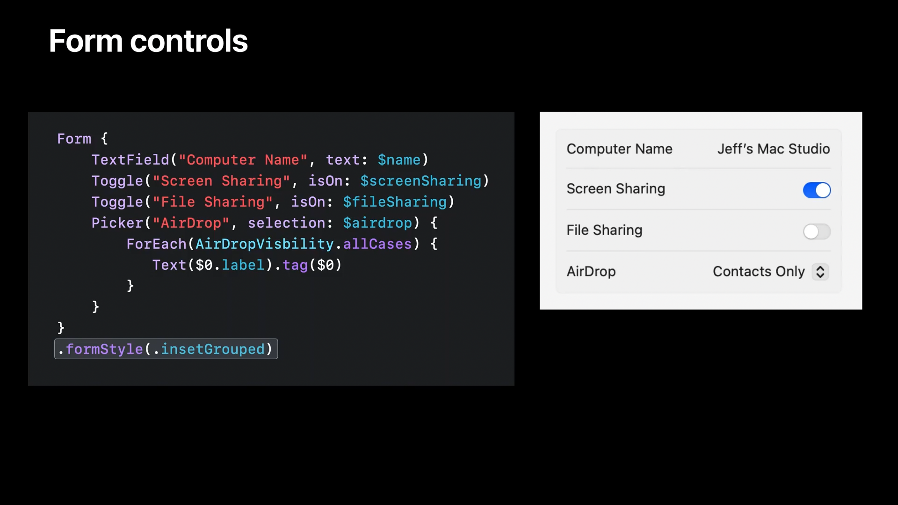

相较于仅限 macOS 平台的 AppKit 框架，SwiftUI，具有天生的跨平台属性。使用 SwiftUI `Form` 编写的表单界面可以自动适配包括 iOS、WatchOS 和 tvOS 在内的全部 Apple 平台。

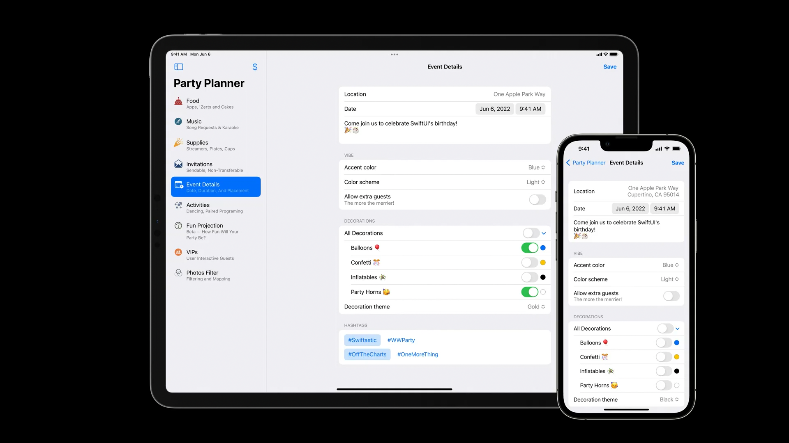

> - `FormStyle` 和 `.formStyle(_:)` 仅仅是 SwiftUI 在 WWDC22 得到的的新 API 和多项改进的一部分。有关 SwiftUI 在 WWDC22 上的演进的详细内容，可以参阅 [Session 10052 - What's new in SwiftUI](https://developer.apple.com/videos/play/wwdc2022/10052)。
> - 尽管 Session 中的代码示例使用了 `FormStyle.insetGrouped`，macOS Ventura Beta 的 SDK 提供的枚举名是 `FormStyle.grouped`。

> 值得注意的是，通过 Xcode 的 View Debugging 能力不难发现，`Form` 的新样式是完全使用 SwiftUI 绘制的，其中除了 NSScrollView 容器以外没有使用任何 AppKit 的原生交互控件。开发者使用 AppKit 难以还原出与其一致视觉和交互效果。

Apple 推荐从设置面板开始对 AppKit 应用程序逐步使用 SwiftUI 进行重构。

## 控件更新

### `NSComboButton`

触发点击操作和弹出菜单是常见的按钮交互行为。新的控件 `NSComboButton` 组合了 `NSButton` 和 `NSPopUpButton` 的特点：

`NSComboButton` 有 `.split` 和 `unified` 两种样式。`.split` 样式将 comboButton 呈现为一个普通按钮、分割线和一个下拉按钮，而 `.unified` 样式的 comboButton 看起来和普通按钮无异，但长按时可以弹出对应的操作菜单。

```swift
class NSComboButton: NSControl {

  enum Style {
    case split
    case unified
  }

  var style: NSComboButton.Style

}
```

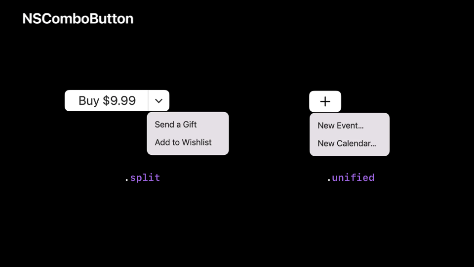

> 本 Session 中提到，在以往开发者可能会使用 `NSSegmentedControl` 来实现类似 `NSComboButton` 的按钮。在 Mail.app 中有一些按钮与 `NSComboButton` 提供的行为一致，例如 toolbar 上的「过滤」和「旗标」按钮。但实际上，在 macOS Ventura Beta 中，这几个按钮仍然是使用 `NSSegmentedControl` 实现的。

### `NSColorWell` 新设计

`NSColorWell` 的默认样式得到了重新的设计，其样式与其他控件更统一。同时，Apple 为 `NSColorWell` 添加 `.minimal` 和 `.expanded` 两种新样式，这两种新的样式自带下拉式菜单。

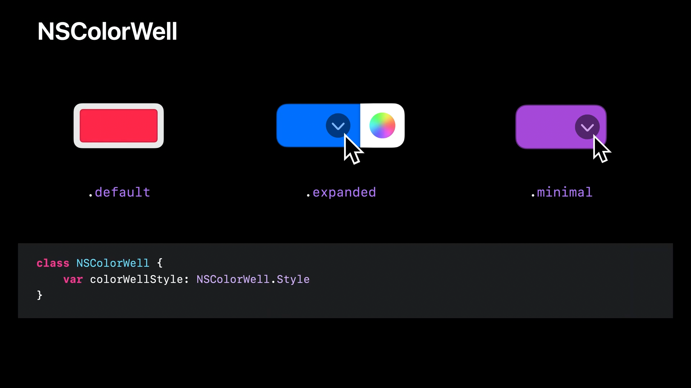

`NSColorWell` 控件的下拉菜单可以通过修改独立的 `pulldownTarget` 和 `pulldownAction`，来自定义其行为，而不影响 colorWell 自身的操作行为。

### `NSToolbar` 新特性

#### `NSToolbarDelegate` 的新增方法

- 可以通过委托方法 `NSToolbarDelegate.toolbarImmovableItemIdentifiers(_:)` 来指定不可被移动的 toolbar 元素。

- 委托方法 `NSToolbarDelegate.toolbar(_:itemIdentifier:canBeInsertedAt:)` 允许开发者细粒度地控制 toolbar 元素的顺序，当用户在拖动 toolbar 上的元素进行排序时，AppKit 会持续调用该委托方法确认被操作的元素是否允许被放置在特定的下标位置。

  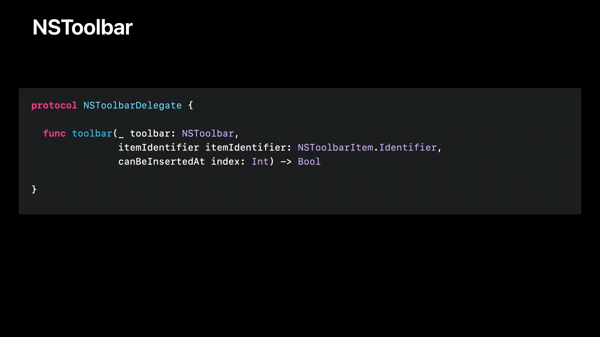

#### `NSToolbar` 的新特性

- 通过 `NSToolbar.centeredItemIdentifiers` 开发者可以指定多个被固定居中的 toolbar 元素，同时 `NSToolbar.centeredItemIdentifier` 属性被废弃。

  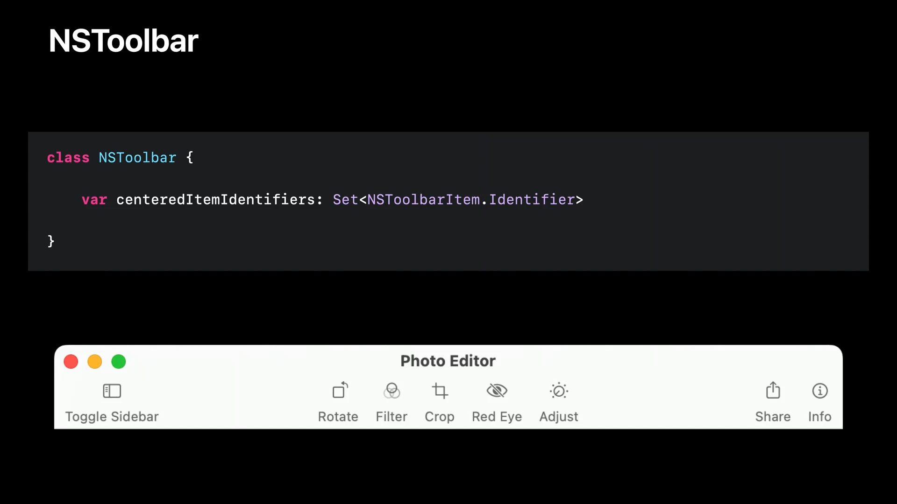

- 在以往，toolbar 元素的文案变化会导致元素的整体尺寸发生变化，为了避免这一现象的发生，开发者现在可以通过 `NSToolbarItem.possibleLabels` 预先指定元素可能的文案，AppKit 会预先计算出最大文本长度并在布局时留出空间，从而避免元素的大小随文案发生变化。

  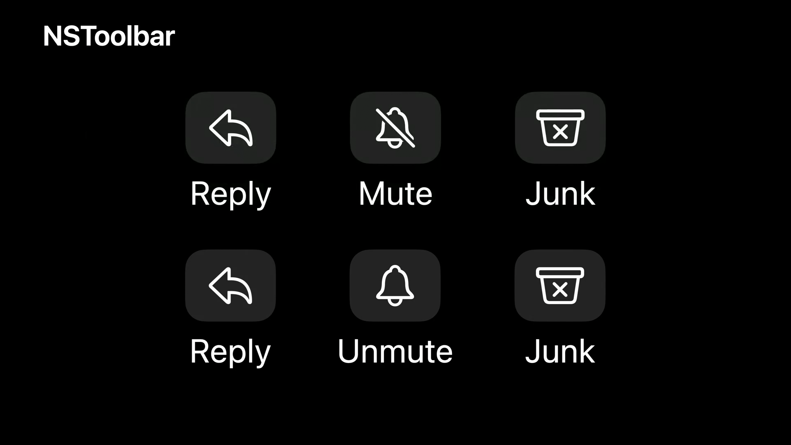

## `NSAlert` 的新设计

Alert 的样式得到了优化，当其中的文案很长时，或其包含的 `accessoryView` 宽度很大时，`NSAlert` 会自动进行使用类似于 macOS Catalina 的 NSAlert 样式。该样式横向展示按钮。使 alert 的内容更容易阅读，开发者无需针对该特性做任何适配。值得注意的是，动态更新 alert 的内容不会导致其样式的切换。

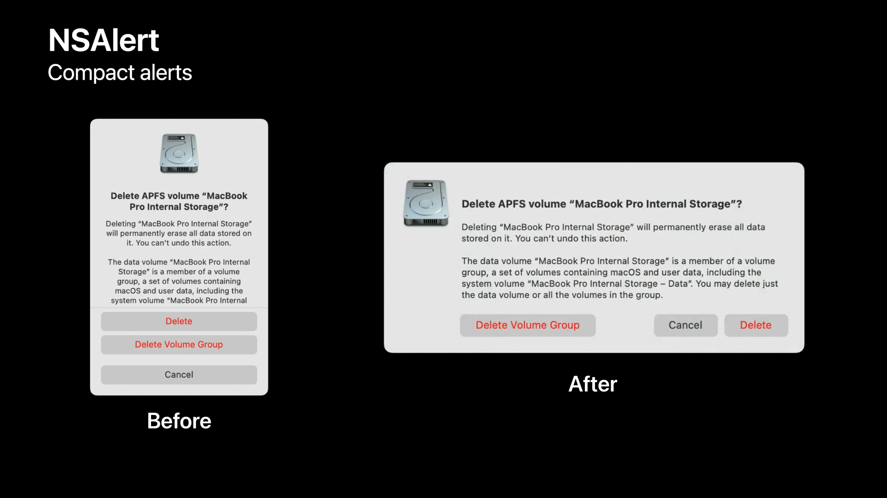

## `NSTableView` 性能提升

在过去，`NSTableView` 的实现会预先计算自身的总高度和每一行的高度，当 table 各行行高度不一致时，首次加载的性能会比较差。macOS Ventura 对这一行为进行了优化，table 现在会根据可视区域内和附近的行的高度动态计算出预估的行高（Running Estimated Height）。Table 在滚动的过程中会根据需要动态请求实际的行高，并对预估的行高进行替换，正确维护好每一行的位置。

当 table 的内容行数很多时，这项优化会大幅提升其加载性能，但这会改变 `NSTableViewDelegate.tableView(_:, heightOfRow:)` 委托方法的调用时序。因此，开发者的业务逻辑不应当依赖 table 请求行高的时机，或者进行其他的一些可能带有副作用的操作。

这项优化将自动在 macOS Ventura 上对所有的 `NSTableView` 和 SwiftUI `List` 实例生效。

> 与 UIKit 的 `UITableView` 不同的是，`NSTableView` 的行高估算行为完全由 AppKit 控制，并没有以 API 的形式开放给开发者。

## `SF Symbols` 新特性

### 偏好渲染模式（Preferred Rendering Mode）

macOS Ventura 的 SF Symbols 更新到了 4 版本，该版本添加了更多的符号，包括日常的物件、货币和运动项目等。

SF Symbols 中的符号有包括单色、分层、调色盘和多色在内的四种渲染模式。SF Symbols 4 为所有符号都定义了一个偏好的渲染模式，对应的模式会被 AppKit 自动选用。开发者可以使用 `NSImage.NSImageSymbolConfiguration` 对其进行覆盖。

### 可变符号（Variable Symbols）

SF Symbol 4 新增了可变符号。一些符号例如 Wi-Fi 信号和音量等可能被用来传达数值。现在，开发者可以直接通过 0-1 之间的浮点数值来构造 `NSImage` 对象来得到用于表达数值的符号图片。

```swift
class NSImage {

  public init?(
    symbolName: String,
    variableValue: Double,
    accessibilityDescription: String?
  )

  public init?(
    systemSymbolName: String,
    variableValue: Double,
    accessibilityDescription: String?
  )

}
```

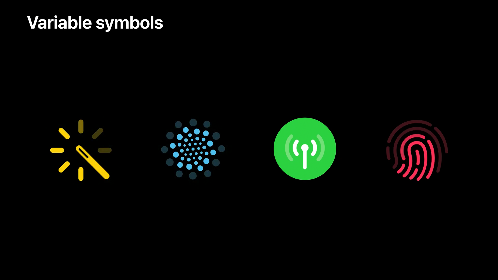

对于不支持这项特性的符号，构造函数中的 `variableValue` 数值将被忽略。

> 有关 SF Symbol 4 在其他平台上的新特性，可参考 [Session 10157 - What's new in SF Symbols 4](https://developer.apple.com/videos/play/wwdc2022/10157)

## 共享相关的新特性

macOS Ventura 重新设计了分享面板，相比原先的分享菜单，新的分享面板和 iOS 上的样式更类似，例如列出建议的接收者。`NSSharingServicePicker` 原有的能力将保持不变。

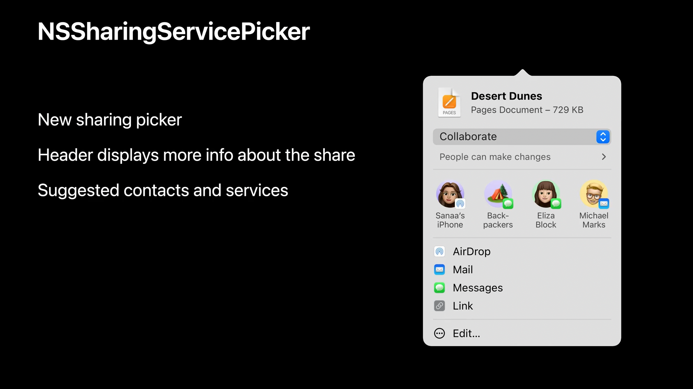

分享 URL 时，分享面板会自动在标题区域显示对应的文件名、类型、标题和文件图标。对于自定义的分享项，开发者可以通过实现新协议 `NSPreviewRepresentableActivityItem` 来指定分享面板标题区域的内容。

```swift
protocol NSPreviewRepresentableActivityItem: AnyObject {

  /* The item to be shared */
  var item: Any { get }

  /* A localized string representing the item's name or title */
  optional var title: String? { get }

  /* A provider for a full-sized image that represents the item */
  optional var imageProvider: NSItemProvider? { get }

  /* A provider for a thumbnail-sized icon that represents the item */
  optional var iconProvider: NSItemProvider? { get }

}
```

开发者也可以直接使用实现了上述协议的 `NSPreviewRepresentingActivityItem` 类：

```swift
class NSPreviewRepresentingActivityItem: NSPreviewRepresentableActivityItem {

  init(item: Any, title: String?, image: NSImage?, icon: NSImage?)
  init(item: Any, title: String?, imageProvider: NSItemProvider?, iconProvider: NSItemProvider?)

}
```

一些应用可能需要在菜单中进行分享，在以往，对于这种场景，开发者通常会实现自定义的子菜单用来分享。现在，通过使用 `NSSharingServicePicker.standardShareMenuItem`，用户可以直接通过菜单项打开标准的分享面板。对于上下文菜单，分享面板还会自动指向菜单对应的视图：

```swift
class NSSharingServicePicker {
  var standardShareMenuItem: NSMenuItem
}
```

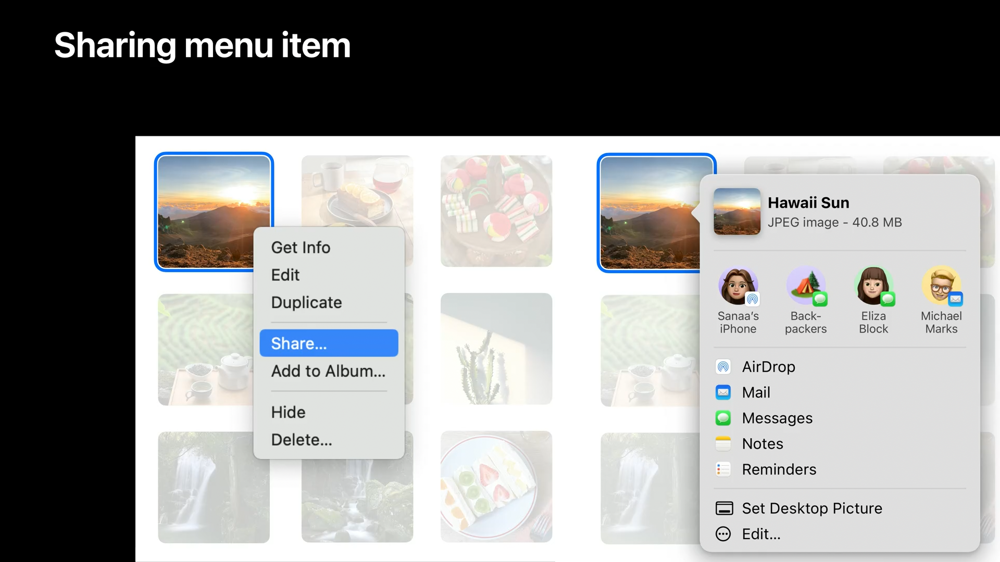

> 除了对分享面板的改进，WWDC22 还提供了很多与协同相关的新特性，这些特性在下面的 Session 中有详细的介绍：
>
> - [Session 10095 - Enhance collaboration experiences with Messages](https://developer.apple.com/videos/play/wwdc2022/10095)；
>
> - [Session 10093 - Integrate your custom collaboration app with Messages](https://developer.apple.com/videos/play/wwdc2022/10093)。

## 总结和展望

本文详细介绍了 AppKit 在 WWDC22 中的演进，包括 Stage Manager、全新的系统设置、控件更新、SF Symbols 4 以及共享相关的新特性。AppKit 作为 macOS 平台特有的应用框架，经历了诸多版本的历史迭代后，沉淀了很多创新且独特的用户交互模式，但同时也非常庞大和复杂。开发者通常需要特别细心并配合一定的经验技巧才能正确使用它。相比于 UIKit 和 SwiftUI 等新兴的应用框架，AppKit 的发展显得有些疲态，Apple 对其的投入也不及其他框架。尽管如此，AppKit 的这些特性变化，映射了 Apple 对于跨设备、跨平台体验一致性的布局，也包含对 Mac 特有的桌面体验的重视。

SwiftUI 和 Catalyst 技术已经能够大大降低构建 Mac 应用的门槛。SwiftUI 是 Apple 目前主推的构建 Mac 应用程序的方案，可以预见未来会出现大量使用 SwiftUI 开发的 Mac 应用。但 AppKit 仍然代表着 macOS 系统区别于其他平台和操作系统的核心体验，在短时间内很难被取代，也是原生 Mac 应用程序的开发者必须学习和掌握的框架。
