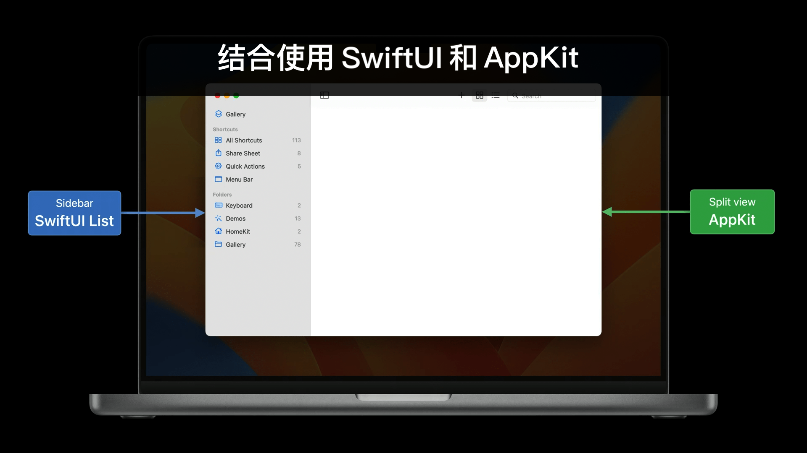

## 个人介绍

瓮杰，就职于 TikTok 研发国际音乐团队。

## 审核介绍

Jake Lin, 在 REA Group 担任 Senior Mobile Tech Lead，负责公司的移动研发和团队建设。喜欢研究 iOS 和 Android 两平台的架构，爱折腾声明式 UI 和响应式编程范式。并编写了 [iOS 开发进阶](https://t2.lagounews.com/lR59RGRBct5E3) 课程。

## 不超过 120 个字的文章简介

本文以 macOS 版本的快捷指令应用（Shortcuts）为例，介绍把 SwiftUI 和 AppKit 结合使用的一些方式和注意事项。

## 公众号/小专栏图文头图

