# Session 10075 - 结合使用 SwiftUI 和 AppKit

本文基于 [Session 10075](https://developer.apple.com/videos/play/wwdc2022/10075/) 梳理。

随着 Apple 的不断迭代，SwiftUI 的功能也年臻完善，但我们仍未达到彻底抛弃 AppKit/UIKit 完全使用 SwiftUI 开发 app 的阶段。一方面对于既有代码而言，渐进地使用 SwiftUI 重构是一种低成本的手段；另一方面，SwiftUI 的能力目前还无法很好地支持一些功能场景，比如富文本编辑等。因此，SwiftUI 和 AppKit/UIKit 共存的局面依然要持续一段时间。

本文以 macOS 版本的快捷指令应用（Shortcuts）为例，介绍把 SwiftUI 和 AppKit 结合使用的一些方式，主要包括下列内容：

- 如何在 AppKit 中使用 SwiftUI，并在二者之间传递数据；
- 如何在 Collection cell 和 Table cell 中使用 SwiftUI；
- 如何处理嵌入 AppKit 中的 SwiftUI View 的布局和尺寸；
- 如何管理事件响应链和焦点；
- 最后介绍如何在 SwiftUI 中使用 AppKit。

## 在 AppKit 中使用 SwiftUI

### 在 AppKit 中承载 SwiftUI View 的两种方式

有两种方式来在 AppKit 中承载 SwiftUI View：

1. 使用 [NSHostingView](https://developer.apple.com/documentation/swiftui/nshostingview)，将所要承载的 SwiftUI View 传递给构造函数参数 `rootView` 或者赋值给同名的实例属性 `rootView`。NSHostingView 实例是一个 NSView 对象，可以添加为其他 AppKit view 的子 view;
2. 使用 [NSHostingController](https://developer.apple.com/documentation/swiftui/nshostingcontroller)，类似于 NSHostingView，通过构造函数参数 `rootView` 来传递所要承载的 SwiftUI View，或者创建之后通过同名的 `rootView` 属性来进行修改。NSHostingController 的使用方式也同其他 NSViewController 一样，通过 present 相关的方法显示出来或者添加为其他 NSViewController 对象的子 VC。

### 使用 NSHostingController

本文将以快捷指令应用为例来介绍相关内容，下图是快捷指令的主界面结构图：

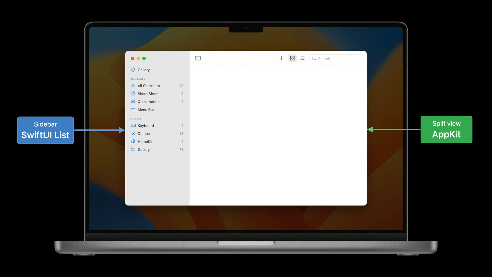

快捷指令应用的 UI 使用了典型的两栏结构，并通过 NSSplitViewController 来管理布局。左边的侧边栏则是由 SwiftUI List 来实现，示意代码如下。其中侧边栏的每一行由枚举值来表示，并用一个 State 变量 `selectedItem` 来记录当前选中的行：

```Swift
struct SidebarView: View {
    @State private var selectedItem: SidebarItem
    
    var body: some View {
        List(selection: $selectedItem) {
            ...
            Section("Shortcuts") { ... }
            Section("Folders") { ... }
        }
    }
}

enum SidebarItem: Hashable {
    case gallery
    case allShortcuts
    ...
    case folder(Folder)
}
```

本节开头介绍了两种承载 SwiftUI 的方式，在这里因为外层是一个 NSSplitViewController，该 VC 通过 NSSplitViewItem 来管理各个部分，每个 splitViewItem 容纳一个 NSViewController，因此使用 NSHostingController 来承载 SidebarView：

```Swift
let splitViewController = NSSplitViewController()

let sidebar = NSHostingController(rootView: SidebarView(...))
let splitViewItem = NSSplitViewItem(viewController: sidebar)
splitViewController.addSplitViewItem(splitViewItem)
```

### 在 AppKit 和 SwiftUI 之间传递数据

当用户在侧边栏行选择不同的选项时，右边的区域也要随之改变。但是保存选中状态的 `selectedItem` 是 `SidebarView` 的 State 变量，而 NSHostingController/NSHostingView 都没有提供访问其承载的 SwiftUI View 的相关 API，因此在 AppKit 层面是无法感知到状态变化的。

解决这个问题的方式也很简单：将 `selectedItem` 上移至 SwiftUI 和 AppKit 都能访问到的层级即可。比较好的方式是定义一个 [ObservableObject](https://developer.apple.com/documentation/combine/observableobject) 类来作为 model 层，然后将需要共享的可变状态定义为 ObservableObject 类的属性，并由 `@Published` 来进行修饰。ObservableObject 会为每个 @Published 属性合成一个 `objectWillChange` publisher，当这些属性的值将要发生变化时，会触发广播。

在构造 NSHostingController/NSHostingView 时将 ObservableObject 实例对象注入到 SwiftUI View 中，当 @Published 属性变化时，SwiftUI 会更新所有使用到该属性的 view 元素。在 AppKit 层，可以使用 Combine 框架来监听 ObservableObject 对象的 @Published 属性，从而在发生变化时做相应的处理。

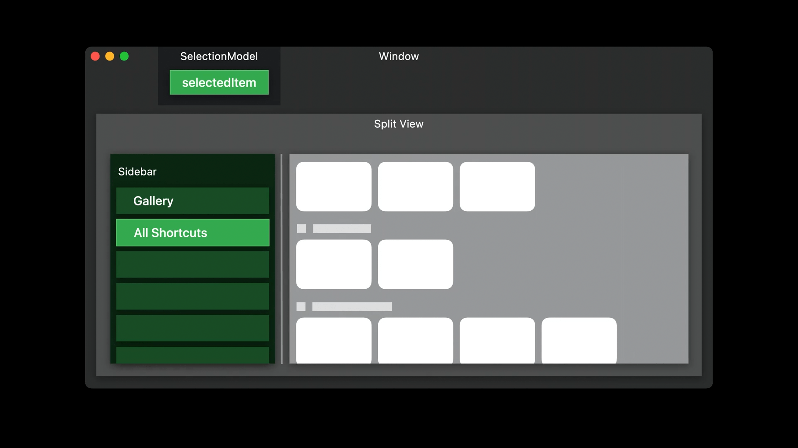

```Swift
class SelectionModel: ObservableObject {

    @Published var selectedItem: SidebarItem = .allShortcuts

}

// AppKit Window Controller
cancellable = selectionModel.$selectedItem.sink { newItem in
    // update the NSSplitViewController detail
}
```

### 使用 NSHostingView

接下来我们介绍另一种承载方式，通过 NSHostingView 在 NSCollectionView/NSTableView 的 cell 中使用 SwiftUI。如下图所示，快捷指令应用的 Collection cell 便是用 SwiftUI 实现，而且实际上是复用了主界面小组件的 view：

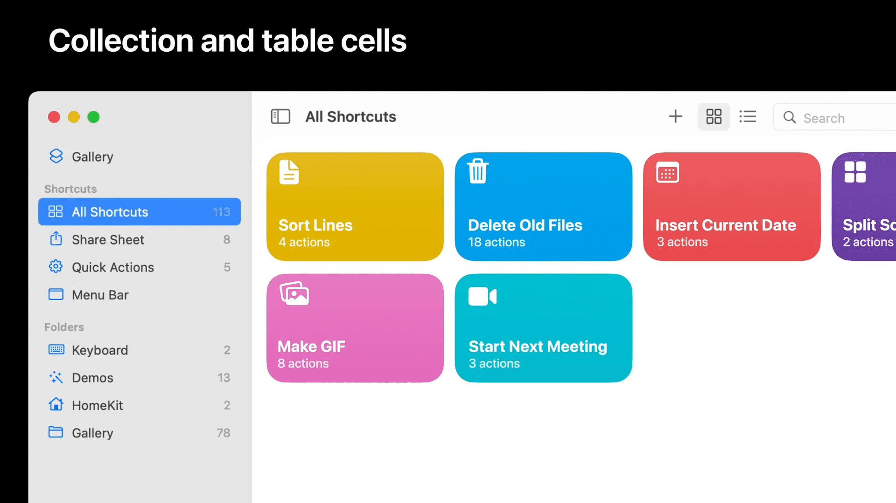

我们先看一下这一部分的代码：

```Swift
// Collection view item hosting SwiftUI

class ShortcutItemView: NSCollectionViewItem {
    private var hostingView: NSHostingView<ShortcutView>?

    func displayShortcut(_ shortcut: Shortcut) {
        let shortcutView = ShortcutView(shortcut: shortcut)

        if let hostingView {
            hostingView.rootView = shortcutView
        } else {
            let newHostingView = NSHostingView(rootView: shortcutView)
            view.addSubview(newHostingView)
            setupConstraints(for: newHostingView)
            self.hostingView = newHostingView
        }
    }
}
```

在 cell 中使用 SwiftUI 时，最佳实践是尽量地复用 NSHostingView 实例，并避免重复添加或移除 subview。在用户滑动过程中，NSCollectionView 和 NSTableView 会不断地重用已经创建好了的 cell，这个重用过程必须足够高效，以提供流畅的滑动体验。为了确保性能，在 cell 的重用逻辑中，要避免添加或移除 subview，因此 ShortcutItemView 只创建并添加了一个 NSHostingView 实例，当呈现不同的 shortcut 时只需要重新创建一个 ShortcutView 并更新现有 hostingView 的 rootView。

相比于 NSView，SwiftUI 的 View 是一个值类型，在设计的时候就考虑了状态变化的场景，创建和更新过程是足够高效的。当呈现一个新的 cell 的时候，displayShortcut 方法被调用，创建了一个新的 ShortcutView，结构如下图所示：

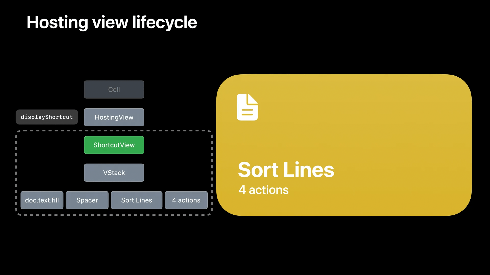

当该 cell 被重用以展示一个不同的 shortcut 时，会再次调用 displayShortcut 方法，创建一个新的 ShortcutView，但是 SwiftUI 会复用上个 view 的结构，因此只有实际发生变化部分才会被更新：

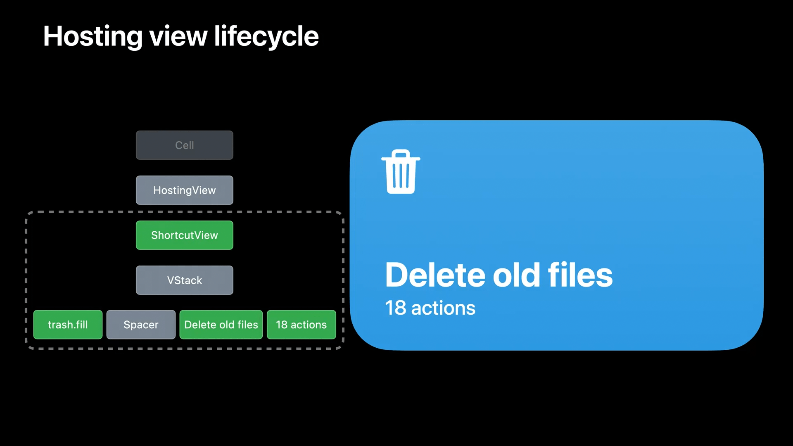

## 布局和尺寸

SwiftUI 会自动地为 NSHostingController/NSHostingView 创建并更新 Auto Layout 约束，这些布局约束基于其所承载的 SwiftUI View，其中：

- intrinsicContentSize 基于 View 的 idealWidth 和 idealHeight；
- 根据 View 的 frame modifier 指定的参数信息，SwiftUI 会更新布局约束，如指定的 width/height、最大/最小尺寸等都会被转换为等价的 Auto Layout 布局约束。

此外，也可以为其在 AppKit view 层级中的父 view 或者相邻 view 添加布局约束来调整承载 View 的布局。

在 macOS 中，用户可以调整窗体的尺寸，NSWindow 拥有 minSize/maxSize 属性来限制窗体的尺寸范围。当把 NSHostingView 设置成一个 window 的最上层 contentView 时，SwiftUI 会根据 View 的信息来自动地更新窗体的 minSize/maxSize 属性。NSHostingController 也是如此，当通过 present 相关的 API 将 hostingController 呈现为 popover、sheet、modal window 等时，窗体的 minSize/maxSize 也是基于所承载的 SwiftUI View 信息来决定的。

在 macOS Ventura 中，SwiftUI 为 NSHostingView 和 NSHostingController 增加了新的 API  来调整 SwiftUI 自动添加的布局约束：

```Swift
var sizingOptions: NSHostingSizingOptions
```

默认情况下 SwiftUI 会自动地创建 minimumSize、maximumSize 和 intrinsicSize 布局约束，可以通过新增的 sizeingOptions 属性来显式地指定需要的约束，从而禁用不需要的约束。

## 响应链和焦点管理

在结合使用 AppKit 和 SwiftUI 时，响应链和焦点管理也是很重要的一部分。响应链是 macOS 应用中的事件消息派发机制，当一个消息触发时，会在一系列的响应者之中寻找一个可以处理该消息的对象，AppKit 中一条典型的响应链如下图所示：

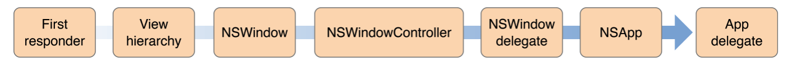

比如在下图所示的快捷指令应用中，用户选择 Menu bar 中的相应项时，首先会通过 selector 将该消息交由 firstResponder 来进行处理，如果当前对象无法处理就继续往上层层传递：

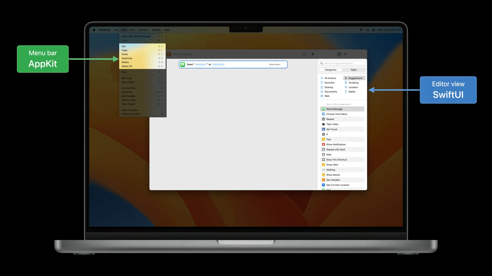

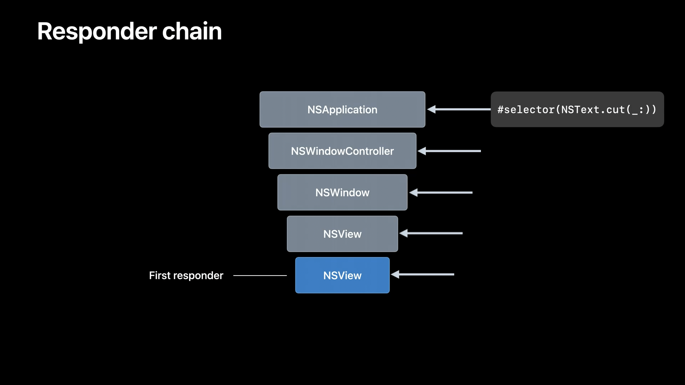

在 SwiftUI 中，与 firstResponder 等价的是 focused view，即当前获取焦点的 focusable view。一些 SwiftUI View 本身就是 focusable view，如 TextField，对于其他 View，可以用 [focusable](https://developer.apple.com/documentation/swiftui/link/focusable(_:)) API 来添加焦点支持，用 [FocusState](https://developer.apple.com/documentation/SwiftUI/FocusState) 等 API 来进一步管理焦点。Focusable SwiftUI View 支持响应键盘输入、处理通过响应链发送的 selector 等：

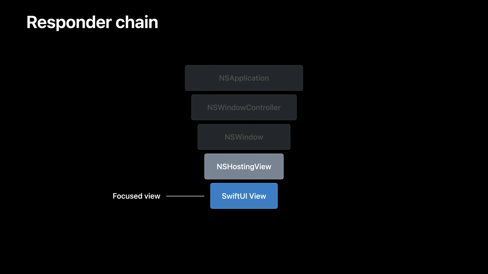

SwiftUI 提供了一些内置的 modifiers 来处理一些常见的命令，如复制、剪切、粘贴等：

```Swift
Image(...)
    .focusable()
    .copyable { ... }
    .cuttable { ... }
    .pasteDestination(payloadType: Image.self) { ... }
```

而 `onCommand` modifier 则提供了更为强大的能力，用于处理各种 selectors，无论是 AppKit 内置的一些（比如 menu bar 上的命令）还是用户在应用中自定义的 selectors（比如监听/发送消息等）：

```Swift
// Respond to standard commands

struct ShortcutsEditorView: View {
    var body: some View {
        ScrollView { ... }
            .onMoveCommand { moveSelection(direction: $0) }
            .onExitCommand { cancelOperations() }
            .onCommand(#selector(NSResponder.selectAll(_:)) { selectAllActions() }
            .onCommand(#selector(moveActionUp(_:)) { moveSelectedAction(.up) }
            .onCommand(#selector(moveActionDown(_:)) { moveSelectedAction(.down) }
    }
}
```

在测试焦点管理和键盘导航相关的功能时，注意在下面的系统设置中分别启用、禁用全键盘导航功能来各自测试一下，因为有许多控件只有在全键盘导航启用的时候才是 focusable 的：

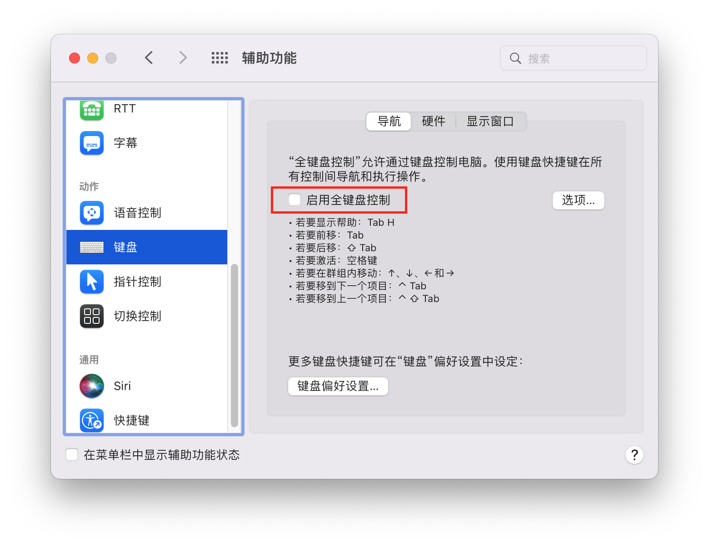

## 在 SwiftUI 中使用 AppKit

最后我们介绍一下如何在 SwiftUI 中使用 AppKit，主要通过两个协议来支持：[NSViewRepresentable](https://developer.apple.com/documentation/swiftui/nsviewrepresentable) 和 [NSViewControllerRepresentable](https://developer.apple.com/documentation/swiftui/nsviewcontrollerrepresentable)，顾名思义，NSViewRepresentable 用于结合一个 NSView，NSViewControllerRepresentable 用于结合一个 NSViewController。由于二者的协议方法、使用方式非常相似，接下来我们主要基于 NSViewRepresentable 来进行介绍。

NSViewRepresentable 声明的方法中，比较重要的有下面几个：

```Swift
/// 用于创建并初始化 view，该方法只在一开始时调用一次，后续的更新会调用下面的 updateNSView 方法
func makeNSView(context: Self.Context) -> Self.NSViewType
///  用于创建一个 coordinator 对象，接下来我们会详细介绍
func makeCoordinator() -> Self.Coordinator
/// 当应用的状态发生变化时，SwiftUI 会更新受到影响的部分，该方法便是在这种场景下被调用
func updateNSView(Self.NSViewType, context: Self.Context)
/// 今年新增的 API，用于提供偏好的尺寸信息
func sizeThatFits(ProposedViewSize, nsView: Self.NSViewType, context: Self.Context) -> CGSize?
/// 用于清理工作
static func dismantleNSView(Self.NSViewType, coordinator: Self.Coordinator)
```

NSViewRepresentable 典型的声明周期如下图所示：

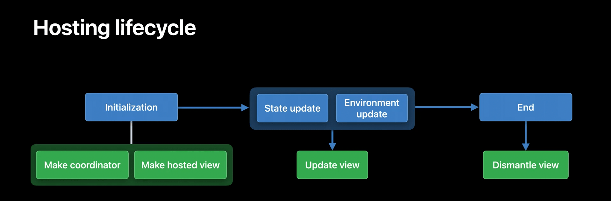

主要分为三个阶段：

- 初始化阶段：当该 view 首次展示时，系统会创建一个可选的 coordinator，然后创建所需的 NSView 实例。Coordinator 对象被创建之后，会在 view 的整个生命周期内都存在。在这个阶段，系统会调用 makeNSView 创建一个 NSView 实例，在该方法中执行 view 状态的初始化操作，如果提供了 coordinator 的话，也应该在该方法中实现 coordinator 和 view 的关系绑定；
- 更新阶段：当应用状态/环境状态发生变化时，如果该 viewRepresentable 受到影响，会执行更新操作，在 updateNSView 的 context 参数中包含 coordinator、环境状态等信息。因为更新操作会比较频繁，所以 updateNSView 方法应该越小越好；
- 结束阶段：当 view 不再显示的时候，承载的 NSView 实例和 coordinator 对象都会被释放，在这些对象释放之前，系统提供了 dismantleNSView 方法作为一个执行自定义清理工作的时机。

介绍了这么多，别的都相对比较直观，可 Coordinator 到底是做什么的呢？答案就是，它做什么由你来决定。SwiftUI 只是保证会在初始化阶段调用 makeCoordinator 来创建一个你提供的 Coordinator 实例对象，它的类型也是由你来指定的（associatedtype），之后在 makeNSView、updateNSView 等方法中会将该对象放到 context 参数中供你来使用。常见的用法有作为自定义 NSView 中的代理对象，监听 KVO，监听 Notification 等等。

我们以快捷指令中的脚本编辑器为例，来介绍一下在 SwiftUI 中嵌入 NSView 的整个流程。

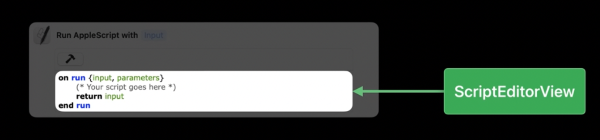

ScriptEditorView 的简要定义如下：

```Swift
class ScriptEditorView: NSView {
    var sourceCode: String
    var isEditable: Bool
    weak var delegate: ScriptEditorViewDelegate?
}

protocol ScriptEditorViewDelegate: AnyObject {
    func sourceCodeDidChange(in view: ScriptEditorView) -> Void
}
```

通过 ScriptEditorRepresentable 将 ScriptEditorView 包起来，并在 SwiftUI 中当作一个常规的 SwiftUI View 来用：

```Swift
struct ScriptEditorContainerView: View {
    @State var sourceCode: String = ""

    var body: some View {
        VStack {
            CompileButton { compile(code: sourceCode) }
            Divider()
            ScriptEditorRepresentable(sourceCode: $sourceCode)
        }
    }
}
```

ScriptEditorRepresentable 的简要定义如下：

```Swift
struct ScriptEditorRepresentable: NSViewRepresentable {
    @Binding var sourceCode: String

    func makeNSView(context: Context) -> ScriptEditorView {
        let scriptEditor = ScriptEditorView(frame: .zero)
        scriptEditor.delegate = context.coordinator
        return scriptEditor
    }

    func updateNSView(_ nsView: ScriptEditorView, context: Context) {
        if sourceCode != scriptEditor.sourceCode {
            scriptEditor.sourceCode = sourceCode
        }
        scriptEditor.isEditable = context.environment.isEnabled
        context.coordinator.representable = self
    }

    func makeCoordinator() -> Coordinator {
        Coordinator(representable: self)
    }
}

class Coordinator: NSObject, ScriptEditorViewDelegate {
    var representable: ScriptEditorRepresentable

    init(representable: ScriptEditorRepresentable) { ... }

    func sourceCodeDidChange(in view: ScriptEditorView) {
        representable.sourceCode = view.sourceCode
    }
}
```

其中我们重点关注一下 corrdinator 的用法。Coordinator 作为 ScriptEditorView 的代理（Delegate），并实现了所需的代理方法，此外还持有了一个 ScriptEditorRepresentable 实例。上文也介绍了，Coordinator 对 NSViewRepresentable 而言是一个透明对象，所以 NSViewPresentable 仅仅是创建了一个 coordinator 实例，而实例和 view、和 representable 本身之间的关系是需要我们开发者自己定义并维护的。这里在 makeCoordinator 方法中，通过将 representable 作为 Coordinator 的构造函数参数完成了绑定。对于其他场景可能也需要在 Coordinator 对象中持有 NSView 实例对象，此时可以在 makeNSView 方法中完成绑定。

## 小结

本文主要介绍了如何在 AppKit 中使用 SwiftUI 和如何在 SwiftUI 中使用 AppKit。SwiftUI 可以方便快捷地搭建 UI，如果你目前无法完全使用 SwiftUI 来重写整个应用，可以考虑循序渐进地在现有 AppKit 项目中应用 SwiftUI，比如侧边栏、Table cell 或者 Collection cell 等。此外，如果你在使用 SwiftUI 开发 app 的时候遇到了一些瓶颈、而 AppKit 的解决方案更加适合，或者想复用现有的 AppKit 组件，不妨使用 NSView(Controller)Representable 来将它们嵌入到 SwiftUI 中。
